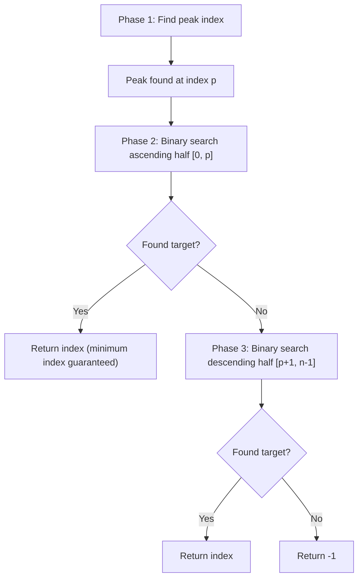

# Find in Mountain Array

**Difficulty:** Hard
**Source:** [NeetCode](https://neetcode.io/problems/find-in-mountain-array)

## Problem

> You may recall that an array `arr` is a **mountain array** if and only if:
> - `arr.length >= 3`
> - There exists some index `i` (0-indexed) with `0 < i < arr.length - 1` such that:
>   - `arr[0] < arr[1] < ... < arr[i]`
>   - `arr[i] > arr[i+1] > ... > arr[arr.length - 1]`
>
> Given a mountain array `mountainArr` and an integer `target`, return the **minimum index** such that `mountainArr.get(index) == target`. If such an index does not exist, return `-1`.
>
> You can only access the array via the `MountainArray` interface:
> - `MountainArray.get(index)` returns the element at index `index`
> - `MountainArray.length()` returns the length of the array
>
> Submissions that call `get` more than `100` times will be judged as Wrong Answer.
>
> **Example 1:**
> Input: `mountainArr = [1, 2, 3, 4, 5, 3, 1]`, `target = 3`
> Output: `2`
>
> **Example 2:**
> Input: `mountainArr = [0, 1, 2, 4, 2, 1]`, `target = 3`
> Output: `-1`
>
> **Constraints:**
> - `3 <= mountainArr.length() <= 10^4`
> - `0 <= target <= 10^9`
> - `0 <= mountainArr.get(index) <= 10^9`

## Prerequisites

Before attempting this problem, you should be comfortable with:

- **Binary Search on a Unimodal Function** — finding a peak in an array that first increases then decreases
- **Binary Search on Ascending / Descending Arrays** — adapting the comparison direction for a descending half
- **API / Black-box Access** — calling `.get()` is expensive; minimise calls

---

## 3. Three-Phase Binary Search — Optimal

### Intuition

A mountain array has three distinct phases you can exploit in order:

1. **Find the peak index** — binary search for the point where the array switches from increasing to decreasing. At `mid`, if `get(mid) < get(mid+1)` the peak is to the right; otherwise it's at `mid` or to the left.

2. **Search the ascending left half** — standard binary search in `[0, peak]`. Return the index if found.

3. **Search the descending right half** — binary search in `[peak+1, n-1]`, but flip the comparison direction (larger elements are on the *left* now).

Always search the ascending half first because the problem asks for the *minimum* index. There is no brute-force section here; a linear scan would risk exceeding the 100-call limit.

### Algorithm

**Phase 1 — Find peak:**
1. `lo = 0`, `hi = n - 2` (peak can't be the last index).
2. While `lo < hi`: `mid = (lo + hi) // 2`. If `get(mid) < get(mid+1)`: `lo = mid + 1`. Else: `hi = mid`.
3. `peak = lo`.

**Phase 2 — Ascending binary search `[0, peak]`:**
1. Standard binary search. If `get(mid) == target`, return `mid`. If `get(mid) < target`, `lo = mid+1`. Else `hi = mid-1`.

**Phase 3 — Descending binary search `[peak+1, n-1]`:**
1. Same structure but flip: if `get(mid) > target`, `lo = mid+1`. If `get(mid) < target`, `hi = mid-1`.



### Solution

```python,editable
class MountainArray:
    """Simulated interface for local testing."""
    def __init__(self, arr):
        self._arr = arr
        self._calls = 0

    def get(self, index):
        self._calls += 1
        return self._arr[index]

    def length(self):
        return len(self._arr)


def findInMountainArray(target, mountainArr):
    n = mountainArr.length()

    # Phase 1: Find peak index
    lo, hi = 0, n - 2
    while lo < hi:
        mid = (lo + hi) // 2
        if mountainArr.get(mid) < mountainArr.get(mid + 1):
            lo = mid + 1
        else:
            hi = mid
    peak = lo

    # Phase 2: Binary search ascending half [0, peak]
    lo, hi = 0, peak
    while lo <= hi:
        mid = (lo + hi) // 2
        val = mountainArr.get(mid)
        if val == target:
            return mid
        elif val < target:
            lo = mid + 1
        else:
            hi = mid - 1

    # Phase 3: Binary search descending half [peak+1, n-1]
    lo, hi = peak + 1, n - 1
    while lo <= hi:
        mid = (lo + hi) // 2
        val = mountainArr.get(mid)
        if val == target:
            return mid
        elif val > target:   # descending: larger values are on the left
            lo = mid + 1
        else:
            hi = mid - 1

    return -1


ma1 = MountainArray([1, 2, 3, 4, 5, 3, 1])
print(findInMountainArray(3, ma1))    # 2

ma2 = MountainArray([0, 1, 2, 4, 2, 1])
print(findInMountainArray(3, ma2))    # -1

ma3 = MountainArray([1, 5, 2])
print(findInMountainArray(2, ma3))    # 2
```

### Complexity
- Time: `O(log n)` — three independent binary searches, each `O(log n)`
- Space: `O(1)`
- API calls: at most `3 * log2(10^4) ≈ 42`, well within the 100-call limit

---

## Common Pitfalls

**Searching the right half before the left half.** The problem asks for the *minimum* index. If the target appears on both the ascending and descending sides, the ascending side has the smaller index. Always search left first.

**Setting `hi = n - 1` when finding the peak.** The peak can't be the very last element (by mountain array definition, the last element is on the descending slope). Use `hi = n - 2` so `mid + 1` is always a valid index.

**Flipping the wrong comparison in the descending search.** In a descending array, larger values are towards the left. When `get(mid) > target`, the target is to the right — so set `lo = mid + 1`. This is the reverse of the ascending case.

**Reusing `peak` as a boundary in both halves.** Search the ascending half as `[0, peak]` (inclusive) and the descending half as `[peak + 1, n - 1]`. Don't include `peak` in the descending search — it was already checked in phase 2.
