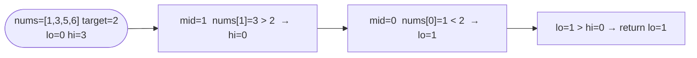

# Search Insert Position

**Difficulty:** Easy
**Source:** [NeetCode](https://neetcode.io/problems/search-insert-position)

## Problem

> Given a sorted array of distinct integers `nums` and a target value, return the index if the target is found. If not, return the index where it would be inserted in order.
>
> You must write an algorithm with `O(log n)` runtime complexity.
>
> **Example 1:**
> Input: `nums = [1, 3, 5, 6]`, `target = 5`
> Output: `2`
>
> **Example 2:**
> Input: `nums = [1, 3, 5, 6]`, `target = 2`
> Output: `1`
>
> **Example 3:**
> Input: `nums = [1, 3, 5, 6]`, `target = 7`
> Output: `4`
>
> **Constraints:**
> - `1 <= nums.length <= 10^4`
> - `-10^4 <= nums[i] <= 10^4`
> - `nums` contains **distinct** values sorted in ascending order
> - `-10^4 <= target <= 10^4`

## Prerequisites

Before attempting this problem, you should be comfortable with:

- **Binary Search** — halving the search space using sorted order
- **Loop Invariants** — understanding what `lo` represents when the loop exits

---

## 1. Brute Force

### Intuition

Walk the array from left to right. The first index where `nums[i] >= target` is either the exact match or the correct insertion point. If no such index exists, the target belongs at the end.

### Algorithm

1. For each index `i` from `0` to `len(nums) - 1`:
   - If `nums[i] >= target`, return `i`.
2. Return `len(nums)` (insert at the end).

### Solution

```python,editable
def searchInsert_linear(nums, target):
    for i in range(len(nums)):
        if nums[i] >= target:
            return i
    return len(nums)


print(searchInsert_linear([1, 3, 5, 6], 5))  # 2
print(searchInsert_linear([1, 3, 5, 6], 2))  # 1
print(searchInsert_linear([1, 3, 5, 6], 7))  # 4
print(searchInsert_linear([1, 3, 5, 6], 0))  # 0
```

### Complexity
- Time: `O(n)`
- Space: `O(1)`

---

## 2. Binary Search

### Intuition

Run a standard binary search. The key insight is what happens when the target is not found: the loop terminates with `lo > hi`, and at that point `lo` is exactly where the target should be inserted. This is because `lo` always points to the leftmost index that is still a valid candidate, and when the search space collapses, `lo` has landed on the first position where `nums[lo] > target`.

### Algorithm

1. Set `lo = 0`, `hi = len(nums) - 1`.
2. While `lo <= hi`:
   - Compute `mid = lo + (hi - lo) // 2`.
   - If `nums[mid] == target`, return `mid`.
   - If `nums[mid] < target`, set `lo = mid + 1`.
   - Else set `hi = mid - 1`.
3. Return `lo` (the insertion position).



### Solution

```python,editable
def searchInsert(nums, target):
    lo, hi = 0, len(nums) - 1
    while lo <= hi:
        mid = lo + (hi - lo) // 2
        if nums[mid] == target:
            return mid
        elif nums[mid] < target:
            lo = mid + 1
        else:
            hi = mid - 1
    return lo


print(searchInsert([1, 3, 5, 6], 5))  # 2
print(searchInsert([1, 3, 5, 6], 2))  # 1
print(searchInsert([1, 3, 5, 6], 7))  # 4
print(searchInsert([1, 3, 5, 6], 0))  # 0
```

### Complexity
- Time: `O(log n)`
- Space: `O(1)`

---

## Common Pitfalls

**Returning `-1` when the target is not found.** Unlike a plain search problem, here a miss is not a failure — `lo` gives you the answer. Never return `-1`.

**Forgetting the insert-at-end case in the brute-force.** If the loop finishes without finding `nums[i] >= target`, the target is larger than every element. Return `len(nums)`, not `len(nums) - 1`.

**Confusing the insertion index with the insertion value.** You return *where* to insert, not *what* to insert. The return value is an index into `nums`.
