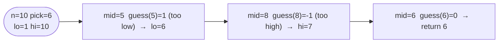

# Guess Number Higher or Lower

**Difficulty:** Easy
**Source:** [NeetCode](https://neetcode.io/problems/guess-number-higher-or-lower)

## Problem

> We are playing a guessing game. I pick a number from `1` to `n`. You have to guess which number I picked.
>
> Every time you guess wrong, I will tell you whether the number I picked is higher or lower than your guess.
>
> You call a pre-defined API `guess(num)` which returns three possible results:
> - `-1`: Your guess is higher than the number I picked (i.e. `num > pick`)
> - `1`: Your guess is lower than the number I picked (i.e. `num < pick`)
> - `0`: Your guess is equal to the number I picked (i.e. `num == pick`)
>
> Return the number that I picked.
>
> **Example 1:**
> Input: `n = 10`, `pick = 6`
> Output: `6`
>
> **Example 2:**
> Input: `n = 1`, `pick = 1`
> Output: `1`
>
> **Example 3:**
> Input: `n = 2`, `pick = 1`
> Output: `1`
>
> **Constraints:**
> - `1 <= n <= 2^31 - 1`
> - `1 <= pick <= n`

## Prerequisites

Before attempting this problem, you should be comfortable with:

- **Binary Search** — using feedback to eliminate half the search space each iteration
- **API / Black-box Functions** — treating `guess()` as an oracle rather than inspecting its internals

---

## 2. Binary Search

### Intuition

The numbers `1` to `n` form a sorted sequence. Each call to `guess(mid)` tells you exactly which half contains the answer, so binary search is a natural fit. There's no brute-force section here because the problem *requires* logarithmic behaviour — a linear scan would time-out for large `n`.

### Algorithm

1. Set `lo = 1`, `hi = n`.
2. While `lo <= hi`:
   - Compute `mid = lo + (hi - lo) // 2`.
   - Call `result = guess(mid)`.
   - If `result == 0`, return `mid` — that's the picked number.
   - If `result == 1`, the pick is higher, so set `lo = mid + 1`.
   - If `result == -1`, the pick is lower, so set `hi = mid - 1`.
3. The loop always terminates because `pick` is guaranteed to be in `[1, n]`.



### Solution

```python,editable
def guessNumber(n, pick):
    # Simulated API — in the real problem this is provided by the judge
    def guess(num):
        if num > pick:
            return -1
        elif num < pick:
            return 1
        else:
            return 0

    lo, hi = 1, n
    while lo <= hi:
        mid = lo + (hi - lo) // 2
        result = guess(mid)
        if result == 0:
            return mid
        elif result == 1:
            lo = mid + 1
        else:
            hi = mid - 1


print(guessNumber(10, 6))   # 6
print(guessNumber(1, 1))    # 1
print(guessNumber(2, 1))    # 1
```

### Complexity
- Time: `O(log n)`
- Space: `O(1)`

---

## Common Pitfalls

**Mixing up the return values of `guess()`.** `-1` means your guess was *too high* (bring `hi` down), and `1` means your guess was *too low* (bring `lo` up). It's the opposite of what many people expect — the sign reflects the relationship of `pick` to `num`, not `num` to `pick`.

**Integer overflow on `mid = (lo + hi) // 2`.** For `n` up to `2^31 - 1`, `lo + hi` can overflow in languages with 32-bit integers. Python handles big integers natively, but use `lo + (hi - lo) // 2` as a portable habit.

**Returning outside the loop.** Because `pick` is always in range, the loop is guaranteed to find the answer. You don't need a fallback return, but adding one (e.g. `-1`) is harmless and prevents linter warnings.
