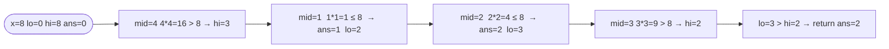

# Sqrt(x)

**Difficulty:** Easy
**Source:** [NeetCode](https://neetcode.io/problems/sqrt-x)

## Problem

> Given a non-negative integer `x`, return the square root of `x` rounded down to the nearest integer. The returned integer should be non-negative as well.
>
> You must not use any built-in exponent function or operator, such as `pow(x, 0.5)` or `x ** 0.5`.
>
> **Example 1:**
> Input: `x = 4`
> Output: `2`
>
> **Example 2:**
> Input: `x = 8`
> Output: `2`
> Explanation: The square root of 8 is 2.828…, and since we round down, 2 is returned.
>
> **Constraints:**
> - `0 <= x <= 2^31 - 1`

## Prerequisites

Before attempting this problem, you should be comfortable with:

- **Binary Search on the Answer** — searching a range of candidate values rather than array indices
- **Integer Arithmetic** — comparing squares without using floating-point

---

## 1. Brute Force

### Intuition

Start from `1` and walk upward, squaring each candidate. The moment `m * m` exceeds `x`, the previous candidate was the floor of the square root. This works, but the loop runs `O(√x)` times — slow for large inputs.

### Algorithm

1. Handle `x == 0` separately, returning `0`.
2. For `m` from `1` upward:
   - If `m * m > x`, return `m - 1`.

### Solution

```python,editable
def mySqrt_linear(x):
    if x == 0:
        return 0
    m = 1
    while m * m <= x:
        m += 1
    return m - 1


print(mySqrt_linear(4))   # 2
print(mySqrt_linear(8))   # 2
print(mySqrt_linear(0))   # 0
```

### Complexity
- Time: `O(√x)`
- Space: `O(1)`

---

## 2. Binary Search

### Intuition

The function `f(m) = m * m` is monotonically increasing, so we can binary-search the range `[0, x]` for the largest `m` where `m * m <= x`. Every time `mid * mid <= x` we record `mid` as a candidate answer and try going higher; otherwise we go lower. When the search ends, the last recorded candidate is the floor square root.

### Algorithm

1. Set `lo = 0`, `hi = x`, `ans = 0`.
2. While `lo <= hi`:
   - Compute `mid = lo + (hi - lo) // 2`.
   - If `mid * mid <= x`: set `ans = mid`, then `lo = mid + 1` (try larger).
   - Else: set `hi = mid - 1` (too big, go smaller).
3. Return `ans`.



### Solution

```python,editable
def mySqrt(x):
    lo, hi, ans = 0, x, 0
    while lo <= hi:
        mid = lo + (hi - lo) // 2
        if mid * mid <= x:
            ans = mid
            lo = mid + 1
        else:
            hi = mid - 1
    return ans


print(mySqrt(4))   # 2
print(mySqrt(8))   # 2
print(mySqrt(0))   # 0
```

### Complexity
- Time: `O(log x)`
- Space: `O(1)`

---

## Common Pitfalls

**Setting `hi = x` causes many unnecessary iterations for large `x`.** A tighter upper bound is `x // 2 + 1` (for `x > 1`), since `√x <= x/2` for all `x >= 4`. Still `O(log x)` but with a smaller constant.

**Using floating-point arithmetic.** `mid ** 0.5` introduces rounding errors. Stick to integer multiplication `mid * mid` to keep everything exact.

**Not handling `x == 0` or `x == 1`.** Both are valid inputs. With `hi = x` and the algorithm above they are handled correctly (the loop runs once), but always verify edge cases.
