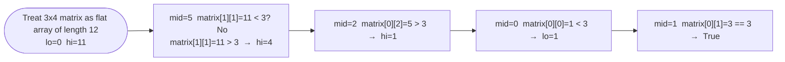

# Search a 2D Matrix

**Difficulty:** Medium
**Source:** [NeetCode](https://neetcode.io/problems/search-2d-matrix)

## Problem

> You are given an `m x n` integer matrix `matrix` with the following two properties:
> - Each row is sorted in non-decreasing order.
> - The first integer of each row is greater than the last integer of the previous row.
>
> Given an integer `target`, return `true` if `target` is in `matrix` or `false` otherwise.
>
> You must write a solution in `O(log(m * n))` time complexity.
>
> **Example 1:**
> Input: `matrix = [[1,3,5,7],[10,11,16,20],[23,30,34,60]]`, `target = 3`
> Output: `true`
>
> **Example 2:**
> Input: `matrix = [[1,3,5,7],[10,11,16,20],[23,30,34,60]]`, `target = 13`
> Output: `false`
>
> **Constraints:**
> - `m == matrix.length`, `n == matrix[i].length`
> - `1 <= m, n <= 100`
> - `-10^4 <= matrix[i][j], target <= 10^4`

## Prerequisites

Before attempting this problem, you should be comfortable with:

- **Binary Search** — halving the search space each iteration
- **2D Index Mapping** — converting a flat index `i` into `(row, col)` using division and modulo

---

## 1. Brute Force

### Intuition

Scan every cell row by row and column by column. Straightforward but completely ignores the sorted structure.

### Algorithm

1. For each row `r` in `matrix`:
   - For each element `val` in row `r`:
     - If `val == target`, return `True`.
2. Return `False`.

### Solution

```python,editable
def searchMatrix_brute(matrix, target):
    for row in matrix:
        for val in row:
            if val == target:
                return True
    return False


m = [[1, 3, 5, 7], [10, 11, 16, 20], [23, 30, 34, 60]]
print(searchMatrix_brute(m, 3))   # True
print(searchMatrix_brute(m, 13))  # False
```

### Complexity
- Time: `O(m * n)`
- Space: `O(1)`

---

## 2. Binary Search (Row-First)

### Intuition

Because each row is sorted and every row's first element exceeds the previous row's last, you can first binary-search for the correct row (the one whose range contains the target), then binary-search inside that row.

### Algorithm

1. Binary search rows: find the last row where `row[0] <= target`.
2. Binary search that row for `target`.
3. Return whether the target was found.

### Solution

```python,editable
def searchMatrix_rowFirst(matrix, target):
    m, n = len(matrix), len(matrix[0])

    # Find the candidate row
    top, bot = 0, m - 1
    row = -1
    while top <= bot:
        mid = (top + bot) // 2
        if matrix[mid][0] <= target <= matrix[mid][n - 1]:
            row = mid
            break
        elif matrix[mid][0] > target:
            bot = mid - 1
        else:
            top = mid + 1

    if row == -1:
        return False

    # Binary search inside that row
    lo, hi = 0, n - 1
    while lo <= hi:
        mid = (lo + hi) // 2
        if matrix[row][mid] == target:
            return True
        elif matrix[row][mid] < target:
            lo = mid + 1
        else:
            hi = mid - 1
    return False


m = [[1, 3, 5, 7], [10, 11, 16, 20], [23, 30, 34, 60]]
print(searchMatrix_rowFirst(m, 3))   # True
print(searchMatrix_rowFirst(m, 13))  # False
```

### Complexity
- Time: `O(log m + log n)`
- Space: `O(1)`

---

## 3. Binary Search (Flat Index) — Optimal

### Intuition

Since the entire matrix is sorted when read row by row, you can treat it as a single flat sorted array of length `m * n` and run one binary search. Map any flat index `i` back to 2D with `row = i // n`, `col = i % n`. This is the cleanest single-pass solution.

### Algorithm

1. Set `lo = 0`, `hi = m * n - 1`.
2. While `lo <= hi`:
   - Compute `mid = lo + (hi - lo) // 2`.
   - Map to 2D: `r = mid // n`, `c = mid % n`.
   - Compare `matrix[r][c]` with `target` and update bounds.
3. Return `True` on a match, `False` if the loop ends.



### Solution

```python,editable
def searchMatrix(matrix, target):
    m, n = len(matrix), len(matrix[0])
    lo, hi = 0, m * n - 1
    while lo <= hi:
        mid = lo + (hi - lo) // 2
        val = matrix[mid // n][mid % n]
        if val == target:
            return True
        elif val < target:
            lo = mid + 1
        else:
            hi = mid - 1
    return False


m = [[1, 3, 5, 7], [10, 11, 16, 20], [23, 30, 34, 60]]
print(searchMatrix(m, 3))   # True
print(searchMatrix(m, 13))  # False
print(searchMatrix([[1]], 1))  # True
```

### Complexity
- Time: `O(log(m * n))`
- Space: `O(1)`

---

## Common Pitfalls

**Confusing this with Search a 2D Matrix II (LeetCode 240).** That problem does *not* guarantee that row `i+1` starts after row `i` ends — the two problems require different algorithms.

**Off-by-one in `hi`.** The flat array has indices `0` to `m * n - 1`. Setting `hi = m * n` instead of `m * n - 1` causes an index-out-of-bounds on the very first mid calculation in the worst case.

**Wrong column count in the index mapping.** The formula is `row = mid // n` and `col = mid % n` where `n` is the number of *columns*, not rows. Using `m` by mistake gives wrong results.
