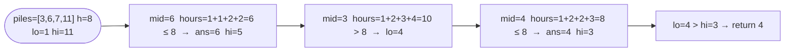

# Koko Eating Bananas

**Difficulty:** Medium
**Source:** [NeetCode](https://neetcode.io/problems/eating-bananas)

## Problem

> Koko loves to eat bananas. There are `n` piles of bananas, the `i`-th pile has `piles[i]` bananas. The guards have gone and will come back in `h` hours.
>
> Koko can decide her bananas-per-hour eating speed of `k`. Each hour, she chooses some pile of bananas and eats `k` bananas from that pile. If the pile has less than `k` bananas, she eats all of them instead and will not eat any more bananas during this hour.
>
> Koko likes to eat slowly but still wants to finish eating all the bananas before the guards return.
>
> Return the minimum integer `k` such that she can eat all the bananas within `h` hours.
>
> **Example 1:**
> Input: `piles = [3, 6, 7, 11]`, `h = 8`
> Output: `4`
>
> **Example 2:**
> Input: `piles = [30, 11, 23, 4, 20]`, `h = 5`
> Output: `30`
>
> **Constraints:**
> - `1 <= piles.length <= 10^4`
> - `piles.length <= h <= 10^9`
> - `1 <= piles[i] <= 10^9`

## Prerequisites

Before attempting this problem, you should be comfortable with:

- **Binary Search on the Answer** — the search space is a range of possible values, not array indices
- **Ceiling Division** — computing `ceil(pile / k)` using integer arithmetic: `(pile + k - 1) // k` or `math.ceil(pile / k)`

---

## 1. Brute Force

### Intuition

Try every possible speed from `1` upward. For each speed `k`, compute the total hours needed by summing `ceil(pile / k)` for every pile. The first `k` where total hours `<= h` is the answer. This is correct but extremely slow for large pile values.

### Algorithm

1. For `k` from `1` to `max(piles)`:
   - Compute `hours = sum(ceil(pile / k) for pile in piles)`.
   - If `hours <= h`, return `k`.

### Solution

```python,editable
import math

def minEatingSpeed_brute(piles, h):
    for k in range(1, max(piles) + 1):
        hours = sum(math.ceil(pile / k) for pile in piles)
        if hours <= h:
            return k


print(minEatingSpeed_brute([3, 6, 7, 11], 8))        # 4
print(minEatingSpeed_brute([30, 11, 23, 4, 20], 5))  # 30
```

### Complexity
- Time: `O(max(piles) * n)`
- Space: `O(1)`

---

## 2. Binary Search on Speed

### Intuition

The feasibility function `canFinish(k)` is monotone: if speed `k` works, then speed `k+1` also works. This is the classic signal to binary-search on the answer. The search space is `[1, max(piles)]` — at speed `max(piles)` Koko finishes every pile in one hour, so she can always finish in `n <= h` hours. At speed `1` she needs `sum(piles)` hours which might be too slow. Binary search finds the minimum feasible speed in `O(log(max(piles)))` feasibility checks, each costing `O(n)`.

### Algorithm

1. Set `lo = 1`, `hi = max(piles)`, `ans = hi`.
2. While `lo <= hi`:
   - Compute `mid = lo + (hi - lo) // 2`.
   - Compute `hours = sum(ceil(pile / mid) for pile in piles)`.
   - If `hours <= h`: record `ans = mid`, then search left (`hi = mid - 1`) for a smaller valid speed.
   - Else: search right (`lo = mid + 1`) — too slow.
3. Return `ans`.



### Solution

```python,editable
import math

def minEatingSpeed(piles, h):
    lo, hi = 1, max(piles)
    ans = hi
    while lo <= hi:
        mid = lo + (hi - lo) // 2
        hours = sum(math.ceil(pile / mid) for pile in piles)
        if hours <= h:
            ans = mid
            hi = mid - 1
        else:
            lo = mid + 1
    return ans


print(minEatingSpeed([3, 6, 7, 11], 8))        # 4
print(minEatingSpeed([30, 11, 23, 4, 20], 5))  # 30
print(minEatingSpeed([1, 1, 1, 1], 4))         # 1
```

### Complexity
- Time: `O(n log(max(piles)))`
- Space: `O(1)`

---

## Common Pitfalls

**Using `hours = sum(pile // k for pile in piles)`.** Floor division undercounts — Koko must stay for the full hour even if she finishes a pile partway through. Always use ceiling division: `math.ceil(pile / k)` or `(pile + k - 1) // k`.

**Setting `hi = sum(piles)` instead of `max(piles)`.** Koko eats at most one pile per hour, so a speed higher than the largest pile never helps. `max(piles)` is the tight upper bound and keeps `log` small.

**Forgetting to update `ans` before narrowing left.** When `hours <= h`, you've found a valid speed but maybe not the minimum. Record it and keep looking left with `hi = mid - 1`.
