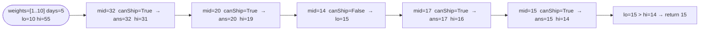

# Capacity to Ship Packages Within D Days

**Difficulty:** Medium
**Source:** [NeetCode](https://neetcode.io/problems/capacity-to-ship-packages-within-d-days)

## Problem

> A conveyor belt has packages that must be shipped from one port to another within `days` days.
>
> The `i`-th package on the conveyor belt has a weight of `weights[i]`. Each day, we load the ship with packages in the order given by the conveyor belt. We may not load more weight than the maximum weight capacity of the ship.
>
> Return the least weight capacity of the ship that will result in all the packages on the conveyor belt being shipped within `days` days.
>
> **Example 1:**
> Input: `weights = [1, 2, 3, 4, 5, 6, 7, 8, 9, 10]`, `days = 5`
> Output: `15`
>
> **Example 2:**
> Input: `weights = [3, 2, 2, 4, 1, 4]`, `days = 3`
> Output: `6`
>
> **Constraints:**
> - `1 <= days <= weights.length <= 500`
> - `1 <= weights[i] <= 500`

## Prerequisites

Before attempting this problem, you should be comfortable with:

- **Binary Search on the Answer** — the answer (capacity) lies in a numeric range and the feasibility check is monotone
- **Greedy Simulation** — greedily packing as many packages as possible each day to check feasibility

---

## 1. Brute Force

### Intuition

Try every capacity from `max(weights)` (the minimum possible — we must at least fit the heaviest single package) up to `sum(weights)` (ship everything in one day). For each candidate capacity, simulate the loading process and count how many days are needed. The first capacity where days needed `<= days` is the answer.

### Algorithm

1. For `cap` from `max(weights)` to `sum(weights)`:
   - Simulate loading: greedily fill each day's load without exceeding `cap`.
   - Count the number of days used.
   - If days used `<= days`, return `cap`.

### Solution

```python,editable
def shipWithinDays_brute(weights, days):
    def canShip(cap):
        day_count, current = 1, 0
        for w in weights:
            if current + w > cap:
                day_count += 1
                current = 0
            current += w
        return day_count <= days

    for cap in range(max(weights), sum(weights) + 1):
        if canShip(cap):
            return cap


print(shipWithinDays_brute([1, 2, 3, 4, 5, 6, 7, 8, 9, 10], 5))  # 15
print(shipWithinDays_brute([3, 2, 2, 4, 1, 4], 3))                # 6
```

### Complexity
- Time: `O((sum - max) * n)` — can be very slow
- Space: `O(1)`

---

## 2. Binary Search on Capacity

### Intuition

The feasibility function `canShip(cap)` is monotone: if we can ship in `days` days with capacity `cap`, we can also ship with any higher capacity. That monotonicity is the binary search signal. The search space is `[max(weights), sum(weights)]`. Binary-search for the smallest feasible capacity by recording valid candidates and always trying smaller ones.

### Algorithm

1. Define `canShip(cap)`: greedily fill each day; start a new day when the next package would exceed `cap`. Return whether the day count `<= days`.
2. Set `lo = max(weights)`, `hi = sum(weights)`, `ans = hi`.
3. While `lo <= hi`:
   - `mid = lo + (hi - lo) // 2`.
   - If `canShip(mid)`: `ans = mid`, `hi = mid - 1`.
   - Else: `lo = mid + 1`.
4. Return `ans`.



### Solution

```python,editable
def shipWithinDays(weights, days):
    def canShip(cap):
        day_count, current = 1, 0
        for w in weights:
            if current + w > cap:
                day_count += 1
                current = 0
            current += w
        return day_count <= days

    lo, hi = max(weights), sum(weights)
    ans = hi
    while lo <= hi:
        mid = lo + (hi - lo) // 2
        if canShip(mid):
            ans = mid
            hi = mid - 1
        else:
            lo = mid + 1
    return ans


print(shipWithinDays([1, 2, 3, 4, 5, 6, 7, 8, 9, 10], 5))  # 15
print(shipWithinDays([3, 2, 2, 4, 1, 4], 3))                # 6
print(shipWithinDays([1, 2, 3, 1, 1], 4))                   # 3
```

### Complexity
- Time: `O(n log(sum(weights)))`
- Space: `O(1)`

---

## Common Pitfalls

**Setting `lo = 1` instead of `max(weights)`.** A capacity smaller than the heaviest package can never work — that package simply cannot be loaded. Starting from `max(weights)` avoids checking infeasible capacities and makes the lower bound tight.

**Not starting a new day correctly in the simulation.** When a package causes an overflow, start a new day with *that package* as the first item (`current = w` after resetting, not `current = 0`). A subtle bug: resetting to `0` and then adding `w` in the next loop iteration is equivalent — but only if you do add it. Double-check your loop flow.

**Confusing this with the Koko problem.** The structure is identical (binary search on the answer, monotone feasibility check), but the feasibility check here is a greedy packing simulation rather than a sum of ceilings.
