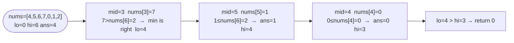

# Find Minimum in Rotated Sorted Array

**Difficulty:** Medium
**Source:** [NeetCode](https://neetcode.io/problems/find-minimum-in-rotated-sorted-array)

## Problem

> Suppose an array of length `n` sorted in ascending order is **rotated** between `1` and `n` times. For example, the array `[0, 1, 2, 4, 5, 6, 7]` might become `[4, 5, 6, 7, 0, 1, 2]` if rotated 4 times.
>
> Given the sorted rotated array `nums` of **unique** elements, return the minimum element of this array.
>
> You must write an algorithm that runs in `O(log n)` time.
>
> **Example 1:**
> Input: `nums = [3, 4, 5, 1, 2]`
> Output: `1`
>
> **Example 2:**
> Input: `nums = [4, 5, 6, 7, 0, 1, 2]`
> Output: `0`
>
> **Example 3:**
> Input: `nums = [11, 13, 15, 17]`
> Output: `11`
>
> **Constraints:**
> - `n == nums.length`
> - `1 <= n <= 5000`
> - `-5000 <= nums[i] <= 5000`
> - All integers in `nums` are **unique**
> - `nums` is sorted and rotated between `1` and `n` times

## Prerequisites

Before attempting this problem, you should be comfortable with:

- **Rotated Arrays** — understanding how a rotation creates two sorted subarrays joined at a pivot
- **Binary Search on a Modified Condition** — using a property other than direct value comparison to decide which half to search

---

## 1. Brute Force

### Intuition

Just scan every element and track the minimum. The rotation structure is irrelevant — a linear scan finds the answer trivially. The challenge is doing better.

### Algorithm

1. Return `min(nums)`.

### Solution

```python,editable
def findMin_linear(nums):
    return min(nums)


print(findMin_linear([3, 4, 5, 1, 2]))       # 1
print(findMin_linear([4, 5, 6, 7, 0, 1, 2])) # 0
print(findMin_linear([11, 13, 15, 17]))       # 11
```

### Complexity
- Time: `O(n)`
- Space: `O(1)`

---

## 2. Binary Search

### Intuition

A rotated sorted array consists of two sorted halves. The minimum element sits at the start of the second (right) half — it's the only element smaller than its predecessor. The key observation: if `nums[mid] > nums[hi]`, the minimum must be in the right half (because the right half starts lower than `mid`). Otherwise, the minimum is in the left half including `mid`. Track the running minimum as you go.

### Algorithm

1. Set `lo = 0`, `hi = len(nums) - 1`, `ans = nums[0]`.
2. While `lo <= hi`:
   - `mid = lo + (hi - lo) // 2`.
   - Update `ans = min(ans, nums[mid])`.
   - If `nums[mid] > nums[hi]`: minimum is in the right half → `lo = mid + 1`.
   - Else: minimum is in the left half (including `mid`, already recorded) → `hi = mid - 1`.
3. Return `ans`.



### Solution

```python,editable
def findMin(nums):
    lo, hi = 0, len(nums) - 1
    ans = nums[0]
    while lo <= hi:
        mid = lo + (hi - lo) // 2
        ans = min(ans, nums[mid])
        if nums[mid] > nums[hi]:
            lo = mid + 1
        else:
            hi = mid - 1
    return ans


print(findMin([3, 4, 5, 1, 2]))       # 1
print(findMin([4, 5, 6, 7, 0, 1, 2])) # 0
print(findMin([11, 13, 15, 17]))       # 11
```

### Complexity
- Time: `O(log n)`
- Space: `O(1)`

---

## Common Pitfalls

**Comparing `nums[mid]` with `nums[lo]` instead of `nums[hi]`.** Using `lo` as the reference is trickier because the array could be fully sorted (no rotation), making `nums[lo] < nums[mid]` ambiguous. Comparing with `nums[hi]` cleanly identifies which half contains the pivot.

**Not handling the no-rotation case.** If the array is fully sorted, `nums[mid] <= nums[hi]` always, so `hi` keeps shrinking and you eventually reach `nums[0]` — the minimum. The algorithm handles it naturally.

**Stopping too early.** Don't return `nums[mid]` the moment `nums[lo] <= nums[hi]` (the current window is sorted). Always continue to narrow the window — the minimum might still be anywhere inside.
