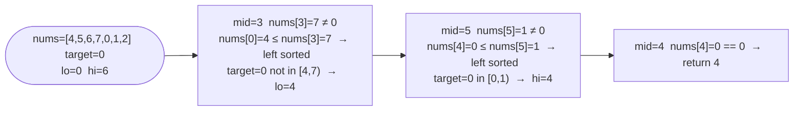

# Search in Rotated Sorted Array

**Difficulty:** Medium
**Source:** [NeetCode](https://neetcode.io/problems/find-target-in-rotated-sorted-array)

## Problem

> There is an integer array `nums` sorted in ascending order (with **distinct** values).
>
> Prior to being passed to your function, `nums` is possibly rotated at an unknown pivot index `k` such that the resulting array is `[nums[k], nums[k+1], ..., nums[n-1], nums[0], nums[1], ..., nums[k-1]]`.
>
> Given the array `nums` after the possible rotation and an integer `target`, return the index of `target` if it is in `nums`, or `-1` if it is not in `nums`.
>
> You must write an algorithm with `O(log n)` runtime complexity.
>
> **Example 1:**
> Input: `nums = [4, 5, 6, 7, 0, 1, 2]`, `target = 0`
> Output: `4`
>
> **Example 2:**
> Input: `nums = [4, 5, 6, 7, 0, 1, 2]`, `target = 3`
> Output: `-1`
>
> **Constraints:**
> - `1 <= nums.length <= 5000`
> - `-10^4 <= nums[i] <= 10^4`
> - All values of `nums` are **unique**
> - `nums` is an ascending array that is possibly rotated
> - `-10^4 <= target <= 10^4`

## Prerequisites

Before attempting this problem, you should be comfortable with:

- **Binary Search** — standard half-elimination approach
- **Rotated Arrays** — recognizing which half of the array is sorted at any given `mid`

---

## 1. Brute Force

### Intuition

Ignore the rotation entirely and scan every element linearly.

### Algorithm

1. For each index `i`, if `nums[i] == target`, return `i`.
2. Return `-1`.

### Solution

```python,editable
def search_linear(nums, target):
    for i, v in enumerate(nums):
        if v == target:
            return i
    return -1


print(search_linear([4, 5, 6, 7, 0, 1, 2], 0))  # 4
print(search_linear([4, 5, 6, 7, 0, 1, 2], 3))  # -1
```

### Complexity
- Time: `O(n)`
- Space: `O(1)`

---

## 2. Binary Search

### Intuition

At any split point `mid`, at least one of the two halves — `[lo, mid]` or `[mid, hi]` — must be fully sorted. You can tell which by comparing `nums[lo]` with `nums[mid]`. Once you know which half is sorted, check whether the target falls inside that half's value range. If it does, search that half; otherwise search the other. This gives the usual `O(log n)` binary search despite the rotation.

### Algorithm

1. Set `lo = 0`, `hi = len(nums) - 1`.
2. While `lo <= hi`:
   - `mid = lo + (hi - lo) // 2`.
   - If `nums[mid] == target`, return `mid`.
   - **Left half is sorted** (`nums[lo] <= nums[mid]`):
     - If `nums[lo] <= target < nums[mid]`: search left → `hi = mid - 1`.
     - Else: search right → `lo = mid + 1`.
   - **Right half is sorted** (otherwise):
     - If `nums[mid] < target <= nums[hi]`: search right → `lo = mid + 1`.
     - Else: search left → `hi = mid - 1`.
3. Return `-1`.



### Solution

```python,editable
def search(nums, target):
    lo, hi = 0, len(nums) - 1
    while lo <= hi:
        mid = lo + (hi - lo) // 2
        if nums[mid] == target:
            return mid
        # Left half is sorted
        if nums[lo] <= nums[mid]:
            if nums[lo] <= target < nums[mid]:
                hi = mid - 1
            else:
                lo = mid + 1
        # Right half is sorted
        else:
            if nums[mid] < target <= nums[hi]:
                lo = mid + 1
            else:
                hi = mid - 1
    return -1


print(search([4, 5, 6, 7, 0, 1, 2], 0))  # 4
print(search([4, 5, 6, 7, 0, 1, 2], 3))  # -1
print(search([1], 0))                     # -1
```

### Complexity
- Time: `O(log n)`
- Space: `O(1)`

---

## Common Pitfalls

**Using strict inequality `nums[lo] < nums[mid]` to detect the sorted half.** When `lo == mid` (single element window), `nums[lo] == nums[mid]`, so you need `<=` to correctly identify the left half as sorted.

**Wrong range check for the sorted half.** For the left half, the target must satisfy `nums[lo] <= target < nums[mid]` (exclusive upper bound because `mid` itself was already checked). For the right half: `nums[mid] < target <= nums[hi]` (exclusive lower bound). Getting these bounds wrong causes you to search the wrong half.

**Forgetting to return `-1` after the loop.** Unlike "find minimum", this problem can legitimately miss the target entirely.
