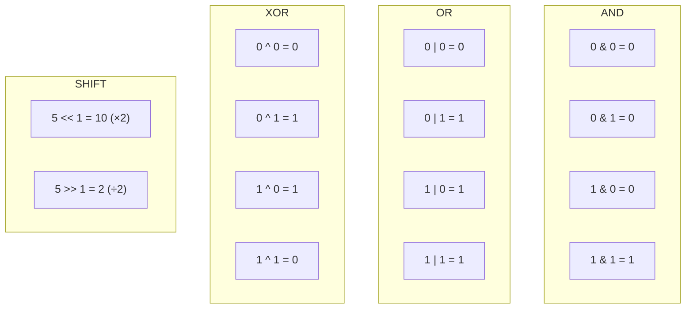

# Bit Manipulation

Computers speak binary. Bit manipulation lets you talk directly to the hardware — unlocking operations 100x faster than arithmetic.

Every number stored in a computer is ultimately a sequence of 0s and 1s. Most of the time, high-level languages hide this from you. But when you need raw speed, minimal memory, or elegant solutions to certain problems, reaching past the abstraction layer and working directly on bits is one of the most powerful tools available.

---

## Binary Representation

Before manipulating bits, you need to read them. In Python, `bin()` shows the binary representation of any integer.

```python,editable
numbers = [0, 1, 2, 3, 4, 5, 8, 15, 16, 255]

print(f"{'Decimal':>10}  {'Binary':>10}  {'Hex':>6}")
print("-" * 32)
for n in numbers:
    print(f"{n:>10}  {bin(n):>10}  {hex(n):>6}")
```

Every power of 2 has exactly one `1` bit. `255` is eight consecutive 1s — the maximum value of one byte. Recognising these patterns instantly is a core skill.

---

## The Six Bitwise Operators

Python provides six operators that work directly on the binary representation.

| Operator | Symbol | What it does |
|---|---|---|
| AND | `&` | Keeps a bit only if **both** inputs have it |
| OR | `\|` | Keeps a bit if **either** input has it |
| XOR | `^` | Keeps a bit only if the inputs **differ** |
| NOT | `~` | Flips every bit (returns `-(n+1)` in Python) |
| Left shift | `<<` | Shifts bits left, filling with 0s (multiplies by 2) |
| Right shift | `>>` | Shifts bits right, dropping low bits (divides by 2) |

### Truth Table for Each Operator



XOR is the most interesting operator: it outputs `1` only when inputs differ, and `0` when they are the same. This makes it perfect for toggling and cancellation.

---

## Quick Intuition

```python,editable
a = 0b1010   # 10 in decimal
b = 0b1100   # 12 in decimal

print(f"a        = {a:04b}  ({a})")
print(f"b        = {b:04b}  ({b})")
print(f"a & b    = {a & b:04b}  ({a & b})   AND: only bits both have")
print(f"a | b    = {a | b:04b}  ({a | b})  OR:  bits either has")
print(f"a ^ b    = {a ^ b:04b}  ({a ^ b})   XOR: bits exactly one has")
print(f"a << 1   = {a << 1:04b}  ({a << 1})  Left shift: double")
print(f"a >> 1   = {a >> 1:04b}  ({a >> 1})   Right shift: halve")
```

---

## What's in This Section

- **Bit Operations** — all six operators in action, common tricks (`n & 1`, `n & (n-1)`, XOR swap), and real-world applications in cryptography, image processing, network masks, chess engines, and Unix permissions
