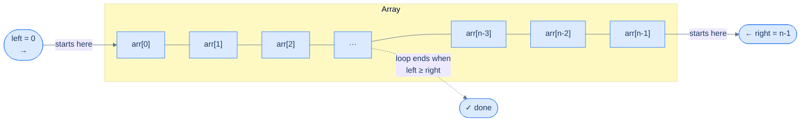
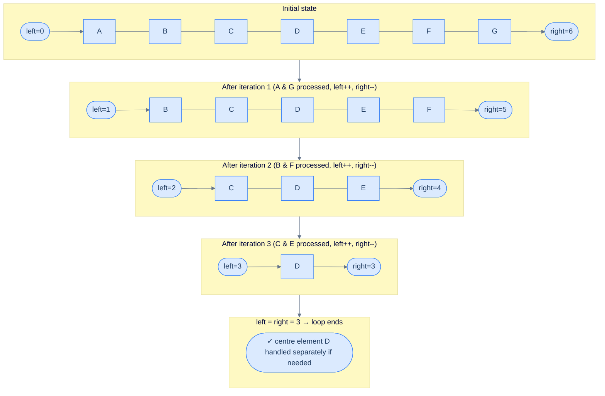
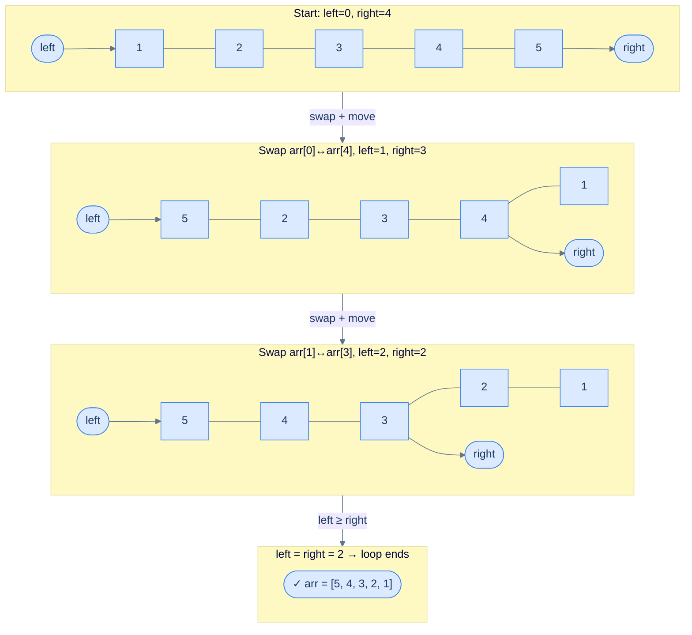
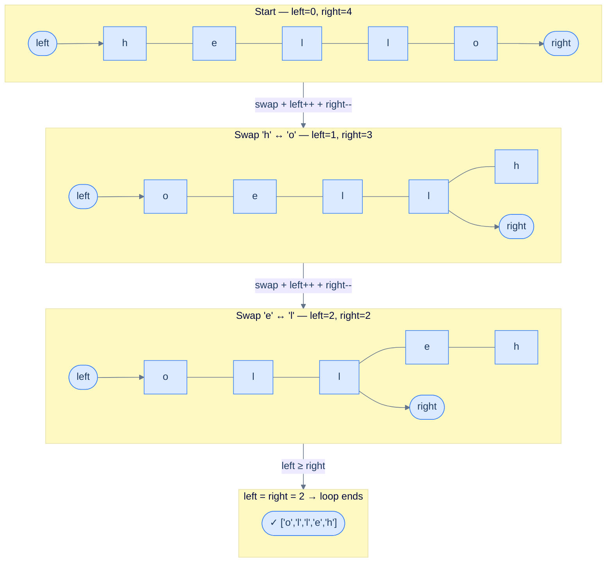
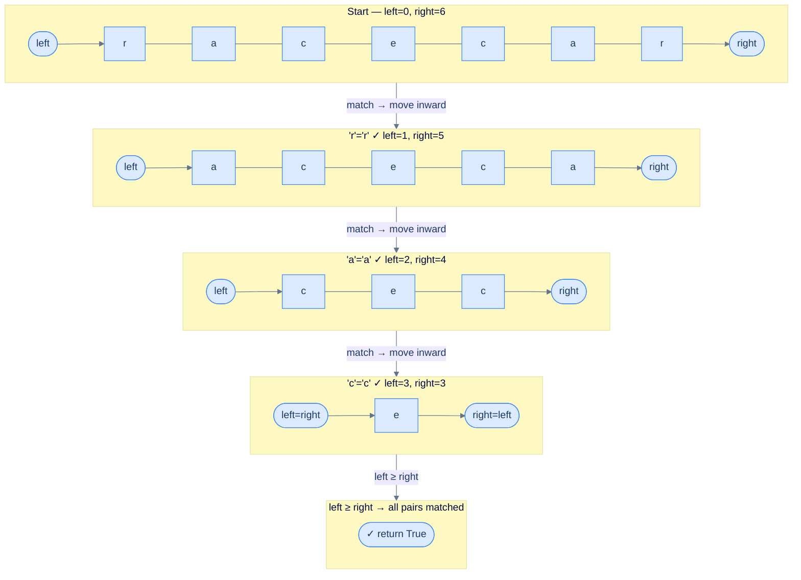
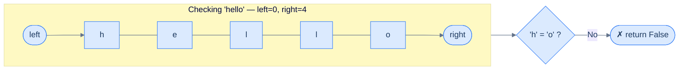
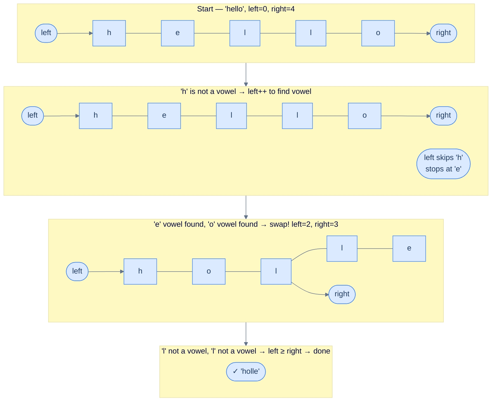
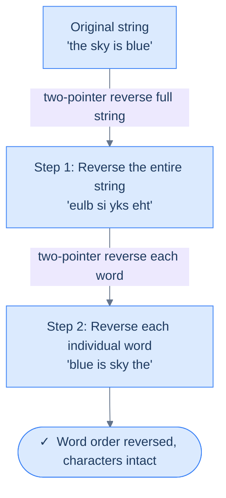
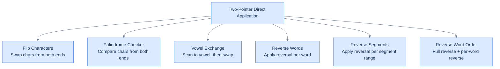

# 3. Pattern: Two pointers

This section introduces the direct-application version of the two-pointer pattern and walks through representative problems.

## Table of contents

1. [Understanding the two pointer pattern](#understanding-the-two-pointer-pattern)
2. [Identifying direct application](#identifying-direct-application)
3. [Flip characters](#flip-characters)
4. [Palindrome checker](#palindrome-checker)
5. [Vowel exchange](#vowel-exchange)
6. [Reverse words](#reverse-words)
7. [Reverse segments](#reverse-segments)
8. [Reverse word order](#reverse-word-order)

***

# Understanding the Two Pointer Pattern

## Why Single-Direction Traversal Isn't Always Enough

When you work with arrays, a single loop moving left to right is your default tool. It handles most problems cleanly. But some problems have a property that a single direction completely ignores: **both ends of the array matter at the same time**.

Think about checking if a word is a palindrome. You need to compare the first character with the last, the second with the second-to-last — you're always looking at two positions simultaneously, one from each end. A single forward loop forces you to either:
- Use a second nested loop (O(n²) — very slow), or
- Store results and do two passes (extra space)

The **two-pointer technique** solves this elegantly: use two variables, `left` and `right`, as indices that start at opposite ends and march toward each other in a single pass.

---

## The Core Idea

Two pointers (`left` and `right`) start at opposite ends of the array and converge toward the middle. At each step, you do some work using both `arr[left]` and `arr[right]`, then move one or both pointers inward.



<p align="center"><strong>The two-pointer traversal — <code>left</code> starts at index 0 and advances right; <code>right</code> starts at index n−1 and retreats left. They meet in the middle.</strong></p>

The loop terminates when `left >= right`. At that point, every pair of equidistant positions has been visited exactly once — which is why the algorithm runs in **O(n) time with O(1) extra space**.

---

## How the Pointers Move

Here is the full picture of a single traversal on an array of size 7:



<p align="center"><strong>Iteration-by-iteration view of the two-pointer traversal on a 7-element array — each step processes one pair of equidistant elements and closes the gap by one on each side.</strong></p>

---

## The Generic Algorithm

The two-pointer pattern follows this skeleton for every problem that uses it directly:

**Step 1.** Initialise `left = 0`, `right = n − 1` (or whatever starting positions the problem requires, as long as `left < right`).

**Step 2.** Loop while `left < right`:
- **Step 2.1** — do some work on `arr[left]` and `arr[right]`
- **Step 2.2** — move `left` forward by some number of steps (if the problem requires it)
- **Step 2.3** — move `right` backward by some number of steps (if the problem requires it)

**Step 3.** Return the result.

The specific "work" and "step size" in steps 2.1–2.3 change per problem. Everything else stays the same.

---

## Generic Implementation

<div class="lang-tabs">

```python,editable
from typing import List

class Solution:
    def two_pointer(self, arr: List[int]) -> None:
        left = 0
        right = len(arr) - 1

        while left < right:
            left_val  = arr[left]
            right_val = arr[right]

            # Problem-specific work goes here (swap, compare, accumulate, etc.).

            if self.should_move_left(left_val, right_val):
                left += self.left_step(left_val, right_val)
            if self.should_move_right(left_val, right_val):
                right -= self.right_step(left_val, right_val)

    def should_move_left(self, lv, rv):  return True
    def should_move_right(self, lv, rv): return True
    def left_step(self, lv, rv):  return 1
    def right_step(self, lv, rv): return 1


arr = [1, 2, 3, 4, 5, 6, 7]
Solution().two_pointer(arr)
print("Done — customise the template above to solve a real problem!")
```

```java,editable
public class Main {
    static class Solution {
        void twoPointer(int[] arr) {
            int left = 0;
            int right = arr.length - 1;

            while (left < right) {
                int leftVal  = arr[left];
                int rightVal = arr[right];

                // Problem-specific work goes here.

                if (shouldMoveLeft(leftVal, rightVal))  left  += leftStep(leftVal, rightVal);
                if (shouldMoveRight(leftVal, rightVal)) right -= rightStep(leftVal, rightVal);
            }
        }
        boolean shouldMoveLeft(int lv, int rv)  { return true; }
        boolean shouldMoveRight(int lv, int rv) { return true; }
        int leftStep(int lv, int rv)  { return 1; }
        int rightStep(int lv, int rv) { return 1; }
    }

    public static void main(String[] args) {
        int[] arr = {1, 2, 3, 4, 5, 6, 7};
        new Solution().twoPointer(arr);
        System.out.println("Done — customise the template above to solve a real problem!");
    }
}
```

```c,editable
#include <stdio.h>
#include <stdbool.h>

static bool should_move_left(int lv, int rv)  { (void)lv; (void)rv; return true; }
static bool should_move_right(int lv, int rv) { (void)lv; (void)rv; return true; }
static int  left_step(int lv, int rv)         { (void)lv; (void)rv; return 1; }
static int  right_step(int lv, int rv)        { (void)lv; (void)rv; return 1; }

void two_pointer(int* arr, int n) {
    int left = 0;
    int right = n - 1;

    while (left < right) {
        int left_val  = arr[left];
        int right_val = arr[right];

        /* Problem-specific work goes here. */

        if (should_move_left(left_val, right_val))  left  += left_step(left_val, right_val);
        if (should_move_right(left_val, right_val)) right -= right_step(left_val, right_val);
    }
}

int main() {
    int arr[] = {1, 2, 3, 4, 5, 6, 7};
    two_pointer(arr, 7);
    printf("Done — customise the template above to solve a real problem!\n");
    return 0;
}
```

```cpp,editable
#include <iostream>
#include <vector>

class Solution {
public:
    void twoPointer(std::vector<int>& arr) {
        int left = 0;
        int right = (int)arr.size() - 1;

        while (left < right) {
            int leftVal  = arr[left];
            int rightVal = arr[right];

            // Problem-specific work goes here.

            if (shouldMoveLeft(leftVal, rightVal))  left  += leftStep(leftVal, rightVal);
            if (shouldMoveRight(leftVal, rightVal)) right -= rightStep(leftVal, rightVal);
        }
    }
    bool shouldMoveLeft(int, int)  { return true; }
    bool shouldMoveRight(int, int) { return true; }
    int  leftStep(int, int)        { return 1; }
    int  rightStep(int, int)       { return 1; }
};

int main() {
    std::vector<int> arr = {1, 2, 3, 4, 5, 6, 7};
    Solution().twoPointer(arr);
    std::cout << "Done — customise the template above to solve a real problem!\n";
}
```

```scala,editable
object Main extends App {
  class Solution {
    def twoPointer(arr: Array[Int]): Unit = {
      var left = 0
      var right = arr.length - 1

      while (left < right) {
        val leftVal  = arr(left)
        val rightVal = arr(right)

        // Problem-specific work goes here.

        if (shouldMoveLeft(leftVal, rightVal))  left  += leftStep(leftVal, rightVal)
        if (shouldMoveRight(leftVal, rightVal)) right -= rightStep(leftVal, rightVal)
      }
    }
    def shouldMoveLeft(lv: Int, rv: Int)  = true
    def shouldMoveRight(lv: Int, rv: Int) = true
    def leftStep(lv: Int, rv: Int)  = 1
    def rightStep(lv: Int, rv: Int) = 1
  }

  val arr = Array(1, 2, 3, 4, 5, 6, 7)
  new Solution().twoPointer(arr)
  println("Done — customise the template above to solve a real problem!")
}
```

```javascript,editable
class Solution {
    twoPointer(arr) {
        let left = 0;
        let right = arr.length - 1;

        while (left < right) {
            const leftVal  = arr[left];
            const rightVal = arr[right];

            // Problem-specific work goes here.

            if (this.shouldMoveLeft(leftVal, rightVal))  left  += this.leftStep(leftVal, rightVal);
            if (this.shouldMoveRight(leftVal, rightVal)) right -= this.rightStep(leftVal, rightVal);
        }
    }
    shouldMoveLeft(lv, rv)  { return true; }
    shouldMoveRight(lv, rv) { return true; }
    leftStep(lv, rv)  { return 1; }
    rightStep(lv, rv) { return 1; }
}

const arr = [1, 2, 3, 4, 5, 6, 7];
new Solution().twoPointer(arr);
console.log("Done — customise the template above to solve a real problem!");
```

```typescript,editable
class Solution {
    twoPointer(arr: number[]): void {
        let left = 0;
        let right = arr.length - 1;

        while (left < right) {
            const leftVal  = arr[left];
            const rightVal = arr[right];

            // Problem-specific work goes here.

            if (this.shouldMoveLeft(leftVal, rightVal))  left  += this.leftStep(leftVal, rightVal);
            if (this.shouldMoveRight(leftVal, rightVal)) right -= this.rightStep(leftVal, rightVal);
        }
    }
    shouldMoveLeft(lv: number, rv: number): boolean  { return true; }
    shouldMoveRight(lv: number, rv: number): boolean { return true; }
    leftStep(lv: number, rv: number): number  { return 1; }
    rightStep(lv: number, rv: number): number { return 1; }
}

const arr: number[] = [1, 2, 3, 4, 5, 6, 7];
new Solution().twoPointer(arr);
console.log("Done — customise the template above to solve a real problem!");
```

```go,editable
package main

import "fmt"

type Solution struct{}

func (s Solution) shouldMoveLeft(lv, rv int) bool  { return true }
func (s Solution) shouldMoveRight(lv, rv int) bool { return true }
func (s Solution) leftStep(lv, rv int) int         { return 1 }
func (s Solution) rightStep(lv, rv int) int        { return 1 }

func (s Solution) twoPointer(arr []int) {
    left := 0
    right := len(arr) - 1

    for left < right {
        leftVal  := arr[left]
        rightVal := arr[right]

        // Problem-specific work goes here.

        if s.shouldMoveLeft(leftVal, rightVal) {
            left += s.leftStep(leftVal, rightVal)
        }
        if s.shouldMoveRight(leftVal, rightVal) {
            right -= s.rightStep(leftVal, rightVal)
        }
    }
}

func main() {
    arr := []int{1, 2, 3, 4, 5, 6, 7}
    Solution{}.twoPointer(arr)
    fmt.Println("Done — customise the template above to solve a real problem!")
}
```

```kotlin,editable
class Solution {
    fun twoPointer(arr: IntArray) {
        var left = 0
        var right = arr.size - 1

        while (left < right) {
            val leftVal  = arr[left]
            val rightVal = arr[right]

            // Problem-specific work goes here.

            if (shouldMoveLeft(leftVal, rightVal))  left  += leftStep(leftVal, rightVal)
            if (shouldMoveRight(leftVal, rightVal)) right -= rightStep(leftVal, rightVal)
        }
    }
    fun shouldMoveLeft(lv: Int, rv: Int) = true
    fun shouldMoveRight(lv: Int, rv: Int) = true
    fun leftStep(lv: Int, rv: Int) = 1
    fun rightStep(lv: Int, rv: Int) = 1
}

fun main() {
    val arr = intArrayOf(1, 2, 3, 4, 5, 6, 7)
    Solution().twoPointer(arr)
    println("Done — customise the template above to solve a real problem!")
}
```

```rust,editable
struct Solution;

impl Solution {
    fn should_move_left(&self, _lv: i32, _rv: i32) -> bool { true }
    fn should_move_right(&self, _lv: i32, _rv: i32) -> bool { true }
    fn left_step(&self, _lv: i32, _rv: i32) -> i32  { 1 }
    fn right_step(&self, _lv: i32, _rv: i32) -> i32 { 1 }

    fn two_pointer(&self, arr: &[i32]) {
        let mut left  = 0i32;
        let mut right = arr.len() as i32 - 1;

        while left < right {
            let left_val  = arr[left as usize];
            let right_val = arr[right as usize];

            // Problem-specific work goes here.

            if self.should_move_left(left_val, right_val)  { left  += self.left_step(left_val, right_val); }
            if self.should_move_right(left_val, right_val) { right -= self.right_step(left_val, right_val); }
        }
    }
}

fn main() {
    let arr = [1, 2, 3, 4, 5, 6, 7];
    Solution.two_pointer(&arr);
    println!("Done — customise the template above to solve a real problem!");
}
```

</div>

---

## Complexity Analysis

| | Complexity | Reasoning |
|---|---|---|
| **Time** | O(n) | `left` and `right` together visit every index exactly once. No element is processed twice. |
| **Space** | O(1) | Only two integer variables (`left` and `right`) are needed regardless of input size. |

This is true for every problem that directly applies the two-pointer technique — **both best and worst case are O(n) time, O(1) space**.

The power of this pattern is that it reduces problems which naively need O(n²) nested loops to a single O(n) pass.

---

## Three Ways to Apply Two Pointers

Not every two-pointer problem is identical. Problems in this pattern fall into three categories:

```d2
Root: Two-Pointer Pattern Problems

D: |md
  **Direct Application**

  Two pointers applied as-is

  (e.g. reverse, palindrome check)
|

R: |md
  **Reduction**

  Problem reduced to an
  equivalent two-pointer problem
|

S: |md
  **Subproblems**

  One step of the solution
  uses two pointers internally
|

Root -> D
Root -> R
Root -> S
```

<p align="center"><strong>Three categories of two-pointer pattern problems — we start with Direct Application, which is the simplest and most common.</strong></p>

In the next lessons, we work through the **Direct Application** category in depth — problems where the two-pointer template above applies almost verbatim.

***

# Identifying Direct Application

## What Makes a Problem a "Direct Application"?

The two-pointer technique can be applied **directly** when the problem asks you to do something with pairs of elements — one from each end — while moving both pointers inward until they meet. No clever transformation needed. The template fits as-is.

The mental checklist:

> ✅ We need to look at two positions simultaneously
> ✅ One position starts near the beginning, one near the end
> ✅ Both move inward with each iteration
> ✅ The work done at each step is simple (swap, compare, copy…)

If those four boxes are checked, you're looking at a direct application.

---

## The Canonical Example: Reverse an Array In-Place

**Problem statement:** Given an array `arr`, reverse it in-place. Do not create and return a new array — modify the original.

```
Input:  arr = [1, 2, 3, 4, 5]
Output: arr is modified to [5, 4, 3, 2, 1]
```

```d2
direction: right

before: "Original" {
  grid-columns: 5
  grid-gap: 0
  a: "1"
  b: "2"
  c: "3"
  d: "4"
  e: "5"
}

after: "Reversed (in-place)" {
  grid-columns: 5
  grid-gap: 0
  a: "5"
  b: "4"
  c: "3"
  d: "2"
  e: "1"
}

before -> after
```

<p align="center"><strong>Reverse the array in-place — the original array (top) becomes the reversed array (bottom) without allocating new memory.</strong></p>

---

## Brute Force: Two Passes + Temp Array

The naive approach copies elements in reverse into a temporary array, then copies back:

1. Walk `arr` backwards and fill `temp` forwards
2. Walk `temp` forwards and copy back into `arr`

```d2
direction: right

ORIG: "Original arr" {
  grid-columns: 5
  grid-gap: 0
  a: "1"
  b: "2"
  c: "3"
  d: "4"
  e: "5"
}

TEMP: "temp (copy arr backwards)" {
  grid-columns: 5
  grid-gap: 0
  a: "5"
  b: "4"
  c: "3"
  d: "2"
  e: "1"
}

BACK: "arr (copy temp back)" {
  grid-columns: 5
  grid-gap: 0
  a: "5"
  b: "4"
  c: "3"
  d: "2"
  e: "1"
}

ORIG -> TEMP: pass 1 — backwards copy
TEMP -> BACK: pass 2 — forwards copy
```

<p align="center"><strong>Brute-force reversal — two full passes and O(n) extra space for the temp array.</strong></p>

<div class="lang-tabs">

```python,editable
from typing import List

class BruteForce:
    def reverse(self, arr: List[int]) -> None:
        n = len(arr)
        temp = [0] * n

        # Pass 1: copy arr backwards into temp.
        for i in range(n - 1, -1, -1):
            temp[n - 1 - i] = arr[i]

        # Pass 2: copy temp back into arr.
        for i in range(n):
            arr[i] = temp[i]


arr = [1, 2, 3, 4, 5]
BruteForce().reverse(arr)
print(arr)   # [5, 4, 3, 2, 1]
```

```java,editable
import java.util.Arrays;

public class Main {
    static class BruteForce {
        void reverse(int[] arr) {
            int n = arr.length;
            int[] temp = new int[n];
            // Pass 1: copy backwards into temp.
            for (int i = n - 1; i >= 0; i--) temp[n - 1 - i] = arr[i];
            // Pass 2: copy temp back into arr.
            for (int i = 0; i < n; i++) arr[i] = temp[i];
        }
    }

    public static void main(String[] args) {
        int[] arr = {1, 2, 3, 4, 5};
        new BruteForce().reverse(arr);
        System.out.println(Arrays.toString(arr));
    }
}
```

```c,editable
#include <stdio.h>
#include <stdlib.h>

void reverse_brute(int* arr, int n) {
    int* temp = (int*)malloc(n * sizeof(int));
    for (int i = n - 1; i >= 0; i--) temp[n - 1 - i] = arr[i];
    for (int i = 0; i < n; i++) arr[i] = temp[i];
    free(temp);
}

int main() {
    int arr[] = {1, 2, 3, 4, 5};
    int n = 5;
    reverse_brute(arr, n);
    for (int i = 0; i < n; i++) printf("%d ", arr[i]);
    printf("\n");
    return 0;
}
```

```cpp,editable
#include <iostream>
#include <vector>

class BruteForce {
public:
    void reverse(std::vector<int>& arr) {
        int n = (int)arr.size();
        std::vector<int> temp(n);
        for (int i = n - 1; i >= 0; i--) temp[n - 1 - i] = arr[i];
        for (int i = 0; i < n; i++) arr[i] = temp[i];
    }
};

int main() {
    std::vector<int> arr = {1, 2, 3, 4, 5};
    BruteForce().reverse(arr);
    for (int v : arr) std::cout << v << " ";
    std::cout << "\n";
}
```

```scala,editable
object Main extends App {
  class BruteForce {
    def reverse(arr: Array[Int]): Unit = {
      val n = arr.length
      val temp = new Array[Int](n)
      for (i <- (n - 1) to 0 by -1) temp(n - 1 - i) = arr(i)
      for (i <- 0 until n) arr(i) = temp(i)
    }
  }

  val arr = Array(1, 2, 3, 4, 5)
  new BruteForce().reverse(arr)
  println(arr.mkString(", "))
}
```

```javascript,editable
class BruteForce {
    reverse(arr) {
        const n = arr.length;
        const temp = new Array(n);
        for (let i = n - 1; i >= 0; i--) temp[n - 1 - i] = arr[i];
        for (let i = 0; i < n; i++) arr[i] = temp[i];
    }
}

const arr = [1, 2, 3, 4, 5];
new BruteForce().reverse(arr);
console.log(arr);
```

```typescript,editable
class BruteForce {
    reverse(arr: number[]): void {
        const n = arr.length;
        const temp: number[] = new Array(n);
        for (let i = n - 1; i >= 0; i--) temp[n - 1 - i] = arr[i];
        for (let i = 0; i < n; i++) arr[i] = temp[i];
    }
}

const arr: number[] = [1, 2, 3, 4, 5];
new BruteForce().reverse(arr);
console.log(arr);
```

```go,editable
package main

import "fmt"

func reverseBrute(arr []int) {
    n := len(arr)
    temp := make([]int, n)
    for i := n - 1; i >= 0; i-- {
        temp[n-1-i] = arr[i]
    }
    for i := 0; i < n; i++ {
        arr[i] = temp[i]
    }
}

func main() {
    arr := []int{1, 2, 3, 4, 5}
    reverseBrute(arr)
    fmt.Println(arr)
}
```

```kotlin,editable
class BruteForce {
    fun reverse(arr: IntArray) {
        val n = arr.size
        val temp = IntArray(n)
        for (i in n - 1 downTo 0) temp[n - 1 - i] = arr[i]
        for (i in 0 until n) arr[i] = temp[i]
    }
}

fun main() {
    val arr = intArrayOf(1, 2, 3, 4, 5)
    BruteForce().reverse(arr)
    println(arr.toList())
}
```

```rust,editable
struct BruteForce;

impl BruteForce {
    fn reverse(&self, arr: &mut [i32]) {
        let n = arr.len();
        let mut temp = vec![0i32; n];
        for i in (0..n).rev() { temp[n - 1 - i] = arr[i]; }
        for i in 0..n { arr[i] = temp[i]; }
    }
}

fn main() {
    let mut arr = [1, 2, 3, 4, 5];
    BruteForce.reverse(&mut arr);
    println!("{:?}", arr);
}
```

</div>

This works, but it uses O(n) extra space and touches every element twice. We can do better.

---

## Two-Pointer Solution: One Pass, Zero Extra Space

**Key insight:** to reverse an array, we just need to swap equidistant elements from both ends — `arr[0] ↔ arr[n-1]`, `arr[1] ↔ arr[n-2]`, and so on. Each swap needs exactly two positions: one from the left, one from the right. That's the two-pointer template.



<p align="center"><strong>Two-pointer reversal on <code>[1, 2, 3, 4, 5]</code> — two swaps close the gap from both ends; the middle element needs no swap.</strong></p>

<div class="lang-tabs">

```python,editable
from typing import List

class Solution:
    def reverse(self, arr: List[int]) -> None:
        left, right = 0, len(arr) - 1

        # Stop when pointers meet (odd length: middle stays put) or cross (even length: done).
        while left < right:
            arr[left], arr[right] = arr[right], arr[left]   # swap equidistant ends
            left  += 1                                       # close the window from the left
            right -= 1                                       # close the window from the right


arr = [1, 2, 3, 4, 5]
Solution().reverse(arr)
print(arr)   # [5, 4, 3, 2, 1]

arr2 = [1, 2, 3, 4]
Solution().reverse(arr2)
print(arr2)  # [4, 3, 2, 1]
```

```java,editable
import java.util.Arrays;

public class Main {
    static class Solution {
        void reverse(int[] arr) {
            int left = 0;
            int right = arr.length - 1;

            while (left < right) {
                int tmp = arr[left];
                arr[left] = arr[right];
                arr[right] = tmp;
                left++;
                right--;
            }
        }
    }

    public static void main(String[] args) {
        int[] arr = {1, 2, 3, 4, 5};
        new Solution().reverse(arr);
        System.out.println(Arrays.toString(arr));

        int[] arr2 = {1, 2, 3, 4};
        new Solution().reverse(arr2);
        System.out.println(Arrays.toString(arr2));
    }
}
```

```c,editable
#include <stdio.h>

void reverse_arr(int* arr, int n) {
    int left = 0, right = n - 1;
    while (left < right) {
        int tmp = arr[left];
        arr[left]  = arr[right];
        arr[right] = tmp;
        left++;
        right--;
    }
}

void print_arr(int* arr, int n) {
    for (int i = 0; i < n; i++) printf("%d ", arr[i]);
    printf("\n");
}

int main() {
    int arr[] = {1, 2, 3, 4, 5};
    reverse_arr(arr, 5);
    print_arr(arr, 5);

    int arr2[] = {1, 2, 3, 4};
    reverse_arr(arr2, 4);
    print_arr(arr2, 4);
    return 0;
}
```

```cpp,editable
#include <iostream>
#include <vector>

class Solution {
public:
    void reverse(std::vector<int>& arr) {
        int left = 0;
        int right = (int)arr.size() - 1;
        while (left < right) {
            std::swap(arr[left], arr[right]);
            left++;
            right--;
        }
    }
};

int main() {
    std::vector<int> arr = {1, 2, 3, 4, 5};
    Solution().reverse(arr);
    for (int v : arr) std::cout << v << " ";
    std::cout << "\n";

    std::vector<int> arr2 = {1, 2, 3, 4};
    Solution().reverse(arr2);
    for (int v : arr2) std::cout << v << " ";
    std::cout << "\n";
}
```

```scala,editable
object Main extends App {
  class Solution {
    def reverse(arr: Array[Int]): Unit = {
      var left = 0
      var right = arr.length - 1
      while (left < right) {
        val tmp = arr(left)
        arr(left)  = arr(right)
        arr(right) = tmp
        left  += 1
        right -= 1
      }
    }
  }

  val arr = Array(1, 2, 3, 4, 5)
  new Solution().reverse(arr)
  println(arr.mkString(", "))

  val arr2 = Array(1, 2, 3, 4)
  new Solution().reverse(arr2)
  println(arr2.mkString(", "))
}
```

```javascript,editable
class Solution {
    reverse(arr) {
        let left = 0;
        let right = arr.length - 1;
        while (left < right) {
            [arr[left], arr[right]] = [arr[right], arr[left]];   // destructuring swap
            left++;
            right--;
        }
    }
}

const arr = [1, 2, 3, 4, 5];
new Solution().reverse(arr);
console.log(arr);

const arr2 = [1, 2, 3, 4];
new Solution().reverse(arr2);
console.log(arr2);
```

```typescript,editable
class Solution {
    reverse(arr: number[]): void {
        let left = 0;
        let right = arr.length - 1;
        while (left < right) {
            [arr[left], arr[right]] = [arr[right], arr[left]];
            left++;
            right--;
        }
    }
}

const arr: number[] = [1, 2, 3, 4, 5];
new Solution().reverse(arr);
console.log(arr);

const arr2: number[] = [1, 2, 3, 4];
new Solution().reverse(arr2);
console.log(arr2);
```

```go,editable
package main

import "fmt"

func reverseArr(arr []int) {
    left, right := 0, len(arr)-1
    for left < right {
        arr[left], arr[right] = arr[right], arr[left]
        left++
        right--
    }
}

func main() {
    arr := []int{1, 2, 3, 4, 5}
    reverseArr(arr)
    fmt.Println(arr)

    arr2 := []int{1, 2, 3, 4}
    reverseArr(arr2)
    fmt.Println(arr2)
}
```

```kotlin,editable
class Solution {
    fun reverse(arr: IntArray) {
        var left = 0
        var right = arr.size - 1
        while (left < right) {
            val tmp = arr[left]
            arr[left]  = arr[right]
            arr[right] = tmp
            left++
            right--
        }
    }
}

fun main() {
    val arr = intArrayOf(1, 2, 3, 4, 5)
    Solution().reverse(arr)
    println(arr.toList())

    val arr2 = intArrayOf(1, 2, 3, 4)
    Solution().reverse(arr2)
    println(arr2.toList())
}
```

```rust,editable
struct Solution;

impl Solution {
    fn reverse(&self, arr: &mut [i32]) {
        let mut left = 0usize;
        let mut right = arr.len().saturating_sub(1);
        while left < right {
            arr.swap(left, right);
            left  += 1;
            right -= 1;
        }
    }
}

fn main() {
    let mut arr = [1, 2, 3, 4, 5];
    Solution.reverse(&mut arr);
    println!("{:?}", arr);

    let mut arr2 = [1, 2, 3, 4];
    Solution.reverse(&mut arr2);
    println!("{:?}", arr2);
}
```

</div>

One pass. No extra memory. The two-pointer template applied directly.

<details>
<summary><strong>Trace — arr = [1, 2, 3, 4, 5]</strong></summary>

```
arr = [1, 2, 3, 4, 5]   left = 0,  right = 4

Step 1 │ left=0 (1),  right=4 (5) │ 0 < 4 → swap │ [5, 2, 3, 4, 1] │ left=1, right=3
Step 2 │ left=1 (2),  right=3 (4) │ 1 < 3 → swap │ [5, 4, 3, 2, 1] │ left=2, right=2
Step 3 │ left=2 (3),  right=2 (3) │ 2 == 2 → left < right is false → loop exits

Result: [5, 4, 3, 2, 1] ✓

Note: The middle element (3) never needed a swap — it's equidistant from both ends
      and sits in its correct reversed position automatically.

Even-length check — arr = [1, 2, 3, 4]:
Step 1 │ left=0 (1),  right=3 (4) │ 0 < 3 → swap │ [4, 2, 3, 1] │ left=1, right=2
Step 2 │ left=1 (2),  right=2 (3) │ 1 < 2 → swap │ [4, 3, 2, 1] │ left=2, right=1
Step 3 │ left=2,      right=1     │ 2 > 1 → loop exits (pointers crossed)

Result: [4, 3, 2, 1] ✓

Note: For even-length arrays the pointers cross (left > right) rather than meet —
      all pairs are handled before that happens.
```

</details>

---

## Fitting the Template

Let's verify this problem matches all four checkboxes:

| Checkpoint | This Problem |
|---|---|
| Two positions at once? | ✅ `arr[left]` and `arr[right]` |
| One near start, one near end? | ✅ `left=0`, `right=n-1` |
| Both move inward? | ✅ `left++`, `right--` each iteration |
| Simple work per step? | ✅ One swap |

---

### Checkpoint 1 — Why "two positions at once"?

**WHAT:** A reversal requires swapping pairs of elements. A swap is an inherently two-element operation — you can't swap a single element with nothing.

**WHY it means two pointers fit:** Every step of the algorithm needs `arr[left]` and `arr[right]` simultaneously. One pointer alone can't do the job — it would need to "remember" the element it picked up and go look for where to put it, which is exactly what the brute force does (it stores the whole array in `temp`).

**What breaks with a single pointer:** Walk forward with one pointer and try to reverse in-place — when you overwrite `arr[0]` with `arr[4]`, the original `arr[0]` is gone. You'd need to save it somewhere first. That "somewhere" is the temp array. Two pointers sidestep the need entirely: they swap atomically (`a, b = b, a`), so nothing is lost.

> **Rule of thumb:** If the problem needs to operate on two elements that "belong together" (a pair, a palindrome check, a sum), two simultaneous pointers are the natural fit.

---

### Checkpoint 2 — Why "one near start, one near end"?

**WHAT:** `left` starts at index `0` (the first element), `right` starts at index `n-1` (the last element).

**WHY this specific placement:** After reversal, element at index `0` must land at index `n-1` and vice versa. Element at index `1` must land at `n-2`. The pattern is: **element at distance `d` from the left end swaps with element at distance `d` from the right end**.

Placing one pointer at each end directly aligns with this structure — at every step, `left` and `right` are pointing at exactly the pair that needs to swap next.

**What breaks with a different placement:** If both pointers started from the left (like in many sliding window problems), you'd never naturally reach the element at `n-1` first. You'd be doing something fundamentally different — not a reversal.

**Concrete check:** `[1, 2, 3, 4, 5]`
- `left=0, right=4`: `1` and `5` are the farthest pair — swap first ✓
- `left=1, right=3`: `2` and `4` are next closest pair — swap second ✓
- `left=2, right=2`: single middle element — no swap needed ✓

---

### Checkpoint 3 — Why "both move inward"?

**WHAT:** After each swap, both `left` increments by 1 and `right` decrements by 1.

**WHY inward movement:** After swapping `arr[left]` and `arr[right]`, those two positions are finalized — they now hold the correct values for a reversed array. The unsolved subproblem is the inner portion: `arr[left+1 .. right-1]`. Moving both pointers inward shrinks the problem by 2 each step and focuses attention on exactly what's left to solve.

**Why the stop condition is `left < right` (not `left <= right`):**
- When `left == right` (odd-length arrays): both pointers are at the same middle element. That element is already in the correct position — swapping it with itself is a no-op. We stop before that unnecessary step.
- When `left > right` (even-length arrays): the pointers have crossed, all pairs have been handled. No element remains.

**What breaks if you stop at `left <= right`:** For odd-length arrays like `[1, 2, 3, 4, 5]`, when `left = right = 2`, you'd execute `arr[2], arr[2] = arr[2], arr[2]` — harmless but wasteful. For the stop condition to be correct, `left < right` is sufficient and exact.

---

### Checkpoint 4 — Why "simple work per step"?

**WHAT:** At each step, we do exactly one swap: `arr[left], arr[right] = arr[right], arr[left]`.

**WHY "simple" matters:** The two-pointer direct application template is powerful precisely because the loop body is O(1) — a fixed amount of work per step. Combined with O(n) steps (n/2 swaps), the total is O(n) time. The simplicity of the per-step work is what keeps the whole algorithm lean.

**HOW to recognize "simple work" in other problems:** The work per step should not require nested loops, searching, or recursion. It should be a direct operation on the two elements currently pointed at — compare, swap, copy, check equality. If the per-step work itself requires a loop, you may be looking at a subproblem pattern instead (section 05).

**What this rules out:** If you found yourself needing to scan the entire remaining array on each step, that's O(n²) and the direct-application template no longer applies cleanly.

---

That's a direct application — all four checkboxes confirmed.

---

## Problems in This Category

The following lessons each apply the two-pointer technique in exactly this direct way. Each is a small variation on the same theme:

| Problem | Two-pointer work per step |
|---|---|
| **Flip Characters** | Swap characters from both ends |
| **Palindrome Checker** | Compare characters from both ends |
| **Vowel Exchange** | Find and swap vowels from both ends |
| **Reverse Words** | Reverse each word's characters with inner two pointers |
| **Reverse Segments** | Reverse a sub-range with two pointers |
| **Reverse Word Order** | Reverse entire string, then reverse each word |

Each is a small twist on the same pattern — same skeleton, different work in the loop body.

***

# Flip Characters

## The Problem

Given an array of characters, reverse the array **in-place** — that is, modify the original array so its characters appear in reverse order.

```
Input:  chars = ['h', 'e', 'l', 'l', 'o']
Output: chars is modified to ['o', 'l', 'l', 'e', 'h']
```

This is the character-array equivalent of reversing an integer array — the same two-pointer mechanics, applied to chars.

---

## Examples

**Example 1**
```
Input:  ['h', 'e', 'l', 'l', 'o']
Output: ['o', 'l', 'l', 'e', 'h']
```

**Example 2**
```
Input:  ['A', 'B', 'C', 'D']
Output: ['D', 'C', 'B', 'A']
```

**Example 3 — single character**
```
Input:  ['X']
Output: ['X']   (unchanged)
```

---

## Intuition

To reverse a sequence, the first element must become the last, the second must become the second-to-last, and so on. Every character has a **mirror partner** equidistant from the opposite end. We just need to swap each pair.

Two pointers are perfect for this: `left` starts at index 0 (the first character), `right` starts at index `n-1` (the last character). Swap the pair, then move both inward. Repeat until they meet.



<p align="center"><strong>Flipping <code>['h','e','l','l','o']</code> in-place — two swaps bring the array to its reversed state; the middle character needs no swap.</strong></p>

---

## Applying the Diagnostic Questions

| Check | Answer for Flip Characters |
|---|---|
| ✅ Two positions simultaneously? | Yes — `chars[left]` and `chars[right]` are read and swapped together at every step |
| ✅ One near start, one near end? | Yes — `left = 0`, `right = n-1` |
| ✅ Both move inward? | Yes — `left++`, `right--` after every swap |
| ✅ Simple work at each step? | Yes — one swap per iteration |

Every box is checked with nothing extra needed. This is the purest direct application — the template and the algorithm are identical.

**Why does every element have exactly one partner?** Because reversal is a bijection: element at position `i` maps to position `n-1-i`. Two pointers exploit this directly — `left` tracks "the element at distance 0 from the left" and `right` tracks "the element at distance 0 from the right." Every step, both advance one position inward, so the i-th iteration handles the i-th mirror pair. When `left >= right`, all pairs have been processed.

**What breaks if you use one pointer instead?** A single forward pointer at position `i` can move `chars[i]` to its destination at `n-1-i`, but it has already overwritten whatever was at `n-1-i` — you need a temp variable and a second loop. Two pointers avoid this entirely: the swap is symmetric, so both elements land in their correct positions in one step, no temp array required.

---

## Approach

1. Set `left = 0`, `right = len(chars) - 1`
2. While `left < right`:
   - Swap `chars[left]` and `chars[right]`
   - `left += 1`, `right -= 1`
3. Done — the array is reversed in-place

---

## Solution

<div class="lang-tabs">

```python,editable
from typing import List

class Solution:
    def flip_characters(self, chars: List[str]) -> None:
        left, right = 0, len(chars) - 1
        while left < right:
            chars[left], chars[right] = chars[right], chars[left]   # swap mirror pair
            left  += 1
            right -= 1


c1 = ['h', 'e', 'l', 'l', 'o']
Solution().flip_characters(c1); print(c1)   # ['o', 'l', 'l', 'e', 'h']

c2 = ['A', 'B', 'C', 'D']
Solution().flip_characters(c2); print(c2)   # ['D', 'C', 'B', 'A']

c3 = ['X']
Solution().flip_characters(c3); print(c3)   # ['X']
```

```java,editable
import java.util.Arrays;

public class Main {
    static class Solution {
        void flipCharacters(char[] chars) {
            int left = 0;
            int right = chars.length - 1;
            while (left < right) {
                char tmp = chars[left];
                chars[left]  = chars[right];
                chars[right] = tmp;
                left++;
                right--;
            }
        }
    }

    public static void main(String[] args) {
        char[] c1 = {'h','e','l','l','o'};
        new Solution().flipCharacters(c1);
        System.out.println(Arrays.toString(c1));

        char[] c2 = {'A','B','C','D'};
        new Solution().flipCharacters(c2);
        System.out.println(Arrays.toString(c2));

        char[] c3 = {'X'};
        new Solution().flipCharacters(c3);
        System.out.println(Arrays.toString(c3));
    }
}
```

```c,editable
#include <stdio.h>

void flip_characters(char* chars, int n) {
    int left = 0, right = n - 1;
    while (left < right) {
        char tmp = chars[left];
        chars[left]  = chars[right];
        chars[right] = tmp;
        left++;
        right--;
    }
}

void print_chars(char* chars, int n) {
    putchar('[');
    for (int i = 0; i < n; i++) printf("'%c'%s", chars[i], i + 1 < n ? ", " : "");
    printf("]\n");
}

int main() {
    char c1[] = {'h','e','l','l','o'};
    flip_characters(c1, 5); print_chars(c1, 5);
    char c2[] = {'A','B','C','D'};
    flip_characters(c2, 4); print_chars(c2, 4);
    char c3[] = {'X'};
    flip_characters(c3, 1); print_chars(c3, 1);
    return 0;
}
```

```cpp,editable
#include <iostream>
#include <vector>

class Solution {
public:
    void flipCharacters(std::vector<char>& chars) {
        int left = 0;
        int right = (int)chars.size() - 1;
        while (left < right) {
            std::swap(chars[left], chars[right]);
            left++;
            right--;
        }
    }
};

void print_v(const std::vector<char>& v) {
    std::cout << "[";
    for (size_t i = 0; i < v.size(); i++) std::cout << "'" << v[i] << "'" << (i + 1 < v.size() ? ", " : "");
    std::cout << "]\n";
}

int main() {
    std::vector<char> c1 = {'h','e','l','l','o'};
    Solution().flipCharacters(c1); print_v(c1);
    std::vector<char> c2 = {'A','B','C','D'};
    Solution().flipCharacters(c2); print_v(c2);
    std::vector<char> c3 = {'X'};
    Solution().flipCharacters(c3); print_v(c3);
}
```

```scala,editable
object Main extends App {
  class Solution {
    def flipCharacters(chars: Array[Char]): Unit = {
      var left = 0
      var right = chars.length - 1
      while (left < right) {
        val tmp = chars(left)
        chars(left)  = chars(right)
        chars(right) = tmp
        left  += 1
        right -= 1
      }
    }
  }

  val c1 = Array('h','e','l','l','o')
  new Solution().flipCharacters(c1); println(c1.mkString("[", ", ", "]"))
  val c2 = Array('A','B','C','D')
  new Solution().flipCharacters(c2); println(c2.mkString("[", ", ", "]"))
  val c3 = Array('X')
  new Solution().flipCharacters(c3); println(c3.mkString("[", ", ", "]"))
}
```

```javascript,editable
class Solution {
    flipCharacters(chars) {
        let left = 0;
        let right = chars.length - 1;
        while (left < right) {
            [chars[left], chars[right]] = [chars[right], chars[left]];
            left++;
            right--;
        }
    }
}

const c1 = ['h','e','l','l','o'];
new Solution().flipCharacters(c1); console.log(c1);

const c2 = ['A','B','C','D'];
new Solution().flipCharacters(c2); console.log(c2);

const c3 = ['X'];
new Solution().flipCharacters(c3); console.log(c3);
```

```typescript,editable
class Solution {
    flipCharacters(chars: string[]): void {
        let left = 0;
        let right = chars.length - 1;
        while (left < right) {
            [chars[left], chars[right]] = [chars[right], chars[left]];
            left++;
            right--;
        }
    }
}

const c1: string[] = ['h','e','l','l','o'];
new Solution().flipCharacters(c1); console.log(c1);

const c2: string[] = ['A','B','C','D'];
new Solution().flipCharacters(c2); console.log(c2);

const c3: string[] = ['X'];
new Solution().flipCharacters(c3); console.log(c3);
```

```go,editable
package main

import "fmt"

func flipCharacters(chars []byte) {
    left, right := 0, len(chars)-1
    for left < right {
        chars[left], chars[right] = chars[right], chars[left]
        left++
        right--
    }
}

func main() {
    c1 := []byte{'h','e','l','l','o'}
    flipCharacters(c1); fmt.Println(string(c1))

    c2 := []byte{'A','B','C','D'}
    flipCharacters(c2); fmt.Println(string(c2))

    c3 := []byte{'X'}
    flipCharacters(c3); fmt.Println(string(c3))
}
```

```kotlin,editable
class Solution {
    fun flipCharacters(chars: CharArray) {
        var left = 0
        var right = chars.size - 1
        while (left < right) {
            val tmp = chars[left]
            chars[left]  = chars[right]
            chars[right] = tmp
            left++
            right--
        }
    }
}

fun main() {
    val c1 = charArrayOf('h','e','l','l','o')
    Solution().flipCharacters(c1); println(c1.toList())

    val c2 = charArrayOf('A','B','C','D')
    Solution().flipCharacters(c2); println(c2.toList())

    val c3 = charArrayOf('X')
    Solution().flipCharacters(c3); println(c3.toList())
}
```

```rust,editable
struct Solution;

impl Solution {
    fn flip_characters(&self, chars: &mut [char]) {
        let mut left = 0usize;
        let mut right = chars.len().saturating_sub(1);
        while left < right {
            chars.swap(left, right);
            left  += 1;
            right -= 1;
        }
    }
}

fn main() {
    let mut c1 = ['h','e','l','l','o'];
    Solution.flip_characters(&mut c1); println!("{:?}", c1);

    let mut c2 = ['A','B','C','D'];
    Solution.flip_characters(&mut c2); println!("{:?}", c2);

    let mut c3 = ['X'];
    Solution.flip_characters(&mut c3); println!("{:?}", c3);
}
```

</div>

---

## Dry Run — Example 1

`chars = ['h', 'e', 'l', 'l', 'o']`, `n = 5`

| Iteration | `left` | `right` | Swap | Array after swap |
|---|---|---|---|---|
| 1 | 0 | 4 | `'h' ↔ 'o'` | `['o','e','l','l','h']` |
| 2 | 1 | 3 | `'e' ↔ 'l'` | `['o','l','l','e','h']` |
| — | 2 | 2 | `left ≥ right` — stop | `['o','l','l','e','h']` ✓ |

The middle element at index 2 (`'l'`) is its own mirror — no swap needed.

---

## Complexity Analysis

| | Complexity | Reasoning |
|---|---|---|
| **Time** | O(n) | Each character is visited once; `left` and `right` together make n/2 swaps |
| **Space** | O(1) | Only two pointer variables — no auxiliary array |

---

## Edge Cases

| Scenario | Input | Output | Note |
|---|---|---|---|
| Empty array | `[]` | `[]` | `left = 0 > right = -1` — loop never runs |
| Single character | `['A']` | `['A']` | `left = right = 0` — loop never runs |
| Two characters | `['A','B']` | `['B','A']` | One swap, then `left = right = 1` — stops |
| Even length | `['A','B','C','D']` | `['D','C','B','A']` | All pairs swapped, no middle element |
| Odd length | `['A','B','C']` | `['C','B','A']` | Two pairs swapped, middle `'B'` unchanged |

---

## Key Takeaway

Flip Characters is the two-pointer reversal pattern applied to a character array. The mechanics are identical to reversing integers — the only difference is the element type. Every future problem in this section is a variation on this same core swap-and-converge idea.

***

# Palindrome Checker

## The Problem

Given a string, determine whether it is a **palindrome** — a word or phrase that reads the same forwards and backwards.

```
Input:  s = "racecar"   →   Output: True
Input:  s = "hello"     →   Output: False
```

---

## Examples

**Example 1**
```
Input:  "racecar"
Output: True
Explanation: r-a-c-e-c-a-r reversed is still r-a-c-e-c-a-r
```

**Example 2**
```
Input:  "hello"
Output: False
Explanation: 'h' ≠ 'o' — the first and last characters already disagree
```

**Example 3**
```
Input:  "abcba"
Output: True
```

**Example 4 — single character**
```
Input:  "a"
Output: True   (every single character is trivially a palindrome)
```

---

## Intuition

A string is a palindrome when its first character equals its last, its second equals its second-to-last, and so on all the way to the middle.

That's a mirror-pair relationship — exactly what two pointers are built for. Place `left` at the start and `right` at the end. At each step, compare `s[left]` and `s[right]`:

- If they **match** → the pair is fine, move both inward and continue
- If they **don't match** → it's not a palindrome, return `False` immediately
- If `left >= right` without any mismatch → every pair matched, return `True`

No extra memory needed. One pass.



<p align="center"><strong>Checking <code>"racecar"</code> for palindrome — every mirror pair matches; when pointers meet at the centre, the check passes.</strong></p>

---

## Applying the Diagnostic Questions

| Check | Answer for Palindrome Checker |
|---|---|
| ✅ Two positions simultaneously? | Yes — `s[left]` and `s[right]` are compared together at every step |
| ✅ One near start, one near end? | Yes — `left = 0`, `right = n-1` |
| ✅ Both move inward? | Yes — `left++`, `right--` after every matching pair |
| ✅ Simple work at each step? | Yes — one comparison per iteration, return immediately on mismatch |

The structure is identical to Flip Characters — the only difference is the loop body: **compare** instead of **swap**.

**Why check from both ends simultaneously?** A palindrome's definition is symmetric: the character at position `i` from the left must equal the character at position `i` from the right, for every `i` from `0` to `n/2`. Two pointers map this requirement directly — `left` and `right` track the pair at distance `i` from each end. Moving both inward covers every required pair in exactly `n/2` steps.

**What breaks if you use only one pointer?** A single pointer could reverse the string and compare — but that costs O(n) extra space for the reversed copy and a second O(n) pass. Two pointers do it in one pass with O(1) space, and gain the early-exit advantage: as soon as any pair mismatches, `False` is returned without inspecting the rest. For a string like `"abcde...xyz" + "XYZ"`, the mismatch at position 0 stops the algorithm immediately.

---

## What Failure Looks Like



<p align="center"><strong>The check fails immediately on the first pair — <code>'h' ≠ 'o'</code> is enough to return <code>False</code> without looking at the rest.</strong></p>

This early-exit property makes two-pointer palindrome checking efficient in practice — you never process more pairs than necessary.

---

## Solution

<div class="lang-tabs">

```python,editable
class Solution:
    def is_palindrome(self, s: str) -> bool:
        left, right = 0, len(s) - 1
        while left < right:
            if s[left] != s[right]:
                return False
            left  += 1
            right -= 1
        return True


sol = Solution()
print(sol.is_palindrome("racecar"))  # True
print(sol.is_palindrome("hello"))    # False
print(sol.is_palindrome("abcba"))    # True
print(sol.is_palindrome("a"))        # True
print(sol.is_palindrome("ab"))       # False
print(sol.is_palindrome("aa"))       # True
```

```java,editable
public class Main {
    static class Solution {
        boolean isPalindrome(String s) {
            int left = 0;
            int right = s.length() - 1;
            while (left < right) {
                if (s.charAt(left) != s.charAt(right)) return false;
                left++;
                right--;
            }
            return true;
        }
    }

    public static void main(String[] args) {
        Solution sol = new Solution();
        System.out.println(sol.isPalindrome("racecar"));
        System.out.println(sol.isPalindrome("hello"));
        System.out.println(sol.isPalindrome("abcba"));
        System.out.println(sol.isPalindrome("a"));
        System.out.println(sol.isPalindrome("ab"));
        System.out.println(sol.isPalindrome("aa"));
    }
}
```

```c,editable
#include <stdio.h>
#include <stdbool.h>
#include <string.h>

bool is_palindrome(const char* s) {
    int left = 0, right = (int)strlen(s) - 1;
    while (left < right) {
        if (s[left] != s[right]) return false;
        left++;
        right--;
    }
    return true;
}

int main() {
    printf("%d\n", is_palindrome("racecar"));
    printf("%d\n", is_palindrome("hello"));
    printf("%d\n", is_palindrome("abcba"));
    printf("%d\n", is_palindrome("a"));
    printf("%d\n", is_palindrome("ab"));
    printf("%d\n", is_palindrome("aa"));
    return 0;
}
```

```cpp,editable
#include <iostream>
#include <string>

class Solution {
public:
    bool isPalindrome(const std::string& s) {
        int left = 0;
        int right = (int)s.size() - 1;
        while (left < right) {
            if (s[left] != s[right]) return false;
            left++;
            right--;
        }
        return true;
    }
};

int main() {
    Solution sol;
    std::cout << std::boolalpha
              << sol.isPalindrome("racecar") << "\n"
              << sol.isPalindrome("hello")   << "\n"
              << sol.isPalindrome("abcba")   << "\n"
              << sol.isPalindrome("a")       << "\n"
              << sol.isPalindrome("ab")      << "\n"
              << sol.isPalindrome("aa")      << "\n";
}
```

```scala,editable
object Main extends App {
  class Solution {
    def isPalindrome(s: String): Boolean = {
      var left = 0
      var right = s.length - 1
      while (left < right) {
        if (s(left) != s(right)) return false
        left  += 1
        right -= 1
      }
      true
    }
  }

  val sol = new Solution
  println(sol.isPalindrome("racecar"))
  println(sol.isPalindrome("hello"))
  println(sol.isPalindrome("abcba"))
  println(sol.isPalindrome("a"))
  println(sol.isPalindrome("ab"))
  println(sol.isPalindrome("aa"))
}
```

```javascript,editable
class Solution {
    isPalindrome(s) {
        let left = 0;
        let right = s.length - 1;
        while (left < right) {
            if (s[left] !== s[right]) return false;
            left++;
            right--;
        }
        return true;
    }
}

const sol = new Solution();
console.log(sol.isPalindrome("racecar"));
console.log(sol.isPalindrome("hello"));
console.log(sol.isPalindrome("abcba"));
console.log(sol.isPalindrome("a"));
console.log(sol.isPalindrome("ab"));
console.log(sol.isPalindrome("aa"));
```

```typescript,editable
class Solution {
    isPalindrome(s: string): boolean {
        let left = 0;
        let right = s.length - 1;
        while (left < right) {
            if (s[left] !== s[right]) return false;
            left++;
            right--;
        }
        return true;
    }
}

const sol = new Solution();
console.log(sol.isPalindrome("racecar"));
console.log(sol.isPalindrome("hello"));
console.log(sol.isPalindrome("abcba"));
console.log(sol.isPalindrome("a"));
console.log(sol.isPalindrome("ab"));
console.log(sol.isPalindrome("aa"));
```

```go,editable
package main

import "fmt"

func isPalindrome(s string) bool {
    left, right := 0, len(s)-1
    for left < right {
        if s[left] != s[right] {
            return false
        }
        left++
        right--
    }
    return true
}

func main() {
    fmt.Println(isPalindrome("racecar"))
    fmt.Println(isPalindrome("hello"))
    fmt.Println(isPalindrome("abcba"))
    fmt.Println(isPalindrome("a"))
    fmt.Println(isPalindrome("ab"))
    fmt.Println(isPalindrome("aa"))
}
```

```kotlin,editable
class Solution {
    fun isPalindrome(s: String): Boolean {
        var left = 0
        var right = s.length - 1
        while (left < right) {
            if (s[left] != s[right]) return false
            left++
            right--
        }
        return true
    }
}

fun main() {
    val sol = Solution()
    println(sol.isPalindrome("racecar"))
    println(sol.isPalindrome("hello"))
    println(sol.isPalindrome("abcba"))
    println(sol.isPalindrome("a"))
    println(sol.isPalindrome("ab"))
    println(sol.isPalindrome("aa"))
}
```

```rust,editable
struct Solution;

impl Solution {
    fn is_palindrome(&self, s: &str) -> bool {
        let bytes = s.as_bytes();
        let mut left = 0usize;
        let mut right = bytes.len().saturating_sub(1);
        while left < right {
            if bytes[left] != bytes[right] { return false; }
            left  += 1;
            right -= 1;
        }
        true
    }
}

fn main() {
    let s = Solution;
    println!("{}", s.is_palindrome("racecar"));
    println!("{}", s.is_palindrome("hello"));
    println!("{}", s.is_palindrome("abcba"));
    println!("{}", s.is_palindrome("a"));
    println!("{}", s.is_palindrome("ab"));
    println!("{}", s.is_palindrome("aa"));
}
```

</div>

---

## Dry Run — "racecar"

`s = "racecar"`, `n = 7`

| Iteration | `left` | `right` | `s[left]` | `s[right]` | Match? |
|---|---|---|---|---|---|
| 1 | 0 | 6 | `'r'` | `'r'` | ✅ |
| 2 | 1 | 5 | `'a'` | `'a'` | ✅ |
| 3 | 2 | 4 | `'c'` | `'c'` | ✅ |
| — | 3 | 3 | — | — | `left ≥ right` → stop |

**Return `True`** ✓

---

## Dry Run — "hello"

| Iteration | `left` | `right` | `s[left]` | `s[right]` | Match? |
|---|---|---|---|---|---|
| 1 | 0 | 4 | `'h'` | `'o'` | ❌ → return `False` immediately |

**Return `False`** ✓

---

## Complexity Analysis

| | Complexity | Reasoning |
|---|---|---|
| **Time** | O(n) worst case | Every mirror pair checked once if all match; exits early on first mismatch |
| **Space** | O(1) | Only two pointer variables |

---

## Edge Cases

| Scenario | Input | Output | Note |
|---|---|---|---|
| Empty string | `""` | `True` | `left = 0 > right = -1` — loop never runs, vacuously true |
| Single character | `"a"` | `True` | `left = right` — loop never runs |
| Two identical chars | `"aa"` | `True` | One comparison, both match |
| Two different chars | `"ab"` | `False` | One comparison, immediate mismatch |
| All same characters | `"aaaa"` | `True` | Every pair matches |

---

## Key Takeaway

Palindrome checking is the comparison variant of the two-pointer pattern. Where "Flip Characters" *swapped* mirror pairs, here we *compare* them. The pointer movement is identical — the work in the loop body is the only difference. This is the pattern: same skeleton, swap the operation.

***

# Vowel Exchange

## The Problem

Given a string, reverse **only the vowels** (`a, e, i, o, u` — both uppercase and lowercase) while leaving all other characters exactly where they are.

```
Input:  "hello"    →   Output: "holle"
Input:  "leetcode" →   Output: "leotcede"
```

---

## Examples

**Example 1**
```
Input:  "hello"
Output: "holle"
Explanation: vowels are 'e' (index 1) and 'o' (index 4) — swap them.
```

**Example 2**
```
Input:  "leetcode"
Output: "leotcede"
Explanation: vowels at indices 1(e), 2(e), 5(o), 7(e)
             Reversed vowel order: e→e→o→e becomes e→o→e→e
```

**Example 3**
```
Input:  "bcdfg"
Output: "bcdfg"   (no vowels — nothing to swap)
```

**Example 4**
```
Input:  "aeiou"
Output: "uoiea"   (all vowels, fully reversed)
```

---

## Intuition

The classic two-pointer reversal swaps every pair. This problem adds a filter: **only swap when both pointers are sitting on vowels**. When a pointer is sitting on a consonant, just skip it — slide inward until you find the next vowel.

Think of the two pointers as scouts. The left scout hunts for the next vowel from the left; the right scout hunts for the next vowel from the right. When both scouts have found a vowel, they swap and then both advance. If either scout hits the middle first, we're done.



<p align="center"><strong>Vowel exchange on <code>"hello"</code> — left skips the consonant <code>'h'</code>, finds vowel <code>'e'</code>; right is already on vowel <code>'o'</code>; they swap; pointers cross, done.</strong></p>

---

## Applying the Diagnostic Questions

| Check | Answer for Vowel Exchange |
|---|---|
| ✅ Two positions simultaneously? | Yes — `chars[left]` and `chars[right]` are both evaluated and swapped together |
| ✅ One near start, one near end? | Yes — `left = 0`, `right = n-1` |
| ✅ Both move inward? | Yes — both advance inward after each swap, plus inward scans to skip consonants |
| ✅ Simple work at each step? | Yes — scan to the next vowel on each side, then one swap |

This is a direct application with one variation: each pointer doesn't step by exactly 1 per iteration — it **scans** past non-qualifying characters before acting. The template is still the same; the advance is just variable-distance.

**Why scan independently from both ends?** Vowels and consonants are interleaved arbitrarily. The left pointer needs to find the next vowel from the left independently of where the right pointer is, and vice versa. If you advanced both pointers by 1 each step, you'd land on consonants and attempt invalid swaps. The inner `while` loops decouple scanning from swapping — each side walks at its own pace to its next qualifying position.

**What breaks if you use only one pointer?** A single forward pointer can collect vowel positions into a list, but then you need a second pass and a stack (or reverse of that list) to know which vowel to pair each one with. Two pointers eliminate that storage — the right pointer always tracks the vowel that the left's current vowel should swap with. The two-pointer structure implicitly encodes "pair the leftmost unswapped vowel with the rightmost unswapped vowel," which is exactly what reversal of vowels requires.

---

## Approach

1. Convert the string to a list of characters (strings are immutable in Python)
2. `left = 0`, `right = len - 1`, define `VOWELS = set("aeiouAEIOU")`
3. While `left < right`:
   - Advance `left` while `left < right` and `chars[left]` is not a vowel
   - Retreat `right` while `left < right` and `chars[right]` is not a vowel
   - If `left < right`: swap `chars[left]` and `chars[right]`, then `left++`, `right--`
4. Return `"".join(chars)`

---

## Solution

<div class="lang-tabs">

```python,editable
class Solution:
    def vowel_exchange(self, s: str) -> str:
        VOWELS = set("aeiouAEIOU")
        chars  = list(s)   # strings are immutable — work on a list
        left, right = 0, len(chars) - 1

        while left < right:
            while left < right and chars[left]  not in VOWELS: left  += 1
            while left < right and chars[right] not in VOWELS: right -= 1
            if left < right:
                chars[left], chars[right] = chars[right], chars[left]
                left  += 1
                right -= 1

        return "".join(chars)


sol = Solution()
print(sol.vowel_exchange("hello"))     # "holle"
print(sol.vowel_exchange("leetcode"))  # "leotcede"
print(sol.vowel_exchange("bcdfg"))     # "bcdfg"
print(sol.vowel_exchange("aeiou"))     # "uoiea"
print(sol.vowel_exchange("a"))         # "a"
```

```java,editable
public class Main {
    static class Solution {
        boolean isVowel(char c) {
            return "aeiouAEIOU".indexOf(c) >= 0;
        }

        String vowelExchange(String s) {
            char[] chars = s.toCharArray();
            int left = 0, right = chars.length - 1;
            while (left < right) {
                while (left < right && !isVowel(chars[left]))  left++;
                while (left < right && !isVowel(chars[right])) right--;
                if (left < right) {
                    char tmp = chars[left];
                    chars[left]  = chars[right];
                    chars[right] = tmp;
                    left++;
                    right--;
                }
            }
            return new String(chars);
        }
    }

    public static void main(String[] args) {
        Solution sol = new Solution();
        System.out.println(sol.vowelExchange("hello"));
        System.out.println(sol.vowelExchange("leetcode"));
        System.out.println(sol.vowelExchange("bcdfg"));
        System.out.println(sol.vowelExchange("aeiou"));
        System.out.println(sol.vowelExchange("a"));
    }
}
```

```c,editable
#include <stdio.h>
#include <string.h>
#include <stdbool.h>

bool is_vowel(char c) {
    return strchr("aeiouAEIOU", c) != NULL;
}

void vowel_exchange(char* s) {
    int left = 0, right = (int)strlen(s) - 1;
    while (left < right) {
        while (left < right && !is_vowel(s[left]))  left++;
        while (left < right && !is_vowel(s[right])) right--;
        if (left < right) {
            char tmp = s[left];
            s[left]  = s[right];
            s[right] = tmp;
            left++;
            right--;
        }
    }
}

int main() {
    char s1[] = "hello";    vowel_exchange(s1); printf("%s\n", s1);
    char s2[] = "leetcode"; vowel_exchange(s2); printf("%s\n", s2);
    char s3[] = "bcdfg";    vowel_exchange(s3); printf("%s\n", s3);
    char s4[] = "aeiou";    vowel_exchange(s4); printf("%s\n", s4);
    char s5[] = "a";        vowel_exchange(s5); printf("%s\n", s5);
    return 0;
}
```

```cpp,editable
#include <iostream>
#include <string>

class Solution {
public:
    bool isVowel(char c) { return std::string("aeiouAEIOU").find(c) != std::string::npos; }

    std::string vowelExchange(std::string s) {
        int left = 0, right = (int)s.size() - 1;
        while (left < right) {
            while (left < right && !isVowel(s[left]))  left++;
            while (left < right && !isVowel(s[right])) right--;
            if (left < right) {
                std::swap(s[left], s[right]);
                left++;
                right--;
            }
        }
        return s;
    }
};

int main() {
    Solution sol;
    std::cout << sol.vowelExchange("hello")    << "\n";
    std::cout << sol.vowelExchange("leetcode") << "\n";
    std::cout << sol.vowelExchange("bcdfg")    << "\n";
    std::cout << sol.vowelExchange("aeiou")    << "\n";
    std::cout << sol.vowelExchange("a")        << "\n";
}
```

```scala,editable
object Main extends App {
  val Vowels: Set[Char] = "aeiouAEIOU".toSet

  class Solution {
    def vowelExchange(s: String): String = {
      val chars = s.toCharArray
      var left = 0
      var right = chars.length - 1
      while (left < right) {
        while (left < right && !Vowels.contains(chars(left)))  left  += 1
        while (left < right && !Vowels.contains(chars(right))) right -= 1
        if (left < right) {
          val tmp = chars(left)
          chars(left)  = chars(right)
          chars(right) = tmp
          left  += 1
          right -= 1
        }
      }
      new String(chars)
    }
  }

  val sol = new Solution
  println(sol.vowelExchange("hello"))
  println(sol.vowelExchange("leetcode"))
  println(sol.vowelExchange("bcdfg"))
  println(sol.vowelExchange("aeiou"))
  println(sol.vowelExchange("a"))
}
```

```javascript,editable
class Solution {
    isVowel(c) { return "aeiouAEIOU".includes(c); }

    vowelExchange(s) {
        const chars = s.split("");
        let left = 0, right = chars.length - 1;
        while (left < right) {
            while (left < right && !this.isVowel(chars[left]))  left++;
            while (left < right && !this.isVowel(chars[right])) right--;
            if (left < right) {
                [chars[left], chars[right]] = [chars[right], chars[left]];
                left++;
                right--;
            }
        }
        return chars.join("");
    }
}

const sol = new Solution();
console.log(sol.vowelExchange("hello"));
console.log(sol.vowelExchange("leetcode"));
console.log(sol.vowelExchange("bcdfg"));
console.log(sol.vowelExchange("aeiou"));
console.log(sol.vowelExchange("a"));
```

```typescript,editable
class Solution {
    isVowel(c: string): boolean { return "aeiouAEIOU".includes(c); }

    vowelExchange(s: string): string {
        const chars = s.split("");
        let left = 0, right = chars.length - 1;
        while (left < right) {
            while (left < right && !this.isVowel(chars[left]))  left++;
            while (left < right && !this.isVowel(chars[right])) right--;
            if (left < right) {
                [chars[left], chars[right]] = [chars[right], chars[left]];
                left++;
                right--;
            }
        }
        return chars.join("");
    }
}

const sol = new Solution();
console.log(sol.vowelExchange("hello"));
console.log(sol.vowelExchange("leetcode"));
console.log(sol.vowelExchange("bcdfg"));
console.log(sol.vowelExchange("aeiou"));
console.log(sol.vowelExchange("a"));
```

```go,editable
package main

import (
    "fmt"
    "strings"
)

func isVowel(c byte) bool {
    return strings.ContainsRune("aeiouAEIOU", rune(c))
}

func vowelExchange(s string) string {
    chars := []byte(s)
    left, right := 0, len(chars)-1
    for left < right {
        for left < right && !isVowel(chars[left]) {
            left++
        }
        for left < right && !isVowel(chars[right]) {
            right--
        }
        if left < right {
            chars[left], chars[right] = chars[right], chars[left]
            left++
            right--
        }
    }
    return string(chars)
}

func main() {
    fmt.Println(vowelExchange("hello"))
    fmt.Println(vowelExchange("leetcode"))
    fmt.Println(vowelExchange("bcdfg"))
    fmt.Println(vowelExchange("aeiou"))
    fmt.Println(vowelExchange("a"))
}
```

```kotlin,editable
class Solution {
    private val vowels = "aeiouAEIOU".toSet()

    fun vowelExchange(s: String): String {
        val chars = s.toCharArray()
        var left = 0
        var right = chars.size - 1
        while (left < right) {
            while (left < right && chars[left]  !in vowels) left++
            while (left < right && chars[right] !in vowels) right--
            if (left < right) {
                val tmp = chars[left]
                chars[left]  = chars[right]
                chars[right] = tmp
                left++
                right--
            }
        }
        return String(chars)
    }
}

fun main() {
    val sol = Solution()
    println(sol.vowelExchange("hello"))
    println(sol.vowelExchange("leetcode"))
    println(sol.vowelExchange("bcdfg"))
    println(sol.vowelExchange("aeiou"))
    println(sol.vowelExchange("a"))
}
```

```rust,editable
struct Solution;

impl Solution {
    fn is_vowel(c: u8) -> bool {
        matches!(c, b'a'|b'e'|b'i'|b'o'|b'u'|b'A'|b'E'|b'I'|b'O'|b'U')
    }

    fn vowel_exchange(&self, s: &str) -> String {
        let mut chars: Vec<u8> = s.bytes().collect();
        let mut left = 0usize;
        let mut right = chars.len().saturating_sub(1);

        while left < right {
            while left < right && !Self::is_vowel(chars[left])  { left  += 1; }
            while left < right && !Self::is_vowel(chars[right]) { right -= 1; }
            if left < right {
                chars.swap(left, right);
                left  += 1;
                right -= 1;
            }
        }
        String::from_utf8(chars).unwrap()
    }
}

fn main() {
    let s = Solution;
    println!("{}", s.vowel_exchange("hello"));
    println!("{}", s.vowel_exchange("leetcode"));
    println!("{}", s.vowel_exchange("bcdfg"));
    println!("{}", s.vowel_exchange("aeiou"));
    println!("{}", s.vowel_exchange("a"));
}
```

</div>

---

## Dry Run — "leetcode"

`s = "leetcode"`, vowels at indices 1(e), 2(e), 5(o), 7(e)

| Round | `left` scans to | `right` scans to | Swap | String |
|---|---|---|---|---|
| 1 | index 1 `'e'` | index 7 `'e'` | `'e'↔'e'` | `"leetcode"` (same chars) |
| 2 | index 2 `'e'` | index 5 `'o'` | `'e'↔'o'` | `"leotcede"` |
| 3 | left=3, right=4 — no vowels found before crossing | — | — | done |

**Return `"leotcede"`** ✓

---

## Complexity Analysis

| | Complexity | Reasoning |
|---|---|---|
| **Time** | O(n) | Each character is visited at most once by each pointer — total work is O(n) |
| **Space** | O(n) | The `chars` list copy of the input string |

> If the input were a mutable character array (as in C++/Java), space would drop to O(1). In Python we need the list copy because strings are immutable.

---

## Edge Cases

| Scenario | Input | Output | Note |
|---|---|---|---|
| No vowels | `"bcdfg"` | `"bcdfg"` | Pointers never stop to swap |
| All vowels | `"aeiou"` | `"uoiea"` | Every step swaps |
| Single character | `"a"` | `"a"` | Loop never runs |
| Already reversed vowels | `"uoiea"` | `"aeiou"` | Swap brings original back |
| Mixed case | `"hEllo"` | `"hollE"` | Uppercase vowels counted too |

---

## Key Takeaway

Vowel Exchange introduces a new wrinkle: **not every position deserves a swap**. The two inner `while` loops act as scanners — they fast-forward each pointer past irrelevant characters until a qualifying element is found. This "scan then act" pattern appears in many two-pointer problems where only a subset of elements are candidates for the operation.

***

# Reverse Words

## The Problem

Given a sentence as a list of characters (a character array), reverse every individual word's characters **in-place**, while keeping the words in their original order.

```
Input:  ['t','h','e',' ','s','k','y']
Output: ['e','h','t',' ','y','k','s']
         ↑       ↑       ↑       ↑
         "the" → "eht"   "sky" → "yks"
```

The words stay in place — only the characters inside each word are flipped.

---

## Examples

**Example 1**
```
Input:  "the sky"
Output: "eht yks"
```

**Example 2**
```
Input:  "hello world"
Output: "olleh dlrow"
```

**Example 3 — single word**
```
Input:  "hello"
Output: "olleh"
```

**Example 4 — single character words**
```
Input:  "a b c"
Output: "a b c"   (single characters are palindromes of themselves)
```

---

## Intuition

You already know how to reverse a contiguous block of characters with two pointers — that's exactly what "Flip Characters" did. This problem asks you to apply that same operation **multiple times**, once per word.

The key insight: **spaces act as word boundaries**. Walk through the array character by character. When you find the start of a word, scan forward to find its end (the next space or the array boundary). Now you have a `[word_start, word_end]` range — apply the two-pointer reversal to that range. Then continue scanning for the next word.

```d2
direction: right

INPUT: "Input:  't h e   s k y'" {
  grid-columns: 7
  grid-gap: 0
  a: "t"
  b: "h"
  c: "e"
  d: " "
  e: "s"
  f: "k"
  g: "y"
}
W1: "Word 1: indices 0-2  →  reverse 't h e'" {
  grid-columns: 7
  grid-gap: 0
  a: "e"
  b: "h"
  c: "t"
  d: " "
  e: "s"
  f: "k"
  g: "y"
}
W2: "Word 2: indices 4-6  →  reverse 's k y'" {
  grid-columns: 7
  grid-gap: 0
  a: "e"
  b: "h"
  c: "t"
  d: " "
  e: "y"
  f: "k"
  g: "s"
}

INPUT -> W1: reverse word 1
W1 -> W2: reverse word 2
```

<p align="center"><strong>Reverse Words on <code>"the sky"</code> — find each word's boundaries using a scan, then apply two-pointer reversal within that range.</strong></p>

---

## Applying the Diagnostic Questions

| Check | Answer for Reverse Words |
|---|---|
| ✅ Two positions simultaneously? | Yes — inside each word's reversal, `chars[left]` and `chars[right]` are swapped together |
| ✅ One near start, one near end? | Yes — for each word, `left = word_start`, `right = word_end` |
| ✅ Both move inward? | Yes — `left++`, `right--` within each word's reversal loop |
| ✅ Simple work at each step? | Yes — one swap per pair within the word |

The outer scan that finds word boundaries is bookkeeping — once a `[word_start, word_end]` range is identified, the inner two-pointer reversal is a textbook direct application on that sub-range.

**Why find word boundaries with a linear scan instead of outer two pointers?** This problem operates on each word independently, not on a single pair of positions across the whole string. The outer scan moves linearly left-to-right, identifying the next word. For each word found, two inner pointers cover it from start to end. Trying to maintain two outer pointers across the full string wouldn't give word-by-word control — you'd lose the ability to identify where each word's characters start and end.

**What connects this to the direct-application pattern?** The `reverse(chars, l, r)` helper is a pure direct application. The outer scan is word-boundary discovery. Reverse Words decomposes as: discover word boundary → directly apply two-pointer reversal on that range → repeat. Composing multiple direct applications, each on a different sub-range, is still the direct-application pattern — the same four checks hold for every inner reversal call.

---

## Approach

1. Convert the string to a mutable character list (if needed)
2. Use an outer pointer `i` to scan from left to right
3. For each position `i`:
   - If `chars[i]` is not a space, it's the **start of a word** — record `word_start = i`
   - Advance `i` until you hit a space or the end of the array — `i - 1` is `word_end`
   - Apply two-pointer reversal on `chars[word_start : word_end]`
4. Return the joined result

---

## Solution

<div class="lang-tabs">

```python,editable
from typing import List

class Solution:
    def reverse_words(self, s: str) -> str:
        chars = list(s)
        n = len(chars)
        i = 0

        while i < n:
            if chars[i] == ' ':
                i += 1
                continue
            word_start = i
            while i < n and chars[i] != ' ':
                i += 1
            word_end = i - 1

            # Two-pointer reverse within [word_start, word_end].
            left, right = word_start, word_end
            while left < right:
                chars[left], chars[right] = chars[right], chars[left]
                left  += 1
                right -= 1

        return "".join(chars)


sol = Solution()
print(sol.reverse_words("the sky"))      # "eht yks"
print(sol.reverse_words("hello world"))  # "olleh dlrow"
print(sol.reverse_words("hello"))        # "olleh"
print(sol.reverse_words("a b c"))        # "a b c"
print(sol.reverse_words(""))             # ""
```

```java,editable
public class Main {
    static class Solution {
        String reverseWords(String s) {
            char[] chars = s.toCharArray();
            int n = chars.length, i = 0;

            while (i < n) {
                if (chars[i] == ' ') { i++; continue; }
                int wordStart = i;
                while (i < n && chars[i] != ' ') i++;
                int wordEnd = i - 1;

                int left = wordStart, right = wordEnd;
                while (left < right) {
                    char tmp = chars[left];
                    chars[left]  = chars[right];
                    chars[right] = tmp;
                    left++;
                    right--;
                }
            }
            return new String(chars);
        }
    }

    public static void main(String[] args) {
        Solution sol = new Solution();
        System.out.println(sol.reverseWords("the sky"));
        System.out.println(sol.reverseWords("hello world"));
        System.out.println(sol.reverseWords("hello"));
        System.out.println(sol.reverseWords("a b c"));
        System.out.println(sol.reverseWords(""));
    }
}
```

```c,editable
#include <stdio.h>
#include <string.h>

void reverse_range(char* s, int left, int right) {
    while (left < right) {
        char tmp = s[left];
        s[left]  = s[right];
        s[right] = tmp;
        left++;
        right--;
    }
}

void reverse_words(char* s) {
    int n = (int)strlen(s);
    int i = 0;
    while (i < n) {
        if (s[i] == ' ') { i++; continue; }
        int word_start = i;
        while (i < n && s[i] != ' ') i++;
        reverse_range(s, word_start, i - 1);
    }
}

int main() {
    char s1[] = "the sky";     reverse_words(s1); printf("%s\n", s1);
    char s2[] = "hello world"; reverse_words(s2); printf("%s\n", s2);
    char s3[] = "hello";       reverse_words(s3); printf("%s\n", s3);
    char s4[] = "a b c";       reverse_words(s4); printf("%s\n", s4);
    char s5[] = "";            reverse_words(s5); printf("'%s'\n", s5);
    return 0;
}
```

```cpp,editable
#include <iostream>
#include <string>
#include <algorithm>

class Solution {
public:
    std::string reverseWords(std::string s) {
        int n = (int)s.size(), i = 0;
        while (i < n) {
            if (s[i] == ' ') { i++; continue; }
            int wordStart = i;
            while (i < n && s[i] != ' ') i++;
            std::reverse(s.begin() + wordStart, s.begin() + i);
        }
        return s;
    }
};

int main() {
    Solution sol;
    std::cout << sol.reverseWords("the sky")     << "\n";
    std::cout << sol.reverseWords("hello world") << "\n";
    std::cout << sol.reverseWords("hello")       << "\n";
    std::cout << sol.reverseWords("a b c")       << "\n";
    std::cout << "'" << sol.reverseWords("") << "'\n";
}
```

```scala,editable
object Main extends App {
  class Solution {
    def reverseWords(s: String): String = {
      val chars = s.toCharArray
      val n = chars.length
      var i = 0
      while (i < n) {
        if (chars(i) == ' ') {
          i += 1
        } else {
          val wordStart = i
          while (i < n && chars(i) != ' ') i += 1
          var left = wordStart
          var right = i - 1
          while (left < right) {
            val tmp = chars(left)
            chars(left)  = chars(right)
            chars(right) = tmp
            left  += 1
            right -= 1
          }
        }
      }
      new String(chars)
    }
  }

  val sol = new Solution
  println(sol.reverseWords("the sky"))
  println(sol.reverseWords("hello world"))
  println(sol.reverseWords("hello"))
  println(sol.reverseWords("a b c"))
  println(s"'${sol.reverseWords("")}'")
}
```

```javascript,editable
class Solution {
    reverseWords(s) {
        const chars = s.split("");
        const n = chars.length;
        let i = 0;
        while (i < n) {
            if (chars[i] === ' ') { i++; continue; }
            const wordStart = i;
            while (i < n && chars[i] !== ' ') i++;
            let left = wordStart, right = i - 1;
            while (left < right) {
                [chars[left], chars[right]] = [chars[right], chars[left]];
                left++;
                right--;
            }
        }
        return chars.join("");
    }
}

const sol = new Solution();
console.log(sol.reverseWords("the sky"));
console.log(sol.reverseWords("hello world"));
console.log(sol.reverseWords("hello"));
console.log(sol.reverseWords("a b c"));
console.log("'" + sol.reverseWords("") + "'");
```

```typescript,editable
class Solution {
    reverseWords(s: string): string {
        const chars = s.split("");
        const n = chars.length;
        let i = 0;
        while (i < n) {
            if (chars[i] === ' ') { i++; continue; }
            const wordStart = i;
            while (i < n && chars[i] !== ' ') i++;
            let left = wordStart, right = i - 1;
            while (left < right) {
                [chars[left], chars[right]] = [chars[right], chars[left]];
                left++;
                right--;
            }
        }
        return chars.join("");
    }
}

const sol = new Solution();
console.log(sol.reverseWords("the sky"));
console.log(sol.reverseWords("hello world"));
console.log(sol.reverseWords("hello"));
console.log(sol.reverseWords("a b c"));
console.log("'" + sol.reverseWords("") + "'");
```

```go,editable
package main

import "fmt"

func reverseRange(s []byte, left, right int) {
    for left < right {
        s[left], s[right] = s[right], s[left]
        left++
        right--
    }
}

func reverseWords(s string) string {
    chars := []byte(s)
    n := len(chars)
    i := 0
    for i < n {
        if chars[i] == ' ' {
            i++
            continue
        }
        wordStart := i
        for i < n && chars[i] != ' ' {
            i++
        }
        reverseRange(chars, wordStart, i-1)
    }
    return string(chars)
}

func main() {
    fmt.Println(reverseWords("the sky"))
    fmt.Println(reverseWords("hello world"))
    fmt.Println(reverseWords("hello"))
    fmt.Println(reverseWords("a b c"))
    fmt.Println("'" + reverseWords("") + "'")
}
```

```kotlin,editable
class Solution {
    fun reverseWords(s: String): String {
        val chars = s.toCharArray()
        val n = chars.size
        var i = 0
        while (i < n) {
            if (chars[i] == ' ') { i++; continue }
            val wordStart = i
            while (i < n && chars[i] != ' ') i++
            var left = wordStart
            var right = i - 1
            while (left < right) {
                val tmp = chars[left]
                chars[left]  = chars[right]
                chars[right] = tmp
                left++
                right--
            }
        }
        return String(chars)
    }
}

fun main() {
    val sol = Solution()
    println(sol.reverseWords("the sky"))
    println(sol.reverseWords("hello world"))
    println(sol.reverseWords("hello"))
    println(sol.reverseWords("a b c"))
    println("'${sol.reverseWords("")}'")
}
```

```rust,editable
struct Solution;

impl Solution {
    fn reverse_words(&self, s: &str) -> String {
        let mut chars: Vec<u8> = s.bytes().collect();
        let n = chars.len();
        let mut i = 0usize;
        while i < n {
            if chars[i] == b' ' { i += 1; continue; }
            let word_start = i;
            while i < n && chars[i] != b' ' { i += 1; }
            chars[word_start..i].reverse();
        }
        String::from_utf8(chars).unwrap()
    }
}

fn main() {
    let s = Solution;
    println!("{}", s.reverse_words("the sky"));
    println!("{}", s.reverse_words("hello world"));
    println!("{}", s.reverse_words("hello"));
    println!("{}", s.reverse_words("a b c"));
    println!("'{}'", s.reverse_words(""));
}
```

</div>

---

## Dry Run — "hello world"

`chars = ['h','e','l','l','o',' ','w','o','r','l','d']`

**Word 1:** `word_start = 0`, `word_end = 4`

| Step | `left` | `right` | Swap | Chars |
|---|---|---|---|---|
| 1 | 0 | 4 | `'h'↔'o'` | `['o','e','l','l','h',' ','w','o','r','l','d']` |
| 2 | 1 | 3 | `'e'↔'l'` | `['o','l','l','e','h',' ','w','o','r','l','d']` |
| — | 2 | 2 | stop | — |

**Word 2:** `word_start = 6`, `word_end = 10`

| Step | `left` | `right` | Swap | Chars |
|---|---|---|---|---|
| 1 | 6 | 10 | `'w'↔'d'` | `['o','l','l','e','h',' ','d','o','r','l','w']` |
| 2 | 7 | 9 | `'o'↔'l'` | `['o','l','l','e','h',' ','d','l','r','o','w']` |
| — | 8 | 8 | stop | — |

**Return `"olleh dlrow"`** ✓

---

## Complexity Analysis

| | Complexity | Reasoning |
|---|---|---|
| **Time** | O(n) | Each character is visited at most twice — once by the outer scan, once by the inner reversal |
| **Space** | O(n) | The `chars` list (O(1) if the input were already mutable) |

---

## Edge Cases

| Scenario | Input | Output | Note |
|---|---|---|---|
| Empty string | `""` | `""` | Outer loop never runs |
| Single word | `"hello"` | `"olleh"` | One reversal |
| All spaces | `"   "` | `"   "` | Every char is a space — no reversals |
| Leading/trailing spaces | `" hi "` | `" ih "` | Spaces skipped; only `"hi"` reversed |
| Single-char words | `"a b"` | `"a b"` | Reversing one character is a no-op |

---

## Key Takeaway

Reverse Words composes two ideas: **scanning to find word boundaries** and **two-pointer reversal within a range**. The outer loop handles discovery; the inner two pointers handle the work. This composition — "find a range, then operate on it with two pointers" — is a pattern that recurs throughout the two-pointer family of problems.

***

# Reverse Segments

## The Problem

Given an array and a list of segment boundaries `[l, r]`, reverse the elements **within each segment** in-place. Elements outside the segments are untouched.

```
Input:  arr = [1, 2, 3, 4, 5, 6, 7, 8],  segments = [(0, 3), (4, 7)]
Output: arr = [4, 3, 2, 1, 8, 7, 6, 5]
              ↑         ↑  ↑         ↑
              segment 0 reversed     segment 1 reversed
```

---

## Examples

**Example 1 — two segments**
```
Input:  arr = [1, 2, 3, 4, 5, 6, 7, 8],  segments = [(0, 3), (4, 7)]
Output: [4, 3, 2, 1, 8, 7, 6, 5]
```

**Example 2 — single segment in the middle**
```
Input:  arr = [1, 2, 3, 4, 5],  segments = [(1, 3)]
Output: [1, 4, 3, 2, 5]
```

**Example 3 — entire array as one segment**
```
Input:  arr = [1, 2, 3, 4, 5],  segments = [(0, 4)]
Output: [5, 4, 3, 2, 1]
```

**Example 4 — single-element segment**
```
Input:  arr = [1, 2, 3],  segments = [(1, 1)]
Output: [1, 2, 3]   (reversing one element is a no-op)
```

---

## Intuition

You already have the exact tool for this: the two-pointer reversal from "Flip Characters". Reversing a segment `[l, r]` is identical to reversing the whole array — just start `left = l` and `right = r` instead of `0` and `n-1`.

For multiple segments, simply apply the two-pointer reversal once per segment. Each reversal is independent — the segments don't overlap, so the order you process them in doesn't matter.

```d2
direction: right

ORIG: "Original:  [1, 2, 3, 4, 5, 6, 7, 8]" {
  grid-columns: 8
  grid-gap: 0
  a: "1"
  b: "2"
  c: "3"
  d: "4"
  e: "5"
  f: "6"
  g: "7"
  h: "8"
}
SEG0: "After reversing segment (0,3)" {
  grid-columns: 8
  grid-gap: 0
  a: "4"
  b: "3"
  c: "2"
  d: "1"
  e: "5"
  f: "6"
  g: "7"
  h: "8"
}
SEG0.a.style.fill: "#fde68a"
SEG0.b.style.fill: "#fde68a"
SEG0.c.style.fill: "#fde68a"
SEG0.d.style.fill: "#fde68a"
SEG1: "After reversing segment (4,7)" {
  grid-columns: 8
  grid-gap: 0
  a: "4"
  b: "3"
  c: "2"
  d: "1"
  e: "8"
  f: "7"
  g: "6"
  h: "5"
}
SEG1.e.style.fill: "#dcfce7"
SEG1.f.style.fill: "#dcfce7"
SEG1.g.style.fill: "#dcfce7"
SEG1.h.style.fill: "#dcfce7"

ORIG -> SEG0: "reverse [0,3]"
SEG0 -> SEG1: "reverse [4,7]"
```

<p align="center"><strong>Reversing two segments of <code>[1,2,3,4,5,6,7,8]</code> — each segment is reversed independently using the standard two-pointer swap-and-converge.</strong></p>

---

## Applying the Diagnostic Questions

| Check | Answer for Reverse Segments |
|---|---|
| ✅ Two positions simultaneously? | Yes — `arr[left]` and `arr[right]` are swapped together at each step within each segment |
| ✅ One near start, one near end? | Yes — for each segment `(l, r)`, `left = l`, `right = r` |
| ✅ Both move inward? | Yes — `left++`, `right--` within each segment's reversal |
| ✅ Simple work at each step? | Yes — one swap per iteration |

Reverse Segments is structurally identical to Flip Characters — the only difference is that `left` and `right` start from a given `(l, r)` pair instead of `(0, n-1)`. The two-pointer pattern is unchanged; the input just parameterises the range.

**Why is this still "direct application" and not something more complex?** No transformation of the data is needed — the segment boundaries are given directly, and the reversal within each boundary is the same swap-and-converge loop. There's no searching for the right range, no sorting, no condition-based pointer movement. Two pointers enter a segment, march toward each other, and exit. The only outer logic is iterating through the list of segments.

**What makes each segment's reversal independent?** Non-overlapping segments modify distinct array regions — each `reverse_segment(arr, l, r)` call touches only indices `l` through `r`. Because no two calls share an index, processing order is irrelevant: process segment 0 first or last, the result is the same. This independence is what allows the outer loop to be a simple `for l, r in segments` — no coordination between iterations needed.

---

## Approach

1. For each `(l, r)` segment in the `segments` list:
   - Set `left = l`, `right = r`
   - While `left < right`: swap `arr[left]` and `arr[right]`, `left++`, `right--`
2. Done — all segments reversed in-place

---

## Solution

<div class="lang-tabs">

```python,editable
from typing import List, Tuple

class Solution:
    def reverse_segment(self, arr: List[int], l: int, r: int) -> None:
        """Reverse arr[l..r] in-place using two pointers."""
        left, right = l, r
        while left < right:
            arr[left], arr[right] = arr[right], arr[left]
            left  += 1
            right -= 1

    def reverse_segments(self, arr: List[int], segments: List[Tuple[int, int]]) -> None:
        for l, r in segments:
            self.reverse_segment(arr, l, r)


sol = Solution()

a1 = [1, 2, 3, 4, 5, 6, 7, 8]
sol.reverse_segments(a1, [(0, 3), (4, 7)]); print(a1)   # [4, 3, 2, 1, 8, 7, 6, 5]

a2 = [1, 2, 3, 4, 5]
sol.reverse_segments(a2, [(1, 3)]); print(a2)           # [1, 4, 3, 2, 5]

a3 = [1, 2, 3, 4, 5]
sol.reverse_segments(a3, [(0, 4)]); print(a3)           # [5, 4, 3, 2, 1]

a4 = [1, 2, 3]
sol.reverse_segments(a4, [(1, 1)]); print(a4)           # [1, 2, 3]
```

```java,editable
import java.util.Arrays;

public class Main {
    static class Solution {
        void reverseSegment(int[] arr, int l, int r) {
            int left = l, right = r;
            while (left < right) {
                int tmp = arr[left];
                arr[left]  = arr[right];
                arr[right] = tmp;
                left++;
                right--;
            }
        }
        void reverseSegments(int[] arr, int[][] segments) {
            for (int[] seg : segments) reverseSegment(arr, seg[0], seg[1]);
        }
    }

    public static void main(String[] args) {
        Solution sol = new Solution();

        int[] a1 = {1,2,3,4,5,6,7,8};
        sol.reverseSegments(a1, new int[][]{{0,3},{4,7}}); System.out.println(Arrays.toString(a1));

        int[] a2 = {1,2,3,4,5};
        sol.reverseSegments(a2, new int[][]{{1,3}}); System.out.println(Arrays.toString(a2));

        int[] a3 = {1,2,3,4,5};
        sol.reverseSegments(a3, new int[][]{{0,4}}); System.out.println(Arrays.toString(a3));

        int[] a4 = {1,2,3};
        sol.reverseSegments(a4, new int[][]{{1,1}}); System.out.println(Arrays.toString(a4));
    }
}
```

```c,editable
#include <stdio.h>

void reverse_segment(int* arr, int l, int r) {
    int left = l, right = r;
    while (left < right) {
        int tmp = arr[left];
        arr[left]  = arr[right];
        arr[right] = tmp;
        left++;
        right--;
    }
}

void print_arr(int* arr, int n) {
    for (int i = 0; i < n; i++) printf("%d ", arr[i]);
    printf("\n");
}

int main() {
    int a1[] = {1,2,3,4,5,6,7,8};
    reverse_segment(a1, 0, 3); reverse_segment(a1, 4, 7); print_arr(a1, 8);

    int a2[] = {1,2,3,4,5};
    reverse_segment(a2, 1, 3); print_arr(a2, 5);

    int a3[] = {1,2,3,4,5};
    reverse_segment(a3, 0, 4); print_arr(a3, 5);

    int a4[] = {1,2,3};
    reverse_segment(a4, 1, 1); print_arr(a4, 3);
    return 0;
}
```

```cpp,editable
#include <iostream>
#include <vector>
#include <utility>

class Solution {
public:
    void reverseSegment(std::vector<int>& arr, int l, int r) {
        int left = l, right = r;
        while (left < right) {
            std::swap(arr[left], arr[right]);
            left++;
            right--;
        }
    }
    void reverseSegments(std::vector<int>& arr,
                         const std::vector<std::pair<int,int>>& segments) {
        for (auto& [l, r] : segments) reverseSegment(arr, l, r);
    }
};

void print_v(const std::vector<int>& v) {
    for (int x : v) std::cout << x << " ";
    std::cout << "\n";
}

int main() {
    Solution sol;
    std::vector<int> a1 = {1,2,3,4,5,6,7,8};
    sol.reverseSegments(a1, {{0,3},{4,7}}); print_v(a1);

    std::vector<int> a2 = {1,2,3,4,5};
    sol.reverseSegments(a2, {{1,3}}); print_v(a2);

    std::vector<int> a3 = {1,2,3,4,5};
    sol.reverseSegments(a3, {{0,4}}); print_v(a3);

    std::vector<int> a4 = {1,2,3};
    sol.reverseSegments(a4, {{1,1}}); print_v(a4);
}
```

```scala,editable
object Main extends App {
  class Solution {
    def reverseSegment(arr: Array[Int], l: Int, r: Int): Unit = {
      var left = l
      var right = r
      while (left < right) {
        val tmp = arr(left)
        arr(left)  = arr(right)
        arr(right) = tmp
        left  += 1
        right -= 1
      }
    }
    def reverseSegments(arr: Array[Int], segments: Seq[(Int, Int)]): Unit =
      segments.foreach { case (l, r) => reverseSegment(arr, l, r) }
  }

  val sol = new Solution

  val a1 = Array(1,2,3,4,5,6,7,8)
  sol.reverseSegments(a1, Seq((0,3), (4,7))); println(a1.mkString(", "))

  val a2 = Array(1,2,3,4,5); sol.reverseSegments(a2, Seq((1,3))); println(a2.mkString(", "))
  val a3 = Array(1,2,3,4,5); sol.reverseSegments(a3, Seq((0,4))); println(a3.mkString(", "))
  val a4 = Array(1,2,3);     sol.reverseSegments(a4, Seq((1,1))); println(a4.mkString(", "))
}
```

```javascript,editable
class Solution {
    reverseSegment(arr, l, r) {
        let left = l, right = r;
        while (left < right) {
            [arr[left], arr[right]] = [arr[right], arr[left]];
            left++;
            right--;
        }
    }
    reverseSegments(arr, segments) {
        for (const [l, r] of segments) this.reverseSegment(arr, l, r);
    }
}

const sol = new Solution();

const a1 = [1,2,3,4,5,6,7,8];
sol.reverseSegments(a1, [[0,3],[4,7]]); console.log(a1);

const a2 = [1,2,3,4,5]; sol.reverseSegments(a2, [[1,3]]); console.log(a2);
const a3 = [1,2,3,4,5]; sol.reverseSegments(a3, [[0,4]]); console.log(a3);
const a4 = [1,2,3];     sol.reverseSegments(a4, [[1,1]]); console.log(a4);
```

```typescript,editable
class Solution {
    reverseSegment(arr: number[], l: number, r: number): void {
        let left = l, right = r;
        while (left < right) {
            [arr[left], arr[right]] = [arr[right], arr[left]];
            left++;
            right--;
        }
    }
    reverseSegments(arr: number[], segments: [number, number][]): void {
        for (const [l, r] of segments) this.reverseSegment(arr, l, r);
    }
}

const sol = new Solution();

const a1: number[] = [1,2,3,4,5,6,7,8];
sol.reverseSegments(a1, [[0,3],[4,7]]); console.log(a1);

const a2: number[] = [1,2,3,4,5]; sol.reverseSegments(a2, [[1,3]]); console.log(a2);
const a3: number[] = [1,2,3,4,5]; sol.reverseSegments(a3, [[0,4]]); console.log(a3);
const a4: number[] = [1,2,3];     sol.reverseSegments(a4, [[1,1]]); console.log(a4);
```

```go,editable
package main

import "fmt"

func reverseSegment(arr []int, l, r int) {
    left, right := l, r
    for left < right {
        arr[left], arr[right] = arr[right], arr[left]
        left++
        right--
    }
}

func reverseSegments(arr []int, segments [][2]int) {
    for _, s := range segments {
        reverseSegment(arr, s[0], s[1])
    }
}

func main() {
    a1 := []int{1,2,3,4,5,6,7,8}
    reverseSegments(a1, [][2]int{{0,3}, {4,7}}); fmt.Println(a1)

    a2 := []int{1,2,3,4,5}; reverseSegments(a2, [][2]int{{1,3}}); fmt.Println(a2)
    a3 := []int{1,2,3,4,5}; reverseSegments(a3, [][2]int{{0,4}}); fmt.Println(a3)
    a4 := []int{1,2,3};     reverseSegments(a4, [][2]int{{1,1}}); fmt.Println(a4)
}
```

```kotlin,editable
class Solution {
    fun reverseSegment(arr: IntArray, l: Int, r: Int) {
        var left = l
        var right = r
        while (left < right) {
            val tmp = arr[left]
            arr[left]  = arr[right]
            arr[right] = tmp
            left++
            right--
        }
    }
    fun reverseSegments(arr: IntArray, segments: List<Pair<Int, Int>>) {
        for ((l, r) in segments) reverseSegment(arr, l, r)
    }
}

fun main() {
    val sol = Solution()
    val a1 = intArrayOf(1,2,3,4,5,6,7,8)
    sol.reverseSegments(a1, listOf(0 to 3, 4 to 7)); println(a1.toList())

    val a2 = intArrayOf(1,2,3,4,5); sol.reverseSegments(a2, listOf(1 to 3)); println(a2.toList())
    val a3 = intArrayOf(1,2,3,4,5); sol.reverseSegments(a3, listOf(0 to 4)); println(a3.toList())
    val a4 = intArrayOf(1,2,3);     sol.reverseSegments(a4, listOf(1 to 1)); println(a4.toList())
}
```

```rust,editable
struct Solution;

impl Solution {
    fn reverse_segment(&self, arr: &mut [i32], l: usize, r: usize) {
        let mut left = l;
        let mut right = r;
        while left < right {
            arr.swap(left, right);
            left  += 1;
            right -= 1;
        }
    }
    fn reverse_segments(&self, arr: &mut [i32], segments: &[(usize, usize)]) {
        for &(l, r) in segments {
            self.reverse_segment(arr, l, r);
        }
    }
}

fn main() {
    let s = Solution;

    let mut a1 = [1,2,3,4,5,6,7,8];
    s.reverse_segments(&mut a1, &[(0,3), (4,7)]); println!("{:?}", a1);

    let mut a2 = [1,2,3,4,5]; s.reverse_segments(&mut a2, &[(1,3)]); println!("{:?}", a2);
    let mut a3 = [1,2,3,4,5]; s.reverse_segments(&mut a3, &[(0,4)]); println!("{:?}", a3);
    let mut a4 = [1,2,3];     s.reverse_segments(&mut a4, &[(1,1)]); println!("{:?}", a4);
}
```

</div>

---

## Dry Run — Example 1

`arr = [1, 2, 3, 4, 5, 6, 7, 8]`

**Segment (0, 3):** `left=0`, `right=3`

| Step | `left` | `right` | Swap | Array |
|---|---|---|---|---|
| 1 | 0 | 3 | `1 ↔ 4` | `[4, 2, 3, 1, 5, 6, 7, 8]` |
| 2 | 1 | 2 | `2 ↔ 3` | `[4, 3, 2, 1, 5, 6, 7, 8]` |
| — | 2 | 1 | stop | — |

**Segment (4, 7):** `left=4`, `right=7`

| Step | `left` | `right` | Swap | Array |
|---|---|---|---|---|
| 1 | 4 | 7 | `5 ↔ 8` | `[4, 3, 2, 1, 8, 6, 7, 5]` |
| 2 | 5 | 6 | `6 ↔ 7` | `[4, 3, 2, 1, 8, 7, 6, 5]` |
| — | 6 | 5 | stop | — |

**Result: `[4, 3, 2, 1, 8, 7, 6, 5]`** ✓

---

## Complexity Analysis

Let `n` = array length, `k` = number of segments, `s` = total elements covered by all segments.

| | Complexity | Reasoning |
|---|---|---|
| **Time** | O(s) | Each reversed element is visited once; O(n) in the worst case (all segments cover the full array) |
| **Space** | O(1) | Only pointer variables — in-place reversal |

---

## Edge Cases

| Scenario | Segment | Effect |
|---|---|---|
| Single element | `(i, i)` | `left = right` — loop never runs, no-op |
| Entire array | `(0, n-1)` | Full reversal |
| Overlapping segments | `(0,4), (2,6)` | **Undefined** — this function assumes non-overlapping. Overlapping produces incorrect results. |
| Out-of-bounds | `(-1, 5)` | Caller's responsibility to validate indices |

---

## Key Takeaway

Reverse Segments shows that the two-pointer reversal is a **reusable utility** — not just a technique for one specific problem. By extracting it into `reverse_segment(arr, l, r)`, you get a building block that can be called on any sub-range of any array. The next problem, Reverse Word Order, uses exactly this building block twice in sequence.

***

# Reverse Word Order

## The Problem

Given a string of words separated by single spaces, reverse the **order of the words** in-place, keeping each word's characters intact.

```
Input:  "the sky is blue"
Output: "blue is sky the"
```

The words flip order; no word's characters change.

---

## Examples

**Example 1**
```
Input:  "the sky is blue"
Output: "blue is sky the"
```

**Example 2**
```
Input:  "hello world"
Output: "world hello"
```

**Example 3 — single word**
```
Input:  "hello"
Output: "hello"
```

**Example 4**
```
Input:  "a good example"
Output: "example good a"
```

---

## Intuition

This is the hardest problem in the section, and it has a beautiful two-step trick.

If you reverse the entire string first, the words appear in reverse order — but each word's own characters are also reversed. So in step two, you reverse each word's characters back to normal. The two operations cancel each other out for the characters inside words, but compound their effect on word order.



<p align="center"><strong>The two-step trick — reversing the whole string flips word order but scrambles each word; reversing each word individually unscrambles the characters while keeping the new word order.</strong></p>

---

## Why This Works — The Intuition

Let's trace exactly what each step does to `"the sky"`:

```mermaid
---
config:
  theme: base
  themeVariables:
    primaryColor: "#dbeafe"
    primaryBorderColor: "#3b82f6"
    primaryTextColor: "#1e3a5f"
    lineColor: "#64748b"
    secondaryColor: "#ede9fe"
    tertiaryColor: "#fef9c3"
---
flowchart LR
  subgraph A["Original"]
    direction LR
    t["t"] --- h["h"] --- e["e"] --- sp[" "] --- s["s"] --- k["k"] --- y["y"]
  end
  subgraph B["After Step 1: reverse entire string"]
    direction LR
    y2["y"] --- k2["k"] --- s2["s"] --- sp2[" "] --- e2["e"] --- h2["h"] --- t2["t"]
  end
  subgraph C["After Step 2: reverse each word"]
    direction LR
    s3["s"] --- k3["k"] --- y3["y"] --- sp3[" "] --- t3["t"] --- h3["h"] --- e3["e"]
  end

  A -->|"reverse whole"| B
  B -->|"reverse words"| C
```



<p align="center"><strong>Step-by-step on <code>"the sky"</code> — after the full reverse, each word's letters are backwards; reversing each word fixes them while keeping the flipped word order.</strong></p>

Each word is reversed **twice** in total — once by the full-string reversal, once by the per-word reversal. Two reversals cancel out, returning each word's characters to their original order. But the words themselves have moved to their new positions.

---

## Applying the Diagnostic Questions

| Check | Answer for Reverse Word Order |
|---|---|
| ✅ Two positions simultaneously? | Yes — in both Step 1 and Step 2, `chars[left]` and `chars[right]` are swapped together |
| ✅ One near start, one near end? | Yes — Step 1: `left=0`, `right=n-1`; Step 2: per word, `left=word_start`, `right=word_end` |
| ✅ Both move inward? | Yes — `left++`, `right--` in both reversal passes |
| ✅ Simple work at each step? | Yes — one swap per iteration in each pass |

This is a **composed** direct application: two separate two-pointer passes applied in sequence. Step 1 (full reverse) is Flip Characters on the whole string. Step 2 (per-word reverse) is Reverse Words from the previous lesson. Each pass passes all four checks independently.

**Why does composing two reversals give word-order reversal?** Because reversing is its own inverse: reverse a sequence twice and you get back the original. For each word, the full-string reversal scrambles its characters, and the per-word reversal unscrambles them — net effect on the word's characters: zero. But the word's **position** in the string only experiences the full-string reversal (the per-word reversal doesn't change inter-word positions, only intra-word order). So the characters come out intact, but the word slots have been rearranged. See the "Why This Works" section above for the full concrete trace.

**What breaks if you only do Step 1?** After `reverse(0, n-1)`, words are in reverse order — correct — but every word's characters are also reversed — wrong. `"the sky"` → `"yks eht"` instead of `"sky the"`. Step 2 is what restores each word's internal character order without disturbing the newly achieved word-order reversal.

---

## Approach

1. Convert string to a mutable character list
2. **Step 1:** Reverse the entire character array with two pointers (`left=0`, `right=n-1`)
3. **Step 2:** Scan through the array; for each word found at range `[l, r]`, reverse `chars[l..r]` with two pointers
4. Return `"".join(chars)`

This reuses `reverse_segment(arr, l, r)` from the previous lesson twice.

---

## Solution

<div class="lang-tabs">

```python,editable
from typing import List

class Solution:
    def _reverse(self, chars: List[str], l: int, r: int) -> None:
        while l < r:
            chars[l], chars[r] = chars[r], chars[l]
            l += 1
            r -= 1

    def reverse_word_order(self, s: str) -> str:
        chars = list(s)
        n = len(chars)

        # Step 1: reverse the whole string.
        self._reverse(chars, 0, n - 1)

        # Step 2: reverse each word individually — restoring intra-word order.
        i = 0
        while i < n:
            if chars[i] == ' ':
                i += 1
                continue
            word_start = i
            while i < n and chars[i] != ' ':
                i += 1
            self._reverse(chars, word_start, i - 1)

        return "".join(chars)


sol = Solution()
print(sol.reverse_word_order("the sky is blue"))   # "blue is sky the"
print(sol.reverse_word_order("hello world"))        # "world hello"
print(sol.reverse_word_order("hello"))              # "hello"
print(sol.reverse_word_order("a good example"))     # "example good a"
```

```java,editable
public class Main {
    static class Solution {
        void reverse(char[] chars, int l, int r) {
            while (l < r) {
                char tmp = chars[l];
                chars[l] = chars[r];
                chars[r] = tmp;
                l++;
                r--;
            }
        }

        String reverseWordOrder(String s) {
            char[] chars = s.toCharArray();
            int n = chars.length;
            reverse(chars, 0, n - 1);                  // Step 1
            int i = 0;
            while (i < n) {                            // Step 2
                if (chars[i] == ' ') { i++; continue; }
                int wordStart = i;
                while (i < n && chars[i] != ' ') i++;
                reverse(chars, wordStart, i - 1);
            }
            return new String(chars);
        }
    }

    public static void main(String[] args) {
        Solution sol = new Solution();
        System.out.println(sol.reverseWordOrder("the sky is blue"));
        System.out.println(sol.reverseWordOrder("hello world"));
        System.out.println(sol.reverseWordOrder("hello"));
        System.out.println(sol.reverseWordOrder("a good example"));
    }
}
```

```c,editable
#include <stdio.h>
#include <string.h>

void reverse_range(char* s, int l, int r) {
    while (l < r) {
        char tmp = s[l];
        s[l] = s[r];
        s[r] = tmp;
        l++;
        r--;
    }
}

void reverse_word_order(char* s) {
    int n = (int)strlen(s);
    reverse_range(s, 0, n - 1);                      /* Step 1 */
    int i = 0;
    while (i < n) {                                   /* Step 2 */
        if (s[i] == ' ') { i++; continue; }
        int word_start = i;
        while (i < n && s[i] != ' ') i++;
        reverse_range(s, word_start, i - 1);
    }
}

int main() {
    char s1[] = "the sky is blue"; reverse_word_order(s1); printf("%s\n", s1);
    char s2[] = "hello world";     reverse_word_order(s2); printf("%s\n", s2);
    char s3[] = "hello";           reverse_word_order(s3); printf("%s\n", s3);
    char s4[] = "a good example";  reverse_word_order(s4); printf("%s\n", s4);
    return 0;
}
```

```cpp,editable
#include <iostream>
#include <string>
#include <algorithm>

class Solution {
public:
    std::string reverseWordOrder(std::string s) {
        int n = (int)s.size();
        std::reverse(s.begin(), s.end());            // Step 1
        int i = 0;
        while (i < n) {                              // Step 2
            if (s[i] == ' ') { i++; continue; }
            int wordStart = i;
            while (i < n && s[i] != ' ') i++;
            std::reverse(s.begin() + wordStart, s.begin() + i);
        }
        return s;
    }
};

int main() {
    Solution sol;
    std::cout << sol.reverseWordOrder("the sky is blue") << "\n";
    std::cout << sol.reverseWordOrder("hello world")     << "\n";
    std::cout << sol.reverseWordOrder("hello")           << "\n";
    std::cout << sol.reverseWordOrder("a good example")  << "\n";
}
```

```scala,editable
object Main extends App {
  class Solution {
    def reverse(chars: Array[Char], l0: Int, r0: Int): Unit = {
      var l = l0
      var r = r0
      while (l < r) {
        val tmp = chars(l)
        chars(l) = chars(r)
        chars(r) = tmp
        l += 1
        r -= 1
      }
    }

    def reverseWordOrder(s: String): String = {
      val chars = s.toCharArray
      val n = chars.length
      reverse(chars, 0, n - 1)                       // Step 1
      var i = 0
      while (i < n) {                                // Step 2
        if (chars(i) == ' ') {
          i += 1
        } else {
          val wordStart = i
          while (i < n && chars(i) != ' ') i += 1
          reverse(chars, wordStart, i - 1)
        }
      }
      new String(chars)
    }
  }

  val sol = new Solution
  println(sol.reverseWordOrder("the sky is blue"))
  println(sol.reverseWordOrder("hello world"))
  println(sol.reverseWordOrder("hello"))
  println(sol.reverseWordOrder("a good example"))
}
```

```javascript,editable
class Solution {
    reverse(chars, l, r) {
        while (l < r) {
            [chars[l], chars[r]] = [chars[r], chars[l]];
            l++;
            r--;
        }
    }

    reverseWordOrder(s) {
        const chars = s.split("");
        const n = chars.length;
        this.reverse(chars, 0, n - 1);                // Step 1
        let i = 0;
        while (i < n) {                                // Step 2
            if (chars[i] === ' ') { i++; continue; }
            const wordStart = i;
            while (i < n && chars[i] !== ' ') i++;
            this.reverse(chars, wordStart, i - 1);
        }
        return chars.join("");
    }
}

const sol = new Solution();
console.log(sol.reverseWordOrder("the sky is blue"));
console.log(sol.reverseWordOrder("hello world"));
console.log(sol.reverseWordOrder("hello"));
console.log(sol.reverseWordOrder("a good example"));
```

```typescript,editable
class Solution {
    reverse(chars: string[], l: number, r: number): void {
        while (l < r) {
            [chars[l], chars[r]] = [chars[r], chars[l]];
            l++;
            r--;
        }
    }

    reverseWordOrder(s: string): string {
        const chars = s.split("");
        const n = chars.length;
        this.reverse(chars, 0, n - 1);                // Step 1
        let i = 0;
        while (i < n) {                                // Step 2
            if (chars[i] === ' ') { i++; continue; }
            const wordStart = i;
            while (i < n && chars[i] !== ' ') i++;
            this.reverse(chars, wordStart, i - 1);
        }
        return chars.join("");
    }
}

const sol = new Solution();
console.log(sol.reverseWordOrder("the sky is blue"));
console.log(sol.reverseWordOrder("hello world"));
console.log(sol.reverseWordOrder("hello"));
console.log(sol.reverseWordOrder("a good example"));
```

```go,editable
package main

import "fmt"

func reverseRange(s []byte, l, r int) {
    for l < r {
        s[l], s[r] = s[r], s[l]
        l++
        r--
    }
}

func reverseWordOrder(s string) string {
    chars := []byte(s)
    n := len(chars)
    reverseRange(chars, 0, n-1)                      // Step 1
    i := 0
    for i < n {                                       // Step 2
        if chars[i] == ' ' {
            i++
            continue
        }
        wordStart := i
        for i < n && chars[i] != ' ' {
            i++
        }
        reverseRange(chars, wordStart, i-1)
    }
    return string(chars)
}

func main() {
    fmt.Println(reverseWordOrder("the sky is blue"))
    fmt.Println(reverseWordOrder("hello world"))
    fmt.Println(reverseWordOrder("hello"))
    fmt.Println(reverseWordOrder("a good example"))
}
```

```kotlin,editable
class Solution {
    private fun reverse(chars: CharArray, l0: Int, r0: Int) {
        var l = l0
        var r = r0
        while (l < r) {
            val tmp = chars[l]
            chars[l] = chars[r]
            chars[r] = tmp
            l++
            r--
        }
    }

    fun reverseWordOrder(s: String): String {
        val chars = s.toCharArray()
        val n = chars.size
        reverse(chars, 0, n - 1)                      // Step 1
        var i = 0
        while (i < n) {                                // Step 2
            if (chars[i] == ' ') { i++; continue }
            val wordStart = i
            while (i < n && chars[i] != ' ') i++
            reverse(chars, wordStart, i - 1)
        }
        return String(chars)
    }
}

fun main() {
    val sol = Solution()
    println(sol.reverseWordOrder("the sky is blue"))
    println(sol.reverseWordOrder("hello world"))
    println(sol.reverseWordOrder("hello"))
    println(sol.reverseWordOrder("a good example"))
}
```

```rust,editable
struct Solution;

impl Solution {
    fn reverse_word_order(&self, s: &str) -> String {
        let mut chars: Vec<u8> = s.bytes().collect();
        let n = chars.len();
        chars.reverse();                              // Step 1
        let mut i = 0usize;
        while i < n {                                  // Step 2
            if chars[i] == b' ' { i += 1; continue; }
            let word_start = i;
            while i < n && chars[i] != b' ' { i += 1; }
            chars[word_start..i].reverse();
        }
        String::from_utf8(chars).unwrap()
    }
}

fn main() {
    let s = Solution;
    println!("{}", s.reverse_word_order("the sky is blue"));
    println!("{}", s.reverse_word_order("hello world"));
    println!("{}", s.reverse_word_order("hello"));
    println!("{}", s.reverse_word_order("a good example"));
}
```

</div>

---

## Dry Run — "the sky is blue"

**Step 1: Reverse entire string**

```
"the sky is blue"
       ↓
"eulb si yks eht"
```

(Characters are in exact reverse order — words are backwards, characters within each word are backwards)

**Step 2: Reverse each word**

| Word found | Range | Before | After |
|---|---|---|---|
| `"eulb"` | [0, 3] | `eulb` | `blue` |
| `"si"` | [5, 6] | `si` | `is` |
| `"yks"` | [8, 10] | `yks` | `sky` |
| `"eht"` | [12, 14] | `eht` | `the` |

**Final result: `"blue is sky the"`** ✓

---

## Complexity Analysis

| | Complexity | Reasoning |
|---|---|---|
| **Time** | O(n) | Step 1 visits every character once (O(n)); Step 2 visits every character once more (O(n)); total = O(2n) = O(n) |
| **Space** | O(n) | The `chars` list (O(1) if working with a mutable char array) |

---

## Edge Cases

| Scenario | Input | Output | Note |
|---|---|---|---|
| Single word | `"hello"` | `"hello"` | Full reverse gives `"olleh"`; reversing single word gives `"hello"` back |
| Two words | `"hi there"` | `"there hi"` | One full reverse + two word reverses |
| Leading space | `" hello"` | `"hello "` | Space moves to end (correct word order reversal) |
| Trailing space | `"hello "` | `" hello"` | Space moves to start |

---

## The Full Picture: All Six Problems

You've now seen every direct-application two-pointer problem in this section. They all share the same skeleton — what changes is the work done inside the loop:



<p align="center"><strong>All six direct-application problems — one template, six variations in the loop body.</strong></p>

---

## Key Takeaway

Reverse Word Order is the culminating problem of this section — it composes two two-pointer operations in sequence, and it's the first problem where the trick isn't immediately obvious. The insight (reverse-all, then reverse-each) is a pattern worth memorising: it appears in several string manipulation problems and is a favourite in technical interviews. Once you see it, you never forget it.
