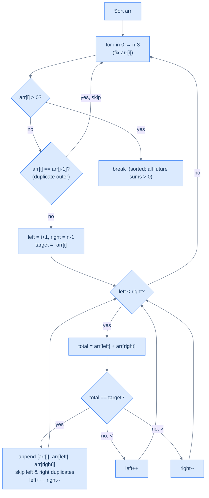
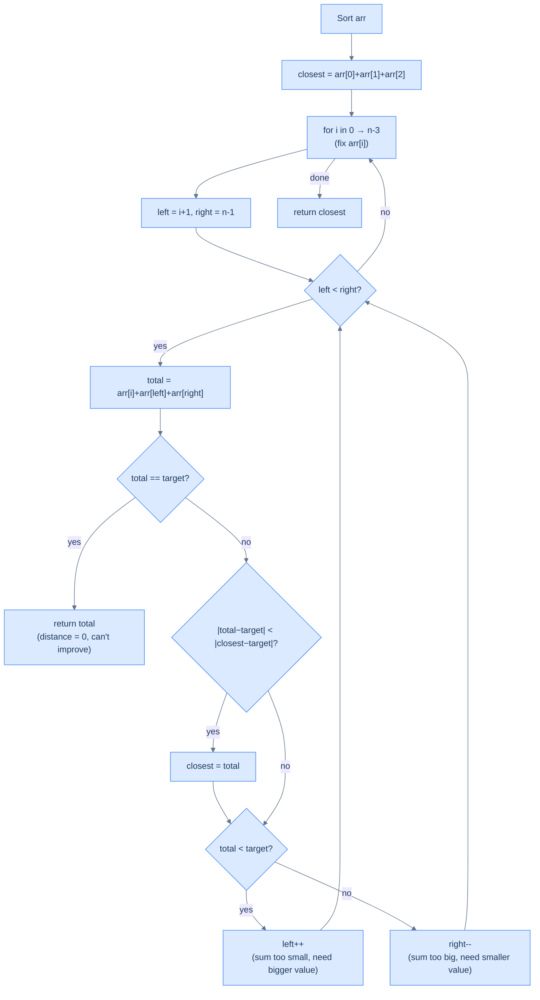
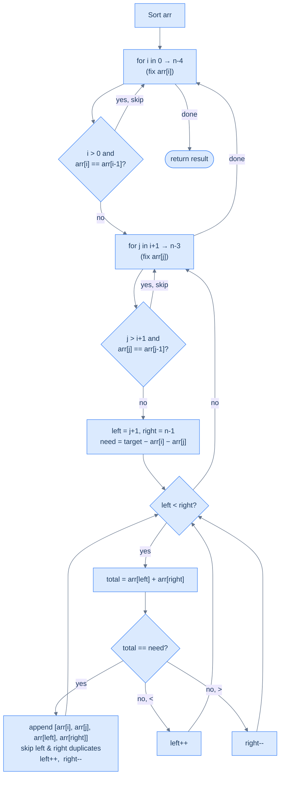

# 5. Pattern: Two pointers (Subproblem)

This section covers subproblem-style two-pointer techniques where each step reduces a larger array problem into a smaller one.

## Table of contents

1. [Identifying two pointer subproblem](#identifying-two-pointer-subproblem)
2. [K rotations](#k-rotations-right)
3. [Three sum](#three-sum)
4. [Approximate three sum](#approximate-three-sum)
5. [Four sum](#four-sum)

***

# Identifying Two Pointer Subproblem

## When the Problem Is Bigger Than One Two-Pointer Pass

So far, we've seen problems where a single two-pointer traversal solves the whole thing. But some problems are too complex for that — they consist of **multiple smaller pieces**, and the two-pointer technique applies to one (or more) of those pieces.

The key shift in thinking:

> Instead of asking "can I solve this with two pointers?", ask "can I **decompose** this into subproblems, any of which can be solved with two pointers?"

---

## The Diagnostic Questions

| Question | What it unlocks |
|---|---|
| **Q1.** Can the problem or solution be broken into smaller subproblems? | Identifies decomposition opportunities |
| **Q2.** Can any subproblem be solved with the two-pointer technique (directly or via reduction)? | Identifies where two pointers fit in |

If yes to both, you have a two-pointer subproblem pattern problem.

---

## The Example: K Rotations LEFT - Rotate Array **`k`** Times Left

**Problem:** Given an array `arr` of size `n` and an integer `k`, rotate the array `k` positions to the left in-place.

```
Input:  arr = [1, 2, 3, 4, 5, 6, 7, 8],  k = 4
Output: arr = [5, 6, 7, 8, 1, 2, 3, 4]
```

```d2
before: "Before  (k=4)" {
  grid-columns: 8
  grid-gap: 0
  a0: "1" {style.fill: "#fde68a"; style.stroke: "#d97706"}
  a1: "2" {style.fill: "#fde68a"; style.stroke: "#d97706"}
  a2: "3" {style.fill: "#fde68a"; style.stroke: "#d97706"}
  a3: "4" {style.fill: "#fde68a"; style.stroke: "#d97706"}
  a4: "5"
  a5: "6"
  a6: "7"
  a7: "8"
}

after: "After rotating 4 left" {
  grid-columns: 8
  grid-gap: 0
  b0: "5"
  b1: "6"
  b2: "7"
  b3: "8"
  b4: "1" {style.fill: "#fde68a"; style.stroke: "#d97706"}
  b5: "2" {style.fill: "#fde68a"; style.stroke: "#d97706"}
  b6: "3" {style.fill: "#fde68a"; style.stroke: "#d97706"}
  b7: "4" {style.fill: "#fde68a"; style.stroke: "#d97706"}
}

before -> after: "rotate left by k=4"
```

<p align="center"><strong>Rotate an array k=4 times to the left — the first 4 elements wrap around to the end.</strong></p>

---

## Brute Force: Temp Array, O(n) Space

Copy elements at k-shifted indices into a temp array, then copy back:

```d2
orig: "Original arr" {
  grid-columns: 8
  grid-gap: 0
  a0: "1"
  a1: "2"
  a2: "3"
  a3: "4"
  a4: "5"
  a5: "6"
  a6: "7"
  a7: "8"
}

temp: "temp:  temp[i] = arr[(i+k) % n]" {
  grid-columns: 8
  grid-gap: 0
  b0: "5"
  b1: "6"
  b2: "7"
  b3: "8"
  b4: "1"
  b5: "2"
  b6: "3"
  b7: "4"
}

copy: "Copy temp → arr" {
  grid-columns: 8
  grid-gap: 0
  c0: "5"
  c1: "6"
  c2: "7"
  c3: "8"
  c4: "1"
  c5: "2"
  c6: "3"
  c7: "4"
}

orig -> temp: "pass 1: fill temp"
temp -> copy: "pass 2: copy back"
```

<p align="center"><strong>Brute-force rotation using a temporary array — two passes, O(n) extra space.</strong></p>

```python,editable
def k_rotate(arr: List[int], k: int) -> None:
    n = len(arr)

    # Normalize k to avoid unnecessary rotations
    k = k % n

    # Create a temporary array of the same size
    temp = [0] * n

    # Copy items into the temp array starting from index k
    for i in range(n):
        # Rotate if we go out of bounds
        temp[i] = arr[(i + k) % n]

    # Copy items from the temp array back to the original array
    for i in range(n):
        arr[i] = temp[i]
```

<details>
<summary><strong>Trace — arr = [1, 2, 3, 4, 5, 6, 7, 8],  k = 4  (brute force)</strong></summary>

```
arr = [1, 2, 3, 4, 5, 6, 7, 8],  n = 8,  k = 4 % 8 = 4

Pass 1 — temp[i] = arr[(i + k) % n]:
  i=0: temp[0] = arr[(0+4)%8] = arr[4] = 5
  i=1: temp[1] = arr[(1+4)%8] = arr[5] = 6
  i=2: temp[2] = arr[(2+4)%8] = arr[6] = 7
  i=3: temp[3] = arr[(3+4)%8] = arr[7] = 8
  i=4: temp[4] = arr[(4+4)%8] = arr[0] = 1  ← wrap-around kicks in here
  i=5: temp[5] = arr[(5+4)%8] = arr[1] = 2
  i=6: temp[6] = arr[(6+4)%8] = arr[2] = 3
  i=7: temp[7] = arr[(7+4)%8] = arr[3] = 4

temp = [5, 6, 7, 8, 1, 2, 3, 4]

Pass 2 — copy temp → arr:
arr  = [5, 6, 7, 8, 1, 2, 3, 4] ✓

Note: The % operator is what handles the wrap-around.
      Without it, indices 4–7 would go out of bounds.
```

</details>

---

## Applying the Diagnostic Questions

| Question | Answer |
|---|---|
| **Q1.** Can the solution be broken into subproblems? | **Yes** — rotation = 3 in-place reversals |
| **Q2.** Can those subproblems use two pointers? | **Yes** — in-place reversal is the two-pointer flip |

### Q1 — Why "rotation = 3 in-place reversals"?

At first glance, rotating an array seems like it *must* involve moving elements around — shift the first element to the end, shift the second… that's O(n·k) moves. Or use a temp array and copy. But there's a beautiful shortcut.

**The insight:** A left rotation by `k` positions is *mathematically equivalent* to three in-place reversals of specific segments.

Here's the WHY step by step:

- After a left rotation by `k`, the first `k` elements move to the end, and the last `n-k` elements move to the front.
- Think of the array as two halves: `[LEFT | RIGHT]` where LEFT = first `k` elements, RIGHT = last `n-k` elements.
- The goal is to produce `[RIGHT | LEFT]` — swap those two halves.
- **How do 3 reversals achieve this?**
  1. Reverse LEFT → its internal order flips: `[LEFT_reversed | RIGHT]`
  2. Reverse RIGHT → its internal order flips: `[LEFT_reversed | RIGHT_reversed]`
  3. Reverse the entire array → everything flips, which **un-reverses both halves back to their original relative order** while swapping their positions: `[RIGHT | LEFT]` ✓

**Concrete check with `[1, 2, 3, 4 | 5, 6, 7, 8]`, k=4:**
- Step 1 (reverse LEFT): `[4, 3, 2, 1 | 5, 6, 7, 8]`
- Step 2 (reverse RIGHT): `[4, 3, 2, 1 | 8, 7, 6, 5]`
- Step 3 (reverse all): `[5, 6, 7, 8, 1, 2, 3, 4]` ✓

**What breaks if you skip a step?** If you only reversed the entire array without the two segment reversals first, you'd get `[8, 7, 6, 5, 4, 3, 2, 1]` — reversed, not rotated. The two prep reversals are what ensure each half's *internal order* is preserved after the final full reversal.

This is the subproblem decomposition: one complex O(n) operation (rotation) → three simpler O(n) operations (reversals), each solvable independently.

---

### Q2 — Why "in-place reversal is the two-pointer flip"?

Reversing a subarray is the canonical two-pointer direct application you already know:
- Place `left` at the start of the segment, `right` at the end.
- Swap `arr[left]` and `arr[right]`, then move `left` inward and `right` inward.
- Repeat until they meet in the middle.

**Why two pointers?** Because the reversal problem has a natural symmetric structure — the element at position `i` from the left goes to position `i` from the right. Two pointers exploit that symmetry directly: one pointer tracks "the element that needs to go right" and the other tracks "the element that needs to go left." They meet in the middle when all swaps are done.

**What if you didn't use two pointers?** You'd need an extra array to copy the reversed segment into, then copy it back — that's O(n) space per reversal, and we'd be back to the brute-force approach. Two pointers make it O(1) space per reversal.

So the full chain of reasoning is:
> Rotation → 3 reversals → each reversal → two-pointer → O(1) space total

---

**Critical observation:** a left rotation by `k` is equivalent to three reversal operations:

1. Reverse the first `k` elements: `arr[0..k-1]`
2. Reverse the remaining `n-k` elements: `arr[k..n-1]`
3. Reverse the entire array: `arr[0..n-1]`

```d2
s0: "Original:  [1, 2, 3, 4 | 5, 6, 7, 8]" {
  grid-columns: 8
  grid-gap: 0
  a0: "1" {style.fill: "#fde68a"; style.stroke: "#d97706"}
  a1: "2" {style.fill: "#fde68a"; style.stroke: "#d97706"}
  a2: "3" {style.fill: "#fde68a"; style.stroke: "#d97706"}
  a3: "4" {style.fill: "#fde68a"; style.stroke: "#d97706"}
  a4: "5"
  a5: "6"
  a6: "7"
  a7: "8"
}

s1: "Step 1: Reverse first k=4  →  [4, 3, 2, 1 | 5, 6, 7, 8]" {
  grid-columns: 8
  grid-gap: 0
  b0: "4" {style.fill: "#fde68a"; style.stroke: "#d97706"}
  b1: "3" {style.fill: "#fde68a"; style.stroke: "#d97706"}
  b2: "2" {style.fill: "#fde68a"; style.stroke: "#d97706"}
  b3: "1" {style.fill: "#fde68a"; style.stroke: "#d97706"}
  b4: "5" {style.fill: "#dcfce7"; style.stroke: "#16a34a"}
  b5: "6" {style.fill: "#dcfce7"; style.stroke: "#16a34a"}
  b6: "7" {style.fill: "#dcfce7"; style.stroke: "#16a34a"}
  b7: "8" {style.fill: "#dcfce7"; style.stroke: "#16a34a"}
}

s2: "Step 2: Reverse last n-k=4  →  [4, 3, 2, 1 | 8, 7, 6, 5]" {
  grid-columns: 8
  grid-gap: 0
  c0: "4"
  c1: "3"
  c2: "2"
  c3: "1"
  c4: "8" {style.fill: "#dcfce7"; style.stroke: "#16a34a"}
  c5: "7" {style.fill: "#dcfce7"; style.stroke: "#16a34a"}
  c6: "6" {style.fill: "#dcfce7"; style.stroke: "#16a34a"}
  c7: "5" {style.fill: "#dcfce7"; style.stroke: "#16a34a"}
}

s3: "Step 3: Reverse entire array  →  [5, 6, 7, 8, 1, 2, 3, 4]" {
  grid-columns: 8
  grid-gap: 0
  d0: "5" {style.fill: "#dbeafe"; style.stroke: "#3b82f6"}
  d1: "6" {style.fill: "#dbeafe"; style.stroke: "#3b82f6"}
  d2: "7" {style.fill: "#dbeafe"; style.stroke: "#3b82f6"}
  d3: "8" {style.fill: "#dbeafe"; style.stroke: "#3b82f6"}
  d4: "1" {style.fill: "#dbeafe"; style.stroke: "#3b82f6"}
  d5: "2" {style.fill: "#dbeafe"; style.stroke: "#3b82f6"}
  d6: "3" {style.fill: "#dbeafe"; style.stroke: "#3b82f6"}
  d7: "4" {style.fill: "#dbeafe"; style.stroke: "#3b82f6"}
}

s0 -> s1: "reverse arr[0..3]"
s1 -> s2: "reverse arr[4..7]"
s2 -> s3: "reverse arr[0..7]"
```

<p align="center"><strong>Shift k=4 elements to the left by combining three in-place reversal subproblems — each reversal is solved with the two-pointer technique, O(1) space total.</strong></p>

Each reversal is a direct two-pointer application (`left++`, `right--`, swap until they meet). Three subproblems, each O(n), solved in-place with O(1) extra memory.

---

## Two-Pointer Solution

```python,editable
from typing import List

class Solution:
    def reverse(self, arr: List[int], start: int, end: int) -> None:
        # Two-pointer in-place reversal:
        # 'start' moves right, 'end' moves left — they swap and converge
        while start < end:
            arr[start], arr[end] = arr[end], arr[start]  # Swap the two elements
            start += 1  # Shrink window from the left
            end   -= 1  # Shrink window from the right
        # When start >= end, every pair has been swapped — segment is reversed

    def k_rotations(self, arr: List[int], k: int) -> None:
        n = len(arr)

        # Normalize k: rotating n times returns the array unchanged,
        # so k=9 on a length-8 array is the same as k=1
        k %= n

        # Decompose rotation into 3 targeted reversals (the subproblem strategy):
        self.reverse(arr, 0, k - 1)   # Step 1: Reverse the LEFT segment  [0 .. k-1]
        self.reverse(arr, k, n - 1)   # Step 2: Reverse the RIGHT segment  [k .. n-1]
        self.reverse(arr, 0, n - 1)   # Step 3: Reverse entire array — un-reverses both halves
                                      #          and places RIGHT before LEFT, achieving the rotation


arr = [1, 2, 3, 4, 5, 6, 7, 8]
Solution().k_rotations(arr, 4)
print(arr)   # Expected: [5, 6, 7, 8, 1, 2, 3, 4]
```

<details>
<summary><strong>Trace — arr = [1, 2, 3, 4, 5, 6, 7, 8],  k = 4  (two-pointer, 3 reversals)</strong></summary>

```
arr = [1, 2, 3, 4, 5, 6, 7, 8],  n = 8,  k = 4 % 8 = 4

━━━ reverse(arr, 0, 3) — flip LEFT segment [0..3] ━━━
  start=0 (1), end=3 (4) │ 0 < 3 → swap │ [4, 2, 3, 1, 5, 6, 7, 8] │ start=1, end=2
  start=1 (2), end=2 (3) │ 1 < 2 → swap │ [4, 3, 2, 1, 5, 6, 7, 8] │ start=2, end=1
  start=2,     end=1     │ 2 > 1 → done

After step 1: [4, 3, 2, 1, 5, 6, 7, 8]

━━━ reverse(arr, 4, 7) — flip RIGHT segment [4..7] ━━━
  start=4 (5), end=7 (8) │ 4 < 7 → swap │ [4, 3, 2, 1, 8, 6, 7, 5] │ start=5, end=6
  start=5 (6), end=6 (7) │ 5 < 6 → swap │ [4, 3, 2, 1, 8, 7, 6, 5] │ start=6, end=5
  start=6,     end=5     │ 6 > 5 → done

After step 2: [4, 3, 2, 1, 8, 7, 6, 5]

━━━ reverse(arr, 0, 7) — flip ENTIRE array [0..7] ━━━
  start=0 (4), end=7 (5) │ 0 < 7 → swap │ [5, 3, 2, 1, 8, 7, 6, 4] │ start=1, end=6
  start=1 (3), end=6 (6) │ 1 < 6 → swap │ [5, 6, 2, 1, 8, 7, 3, 4] │ start=2, end=5
  start=2 (2), end=5 (7) │ 2 < 5 → swap │ [5, 6, 7, 1, 8, 2, 3, 4] │ start=3, end=4
  start=3 (1), end=4 (8) │ 3 < 4 → swap │ [5, 6, 7, 8, 1, 2, 3, 4] │ start=4, end=3
  start=4,     end=3     │ 4 > 3 → done

After step 3: [5, 6, 7, 8, 1, 2, 3, 4] ✓

Total swaps: 2 + 2 + 4 = 8  (all within O(n))
Extra space:  0 — every swap is in-place
```

</details>

---

## Problems in This Category

| Problem | Subproblems | How two pointers fit |
|---|---|---|
| **K Rotations** | 3 in-place reversals | Direct two-pointer on each reversal |
| **Three Sum** | Fix one element, solve Two Sum on the rest | Reduction: sort + two-pointer for each fixed element |
| **Approximate Three Sum** | Fix one element, find closest pair | Reduction: sort + two-pointer tracking minimum distance |
| **Four Sum** | Fix two elements, solve Two Sum on the rest | Two nested fixed elements + two-pointer inner pass |

Difficulty increases as the nesting depth grows — Four Sum has three nested loops where the innermost is two-pointer.

***

# K Rotations (Right)

## The Problem

Given an array `arr` and a non-negative number `k`, rotate the array by `k` steps to the **right** — in-place, using O(1) extra space.

**Example 1:**
```
Input:  arr = [1, 2, 3, 4, 5], k = 3
Output: [3, 4, 5, 1, 2]

Rotate 1 step right  →  [5, 1, 2, 3, 4]
Rotate 2 steps right →  [4, 5, 1, 2, 3]
Rotate 3 steps right →  [3, 4, 5, 1, 2]
```

**Example 2:**
```
Input:  arr = [1, 2, 3, 4, 5], k = 5
Output: [1, 2, 3, 4, 5]    ← rotating n times returns the original
```

**Example 3:**
```
Input:  arr = [1, 2, 3, 4, 5], k = 0
Output: [1, 2, 3, 4, 5]
```

---

## What Does "Rotate Right" Mean?

One step to the right means the **last element wraps around to the front**, and every other element shifts one position to the right.

```d2
direction: right

a: "[1, 2, 3, 4, 5]"
b: "[5, 1, 2, 3, 4]"
c: "[4, 5, 1, 2, 3]"
d: "[3, 4, 5, 1, 2]" {style.fill: "#dbeafe"; style.stroke: "#3b82f6"}

a -> b: "rotate right 1"
b -> c: "rotate right 2"
c -> d: "rotate right 3"
```

<p align="center"><strong>Each right rotation brings the last element to the front — after k=3 steps, the last 3 elements form the new prefix.</strong></p>

After `k` right rotations, the **last `k` elements** end up at the front, and the **first `n-k` elements** shift to the back.

Think of it as splitting the array into two halves: `[HEAD | TAIL]` where `HEAD` = first `n-k` elements and `TAIL` = last `k` elements. The goal is to produce `[TAIL | HEAD]`.

---

## Applying the Diagnostic Questions

| Question | Answer |
|---|---|
| **Q1.** Can the solution be broken into subproblems? | **Yes** — right rotation = 3 in-place reversals |
| **Q2.** Can those subproblems use two pointers? | **Yes** — in-place reversal is the classic two-pointer flip |

### Q1 — Why "right rotation = 3 in-place reversals"?

This is the same fundamental insight from the previous lesson, adapted for the direction of rotation.

**Mental model:** Split the array into `[HEAD | TAIL]`. A right rotation by `k` wants to produce `[TAIL | HEAD]`. Reversing each half individually scrambles their internal order, but a final full reversal restores both halves while swapping their positions.

**The three steps:**
1. Reverse `TAIL` (last `k` elements): internal order flips → `[HEAD | TAIL_reversed]`
2. Reverse `HEAD` (first `n-k` elements): internal order flips → `[HEAD_reversed | TAIL_reversed]`
3. Reverse the entire array: everything flips, which **un-reverses both halves** and places `TAIL` before `HEAD` → `[TAIL | HEAD]` ✓

**Concrete check with `[1, 2, 3, 4, 5]`, k=3:**
- `HEAD = [1, 2]` (first 2), `TAIL = [3, 4, 5]` (last 3)
- Step 1 (reverse TAIL `[2..4]`): `[1, 2, 5, 4, 3]`
- Step 2 (reverse HEAD `[0..1]`): `[2, 1, 5, 4, 3]`
- Step 3 (reverse all `[0..4]`): `[3, 4, 5, 1, 2]` ✓

**What breaks if you skip the segment reversals?** If you only reversed the entire array: `[1,2,3,4,5]` → `[5,4,3,2,1]`. That's a full reversal, not a rotation. The two preparatory reversals are what guarantee each half's internal order is preserved after the final flip.

**How this differs from left rotation:** The previous lesson solved left rotation by reversing the first `k` elements, then the last `n-k`, then the whole array. For right rotation, the segment sizes are swapped — you reverse the last `k` and the first `n-k` first, then the whole array. The same mechanic, with `HEAD` and `TAIL` switched.

### Q2 — Why "in-place reversal is the two-pointer flip"?

Reversing a segment `[start..end]` is the canonical two-pointer direct application:
- Place `left` at `start`, `right` at `end`
- Swap `arr[left]` and `arr[right]`, move `left` inward, `right` inward
- Stop when `left >= right`

**Why two pointers?** The reversal problem has perfect bilateral symmetry — element at position `i` from the left swaps with position `i` from the right. Two pointers exploit this directly, doing both jobs simultaneously from the outside in.

**What if you didn't use two pointers?** You'd need a temporary array to hold the reversed segment before writing it back — O(k) extra space per reversal. Two pointers do it with only two index variables — O(1) per reversal, O(1) total.

---

## The Three-Reversal Strategy (Visualised)

```d2
s0: "Original:  [1, 2 | 3, 4, 5]  (HEAD=2, TAIL=3)" {
  grid-columns: 5
  grid-gap: 0
  a0: "1" {style.fill: "#dcfce7"; style.stroke: "#16a34a"}
  a1: "2" {style.fill: "#dcfce7"; style.stroke: "#16a34a"}
  a2: "3" {style.fill: "#fde68a"; style.stroke: "#d97706"}
  a3: "4" {style.fill: "#fde68a"; style.stroke: "#d97706"}
  a4: "5" {style.fill: "#fde68a"; style.stroke: "#d97706"}
}

s1: "Step 1: Reverse TAIL [2..4]  →  [1, 2, 5, 4, 3]" {
  grid-columns: 5
  grid-gap: 0
  b0: "1"
  b1: "2"
  b2: "5" {style.fill: "#fde68a"; style.stroke: "#d97706"}
  b3: "4" {style.fill: "#fde68a"; style.stroke: "#d97706"}
  b4: "3" {style.fill: "#fde68a"; style.stroke: "#d97706"}
}

s2: "Step 2: Reverse HEAD [0..1]  →  [2, 1, 5, 4, 3]" {
  grid-columns: 5
  grid-gap: 0
  c0: "2" {style.fill: "#dcfce7"; style.stroke: "#16a34a"}
  c1: "1" {style.fill: "#dcfce7"; style.stroke: "#16a34a"}
  c2: "5"
  c3: "4"
  c4: "3"
}

s3: "Step 3: Reverse all [0..4]  →  [3, 4, 5, 1, 2]  ✓" {
  grid-columns: 5
  grid-gap: 0
  d0: "3" {style.fill: "#dbeafe"; style.stroke: "#3b82f6"}
  d1: "4" {style.fill: "#dbeafe"; style.stroke: "#3b82f6"}
  d2: "5" {style.fill: "#dbeafe"; style.stroke: "#3b82f6"}
  d3: "1" {style.fill: "#dbeafe"; style.stroke: "#3b82f6"}
  d4: "2" {style.fill: "#dbeafe"; style.stroke: "#3b82f6"}
}

s0 -> s1: "reverse arr[2..4]"
s1 -> s2: "reverse arr[0..1]"
s2 -> s3: "reverse arr[0..4]"
```

<p align="center"><strong>Right rotation by k=3 via three in-place reversals — each reversal is an independent two-pointer subproblem.</strong></p>

---

## The Solution

```python,editable
from typing import List

class Solution:
    def reverse(self, arr: List[int], start: int, end: int) -> None:
        while start < end:
            arr[start], arr[end] = arr[end], arr[start]  # Swap the outermost unseen pair
            start += 1  # Shrink window from the left
            end   -= 1  # Shrink window from the right
        # When start >= end, every pair has been swapped — segment is fully reversed

    def rotate_right(self, arr: List[int], k: int) -> None:
        n = len(arr)
        k %= n  # Rotating n times is a no-op; reduce k to its effective range [0, n-1]

        if k == 0:
            return  # Nothing to do — handles k=0 and k=n cleanly

        # Split: HEAD = arr[0..n-k-1], TAIL = arr[n-k..n-1]
        # Goal:  [TAIL | HEAD]
        self.reverse(arr, n - k, n - 1)   # Step 1: Reverse TAIL  →  scramble it for the final flip
        self.reverse(arr, 0, n - k - 1)   # Step 2: Reverse HEAD  →  scramble it for the final flip
        self.reverse(arr, 0, n - 1)        # Step 3: Reverse all   →  un-scrambles both halves in swapped positions


arr = [1, 2, 3, 4, 5]
Solution().rotate_right(arr, 3)
print(arr)  # Expected: [3, 4, 5, 1, 2]
```

<details>
<summary><strong>Trace — arr = [1, 2, 3, 4, 5], k = 3</strong></summary>

```
n = 5,  k = 3 % 5 = 3
HEAD = arr[0..1] = [1, 2],  TAIL = arr[2..4] = [3, 4, 5]

━━━ Step 1: reverse(arr, 2, 4) — flip TAIL [2..4] ━━━
  start=2 (3), end=4 (5)  │  2 < 4 → swap 3↔5  →  [1, 2, 5, 4, 3]  │  start=3, end=3
  start=3 (4), end=3 (4)  │  3 == 3 → stop (middle element, no swap)
After step 1: [1, 2, 5, 4, 3]

━━━ Step 2: reverse(arr, 0, 1) — flip HEAD [0..1] ━━━
  start=0 (1), end=1 (2)  │  0 < 1 → swap 1↔2  →  [2, 1, 5, 4, 3]  │  start=1, end=0
  start=1, end=0           │  1 > 0 → stop
After step 2: [2, 1, 5, 4, 3]

━━━ Step 3: reverse(arr, 0, 4) — flip entire array [0..4] ━━━
  start=0 (2), end=4 (3)  │  0 < 4 → swap 2↔3  →  [3, 1, 5, 4, 2]  │  start=1, end=3
  start=1 (1), end=3 (4)  │  1 < 3 → swap 1↔4  →  [3, 4, 5, 1, 2]  │  start=2, end=2
  start=2 (5), end=2 (5)  │  2 == 2 → stop (middle element, no swap)
After step 3: [3, 4, 5, 1, 2] ✓

Result: [3, 4, 5, 1, 2]
The last 3 elements are now the prefix; original relative order within each group is preserved.
```

</details>

---

## Complexity Analysis

| | Complexity | Reason |
|---|---|---|
| **Time** | O(n) | Each element is touched exactly twice across all three reversals |
| **Space** | O(1) | Only `start` and `end` index variables — no auxiliary array |

---

## Edge Cases

| Case | What happens |
|---|---|
| `k = 0` | `k %= n` → 0, early return — no work |
| `k = n` | `k %= n` → 0, early return — full rotation is a no-op |
| `k > n` | `k %= n` collapses it to the equivalent rotation (e.g. k=8, n=5 → k=3) |
| Single element (`n = 1`) | Any k reduces to 0 — no swaps occur |
| `k = 1` | `HEAD = arr[0..n-2]`, `TAIL = arr[n-1..n-1]` — just the last element wraps to front |

---

## Left vs. Right Rotation — The Relationship

Right rotation by `k` is identical to left rotation by `n - k`. Both use the same three-reversal trick; only the segment sizes in steps 1 and 2 are swapped:

| Operation | Step 1 | Step 2 | Step 3 |
|---|---|---|---|
| **Left rotation by k** | Reverse first `k` | Reverse last `n-k` | Reverse all |
| **Right rotation by k** | Reverse last `k` | Reverse first `n-k` | Reverse all |

The core mechanic is identical — what changes is which segment you call HEAD and which you call TAIL.

---

## Final Takeaway

A right rotation by `k` splits the array into `[HEAD | TAIL]` and produces `[TAIL | HEAD]`. The three-reversal trick achieves this in O(n) time, O(1) space: scramble TAIL, scramble HEAD, flip everything — the final reversal restores both halves' internal order while landing them in swapped positions. Always normalize `k` with `k %= n` first to eliminate redundant rotations.

***

# Three Sum

## The Problem

Given an integer array `arr`, find **all unique triplets** `[a, b, c]` such that `a + b + c = 0`. The solution set must not contain duplicate triplets.

```
Input:  arr = [-1, 0, 1, 2, -1, -4]
Output: [[-1, -1, 2], [-1, 0, 1]]
```

---

## Examples

**Example 1**
```
Input:  arr = [-1, 0, 1, 2, -1, -4]
Output: [[-1, -1, 2], [-1, 0, 1]]
```

**Example 2**
```
Input:  arr = [0, 0, 0, 0]
Output: [[0, 0, 0]]
```

**Example 3**
```
Input:  arr = [1, 2, 3]
Output: []
Explanation: No triplet sums to 0.
```

**Example 4**
```
Input:  arr = [-2, 0, 0, 2, 2]
Output: [[-2, 0, 2]]
```

---

## Intuition: Fix One, Two-Pointer the Rest

Three Sum extends Two Sum with one extra element fixed. If we pick one element `arr[i]` and fix it, the problem reduces to:

> Find all pairs in the **remaining** subarray that sum to `−arr[i]`.

That's exactly Duplicate Aware Two Sum! And we know how to solve that in O(n) with two pointers on a sorted array.

So the full algorithm is:
1. **Sort** the array
2. **Fix** each element `arr[i]` with an outer loop
3. **Two-pointer** on `arr[i+1..n-1]` searching for pairs summing to `−arr[i]`
4. **Skip duplicates** at every level to avoid repeated triplets



<p align="center"><strong>Three Sum — outer loop fixes one element; inner two-pointer finds all valid pairs summing to the negative of that element.</strong></p>

---

## Applying the Diagnostic Questions

Three Sum sits at the intersection of two patterns you've already seen — the **subproblem** pattern from this section and the **reduction** technique from the previous one. The diagnostic questions make this explicit.

| Question | Answer |
|---|---|
| **Q1.** Can the solution be broken into subproblems? | **Yes** — fix `arr[i]`; the problem becomes "find all pairs in `arr[i+1..n-1]` summing to `−arr[i]`" |
| **Q2.** Can any subproblem use two pointers (directly or via reduction)? | **Yes** — that pair-finding subproblem is exactly Duplicate Aware Two Sum, which sorts and uses two pointers in O(n) |

### Q1 — Why "fix one element and reduce to a pair-finding subproblem"?

**Mental model:** Think of the problem as searching through all triples `(a, b, c)` where `a + b + c = 0`. That's a three-dimensional search. If you lock one dimension — say `a = arr[i]` — you're left with a two-dimensional search: `b + c = −arr[i]`. Two unknowns on a sorted array is a problem you already know how to solve in O(n).

**Concrete numbers:** take `arr = [-4, -1, -1, 0, 1, 2]` (sorted). Fix `arr[1] = -1`. Now `target = −(−1) = 1`. The subproblem is: find all pairs in `[-1, 0, 1, 2]` summing to `1`. Two pointers find `(-1, 2)` and `(0, 1)` — giving triplets `[-1, -1, 2]` and `[-1, 0, 1]`.

**What breaks without this decomposition?** Without fixing one element, you'd need three nested loops to check every triple — O(n³). Fixing one element collapses the search from three dimensions to two, giving O(n²). The outer loop runs at most n times; the inner two-pointer pass runs in O(n) per iteration.

### Q2 — Why "the inner subproblem is Duplicate Aware Two Sum, solved with two pointers"?

**Mental model:** Once you fix `arr[i]` and have a sorted subarray with a target, the problem is identical to the Two Sum problems in the previous section. The subarray is already sorted (sorting once before the outer loop covers all inner passes). `arr[left]` is always the minimum remaining value and `arr[right]` is always the maximum. Every pointer move has a predictable, guaranteed effect: moving `left` right always increases the sum; moving `right` left always decreases it.

**Concrete numbers:** subarray `[-1, 0, 1, 2]`, target `1`:
- `left=0 (-1), right=3 (2)`: sum = 1 — match ✓, record and move both inward
- `left=1 (0), right=2 (1)`: sum = 1 — match ✓, record and move both inward
- `left=2, right=1`: left ≥ right — done

Two pointer moves, two results, O(n) total. A three-nested-loop brute force would take 6 comparisons for the same 4-element window.

**What breaks if you skip sorting?** Without sorting the subarray, moving `left` right no longer guarantees a larger value — you might skip the correct pair entirely. The decisive-direction property that makes two pointers work comes entirely from the sorted order.

> **Pattern note:** Three Sum is a two-pointer **subproblem** problem at the outer level (decompose by fixing one element), and a two-pointer **reduction** problem at the inner level (sort + two-pointer on the subarray). The nesting of patterns is what makes it an O(n²) solution — one layer of decomposition, one layer of linear two-pointer inside.

---

## The Early-Exit Optimisation

Since the array is sorted, if `arr[i] > 0`, then `arr[left] ≥ arr[i] > 0` and `arr[right] ≥ arr[i] > 0` — the sum of any three elements from position `i` onward is positive. No triplet can sum to 0. Break early.

---

## Solution

```python,editable
from typing import List

class Solution:
    def three_sum(self, arr: List[int]) -> List[List[int]]:
        # Sort the array to enable the two-pointer subproblem approach
        arr.sort()
        n      = len(arr)
        result = []

        for i in range(n - 2):
            # Early exit: if arr[i] > 0, all elements from i onward are positive — no triplet sums to 0
            if arr[i] > 0:
                break

            # Skip duplicate values for the fixed element to avoid duplicate triplets
            if i > 0 and arr[i] == arr[i - 1]:
                continue

            # Set up the two-pointer subproblem: find pairs in arr[i+1..n-1] summing to -arr[i]
            left, right = i + 1, n - 1
            target = -arr[i]

            # Run the two-pointer pass on the remaining subarray
            while left < right:
                total = arr[left] + arr[right]

                if total == target:
                    result.append([arr[i], arr[left], arr[right]])

                    # Skip consecutive left duplicates to avoid duplicate triplets
                    while left < right and arr[left] == arr[left + 1]:
                        left += 1
                    # Skip consecutive right duplicates to avoid duplicate triplets
                    while left < right and arr[right] == arr[right - 1]:
                        right -= 1

                    # Move both pointers inward after recording the match
                    left  += 1
                    right -= 1

                elif total < target:
                    # Sum too small — move left pointer to a larger value
                    left += 1
                else:
                    # Sum too large — move right pointer to a smaller value
                    right -= 1

        return result


# --- Test ---
sol = Solution()
print(sol.three_sum([-1, 0, 1, 2, -1, -4]))  # [[-1,-1,2],[-1,0,1]]
print(sol.three_sum([0, 0, 0, 0]))            # [[0,0,0]]
print(sol.three_sum([1, 2, 3]))               # []
print(sol.three_sum([-2, 0, 0, 2, 2]))        # [[-2,0,2]]
```

---

## Dry Run — Example 1

`arr = [-1, 0, 1, 2, -1, -4]` → sorted: `[-4, -1, -1, 0, 1, 2]`

**i=0, arr[i]=-4, target=4, left=1, right=5:**

| left | right | arr[l]+arr[r] | Action |
|---|---|---|---|
| 1 (-1) | 5 (2) | 1 | < 4 → left++ |
| 2 (-1) | 5 (2) | 1 | < 4 → left++ |
| 3 (0) | 5 (2) | 2 | < 4 → left++ |
| 4 (1) | 5 (2) | 3 | < 4 → left++ |
| 5=right | — | — | left ≥ right → stop |

No triplets for i=0.

**i=1, arr[i]=-1, target=1, left=2, right=5:**

| left | right | arr[l]+arr[r] | Action |
|---|---|---|---|
| 2 (-1) | 5 (2) | 1 | == 1 ✅ → record **[-1,-1,2]**, skip dup, left=3, right=4 |
| 3 (0) | 4 (1) | 1 | == 1 ✅ → record **[-1,0,1]**, left=4, right=3 |
| — | — | — | left ≥ right → stop |

**i=2, arr[i]=-1:** duplicate of arr[1] → skip

**i=3, arr[i]=0:** `arr[i] > 0`? No. target=0, left=4, right=5:

| left | right | arr[l]+arr[r] | Action |
|---|---|---|---|
| 4 (1) | 5 (2) | 3 | > 0 → right-- |
| 4 (1) | 4 | — | left ≥ right → stop |

**i=4:** only 1 element left — loop ends.

**Result: `[[-1,-1,2], [-1,0,1]]`** ✓

---

## Complexity Analysis

| | Complexity | Reasoning |
|---|---|---|
| **Time** | O(n²) | Outer loop O(n) × inner two-pointer O(n) — sort is O(n log n), dominated by O(n²) |
| **Space** | O(k) | k = number of unique triplets returned; O(1) working space |

---

## Edge Cases

| Scenario | Input | Output | Note |
|---|---|---|---|
| All zeros | `[0,0,0,0]` | `[[0,0,0]]` | Duplicate skip keeps it unique |
| No valid triplets | `[1,2,3]` | `[]` | All positive — early exit after i=0 |
| Single triplet | `[-1,0,1]` | `[[-1,0,1]]` | Exact minimum case |
| Array length < 3 | `[1,2]` | `[]` | Loop range `n-2` = 0 — never enters |

---

## Key Takeaway

Three Sum = outer fixed element + inner Duplicate Aware Two Sum. The reduction insight: fix one element and reduce to a two-variable sum problem on the sorted remainder. The same duplicate-skipping logic from the two-pointer reduction section applies — now at two levels (the fixed element and both inner pointers). The time complexity is O(n²), which is optimal for this problem.

***

# Approximate Three Sum

## The Problem

Given an integer array `arr` and an integer `target`, find three integers in `arr` whose sum is **closest to `target`**. Return that sum. You may assume exactly one solution exists.

```
Input:  arr = [-1, 2, 1, -4],  target = 1
Output: 2
```

---

## Examples

**Example 1**
```
Input:  arr = [2, 7, 11, 15],  target = 3
Output: 20
Explanation: 2 + 7 + 11 = 20 is the closest sum to 3.
```

**Example 2**
```
Input:  arr = [-1, 2, 1, -4],  target = 1
Output: 2
Explanation: -1 + 2 + 1 = 2 is the closest sum to 1.
```

**Example 3**
```
Input:  arr = [0, 0, 0],  target = 1
Output: 0
Explanation: 0 + 0 + 0 = 0 is the closest sum to 1.
```

---

## Intuition: Three Sum with a Closest Tracker

This problem is Three Sum's sibling — fix one element, two-pointer the rest — but with one twist: you no longer need an exact match. You need the **minimum distance** to the target across all triplets.

At each step of the two-pointer pass you compute `total = arr[i] + arr[left] + arr[right]`. Instead of checking `total == 0`, you compare `|total − target|` against the best distance seen so far and update your answer when you find something closer.

The decisive-direction property still holds: after sorting, moving `left` right always increases the total, and moving `right` left always decreases it. So every pointer move is still purposeful — you're navigating toward the target, not wandering randomly.

If you ever hit `total == target`, the distance is zero — you cannot get any closer. Return immediately.



<p align="center"><strong>Approximate Three Sum — fix one element, two-pointer the rest, track the minimum-distance sum seen so far.</strong></p>

---

## Applying the Diagnostic Questions

| Question | Answer |
|---|---|
| **Q1.** Can the solution be broken into subproblems? | **Yes** — fix `arr[i]`; the problem becomes "find the pair in `arr[i+1..n-1]` whose sum is closest to `target − arr[i]`" |
| **Q2.** Can the subproblem use two pointers? | **Yes** — two pointers on the sorted subarray give a decisive direction: left moves the sum up, right moves it down |

### Q1 — Why "fix one element and reduce to a closest-pair subproblem"?

**Mental model:** Searching for the closest triplet is a three-dimensional problem. Lock one dimension by fixing `arr[i]`, and you're left with: "find the pair in the rest of the array whose sum is closest to `target − arr[i]`." That's a two-variable closest-sum problem on a sorted subarray — a problem you can solve in O(n) with two pointers.

**Concrete numbers:** take `arr = [-4, -1, 1, 2]` (sorted), `target = 1`. Fix `arr[0] = −4`. The pair subproblem is now: find the pair in `[-1, 1, 2]` closest to `1 − (−4) = 5`. Two pointers check `(−1, 2) = 1`, then `(1, 2) = 3` — both miss 5, but they still contribute to the global closest tracker. The pair `(−1, 2)` gives triplet sum `−4 + (−1) + 2 = −3`; pair `(1, 2)` gives `−4 + 1 + 2 = −1`. Both update the tracker if they beat the current best.

**What breaks without decomposition?** Three nested loops checking every triplet cost O(n³). Fixing one element collapses the search from three dimensions to two: the outer loop runs n times; the inner two-pointer pass runs in O(n). The total is O(n²) — the same cost as exact Three Sum.

### Q2 — Why "two pointers give a decisive direction in the subproblem"?

**Mental model:** After sorting, `arr[left]` is always the smallest remaining value in the window and `arr[right]` is always the largest. Because of this, every pointer move has a predictable, guaranteed effect on the total:
- `left++` replaces the minimum with the next-larger value → total strictly increases
- `right--` replaces the maximum with the next-smaller value → total strictly decreases

This is the same decisive direction that made Two Sum and Three Sum work — just applied to distance minimisation instead of exact matching.

**Concrete numbers:** subarray `[-1, 1, 2]` with pair target `5`:
- `left=0 (−1), right=2 (2)`: pair sum = 1. Not 5, and `1 < 5` → move `left++`
- `left=1 (1), right=2 (2)`: pair sum = 3. Not 5, and `3 < 5` → move `left++`
- `left=2 = right` → stop

At every step we moved purposefully toward a larger sum because the current total was below the pair target. No pair is skipped — we're guaranteed to visit the best candidate.

**What breaks without sorting?** Without sorting, `left++` might produce a smaller value, not a larger one. The decisive direction disappears. You'd have to check every pair in the window — O(n²) per fixed element, O(n³) total.

---

## Solution

```python,editable
from typing import List

class Solution:
    def three_sum_closest(self, arr: List[int], target: int) -> int:
        arr.sort()  # Sorting enables the decisive-direction property for two pointers
        n       = len(arr)
        closest = arr[0] + arr[1] + arr[2]  # Initialise with the first valid triplet

        for i in range(n - 2):  # Fix one element; need at least 2 more for a triplet
            left, right = i + 1, n - 1

            while left < right:
                total = arr[i] + arr[left] + arr[right]

                # Update closest if this triplet is strictly nearer to target
                if abs(total - target) < abs(closest - target):
                    closest = total

                if total == target:
                    return total  # Distance is 0 — impossible to improve, exit immediately

                elif total < target:
                    left  += 1  # Sum too small; move left to a larger value to close the gap
                else:
                    right -= 1  # Sum too large; move right to a smaller value to close the gap

        return closest


# --- Test ---
sol = Solution()
print(sol.three_sum_closest([2, 7, 11, 15], 3))   # 20
print(sol.three_sum_closest([-1, 2, 1, -4], 1))   # 2
print(sol.three_sum_closest([0, 0, 0], 1))         # 0
```

---

## Dry Run

`arr = [-1, 2, 1, -4]`, `target = 1`
Sorted: `[-4, -1, 1, 2]`

Initial `closest = −4 + (−1) + 1 = −4`.

**i=0, arr[i]=−4, left=1, right=3:**

| left | right | arr[l]+arr[r] | total | Distance | Update closest? | Action |
|---|---|---|---|---|---|---|
| 1 (−1) | 3 (2) | 1 | −3 | \|−3−1\|=4 | −4→−3 ✓ | total < 1 → left++ |
| 2 (1) | 3 (2) | 3 | −1 | \|−1−1\|=2 | −3→−1 ✓ | total < 1 → left++ |
| 3=right | — | — | — | — | — | left ≥ right → stop |

Closest after i=0: **−1**

**i=1, arr[i]=−1, left=2, right=3:**

| left | right | arr[l]+arr[r] | total | Distance | Update closest? | Action |
|---|---|---|---|---|---|---|
| 2 (1) | 3 (2) | 3 | 2 | \|2−1\|=1 | −1→2 ✓ | total > 1 → right-- |
| 2 (1) | 2 | — | — | — | — | left ≥ right → stop |

Closest after i=1: **2**

Loop ends (range(n−2) = range(2) covers i=0,1 only).

**Result: `2`** ✓ (`−1 + 2 + 1 = 2`, distance 1 — the minimum possible)

<details>
<summary><strong>Trace — arr = [2, 7, 11, 15], target = 3</strong></summary>

```
Sorted: [2, 7, 11, 15],  target = 3
closest = 2 + 7 + 11 = 20

i=0, arr[i]=2, left=1, right=3:
  Step 1 │ left=1(7),  right=3(15) │ total=24 │ |24-3|=21 > |20-3|=17 → no update │ 24 > 3 → right--
  Step 2 │ left=1(7),  right=2(11) │ total=20 │ |20-3|=17 == current best → no update │ 20 > 3 → right--
  Step 3 │ left=1, right=1 → stop

i=1, arr[i]=7, left=2, right=3:
  Step 1 │ left=2(11), right=3(15) │ total=33 │ |33-3|=30 > 17 → no update │ 33 > 3 → right--
  Step 2 │ left=2, right=2 → stop

Result: 20 ✓  (2 + 7 + 11 = 20, distance 17 — no triplet gets closer to 3)
```

</details>

---

## Complexity Analysis

| | Complexity | Reasoning |
|---|---|---|
| **Time** | O(n²) | Outer loop O(n) × inner two-pointer O(n); sort is O(n log n), dominated by O(n²) |
| **Space** | O(1) | Only a handful of scalar variables — no extra data structure |

---

## Differences from Exact Three Sum

| Aspect | Three Sum (exact) | Approximate Three Sum |
|---|---|---|
| Goal | All triplets summing to 0 | One triplet sum closest to target |
| Match condition | `total == 0` → record | `|total − target|` minimised → update tracker |
| Early exit | `arr[i] > 0` → break | `total == target` → return immediately |
| Duplicate handling | Skip duplicates at both levels | Not needed — exactly one answer, duplicates cannot worsen it |
| Return value | List of triplets | Single integer (the closest sum) |

The algorithmic skeleton is identical; only the inner bookkeeping changes.

---

## Edge Cases

| Scenario | Input | Output | Note |
|---|---|---|---|
| Exact match exists | `[-1, 2, 1, -4]`, target=2 | 2 | `−1+2+1=2` hits target exactly; early-exit triggers |
| All same elements | `[0, 0, 0]`, target=1 | 0 | Only one triplet possible; 0 is returned |
| All positive, target very small | `[2, 7, 11, 15]`, target=3 | 20 | Smallest triplet sum (2+7+11) is still the closest |
| Minimum array size | `[1, 2, 3]`, target=100 | 6 | Only one triplet; 1+2+3=6 returned regardless |

---

## Key Takeaway

Approximate Three Sum = Exact Three Sum skeleton + a running closest tracker. Fix one element, two-pointer the rest, update the best answer when `|total − target|` shrinks, and return immediately on an exact hit. The sort-and-two-pointer approach gives O(n²) — the same asymptotic cost as the exact version, because "closest" still provides the same decisive direction as "exact": every pointer move is purposeful.

***

# Four Sum

## The Problem

Given an integer array `arr` and an integer `target`, find **all unique quadruplets** `[a, b, c, d]` such that `a + b + c + d = target`. The solution set must not contain duplicate quadruplets.

```
Input:  arr = [1, 0, -1, 0, -2, 2],  target = 0
Output: [[-2, -1, 1, 2], [-2, 0, 0, 2], [-1, 0, 0, 1]]
```

---

## Examples

**Example 1**
```
Input:  arr = [1, 0, -1, 0, -2, 2],  target = 0
Output: [[-2, -1, 1, 2], [-2, 0, 0, 2], [-1, 0, 0, 1]]
```

**Example 2**
```
Input:  arr = [2, 2, 2, 2, 2],  target = 8
Output: [[2, 2, 2, 2]]
Explanation: All elements are 2; only one unique quadruplet exists.
```

**Example 3**
```
Input:  arr = [1, 2, 3, 4],  target = 100
Output: []
Explanation: No quadruplet sums to 100.
```

**Example 4**
```
Input:  arr = [0, 0, 0, 0],  target = 0
Output: [[0, 0, 0, 0]]
```

---

## Intuition: Fix Two, Two-Pointer the Rest

You already know the pattern. Three Sum fixed one element and ran a Two Sum two-pointer on the rest. Four Sum takes this one step further: fix **two** elements with a nested outer loop and run a Two Sum two-pointer on the remaining subarray.

> Fix `arr[i]` and `arr[j]`. Now find all pairs in `arr[j+1..n-1]` summing to `target − arr[i] − arr[j]`.

That inner two-pointer is exactly the same Two Sum we've been using — sorted array, converging pointers, duplicate skipping. The only addition is a second outer loop and a second level of duplicate skipping.



<p align="center"><strong>Four Sum — two nested fixed-element loops, each with duplicate skipping, plus an inner two-pointer Two Sum pass.</strong></p>

---

## Applying the Diagnostic Questions

Four Sum is the clearest demonstration of the two-pointer subproblem pattern because the decomposition happens at **two levels** before the two-pointer even starts.

| Question | Answer |
|---|---|
| **Q1.** Can the solution be broken into subproblems? | **Yes** — fix `arr[i]` and `arr[j]`; the subproblem becomes "find all pairs in `arr[j+1..n-1]` summing to `target − arr[i] − arr[j]`" — a plain Two Sum |
| **Q2.** Can any subproblem use two pointers (directly or via reduction)? | **Yes** — the inner pair-finding is exactly the sorted two-pointer Two Sum from the reduction section: one linear pass, O(n) |

### Q1 — Why "fix two elements and reduce to Two Sum"?

**Mental model:** Think of the search space as four dimensions: `a + b + c + d = target`. Lock two dimensions — `a = arr[i]`, `b = arr[j]` — and you're left with two unknowns: `c + d = target − arr[i] − arr[j]`. Two unknowns on a sorted subarray is Two Sum — the problem you can already solve in O(n). Every additional element you fix collapses one more dimension; you always want to collapse down to exactly Two Sum, because that's the base case the two-pointer solves optimally.

**Concrete numbers:** `arr = [-2, -1, 0, 0, 1, 2]` (sorted), `target = 0`. Fix `arr[0] = -2` and `arr[1] = -1`. Remaining need: `0 − (−2) − (−1) = 3`. Subproblem: find pairs in `[0, 0, 1, 2]` summing to 3. Two-pointer:
- `left=0 (0), right=3 (2)`: sum `2 < 3` → `left++`
- `left=1 (0), right=3 (2)`: sum `2 < 3` → `left++`
- `left=2 (1), right=3 (2)`: sum `3 == 3` ✓ → record `[-2, -1, 1, 2]`

One fixed pair, one linear inner pass, one quadruplet found.

**What breaks if you only fix one element (like Three Sum)?** With one fixed element, the inner subproblem is Three Sum — O(n²) — and the outer loop is O(n), giving O(n³). With two fixed elements, the inner subproblem collapses to Two Sum — O(n) — and the two outer loops are O(n²), also giving O(n³). Same final complexity, but the two-level decomposition is cleaner: the innermost operation is always the same O(n) Two Sum core, regardless of how many outer loops wrap it.

**The pattern generalisation:** Three Sum fixed 1 element to reach Two Sum. Four Sum fixes 2 elements to reach Two Sum. k-Sum fixes k−2 elements to reach Two Sum. The number of fixed elements equals the number of outer loops; the innermost operation is always Two Sum.

### Q2 — Why "the inner Two Sum subproblem is solved with two pointers"?

**Mental model:** After fixing `arr[i]` and `arr[j]`, you have a sorted subarray `arr[j+1..n-1]` and a specific need. `arr[left]` is the minimum of that window; `arr[right]` is the maximum. Moving `left` right increases the pair sum; moving `right` left decreases it. This decisive direction — identical to the reduction section's Two Sum — is what makes the inner pass O(n) instead of O(n²).

**Concrete numbers:** subarray `[0, 0, 1, 2]`, need `3`:
- `left=0 (0), right=3 (2)`: sum `2 < 3` → moving `left` is the only way to increase the sum → `left++`
- `left=1 (0), right=3 (2)`: sum `2 < 3` → same reasoning → `left++`
- `left=2 (1), right=3 (2)`: sum `3 == 3` → match, record, move both inward
- `left=3, right=2`: `left > right` → done

Each decision eliminates one element permanently, so the inner loop runs at most `n − j − 1` steps — O(n) total per `(i, j)` pair.

**What if you skipped sorting?** Without sorting, `arr[left]` and `arr[right]` have no guaranteed min/max relationship. You'd need to try every pair in the subarray — O(n²) inner work instead of O(n) — making the total O(n⁴) instead of O(n³).

> **Pattern nesting in Four Sum:** the outer structure is a two-pointer **subproblem** pattern at two levels (fix `arr[i]`, then fix `arr[j]`), and the innermost operation is a two-pointer **reduction** (sort + Two Sum). The nesting depth of subproblem decompositions determines the exponent in the complexity: Two Sum → O(n), Three Sum → O(n²), Four Sum → O(n³).

---

## Duplicate Skipping — Three Levels

This is the part that trips people up. Duplicates must be skipped at every level independently:

| Level | What to skip | Why |
|---|---|---|
| **Outer loop `i`** | Skip if `arr[i] == arr[i-1]` | Same first element → same set of quadruplets |
| **Inner loop `j`** | Skip if `arr[j] == arr[j-1]` (and `j > i+1`) | Same second element with the same first → duplicate quadruplets |
| **Two-pointer** | After a match, skip while `arr[left] == arr[left+1]` and `arr[right] == arr[right-1]` | Same pair found again from the same `(i, j)` pair |

The `j > i+1` guard for the inner skip is important — without it, `j = i+1` would compare against `arr[i]` (a different fixed element), incorrectly skipping valid quadruplets.

---

## Solution

```python,editable
from typing import List

class Solution:
    def four_sum(self, arr: List[int], target: int) -> List[List[int]]:
        # Sort the array to enable the two-pointer subproblem approach
        arr.sort()
        n      = len(arr)
        result = []

        for i in range(n - 3):
            # Skip duplicate values for the first fixed element
            if i > 0 and arr[i] == arr[i - 1]:
                continue

            for j in range(i + 1, n - 2):
                # Skip duplicate values for the second fixed element
                # Guard j > i+1 prevents comparing against arr[i] (a different fixed element)
                if j > i + 1 and arr[j] == arr[j - 1]:
                    continue

                # Set up the two-pointer subproblem: find pairs summing to the remaining need
                left, right = j + 1, n - 1
                need = target - arr[i] - arr[j]

                # Run the two-pointer pass on the remaining subarray
                while left < right:
                    total = arr[left] + arr[right]

                    if total == need:
                        result.append([arr[i], arr[j], arr[left], arr[right]])

                        # Skip consecutive left duplicates to avoid duplicate quadruplets
                        while left < right and arr[left] == arr[left + 1]:
                            left += 1
                        # Skip consecutive right duplicates to avoid duplicate quadruplets
                        while left < right and arr[right] == arr[right - 1]:
                            right -= 1

                        # Move both pointers inward after recording the match
                        left  += 1
                        right -= 1

                    elif total < need:
                        # Sum too small — move left pointer to a larger value
                        left += 1
                    else:
                        # Sum too large — move right pointer to a smaller value
                        right -= 1

        return result


# --- Test ---
sol = Solution()
print(sol.four_sum([1, 0, -1, 0, -2, 2], 0))    # [[-2,-1,1,2],[-2,0,0,2],[-1,0,0,1]]
print(sol.four_sum([2, 2, 2, 2, 2], 8))          # [[2,2,2,2]]
print(sol.four_sum([1, 2, 3, 4], 100))            # []
print(sol.four_sum([0, 0, 0, 0], 0))             # [[0,0,0,0]]
```

---

## Dry Run — Example 1

`arr = [1, 0, -1, 0, -2, 2]` → sorted: `[-2, -1, 0, 0, 1, 2]`, target = 0

**i=0, arr[i]=-2:**

&nbsp;&nbsp;**j=1, arr[j]=-1, need=0−(−2)−(−1)=3, left=2, right=5:**

| left | right | total | Action |
|---|---|---|---|
| 2 (0) | 5 (2) | 2 | < 3 → left++ |
| 3 (0) | 5 (2) | 2 | < 3 → left++ |
| 4 (1) | 5 (2) | 3 | == 3 ✅ → record **[-2,-1,1,2]**, left=5, right=4 |
| — | — | — | left ≥ right → stop |

&nbsp;&nbsp;**j=2, arr[j]=0, need=0−(−2)−0=2, left=3, right=5:**

| left | right | total | Action |
|---|---|---|---|
| 3 (0) | 5 (2) | 2 | == 2 ✅ → record **[-2,0,0,2]**, left=4, right=4 |
| — | — | — | left ≥ right → stop |

&nbsp;&nbsp;**j=3, arr[j]=0:** duplicate of arr[2] (and j > i+1) → skip

&nbsp;&nbsp;**j=4, arr[j]=1, need=0−(−2)−1=1, left=5, right=5:** left ≥ right → stop immediately

**i=1, arr[i]=-1:**

&nbsp;&nbsp;**j=2, arr[j]=0, need=0−(−1)−0=1, left=3, right=5:**

| left | right | total | Action |
|---|---|---|---|
| 3 (0) | 5 (2) | 2 | > 1 → right-- |
| 3 (0) | 4 (1) | 1 | == 1 ✅ → record **[-1,0,0,1]**, left=4, right=3 |
| — | — | — | left ≥ right → stop |

&nbsp;&nbsp;**j=3, arr[j]=0:** duplicate of arr[2] → skip

&nbsp;&nbsp;**j=4, arr[j]=1, need=0−(−1)−1=0, left=5, right=5:** left ≥ right → stop

**i=2, arr[i]=0:**

&nbsp;&nbsp;**j=3, arr[j]=0, need=0−0−0=0, left=4, right=5:**

| left | right | total | Action |
|---|---|---|---|
| 4 (1) | 5 (2) | 3 | > 0 → right-- |
| 4 (1) | 4 | — | left ≥ right → stop |

**i=3:** `n-3=3`, loop ends.

**Result: `[[-2,-1,1,2], [-2,0,0,2], [-1,0,0,1]]`** ✓

---

## Complexity Analysis

| | Complexity | Reasoning |
|---|---|---|
| **Time** | O(n³) | Outer loop O(n) × inner loop O(n) × two-pointer O(n); sort is O(n log n), dominated by O(n³) |
| **Space** | O(k) | k = number of unique quadruplets returned; O(1) working space beyond output |

This is the natural cost of searching for 4 elements — each additional fixed element multiplies by O(n). Two Sum is O(n), Three Sum is O(n²), Four Sum is O(n³). You cannot do better than O(n³) for the general k-sum problem with k ≥ 3.

---

## Edge Cases

| Scenario | Input | Output | Note |
|---|---|---|---|
| All same elements | `[2,2,2,2,2]`, target=8 | `[[2,2,2,2]]` | Duplicate skipping at all three levels keeps it unique |
| No valid quadruplet | `[1,2,3,4]`, target=100 | `[]` | Two-pointer never finds a matching pair |
| Minimum length | `[1,2,3,4]`, target=10 | `[[1,2,3,4]]` | Only one quadruplet possible |
| Large duplicate set | `[0,0,0,0,0,0]`, target=0 | `[[0,0,0,0]]` | All three skip levels fire |
| Negative target | `[-3,-2,-1,0]`, target=-6 | `[[-3,-2,-1,0]]` | Works identically — no assumption about sign |

---

## The k-Sum Generalisation

The pattern is recursive:

- **Two Sum**: sort + single two-pointer pass → O(n)
- **Three Sum**: fix 1 element + Two Sum → O(n²)
- **Four Sum**: fix 2 elements + Two Sum → O(n³)
- **k-Sum**: fix k−2 elements (k−2 nested loops) + Two Sum → O(nᵏ⁻¹)

Every level adds one outer loop with duplicate skipping. The innermost operation is always the same two-pointer Two Sum.

```d2
direction: right

ts: |md
  **Two Sum**

  `O(n)`
| {style.fill: "#dcfce7"; style.stroke: "#16a34a"}

th: |md
  **Three Sum**

  fix 1 + Two Sum

  `O(n²)`
| {style.fill: "#dbeafe"; style.stroke: "#3b82f6"}

fo: |md
  **Four Sum**

  fix 2 + Two Sum

  `O(n³)`
| {style.fill: "#fde68a"; style.stroke: "#d97706"}

ks: |md
  **k-Sum**

  fix k−2 + Two Sum

  `O(nᵏ⁻¹)`
| {style.fill: "#ede9fe"; style.stroke: "#7c3aed"}

ts -> th: "wrap in one loop"
th -> fo: "wrap in one loop"
fo -> ks: "wrap in k−4 loops"
```

<p align="center"><strong>The k-Sum family — each level wraps the previous in one more outer loop with duplicate skipping. Two Sum is always the innermost operation.</strong></p>

---

## Comparison: Three Sum vs Four Sum

| | Three Sum | Four Sum |
|---|---|---|
| Outer loops | 1 (fix `i`) | 2 (fix `i` and `j`) |
| Duplicate skip levels | 2 (outer + two-pointer) | 3 (outer `i`, outer `j`, two-pointer) |
| `j` skip guard | N/A | `j > i + 1` (not `j > 0`) |
| Time complexity | O(n²) | O(n³) |
| Inner operation | Two-pointer on `arr[i+1..n-1]` | Two-pointer on `arr[j+1..n-1]` |

The only structural additions are: one more outer loop, one more duplicate-skip block with a careful guard condition, and the need-variable computed from two fixed elements instead of one.

---

## Key Takeaway

Four Sum is the natural extension of Three Sum — add one more fixed-element loop, add one more level of duplicate skipping. The inner two-pointer stays identical. Understanding this telescoping structure reveals the entire k-Sum family: every problem reduces to the same Two Sum core, wrapped in successively more outer loops. Once you have the pattern, adding another level of nesting is mechanical.
