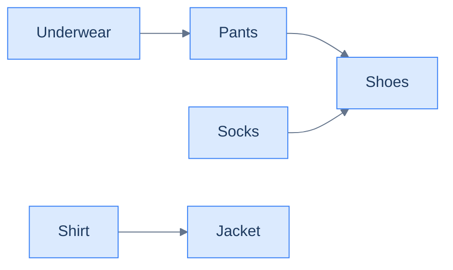
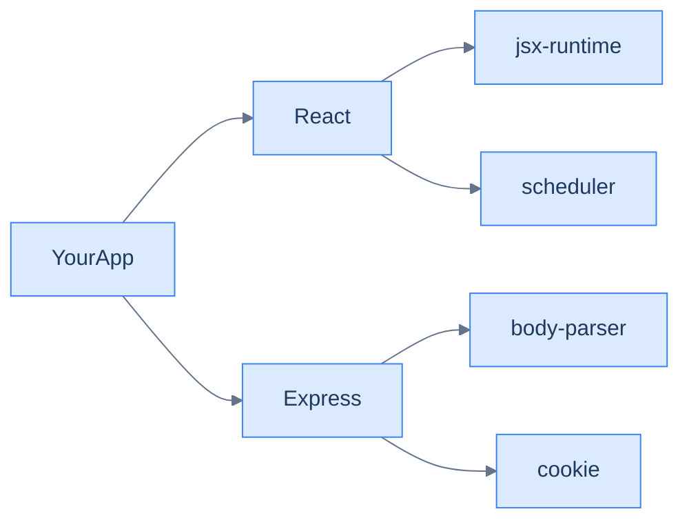
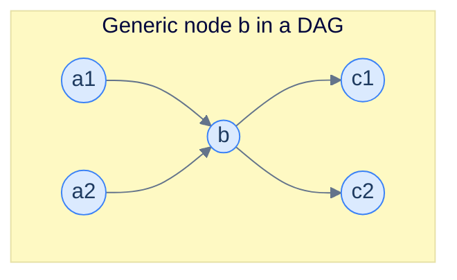
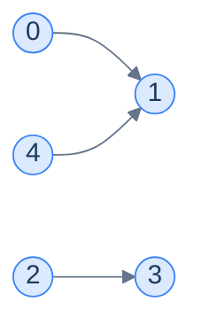

# 7. Topological sort

This lesson teaches you the algorithm that runs your **package manager**, your **build system**, your **task scheduler**, and your **course planner** — all of them are special cases of the same procedure: **topological sort**.

## Table of contents

1. [The ordering problem](#the-ordering-problem)
2. [Where topological sort lives in real software](#where-topological-sort-lives-in-real-software)
3. [The DFS-based algorithm](#the-dfs-based-algorithm)
4. [Implementation](#implementation)
5. [Topological sort with cycle detection](#topological-sort-with-cycle-detection)

***

# The Ordering Problem

You're packing for a trip. **Underwear before pants. Pants before shoes. Shirt before jacket. Socks before shoes.** That's it — those are the rules. Now: in what order should you put things on?



<p align="center"><strong>Getting-dressed dependency graph. Each arrow says "this must happen before that". The whole thing is directed (the rules have direction) and acyclic (you don't put on shoes <em>before</em> shoes).</strong></p>

There are several valid sequences:

- Underwear → Pants → Socks → Shoes → Shirt → Jacket ✓
- Shirt → Underwear → Pants → Socks → Shoes → Jacket ✓
- Socks → Underwear → Pants → Shoes → Shirt → Jacket ✓

What makes them valid? **Every arrow points forward in the sequence.** No item ever appears before something it depends on. Any sequence with that property is called a **topological order** of the graph.

A topological sort is just an algorithm that *produces one such valid sequence*. There can be many — usually there are.

> *Before reading on — if I added the rule "Jacket before Shoes", would there still be a valid order? What if I added "Shoes before Underwear" on top of the original rules?*

The first addition keeps things consistent: now jacket comes before shoes too. The second creates a cycle: Underwear → Pants → Shoes → Underwear. **No valid order exists for cyclic graphs** — a topological sort *cannot* be produced. Cycle detection (last lesson) is the precondition; topological sort is the construction.

> **Definition.** A *topological order* of a directed acyclic graph is a linear arrangement of its nodes such that for every edge `u → v`, `u` appears before `v`.

***

# Where Topological Sort Lives in Real Software

The reason this is one of the most-asked algorithms in interviews is that it shows up *everywhere*:

## Package managers (npm, pip, apt, cargo)

When you run `npm install`, the package manager builds the dependency DAG of all libraries your project pulls in. Some libraries depend on others; those depend on still others. **The install order is a topological sort of the dependency DAG**, so every dependency is in place before its dependents try to load it.



<p align="center"><strong>A simplified <code>node_modules</code> dependency graph. The package manager installs leaves first (jsx-runtime, scheduler, body-parser, cookie), works inward (React, Express), and finishes with your app.</strong></p>

## Build systems (Make, Bazel, Gradle)

A C++ project compiles `lib_a.o`, `lib_b.o`, `main.o`, then links the binary. `main.cpp` includes `lib_a.h`, so `lib_a` must compile first. The build tool runs a topological sort on the file dependency DAG and pipes the order to the compiler.

## Workflow engines (Airflow, Prefect, Argo)

You define a pipeline: download data → clean → train → evaluate → publish. The engine builds a DAG and topologically schedules tasks, running independent ones in parallel.

## Course planning

Calculus 2 requires Calculus 1. Linear Algebra requires Calc 1. ML requires both Linear Algebra and Probability. Your registrar's "earliest order" view is — you guessed it — a topological sort.

The pattern is identical in all four cases: there's a "X must finish before Y" relationship between things, the things form a DAG, and the answer is some linear order respecting all the arrows. **The algorithm we're about to learn solves all of them at once.**

***

# The DFS-Based Algorithm

The algorithm sounds counter-intuitive at first:

> **Run DFS. As you finish each node (i.e. all its descendants are done), append it to a list. Reverse the list at the end. That list is a topological order.**

Two strange things to notice:

1. We append on **finish**, not on **enter**.
2. We **reverse** at the end.

Both quirks come from the same insight, which is worth dwelling on for a moment.

---

## Why "Append on Finish" Gives Reverse Topological Order

When DFS finishes a node, it has *completely explored everything reachable from that node via outgoing edges*. That means every descendant has already been finished — and therefore already appended to the list — before this node is appended.

So at the moment we append node `b`:

- Every node reachable from `b` is already in the list.
- `b` is added *after* them.

In a topological order, `b` must come *before* its descendants. So adding `b` after its descendants gives the **reverse** topological order. One final reverse, and we're done.



<p align="center"><strong>Inputs to <code>b</code>: <code>a1, a2</code>. Outputs of <code>b</code>: <code>c1, c2</code>. DFS finishes <code>c1</code> and <code>c2</code> before finishing <code>b</code> — so when we append on finish, c's land in the list before b. The list is in reverse topological order.</strong></p>

---

## Why "Order of DFS Roots Doesn't Matter"

Suppose we run DFS from `b` first, then from `a1`. After DFS(b) finishes, the list contains `b` and all its descendants — *in reverse topological order*. When we then call DFS(a1), `b` is already visited, so DFS(a1) just appends `a1`. `a1` lands *after* everything DFS(b) added. Reading right-to-left, `a1` comes before `b`. Correct.

It works no matter which order we kick off DFS from each root. As long as we **append on finish** and **reverse at the end**, we always get a valid topological order. The choice of starting node only changes *which* of the many valid orders we produce.

---

## The Algorithm

> **`dfs(node, graph, visited, result)`**
> 1. Mark `node` as visited.
> 2. For each `neighbour` in `graph[node]`:
>    - If not visited, recurse.
> 3. Append `node` to `result`. *(Note: append on exit, not on enter.)*
>
> **`topologicalSort(graph)`**
> 1. Create empty `visited` set and `result` list.
> 2. For each `node` from 0 to N-1:
>    - If not visited, call `dfs(node, …)`.
> 3. Reverse `result`.
> 4. Return `result`.

Compare to plain DFS traversal: the *only difference* is *when* we record the node — at exit instead of at entry — and a final reverse.

---

## Walked Example

Take this graph:



<p align="center"><strong>Graph: 0→1, 2→3, 4→1. Adjacency list: <code>0:[1], 1:[], 2:[3], 3:[], 4:[1]</code>.</strong></p>

DFS from 0: visit 0 → visit 1 → 1 has no neighbours → finish 1 (append 1 → result = `[1]`) → finish 0 (append 0 → result = `[1, 0]`).

DFS from 2: visit 2 → visit 3 → finish 3 (`[1, 0, 3]`) → finish 2 (`[1, 0, 3, 2]`).

DFS from 4: visit 4 → 1 already visited → finish 4 (`[1, 0, 3, 2, 4]`).

Final reverse: **`[4, 2, 3, 0, 1]`**.

Verify: every edge points forward. 0→1: 0 at index 3, 1 at index 4 ✓. 2→3: 2 at 1, 3 at 2 ✓. 4→1: 4 at 0, 1 at 4 ✓. Done.

> *Before reading on — pick a different DFS starting order (say start at 4 first). Trace it. Do you get the same answer or a different valid topological order?*

Starting at 4 first: DFS(4) → DFS(1) → finish 1 → finish 4. List = `[1, 4]`. Then DFS(0) → 1 visited → finish 0. List = `[1, 4, 0]`. Then DFS(2) → DFS(3) → finish 3 → finish 2. List = `[1, 4, 0, 3, 2]`. Reverse: **`[2, 3, 0, 4, 1]`**. *Different but still valid* — every edge still points forward. Confirms the "order of DFS roots doesn't matter" lemma.

***

# Implementation

We assume the input is a DAG; if you can't make that assumption, jump to the next section.

<div class="lang-tabs">

```pseudocode
function dfs(graph, node, visited, result):
    add node to visited
    for neighbor in graph[node]:
        if neighbor is not in visited:
            dfs(graph, neighbor, visited, result)
    append node to result   # append on EXIT → builds reverse topo order

function topologicalSort(graph):
    visited ← empty set
    result ← empty list
    for node from 0 to N−1:
        if node is not in visited:
            dfs(graph, node, visited, result)
    reverse result
    return result
```

```python,editable
from typing import List, Set

class Solution:
    def dfs(self,
            graph: List[List[int]],
            node: int,
            visited: Set[int],
            result: List[int]) -> None:
        visited.add(node)
        for neighbour in graph[node]:
            if neighbour not in visited:
                self.dfs(graph, neighbour, visited, result)
        # CRITICAL: append on EXIT, not on enter. This builds reverse-topo order.
        result.append(node)

    def topological_sort(self, graph: List[List[int]]) -> List[int]:
        n = len(graph)
        if n == 0:
            return []
        visited: Set[int] = set()
        result: List[int] = []
        # Outer loop covers disconnected components.
        for node in range(n):
            if node not in visited:
                self.dfs(graph, node, visited, result)
        result.reverse()    # exit order is reverse-topo; reverse to fix.
        return result


graph = [[1], [], [3], [], [1]]
print(Solution().topological_sort(graph))   # one valid output: [4, 2, 3, 0, 1]
```

```java,editable
import java.util.*;

public class Main {
    static class Solution {
        public void dfs(List<List<Integer>> graph, int node,
                        Set<Integer> visited, List<Integer> result) {
            visited.add(node);
            for (int neighbour : graph.get(node)) {
                if (!visited.contains(neighbour)) dfs(graph, neighbour, visited, result);
            }
            result.add(node);   // append on exit
        }

        public List<Integer> topologicalSort(List<List<Integer>> graph) {
            int n = graph.size();
            if (n == 0) return new ArrayList<>();
            Set<Integer> visited = new HashSet<>();
            List<Integer> result = new ArrayList<>();
            for (int node = 0; node < n; node++) {
                if (!visited.contains(node)) dfs(graph, node, visited, result);
            }
            Collections.reverse(result);
            return result;
        }
    }

    public static void main(String[] args) {
        List<List<Integer>> graph = List.of(
            List.of(1), List.of(), List.of(3), List.of(), List.of(1));
        System.out.println(new Solution().topologicalSort(graph));
    }
}
```

```c,editable
#include <stdio.h>
#include <stdlib.h>
#include <stdbool.h>

typedef struct { int* data; int size; } AdjList;

static void dfs(AdjList* graph, int node, bool* visited, int* result, int* idx) {
    visited[node] = true;
    for (int i = 0; i < graph[node].size; i++) {
        int n = graph[node].data[i];
        if (!visited[n]) dfs(graph, n, visited, result, idx);
    }
    result[(*idx)++] = node;     // append on exit
}

void topological_sort(AdjList* graph, int n, int* result, int* result_size) {
    bool* visited = calloc(n, sizeof(bool));
    int idx = 0;
    for (int node = 0; node < n; node++) {
        if (!visited[node]) dfs(graph, node, visited, result, &idx);
    }
    // Reverse in place.
    for (int i = 0, j = idx - 1; i < j; i++, j--) {
        int tmp = result[i]; result[i] = result[j]; result[j] = tmp;
    }
    *result_size = idx;
    free(visited);
}

int main() {
    int n0[] = {1}, n1[] = {0}, n2[] = {3}, n3[] = {0}, n4[] = {1};
    AdjList g[] = {{n0, 1}, {NULL, 0}, {n2, 1}, {NULL, 0}, {n4, 1}};
    int result[5], size;
    topological_sort(g, 5, result, &size);
    for (int i = 0; i < size; i++) printf("%d ", result[i]);
    printf("\n");
    return 0;
}
```

```cpp,editable
#include <iostream>
#include <vector>
#include <algorithm>
#include <unordered_set>

class Solution {
public:
    void dfs(std::vector<std::vector<int>>& graph, int node,
             std::unordered_set<int>& visited, std::vector<int>& result) {
        visited.insert(node);
        for (int neighbour : graph[node]) {
            if (visited.find(neighbour) == visited.end()) dfs(graph, neighbour, visited, result);
        }
        result.push_back(node);
    }

    std::vector<int> topologicalSort(std::vector<std::vector<int>>& graph) {
        int n = (int)graph.size();
        if (n == 0) return {};
        std::vector<int> result;
        std::unordered_set<int> visited;
        for (int node = 0; node < n; node++) {
            if (visited.find(node) == visited.end()) dfs(graph, node, visited, result);
        }
        std::reverse(result.begin(), result.end());
        return result;
    }
};

int main() {
    std::vector<std::vector<int>> graph = {{1}, {}, {3}, {}, {1}};
    auto out = Solution().topologicalSort(graph);
    for (int v : out) std::cout << v << " ";
    std::cout << "\n";
}
```

```scala,editable
import scala.collection.mutable.{ArrayBuffer, HashSet}

object Main extends App {
  class Solution {
    def dfs(graph: Array[Array[Int]], node: Int,
            visited: HashSet[Int], result: ArrayBuffer[Int]): Unit = {
      visited.add(node)
      for (neighbour <- graph(node) if !visited.contains(neighbour))
        dfs(graph, neighbour, visited, result)
      result.append(node)
    }

    def topologicalSort(graph: Array[Array[Int]]): ArrayBuffer[Int] = {
      val visited = HashSet.empty[Int]
      val result = ArrayBuffer.empty[Int]
      for (node <- graph.indices if !visited.contains(node))
        dfs(graph, node, visited, result)
      result.reverse
    }
  }

  val graph = Array(Array(1), Array.empty[Int], Array(3), Array.empty[Int], Array(1))
  println(new Solution().topologicalSort(graph).mkString(", "))
}
```

```typescript,editable
class Solution {
    dfs(graph: number[][], node: number, visited: Set<number>, result: number[]): void {
        visited.add(node);
        for (const neighbour of graph[node]) {
            if (!visited.has(neighbour)) this.dfs(graph, neighbour, visited, result);
        }
        result.push(node);
    }

    topologicalSort(graph: number[][]): number[] {
        if (graph.length === 0) return [];
        const visited = new Set<number>();
        const result: number[] = [];
        for (let node = 0; node < graph.length; node++) {
            if (!visited.has(node)) this.dfs(graph, node, visited, result);
        }
        result.reverse();
        return result;
    }
}

const graph: number[][] = [[1], [], [3], [], [1]];
console.log(new Solution().topologicalSort(graph));
```

```go,editable
package main

import "fmt"

func dfsTopo(graph [][]int, node int, visited []bool, result *[]int) {
    visited[node] = true
    for _, n := range graph[node] {
        if !visited[n] {
            dfsTopo(graph, n, visited, result)
        }
    }
    *result = append(*result, node)
}

func topologicalSort(graph [][]int) []int {
    n := len(graph)
    if n == 0 {
        return nil
    }
    visited := make([]bool, n)
    result := []int{}
    for node := 0; node < n; node++ {
        if !visited[node] {
            dfsTopo(graph, node, visited, &result)
        }
    }
    // Reverse
    for i, j := 0, len(result)-1; i < j; i, j = i+1, j-1 {
        result[i], result[j] = result[j], result[i]
    }
    return result
}

func main() {
    graph := [][]int{{1}, {}, {3}, {}, {1}}
    fmt.Println(topologicalSort(graph))
}
```

```rust,editable
fn dfs(graph: &[Vec<usize>], node: usize, visited: &mut Vec<bool>, result: &mut Vec<usize>) {
    visited[node] = true;
    for &n in &graph[node] {
        if !visited[n] { dfs(graph, n, visited, result); }
    }
    result.push(node);
}

fn topological_sort(graph: &[Vec<usize>]) -> Vec<usize> {
    let n = graph.len();
    let mut visited = vec![false; n];
    let mut result = Vec::with_capacity(n);
    for node in 0..n {
        if !visited[node] {
            dfs(graph, node, &mut visited, &mut result);
        }
    }
    result.reverse();
    result
}

fn main() {
    let graph: Vec<Vec<usize>> = vec![vec![1], vec![], vec![3], vec![], vec![1]];
    println!("{:?}", topological_sort(&graph));
}
```

</div>

<details>
<summary><strong>Trace — graph = [[1], [], [3], [], [1]]</strong></summary>

```
Step │ Stack       │ Action                      │ visited       │ result
─────┼─────────────┼─────────────────────────────┼───────────────┼────────
1    │ dfs(0)      │ enter 0, visited += 0       │ {0}           │ []
2    │ dfs(1)      │ enter 1, visited += 1       │ {0,1}         │ []
3    │ dfs(1)      │ no neighbours; APPEND 1     │ {0,1}         │ [1]
4    │ dfs(0)      │ done; APPEND 0              │ {0,1}         │ [1,0]
5    │ dfs(2)      │ enter 2, visited += 2       │ {0,1,2}       │ [1,0]
6    │ dfs(3)      │ enter 3, visited += 3       │ {0,1,2,3}     │ [1,0]
7    │ dfs(3)      │ no neighbours; APPEND 3     │ {0,1,2,3}     │ [1,0,3]
8    │ dfs(2)      │ done; APPEND 2              │ {0,1,2,3}     │ [1,0,3,2]
9    │ dfs(4)      │ enter 4, visited += 4       │ {0,1,2,3,4}   │ [1,0,3,2]
10   │ dfs(4)      │ neighbour 1 visited; APPEND │ {0,1,2,3,4}   │ [1,0,3,2,4]
─────┴─────────────┴─────────────────────────────┴───────────────┴────────
After reverse: [4, 2, 3, 0, 1] ✓
```

</details>

## Complexity Analysis

| | Complexity | Reasoning |
|---|---|---|
| **Time** | O(N + E) | Same as plain DFS; the reverse at the end is O(N) |
| **Space** | O(N) | Visited set + recursion stack + result list |

***

# Topological Sort With Cycle Detection

The algorithm above assumes the input is a DAG. In practice, you often need to **handle the cyclic case gracefully** — package managers must reject circular dependencies; build systems must report which files form a cycle.

The fix is mechanical: **fuse last lesson's directed-cycle check into the DFS**. Same colour-coded logic — `visited` for "ever entered", `nodesInPath` for "currently on the stack". If you ever step into a node that's in `nodesInPath`, it's a cycle and there's no valid topological order — return empty.

> **`hasCycle(node, graph, visited, nodesInPath, result)`**
> 1. Mark visited; add to `nodesInPath`.
> 2. For each neighbour:
>    - If in `nodesInPath` → return `true` (cycle).
>    - Else if not visited → recurse; if recursion returns `true`, propagate.
> 3. Remove from `nodesInPath`.
> 4. **Append node to `result`.**
> 5. Return `false`.
>
> **`topologicalSortWithCycleCheck(graph)`**
> 1. Initialise empty sets and result list.
> 2. For each unvisited node: if `hasCycle` returns true → return empty list.
> 3. Reverse `result`.
> 4. Return `result`.

The integration is clean: the same single DFS does both jobs in one pass — detects the cycle *and* builds the (potential) topological order. If a cycle is found, throw the partial result away.

<div class="lang-tabs">

```pseudocode
function dfsSafe(graph, node, visited, inPath, result):
    add node to visited
    add node to inPath
    for neighbor in graph[node]:
        if neighbor is in inPath:
            return true   # cycle found
        if neighbor is not in visited:
            if dfsSafe(graph, neighbor, visited, inPath, result):
                return true
    remove node from inPath
    append node to result   # append on exit, same as cycle-free version
    return false

function topologicalSortSafe(graph):
    visited ← empty set
    inPath ← empty set
    result ← empty list
    for node from 0 to N−1:
        if node is not in visited:
            if dfsSafe(graph, node, visited, inPath, result):
                return empty list   # cycle detected
    reverse result
    return result
```

```python,editable
from typing import List, Set

class Solution:
    def has_cycle(self,
                  graph: List[List[int]],
                  node: int,
                  visited: Set[int],
                  in_path: Set[int],
                  result: List[int]) -> bool:
        visited.add(node)
        in_path.add(node)
        for neighbour in graph[node]:
            if neighbour in in_path:
                return True
            if neighbour not in visited:
                if self.has_cycle(graph, neighbour, visited, in_path, result):
                    return True
        in_path.discard(node)
        result.append(node)        # append on exit, just like the cycle-free version.
        return False

    def topological_sort_safe(self, graph: List[List[int]]) -> List[int]:
        n = len(graph)
        if n == 0:
            return []
        visited: Set[int] = set()
        in_path: Set[int] = set()
        result: List[int] = []
        for node in range(n):
            if node not in visited:
                if self.has_cycle(graph, node, visited, in_path, result):
                    return []      # cycle detected — no valid order
        result.reverse()
        return result


print(Solution().topological_sort_safe([[1], [], [3], [], [1]]))    # [4, 2, 3, 0, 1]
print(Solution().topological_sort_safe([[1], [2], [0, 3], [], [1]])) # [] — cycle!
```

```java,editable
import java.util.*;

public class Main {
    static class Solution {
        public boolean hasCycle(List<List<Integer>> graph, int node,
                                Set<Integer> visited, Set<Integer> inPath, List<Integer> result) {
            visited.add(node); inPath.add(node);
            for (int neighbour : graph.get(node)) {
                if (inPath.contains(neighbour)) return true;
                if (!visited.contains(neighbour)) {
                    if (hasCycle(graph, neighbour, visited, inPath, result)) return true;
                }
            }
            inPath.remove(node);
            result.add(node);
            return false;
        }

        public List<Integer> topologicalSortSafe(List<List<Integer>> graph) {
            int n = graph.size();
            if (n == 0) return new ArrayList<>();
            Set<Integer> visited = new HashSet<>();
            Set<Integer> inPath  = new HashSet<>();
            List<Integer> result = new ArrayList<>();
            for (int node = 0; node < n; node++) {
                if (!visited.contains(node)) {
                    if (hasCycle(graph, node, visited, inPath, result))
                        return new ArrayList<>();
                }
            }
            Collections.reverse(result);
            return result;
        }
    }

    public static void main(String[] args) {
        var dag = List.of(List.of(1), List.<Integer>of(), List.of(3), List.<Integer>of(), List.of(1));
        var cyc = List.of(List.of(1), List.of(2), List.of(0, 3), List.<Integer>of(), List.of(1));
        System.out.println(new Solution().topologicalSortSafe(dag));
        System.out.println(new Solution().topologicalSortSafe(cyc));
    }
}
```

```c,editable
#include <stdio.h>
#include <stdlib.h>
#include <stdbool.h>

typedef struct { int* data; int size; } AdjList;

static bool has_cycle(AdjList* graph, int node, bool* visited, bool* in_path,
                      int* result, int* idx) {
    visited[node] = true; in_path[node] = true;
    for (int i = 0; i < graph[node].size; i++) {
        int n = graph[node].data[i];
        if (in_path[n]) return true;
        if (!visited[n] && has_cycle(graph, n, visited, in_path, result, idx)) return true;
    }
    in_path[node] = false;
    result[(*idx)++] = node;
    return false;
}

int topological_sort_safe(AdjList* graph, int n, int* result) {
    bool* visited = calloc(n, sizeof(bool));
    bool* in_path = calloc(n, sizeof(bool));
    int idx = 0;
    bool cyclic = false;
    for (int node = 0; node < n; node++) {
        if (!visited[node]) {
            if (has_cycle(graph, node, visited, in_path, result, &idx)) {
                cyclic = true; break;
            }
        }
    }
    free(visited); free(in_path);
    if (cyclic) return 0;
    for (int i = 0, j = idx - 1; i < j; i++, j--) {
        int tmp = result[i]; result[i] = result[j]; result[j] = tmp;
    }
    return idx;
}

int main() {
    int n0[]={1}, n2[]={3}, n4[]={1};
    AdjList g[]={{n0,1},{NULL,0},{n2,1},{NULL,0},{n4,1}};
    int result[5];
    int len = topological_sort_safe(g, 5, result);
    for (int i = 0; i < len; i++) printf("%d ", result[i]); printf("\n");
    return 0;
}
```

```cpp,editable
#include <iostream>
#include <vector>
#include <algorithm>
#include <unordered_set>

class Solution {
public:
    bool hasCycle(std::vector<std::vector<int>>& graph, int node,
                  std::unordered_set<int>& visited, std::unordered_set<int>& inPath,
                  std::vector<int>& result) {
        visited.insert(node); inPath.insert(node);
        for (int neighbour : graph[node]) {
            if (inPath.find(neighbour) != inPath.end()) return true;
            if (visited.find(neighbour) == visited.end())
                if (hasCycle(graph, neighbour, visited, inPath, result)) return true;
        }
        inPath.erase(node);
        result.push_back(node);
        return false;
    }

    std::vector<int> topologicalSortSafe(std::vector<std::vector<int>>& graph) {
        int n = (int)graph.size();
        if (n == 0) return {};
        std::unordered_set<int> visited, inPath;
        std::vector<int> result;
        for (int node = 0; node < n; node++) {
            if (visited.find(node) == visited.end())
                if (hasCycle(graph, node, visited, inPath, result)) return {};
        }
        std::reverse(result.begin(), result.end());
        return result;
    }
};

int main() {
    std::vector<std::vector<int>> dag = {{1}, {}, {3}, {}, {1}};
    std::vector<std::vector<int>> cyc = {{1}, {2}, {0, 3}, {}, {1}};
    auto a = Solution().topologicalSortSafe(dag);
    auto b = Solution().topologicalSortSafe(cyc);
    for (int v : a) std::cout << v << " "; std::cout << "\n";
    std::cout << "(empty if cyclic): " << b.size() << "\n";
}
```

```scala,editable
import scala.collection.mutable.{ArrayBuffer, HashSet}

object Main extends App {
  class Solution {
    def hasCycle(graph: Array[Array[Int]], node: Int,
                 visited: HashSet[Int], inPath: HashSet[Int],
                 result: ArrayBuffer[Int]): Boolean = {
      visited.add(node); inPath.add(node)
      for (neighbour <- graph(node)) {
        if (inPath.contains(neighbour)) return true
        if (!visited.contains(neighbour) && hasCycle(graph, neighbour, visited, inPath, result))
          return true
      }
      inPath.remove(node)
      result.append(node)
      false
    }

    def topologicalSortSafe(graph: Array[Array[Int]]): ArrayBuffer[Int] = {
      val visited = HashSet.empty[Int]; val inPath = HashSet.empty[Int]
      val result = ArrayBuffer.empty[Int]
      for (node <- graph.indices if !visited.contains(node))
        if (hasCycle(graph, node, visited, inPath, result)) return ArrayBuffer.empty
      result.reverse
    }
  }

  val dag = Array(Array(1), Array.empty[Int], Array(3), Array.empty[Int], Array(1))
  val cyc = Array(Array(1), Array(2), Array(0, 3), Array.empty[Int], Array(1))
  println(new Solution().topologicalSortSafe(dag))
  println(new Solution().topologicalSortSafe(cyc))
}
```

```typescript,editable
class Solution {
    hasCycle(graph: number[][], node: number,
             visited: Set<number>, inPath: Set<number>, result: number[]): boolean {
        visited.add(node); inPath.add(node);
        for (const neighbour of graph[node]) {
            if (inPath.has(neighbour)) return true;
            if (!visited.has(neighbour))
                if (this.hasCycle(graph, neighbour, visited, inPath, result)) return true;
        }
        inPath.delete(node);
        result.push(node);
        return false;
    }

    topologicalSortSafe(graph: number[][]): number[] {
        if (graph.length === 0) return [];
        const visited = new Set<number>(), inPath = new Set<number>();
        const result: number[] = [];
        for (let node = 0; node < graph.length; node++) {
            if (!visited.has(node)) {
                if (this.hasCycle(graph, node, visited, inPath, result)) return [];
            }
        }
        result.reverse();
        return result;
    }
}

console.log(new Solution().topologicalSortSafe([[1], [], [3], [], [1]]));
console.log(new Solution().topologicalSortSafe([[1], [2], [0, 3], [], [1]]));
```

```go,editable
package main

import "fmt"

func hasCycleTopo(graph [][]int, node int, visited, inPath []bool, result *[]int) bool {
    visited[node] = true
    inPath[node] = true
    for _, n := range graph[node] {
        if inPath[n] {
            return true
        }
        if !visited[n] && hasCycleTopo(graph, n, visited, inPath, result) {
            return true
        }
    }
    inPath[node] = false
    *result = append(*result, node)
    return false
}

func topologicalSortSafe(graph [][]int) []int {
    n := len(graph)
    if n == 0 {
        return nil
    }
    visited := make([]bool, n)
    inPath := make([]bool, n)
    result := []int{}
    for node := 0; node < n; node++ {
        if !visited[node] {
            if hasCycleTopo(graph, node, visited, inPath, &result) {
                return []int{}
            }
        }
    }
    for i, j := 0, len(result)-1; i < j; i, j = i+1, j-1 {
        result[i], result[j] = result[j], result[i]
    }
    return result
}

func main() {
    fmt.Println(topologicalSortSafe([][]int{{1}, {}, {3}, {}, {1}}))
    fmt.Println(topologicalSortSafe([][]int{{1}, {2}, {0, 3}, {}, {1}}))
}
```

```rust,editable
fn has_cycle_topo(graph: &[Vec<usize>], node: usize, visited: &mut Vec<bool>,
                  in_path: &mut Vec<bool>, result: &mut Vec<usize>) -> bool {
    visited[node] = true; in_path[node] = true;
    for &n in &graph[node] {
        if in_path[n] { return true; }
        if !visited[n] && has_cycle_topo(graph, n, visited, in_path, result) {
            return true;
        }
    }
    in_path[node] = false;
    result.push(node);
    false
}

fn topological_sort_safe(graph: &[Vec<usize>]) -> Vec<usize> {
    let n = graph.len();
    let mut visited = vec![false; n];
    let mut in_path = vec![false; n];
    let mut result: Vec<usize> = Vec::new();
    for node in 0..n {
        if !visited[node] && has_cycle_topo(graph, node, &mut visited, &mut in_path, &mut result) {
            return vec![];
        }
    }
    result.reverse();
    result
}

fn main() {
    let dag: Vec<Vec<usize>> = vec![vec![1], vec![], vec![3], vec![], vec![1]];
    let cyc: Vec<Vec<usize>> = vec![vec![1], vec![2], vec![0, 3], vec![], vec![1]];
    println!("{:?}", topological_sort_safe(&dag));
    println!("{:?}", topological_sort_safe(&cyc));
}
```

</div>

Both versions share the same Big-O of O(N + E). The cycle-aware version costs an extra `inPath` set but never re-traverses anything, so the complexity is unchanged.

---

## Final Takeaway

Topological sort is the answer to: *"in what order can these things happen if some must come before others?"* — and the answer is the algorithmic core of every dependency-resolving system you'll ever touch.

The DFS-based recipe is just **"plain DFS, but record nodes on exit and reverse at the end"**. With the cycle-aware variant you get **"…and bail if a cycle exists"**. Two small twists on traversal — and you've solved a problem that powers software that runs the world.

Worth knowing for completeness: there's a *second* topological sort algorithm called **Kahn's algorithm**, which uses BFS and indegree counts instead of DFS exit times. It's equally fast and more parallel-friendly (it can run in waves), but DFS-based is simpler to memorise — pick whichever clicks for you.

Up next, we'll start tackling **shortest paths** — but this time with weighted edges, where the question stops being "fewest hops" and becomes "lowest total cost". That's where Dijkstra and Bellman-Ford enter the picture.

> **Transfer challenge.** A company's onboarding has 12 mandatory tasks (sign NDA, get laptop, set up VPN, complete training, …). Some depend on others. The HR team wants both *the order* and *which tasks can be done in parallel on day 1*. How would you adapt topological sort to identify the parallel layers?

<details>
<summary><strong>Sketch</strong></summary>

Use **Kahn's algorithm** (BFS-based topo sort). The set of nodes with indegree 0 at the start is "Layer 0" — all parallel. Process them, decrement indegrees of their neighbours, and the new indegree-0 set is "Layer 1". Repeat. Each layer is a group of tasks doable in parallel; layers are ordered.

This converts a topological sort from a flat list into a level-by-level partition — exactly what real schedulers (Airflow's DAG executor, for instance) compute.

</details>
