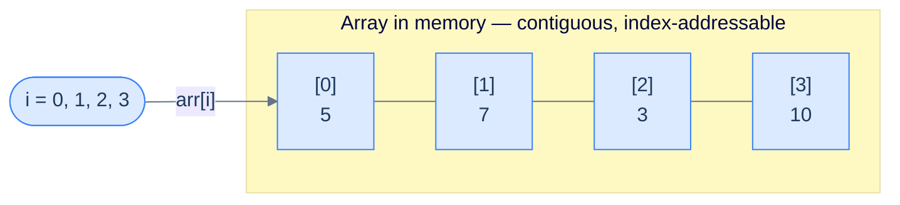
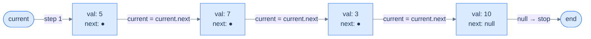

# 2. Traversal in Singly Linked Lists

## The Hook

In an array, reaching `arr[999]` is a single CPU instruction — a multiplication, an addition, a memory read. **Constant time.** In a linked list, reaching the 1000th node means following 999 pointers, one at a time, hopping through random memory addresses. So why would anyone *use* a linked list? Because O(1) random access isn't free — arrays pay for it with painful insertions and a fixed size. Linked lists pay for their flexibility with O(n) traversal. Every data structure trades one superpower for another.

In this lesson you'll master the traversal loop that underpins **every other linked-list operation** you'll ever write. Insertion walks until it finds the right spot. Deletion walks until it finds the victim. Reversal walks while flipping pointers. Cycle detection walks at two speeds. If you can't traverse fluently, none of the rest works — so let's nail this one cold.

---

## Table of contents

1. [Understanding traversal](#understanding-traversal)
2. [Node expedition](#node-expedition)
3. [Node search](#node-search)
4. [Length of the list](#length-of-the-list)

***

# Understanding traversal

Arrays and singly linked lists are both linear data structures. To better understand the traversal algorithm for a singly linked list, first, let us revisit the traversal algorithm in arrays.

## Traversal in arrays

In arrays, we have indexes to access the individual items of the array, e.g. `0`, `1`, `2`, etc, and for traversal, we just loop on the size of the array and traverse it with the loop control variable as our array index.



<p align="center"><strong>Array traversal uses an integer index <code>i</code> that increments from <code>0</code> to <code>n-1</code> — direct O(1) access at each step.</strong></p>

<div class="lang-tabs">

```python,editable
arr = [5, 7, 3, 10]

# For loop — index-based traversal
for i in range(len(arr)):
    print(arr[i], end=" ")  # Direct access via index

print()

# While loop — equivalent form
i = 0
while i < len(arr):
    print(arr[i], end=" ")
    i += 1
```

```java,editable
public class Main {
    public static void main(String[] args) {
        int[] arr = {5, 7, 3, 10};

        // For loop — index-based traversal
        for (int i = 0; i < arr.length; i++) {
            System.out.print(arr[i] + " ");  // Direct access via index
        }
        System.out.println();

        // While loop — equivalent form
        int i = 0;
        while (i < arr.length) {
            System.out.print(arr[i] + " ");
            i++;
        }
    }
}
```

```c,editable
#include <stdio.h>

int main() {
    int arr[] = {5, 7, 3, 10};
    int n = sizeof(arr) / sizeof(arr[0]);

    /* For loop — index-based traversal */
    for (int i = 0; i < n; i++) {
        printf("%d ", arr[i]);  /* Direct access via index */
    }
    printf("\n");

    /* While loop — equivalent form */
    int i = 0;
    while (i < n) {
        printf("%d ", arr[i]);
        i++;
    }
    return 0;
}
```

```cpp,editable
#include <iostream>
#include <vector>

int main() {
    std::vector<int> arr = {5, 7, 3, 10};

    // For loop — index-based traversal
    for (int i = 0; i < (int)arr.size(); i++) {
        std::cout << arr[i] << " ";  // Direct access via index
    }
    std::cout << "\n";

    // While loop — equivalent form
    int i = 0;
    while (i < (int)arr.size()) {
        std::cout << arr[i] << " ";
        i++;
    }
}
```

```scala,editable
object Main extends App {
  val arr = Array(5, 7, 3, 10)

  // For loop — index-based traversal
  for (i <- arr.indices) print(s"${arr(i)} ")
  println()

  // While loop — equivalent form
  var i = 0
  while (i < arr.length) {
    print(s"${arr(i)} ")
    i += 1
  }
}
```

```javascript,editable
const arr = [5, 7, 3, 10];

// For loop — index-based traversal
for (let i = 0; i < arr.length; i++) {
    process.stdout.write(arr[i] + " ");  // Direct access via index
}
console.log();

// While loop — equivalent form
let i = 0;
while (i < arr.length) {
    process.stdout.write(arr[i] + " ");
    i++;
}
```

```typescript,editable
const arr: number[] = [5, 7, 3, 10];

// For loop — index-based traversal
for (let i = 0; i < arr.length; i++) {
    process.stdout.write(arr[i] + " ");  // Direct access via index
}
console.log();

// While loop — equivalent form
let i: number = 0;
while (i < arr.length) {
    process.stdout.write(arr[i] + " ");
    i++;
}
```

```go,editable
package main

import "fmt"

func main() {
    arr := []int{5, 7, 3, 10}

    // For loop — index-based traversal
    for i := 0; i < len(arr); i++ {
        fmt.Print(arr[i], " ")  // Direct access via index
    }
    fmt.Println()

    // While loop (Go uses for as while)
    i := 0
    for i < len(arr) {
        fmt.Print(arr[i], " ")
        i++
    }
}
```

```kotlin,editable
fun main() {
    val arr = intArrayOf(5, 7, 3, 10)

    // For loop — index-based traversal
    for (i in arr.indices) print("${arr[i]} ")
    println()

    // While loop — equivalent form
    var i = 0
    while (i < arr.size) {
        print("${arr[i]} ")
        i++
    }
}
```

```rust,editable
fn main() {
    let arr = [5, 7, 3, 10];

    // For loop — index-based traversal
    for i in 0..arr.len() {
        print!("{} ", arr[i]);  // Direct access via index
    }
    println!();

    // While loop — equivalent form
    let mut i = 0;
    while i < arr.len() {
        print!("{} ", arr[i]);
        i += 1;
    }
}
```

</div>

## Traversal in singly linked lists

Data in a singly linked list is not stored in continuous memory, so we do not have indexes for random access like arrays. All the nodes are present at different memory locations. So, how do we traverse a linked list from start to end?

Instead of an integer loop control variable representing an item's index in an array, we use a variable referencing a node in the linked list as the loop control variable. Every time we want to move forward, we assign the node's reference in the linked list to this variable. We can get the node's reference by looking at the value stored in the pointer of the current node.

Since linked lists are dynamic, we don't know their length in advance, and therefore, we have to keep traversing until we reach a node with a **`null`** value stored in its pointer. That is how we know we have reached the end of a linked list.



<p align="center"><strong>Linked list traversal — a <code>current</code> pointer starts at <code>head</code> and hops forward via <code>current = current.next</code> until it reaches <code>null</code>.</strong></p>

Given below is the code implementation of singly linked list traversal.

<div class="lang-tabs">

```python,editable
class ListNode:
    def __init__(self, val=0, next=None):
        self.val = val; self.next = next

def traverse(head):
    current = head              # Start at the head node
    while current is not None:  # Stop when current falls off the end
        print(current.val, end=" ")
        current = current.next  # Advance to the next node

# Build list: 5 → 7 → 3 → 10
n4 = ListNode(10)
n3 = ListNode(3,  n4)
n2 = ListNode(7,  n3)
n1 = ListNode(5,  n2)
traverse(n1)  # 5 7 3 10
```

```java,editable
public class Main {
    static class ListNode { int val; ListNode next; ListNode(int v){val=v;} }

    static void traverse(ListNode head) {
        for (ListNode current = head; current != null; current = current.next) {
            System.out.print(current.val + " ");  // Advance: current = current.next
        }
    }

    public static void main(String[] args) {
        ListNode n1=new ListNode(5), n2=new ListNode(7),
                 n3=new ListNode(3), n4=new ListNode(10);
        n1.next=n2; n2.next=n3; n3.next=n4;
        traverse(n1);  // 5 7 3 10
    }
}
```

```c,editable
#include <stdio.h>
#include <stdlib.h>

typedef struct ListNode { int val; struct ListNode *next; } ListNode;
ListNode* newNode(int v) { ListNode*n=malloc(sizeof*n); n->val=v; n->next=NULL; return n; }

void traverse(ListNode *head) {
    ListNode *current = head;          /* Start at head */
    while (current != NULL) {          /* Stop when null is reached */
        printf("%d ", current->val);
        current = current->next;       /* Advance to next node */
    }
}

int main() {
    ListNode *n1=newNode(5), *n2=newNode(7), *n3=newNode(3), *n4=newNode(10);
    n1->next=n2; n2->next=n3; n3->next=n4;
    traverse(n1);  /* 5 7 3 10 */
    return 0;
}
```

```cpp,editable
#include <iostream>

struct ListNode { int val; ListNode *next; ListNode(int v):val(v),next(nullptr){} };

void traverse(ListNode *head) {
    // For-loop form: init=head, condition=not null, update=advance
    for (ListNode *current = head; current != nullptr; current = current->next) {
        std::cout << current->val << " ";
    }
}

int main() {
    auto *n1=new ListNode(5), *n2=new ListNode(7),
         *n3=new ListNode(3), *n4=new ListNode(10);
    n1->next=n2; n2->next=n3; n3->next=n4;
    traverse(n1);  // 5 7 3 10
}
```

```scala,editable
class ListNode(var v: Int, var next: ListNode = null)

object Main extends App {
  def traverse(head: ListNode): Unit = {
    var current = head
    while (current != null) {       // Stop when null is reached
      print(s"${current.v} ")
      current = current.next        // Advance to next node
    }
  }

  val n4 = new ListNode(10)
  val n3 = new ListNode(3,  n4)
  val n2 = new ListNode(7,  n3)
  val n1 = new ListNode(5,  n2)
  traverse(n1)  // 5 7 3 10
}
```

```javascript,editable
class ListNode { constructor(val,next=null){this.val=val;this.next=next;} }

function traverse(head) {
    let current = head;              // Start at head
    while (current !== null) {       // Stop when null is reached
        process.stdout.write(current.val + " ");
        current = current.next;      // Advance to next node
    }
}

const n4=new ListNode(10), n3=new ListNode(3,n4),
      n2=new ListNode(7,n3), n1=new ListNode(5,n2);
traverse(n1);  // 5 7 3 10
```

```typescript,editable
class ListNode { constructor(public val:number, public next:ListNode|null=null){} }

function traverse(head: ListNode | null): void {
    let current: ListNode | null = head;
    while (current !== null) {         // Stop when null is reached
        process.stdout.write(current.val + " ");
        current = current.next;        // Advance to next node
    }
}

const n4=new ListNode(10), n3=new ListNode(3,n4),
      n2=new ListNode(7,n3), n1=new ListNode(5,n2);
traverse(n1);  // 5 7 3 10
```

```go,editable
package main

import "fmt"

type ListNode struct { Val int; Next *ListNode }

func traverse(head *ListNode) {
    for current := head; current != nil; current = current.Next {
        fmt.Print(current.Val, " ")  // Advance: current = current.Next
    }
}

func main() {
    n4 := &ListNode{Val: 10}
    n3 := &ListNode{Val: 3,  Next: n4}
    n2 := &ListNode{Val: 7,  Next: n3}
    n1 := &ListNode{Val: 5,  Next: n2}
    traverse(n1)  // 5 7 3 10
}
```

```kotlin,editable
class ListNode(var `val`: Int, var next: ListNode? = null)

fun traverse(head: ListNode?) {
    var current = head
    while (current != null) {      // Stop when null is reached
        print("${current.`val`} ")
        current = current.next     // Advance to next node
    }
}

fun main() {
    val n4 = ListNode(10)
    val n3 = ListNode(3,  n4)
    val n2 = ListNode(7,  n3)
    val n1 = ListNode(5,  n2)
    traverse(n1)  // 5 7 3 10
}
```

```rust,editable
#[derive(Debug)]
struct ListNode { val: i32, next: Option<Box<ListNode>> }

fn traverse(head: &Option<Box<ListNode>>) {
    let mut current = head;
    while let Some(node) = current {   // Stop when None is reached
        print!("{} ", node.val);
        current = &node.next;          // Advance to next node
    }
}

fn main() {
    let list = Some(Box::new(ListNode { val: 5, next:
        Some(Box::new(ListNode { val: 7, next:
        Some(Box::new(ListNode { val: 3, next:
        Some(Box::new(ListNode { val: 10, next: None }))}))}))}));
    traverse(&list);  // 5 7 3 10
}
```

</div>

Later in the course, we will learn more about how to piggyback on this generic traversal logic to do various things as we traverse the singly linked list.

***

# Node expedition

## Problem Statement

Given the **head** of a singly linked list, write a function to print a comma (`,`) separated list of all the values from the start to the end.

### Example

> -   **Input:** head = \[5, 7, 3, 10\]
> -   **Output:** 5, 7, 3, 10

## Solution

<div class="lang-tabs">

```python,editable
class ListNode:
    def __init__(self, val=0, next=None):
        self.val = val; self.next = next

class Solution:
    def node_expedition(self, head: ListNode) -> None:
        current = head
        while current:
            print(current.val, end="")
            if current.next:        # Print comma only between nodes, not after last
                print(", ", end="")
            current = current.next
        print()

# Build list 5 → 7 → 3 → 10
n4=ListNode(10); n3=ListNode(3,n4); n2=ListNode(7,n3); n1=ListNode(5,n2)
Solution().node_expedition(n1)  # 5, 7, 3, 10
```

```java,editable
public class Main {
    static class ListNode { int val; ListNode next; ListNode(int v){val=v;} }

    static void nodeExpedition(ListNode head) {
        ListNode current = head;
        while (current != null) {
            System.out.print(current.val);
            if (current.next != null) System.out.print(", ");  // Comma between nodes only
            current = current.next;
        }
        System.out.println();
    }

    public static void main(String[] args) {
        ListNode n1=new ListNode(5), n2=new ListNode(7),
                 n3=new ListNode(3), n4=new ListNode(10);
        n1.next=n2; n2.next=n3; n3.next=n4;
        nodeExpedition(n1);  // 5, 7, 3, 10
    }
}
```

```c,editable
#include <stdio.h>
#include <stdlib.h>

typedef struct ListNode { int val; struct ListNode *next; } ListNode;
ListNode* newNode(int v){ ListNode*n=malloc(sizeof*n); n->val=v; n->next=NULL; return n; }

void nodeExpedition(ListNode *head) {
    ListNode *current = head;
    while (current != NULL) {
        printf("%d", current->val);
        if (current->next != NULL) printf(", ");  /* Comma between nodes only */
        current = current->next;
    }
    printf("\n");
}

int main() {
    ListNode *n1=newNode(5),*n2=newNode(7),*n3=newNode(3),*n4=newNode(10);
    n1->next=n2; n2->next=n3; n3->next=n4;
    nodeExpedition(n1);  /* 5, 7, 3, 10 */
    return 0;
}
```

```cpp,editable
#include <iostream>
using namespace std;

struct ListNode {
    int val; ListNode *next;
    ListNode(int v) : val(v), next(nullptr) {}
};

class Solution {
public:
    void nodeExpedition(ListNode *head) {
        ListNode *current = head;
        while (current != nullptr) {
            cout << current->val;
            if (current->next != nullptr) cout << ", ";  // Comma between nodes only
            current = current->next;
        }
        cout << "\n";
    }
};

int main() {
    auto *n1=new ListNode(5), *n2=new ListNode(7),
         *n3=new ListNode(3), *n4=new ListNode(10);
    n1->next=n2; n2->next=n3; n3->next=n4;
    Solution().nodeExpedition(n1);  // 5, 7, 3, 10
}
```

```scala,editable
class ListNode(var v: Int, var next: ListNode = null)

object Main extends App {
  def nodeExpedition(head: ListNode): Unit = {
    var current = head
    while (current != null) {
      print(current.v)
      if (current.next != null) print(", ")  // Comma between nodes only
      current = current.next
    }
    println()
  }

  val n4=new ListNode(10); val n3=new ListNode(3,n4)
  val n2=new ListNode(7,n3); val n1=new ListNode(5,n2)
  nodeExpedition(n1)  // 5, 7, 3, 10
}
```

```javascript,editable
class ListNode { constructor(val,next=null){this.val=val;this.next=next;} }

function nodeExpedition(head) {
    let current = head;
    while (current !== null) {
        process.stdout.write(String(current.val));
        if (current.next !== null) process.stdout.write(", ");  // Comma between nodes only
        current = current.next;
    }
    console.log();
}

const n4=new ListNode(10),n3=new ListNode(3,n4),
      n2=new ListNode(7,n3),n1=new ListNode(5,n2);
nodeExpedition(n1);  // 5, 7, 3, 10
```

```typescript,editable
class ListNode { constructor(public val:number, public next:ListNode|null=null){} }

function nodeExpedition(head: ListNode | null): void {
    let current: ListNode | null = head;
    while (current !== null) {
        process.stdout.write(String(current.val));
        if (current.next !== null) process.stdout.write(", ");
        current = current.next;
    }
    console.log();
}

const n4=new ListNode(10),n3=new ListNode(3,n4),
      n2=new ListNode(7,n3),n1=new ListNode(5,n2);
nodeExpedition(n1);  // 5, 7, 3, 10
```

```go,editable
package main

import "fmt"

type ListNode struct { Val int; Next *ListNode }

func nodeExpedition(head *ListNode) {
    for current := head; current != nil; current = current.Next {
        fmt.Print(current.Val)
        if current.Next != nil { fmt.Print(", ") }  // Comma between nodes only
    }
    fmt.Println()
}

func main() {
    n4:=&ListNode{Val:10}; n3:=&ListNode{Val:3,Next:n4}
    n2:=&ListNode{Val:7,Next:n3}; n1:=&ListNode{Val:5,Next:n2}
    nodeExpedition(n1)  // 5, 7, 3, 10
}
```

```kotlin,editable
class ListNode(var `val`: Int, var next: ListNode? = null)

fun nodeExpedition(head: ListNode?) {
    var current = head
    while (current != null) {
        print(current.`val`)
        if (current.next != null) print(", ")  // Comma between nodes only
        current = current.next
    }
    println()
}

fun main() {
    val n4=ListNode(10); val n3=ListNode(3,n4)
    val n2=ListNode(7,n3); val n1=ListNode(5,n2)
    nodeExpedition(n1)  // 5, 7, 3, 10
}
```

```rust,editable
#[derive(Debug)]
struct ListNode { val: i32, next: Option<Box<ListNode>> }

fn node_expedition(head: &Option<Box<ListNode>>) {
    let mut current = head;
    let mut first = true;
    while let Some(node) = current {
        if !first { print!(", "); }  // Comma between nodes only
        print!("{}", node.val);
        first = false;
        current = &node.next;
    }
    println!();
}

fn main() {
    let list = Some(Box::new(ListNode { val: 5, next:
        Some(Box::new(ListNode { val: 7, next:
        Some(Box::new(ListNode { val: 3, next:
        Some(Box::new(ListNode { val: 10, next: None }))}))}))}));
    node_expedition(&list);  // 5, 7, 3, 10
}
```

</div>

### Complexity & Key Idea

| | Complexity | Reasoning |
|---|---|---|
| **Time** | O(n) | Every node visited exactly once |
| **Space** | O(1) | One pointer variable; output stream is not counted |

The **only** subtlety is the comma placement — emit a comma *before* every value except the first, or *after* every value except the last. The `current.next != null` check is the "am I the last?" test you already know from the previous lesson's boundary-node problem. Look how quickly the primitives compound.

***

# Node Search

## Problem Statement

Given the **head** of a singly linked list and a **data** value, write a function to return the first node containing the given data. If no such node is found, return `null`.

### Example 1

> -   **Input:** head = \[5, 7, 3, 10\], data = 3
> -   **Output:** 3

### Example 2

> -   **Input:** head = \[5, 7, 6, 10\], data = 3
> -   **Output:** null

## Solution

<div class="lang-tabs">

```python,editable
class ListNode:
    def __init__(self, val=0, next=None):
        self.val = val; self.next = next

class Solution:
    def node_search(self, head: ListNode, data: int) -> ListNode | None:
        current = head
        while current:
            if current.val == data:   # Found — return immediately
                return current
            current = current.next    # Advance to next node
        return None                   # Exhausted the list without a match

# Build list 5 → 7 → 3 → 10
n4=ListNode(10); n3=ListNode(3,n4); n2=ListNode(7,n3); n1=ListNode(5,n2)
result = Solution().node_search(n1, 3)
print(result.val if result else "null")  # 3
print(Solution().node_search(n1, 99))    # None
```

```java,editable
public class Main {
    static class ListNode { int val; ListNode next; ListNode(int v){val=v;} }

    static ListNode nodeSearch(ListNode head, int data) {
        ListNode current = head;
        while (current != null) {
            if (current.val == data) return current;  // Found — return immediately
            current = current.next;
        }
        return null;  // Exhausted the list without a match
    }

    public static void main(String[] args) {
        ListNode n1=new ListNode(5),n2=new ListNode(7),
                 n3=new ListNode(3),n4=new ListNode(10);
        n1.next=n2; n2.next=n3; n3.next=n4;
        ListNode r = nodeSearch(n1, 3);
        System.out.println(r != null ? r.val : "null");  // 3
        System.out.println(nodeSearch(n1, 99));           // null
    }
}
```

```c,editable
#include <stdio.h>
#include <stdlib.h>

typedef struct ListNode { int val; struct ListNode *next; } ListNode;
ListNode* newNode(int v){ ListNode*n=malloc(sizeof*n); n->val=v; n->next=NULL; return n; }

ListNode* nodeSearch(ListNode *head, int data) {
    ListNode *current = head;
    while (current != NULL) {
        if (current->val == data) return current;  /* Found — return immediately */
        current = current->next;
    }
    return NULL;  /* Exhausted the list without a match */
}

int main() {
    ListNode *n1=newNode(5),*n2=newNode(7),*n3=newNode(3),*n4=newNode(10);
    n1->next=n2; n2->next=n3; n3->next=n4;
    ListNode *r = nodeSearch(n1, 3);
    printf("%s\n", r ? "3" : "null");  /* 3 */
    printf("%s\n", nodeSearch(n1, 99) ? "found" : "null");  /* null */
    return 0;
}
```

```cpp,editable
#include <iostream>
using namespace std;

struct ListNode {
    int val; ListNode *next;
    ListNode(int v) : val(v), next(nullptr) {}
};

class Solution {
public:
    ListNode* nodeSearch(ListNode *head, int data) {
        ListNode *current = head;
        while (current != nullptr) {
            if (current->val == data) return current;  // Found — return immediately
            current = current->next;
        }
        return nullptr;  // Exhausted the list without a match
    }
};

int main() {
    auto *n1=new ListNode(5),*n2=new ListNode(7),
         *n3=new ListNode(3),*n4=new ListNode(10);
    n1->next=n2; n2->next=n3; n3->next=n4;
    auto *r = Solution().nodeSearch(n1, 3);
    cout << (r ? to_string(r->val) : "null") << "\n";  // 3
}
```

```scala,editable
class ListNode(var v: Int, var next: ListNode = null)

object Main extends App {
  def nodeSearch(head: ListNode, data: Int): ListNode = {
    var current = head
    while (current != null) {
      if (current.v == data) return current  // Found — return immediately
      current = current.next
    }
    null  // Exhausted the list without a match
  }

  val n4=new ListNode(10); val n3=new ListNode(3,n4)
  val n2=new ListNode(7,n3); val n1=new ListNode(5,n2)
  val r = nodeSearch(n1, 3)
  println(if (r != null) r.v else "null")  // 3
}
```

```javascript,editable
class ListNode { constructor(val,next=null){this.val=val;this.next=next;} }

function nodeSearch(head, data) {
    let current = head;
    while (current !== null) {
        if (current.val === data) return current;  // Found — return immediately
        current = current.next;
    }
    return null;  // Exhausted the list without a match
}

const n4=new ListNode(10),n3=new ListNode(3,n4),
      n2=new ListNode(7,n3),n1=new ListNode(5,n2);
const r = nodeSearch(n1, 3);
console.log(r ? r.val : "null");  // 3
console.log(nodeSearch(n1, 99));  // null
```

```typescript,editable
class ListNode { constructor(public val:number, public next:ListNode|null=null){} }

function nodeSearch(head: ListNode | null, data: number): ListNode | null {
    let current: ListNode | null = head;
    while (current !== null) {
        if (current.val === data) return current;  // Found — return immediately
        current = current.next;
    }
    return null;  // Exhausted the list without a match
}

const n4=new ListNode(10),n3=new ListNode(3,n4),
      n2=new ListNode(7,n3),n1=new ListNode(5,n2);
const r = nodeSearch(n1, 3);
console.log(r ? r.val : "null");  // 3
```

```go,editable
package main

import "fmt"

type ListNode struct { Val int; Next *ListNode }

func nodeSearch(head *ListNode, data int) *ListNode {
    for current := head; current != nil; current = current.Next {
        if current.Val == data { return current }  // Found — return immediately
    }
    return nil  // Exhausted the list without a match
}

func main() {
    n4:=&ListNode{Val:10}; n3:=&ListNode{Val:3,Next:n4}
    n2:=&ListNode{Val:7,Next:n3}; n1:=&ListNode{Val:5,Next:n2}
    r := nodeSearch(n1, 3)
    if r != nil { fmt.Println(r.Val) } else { fmt.Println("null") }  // 3
}
```

```kotlin,editable
class ListNode(var `val`: Int, var next: ListNode? = null)

fun nodeSearch(head: ListNode?, data: Int): ListNode? {
    var current = head
    while (current != null) {
        if (current.`val` == data) return current  // Found — return immediately
        current = current.next
    }
    return null  // Exhausted the list without a match
}

fun main() {
    val n4=ListNode(10); val n3=ListNode(3,n4)
    val n2=ListNode(7,n3); val n1=ListNode(5,n2)
    val r = nodeSearch(n1, 3)
    println(r?.`val` ?: "null")  // 3
}
```

```rust,editable
#[derive(Debug)]
struct ListNode { val: i32, next: Option<Box<ListNode>> }

fn node_search(head: &Option<Box<ListNode>>, data: i32) -> Option<i32> {
    let mut current = head;
    while let Some(node) = current {
        if node.val == data { return Some(node.val); }  // Found — return immediately
        current = &node.next;
    }
    None  // Exhausted the list without a match
}

fn main() {
    let list = Some(Box::new(ListNode { val: 5, next:
        Some(Box::new(ListNode { val: 7, next:
        Some(Box::new(ListNode { val: 3, next:
        Some(Box::new(ListNode { val: 10, next: None }))}))}))}));
    println!("{:?}", node_search(&list, 3));   // Some(3)
    println!("{:?}", node_search(&list, 99));  // None
}
```

</div>

### Complexity & Key Idea

| | Complexity | Reasoning |
|---|---|---|
| **Time** | O(n) worst case, O(1) best case | Worst case: target absent or at tail. Best case: target is the head |
| **Space** | O(1) | Single pointer variable |

Notice the **early return**: the instant we find a match, we exit — we don't keep walking "just to be sure". This is linear search on a linked list, identical in shape to linear search on an array. The only difference is how we advance the cursor (`cur = cur.next` vs `i++`).

> *Before the next section — predict: if we need the list's length, does counting require any extra data? Or can we piggyback on the traversal we already wrote?*

***

# Length of the List

## Problem Statement

Given the **head** of a singly linked list, write a function that returns the length of the list.

### Example 1

> -   **Input:** head = \[5, 7, 3, 10\]
> -   **Output:** 4

### Example 2

> -   **Input:** head = \[\]
> -   **Output:** 0

## Solution

<div class="lang-tabs">

```python,editable
class ListNode:
    def __init__(self, val=0, next=None):
        self.val = val; self.next = next

class Solution:
    def length_of_the_list(self, head: ListNode) -> int:
        count = 0
        current = head
        while current:
            count   += 1           # Count this node
            current  = current.next
        return count

# Build list 5 → 7 → 3 → 10
n4=ListNode(10); n3=ListNode(3,n4); n2=ListNode(7,n3); n1=ListNode(5,n2)
print(Solution().length_of_the_list(n1))   # 4
print(Solution().length_of_the_list(None)) # 0
```

```java,editable
public class Main {
    static class ListNode { int val; ListNode next; ListNode(int v){val=v;} }

    static int lengthOfTheList(ListNode head) {
        int count = 0;
        for (ListNode cur = head; cur != null; cur = cur.next)
            count++;  // Count this node
        return count;
    }

    public static void main(String[] args) {
        ListNode n1=new ListNode(5),n2=new ListNode(7),
                 n3=new ListNode(3),n4=new ListNode(10);
        n1.next=n2; n2.next=n3; n3.next=n4;
        System.out.println(lengthOfTheList(n1));    // 4
        System.out.println(lengthOfTheList(null));  // 0
    }
}
```

```c,editable
#include <stdio.h>
#include <stdlib.h>

typedef struct ListNode { int val; struct ListNode *next; } ListNode;
ListNode* newNode(int v){ ListNode*n=malloc(sizeof*n); n->val=v; n->next=NULL; return n; }

int lengthOfTheList(ListNode *head) {
    int count = 0;
    for (ListNode *cur = head; cur != NULL; cur = cur->next)
        count++;  /* Count this node */
    return count;
}

int main() {
    ListNode *n1=newNode(5),*n2=newNode(7),*n3=newNode(3),*n4=newNode(10);
    n1->next=n2; n2->next=n3; n3->next=n4;
    printf("%d\n", lengthOfTheList(n1));    /* 4 */
    printf("%d\n", lengthOfTheList(NULL));  /* 0 */
    return 0;
}
```

```cpp,editable
#include <iostream>
using namespace std;

struct ListNode {
    int val; ListNode *next;
    ListNode(int v) : val(v), next(nullptr) {}
};

class Solution {
public:
    int lengthOfTheList(ListNode *head) {
        int count = 0;
        for (ListNode *cur = head; cur != nullptr; cur = cur->next)
            count++;  // Count this node
        return count;
    }
};

int main() {
    auto *n1=new ListNode(5),*n2=new ListNode(7),
         *n3=new ListNode(3),*n4=new ListNode(10);
    n1->next=n2; n2->next=n3; n3->next=n4;
    cout << Solution().lengthOfTheList(n1)      << "\n";  // 4
    cout << Solution().lengthOfTheList(nullptr) << "\n";  // 0
}
```

```scala,editable
class ListNode(var v: Int, var next: ListNode = null)

object Main extends App {
  def lengthOfTheList(head: ListNode): Int = {
    var count = 0
    var current = head
    while (current != null) { count += 1; current = current.next }
    count
  }

  val n4=new ListNode(10); val n3=new ListNode(3,n4)
  val n2=new ListNode(7,n3); val n1=new ListNode(5,n2)
  println(lengthOfTheList(n1))    // 4
  println(lengthOfTheList(null))  // 0
}
```

```javascript,editable
class ListNode { constructor(val,next=null){this.val=val;this.next=next;} }

function lengthOfTheList(head) {
    let count = 0;
    for (let cur = head; cur !== null; cur = cur.next)
        count++;  // Count this node
    return count;
}

const n4=new ListNode(10),n3=new ListNode(3,n4),
      n2=new ListNode(7,n3),n1=new ListNode(5,n2);
console.log(lengthOfTheList(n1));    // 4
console.log(lengthOfTheList(null));  // 0
```

```typescript,editable
class ListNode { constructor(public val:number, public next:ListNode|null=null){} }

function lengthOfTheList(head: ListNode | null): number {
    let count = 0;
    for (let cur: ListNode | null = head; cur !== null; cur = cur.next)
        count++;
    return count;
}

const n4=new ListNode(10),n3=new ListNode(3,n4),
      n2=new ListNode(7,n3),n1=new ListNode(5,n2);
console.log(lengthOfTheList(n1));    // 4
console.log(lengthOfTheList(null));  // 0
```

```go,editable
package main

import "fmt"

type ListNode struct { Val int; Next *ListNode }

func lengthOfTheList(head *ListNode) int {
    count := 0
    for cur := head; cur != nil; cur = cur.Next {
        count++  // Count this node
    }
    return count
}

func main() {
    n4:=&ListNode{Val:10}; n3:=&ListNode{Val:3,Next:n4}
    n2:=&ListNode{Val:7,Next:n3}; n1:=&ListNode{Val:5,Next:n2}
    fmt.Println(lengthOfTheList(n1))   // 4
    fmt.Println(lengthOfTheList(nil))  // 0
}
```

```kotlin,editable
class ListNode(var `val`: Int, var next: ListNode? = null)

fun lengthOfTheList(head: ListNode?): Int {
    var count = 0
    var cur = head
    while (cur != null) { count++; cur = cur.next }
    return count
}

fun main() {
    val n4=ListNode(10); val n3=ListNode(3,n4)
    val n2=ListNode(7,n3); val n1=ListNode(5,n2)
    println(lengthOfTheList(n1))    // 4
    println(lengthOfTheList(null))  // 0
}
```

```rust,editable
#[derive(Debug)]
struct ListNode { val: i32, next: Option<Box<ListNode>> }

fn length_of_the_list(head: &Option<Box<ListNode>>) -> usize {
    let mut count = 0;
    let mut current = head;
    while let Some(node) = current {
        count += 1;               // Count this node
        current = &node.next;
    }
    count
}

fn main() {
    let list = Some(Box::new(ListNode { val: 5, next:
        Some(Box::new(ListNode { val: 7, next:
        Some(Box::new(ListNode { val: 3, next:
        Some(Box::new(ListNode { val: 10, next: None }))}))}))}));
    println!("{}", length_of_the_list(&list));        // 4
    println!("{}", length_of_the_list(&None));        // 0
}
```

</div>

### Complexity & Key Idea

| | Complexity | Reasoning |
|---|---|---|
| **Time** | O(n) | We must visit every node to count them — no shortcut |
| **Space** | O(1) | A single integer counter |

This is the painful part of linked lists: **there is no `.length` you can read in O(1)**. Every length query walks the entire list. That's why production linked-list implementations often cache a `size` field on the list object itself and update it on every insert/delete — trading a tiny bit of bookkeeping for O(1) size queries.

---

## Final Takeaway

Three problems, three variants of the same five-line loop:

```
current = head
while current is not null:
    <do something with current.val or current.next>
    current = current.next
```

Everything else in this course — every pattern, every interview problem — is **this loop with something clever plugged into the middle**. Internalise the skeleton. When you see a linked-list problem and panic, remember: you already know how to walk it. The only question is *what to do at each step*.

> **Transfer Challenge:** Write a single function that returns **both** the length and the sum of all values in one pass. Why is this better than calling `length()` and then `sum()` separately?
>
> <details><summary><strong>Solution hint</strong></summary>
>
> Both need a full walk — calling them separately costs 2n hops. A combined walk costs n hops. Pass both accumulators as local variables; return a tuple `(length, sum)`. Same pattern extends to "return min, max, length, sum" in one pass.
>
> </details>
