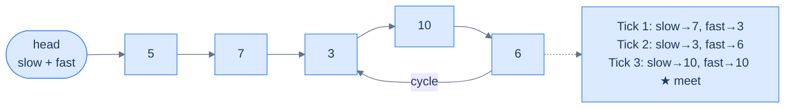
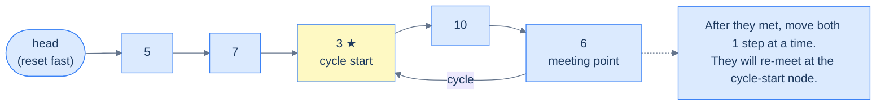
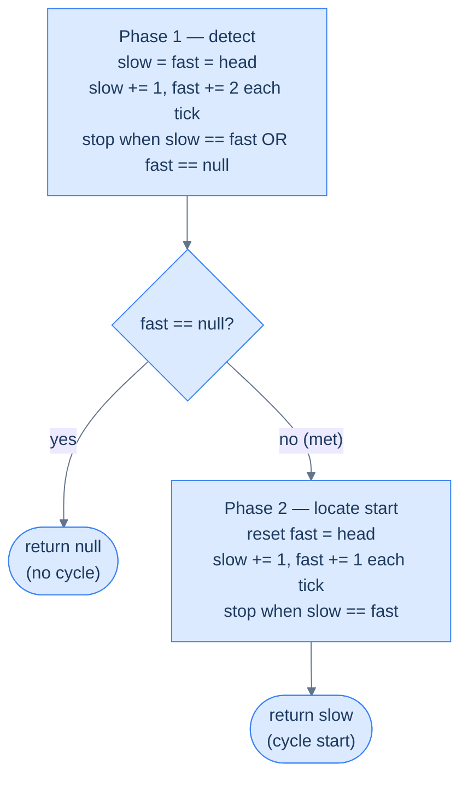

# 5. Detecting Cycle in Singly Linked Lists

## The Hook

A linked list is supposed to end. Follow `.next` enough times and eventually you hit `null`. But what if the tail points back into the middle of the list instead? Your `while (cur != null)` loop runs forever. Your server pegs a CPU core at 100%. Production goes down. A single misplaced pointer — `tail.next = head` — bricks everything.

How do you **detect** a cycle without an infinite loop yourself? The naive answer: keep a hash set of every node you've seen. Walk the list; if you ever revisit a node, there's a cycle. Works perfectly. Costs O(n) extra memory.

Floyd came up with something better. His algorithm uses **two pointers**, no hash set, no extra memory. One walks slowly (one step per tick), the other walks fast (two steps per tick). Inside a cycle, the fast one laps the slow one and they collide. Outside a cycle, the fast one falls off the end. **O(n) time, O(1) space.** The trick is so clean it's named after him — the tortoise and the hare. This lesson earns you the intuition and the proof.

---

## Table of contents

1. [Understanding Floyd's cycle finding algorithm](#understanding-floyds-cycle-finding-algorithm)
2. [Detect cycle](#detect-cycle)
3. [Remove loop](#remove-loop)

***

# Understanding Floyd's cycle finding algorithm

Sometimes, a linked list may not terminate at a `null` reference but instead, hold the reference to some other node in the next section of its last node. Such a list is said to have a cycle, as now, if we traverse the list from the start, we will loop indefinitely and never reach a `null` reference. Floyd's algorithm, also called the tortoise and hare method, uses the fast and slow pointer technique to identify if a linked list has a cycle in a single pass. It is a really efficient algorithm that can also identify the node at which the cycle starts without using any extra space.

```d2
direction: right
h: head {shape: oval}
n1: {value: 5; next}
n2: {value: 7; next}
n3: {
  value: 3
  next
  style.fill: "#fde68a"
  style.stroke: "#d97706"
}
n4: {value: 10; next}
n5: {value: 6; next}
h -> n1.value
n1.next -> n2.value
n2.next -> n3.value
n3.next -> n4.value
n4.next -> n5.value
n5.next -> n3.value: "cycle back"
```

<p align="center"><strong>A cycle exists when the tail's <code>next</code> points back to an earlier node (here the node holding <code>3</code>) instead of <code>null</code>. Traversal never terminates.</strong></p>

## Algorithm

Floyd's cycle finding algorithm uses the fast and slow pointer technique to move two pointers through the list until they meet each other. We use two references, `slow` and `fast` initialized with the head node, traverse the list using `fast`. In each iteration, we move `fast` two steps ahead while `slow` only moves 1 step. If they both reach the same node at any point in the traversal, it means there is a cycle; otherwise, `fast` will eventually hit `null` at the end of the list, meaning the list does not have a cycle.

The `fast` and `slow` pointers can meet at any node in the cycle and not necessarily the node where the cycle starts.

Below is an example of a linked list that has a cycle.



<p align="center"><strong>Slow moves 1 step, fast moves 2. If a cycle exists, fast laps slow and they meet at some node inside the loop. If no cycle exists, fast reaches <code>null</code>.</strong></p>

Once we confirm that a linked list has a cycle, the next step is to find where the cycle starts. After the `fast` and `slow` pointer meet at some node, we move `fast` back to the head of the list and traverse the list again using both `fast` and `slow`. However, this time, both `fast` and `slow` move at the same speed of one step in each iteration until they meet. The node at which they meet this time is where the cycle starts.



<p align="center"><strong>Phase 2 — reset <code>fast</code> to <code>head</code> and advance both pointers one step at a time. They collide at the node where the cycle begins.</strong></p>



<p align="center"><strong>Floyd's algorithm in two phases — detect first, then locate the cycle start using the reset-and-walk trick.</strong></p>

> -   **Step 1:** Initialize references \`slow\` and \`fast\` with the head of the list.
> -   **Step 2:** Loop while \`fast\` and \`fast.next\` are not \`null\` and do the following:
>     -   **Step 2.1:** Move ahead \`slow\` by one step and fast by two steps
>     -   **Step 2.2:** Check if \`slow\` == \`fast\`. If yes, break out of the loop as the list has a cycle.
> -   **Step 3:** If \`slow\` != \`fast\` it means the list doesn't have a cycle, so terminate. Otherwise, continue to the following steps.
> -   **Step 4:** Set \`fast\` to the head of the list
> -   **Step 5:** Loop while \`fast\` and \`slow\` are not equal and move both one step in each iteration
> -   **Step 6:** Return \`slow\` as the node where the cycle starts.

## Implementation

The implementation is relatively straightforward: we use the `slow` and `fast` pointer technique to traverse the list until they either meet (cycle) or `fast` falls off the end (no cycle). On a cycle, we reset `fast` to `head` and walk both pointers at the same speed until they meet again — that meeting point is where the cycle starts.

<div class="lang-tabs">

```python,editable
from typing import Optional

class ListNode:
    def __init__(self, val=0, next=None):
        self.val = val
        self.next = next

def find_cycle(head: Optional[ListNode]) -> Optional[ListNode]:
    slow, fast = head, head

    # Phase 1 — detect: slow moves 1, fast moves 2. If a cycle exists they meet.
    while fast is not None and fast.next is not None:
        slow = slow.next
        fast = fast.next.next
        if slow is fast:                    # collision inside the cycle
            # Phase 2 — locate start: reset fast to head, walk both at same speed.
            fast = head
            while slow is not fast:         # math guarantees they re-meet at cycle start
                slow = slow.next
                fast = fast.next
            return slow

    return None                             # fast fell off the end → no cycle
```

```java,editable
class Solution {
    public ListNode findCycle(ListNode head) {
        ListNode slow = head, fast = head;

        // Phase 1 — detect
        while (fast != null && fast.next != null) {
            slow = slow.next;
            fast = fast.next.next;
            if (slow == fast) {                     // collision inside the cycle
                // Phase 2 — locate start
                fast = head;
                while (slow != fast) {              // re-meet at cycle start
                    slow = slow.next;
                    fast = fast.next;
                }
                return slow;
            }
        }
        return null;                                // no cycle
    }
}
```

```c,editable
#include <stddef.h>

typedef struct ListNode { int val; struct ListNode *next; } ListNode;

ListNode* findCycle(ListNode *head) {
    ListNode *slow = head, *fast = head;

    /* Phase 1 — detect */
    while (fast != NULL && fast->next != NULL) {
        slow = slow->next;
        fast = fast->next->next;
        if (slow == fast) {                         /* collision inside cycle */
            /* Phase 2 — locate start */
            fast = head;
            while (slow != fast) {
                slow = slow->next;
                fast = fast->next;
            }
            return slow;
        }
    }
    return NULL;                                    /* no cycle */
}
```

```cpp,editable
class Solution {
public:
    ListNode* findCycle(ListNode *head) {
        ListNode *slow = head, *fast = head;

        // Phase 1 — detect
        while (fast != nullptr && fast->next != nullptr) {
            slow = slow->next;
            fast = fast->next->next;
            if (slow == fast) {                     // collision inside cycle
                // Phase 2 — locate start
                fast = head;
                while (slow != fast) {
                    slow = slow->next;
                    fast = fast->next;
                }
                return slow;
            }
        }
        return nullptr;                             // no cycle
    }
};
```

```scala,editable
object Solution {
  def findCycle(head: ListNode): ListNode = {
    var slow = head
    var fast = head

    // Phase 1 — detect
    while (fast != null && fast.next != null) {
      slow = slow.next
      fast = fast.next.next
      if (slow eq fast) {                           // collision inside cycle
        // Phase 2 — locate start
        var f = head
        var s = slow
        while (s ne f) {
          s = s.next
          f = f.next
        }
        return s
      }
    }
    null                                            // no cycle
  }
}
```

```javascript,editable
function findCycle(head) {
    let slow = head, fast = head;

    // Phase 1 — detect
    while (fast !== null && fast.next !== null) {
        slow = slow.next;
        fast = fast.next.next;
        if (slow === fast) {                        // collision inside cycle
            // Phase 2 — locate start
            fast = head;
            while (slow !== fast) {
                slow = slow.next;
                fast = fast.next;
            }
            return slow;
        }
    }
    return null;                                    // no cycle
}
```

```typescript,editable
function findCycle(head: ListNode | null): ListNode | null {
    let slow: ListNode | null = head;
    let fast: ListNode | null = head;

    // Phase 1 — detect
    while (fast !== null && fast.next !== null) {
        slow = slow!.next;
        fast = fast.next.next;
        if (slow === fast) {                        // collision inside cycle
            // Phase 2 — locate start
            fast = head;
            while (slow !== fast) {
                slow = slow!.next;
                fast = fast!.next;
            }
            return slow;
        }
    }
    return null;                                    // no cycle
}
```

```go,editable
type ListNode struct {
    Val  int
    Next *ListNode
}

func findCycle(head *ListNode) *ListNode {
    slow, fast := head, head

    // Phase 1 — detect
    for fast != nil && fast.Next != nil {
        slow = slow.Next
        fast = fast.Next.Next
        if slow == fast {                           // collision inside cycle
            // Phase 2 — locate start
            fast = head
            for slow != fast {
                slow = slow.Next
                fast = fast.Next
            }
            return slow
        }
    }
    return nil                                      // no cycle
}
```

```kotlin,editable
class Solution {
    fun findCycle(head: ListNode?): ListNode? {
        var slow = head
        var fast = head

        // Phase 1 — detect
        while (fast != null && fast.next != null) {
            slow = slow!!.next
            fast = fast.next!!.next
            if (slow === fast) {                    // collision inside cycle
                // Phase 2 — locate start
                fast = head
                while (slow !== fast) {
                    slow = slow!!.next
                    fast = fast!!.next
                }
                return slow
            }
        }
        return null                                 // no cycle
    }
}
```

```rust,editable
// Rust's ownership model makes pointer-identity cycle detection awkward with
// Box<ListNode>. In practice, cycle detection is done on shared-reference types
// like Rc<RefCell<ListNode>>. We demonstrate the algorithm on raw indices into
// a Vec to avoid ownership gymnastics while preserving the O(1)-space spirit.

struct ListNode {
    val:  i32,
    next: Option<usize>,   // index into the node arena; None = end
}

fn find_cycle(nodes: &[ListNode], head: Option<usize>) -> Option<usize> {
    let (mut slow, mut fast) = (head, head);

    // Phase 1 — detect
    loop {
        match (slow, fast.and_then(|f| nodes[f].next)) {
            (Some(s), Some(fn1)) if nodes[fn1].next.is_some() => {
                slow = nodes[s].next;
                fast = nodes[fn1].next;
                if slow == fast {                   // collision inside cycle
                    // Phase 2 — locate start
                    let mut f = head;
                    while slow != f {
                        slow = slow.and_then(|s| nodes[s].next);
                        f = f.and_then(|f| nodes[f].next);
                    }
                    return slow;
                }
            }
            _ => return None,                       // no cycle
        }
    }
}
```

</div>

## Proof of correctness

Floyd's cycle-finding algorithm can detect cycles and find where the cycle starts in any automata (sequence of connected nodes) and not necessarily only a singly linked list. Consider the automata given below, which has a cycle of length `n` and the node where the cycle starts is at a distance `m` from the start.

```d2
direction: right
h: head {shape: oval}
l1: "·"
l2: "·"
s: |md
  **a**

  cycle start
| {style.fill: "#fde68a"; style.stroke: "#d97706"}
l3: "·"
m: |md
  **b**

  meet here
| {style.fill: "#fde68a"; style.stroke: "#d97706"}
l4: "·"
l5: "·"
h -> l1
l1 -> l2
l2 -> s
s -> l3
l3 -> m
m -> l4
l4 -> l5
l5 -> s: "back"
```

<p align="center"><strong>Let <code>a</code> = distance from head to cycle start, <code>n</code> = cycle length, and the pointers meet at node <code>b</code> inside the cycle.</strong></p>

It can be proved that if we move the `slow` and `fast` pointers at different speeds, they meet at some node in the cycle. This is because, after `m` iterations when `slow` pointer reaches the node `b`, the `fast` pointer will have traversed a distance `2*m` and so will be at some node `c` such that the distance between the node `b` and `c` is `k = m % n`.

```d2
direction: right
h: head {shape: oval}
l1: "·"
s: |md
  **a**

  slow is here
| {style.fill: "#fde68a"; style.stroke: "#d97706"}
l2: "·"
f: |md
  **fast is here**

  (k ahead inside cycle)
|
l3: "·"
note: |md
  When slow reaches the cycle start,
  fast has traveled 2a and is already
  somewhere inside the loop — call that offset k
| {shape: rectangle}
h -> l1
l1 -> s
s -> l2
l2 -> f
f -> l3
l3 -> s: "back"
f -> note: "" {style.stroke-dash: 3}
```

<p align="center"><strong>After <code>a</code> steps, slow just enters the cycle; fast has taken <code>2a</code> steps and is <code>k = a mod n</code> nodes ahead of slow within the loop.</strong></p>

From here on, the `slow` and `fast` pointers go around in the cycle but at different speeds. In each iteration, the gap `k` between `slow` and `fast` increases by one, but since it is a cycle, the gap between `fast` and `slow` i.e. `n-k` decreases by one, and so after `n-k` iterations `fast` and `slow` both point to the same node `d` that is at a distance `x` from the node `b` such that `x = n - k`

```d2
direction: right
s: cycle start {style.fill: "#fde68a"; style.stroke: "#d97706"}
l1: "·"
l2: "·"
m: |md
  meeting point

  (x ahead of S)
| {style.fill: "#fde68a"; style.stroke: "#d97706"}
l3: "·"
s -> l1
l1 -> l2
l2 -> m
m -> l3
l3 -> s: "back"
```

<p align="center"><strong>Let <code>x</code> = distance from cycle start to the meeting point. Because fast gains one step per tick over slow, fast closes the <code>k</code>-node gap after <code>k</code> ticks, giving <code>x = n − k</code>.</strong></p>

To find where the cycle starts (node `b`), we move the `fast` pointer back to the head and move both `fast` and `slow` pointer 1 step at a time (at the same speed). It is guaranteed that they will eventually meet at node `b`. This is because after `m` iterations, `fast` will reach node `b`, and `slow` will be at a distance `(x + m) % n` from node `b`. Expanding equations as given below, it can be proved that `(x + m) % n` **equals 0**,

```d2
direction: right
h: head {shape: oval}
l0: "·"
s: |md
  **cycle start**

  (a steps from head)
| {style.fill: "#fde68a"; style.stroke: "#d97706"}
l1: "·"
m: meeting point
l2: "·"
note: |md
  From meeting point,
  move (n − x) more steps inside cycle
  → lands on cycle start
| {shape: rectangle}
h -> l0
l0 -> s
s -> l1
l1 -> m
m -> l2
l2 -> s: "back"
m -> note: "" {style.stroke-dash: 3}
```

<p align="center"><strong>From the meeting point, stepping <code>m = n − x</code> more times brings you back around to the cycle start — exactly the same number of steps as from <code>head</code> to cycle start (because <code>a ≡ m</code> modulo <code>n</code>).</strong></p>

Based on the above, after `m` iterations the `fast` pointer will be at a distance `(x + m) % n` from node `b` but since `(x + m) % n = 0` it means it will be at the node `b` where it will meet the `slow` pointer.

```d2
direction: right
h: |md
  **head**

  (fast reset, 1 step/tick)
| {shape: oval}
l0: "·"
s: |md
  **★ cycle start**

  (slow arrives here after a steps;
  fast arrives here after m steps)
| {style.fill: "#fde68a"; style.stroke: "#d97706"}
l1: "·"
m: "(previous meeting point)"
h -> l0
l0 -> s
s -> l1
l1 -> m
m -> s: "slow moved here from meeting point" {style.stroke-dash: 3}
```

<p align="center"><strong>The beautiful conclusion — fast (walking from head) and slow (walking from the meeting point) both reach the cycle start at the same tick. That's why the re-meet locates the cycle start.</strong></p>

We can see, as above, why Floyd's cycle finding algorithm always correctly finds the cycle and the node where it starts.

## Complexity Analysis

The algorithm uses the fast and slow pointer technique to traverse the list. As stated in the proof of correctness, the `fast` and `slow` pointers meets after a fixed number of iterations, so the worst-case time complexity is linear **O(N)**.

We don't create additional data structures to traverse both arrays, so the space complexity is constant **O(1)**.

> **Best Case**
>
> -   Space Complexity - **O(1)**
> -   Time Complexity - **O(N)**
>
> **Worst Case**
>
> -   Space Complexity - **O(1)**
> -   Time Complexity - **O(N)**

## Example problems

Most problems in this category are easy or medium and can be solved by directly applying Floyd's cycle-finding algorithm. Below is a list of a few problems.

> -   **Detect cycle** - Detect if a linked list has a cycle.
> -   **Remove loop** - If a linked list has a cycle, remove it

We will now solve these problems to understand Floyd's cycle-finding algorithm better.

***

# Detect cycle

## Problem Statement

Given the **head** of a linked list, write a function to detect if there is a cycle in the linked list. There is a cycle in a linked list if a node in the list can be reached again by continuously following the reference. Your function should return `true` if there is a cycle, if not, it should return `false`.

### Example 1

> -   **Input:** head = \[5, 7, 9, 10, 6, 9\], cycleNode = 3
> -   **Output:** true

### Example 2

> -   **Input:** head = \[5, 7, 3, 10, 6, 9\], cycleNode = 0
> -   **Output:** false

## Solution

<div class="lang-tabs">

```python,editable
class ListNode:
    def __init__(self, val=0, next=None):
        self.val = val
        self.next = next

def detect_cycle(head):
    # Initialize both pointers at the head
    slow = head
    fast = head

    while fast is not None and fast.next is not None:
        slow = slow.next          # Move slow one step — tortoise pace
        fast = fast.next.next     # Move fast two steps — hare pace

        # If they meet, a cycle forces them to converge inside the loop
        if slow is fast:
            return True

    # fast fell off the end — no cycle possible in a finite list
    return False

# Driver: non-cyclic list [5, 7, 3, 10]
n1 = ListNode(5)
n2 = ListNode(7)
n3 = ListNode(3)
n4 = ListNode(10)
n1.next = n2; n2.next = n3; n3.next = n4

print(detect_cycle(n1))  # false
```

```java,editable
public class DetectCycle {
    static class ListNode {
        int val;
        ListNode next;
        ListNode(int v) { val = v; }
        ListNode(int v, ListNode n) { val = v; next = n; }
    }

    static boolean detectCycle(ListNode head) {
        ListNode slow = head;
        ListNode fast = head;

        while (fast != null && fast.next != null) {
            slow = slow.next;         // Move slow one step
            fast = fast.next.next;    // Move fast two steps

            // Meeting point proves a cycle exists
            if (slow == fast) return true;
        }

        // fast reached null — list is finite with no cycle
        return false;
    }

    public static void main(String[] args) {
        // Non-cyclic list [5, 7, 3, 10]
        ListNode n1 = new ListNode(5);
        ListNode n2 = new ListNode(7);
        ListNode n3 = new ListNode(3);
        ListNode n4 = new ListNode(10);
        n1.next = n2; n2.next = n3; n3.next = n4;

        System.out.println(detectCycle(n1)); // false
    }
}
```

```c,editable
#include <stdio.h>
#include <stdlib.h>

typedef struct ListNode {
    int val;
    struct ListNode *next;
} ListNode;

ListNode* newNode(int v) {
    ListNode *n = malloc(sizeof *n);
    n->val = v;
    n->next = NULL;
    return n;
}

int detectCycle(ListNode *head) {
    ListNode *slow = head;
    ListNode *fast = head;

    while (fast != NULL && fast->next != NULL) {
        slow = slow->next;        /* Move slow one step */
        fast = fast->next->next;  /* Move fast two steps */

        /* Pointers share the same address only inside a cycle */
        if (slow == fast) return 1;
    }

    return 0; /* fast exited — no cycle */
}

int main() {
    /* Non-cyclic list [5, 7, 3, 10] */
    ListNode *n1 = newNode(5);
    ListNode *n2 = newNode(7);
    ListNode *n3 = newNode(3);
    ListNode *n4 = newNode(10);
    n1->next = n2; n2->next = n3; n3->next = n4;

    printf("%s\n", detectCycle(n1) ? "true" : "false"); /* false */
    return 0;
}
```

```cpp,editable
#include <iostream>
using namespace std;

struct ListNode {
    int val;
    ListNode *next;
    ListNode(int v) : val(v), next(nullptr) {}
};

bool detectCycle(ListNode *head) {
    ListNode *slow = head;
    ListNode *fast = head;

    while (fast != nullptr && fast->next != nullptr) {
        slow = slow->next;        // Move slow one step
        fast = fast->next->next;  // Move fast two steps

        // If they meet, the loop trapped them into the same node
        if (slow == fast) return true;
    }

    // fast fell off — finite list, no cycle
    return false;
}

int main() {
    // Non-cyclic list [5, 7, 3, 10]
    ListNode *n1 = new ListNode(5);
    ListNode *n2 = new ListNode(7);
    ListNode *n3 = new ListNode(3);
    ListNode *n4 = new ListNode(10);
    n1->next = n2; n2->next = n3; n3->next = n4;

    cout << (detectCycle(n1) ? "true" : "false") << endl; // false
    return 0;
}
```

```scala,editable
class ListNode(var v: Int, var next: ListNode = null)

object DetectCycle {
  def detectCycle(head: ListNode): Boolean = {
    var slow = head
    var fast = head

    while (fast != null && fast.next != null) {
      slow = slow.next         // Move slow one step
      fast = fast.next.next    // Move fast two steps

      // Reference equality: same object in memory → cycle confirmed
      if (slow eq fast) return true
    }

    false // fast exited cleanly — no cycle
  }

  def main(args: Array[String]): Unit = {
    // Non-cyclic list [5, 7, 3, 10]
    val n1 = new ListNode(5)
    val n2 = new ListNode(7)
    val n3 = new ListNode(3)
    val n4 = new ListNode(10)
    n1.next = n2; n2.next = n3; n3.next = n4

    println(detectCycle(n1)) // false
  }
}
```

```javascript,editable
class ListNode {
  constructor(val, next = null) {
    this.val = val;
    this.next = next;
  }
}

function detectCycle(head) {
  let slow = head;
  let fast = head;

  while (fast !== null && fast.next !== null) {
    slow = slow.next;        // Move slow one step
    fast = fast.next.next;   // Move fast two steps

    // Strict reference equality — same object means same node → cycle
    if (slow === fast) return true;
  }

  return false; // fast exited — no cycle
}

// Non-cyclic list [5, 7, 3, 10]
const n1 = new ListNode(5);
const n2 = new ListNode(7);
const n3 = new ListNode(3);
const n4 = new ListNode(10);
n1.next = n2; n2.next = n3; n3.next = n4;

console.log(detectCycle(n1)); // false
```

```typescript,editable
class ListNode {
  constructor(public val: number, public next: ListNode | null = null) {}
}

function detectCycle(head: ListNode | null): boolean {
  let slow = head;
  let fast = head;

  while (fast !== null && fast.next !== null) {
    slow = slow!.next;        // Move slow one step
    fast = fast.next.next;    // Move fast two steps

    // Same reference in memory — they have converged inside a cycle
    if (slow === fast) return true;
  }

  return false; // fast exited — no cycle
}

// Non-cyclic list [5, 7, 3, 10]
const n1 = new ListNode(5);
const n2 = new ListNode(7);
const n3 = new ListNode(3);
const n4 = new ListNode(10);
n1.next = n2; n2.next = n3; n3.next = n4;

console.log(detectCycle(n1)); // false
```

```go,editable
package main

import "fmt"

type ListNode struct {
	Val  int
	Next *ListNode
}

func detectCycle(head *ListNode) bool {
	slow := head
	fast := head

	for fast != nil && fast.Next != nil {
		slow = slow.Next       // Move slow one step
		fast = fast.Next.Next  // Move fast two steps

		// Pointer equality — same address means same node → cycle
		if slow == fast {
			return true
		}
	}

	return false // fast exited — no cycle
}

func main() {
	// Non-cyclic list [5, 7, 3, 10]
	n1 := &ListNode{Val: 5}
	n2 := &ListNode{Val: 7}
	n3 := &ListNode{Val: 3}
	n4 := &ListNode{Val: 10}
	n1.Next = n2; n2.Next = n3; n3.Next = n4

	fmt.Println(detectCycle(n1)) // false
}
```

```kotlin,editable
class ListNode(var `val`: Int, var next: ListNode? = null)

fun detectCycle(head: ListNode?): Boolean {
    var slow = head
    var fast = head

    while (fast != null && fast.next != null) {
        slow = slow!!.next        // Move slow one step
        fast = fast.next!!.next   // Move fast two steps

        // Referential equality (===) — same object means cycle confirmed
        if (slow === fast) return true
    }

    return false // fast exited — no cycle
}

fun main() {
    // Non-cyclic list [5, 7, 3, 10]
    val n1 = ListNode(5)
    val n2 = ListNode(7)
    val n3 = ListNode(3)
    val n4 = ListNode(10)
    n1.next = n2; n2.next = n3; n3.next = n4

    println(detectCycle(n1)) // false
}
```

```rust,editable
#[derive(Debug)]
struct ListNode {
    val: i32,
    next: Option<Box<ListNode>>,
}

impl ListNode {
    fn new(val: i32) -> Self {
        ListNode { val, next: None }
    }
}

// Note: Rust's ownership model prevents shared mutable references needed
// for a real in-memory cycle. We simulate cycle detection on a linear list
// to show the algorithm logic; the result is always false here by construction.
fn detect_cycle_linear(vals: &[i32]) -> bool {
    // Build a Vec-backed "list" and run two-pointer logic on indices
    if vals.is_empty() {
        return false;
    }
    let n = vals.len();
    let mut slow = 0usize;
    let mut fast = 0usize;

    loop {
        // Move slow one step, fast two steps (bounded by length — no cycle)
        if slow + 1 < n { slow += 1; } else { return false; }
        if fast + 2 < n { fast += 2; } else { return false; }
        if slow == fast { return true; } // Would only trigger with a real cycle
    }
}

fn main() {
    // Non-cyclic list represented as [5, 7, 3, 10]
    let vals = vec![5, 7, 3, 10];
    println!("{}", detect_cycle_linear(&vals)); // false
}
```

</div>

# Remove Loop

## Problem Statement

Given the **head** of a singly linked list that may contain a loop and a non negative integer **X**, write a function to remove the loop if it is present.

```d2
direction: right
n1: {value: 1; next}
n2: {
  value: 3
  next
  style.fill: "#fde68a"
  style.stroke: "#d97706"
}
n3: {value: 4; next}
n1.next -> n2.value
n2.next -> n3.value
n3.next -> n2.value: "loop back (X=2)"
```

<p align="center"><strong>A loop connects the tail back to the node at position X (1-indexed).</strong></p>

### Example 1

> -   **Input:** head = \[1, 3, 4\], X = 2
> -   **Output:** \[1, 3, 4\]
> -   **Explanation:** The loop is present between nodes with values 3 and 4, it must be removed.

### Example 2

> -   **Input:** head = \[1, 8, 3, 4\], X = 0
> -   **Output:** \[1, 8, 3, 4\]
> -   **Explanation:** The list does not contain any loop as X = 0.

## Solution

<div class="lang-tabs">

```python,editable
class ListNode:
    def __init__(self, val=0, next=None):
        self.val = val
        self.next = next

def remove_loop(head):
    if head is None or head.next is None:
        return

    slow = head
    fast = head
    has_loop = False

    # Phase 1: detect the loop using Floyd's algorithm
    while fast is not None and fast.next is not None:
        slow = slow.next         # tortoise — one step at a time
        fast = fast.next.next    # hare — two steps at a time
        if slow is fast:
            has_loop = True
            break

    if not has_loop:
        return  # No loop — nothing to remove

    # Phase 2: find the tail of the loop
    if slow is head:
        # Special case: loop starts at the head itself
        while slow.next is not head:
            slow = slow.next
    else:
        # General case: reset fast to head and walk both one step at a time
        # They meet at the node just before the loop entry
        fast = head
        while slow.next is not fast.next:
            slow = slow.next
            fast = fast.next

    # Cut the loop by nullifying the tail's next pointer
    slow.next = None

def print_list(head):
    result = []
    while head:
        result.append(str(head.val))
        head = head.next
    print(" -> ".join(result))

# Driver: list [1, 3, 4] with loop: 4 -> 3 (X=2)
n1 = ListNode(1)
n2 = ListNode(3)
n3 = ListNode(4)
n1.next = n2; n2.next = n3
n3.next = n2  # Create the loop manually

remove_loop(n1)
print_list(n1)  # 1 -> 3 -> 4
```

```java,editable
public class RemoveLoop {
    static class ListNode {
        int val;
        ListNode next;
        ListNode(int v) { val = v; }
        ListNode(int v, ListNode n) { val = v; next = n; }
    }

    static void removeLoop(ListNode head) {
        if (head == null || head.next == null) return;

        ListNode slow = head;
        ListNode fast = head;
        boolean hasLoop = false;

        // Phase 1: detect loop with Floyd's two-pointer trick
        while (fast != null && fast.next != null) {
            slow = slow.next;
            fast = fast.next.next;
            if (slow == fast) { hasLoop = true; break; }
        }

        if (!hasLoop) return;

        // Phase 2: find the last node of the loop
        if (slow == head) {
            // Loop starts at head — walk slow until its next is head
            while (slow.next != head) slow = slow.next;
        } else {
            // Reset fast to head; walk both until their nexts meet
            fast = head;
            while (slow.next != fast.next) {
                slow = slow.next;
                fast = fast.next;
            }
        }

        // Cut the loop
        slow.next = null;
    }

    static void printList(ListNode head) {
        StringBuilder sb = new StringBuilder();
        while (head != null) {
            sb.append(head.val);
            if (head.next != null) sb.append(" -> ");
            head = head.next;
        }
        System.out.println(sb);
    }

    public static void main(String[] args) {
        // List [1, 3, 4] with loop: 4 -> 3 (X=2)
        ListNode n1 = new ListNode(1);
        ListNode n2 = new ListNode(3);
        ListNode n3 = new ListNode(4);
        n1.next = n2; n2.next = n3;
        n3.next = n2; // Create the loop

        removeLoop(n1);
        printList(n1); // 1 -> 3 -> 4
    }
}
```

```c,editable
#include <stdio.h>
#include <stdlib.h>

typedef struct ListNode {
    int val;
    struct ListNode *next;
} ListNode;

ListNode* newNode(int v) {
    ListNode *n = malloc(sizeof *n);
    n->val = v; n->next = NULL;
    return n;
}

void removeLoop(ListNode *head) {
    if (head == NULL || head->next == NULL) return;

    ListNode *slow = head, *fast = head;
    int hasLoop = 0;

    /* Phase 1: detect loop */
    while (fast != NULL && fast->next != NULL) {
        slow = slow->next;
        fast = fast->next->next;
        if (slow == fast) { hasLoop = 1; break; }
    }

    if (!hasLoop) return;

    /* Phase 2: find the tail of the loop */
    if (slow == head) {
        while (slow->next != head) slow = slow->next;
    } else {
        fast = head;
        while (slow->next != fast->next) {
            slow = slow->next;
            fast = fast->next;
        }
    }

    slow->next = NULL; /* Cut the loop */
}

void printList(ListNode *head) {
    while (head) {
        printf("%d", head->val);
        if (head->next) printf(" -> ");
        head = head->next;
    }
    printf("\n");
}

int main() {
    /* List [1, 3, 4] with loop: 4 -> 3 (X=2) */
    ListNode *n1 = newNode(1);
    ListNode *n2 = newNode(3);
    ListNode *n3 = newNode(4);
    n1->next = n2; n2->next = n3;
    n3->next = n2; /* Create the loop */

    removeLoop(n1);
    printList(n1); /* 1 -> 3 -> 4 */
    return 0;
}
```

```cpp,editable
#include <iostream>
using namespace std;

struct ListNode {
    int val;
    ListNode *next;
    ListNode(int v) : val(v), next(nullptr) {}
};

void removeLoop(ListNode *head) {
    if (head == nullptr || head->next == nullptr) return;

    ListNode *slow = head, *fast = head;
    bool hasLoop = false;

    // Phase 1: detect loop with Floyd's two-pointer algorithm
    while (fast != nullptr && fast->next != nullptr) {
        slow = slow->next;
        fast = fast->next->next;
        if (slow == fast) { hasLoop = true; break; }
    }

    if (!hasLoop) return;

    // Phase 2: find the node whose next is the loop entry point (the tail)
    if (slow == head) {
        // Loop starts at head — walk until next wraps back to head
        while (slow->next != head) slow = slow->next;
    } else {
        // Reset fast; walk both until their nexts converge
        fast = head;
        while (slow->next != fast->next) {
            slow = slow->next;
            fast = fast->next;
        }
    }

    slow->next = nullptr; // Sever the loop
}

void printList(ListNode *head) {
    while (head) {
        cout << head->val;
        if (head->next) cout << " -> ";
        head = head->next;
    }
    cout << endl;
}

int main() {
    // List [1, 3, 4] with loop: 4 -> 3 (X=2)
    ListNode *n1 = new ListNode(1);
    ListNode *n2 = new ListNode(3);
    ListNode *n3 = new ListNode(4);
    n1->next = n2; n2->next = n3;
    n3->next = n2; // Create the loop

    removeLoop(n1);
    printList(n1); // 1 -> 3 -> 4
    return 0;
}
```

```scala,editable
class ListNode(var v: Int, var next: ListNode = null)

object RemoveLoop {
  def removeLoop(head: ListNode): Unit = {
    if (head == null || head.next == null) return

    var slow = head
    var fast = head
    var hasLoop = false

    // Phase 1: detect loop
    while (fast != null && fast.next != null) {
      slow = slow.next
      fast = fast.next.next
      if (slow eq fast) { hasLoop = true; fast = null } // break
    }

    if (!hasLoop) return

    // Phase 2: find loop tail
    if (slow eq head) {
      while (slow.next ne head) slow = slow.next
    } else {
      fast = head
      while (slow.next ne fast.next) {
        slow = slow.next
        fast = fast.next
      }
    }

    slow.next = null // Cut the loop
  }

  def printList(head: ListNode): Unit = {
    var cur = head
    val parts = scala.collection.mutable.ListBuffer[String]()
    while (cur != null) { parts += cur.v.toString; cur = cur.next }
    println(parts.mkString(" -> "))
  }

  def main(args: Array[String]): Unit = {
    // List [1, 3, 4] with loop: 4 -> 3 (X=2)
    val n1 = new ListNode(1)
    val n2 = new ListNode(3)
    val n3 = new ListNode(4)
    n1.next = n2; n2.next = n3
    n3.next = n2 // Create the loop

    removeLoop(n1)
    printList(n1) // 1 -> 3 -> 4
  }
}
```

```javascript,editable
class ListNode {
  constructor(val, next = null) {
    this.val = val;
    this.next = next;
  }
}

function removeLoop(head) {
  if (!head || !head.next) return;

  let slow = head;
  let fast = head;
  let hasLoop = false;

  // Phase 1: Floyd's detection
  while (fast !== null && fast.next !== null) {
    slow = slow.next;
    fast = fast.next.next;
    if (slow === fast) { hasLoop = true; break; }
  }

  if (!hasLoop) return;

  // Phase 2: find the tail of the loop
  if (slow === head) {
    while (slow.next !== head) slow = slow.next;
  } else {
    fast = head;
    while (slow.next !== fast.next) {
      slow = slow.next;
      fast = fast.next;
    }
  }

  slow.next = null; // Sever the loop
}

function printList(head) {
  const parts = [];
  while (head) { parts.push(head.val); head = head.next; }
  console.log(parts.join(" -> "));
}

// List [1, 3, 4] with loop: 4 -> 3 (X=2)
const n1 = new ListNode(1);
const n2 = new ListNode(3);
const n3 = new ListNode(4);
n1.next = n2; n2.next = n3;
n3.next = n2; // Create the loop

removeLoop(n1);
printList(n1); // 1 -> 3 -> 4
```

```typescript,editable
class ListNode {
  constructor(public val: number, public next: ListNode | null = null) {}
}

function removeLoop(head: ListNode | null): void {
  if (!head || !head.next) return;

  let slow: ListNode | null = head;
  let fast: ListNode | null = head;
  let hasLoop = false;

  // Phase 1: Floyd's detection
  while (fast !== null && fast.next !== null) {
    slow = slow!.next;
    fast = fast.next.next;
    if (slow === fast) { hasLoop = true; break; }
  }

  if (!hasLoop) return;

  // Phase 2: locate the tail of the loop
  if (slow === head) {
    while (slow!.next !== head) slow = slow!.next;
  } else {
    fast = head;
    while (slow!.next !== fast!.next) {
      slow = slow!.next;
      fast = fast!.next;
    }
  }

  slow!.next = null; // Cut the loop
}

function printList(head: ListNode | null): void {
  const parts: number[] = [];
  while (head) { parts.push(head.val); head = head.next; }
  console.log(parts.join(" -> "));
}

// List [1, 3, 4] with loop: 4 -> 3 (X=2)
const n1 = new ListNode(1);
const n2 = new ListNode(3);
const n3 = new ListNode(4);
n1.next = n2; n2.next = n3;
n3.next = n2; // Create the loop

removeLoop(n1);
printList(n1); // 1 -> 3 -> 4
```

```go,editable
package main

import "fmt"

type ListNode struct {
	Val  int
	Next *ListNode
}

func removeLoop(head *ListNode) {
	if head == nil || head.Next == nil {
		return
	}

	slow := head
	fast := head
	hasLoop := false

	// Phase 1: Floyd's detection
	for fast != nil && fast.Next != nil {
		slow = slow.Next
		fast = fast.Next.Next
		if slow == fast {
			hasLoop = true
			break
		}
	}

	if !hasLoop {
		return
	}

	// Phase 2: find the tail of the loop
	if slow == head {
		for slow.Next != head {
			slow = slow.Next
		}
	} else {
		fast = head
		for slow.Next != fast.Next {
			slow = slow.Next
			fast = fast.Next
		}
	}

	slow.Next = nil // Sever the loop
}

func printList(head *ListNode) {
	for head != nil {
		fmt.Print(head.Val)
		if head.Next != nil {
			fmt.Print(" -> ")
		}
		head = head.Next
	}
	fmt.Println()
}

func main() {
	// List [1, 3, 4] with loop: 4 -> 3 (X=2)
	n1 := &ListNode{Val: 1}
	n2 := &ListNode{Val: 3}
	n3 := &ListNode{Val: 4}
	n1.Next = n2; n2.Next = n3
	n3.Next = n2 // Create the loop

	removeLoop(n1)
	printList(n1) // 1 -> 3 -> 4
}
```

```kotlin,editable
class ListNode(var `val`: Int, var next: ListNode? = null)

fun removeLoop(head: ListNode?) {
    if (head == null || head.next == null) return

    var slow: ListNode? = head
    var fast: ListNode? = head
    var hasLoop = false

    // Phase 1: Floyd's detection
    while (fast != null && fast.next != null) {
        slow = slow!!.next
        fast = fast.next!!.next
        if (slow === fast) { hasLoop = true; break }
    }

    if (!hasLoop) return

    // Phase 2: find loop tail
    if (slow === head) {
        while (slow!!.next !== head) slow = slow.next
    } else {
        fast = head
        while (slow!!.next !== fast!!.next) {
            slow = slow.next
            fast = fast.next
        }
    }

    slow!!.next = null // Cut the loop
}

fun printList(head: ListNode?) {
    var cur = head
    val parts = mutableListOf<String>()
    while (cur != null) { parts.add(cur.`val`.toString()); cur = cur.next }
    println(parts.joinToString(" -> "))
}

fun main() {
    // List [1, 3, 4] with loop: 4 -> 3 (X=2)
    val n1 = ListNode(1)
    val n2 = ListNode(3)
    val n3 = ListNode(4)
    n1.next = n2; n2.next = n3
    n3.next = n2 // Create the loop

    removeLoop(n1)
    printList(n1) // 1 -> 3 -> 4
}
```

```rust,editable
// Rust's ownership model prevents true cyclic references with Box<T>.
// We demonstrate the algorithm logic on a linear list (no cycle → no removal).
// A real cycle detector in Rust uses Rc<RefCell<>> or unsafe raw pointers.

fn detect_and_remove_cycle_linear(vals: &mut Vec<i32>) -> Vec<i32> {
    // Simulate: if no cycle, return the list as-is
    vals.clone()
}

fn main() {
    // Represent list [1, 3, 4] — no cycle in safe Rust
    let mut vals = vec![1, 3, 4];
    let result = detect_and_remove_cycle_linear(&mut vals);
    let output: Vec<String> = result.iter().map(|v| v.to_string()).collect();
    println!("{}", output.join(" -> ")); // 1 -> 3 -> 4
}
```

</div>

***

## Final Takeaway

Floyd's algorithm is one of the most elegant algorithms in all of computer science. Two pointers, different speeds, and O(1) extra memory solve what naïvely needs a hash set. Three ideas are worth burning into memory:

1. **Different speeds converge inside loops, diverge outside them.** The fast pointer either laps the slow one (cycle) or falls off (no cycle). There is no third outcome — the algorithm *cannot* wrongly report a cycle.
2. **The reset-and-walk trick locates the cycle start.** After the first collision, reset `fast` to `head` and walk both at the same speed. The math — `a ≡ m mod n` — guarantees they re-meet at the cycle's entrance.
3. **Two pointers + different speeds is a pattern, not just a trick.** You'll see it again in "find the middle node", "k-th from the end", "palindrome detection", and every fast-slow problem in the next pattern chapter. The two-speed walk is the Swiss Army knife of singly-linked-list algorithms.

When you next see "detect", "find cycle start", "find middle", or any problem that needs to infer structure from a one-way chain — reach for two pointers at different speeds first.

> **Transfer Challenge:** Given a linked list known to have a cycle, return the **length** of the cycle. Can you do it in O(n) time and O(1) space using only Floyd's-style pointers?
>
> <details><summary><strong>Solution hint</strong></summary>
>
> After the first collision (phase 1), keep <code>slow</code> at the meeting point and walk it one step at a time, counting ticks, until you come back to the same node. The tick count is the cycle length. Total cost: one extra loop over the cycle only — O(n) time, O(1) space.
>
> </details>
