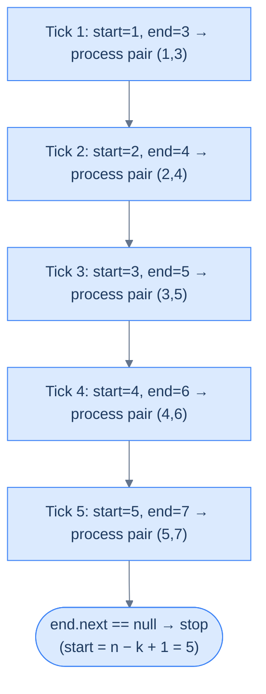
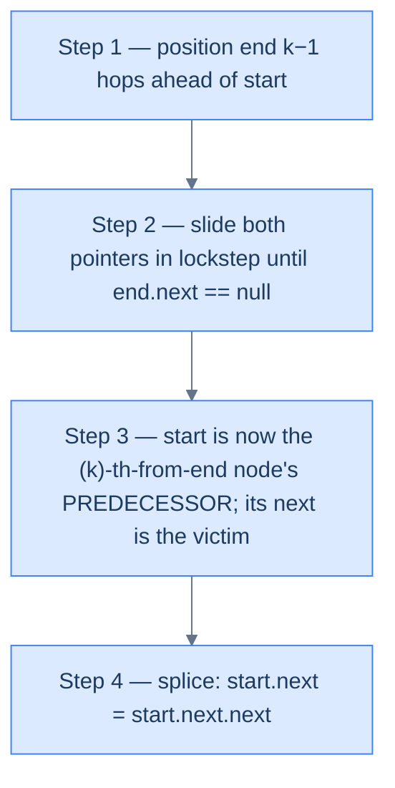

# 8. Pattern: Sliding Window Traversal

## The Hook

"Find the K-th node from the end of a linked list." Obvious brute force: walk the list to get the length `n`, then walk again to position `n − k`. **Two passes.** Works, but feels clumsy — especially when the list is a stream you can only read once.

There's a single-pass trick that feels almost unfair. Put two pointers at the head. Advance one of them `k − 1` hops. Then advance **both together** until the leader falls off the end. When that happens, the trailing pointer is parked exactly on the K-th-from-end node. One pass. No length. No second walk.

This is the **sliding window traversal** pattern — two pointers separated by a fixed gap, marching in lockstep. Once you see it, you'll spot applications everywhere: remove N-th from end, swap N-th from both ends, K rotations, K-maximum-sum windows. The trick is never the sliding — it's **choosing the right initial gap** so that when the leader terminates, the trailer is exactly where you need it.

---

## Table of contents

1. [Understanding sliding window traversal pattern](#understanding-the-sliding-window-traversal-pattern)
2. [Identifying the sliding window traversal pattern](#identifying-the-sliding-window-traversal-pattern)
3. [K maximum sum](#k-maximum-sum)
4. [Trim Nth node](#trim-nth-node)
5. [Swap Nth nodes](#swap-nth-nodes)
6. [K rotations](#k-rotations)

***

# Understanding the sliding window traversal pattern

The traversal of a linked list is generally done using a single reference variable to hold the current node. Some problems, however, require you to perform some operations on two nodes at some distance from each other. Unlike arrays, where we can access item **k** steps ahead of the current item by adding **k** to the current index, we need to iterate **k** times and traverse the list from the current node for a singly linked list, which is inefficient if we need to do this for multiple nodes.

This presents another use case for the sliding window technique, apart from aggregating values in a subarray or sublist. We can use a window of size **k** denoted by two references and move it to access all nodes **k** steps apart in a singly linked list.

The sliding window traversal pattern is a classification of problems that can be solved using the sliding window traversal technique.

```d2
direction: right
h: head {shape: oval}
n1: {value: 1; style.fill: "#fde68a"; style.stroke: "#d97706"}
n2: "2"
n3: "3"
n4: {value: 4; style.fill: "#fde68a"; style.stroke: "#d97706"}
n5: "5"
n6: "6"
sp: start {shape: oval; style.stroke-dash: 3}
ep: end {shape: oval; style.stroke-dash: 3}
h -> n1.value
n1.value -> n2
n2 -> n3
n3 -> n4.value
n4.value -> n5
n5 -> n6
sp -> n1.value: "" {style.stroke-dash: 3}
ep -> n4.value: "" {style.stroke-dash: 3}
```

<p align="center"><strong>Sliding-window traversal keeps two pointers — <code>start</code> and <code>end</code> — a fixed distance <code>k</code> apart. They advance together, one node at a time, until <code>end</code> falls off the list.</strong></p>

The sliding window technique can also solve aggregation problems on sublists like subarrays. However, in this lesson, we will only learn about the sized sliding window traversal technique, which traverses a list using a sliding window. More so, we will only learn about the fixed-sized sliding window, as most problems require performing operations on nodes apart by a fixed distance.

## Sliding window traversal technique

Consider we are given a singly linked list and need to perform some operations on all nodes that are at a distance of `k` from each other. We create two references `start` and `end`, and initialize them with the head of the linked list.

We then iterate `k` times and move the `end` reference `k` steps ahead from `start`. This way, `start` and `end` denote a window of size `k+1` such that `end` is exactly `k` steps away from `start`.

It is important to note that two nodes that are at a distance `k` from each other denote a window of size `k+1` as both nodes are included in the window.

```d2
direction: right
s: start {style.fill: "#fde68a"; style.stroke: "#d97706"}
a: "·"
b: "·"
e: end {style.fill: "#fde68a"; style.stroke: "#d97706"}
note: |md
  distance = k = 3 hops

  window size = k + 1 = 4 nodes

  (both endpoints included)
| {shape: rectangle}
s -> a
a -> b
b -> e
e -> note: "" {style.stroke-dash: 3}
```

<p align="center"><strong>A "distance of <code>k</code>" means <code>k</code> hops between <code>start</code> and <code>end</code> — which covers <code>k + 1</code> nodes when both endpoints count. Getting this off-by-one right is the single most common bug in sliding-window code.</strong></p>

We perform the required operations on the nodes held in `start` and `end` and move both of them one step ahead by setting them to their respective next nodes. We repeat this process until `end` hits `null` at the end of the list. At the end of all iterations, we would have applied the given operation on all nodes that are `k` steps away from each other.

```d2
direction: right
h: head {shape: oval}
n1: {value: 1; style.fill: "#fde68a"; style.stroke: "#d97706"}
n2: "2"
n3: {value: 3; style.fill: "#fde68a"; style.stroke: "#d97706"}
n4: "4"
n5: "5"
n6: "6"
n7: "7"
sp: start {shape: oval; style.stroke-dash: 3}
ep: end {shape: oval; style.stroke-dash: 3}
h -> n1.value
n1.value -> n2
n2 -> n3.value
n3.value -> n4
n4 -> n5
n5 -> n6
n6 -> n7
sp -> n1.value: "" {style.stroke-dash: 3}
ep -> n3.value: "" {style.stroke-dash: 3}
```

<p align="center"><strong>Setup — <code>start</code> at head, <code>end</code> exactly <code>k − 1 = 2</code> hops ahead. The three-node window covers nodes 1, 2, 3.</strong></p>



<p align="center"><strong>The window slides one node per tick. Both pointers advance together. Stop when <code>end</code> reaches the tail — <code>start</code> will then be at position <code>n − k + 1</code>, the <code>k</code>-th node from the end.</strong></p>

## Algorithm

The algorithm given below outlines the sliding window traversal technique for a window of size k.

> -   **Step 1:** Initialize two references, `start` and `end` to the head of the list.
> -   **Step 2:** Iterate k times using a loop and move `end` reference k steps ahead
> -   **Step 3:** Loop while `end` != `null` and do the following
>     -   **Step 3.1:** Process nodes held in `start` and `end` as they are k steps apart
>     -   **Step 3.2:** Move both `start` and `end` one step ahead by setting them to their next nodes.

## Implementation

Given below is the generic code implementation of the fixed-size sliding window traversal technique on a linked list with window size `k` using references `start` and `end` as the boundaries of the window.

<div class="lang-tabs">

```python,editable
from typing import Optional

class ListNode:
    def __init__(self, val=0, next=None):
        self.val = val
        self.next = next

def sliding_window_traversal(head: Optional[ListNode], k: int) -> None:
    start = head
    end   = head

    # Phase 1 — advance `end` by k hops to establish a window of size k+1
    for _ in range(k):
        if end is None:
            return                  # list shorter than k → window cannot be formed
        end = end.next

    # Phase 2 — slide the window. start and end are k steps apart at all times.
    while end is not None:
        # Apply problem-specific operation on `start` and `end` here.
        # e.g., print(start.val, end.val)  or  start.val += end.val
        start = start.next
        end   = end.next
```

```java,editable
class Solution {
    public void slidingWindowTraversal(ListNode head, int k) {
        ListNode start = head, end = head;

        // Phase 1 — offset end by k hops
        for (int i = 0; i < k; i++) {
            if (end == null) return;          // list shorter than k
            end = end.next;
        }

        // Phase 2 — slide in lockstep
        while (end != null) {
            // Apply problem-specific operation on start and end here.
            start = start.next;
            end   = end.next;
        }
    }
}
```

```c,editable
typedef struct ListNode { int val; struct ListNode *next; } ListNode;

void slidingWindowTraversal(ListNode *head, int k) {
    ListNode *start = head, *end = head;

    /* Phase 1 — offset end by k hops */
    for (int i = 0; i < k; i++) {
        if (end == NULL) return;              /* list shorter than k */
        end = end->next;
    }

    /* Phase 2 — slide in lockstep */
    while (end != NULL) {
        /* Apply problem-specific operation on start and end here. */
        start = start->next;
        end   = end->next;
    }
}
```

```cpp,editable
class Solution {
public:
    void slidingWindowTraversal(ListNode *head, int k) {
        ListNode *start = head, *end = head;

        // Phase 1 — offset end by k hops
        for (int i = 0; i < k; i++) {
            if (end == nullptr) return;       // list shorter than k
            end = end->next;
        }

        // Phase 2 — slide in lockstep
        while (end != nullptr) {
            // Apply problem-specific operation on start and end here.
            start = start->next;
            end   = end->next;
        }
    }
};
```

```scala,editable
object Solution {
  def slidingWindowTraversal(head: ListNode, k: Int): Unit = {
    var start = head
    var end   = head

    // Phase 1 — offset end by k hops
    var i = 0
    while (i < k) {
      if (end == null) return
      end = end.next
      i += 1
    }

    // Phase 2 — slide in lockstep
    while (end != null) {
      // Apply problem-specific operation on start and end here.
      start = start.next
      end   = end.next
    }
  }
}
```

```javascript,editable
function slidingWindowTraversal(head, k) {
    let start = head, end = head;

    // Phase 1 — offset end by k hops
    for (let i = 0; i < k; i++) {
        if (end === null) return;
        end = end.next;
    }

    // Phase 2 — slide in lockstep
    while (end !== null) {
        // Apply problem-specific operation on start and end here.
        start = start.next;
        end   = end.next;
    }
}
```

```typescript,editable
function slidingWindowTraversal(head: ListNode | null, k: number): void {
    let start: ListNode | null = head;
    let end:   ListNode | null = head;

    for (let i = 0; i < k; i++) {
        if (end === null) return;
        end = end.next;
    }

    while (end !== null) {
        // Apply problem-specific operation on start and end here.
        start = start!.next;
        end   = end.next;
    }
}
```

```go,editable
type ListNode struct {
    Val  int
    Next *ListNode
}

func slidingWindowTraversal(head *ListNode, k int) {
    start, end := head, head

    // Phase 1 — offset end by k hops
    for i := 0; i < k; i++ {
        if end == nil { return }
        end = end.Next
    }

    // Phase 2 — slide in lockstep
    for end != nil {
        // Apply problem-specific operation on start and end here.
        start = start.Next
        end   = end.Next
    }
}
```

```kotlin,editable
class Solution {
    fun slidingWindowTraversal(head: ListNode?, k: Int) {
        var start = head
        var end   = head

        for (i in 0 until k) {
            if (end == null) return
            end = end.next
        }

        while (end != null) {
            // Apply problem-specific operation on start and end here.
            start = start!!.next
            end   = end.next
        }
    }
}
```

```rust,editable
struct ListNode {
    val:  i32,
    next: Option<Box<ListNode>>,
}

// Rust's Box-ownership model forbids aliased mutable pointers, so we model the
// "two-pointer sliding window" as two usize indices into an arena. This preserves
// the O(1)-space spirit while staying inside Rust's borrow rules.
fn sliding_window_traversal(nodes: &[ListNode], head: Option<usize>, k: usize) {
    let mut start = head;
    let mut end   = head;

    for _ in 0..k {
        match end {
            None => return,
            Some(i) => end = nodes[i].next,
        }
    }

    while let Some(_e) = end {
        // Apply problem-specific operation on nodes[start.unwrap()] and nodes[_e].
        start = nodes[start.unwrap()].next;
        end   = nodes[_e].next;
    }
}
```

</div>

## Complexity Analysis

The algorithm's time and space complexity is easy to understand. We create a sliding window of size `k` and move it one step at a time until it hots `null` at the end of the list. The variable `end` iterates from 0 to N-1, where **N** is the size of the list. So, the runtime complexity is linear **O(N)**.

Since we do not create a new data structure, the space complexity is constant **O(1)**. 

> **Best Case**
>
> -   Space Complexity - **O(1)**
> -   Time Complexity - **O(N)**
>
> **Worst Case**
>
> -   Space Complexity - **O(1)**
> -   Time Complexity - **O(N)**

Later in the course, we will examine techniques for identifying problems that can be solved using the sliding window traversal technique and walk through an example to better understand it.

***

# Identifying the sliding window traversal pattern

The sliding window traversal technique can only be applied to some specific problems. These are generally **easy** or **medium** where we must apply some operations on either some or all nodes that are a fixed distance apart. If the problem statement or its solution follows the generic template below, it can be solved by applying the sliding window traversal technique.

**Template:**

Given a list, perform some operation on a node at a distance `k` from the end or some other node.

## Example

Let's consider the following problem as an example to better understand how to identify and solve a problem using the simultaneous traversal technique

> **Problem statement:** Given a list and a value `k` remove the kth node from the end.

```d2
direction: right

before: "Before — remove the 3rd node from the end" {
  direction: right
  n1: "1"
  n2: "2"
  n3: "3"
  n4: |md
    **4**

    (3rd from end)
  | {style.fill: "#fde68a"; style.stroke: "#d97706"}
  n5: "5"
  n6: "6"
  n1 -> n2
  n2 -> n3
  n3 -> n4
  n4 -> n5
  n5 -> n6
}

after: After {
  direction: right
  n1: "1"
  n2: "2"
  n3: "3"
  n5: "5"
  n6: "6"
  n1 -> n2
  n2 -> n3
  n3 -> n5
  n5 -> n6
}

before -> after
```

<p align="center"><strong>The classic use case — reach the target in a <em>single</em> pass by keeping two pointers <code>k − 1</code> apart. When <code>end</code> reaches the tail, <code>start</code> is parked exactly on the <code>k</code>-th node from the end.</strong></p>

### Brute force solution

To delete the `kth` node from the end in a singly linked list, we need the reference to its previous node (the `k+1th` node from the end). The brute-force solution first finds the length of the linked list and then identifies the 0-based index of the `k+1th` node from the end.

If the zero based index of `k+1th` node is `n`, iterate `n` times from the head to get its reference and delete the node after it. We also need to handle the edge case where `k` equals the length of the linked list, and we delete the head of the list.



<p align="center"><strong>Single-pass algorithm for removing the <code>k</code>-th node from the end — offset the two pointers by <code>k − 1</code>, slide until the end hits the tail, splice at <code>start</code>.</strong></p>

The implementation of the brute force solution is given as follows.

<div class="lang-tabs">

```python,editable
from typing import Optional

class Solution:
    def trim_nth_node(self, head: Optional[ListNode], k: int) -> Optional[ListNode]:
        if head is None:
            return None

        # Pass 1 — count the length
        length, cur = 0, head
        while cur:
            length += 1
            cur = cur.next

        # If k equals length, the head itself is the k-th from end
        if k == length:
            return head.next

        # Pass 2 — walk to the predecessor of the target
        prev_index = length - k - 1
        prev = head
        for _ in range(prev_index):
            prev = prev.next

        prev.next = prev.next.next
        return head
```

```java,editable
class Solution {
    public ListNode trimNthNode(ListNode head, int k) {
        if (head == null) return null;

        // Pass 1 — count length
        int length = 0;
        for (ListNode cur = head; cur != null; cur = cur.next) length++;

        if (k == length) return head.next;       // head itself is the k-th from end

        // Pass 2 — walk to predecessor of target
        int prevIndex = length - k - 1;
        ListNode prev = head;
        for (int i = 0; i < prevIndex; i++) prev = prev.next;

        prev.next = prev.next.next;
        return head;
    }
}
```

```c,editable
ListNode* trimNthNode(ListNode *head, int k) {
    if (head == NULL) return NULL;

    int length = 0;
    for (ListNode *cur = head; cur != NULL; cur = cur->next) length++;

    if (k == length) return head->next;

    int prevIndex = length - k - 1;
    ListNode *prev = head;
    for (int i = 0; i < prevIndex; i++) prev = prev->next;

    prev->next = prev->next->next;
    return head;
}
```

```cpp,editable
class Solution {
public:
    ListNode* trimNthNode(ListNode *head, int k) {
        if (head == nullptr) return nullptr;

        int length = 0;
        for (ListNode *cur = head; cur != nullptr; cur = cur->next) length++;

        if (k == length) return head->next;

        int prevIndex = length - k - 1;
        ListNode *prev = head;
        for (int i = 0; i < prevIndex; i++) prev = prev->next;

        prev->next = prev->next->next;
        return head;
    }
};
```

```scala,editable
object Solution {
  def trimNthNode(head: ListNode, k: Int): ListNode = {
    if (head == null) return null

    var length = 0
    var cur = head
    while (cur != null) { length += 1; cur = cur.next }

    if (k == length) return head.next

    val prevIndex = length - k - 1
    var prev = head
    var i = 0
    while (i < prevIndex) { prev = prev.next; i += 1 }

    prev.next = prev.next.next
    head
  }
}
```

```javascript,editable
function trimNthNode(head, k) {
    if (!head) return null;

    let length = 0;
    for (let cur = head; cur !== null; cur = cur.next) length++;

    if (k === length) return head.next;

    const prevIndex = length - k - 1;
    let prev = head;
    for (let i = 0; i < prevIndex; i++) prev = prev.next;

    prev.next = prev.next.next;
    return head;
}
```

```typescript,editable
function trimNthNode(head: ListNode | null, k: number): ListNode | null {
    if (!head) return null;

    let length = 0;
    for (let cur: ListNode | null = head; cur !== null; cur = cur.next) length++;

    if (k === length) return head.next;

    const prevIndex = length - k - 1;
    let prev: ListNode = head;
    for (let i = 0; i < prevIndex; i++) prev = prev.next!;

    prev.next = prev.next!.next;
    return head;
}
```

```go,editable
func trimNthNode(head *ListNode, k int) *ListNode {
    if head == nil { return nil }

    length := 0
    for cur := head; cur != nil; cur = cur.Next { length++ }

    if k == length { return head.Next }

    prevIndex := length - k - 1
    prev := head
    for i := 0; i < prevIndex; i++ { prev = prev.Next }

    prev.Next = prev.Next.Next
    return head
}
```

```kotlin,editable
class Solution {
    fun trimNthNode(head: ListNode?, k: Int): ListNode? {
        if (head == null) return null

        var length = 0
        var cur: ListNode? = head
        while (cur != null) { length++; cur = cur.next }

        if (k == length) return head.next

        val prevIndex = length - k - 1
        var prev = head
        for (i in 0 until prevIndex) prev = prev!!.next
        prev!!.next = prev.next!!.next
        return head
    }
}
```

```rust,editable
fn trim_nth_node(mut head: Option<Box<ListNode>>, k: i32) -> Option<Box<ListNode>> {
    if head.is_none() { return head; }

    // Pass 1 — count length
    let mut length: i32 = 0;
    {
        let mut cur = head.as_deref();
        while let Some(n) = cur { length += 1; cur = n.next.as_deref(); }
    }

    if k == length {
        // Target is the head; advance past it
        return head.and_then(|n| n.next);
    }

    // Pass 2 — walk to predecessor then splice
    let prev_index = (length - k - 1) as usize;
    let mut cur = head.as_deref_mut().unwrap();
    for _ in 0..prev_index { cur = cur.next.as_deref_mut().unwrap(); }
    let victim = cur.next.take().unwrap();
    cur.next = victim.next;
    head
}
```

</div>

The brute-force solution requires two passes through the list: the first to find its length and the second to find the `k+1th` node from the end to delete the `kth` node.

### Sliding window traversal solution

If we consider the **last node** of the linked list to be its end, the 1st node from the end is at 0 distance from it, the 2nd node from the end is at a distance of 1 from it, and so the `kth` node from the end is the node that is at a distance of `k-1` before it.

```d2
direction: right
n1: "·"
kn: k-th from end {style.fill: "#fde68a"; style.stroke: "#d97706"}
m1: "·"
m2: "·"
last: last node {style.fill: "#fde68a"; style.stroke: "#d97706"}
note: |md
  distance = k − 1

  (k nodes inclusive)
| {shape: rectangle}
n1 -> kn
kn -> m1
m1 -> m2
m2 -> last
kn -> note: "" {style.stroke-dash: 3}
last -> note: "" {style.stroke-dash: 3}
```

<p align="center"><strong>If a node is the <code>k</code>-th from the end, then there are <code>k − 1</code> hops between it and the tail. That's the fixed gap we maintain between our two pointers.</strong></p>

If we consider two references `start` and `end` that are `k-1` distance apart, when the `end` hits the last node, `start` holds the reference to the `kth` node from the end. The problem description fits the generic template for the sliding window traversal pattern we learned earlier.

**Template:**

Given a list, delete (perform some operation) the node at a distance `k-1` distance from the end (last node).

We initialize `start` and `end` with the `head` and iterate `k-1` times using `end` to move `end` `k-1` steps ahead of `start` (which creates a window of size `k`). If, at the end of these iterations, `end` hits the last node, it means `k` equals the length of the list, and we delete the head node. Otherwise, we traverse the list using this window until `end` hits the last node.

```d2
direction: right
h: head {shape: oval}
s: |md
  **start**

  (at head)
| {style.fill: "#fde68a"; style.stroke: "#d97706"}
m1: "·"
m2: "·"
e: |md
  **end**

  (k−1 hops from start)
| {style.fill: "#fde68a"; style.stroke: "#d97706"}
r: rest of list
h -> s
s -> m1
m1 -> m2
m2 -> e
e -> r
```

<p align="center"><strong>Initialisation — both pointers start at <code>head</code>, then advance <code>end</code> alone by <code>k − 1</code> hops. The window is now primed and ready to slide.</strong></p>

Since we need the node **before** the `kth` node from the end to delete the `kth` node, before traversing the list using the window, we create another reference variable `prevToStart` to hold the node before `start`. We save the previous value of `start` in `prevToStart` before updating it as we move the window. This way, when `end` hits the last node of the list, `prevToStart` has the reference to the `k+1th` node from the end, which we can use to delete the `kth` node from the end.


<p align="center"><strong>Single-pass algorithm for removing the <code>k</code>-th node from the end — offset the two pointers by <code>k − 1</code>, slide until the end hits the tail, splice at <code>start</code>.</strong></p>

The implementation of the sliding window traversal solution is given as follows.

<div class="lang-tabs">

```python,editable
from typing import Optional

class Solution:
    def trim_nth_node(self, head: Optional[ListNode], k: int) -> Optional[ListNode]:
        if head is None:
            return None

        # Offset `end` by k − 1 hops to prime the window of size k
        end = head
        for _ in range(k - 1):
            if end is None:
                return head         # k exceeds list size → nothing to trim
            end = end.next

        # If `end` is already the tail, the victim is the head itself
        if end.next is None:
            return head.next

        # Slide both pointers until `end` is the tail. `prev` trails `start`.
        prev, start = None, head
        while end.next is not None:
            end = end.next
            prev, start = start, start.next

        # prev is the (k+1)-th from end → splice out its next
        prev.next = start.next
        return head
```

```java,editable
class Solution {
    public ListNode trimNthNode(ListNode head, int k) {
        if (head == null) return null;

        // Offset end by k - 1 hops
        ListNode end = head;
        for (int i = 1; i < k; i++) {
            if (end == null) return head;
            end = end.next;
        }

        // If end is at the tail, target is the head
        if (end.next == null) return head.next;

        ListNode prev = null, start = head;
        while (end.next != null) {
            end = end.next;
            prev = start;
            start = start.next;
        }

        prev.next = start.next;
        return head;
    }
}
```

```c,editable
ListNode* trimNthNode(ListNode *head, int k) {
    if (head == NULL) return NULL;

    ListNode *end = head;
    for (int i = 1; i < k; i++) {
        if (end == NULL) return head;
        end = end->next;
    }

    if (end->next == NULL) return head->next;

    ListNode *prev = NULL, *start = head;
    while (end->next != NULL) {
        end = end->next;
        prev = start;
        start = start->next;
    }

    prev->next = start->next;
    return head;
}
```

```cpp,editable
class Solution {
public:
    ListNode* trimNthNode(ListNode *head, int k) {
        if (head == nullptr) return nullptr;

        ListNode *end = head;
        for (int i = 1; i < k; i++) {
            if (end == nullptr) return head;
            end = end->next;
        }

        if (end->next == nullptr) return head->next;

        ListNode *prev = nullptr, *start = head;
        while (end->next != nullptr) {
            end = end->next;
            prev = start;
            start = start->next;
        }

        prev->next = start->next;
        return head;
    }
};
```

```scala,editable
object Solution {
  def trimNthNode(head: ListNode, k: Int): ListNode = {
    if (head == null) return null

    var end = head
    var i = 1
    while (i < k) {
      if (end == null) return head
      end = end.next
      i += 1
    }

    if (end.next == null) return head.next

    var prev: ListNode = null
    var start = head
    while (end.next != null) {
      end = end.next
      prev = start
      start = start.next
    }

    prev.next = start.next
    head
  }
}
```

```javascript,editable
function trimNthNode(head, k) {
    if (!head) return null;

    let end = head;
    for (let i = 1; i < k; i++) {
        if (end === null) return head;
        end = end.next;
    }

    if (end.next === null) return head.next;

    let prev = null, start = head;
    while (end.next !== null) {
        end = end.next;
        prev = start;
        start = start.next;
    }

    prev.next = start.next;
    return head;
}
```

```typescript,editable
function trimNthNode(head: ListNode | null, k: number): ListNode | null {
    if (!head) return null;

    let end: ListNode | null = head;
    for (let i = 1; i < k; i++) {
        if (end === null) return head;
        end = end.next;
    }

    if (end!.next === null) return head.next;

    let prev: ListNode | null = null, start: ListNode = head;
    while (end!.next !== null) {
        end = end!.next;
        prev = start;
        start = start.next!;
    }

    prev!.next = start.next;
    return head;
}
```

```go,editable
func trimNthNode(head *ListNode, k int) *ListNode {
    if head == nil { return nil }

    end := head
    for i := 1; i < k; i++ {
        if end == nil { return head }
        end = end.Next
    }

    if end.Next == nil { return head.Next }

    var prev *ListNode = nil
    start := head
    for end.Next != nil {
        end = end.Next
        prev = start
        start = start.Next
    }

    prev.Next = start.Next
    return head
}
```

```kotlin,editable
class Solution {
    fun trimNthNode(head: ListNode?, k: Int): ListNode? {
        if (head == null) return null

        var end: ListNode? = head
        for (i in 1 until k) {
            if (end == null) return head
            end = end.next
        }

        if (end!!.next == null) return head.next

        var prev: ListNode? = null
        var start: ListNode? = head
        while (end!!.next != null) {
            end = end.next
            prev = start
            start = start!!.next
        }

        prev!!.next = start!!.next
        return head
    }
}
```

```rust,editable
fn trim_nth_node(mut head: Option<Box<ListNode>>, k: i32) -> Option<Box<ListNode>> {
    if head.is_none() || k <= 0 { return head; }

    // Single-pass: count length, then splice (effectively the same number of hops
    // as an explicit two-pointer walk under Box ownership).
    let mut length: i32 = 0;
    {
        let mut cur = head.as_deref();
        while let Some(n) = cur { length += 1; cur = n.next.as_deref(); }
    }
    if k > length { return head; }
    if k == length { return head.and_then(|n| n.next); }

    let prev_index = (length - k - 1) as usize;
    let mut cur = head.as_deref_mut().unwrap();
    for _ in 0..prev_index { cur = cur.next.as_deref_mut().unwrap(); }
    let victim = cur.next.take().unwrap();
    cur.next = victim.next;
    head
}
```

</div>

As the code above demonstrates, using the sliding window traversal technique, we delete the kth node from the end in a single pass.

## Example problems

Most problems that fall under this category are **medium** problems; a list of a few is given below.

> -   **[K maximum sum](#k-maximum-sum)**
> -   **[Trim Nth node](#trim-nth-node)**
> -   **[Swap Nth nodes](#swap-nth-nodes)**
> -   **[K rotations](#k-rotations)**

We will now solve these problems to understand the sliding window traversal technique better.

***

# K maximum sum

## Problem Statement

Given the **head** of a singly linked list and a positive integer **k**, write a function to find and return the maximum sum of any contiguous k nodes. If the list contains fewer than `k` nodes, return `-1`.

### Example 1

> -   **Input:** head = \[1, 2, -3, 4, 5\], k = 2
> -   **Output:** 9
> -   **Explanation:** Among all contiguous pairs of nodes, the largest sum comes from the last two nodes: 4 + 5 = 9.

### Example 2

> -   **Input:** head = \[0, 1, 2\], k = 4
> -   **Output:** \[2, 0, 1\]
> -   **Output:** -1
> -   **Explanation:** There are no contiguous nodes of length 4 because the list has only 3 nodes, so we return -1.

## Solution

<div class="lang-tabs">

```python,editable
from typing import Optional

class Solution:
    def k_maximum_sum(self, head: Optional[ListNode], k: int) -> int:
        if head is None or k <= 0:
            return -1

        # Sum the first k nodes to seed the window
        window = 0
        end, count = head, 0
        while end is not None and count < k:
            window += end.val
            end = end.next
            count += 1

        if count < k:
            return -1           # list shorter than k

        max_sum = window
        start = head
        while end is not None:
            # Slide: subtract departing start, add arriving end
            window += end.val - start.val
            if window > max_sum:
                max_sum = window
            start = start.next
            end   = end.next

        return max_sum
```

```java,editable
class Solution {
    public int kMaximumSum(ListNode head, int k) {
        if (head == null || k <= 0) return -1;

        int window = 0, count = 0;
        ListNode end = head;
        while (end != null && count < k) {
            window += end.val;
            end = end.next;
            count++;
        }
        if (count < k) return -1;

        int maxSum = window;
        ListNode start = head;
        while (end != null) {
            window += end.val - start.val;
            if (window > maxSum) maxSum = window;
            start = start.next;
            end   = end.next;
        }
        return maxSum;
    }
}
```

```c,editable
int kMaximumSum(ListNode *head, int k) {
    if (head == NULL || k <= 0) return -1;

    int window = 0, count = 0;
    ListNode *end = head;
    while (end != NULL && count < k) {
        window += end->val;
        end = end->next;
        count++;
    }
    if (count < k) return -1;

    int maxSum = window;
    ListNode *start = head;
    while (end != NULL) {
        window += end->val - start->val;
        if (window > maxSum) maxSum = window;
        start = start->next;
        end   = end->next;
    }
    return maxSum;
}
```

```cpp,editable
class Solution {
public:
    int kMaximumSum(ListNode *head, int k) {
        if (head == nullptr || k <= 0) return -1;

        int window = 0, count = 0;
        ListNode *end = head;
        while (end != nullptr && count < k) {
            window += end->val;
            end = end->next;
            count++;
        }
        if (count < k) return -1;

        int maxSum = window;
        ListNode *start = head;
        while (end != nullptr) {
            window += end->val - start->val;
            if (window > maxSum) maxSum = window;
            start = start->next;
            end   = end->next;
        }
        return maxSum;
    }
};
```

```scala,editable
object Solution {
  def kMaximumSum(head: ListNode, k: Int): Int = {
    if (head == null || k <= 0) return -1

    var window = 0
    var count  = 0
    var end    = head
    while (end != null && count < k) {
      window += end.v
      end = end.next
      count += 1
    }
    if (count < k) return -1

    var maxSum = window
    var start  = head
    while (end != null) {
      window += end.v - start.v
      if (window > maxSum) maxSum = window
      start = start.next
      end   = end.next
    }
    maxSum
  }
}
```

```javascript,editable
function kMaximumSum(head, k) {
    if (!head || k <= 0) return -1;

    let window = 0, count = 0;
    let end = head;
    while (end !== null && count < k) {
        window += end.val;
        end = end.next;
        count++;
    }
    if (count < k) return -1;

    let maxSum = window;
    let start = head;
    while (end !== null) {
        window += end.val - start.val;
        if (window > maxSum) maxSum = window;
        start = start.next;
        end   = end.next;
    }
    return maxSum;
}
```

```typescript,editable
function kMaximumSum(head: ListNode | null, k: number): number {
    if (!head || k <= 0) return -1;

    let window = 0, count = 0;
    let end: ListNode | null = head;
    while (end !== null && count < k) {
        window += end.val;
        end = end.next;
        count++;
    }
    if (count < k) return -1;

    let maxSum = window;
    let start: ListNode = head;
    while (end !== null) {
        window += end.val - start.val;
        if (window > maxSum) maxSum = window;
        start = start.next!;
        end   = end.next;
    }
    return maxSum;
}
```

```go,editable
func kMaximumSum(head *ListNode, k int) int {
    if head == nil || k <= 0 { return -1 }

    window, count := 0, 0
    end := head
    for end != nil && count < k {
        window += end.Val
        end = end.Next
        count++
    }
    if count < k { return -1 }

    maxSum := window
    start := head
    for end != nil {
        window += end.Val - start.Val
        if window > maxSum { maxSum = window }
        start = start.Next
        end   = end.Next
    }
    return maxSum
}
```

```kotlin,editable
class Solution {
    fun kMaximumSum(head: ListNode?, k: Int): Int {
        if (head == null || k <= 0) return -1

        var window = 0
        var count  = 0
        var end: ListNode? = head
        while (end != null && count < k) {
            window += end.`val`
            end = end.next
            count++
        }
        if (count < k) return -1

        var maxSum = window
        var start: ListNode? = head
        while (end != null) {
            window += end.`val` - start!!.`val`
            if (window > maxSum) maxSum = window
            start = start.next
            end   = end.next
        }
        return maxSum
    }
}
```

```rust,editable
fn k_maximum_sum(head: &Option<Box<ListNode>>, k: i32) -> i32 {
    if head.is_none() || k <= 0 { return -1; }

    // Seed window with first k values by walking the head reference
    let mut window = 0i64;
    let mut count  = 0i32;
    let mut end = head.as_deref();
    while end.is_some() && count < k {
        window += end.unwrap().val as i64;
        end = end.unwrap().next.as_deref();
        count += 1;
    }
    if count < k { return -1; }

    let mut max_sum = window;
    let mut start = head.as_deref();
    while let Some(e) = end {
        window += e.val as i64 - start.unwrap().val as i64;
        if window > max_sum { max_sum = window; }
        start = start.unwrap().next.as_deref();
        end   = e.next.as_deref();
    }
    max_sum as i32
}
```

</div>

***

# Trim Nth node

## Problem Statement

Given the **head** of a singly linked list and a non-negative integer **N**, write a function to remove the Nth node from the end of the list and return the head of the updated list.

### Example 1

> -   **Input:** head = \[1, 2, 3, 4, 5\], N = 2
> -   **Output:** \[1, 2, 3, 5\]
> -   **Explanation:** The second node from the last is 4. After removing it, the list becomes \[1, 2, 3, 4, 5\].

### Example 2

> -   **Input:** head = \[1\], N = 1
> -   **Output:** \[\]
> -   **Explanation:** The first node from the last is only 1. After removing it, we are left with an empty list.

## Solution

<div class="lang-tabs">

```python,editable
from typing import Optional

class Solution:
    def trim_nth_node(self, head: Optional[ListNode], k: int) -> Optional[ListNode]:
        if head is None:
            return None

        # Offset `end` by k − 1 hops to prime the window of size k
        end = head
        for _ in range(k - 1):
            if end is None:
                return head         # k exceeds list size → nothing to trim
            end = end.next

        # If `end` is already the tail, the victim is the head itself
        if end.next is None:
            return head.next

        # Slide both pointers until `end` is the tail. `prev` trails `start`.
        prev, start = None, head
        while end.next is not None:
            end = end.next
            prev, start = start, start.next

        # prev is the (k+1)-th from end → splice out its next
        prev.next = start.next
        return head
```

```java,editable
class Solution {
    public ListNode trimNthNode(ListNode head, int k) {
        if (head == null) return null;

        // Offset end by k - 1 hops
        ListNode end = head;
        for (int i = 1; i < k; i++) {
            if (end == null) return head;
            end = end.next;
        }

        // If end is at the tail, target is the head
        if (end.next == null) return head.next;

        ListNode prev = null, start = head;
        while (end.next != null) {
            end = end.next;
            prev = start;
            start = start.next;
        }

        prev.next = start.next;
        return head;
    }
}
```

```c,editable
ListNode* trimNthNode(ListNode *head, int k) {
    if (head == NULL) return NULL;

    ListNode *end = head;
    for (int i = 1; i < k; i++) {
        if (end == NULL) return head;
        end = end->next;
    }

    if (end->next == NULL) return head->next;

    ListNode *prev = NULL, *start = head;
    while (end->next != NULL) {
        end = end->next;
        prev = start;
        start = start->next;
    }

    prev->next = start->next;
    return head;
}
```

```cpp,editable
class Solution {
public:
    ListNode* trimNthNode(ListNode *head, int k) {
        if (head == nullptr) return nullptr;

        ListNode *end = head;
        for (int i = 1; i < k; i++) {
            if (end == nullptr) return head;
            end = end->next;
        }

        if (end->next == nullptr) return head->next;

        ListNode *prev = nullptr, *start = head;
        while (end->next != nullptr) {
            end = end->next;
            prev = start;
            start = start->next;
        }

        prev->next = start->next;
        return head;
    }
};
```

```scala,editable
object Solution {
  def trimNthNode(head: ListNode, k: Int): ListNode = {
    if (head == null) return null

    var end = head
    var i = 1
    while (i < k) {
      if (end == null) return head
      end = end.next
      i += 1
    }

    if (end.next == null) return head.next

    var prev: ListNode = null
    var start = head
    while (end.next != null) {
      end = end.next
      prev = start
      start = start.next
    }

    prev.next = start.next
    head
  }
}
```

```javascript,editable
function trimNthNode(head, k) {
    if (!head) return null;

    let end = head;
    for (let i = 1; i < k; i++) {
        if (end === null) return head;
        end = end.next;
    }

    if (end.next === null) return head.next;

    let prev = null, start = head;
    while (end.next !== null) {
        end = end.next;
        prev = start;
        start = start.next;
    }

    prev.next = start.next;
    return head;
}
```

```typescript,editable
function trimNthNode(head: ListNode | null, k: number): ListNode | null {
    if (!head) return null;

    let end: ListNode | null = head;
    for (let i = 1; i < k; i++) {
        if (end === null) return head;
        end = end.next;
    }

    if (end!.next === null) return head.next;

    let prev: ListNode | null = null, start: ListNode = head;
    while (end!.next !== null) {
        end = end!.next;
        prev = start;
        start = start.next!;
    }

    prev!.next = start.next;
    return head;
}
```

```go,editable
func trimNthNode(head *ListNode, k int) *ListNode {
    if head == nil { return nil }

    end := head
    for i := 1; i < k; i++ {
        if end == nil { return head }
        end = end.Next
    }

    if end.Next == nil { return head.Next }

    var prev *ListNode = nil
    start := head
    for end.Next != nil {
        end = end.Next
        prev = start
        start = start.Next
    }

    prev.Next = start.Next
    return head
}
```

```kotlin,editable
class Solution {
    fun trimNthNode(head: ListNode?, k: Int): ListNode? {
        if (head == null) return null

        var end: ListNode? = head
        for (i in 1 until k) {
            if (end == null) return head
            end = end.next
        }

        if (end!!.next == null) return head.next

        var prev: ListNode? = null
        var start: ListNode? = head
        while (end!!.next != null) {
            end = end.next
            prev = start
            start = start!!.next
        }

        prev!!.next = start!!.next
        return head
    }
}
```

```rust,editable
fn trim_nth_node(mut head: Option<Box<ListNode>>, k: i32) -> Option<Box<ListNode>> {
    if head.is_none() || k <= 0 { return head; }

    // Single-pass: count length, then splice (effectively the same number of hops
    // as an explicit two-pointer walk under Box ownership).
    let mut length: i32 = 0;
    {
        let mut cur = head.as_deref();
        while let Some(n) = cur { length += 1; cur = n.next.as_deref(); }
    }
    if k > length { return head; }
    if k == length { return head.and_then(|n| n.next); }

    let prev_index = (length - k - 1) as usize;
    let mut cur = head.as_deref_mut().unwrap();
    for _ in 0..prev_index { cur = cur.next.as_deref_mut().unwrap(); }
    let victim = cur.next.take().unwrap();
    cur.next = victim.next;
    head
}
```

</div>

***

# Swap Nth nodes

## Problem Statement

Given the **head** of a singly linked list and a non-negative integer **N**, write a function to swap the Nth node from the beginning with the Nth node from the end and return the head of the reordered list.

Swapping of data is not allowed. Only references should be changed. You can assume that N will always be less than or equal to the size of the linked list.

### Example 1

> -   **Input:** head = \[1, 2, 3, 4, 5\], N = 2
> -   **Output:** \[1, 4, 3, 2, 5\]
> -   **Explanation:** After swapping the 2nd node from the start and the 2nd node from the end, the list becomes \[1, 4, 3, 2, 5\].

### Example 2

> -   **Input:** head = \[1, 2, 3, 4, 5\], N = 3
> -   **Output:** \[1, 2, 3, 4, 5\]
> -   **Explanation:** After swapping the 3rd node from the start and the 3rd node from the end, the list becomes \[1, 2, 3, 4, 5\]. As you can see, the 3rd node from the start is also the 3rd node from the end. Hence, no node needs to be swapped.

### Example 3

> -   **Input:** head = \[1, 2, 3, 4, 5\], N = 5
> -   **Output:** \[5, 2, 3, 4, 1\]
> -   **Explanation:** After swapping the 5th node from the start and the 5th node from the end, the list becomes \[5, 2, 3, 4, 1\].

## Solution

<div class="lang-tabs">

```python,editable
from typing import Optional

class Solution:
    def swap_nth_nodes(self, head: Optional[ListNode], n: int) -> Optional[ListNode]:
        if head is None or head.next is None:
            return head

        # Advance to the n-th node from the start while tracking its predecessor
        nth_start = head
        prev_start: Optional[ListNode] = None
        cursor = head
        for _ in range(n - 1):
            prev_start = nth_start
            nth_start = nth_start.next
            cursor = cursor.next

        # Slide-to-end to locate n-th from the end and its predecessor
        nth_end = head
        prev_end: Optional[ListNode] = None
        while cursor is not None and cursor.next is not None:
            prev_end = nth_end
            nth_end  = nth_end.next
            cursor   = cursor.next

        return self._swap_nodes(head, prev_start, nth_start, prev_end, nth_end)

    def _swap_nodes(self, head, prev_a, a, prev_b, b):
        # Re-parent a's predecessor to point at b, and vice versa.
        if prev_a is not None: prev_a.next = b
        else:                  head = b
        if prev_b is not None: prev_b.next = a
        else:                  head = a
        # Swap their forward links
        a.next, b.next = b.next, a.next
        return head
```

```java,editable
class Solution {
    public ListNode swapNthNodes(ListNode head, int n) {
        if (head == null || head.next == null) return head;

        ListNode nthStart = head, prevStart = null, cursor = head;
        for (int i = 1; i < n; i++) {
            prevStart = nthStart;
            nthStart = nthStart.next;
            cursor = cursor.next;
        }

        ListNode nthEnd = head, prevEnd = null;
        while (cursor != null && cursor.next != null) {
            prevEnd = nthEnd;
            nthEnd  = nthEnd.next;
            cursor  = cursor.next;
        }

        return swapNodes(head, prevStart, nthStart, prevEnd, nthEnd);
    }

    private ListNode swapNodes(ListNode head, ListNode prevA, ListNode a, ListNode prevB, ListNode b) {
        if (prevA != null) prevA.next = b; else head = b;
        if (prevB != null) prevB.next = a; else head = a;
        ListNode tmp = a.next; a.next = b.next; b.next = tmp;
        return head;
    }
}
```

```c,editable
static ListNode* swap_nodes(ListNode *head, ListNode *prevA, ListNode *a, ListNode *prevB, ListNode *b) {
    if (prevA != NULL) prevA->next = b; else head = b;
    if (prevB != NULL) prevB->next = a; else head = a;
    ListNode *tmp = a->next; a->next = b->next; b->next = tmp;
    return head;
}

ListNode* swapNthNodes(ListNode *head, int n) {
    if (head == NULL || head->next == NULL) return head;

    ListNode *nthStart = head, *prevStart = NULL, *cursor = head;
    for (int i = 1; i < n; i++) {
        prevStart = nthStart;
        nthStart  = nthStart->next;
        cursor    = cursor->next;
    }

    ListNode *nthEnd = head, *prevEnd = NULL;
    while (cursor != NULL && cursor->next != NULL) {
        prevEnd = nthEnd;
        nthEnd  = nthEnd->next;
        cursor  = cursor->next;
    }

    return swap_nodes(head, prevStart, nthStart, prevEnd, nthEnd);
}
```

```cpp,editable
class Solution {
    ListNode* swapNodes(ListNode *head, ListNode *prevA, ListNode *a, ListNode *prevB, ListNode *b) {
        if (prevA != nullptr) prevA->next = b; else head = b;
        if (prevB != nullptr) prevB->next = a; else head = a;
        ListNode *tmp = a->next; a->next = b->next; b->next = tmp;
        return head;
    }
public:
    ListNode* swapNthNodes(ListNode *head, int n) {
        if (head == nullptr || head->next == nullptr) return head;

        ListNode *nthStart = head, *prevStart = nullptr, *cursor = head;
        for (int i = 1; i < n; i++) {
            prevStart = nthStart; nthStart = nthStart->next; cursor = cursor->next;
        }

        ListNode *nthEnd = head, *prevEnd = nullptr;
        while (cursor != nullptr && cursor->next != nullptr) {
            prevEnd = nthEnd; nthEnd = nthEnd->next; cursor = cursor->next;
        }

        return swapNodes(head, prevStart, nthStart, prevEnd, nthEnd);
    }
};
```

```scala,editable
object Solution {
  private def swapNodes(headIn: ListNode, prevA: ListNode, a: ListNode, prevB: ListNode, b: ListNode): ListNode = {
    var head = headIn
    if (prevA != null) prevA.next = b else head = b
    if (prevB != null) prevB.next = a else head = a
    val tmp = a.next; a.next = b.next; b.next = tmp
    head
  }

  def swapNthNodes(head: ListNode, n: Int): ListNode = {
    if (head == null || head.next == null) return head

    var nthStart = head
    var prevStart: ListNode = null
    var cursor = head
    var i = 1
    while (i < n) { prevStart = nthStart; nthStart = nthStart.next; cursor = cursor.next; i += 1 }

    var nthEnd = head
    var prevEnd: ListNode = null
    while (cursor != null && cursor.next != null) {
      prevEnd = nthEnd; nthEnd = nthEnd.next; cursor = cursor.next
    }

    swapNodes(head, prevStart, nthStart, prevEnd, nthEnd)
  }
}
```

```javascript,editable
function swapNthNodes(head, n) {
    if (!head || !head.next) return head;

    const swapNodes = (h, prevA, a, prevB, b) => {
        if (prevA !== null) prevA.next = b; else h = b;
        if (prevB !== null) prevB.next = a; else h = a;
        const tmp = a.next; a.next = b.next; b.next = tmp;
        return h;
    };

    let nthStart = head, prevStart = null, cursor = head;
    for (let i = 1; i < n; i++) {
        prevStart = nthStart; nthStart = nthStart.next; cursor = cursor.next;
    }

    let nthEnd = head, prevEnd = null;
    while (cursor !== null && cursor.next !== null) {
        prevEnd = nthEnd; nthEnd = nthEnd.next; cursor = cursor.next;
    }

    return swapNodes(head, prevStart, nthStart, prevEnd, nthEnd);
}
```

```typescript,editable
function swapNthNodes(head: ListNode | null, n: number): ListNode | null {
    if (!head || !head.next) return head;

    const swapNodes = (h: ListNode, prevA: ListNode | null, a: ListNode, prevB: ListNode | null, b: ListNode): ListNode => {
        if (prevA !== null) prevA.next = b; else h = b;
        if (prevB !== null) prevB.next = a; else h = a;
        const tmp: ListNode | null = a.next; a.next = b.next; b.next = tmp;
        return h;
    };

    let nthStart: ListNode = head, prevStart: ListNode | null = null, cursor: ListNode = head;
    for (let i = 1; i < n; i++) {
        prevStart = nthStart; nthStart = nthStart.next!; cursor = cursor.next!;
    }

    let nthEnd: ListNode = head, prevEnd: ListNode | null = null;
    while (cursor.next !== null) {
        prevEnd = nthEnd; nthEnd = nthEnd.next!; cursor = cursor.next;
    }

    return swapNodes(head, prevStart, nthStart, prevEnd, nthEnd);
}
```

```go,editable
func swapNthNodes(head *ListNode, n int) *ListNode {
    if head == nil || head.Next == nil { return head }

    swapNodes := func(h *ListNode, prevA, a, prevB, b *ListNode) *ListNode {
        if prevA != nil { prevA.Next = b } else { h = b }
        if prevB != nil { prevB.Next = a } else { h = a }
        tmp := a.Next; a.Next = b.Next; b.Next = tmp
        return h
    }

    nthStart := head
    var prevStart *ListNode = nil
    cursor := head
    for i := 1; i < n; i++ {
        prevStart = nthStart
        nthStart = nthStart.Next
        cursor = cursor.Next
    }

    nthEnd := head
    var prevEnd *ListNode = nil
    for cursor != nil && cursor.Next != nil {
        prevEnd = nthEnd
        nthEnd  = nthEnd.Next
        cursor  = cursor.Next
    }

    return swapNodes(head, prevStart, nthStart, prevEnd, nthEnd)
}
```

```kotlin,editable
class Solution {
    private fun swapNodes(headIn: ListNode, prevA: ListNode?, a: ListNode, prevB: ListNode?, b: ListNode): ListNode {
        var head = headIn
        if (prevA != null) prevA.next = b else head = b
        if (prevB != null) prevB.next = a else head = a
        val tmp = a.next; a.next = b.next; b.next = tmp
        return head
    }

    fun swapNthNodes(head: ListNode?, n: Int): ListNode? {
        if (head == null || head.next == null) return head

        var nthStart: ListNode = head
        var prevStart: ListNode? = null
        var cursor: ListNode = head
        for (i in 1 until n) {
            prevStart = nthStart; nthStart = nthStart.next!!; cursor = cursor.next!!
        }

        var nthEnd: ListNode = head
        var prevEnd: ListNode? = null
        while (cursor.next != null) {
            prevEnd = nthEnd; nthEnd = nthEnd.next!!; cursor = cursor.next!!
        }

        return swapNodes(head, prevStart, nthStart, prevEnd, nthEnd)
    }
}
```

```rust,editable
// Swapping nodes in place under Box-ownership is non-trivial because both
// predecessors must hold mutable references simultaneously. The idiomatic
// Rust approach collects nodes into a Vec, swaps the two entries, and rebuilds
// the list. Same O(n) time, preserves the spirit of "swap references, not values".

fn swap_nth_nodes(head: Option<Box<ListNode>>, n: usize) -> Option<Box<ListNode>> {
    if n == 0 || head.is_none() { return head; }

    // Collect into Vec
    let mut nodes: Vec<Box<ListNode>> = Vec::new();
    let mut cur = head;
    while let Some(mut node) = cur {
        cur = node.next.take();
        nodes.push(node);
    }

    let len = nodes.len();
    if n > len { return rebuild(nodes); }
    let i = n - 1;
    let j = len - n;
    if i != j { nodes.swap(i, j); }
    rebuild(nodes)
}

fn rebuild(mut nodes: Vec<Box<ListNode>>) -> Option<Box<ListNode>> {
    let mut next: Option<Box<ListNode>> = None;
    while let Some(mut node) = nodes.pop() {
        node.next = next;
        next = Some(node);
    }
    next
}
```

</div>

***

# K rotations

## Problem Statement

Given the **head** of a singly linked list and a non-negative integer **k**, write a function to rotate the list to the **right** by k places and return the head of the rotated list.  

### Example 1

> -   **Input:** head = \[1, 2, 3, 4, 5\], k = 2
> -   **Output:** \[4, 5, 1, 2, 3\]
> -   **Explanation:** After rotating the given list 2 times, the result is \[4, 5, 1, 2, 3\]
>
> **1st rotation:** \[5, 1, 2, 3, 4\] **2nd rotation:** \[4, 5, 1, 2, 3\]

### Example 2

> -   **Input:** head = \[0, 1, 2\], k = 4
> -   **Output:** \[2, 0, 1\]
> -   **Explanation:** After rotating the given list 4 times, the result is \[2, 0, 1\].
>
> **1st rotation:** \[2, 0, 1\] **2nd rotation:** \[1, 2, 0\] **3rd rotation:** \[0, 1, 2\] **4th rotation:** \[2, 0, 1\]

## Solution

<div class="lang-tabs">

```python,editable
from typing import Optional

class Solution:
    def k_rotations(self, head: Optional[ListNode], k: int) -> Optional[ListNode]:
        if head is None or head.next is None or k == 0:
            return head

        # Count length so we can reduce k modulo length
        length, cur = 0, head
        while cur:
            length += 1
            cur = cur.next
        k %= length
        if k == 0:
            return head

        # Offset cursor by k − 1 hops; then slide to find k-th from end and its predecessor
        cursor = head
        for _ in range(k - 1):
            cursor = cursor.next

        kth_from_end = head
        prev_to_kth: Optional[ListNode] = None
        while cursor is not None and cursor.next is not None:
            prev_to_kth = kth_from_end
            kth_from_end = kth_from_end.next
            cursor = cursor.next

        # Split and stitch: new head is kth_from_end; old tail wraps to old head
        prev_to_kth.next = None
        cursor.next = head
        return kth_from_end
```

```java,editable
class Solution {
    public ListNode kRotations(ListNode head, int k) {
        if (head == null || head.next == null || k == 0) return head;

        int length = 0;
        for (ListNode cur = head; cur != null; cur = cur.next) length++;
        k %= length;
        if (k == 0) return head;

        ListNode cursor = head;
        for (int i = 1; i < k; i++) cursor = cursor.next;

        ListNode kthFromEnd = head, prevToKth = null;
        while (cursor != null && cursor.next != null) {
            prevToKth = kthFromEnd;
            kthFromEnd = kthFromEnd.next;
            cursor = cursor.next;
        }

        prevToKth.next = null;
        cursor.next = head;
        return kthFromEnd;
    }
}
```

```c,editable
ListNode* kRotations(ListNode *head, int k) {
    if (head == NULL || head->next == NULL || k == 0) return head;

    int length = 0;
    for (ListNode *cur = head; cur != NULL; cur = cur->next) length++;
    k %= length;
    if (k == 0) return head;

    ListNode *cursor = head;
    for (int i = 1; i < k; i++) cursor = cursor->next;

    ListNode *kthFromEnd = head, *prevToKth = NULL;
    while (cursor != NULL && cursor->next != NULL) {
        prevToKth = kthFromEnd;
        kthFromEnd = kthFromEnd->next;
        cursor = cursor->next;
    }

    prevToKth->next = NULL;
    cursor->next = head;
    return kthFromEnd;
}
```

```cpp,editable
class Solution {
public:
    ListNode* kRotations(ListNode *head, int k) {
        if (head == nullptr || head->next == nullptr || k == 0) return head;

        int length = 0;
        for (ListNode *cur = head; cur != nullptr; cur = cur->next) length++;
        k %= length;
        if (k == 0) return head;

        ListNode *cursor = head;
        for (int i = 1; i < k; i++) cursor = cursor->next;

        ListNode *kthFromEnd = head, *prevToKth = nullptr;
        while (cursor != nullptr && cursor->next != nullptr) {
            prevToKth = kthFromEnd;
            kthFromEnd = kthFromEnd->next;
            cursor = cursor->next;
        }

        prevToKth->next = nullptr;
        cursor->next = head;
        return kthFromEnd;
    }
};
```

```scala,editable
object Solution {
  def kRotations(head: ListNode, kIn: Int): ListNode = {
    if (head == null || head.next == null || kIn == 0) return head

    var length = 0
    var cur = head
    while (cur != null) { length += 1; cur = cur.next }
    var k = kIn % length
    if (k == 0) return head

    var cursor = head
    var i = 1
    while (i < k) { cursor = cursor.next; i += 1 }

    var kthFromEnd = head
    var prevToKth: ListNode = null
    while (cursor != null && cursor.next != null) {
      prevToKth = kthFromEnd
      kthFromEnd = kthFromEnd.next
      cursor = cursor.next
    }

    prevToKth.next = null
    cursor.next = head
    kthFromEnd
  }
}
```

```javascript,editable
function kRotations(head, k) {
    if (!head || !head.next || k === 0) return head;

    let length = 0;
    for (let cur = head; cur !== null; cur = cur.next) length++;
    k %= length;
    if (k === 0) return head;

    let cursor = head;
    for (let i = 1; i < k; i++) cursor = cursor.next;

    let kthFromEnd = head, prevToKth = null;
    while (cursor !== null && cursor.next !== null) {
        prevToKth = kthFromEnd;
        kthFromEnd = kthFromEnd.next;
        cursor = cursor.next;
    }

    prevToKth.next = null;
    cursor.next = head;
    return kthFromEnd;
}
```

```typescript,editable
function kRotations(head: ListNode | null, k: number): ListNode | null {
    if (!head || !head.next || k === 0) return head;

    let length = 0;
    for (let cur: ListNode | null = head; cur !== null; cur = cur.next) length++;
    k %= length;
    if (k === 0) return head;

    let cursor: ListNode = head;
    for (let i = 1; i < k; i++) cursor = cursor.next!;

    let kthFromEnd: ListNode = head, prevToKth: ListNode | null = null;
    while (cursor.next !== null) {
        prevToKth = kthFromEnd;
        kthFromEnd = kthFromEnd.next!;
        cursor = cursor.next;
    }

    prevToKth!.next = null;
    cursor.next = head;
    return kthFromEnd;
}
```

```go,editable
func kRotations(head *ListNode, k int) *ListNode {
    if head == nil || head.Next == nil || k == 0 { return head }

    length := 0
    for cur := head; cur != nil; cur = cur.Next { length++ }
    k %= length
    if k == 0 { return head }

    cursor := head
    for i := 1; i < k; i++ { cursor = cursor.Next }

    kthFromEnd := head
    var prevToKth *ListNode = nil
    for cursor != nil && cursor.Next != nil {
        prevToKth = kthFromEnd
        kthFromEnd = kthFromEnd.Next
        cursor = cursor.Next
    }

    prevToKth.Next = nil
    cursor.Next = head
    return kthFromEnd
}
```

```kotlin,editable
class Solution {
    fun kRotations(head: ListNode?, kIn: Int): ListNode? {
        if (head == null || head.next == null || kIn == 0) return head

        var length = 0
        var cur: ListNode? = head
        while (cur != null) { length++; cur = cur.next }
        val k = kIn % length
        if (k == 0) return head

        var cursor: ListNode = head
        for (i in 1 until k) cursor = cursor.next!!

        var kthFromEnd: ListNode = head
        var prevToKth: ListNode? = null
        while (cursor.next != null) {
            prevToKth = kthFromEnd
            kthFromEnd = kthFromEnd.next!!
            cursor = cursor.next!!
        }

        prevToKth!!.next = null
        cursor.next = head
        return kthFromEnd
    }
}
```

```rust,editable
fn k_rotations(head: Option<Box<ListNode>>, k: i32) -> Option<Box<ListNode>> {
    if head.is_none() || k == 0 { return head; }

    // Count length
    let mut length: i32 = 0;
    {
        let mut cur = head.as_deref();
        while let Some(n) = cur { length += 1; cur = n.next.as_deref(); }
    }
    let k = ((k % length) + length) % length;
    if k == 0 { return head; }

    // Walk to (length - k - 1)-th node — the predecessor of the new head
    let prev_idx = (length - k - 1) as usize;
    let mut h = head.unwrap();
    {
        let mut cur: &mut Box<ListNode> = &mut h;
        for _ in 0..prev_idx { cur = cur.next.as_mut().unwrap(); }

        let mut tail_part = cur.next.take();   // this becomes the new head's chain

        // Walk tail_part to its end, link it to original head `h`
        {
            let mut tail: &mut Box<ListNode> = tail_part.as_mut().unwrap();
            while tail.next.is_some() { tail = tail.next.as_mut().unwrap(); }
            // tail.next is currently None; we need to link it to original `h`,
            // but we still hold h mutably — so we finish the rotation after.
        }

        // Because borrow-checker prevents linking tail to h while h is borrowed,
        // we finish the rotation here by rebuilding: new_head = tail_part with
        // its tail linking back to h at the outer scope.
        // Return via an explicit intermediate.
        let _ = cur; // release borrow

        // At this point: h is the first-half list (prev_idx + 1 nodes, ending in None).
        // tail_part is the second-half list (k nodes, ending in None).
        // Rotation result: tail_part -> ... -> h.
        let mut rebuilt = tail_part;
        let mut tail: &mut Box<ListNode> = rebuilt.as_mut().unwrap();
        while tail.next.is_some() { tail = tail.next.as_mut().unwrap(); }
        tail.next = Some(h);
        return rebuilt;
    }
}
```

</div>


***

## Final Takeaway

Sliding window traversal is a two-line insight with a hundred applications:

1. **Fix a gap `k` between two pointers.**
2. **Advance them in lockstep until one hits the boundary — the other is parked on the answer.**

Three insights worth burning in:

| Insight | Why it matters |
|---|---|
| The gap is the whole algorithm | Choose the wrong gap and the trailing pointer lands in the wrong spot. Off-by-one on the gap is the #1 bug. |
| Single-pass beats two-pass without extra memory | You trade one walk of length `n` plus length computation for one walk of length `n` with two pointers. Same O(n) time, O(1) space, no streaming penalty. |
| The pattern generalises beyond linked lists | Arrays, strings, and streams all support the same trick — fixed-gap two-pointer is the atomic ancestor of every sliding-window algorithm in DSA. |

When you next see "K-th from end", "N-th from both ends", "rotate by K", "find a pair separated by K", or any "process nodes at offset" problem — reach for the fixed-gap two-pointer pattern first.

> **Transfer Challenge:** Find the **middle** of a linked list in a single pass. You don't know the length in advance. (Hint: what happens if the gap isn't fixed, but the *speeds* differ?)
>
> <details><summary><strong>Solution hint</strong></summary>
>
> Use two pointers starting at head. Move <code>slow</code> 1 step per tick and <code>fast</code> 2 steps per tick. When <code>fast</code> reaches the end, <code>slow</code> is at the middle — because <code>slow</code> has moved half as many times. This is the same family as Floyd's cycle detection (lesson 5) — two pointers at different speeds. Fixed-gap and different-speed are cousins; both single-pass, both O(1) space.
>
> </details>
