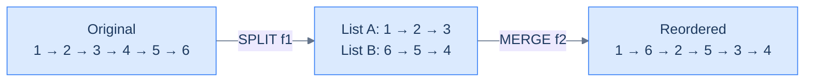
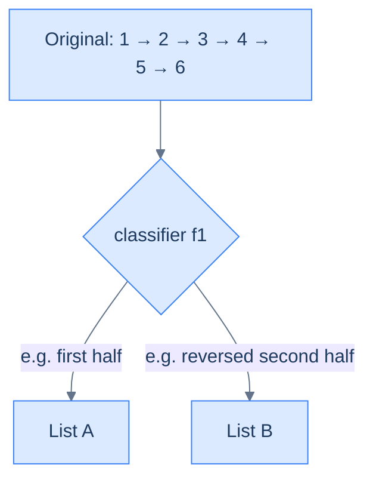
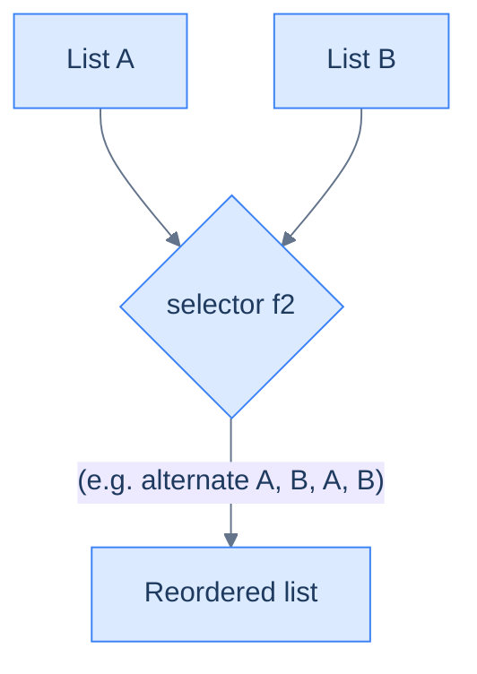
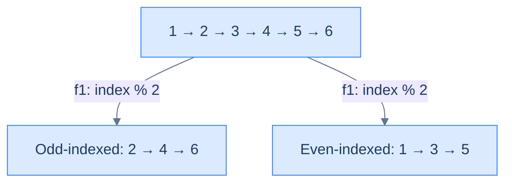
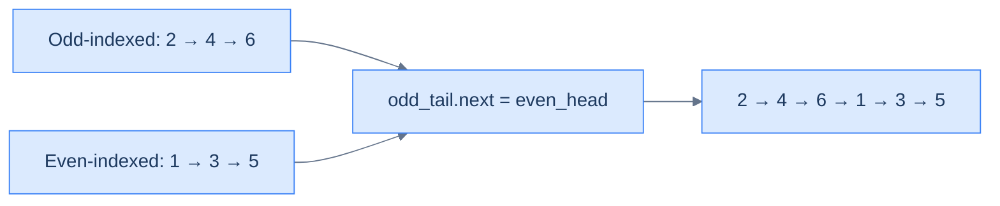

# 12. Pattern: Reorder

## The Hook

You've now met **split** (lesson 10) and **merge** (lesson 11) as separate patterns. Here's the reveal: they were never really separate. They're the two halves of a single technique called **reorder**, and almost every "rearrange the nodes of a list" problem you'll ever see — reverse alternating, move even-to-back, group by parity, interleave halves, shuffle in zig-zag — is just **split followed by merge** with a problem-specific classifier and selector.

The beauty of this framing is that you've already done the hard work. The split routes nodes into sub-lists based on a classifier `f1`. The merge weaves them back together based on a selector `f2`. Picking `f1` and `f2` is the entire problem; the skeleton is two function calls. Once you see this, "reorder the linked list" stops being a scary problem and becomes a fill-in-the-blanks exercise.

This lesson is the **capstone** of the split-merge-reorder trio. Nail it, and you've mastered the most reusable pattern family in linked lists.

---

## Table of contents

1. [Understanding the reorder pattern](#understanding-the-reorder-pattern)
2. [Identifying the reorder pattern](#identifying-the-reorder-pattern)
3. [Relocate node](#relocate-node)
4. [Parity order](#parity-order)
5. [Value partition](#value-partition)
6. [Shuffle list](#shuffle-list)

***

# Understanding the reorder pattern

Some linked list problems require us to reorder the nodes of the given list in place based on some conditions. In most cases, this requires first splitting the list based on the outcome of some function `f1` and then merging back the split list together either by using another function `f2` or simply concatenating them. These are generally **medium** difficulty problems that require either the split or merge technique we learned earlier or both. Many such problems may also require using other techniques, such as the reversal or fast and slow pointer technique.



<p align="center"><strong>Every reorder decomposes into <strong>split</strong> (lesson 10) + <strong>merge</strong> (lesson 11). Split routes nodes into temporary sub-lists; merge weaves them back together in the target order. Two primitives you've already built.</strong></p>

## Reordering technique

Consider that we are given a singly linked list whose nodes must be reordered. The problem almost always has a split function `f1` that we use to split the list into multiple lists using the split technique.

Consider the example execution below, where we use the function `f1` to split the list into two lists such that nodes with even indices go to one list and those with odd indices go to the other list.



<p align="center"><strong>Step 1 — <strong>split</strong>. A classifier <code>f1</code> routes nodes into temporary sub-lists using the pattern from lesson 10. Every reorder begins here.</strong></p>

In most cases, concatenating these split lists to merge them is sufficient, but sometimes, we may also have a function `f2` that must be used to merge the lists. We use the merge technique to merge them back together to solve the problem.

Consider the example execution below, where we use the function `f2` that merges alternate nodes to merge back the split lists starting with the second list, effectively reordering the nodes.



<p align="center"><strong>Step 2 — <strong>merge</strong>. A selector <code>f2</code> weaves the sub-lists back into one using the pattern from lesson 11. The combination of <code>f1</code> and <code>f2</code> IS the reorder algorithm.</strong></p>

The reordering technique is simply a combination of the split and merge techniques used in tandem to reorder nodes in the given list.

## Algorithm

The algorithm given below summarizes the reorder technique for **two** lists. It can be easily extended for `k` lists.

> **Algorithm**
>
> -   **Step 1:** Use the split technique to split the list in **two** using the function \`f1\`
> -   **Step 2:** Use the merge technique to merge the **two** lists using the function \`f2\`.
> -   **Step 3:** Return the head of the merged list.

## Implementation

Given below is the generic code implementation to split a list in **two** using the function `f1` and then merging them using the function `f2`.

<div class="lang-tabs">

```python,editable
from typing import Callable, Optional

class ListNode:
    def __init__(self, val=0, next=None):
        self.val = val
        self.next = next

def reorder_nodes(head: Optional[ListNode],
                  f1: Callable[[ListNode], bool],
                  f2: Callable[[ListNode, ListNode], bool]) -> Optional[ListNode]:
    # Phase 1 — SPLIT by classifier f1
    dummy_a = ListNode(); tail_a = dummy_a
    dummy_b = ListNode(); tail_b = dummy_b
    current = head
    while current is not None:
        if f1(current):
            tail_a.next = current; tail_a = current
        else:
            tail_b.next = current; tail_b = current
        current = current.next
    tail_a.next = None; tail_b.next = None

    # Phase 2 — MERGE by selector f2
    dummy = ListNode(); tail = dummy
    ca, cb = dummy_a.next, dummy_b.next
    while ca is not None and cb is not None:
        if f2(ca, cb):
            tail.next = ca; ca = ca.next
        else:
            tail.next = cb; cb = cb.next
        tail = tail.next
    tail.next = ca if ca is not None else cb
    return dummy.next
```

```java,editable
import java.util.function.Predicate;
import java.util.function.BiPredicate;

class Solution {
    public ListNode reorderNodes(ListNode head,
                                 Predicate<ListNode> f1,
                                 BiPredicate<ListNode, ListNode> f2) {
        ListNode dummyA = new ListNode(), tailA = dummyA;
        ListNode dummyB = new ListNode(), tailB = dummyB;
        for (ListNode c = head; c != null; c = c.next) {
            if (f1.test(c)) { tailA.next = c; tailA = c; }
            else             { tailB.next = c; tailB = c; }
        }
        tailA.next = null; tailB.next = null;

        ListNode dummy = new ListNode(), tail = dummy;
        ListNode ca = dummyA.next, cb = dummyB.next;
        while (ca != null && cb != null) {
            if (f2.test(ca, cb)) { tail.next = ca; ca = ca.next; }
            else                  { tail.next = cb; cb = cb.next; }
            tail = tail.next;
        }
        tail.next = (ca != null) ? ca : cb;
        return dummy.next;
    }
}
```

```c,editable
typedef struct ListNode { int val; struct ListNode *next; } ListNode;

ListNode* reorderNodes(ListNode *head,
                       int (*f1)(ListNode*),
                       int (*f2)(ListNode*, ListNode*)) {
    ListNode dummyA = {0, NULL}, dummyB = {0, NULL};
    ListNode *tailA = &dummyA, *tailB = &dummyB;
    for (ListNode *c = head; c != NULL; c = c->next) {
        if (f1(c)) { tailA->next = c; tailA = c; }
        else        { tailB->next = c; tailB = c; }
    }
    tailA->next = NULL; tailB->next = NULL;

    ListNode dummy = {0, NULL};
    ListNode *tail = &dummy;
    ListNode *ca = dummyA.next, *cb = dummyB.next;
    while (ca != NULL && cb != NULL) {
        if (f2(ca, cb)) { tail->next = ca; ca = ca->next; }
        else             { tail->next = cb; cb = cb->next; }
        tail = tail->next;
    }
    tail->next = (ca != NULL) ? ca : cb;
    return dummy.next;
}
```

```cpp,editable
#include <functional>

class Solution {
public:
    ListNode* reorderNodes(ListNode *head,
                           std::function<bool(ListNode*)> f1,
                           std::function<bool(ListNode*, ListNode*)> f2) {
        ListNode dummyA(0), dummyB(0);
        ListNode *tailA = &dummyA, *tailB = &dummyB;
        for (ListNode *c = head; c != nullptr; c = c->next) {
            if (f1(c)) { tailA->next = c; tailA = c; }
            else        { tailB->next = c; tailB = c; }
        }
        tailA->next = nullptr; tailB->next = nullptr;

        ListNode dummy(0);
        ListNode *tail = &dummy;
        ListNode *ca = dummyA.next, *cb = dummyB.next;
        while (ca != nullptr && cb != nullptr) {
            if (f2(ca, cb)) { tail->next = ca; ca = ca->next; }
            else             { tail->next = cb; cb = cb->next; }
            tail = tail->next;
        }
        tail->next = (ca != nullptr) ? ca : cb;
        return dummy.next;
    }
};
```

```scala,editable
object Solution {
  def reorderNodes(head: ListNode,
                   f1: ListNode => Boolean,
                   f2: (ListNode, ListNode) => Boolean): ListNode = {
    val dummyA = new ListNode(0); var tailA: ListNode = dummyA
    val dummyB = new ListNode(0); var tailB: ListNode = dummyB
    var c = head
    while (c != null) {
      if (f1(c)) { tailA.next = c; tailA = c }
      else        { tailB.next = c; tailB = c }
      c = c.next
    }
    tailA.next = null; tailB.next = null

    val dummy = new ListNode(0); var tail: ListNode = dummy
    var ca = dummyA.next; var cb = dummyB.next
    while (ca != null && cb != null) {
      if (f2(ca, cb)) { tail.next = ca; ca = ca.next }
      else             { tail.next = cb; cb = cb.next }
      tail = tail.next
    }
    tail.next = if (ca != null) ca else cb
    dummy.next
  }
}
```

```javascript,editable
function reorderNodes(head, f1, f2) {
    const dummyA = new ListNode(); let tailA = dummyA;
    const dummyB = new ListNode(); let tailB = dummyB;
    for (let c = head; c !== null; c = c.next) {
        if (f1(c)) { tailA.next = c; tailA = c; }
        else        { tailB.next = c; tailB = c; }
    }
    tailA.next = null; tailB.next = null;

    const dummy = new ListNode(); let tail = dummy;
    let ca = dummyA.next, cb = dummyB.next;
    while (ca !== null && cb !== null) {
        if (f2(ca, cb)) { tail.next = ca; ca = ca.next; }
        else             { tail.next = cb; cb = cb.next; }
        tail = tail.next;
    }
    tail.next = (ca !== null) ? ca : cb;
    return dummy.next;
}
```

```typescript,editable
function reorderNodes(head: ListNode | null,
                      f1: (n: ListNode) => boolean,
                      f2: (a: ListNode, b: ListNode) => boolean): ListNode | null {
    const dummyA = new ListNode(0); let tailA: ListNode = dummyA;
    const dummyB = new ListNode(0); let tailB: ListNode = dummyB;
    for (let c: ListNode | null = head; c !== null; c = c.next) {
        if (f1(c)) { tailA.next = c; tailA = c; }
        else        { tailB.next = c; tailB = c; }
    }
    tailA.next = null; tailB.next = null;

    const dummy = new ListNode(0); let tail: ListNode = dummy;
    let ca: ListNode | null = dummyA.next, cb: ListNode | null = dummyB.next;
    while (ca !== null && cb !== null) {
        if (f2(ca, cb)) { tail.next = ca; ca = ca.next; }
        else             { tail.next = cb; cb = cb.next; }
        tail = tail.next!;
    }
    tail.next = (ca !== null) ? ca : cb;
    return dummy.next;
}
```

```go,editable
type ListNode struct {
    Val  int
    Next *ListNode
}

func reorderNodes(head *ListNode, f1 func(*ListNode) bool, f2 func(*ListNode, *ListNode) bool) *ListNode {
    dummyA := &ListNode{}; tailA := dummyA
    dummyB := &ListNode{}; tailB := dummyB
    for c := head; c != nil; c = c.Next {
        if f1(c) { tailA.Next = c; tailA = c } else { tailB.Next = c; tailB = c }
    }
    tailA.Next = nil; tailB.Next = nil

    dummy := &ListNode{}; tail := dummy
    ca, cb := dummyA.Next, dummyB.Next
    for ca != nil && cb != nil {
        if f2(ca, cb) { tail.Next = ca; ca = ca.Next } else { tail.Next = cb; cb = cb.Next }
        tail = tail.Next
    }
    if ca != nil { tail.Next = ca } else { tail.Next = cb }
    return dummy.Next
}
```

```kotlin,editable
class Solution {
    fun reorderNodes(head: ListNode?,
                     f1: (ListNode) -> Boolean,
                     f2: (ListNode, ListNode) -> Boolean): ListNode? {
        val dummyA = ListNode(0); var tailA: ListNode = dummyA
        val dummyB = ListNode(0); var tailB: ListNode = dummyB
        var c = head
        while (c != null) {
            if (f1(c)) { tailA.next = c; tailA = c }
            else        { tailB.next = c; tailB = c }
            c = c.next
        }
        tailA.next = null; tailB.next = null

        val dummy = ListNode(0); var tail: ListNode = dummy
        var ca = dummyA.next; var cb = dummyB.next
        while (ca != null && cb != null) {
            if (f2(ca, cb)) { tail.next = ca; ca = ca.next }
            else             { tail.next = cb; cb = cb.next }
            tail = tail.next!!
        }
        tail.next = ca ?: cb
        return dummy.next
    }
}
```

```rust,editable
struct ListNode {
    val:  i32,
    next: Option<Box<ListNode>>,
}

// Under Box-ownership we collect bucket nodes in order, then rebuild and merge.
fn reorder_nodes(
    mut head: Option<Box<ListNode>>,
    f1: impl Fn(&ListNode) -> bool,
    f2: impl Fn(&ListNode, &ListNode) -> bool,
) -> Option<Box<ListNode>> {
    let mut a: Vec<Box<ListNode>> = Vec::new();
    let mut b: Vec<Box<ListNode>> = Vec::new();
    while let Some(mut node) = head {
        head = node.next.take();
        if f1(&node) { a.push(node); } else { b.push(node); }
    }

    fn chain(nodes: Vec<Box<ListNode>>) -> Option<Box<ListNode>> {
        let mut next: Option<Box<ListNode>> = None;
        for mut node in nodes.into_iter().rev() { node.next = next; next = Some(node); }
        next
    }

    let mut ca = chain(a);
    let mut cb = chain(b);
    let mut dummy = Box::new(ListNode { val: 0, next: None });
    {
        let mut tail: &mut Box<ListNode> = &mut dummy;
        while ca.is_some() && cb.is_some() {
            let take_a = f2(ca.as_deref().unwrap(), cb.as_deref().unwrap());
            let node = if take_a {
                let mut n = ca.take().unwrap();
                ca = n.next.take();
                n
            } else {
                let mut n = cb.take().unwrap();
                cb = n.next.take();
                n
            };
            tail.next = Some(node);
            tail = tail.next.as_mut().unwrap();
        }
        tail.next = ca.or(cb);
    }
    dummy.next.take()
}
```

</div>

## Complexity Analysis

The runtime and space complexity for the reorder technique that splits the list into **two** lists is pretty easy to understand. We traverse the entire list to split it that has a linear **O(N)** runtime complexity. If we only need to concatenate the split lists to merge them, it takes constant **O(1)** time; otherwise, we may need to traverse both split lists completely in the worst case, which has a linear, total **O(N)** runtime complexity. We traverse the entire list to split it in any case, and so the runtime complexity in any case is **O(N)**.

When we reorder a list by splitting it into two, we only create two dummy nodes and update references, so the space complexity is constant, **O(1)**, in any case.

> **Best Case:**
>
> -   Space Complexity - **O(1)**
> -   Time Complexity - **O(N)**
>
> **Worst Case:**
>
> -   Space Complexity - **O(1)**
> -   Time Complexity - **O(N)**

***

# Identifying the reorder pattern

The linked list problems that require reordering in place in the list are the only problems that can be solved using the reorder technique. These are generally **medium** problems where we split the list using some function and then merge them back together using another function. Many such problems also have smaller subproblems that require other techniques like reversal or fast and slow pointers to find the middle. If the problem statement or its solution follows the generic template below, it can be solved by applying the split list technique.

**Template:**

Given a linked list, reorder its nodes.

## Example

Let's consider the following problem as an example to better understand how to identify and solve a problem using the reorder technique.

> **Problem statement:** Given a singly linked list, reorder its nodes so all nodes at even indices come after the nodes at odd indices. The indices start with 1.

```d2
before: "Before — indices 0, 1, 2, 3, 4, 5" {
  direction: right
  a0: "1 [0]"
  a1: "2 [1]"
  a2: "3 [2]"
  a3: "4 [3]"
  a4: "5 [4]"
  a5: "6 [5]"
  a0 -> a1
  a1 -> a2
  a2 -> a3
  a3 -> a4
  a4 -> a5
}

after: "After — odd-indexed first, then even-indexed" {
  direction: right
  b1: "2"
  b3: "4"
  b5: "6"
  b0: "1"
  b2: "3"
  b4: "5"
  b1 -> b3
  b3 -> b5
  b5 -> b0
  b0 -> b2
  b2 -> b4
}

before -> after
```

<p align="center"><strong>Odd-even reorder — example target shape. All nodes at odd indices ([1], [3], [5]) come before all nodes at even indices ([0], [2], [4]). A clean split-then-concatenate case.</strong></p>

### Reorder technique solution

We need to reorder the nodes in the given list, and this fits the generic template from the reorder pattern we learned earlier.

**Template:**

Given a linked list, reorder its nodes.

To reorder the nodes, we use the split technique to split the given linked list into two such that the first and second split lists have all the nodes with odd and even indices nodes, respectively.  We create two dummy nodes `dummyA`, `dummyB` and tail references `tailA` and `tailB` and initialize them with the respective dummy nodes. We initialize a counter variable `index` with 0 and iterate the list from start to end using `current` which is initialized with the head of the list.

In each iteration, we check if the `index` is odd or even and add the `current` node to the end of the correct list using one of the tail references. We then increment `index` and move ahead to repeat the process for the next iteration.



<p align="center"><strong>Split step — classifier <code>f1(node, index) = index % 2</code> routes odd-indexed nodes into one bucket, even-indexed into another. Same mechanics as the split pattern (lesson 10).</strong></p>

We don't need to use the merge technique to merge the lists, as we can concatenate them in this case. We use the tail and dummy references from the split technique to concatenate them by updating references.



<p align="center"><strong>Merge step — the simplest selector <code>f2</code>: concatenate. Append the entire second list after the first by setting <code>odd_tail.next = even_head</code>. One pointer update.</strong></p>

The implementation of the split list solution is given as follows.

<div class="lang-tabs">

```python,editable
from typing import Optional

class Solution:
    def even_odd_list(self, head: Optional[ListNode]) -> Optional[ListNode]:
        if head is None or head.next is None:
            return head

        # Phase 1 — split by position parity (1-indexed): odd positions → oddList
        odd_dummy, even_dummy = ListNode(), ListNode()
        odd_tail,  even_tail  = odd_dummy, even_dummy
        current, counter = head, 1
        while current is not None:
            if counter % 2 == 1:
                odd_tail.next = current;  odd_tail  = current
            else:
                even_tail.next = current; even_tail = current
            current = current.next
            counter += 1
        odd_tail.next = None; even_tail.next = None

        # Phase 2 — concatenate: odd_tail → even_head
        odd_tail.next = even_dummy.next
        return odd_dummy.next
```

```java,editable
class Solution {
    public ListNode evenOddList(ListNode head) {
        if (head == null || head.next == null) return head;

        ListNode oddDummy = new ListNode(), oddTail  = oddDummy;
        ListNode evenDummy = new ListNode(), evenTail = evenDummy;
        ListNode current = head;
        int counter = 1;
        while (current != null) {
            if (counter % 2 == 1) { oddTail.next = current; oddTail = current; }
            else                   { evenTail.next = current; evenTail = current; }
            current = current.next;
            counter++;
        }
        evenTail.next = null;
        oddTail.next  = evenDummy.next;     // concatenate
        return oddDummy.next;
    }
}
```

```c,editable
ListNode* evenOddList(ListNode *head) {
    if (head == NULL || head->next == NULL) return head;

    ListNode oddDummy  = {0, NULL}, evenDummy = {0, NULL};
    ListNode *oddTail  = &oddDummy, *evenTail = &evenDummy;
    ListNode *current = head;
    int counter = 1;
    while (current != NULL) {
        if (counter % 2 == 1) { oddTail->next = current;  oddTail = current; }
        else                   { evenTail->next = current; evenTail = current; }
        current = current->next;
        counter++;
    }
    evenTail->next = NULL;
    oddTail->next  = evenDummy.next;
    return oddDummy.next;
}
```

```cpp,editable
class Solution {
public:
    ListNode* evenOddList(ListNode *head) {
        if (head == nullptr || head->next == nullptr) return head;

        ListNode oddDummy(0), evenDummy(0);
        ListNode *oddTail = &oddDummy, *evenTail = &evenDummy;
        ListNode *current = head;
        int counter = 1;
        while (current != nullptr) {
            if (counter % 2 == 1) { oddTail->next = current;  oddTail = current; }
            else                   { evenTail->next = current; evenTail = current; }
            current = current->next;
            counter++;
        }
        evenTail->next = nullptr;
        oddTail->next  = evenDummy.next;
        return oddDummy.next;
    }
};
```

```scala,editable
object Solution {
  def evenOddList(head: ListNode): ListNode = {
    if (head == null || head.next == null) return head

    val oddDummy  = new ListNode(0); var oddTail:  ListNode = oddDummy
    val evenDummy = new ListNode(0); var evenTail: ListNode = evenDummy
    var current = head; var counter = 1
    while (current != null) {
      if (counter % 2 == 1) { oddTail.next = current;  oddTail = current }
      else                   { evenTail.next = current; evenTail = current }
      current = current.next
      counter += 1
    }
    evenTail.next = null
    oddTail.next  = evenDummy.next
    oddDummy.next
  }
}
```

```javascript,editable
function evenOddList(head) {
    if (head === null || head.next === null) return head;

    const oddDummy = new ListNode(), evenDummy = new ListNode();
    let oddTail = oddDummy, evenTail = evenDummy;
    let current = head, counter = 1;
    while (current !== null) {
        if (counter % 2 === 1) { oddTail.next = current;  oddTail = current; }
        else                    { evenTail.next = current; evenTail = current; }
        current = current.next;
        counter++;
    }
    evenTail.next = null;
    oddTail.next  = evenDummy.next;
    return oddDummy.next;
}
```

```typescript,editable
function evenOddList(head: ListNode | null): ListNode | null {
    if (head === null || head.next === null) return head;

    const oddDummy = new ListNode(0), evenDummy = new ListNode(0);
    let oddTail: ListNode = oddDummy, evenTail: ListNode = evenDummy;
    let current: ListNode | null = head, counter = 1;
    while (current !== null) {
        if (counter % 2 === 1) { oddTail.next = current;  oddTail = current; }
        else                    { evenTail.next = current; evenTail = current; }
        current = current.next;
        counter++;
    }
    evenTail.next = null;
    oddTail.next  = evenDummy.next;
    return oddDummy.next;
}
```

```go,editable
func evenOddList(head *ListNode) *ListNode {
    if head == nil || head.Next == nil { return head }

    oddDummy, evenDummy := &ListNode{}, &ListNode{}
    oddTail, evenTail   := oddDummy, evenDummy
    current := head
    counter := 1
    for current != nil {
        if counter%2 == 1 { oddTail.Next = current;  oddTail = current } else { evenTail.Next = current; evenTail = current }
        current = current.Next
        counter++
    }
    evenTail.Next = nil
    oddTail.Next  = evenDummy.Next
    return oddDummy.Next
}
```

```kotlin,editable
class Solution {
    fun evenOddList(head: ListNode?): ListNode? {
        if (head == null || head.next == null) return head

        val oddDummy  = ListNode(0); var oddTail:  ListNode = oddDummy
        val evenDummy = ListNode(0); var evenTail: ListNode = evenDummy
        var current = head; var counter = 1
        while (current != null) {
            if (counter % 2 == 1) { oddTail.next = current;  oddTail = current }
            else                   { evenTail.next = current; evenTail = current }
            current = current.next
            counter++
        }
        evenTail.next = null
        oddTail.next  = evenDummy.next
        return oddDummy.next
    }
}
```

```rust,editable
fn even_odd_list(mut head: Option<Box<ListNode>>) -> Option<Box<ListNode>> {
    let mut odds:  Vec<Box<ListNode>> = Vec::new();
    let mut evens: Vec<Box<ListNode>> = Vec::new();
    let mut counter = 1;
    while let Some(mut node) = head {
        head = node.next.take();
        if counter % 2 == 1 { odds.push(node); } else { evens.push(node); }
        counter += 1;
    }

    fn chain(nodes: Vec<Box<ListNode>>) -> Option<Box<ListNode>> {
        let mut next: Option<Box<ListNode>> = None;
        for mut node in nodes.into_iter().rev() { node.next = next; next = Some(node); }
        next
    }

    // Concatenate: walk odds to tail, attach evens
    let mut result = chain(odds);
    let evens_chain = chain(evens);
    if result.is_none() { return evens_chain; }
    {
        let mut tail: &mut Box<ListNode> = result.as_mut().unwrap();
        while tail.next.is_some() { tail = tail.next.as_mut().unwrap(); }
        tail.next = evens_chain;
    }
    result
}
```

</div>

The above implementation uses the split list technique to split the list into two lists and merge them together by concatenating them.

## Example problems

Most problems that fall under this category are**medium**problems and can be solved by splitting and then contacting the split list. Sometimes, using the merge technique may be required for merging the split using some function, and often, other techniques like reversal or fast and slow pointer techniques may be needed to solve some subproblems. A list of a few problems is given below.

> -   **[Relocate node](#relocate-node)**
> -   **[Parity order](#parity-order)**
> -   **[Value partition](#value-partition)**
> -   **[Shuffle list](#shuffle-list)**

We will now solve these problems to understand the reorder technique better.

***

# Relocate node

## Problem Statement

Given the **head** of a singly linked list, write a function to move the last node of the list to the start and return the headof the reordered list.

### Example 1

> -   **Input:** head = \[5, 7, 3, 10, 6, 8\]
> -   **Output:** \[8, 5, 7, 3, 10, 6\]
> -   **Explanation:** The last node with the value 8 is moved to the start of the list.

### Example 2

> -   **Input:** head = \[5, 7\]
> -   **Output:** \[7, 5\]
> -   **Explanation:** The last node with the value 7 is moved to the start of the list.

### Example 3

> -   **Input:** head = \[5\]
> -   **Output:** \[5\]
> -   **Explanation:** There is nothing to move as the list only has one node, which is both the first and the last node at the same time.

## Solution

<div class="lang-tabs">

```python,editable
from typing import Optional

class Solution:
    def relocate_node(self, head: Optional[ListNode]) -> Optional[ListNode]:
        if head is None or head.next is None:
            return head

        # Walk to the last node while tracking its predecessor
        prev, cur = None, head
        while cur.next is not None:
            prev, cur = cur, cur.next

        prev.next = None      # disconnect the last node
        cur.next  = head      # prepend last as new head
        return cur
```

```java,editable
class Solution {
    public ListNode relocateNode(ListNode head) {
        if (head == null || head.next == null) return head;

        ListNode prev = null, cur = head;
        while (cur.next != null) { prev = cur; cur = cur.next; }

        prev.next = null;
        cur.next  = head;
        return cur;
    }
}
```

```c,editable
ListNode* relocateNode(ListNode *head) {
    if (head == NULL || head->next == NULL) return head;

    ListNode *prev = NULL, *cur = head;
    while (cur->next != NULL) { prev = cur; cur = cur->next; }

    prev->next = NULL;
    cur->next  = head;
    return cur;
}
```

```cpp,editable
class Solution {
public:
    ListNode* relocateNode(ListNode *head) {
        if (head == nullptr || head->next == nullptr) return head;

        ListNode *prev = nullptr, *cur = head;
        while (cur->next != nullptr) { prev = cur; cur = cur->next; }

        prev->next = nullptr;
        cur->next  = head;
        return cur;
    }
};
```

```scala,editable
object Solution {
  def relocateNode(head: ListNode): ListNode = {
    if (head == null || head.next == null) return head

    var prev: ListNode = null
    var cur = head
    while (cur.next != null) { prev = cur; cur = cur.next }

    prev.next = null
    cur.next  = head
    cur
  }
}
```

```javascript,editable
function relocateNode(head) {
    if (head === null || head.next === null) return head;

    let prev = null, cur = head;
    while (cur.next !== null) { prev = cur; cur = cur.next; }

    prev.next = null;
    cur.next  = head;
    return cur;
}
```

```typescript,editable
function relocateNode(head: ListNode | null): ListNode | null {
    if (head === null || head.next === null) return head;

    let prev: ListNode | null = null;
    let cur: ListNode = head;
    while (cur.next !== null) { prev = cur; cur = cur.next; }

    prev!.next = null;
    cur.next   = head;
    return cur;
}
```

```go,editable
func relocateNode(head *ListNode) *ListNode {
    if head == nil || head.Next == nil { return head }

    var prev *ListNode = nil
    cur := head
    for cur.Next != nil { prev = cur; cur = cur.Next }

    prev.Next = nil
    cur.Next  = head
    return cur
}
```

```kotlin,editable
class Solution {
    fun relocateNode(head: ListNode?): ListNode? {
        if (head == null || head.next == null) return head

        var prev: ListNode? = null
        var cur: ListNode = head
        while (cur.next != null) { prev = cur; cur = cur.next!! }

        prev!!.next = null
        cur.next    = head
        return cur
    }
}
```

```rust,editable
fn relocate_node(mut head: Option<Box<ListNode>>) -> Option<Box<ListNode>> {
    if head.is_none() || head.as_ref().unwrap().next.is_none() { return head; }

    // Walk to the node BEFORE the tail, then detach the tail and prepend it.
    {
        let mut cur: &mut Box<ListNode> = head.as_mut().unwrap();
        while cur.next.as_ref().unwrap().next.is_some() {
            cur = cur.next.as_mut().unwrap();
        }
        let mut last = cur.next.take().unwrap();
        last.next = head;       // last.next points at the old head
        return Some(last);
    }
}
```

</div>

***

# Parity order

## Problem Statement

Given the **head** of a singly linked list, write a function to group all the nodes that appear on odd indices together, followed by the nodes that appear on even indices, and return the head of the reordered list.  

The indices start with `1`.

### Example 1

> -   **Input:** head = \[2, 1, 3, 4, 8\]
> -   **Output:** \[2, 3, 8, 1, 4\]
> -   **Explanation:** After grouping the nodes at odd indices followed by even indices, the list becomes \[2, 3, 8, 1, 4\].

### Example 2

> -   **Input:** head = \[\]
> -   **Output:** \[\]
> -   **Explanation:** Since the input list is empty, the output list will also be empty.

## Solution

<div class="lang-tabs">

```python,editable
from typing import Optional

class Solution:
    def parity_order(self, head: Optional[ListNode]) -> Optional[ListNode]:
        if head is None or head.next is None:
            return head

        odd_dummy, even_dummy = ListNode(), ListNode()
        odd_tail,  even_tail  = odd_dummy, even_dummy
        current, counter = head, 1
        while current is not None:
            if counter % 2 == 1:
                odd_tail.next  = current; odd_tail  = current
            else:
                even_tail.next = current; even_tail = current
            current = current.next
            counter += 1
        even_tail.next = None
        odd_tail.next  = even_dummy.next   # concatenate
        return odd_dummy.next
```

```java,editable
class Solution {
    public ListNode parityOrder(ListNode head) {
        if (head == null || head.next == null) return head;

        ListNode oddDummy = new ListNode(), oddTail  = oddDummy;
        ListNode evenDummy = new ListNode(), evenTail = evenDummy;
        int counter = 1;
        for (ListNode c = head; c != null; c = c.next) {
            if (counter % 2 == 1) { oddTail.next = c;  oddTail = c; }
            else                   { evenTail.next = c; evenTail = c; }
            counter++;
        }
        evenTail.next = null;
        oddTail.next  = evenDummy.next;
        return oddDummy.next;
    }
}
```

```c,editable
ListNode* parityOrder(ListNode *head) {
    if (head == NULL || head->next == NULL) return head;

    ListNode oddDummy  = {0, NULL}, evenDummy = {0, NULL};
    ListNode *oddTail  = &oddDummy, *evenTail = &evenDummy;
    int counter = 1;
    for (ListNode *c = head; c != NULL; c = c->next) {
        if (counter % 2 == 1) { oddTail->next = c;  oddTail = c; }
        else                   { evenTail->next = c; evenTail = c; }
        counter++;
    }
    evenTail->next = NULL;
    oddTail->next  = evenDummy.next;
    return oddDummy.next;
}
```

```cpp,editable
class Solution {
public:
    ListNode* parityOrder(ListNode *head) {
        if (head == nullptr || head->next == nullptr) return head;

        ListNode oddDummy(0), evenDummy(0);
        ListNode *oddTail = &oddDummy, *evenTail = &evenDummy;
        int counter = 1;
        for (ListNode *c = head; c != nullptr; c = c->next) {
            if (counter % 2 == 1) { oddTail->next = c;  oddTail = c; }
            else                   { evenTail->next = c; evenTail = c; }
            counter++;
        }
        evenTail->next = nullptr;
        oddTail->next  = evenDummy.next;
        return oddDummy.next;
    }
};
```

```scala,editable
object Solution {
  def parityOrder(head: ListNode): ListNode = {
    if (head == null || head.next == null) return head

    val oddDummy = new ListNode(0); var oddTail: ListNode = oddDummy
    val evenDummy = new ListNode(0); var evenTail: ListNode = evenDummy
    var c = head; var counter = 1
    while (c != null) {
      if (counter % 2 == 1) { oddTail.next = c;  oddTail = c }
      else                   { evenTail.next = c; evenTail = c }
      c = c.next; counter += 1
    }
    evenTail.next = null
    oddTail.next  = evenDummy.next
    oddDummy.next
  }
}
```

```javascript,editable
function parityOrder(head) {
    if (head === null || head.next === null) return head;

    const oddDummy = new ListNode(), evenDummy = new ListNode();
    let oddTail = oddDummy, evenTail = evenDummy;
    let counter = 1;
    for (let c = head; c !== null; c = c.next) {
        if (counter % 2 === 1) { oddTail.next = c;  oddTail = c; }
        else                    { evenTail.next = c; evenTail = c; }
        counter++;
    }
    evenTail.next = null;
    oddTail.next  = evenDummy.next;
    return oddDummy.next;
}
```

```typescript,editable
function parityOrder(head: ListNode | null): ListNode | null {
    if (head === null || head.next === null) return head;

    const oddDummy = new ListNode(0), evenDummy = new ListNode(0);
    let oddTail: ListNode = oddDummy, evenTail: ListNode = evenDummy;
    let counter = 1;
    for (let c: ListNode | null = head; c !== null; c = c.next) {
        if (counter % 2 === 1) { oddTail.next = c;  oddTail = c; }
        else                    { evenTail.next = c; evenTail = c; }
        counter++;
    }
    evenTail.next = null;
    oddTail.next  = evenDummy.next;
    return oddDummy.next;
}
```

```go,editable
func parityOrder(head *ListNode) *ListNode {
    if head == nil || head.Next == nil { return head }

    oddDummy, evenDummy := &ListNode{}, &ListNode{}
    oddTail, evenTail   := oddDummy, evenDummy
    counter := 1
    for c := head; c != nil; c = c.Next {
        if counter%2 == 1 { oddTail.Next = c;  oddTail = c } else { evenTail.Next = c; evenTail = c }
        counter++
    }
    evenTail.Next = nil
    oddTail.Next  = evenDummy.Next
    return oddDummy.Next
}
```

```kotlin,editable
class Solution {
    fun parityOrder(head: ListNode?): ListNode? {
        if (head == null || head.next == null) return head

        val oddDummy = ListNode(0); var oddTail: ListNode = oddDummy
        val evenDummy = ListNode(0); var evenTail: ListNode = evenDummy
        var counter = 1
        var c: ListNode? = head
        while (c != null) {
            if (counter % 2 == 1) { oddTail.next = c;  oddTail = c }
            else                   { evenTail.next = c; evenTail = c }
            c = c.next; counter++
        }
        evenTail.next = null
        oddTail.next  = evenDummy.next
        return oddDummy.next
    }
}
```

```rust,editable
fn parity_order(mut head: Option<Box<ListNode>>) -> Option<Box<ListNode>> {
    let mut odds:  Vec<Box<ListNode>> = Vec::new();
    let mut evens: Vec<Box<ListNode>> = Vec::new();
    let mut counter = 1;
    while let Some(mut node) = head {
        head = node.next.take();
        if counter % 2 == 1 { odds.push(node); } else { evens.push(node); }
        counter += 1;
    }
    fn chain(nodes: Vec<Box<ListNode>>) -> Option<Box<ListNode>> {
        let mut next: Option<Box<ListNode>> = None;
        for mut node in nodes.into_iter().rev() { node.next = next; next = Some(node); }
        next
    }
    let mut result = chain(odds);
    let evens_chain = chain(evens);
    if result.is_none() { return evens_chain; }
    {
        let mut tail: &mut Box<ListNode> = result.as_mut().unwrap();
        while tail.next.is_some() { tail = tail.next.as_mut().unwrap(); }
        tail.next = evens_chain;
    }
    result
}
```

</div>

***

# Value partition

## Problem Statement

Given the **head** of a singly linked list and a value **X**, write a function to partition the list such that all nodes less than X come before nodes greater than or equal to X and return the head of the reordered list. The original relative order of the nodes in each of the two partitions should be preserved.

### Example 1

> -   **Input:** head = \[1, 4, 3, 2, 5, 2\], X = 3
> -   **Output:** \[1, 2, 2, 4, 3, 5\]
> -   **Explanation:** Nodes with values 1, 2, and 2 are less than 3. Therefore, they will be placed before the nodes with values greater than or equal to 3.

### Example 2

> -   **Input:** head = \[2, 1\], X = 2
> -   **Output:** \[1, 2\]
> -   **Explanation:** Node with value 1 is less than 2. Therefore, it will be placed before the nodes with values greater than or equal to 2.

## Solution

<div class="lang-tabs">

```python,editable
from typing import Optional

class Solution:
    def value_partition(self, head: Optional[ListNode], x: int) -> Optional[ListNode]:
        less_dummy,    greater_dummy    = ListNode(), ListNode()
        less_tail,     greater_tail     = less_dummy, greater_dummy
        current = head
        while current is not None:
            if current.val < x:
                less_tail.next    = current; less_tail    = current
            else:
                greater_tail.next = current; greater_tail = current
            current = current.next
        greater_tail.next = None
        less_tail.next    = greater_dummy.next       # concatenate
        return less_dummy.next
```

```java,editable
class Solution {
    public ListNode valuePartition(ListNode head, int x) {
        ListNode lessDummy = new ListNode(), lessTail = lessDummy;
        ListNode greaterDummy = new ListNode(), greaterTail = greaterDummy;
        for (ListNode c = head; c != null; c = c.next) {
            if (c.val < x) { lessTail.next    = c; lessTail    = c; }
            else            { greaterTail.next = c; greaterTail = c; }
        }
        greaterTail.next = null;
        lessTail.next    = greaterDummy.next;
        return lessDummy.next;
    }
}
```

```c,editable
ListNode* valuePartition(ListNode *head, int x) {
    ListNode lessDummy = {0, NULL}, greaterDummy = {0, NULL};
    ListNode *lessTail = &lessDummy, *greaterTail = &greaterDummy;
    for (ListNode *c = head; c != NULL; c = c->next) {
        if (c->val < x) { lessTail->next    = c; lessTail    = c; }
        else             { greaterTail->next = c; greaterTail = c; }
    }
    greaterTail->next = NULL;
    lessTail->next    = greaterDummy.next;
    return lessDummy.next;
}
```

```cpp,editable
class Solution {
public:
    ListNode* valuePartition(ListNode *head, int x) {
        ListNode lessDummy(0), greaterDummy(0);
        ListNode *lessTail = &lessDummy, *greaterTail = &greaterDummy;
        for (ListNode *c = head; c != nullptr; c = c->next) {
            if (c->val < x) { lessTail->next    = c; lessTail    = c; }
            else             { greaterTail->next = c; greaterTail = c; }
        }
        greaterTail->next = nullptr;
        lessTail->next    = greaterDummy.next;
        return lessDummy.next;
    }
};
```

```scala,editable
object Solution {
  def valuePartition(head: ListNode, x: Int): ListNode = {
    val lessDummy = new ListNode(0); var lessTail: ListNode = lessDummy
    val greaterDummy = new ListNode(0); var greaterTail: ListNode = greaterDummy
    var c = head
    while (c != null) {
      if (c.v < x) { lessTail.next    = c; lessTail    = c }
      else          { greaterTail.next = c; greaterTail = c }
      c = c.next
    }
    greaterTail.next = null
    lessTail.next    = greaterDummy.next
    lessDummy.next
  }
}
```

```javascript,editable
function valuePartition(head, x) {
    const lessDummy = new ListNode(), greaterDummy = new ListNode();
    let lessTail = lessDummy, greaterTail = greaterDummy;
    for (let c = head; c !== null; c = c.next) {
        if (c.val < x) { lessTail.next    = c; lessTail    = c; }
        else            { greaterTail.next = c; greaterTail = c; }
    }
    greaterTail.next = null;
    lessTail.next    = greaterDummy.next;
    return lessDummy.next;
}
```

```typescript,editable
function valuePartition(head: ListNode | null, x: number): ListNode | null {
    const lessDummy = new ListNode(0), greaterDummy = new ListNode(0);
    let lessTail: ListNode = lessDummy, greaterTail: ListNode = greaterDummy;
    for (let c: ListNode | null = head; c !== null; c = c.next) {
        if (c.val < x) { lessTail.next    = c; lessTail    = c; }
        else            { greaterTail.next = c; greaterTail = c; }
    }
    greaterTail.next = null;
    lessTail.next    = greaterDummy.next;
    return lessDummy.next;
}
```

```go,editable
func valuePartition(head *ListNode, x int) *ListNode {
    lessDummy, greaterDummy := &ListNode{}, &ListNode{}
    lessTail, greaterTail   := lessDummy, greaterDummy
    for c := head; c != nil; c = c.Next {
        if c.Val < x { lessTail.Next    = c; lessTail    = c } else { greaterTail.Next = c; greaterTail = c }
    }
    greaterTail.Next = nil
    lessTail.Next    = greaterDummy.Next
    return lessDummy.Next
}
```

```kotlin,editable
class Solution {
    fun valuePartition(head: ListNode?, x: Int): ListNode? {
        val lessDummy = ListNode(0); var lessTail: ListNode = lessDummy
        val greaterDummy = ListNode(0); var greaterTail: ListNode = greaterDummy
        var c = head
        while (c != null) {
            if (c.`val` < x) { lessTail.next    = c; lessTail    = c }
            else              { greaterTail.next = c; greaterTail = c }
            c = c.next
        }
        greaterTail.next = null
        lessTail.next    = greaterDummy.next
        return lessDummy.next
    }
}
```

```rust,editable
fn value_partition(mut head: Option<Box<ListNode>>, x: i32) -> Option<Box<ListNode>> {
    let mut less: Vec<Box<ListNode>> = Vec::new();
    let mut ge:   Vec<Box<ListNode>> = Vec::new();
    while let Some(mut node) = head {
        head = node.next.take();
        if node.val < x { less.push(node); } else { ge.push(node); }
    }
    fn chain(nodes: Vec<Box<ListNode>>) -> Option<Box<ListNode>> {
        let mut next: Option<Box<ListNode>> = None;
        for mut node in nodes.into_iter().rev() { node.next = next; next = Some(node); }
        next
    }
    let mut result = chain(less);
    let ge_chain = chain(ge);
    if result.is_none() { return ge_chain; }
    {
        let mut tail: &mut Box<ListNode> = result.as_mut().unwrap();
        while tail.next.is_some() { tail = tail.next.as_mut().unwrap(); }
        tail.next = ge_chain;
    }
    result
}
```

</div>

***

# Shuffle list

## Problem Statement

Given the **head** of a singly linked list that can be represented as **L0 -> L1 -> … -> Ln - 1 -> Ln**. Reorder the list **in place** to match the following format: 

**L0 -> Ln -> L1 -> Ln - 1 -> L2 -> Ln - 2 -> …**

### Example 1

> -   **Input:** head = \[1, 2, 3, 4\]
> -   **Output:** \[1, 4, 2, 3\]
> -   **Explanation:** After reordering, the list becomes \[1, 4, 2, 3\].

### Example 2

> -   **Input:** head = \[1, 2, 3, 4, 5\]
> -   **Output:** \[1, 5, 2, 4, 3\]
> -   **Explanation:** After reordering, the list becomes \[1, 5, 2, 4, 3\].

## Solution

<div class="lang-tabs">

```python,editable
from typing import Optional

class Solution:
    def _split_in_half(self, head: ListNode):
        # slow/fast split — first half gets the middle on odd length
        slow, fast, prev_to_slow = head, head, None
        while fast is not None and fast.next is not None:
            prev_to_slow = slow
            slow = slow.next
            fast = fast.next.next
        if fast is None:
            second = prev_to_slow.next
            prev_to_slow.next = None
        else:
            second = slow.next
            slow.next = None
        return head, second

    def _reverse(self, head: Optional[ListNode]) -> Optional[ListNode]:
        prev, cur = None, head
        while cur is not None:
            nxt = cur.next
            cur.next = prev
            prev, cur = cur, nxt
        return prev

    def shuffle_list(self, head: Optional[ListNode]) -> Optional[ListNode]:
        if head is None or head.next is None:
            return head

        first, second = self._split_in_half(head)
        second        = self._reverse(second)

        # Alternate-merge: first → second → first → second → ...
        dummy = ListNode()
        tail  = dummy
        take_first = True
        while first is not None and second is not None:
            if take_first:
                tail.next = first;  first  = first.next
            else:
                tail.next = second; second = second.next
            tail       = tail.next
            take_first = not take_first
        tail.next = first if first is not None else second
        return dummy.next
```

```java,editable
class Solution {
    private ListNode reverse(ListNode h) {
        ListNode prev = null, cur = h;
        while (cur != null) { ListNode nxt = cur.next; cur.next = prev; prev = cur; cur = nxt; }
        return prev;
    }
    private ListNode[] splitInHalf(ListNode head) {
        ListNode slow = head, fast = head, prevToSlow = null;
        while (fast != null && fast.next != null) {
            prevToSlow = slow;
            slow = slow.next;
            fast = fast.next.next;
        }
        ListNode second;
        if (fast == null) { second = prevToSlow.next; prevToSlow.next = null; }
        else               { second = slow.next; slow.next = null; }
        return new ListNode[]{head, second};
    }

    public ListNode shuffleList(ListNode head) {
        if (head == null || head.next == null) return head;

        ListNode[] halves = splitInHalf(head);
        ListNode first = halves[0], second = reverse(halves[1]);

        ListNode dummy = new ListNode(), tail = dummy;
        boolean takeFirst = true;
        while (first != null && second != null) {
            if (takeFirst) { tail.next = first;  first  = first.next; }
            else            { tail.next = second; second = second.next; }
            tail      = tail.next;
            takeFirst = !takeFirst;
        }
        tail.next = (first != null) ? first : second;
        return dummy.next;
    }
}
```

```c,editable
static ListNode* sl_reverse(ListNode *h) {
    ListNode *prev = NULL, *cur = h;
    while (cur) { ListNode *nxt = cur->next; cur->next = prev; prev = cur; cur = nxt; }
    return prev;
}

ListNode* shuffleList(ListNode *head) {
    if (head == NULL || head->next == NULL) return head;

    ListNode *slow = head, *fast = head, *prevToSlow = NULL;
    while (fast != NULL && fast->next != NULL) {
        prevToSlow = slow;
        slow = slow->next;
        fast = fast->next->next;
    }
    ListNode *second;
    if (fast == NULL) { second = prevToSlow->next; prevToSlow->next = NULL; }
    else               { second = slow->next; slow->next = NULL; }

    second = sl_reverse(second);
    ListNode *first = head;

    ListNode dummy = {0, NULL};
    ListNode *tail = &dummy;
    int takeFirst = 1;
    while (first != NULL && second != NULL) {
        if (takeFirst) { tail->next = first;  first  = first->next; }
        else            { tail->next = second; second = second->next; }
        tail      = tail->next;
        takeFirst = !takeFirst;
    }
    tail->next = (first != NULL) ? first : second;
    return dummy.next;
}
```

```cpp,editable
class Solution {
    ListNode* reverse(ListNode *h) {
        ListNode *prev = nullptr, *cur = h;
        while (cur) { ListNode *nxt = cur->next; cur->next = prev; prev = cur; cur = nxt; }
        return prev;
    }
public:
    ListNode* shuffleList(ListNode *head) {
        if (head == nullptr || head->next == nullptr) return head;

        ListNode *slow = head, *fast = head, *prevToSlow = nullptr;
        while (fast != nullptr && fast->next != nullptr) {
            prevToSlow = slow;
            slow = slow->next;
            fast = fast->next->next;
        }
        ListNode *second;
        if (fast == nullptr) { second = prevToSlow->next; prevToSlow->next = nullptr; }
        else                  { second = slow->next; slow->next = nullptr; }
        second = reverse(second);

        ListNode dummy(0); ListNode *tail = &dummy;
        ListNode *first = head;
        bool takeFirst = true;
        while (first != nullptr && second != nullptr) {
            if (takeFirst) { tail->next = first;  first  = first->next; }
            else            { tail->next = second; second = second->next; }
            tail      = tail->next;
            takeFirst = !takeFirst;
        }
        tail->next = (first != nullptr) ? first : second;
        return dummy.next;
    }
};
```

```scala,editable
object Solution {
  private def reverse(h: ListNode): ListNode = {
    var prev: ListNode = null; var cur = h
    while (cur != null) { val nxt = cur.next; cur.next = prev; prev = cur; cur = nxt }
    prev
  }

  def shuffleList(head: ListNode): ListNode = {
    if (head == null || head.next == null) return head

    var slow = head; var fast = head
    var prevToSlow: ListNode = null
    while (fast != null && fast.next != null) {
      prevToSlow = slow
      slow = slow.next
      fast = fast.next.next
    }
    var second: ListNode = null
    if (fast == null) { second = prevToSlow.next; prevToSlow.next = null }
    else               { second = slow.next; slow.next = null }
    second = reverse(second)

    val dummy = new ListNode(0); var tail: ListNode = dummy
    var first = head
    var takeFirst = true
    while (first != null && second != null) {
      if (takeFirst) { tail.next = first;  first  = first.next }
      else            { tail.next = second; second = second.next }
      tail      = tail.next
      takeFirst = !takeFirst
    }
    tail.next = if (first != null) first else second
    dummy.next
  }
}
```

```javascript,editable
function shuffleList(head) {
    if (head === null || head.next === null) return head;

    const reverse = h => {
        let prev = null, cur = h;
        while (cur !== null) { const nxt = cur.next; cur.next = prev; prev = cur; cur = nxt; }
        return prev;
    };

    let slow = head, fast = head, prevToSlow = null;
    while (fast !== null && fast.next !== null) {
        prevToSlow = slow;
        slow = slow.next;
        fast = fast.next.next;
    }
    let second;
    if (fast === null) { second = prevToSlow.next; prevToSlow.next = null; }
    else                { second = slow.next; slow.next = null; }
    second = reverse(second);

    const dummy = new ListNode();
    let tail = dummy, first = head, takeFirst = true;
    while (first !== null && second !== null) {
        if (takeFirst) { tail.next = first;  first  = first.next; }
        else            { tail.next = second; second = second.next; }
        tail      = tail.next;
        takeFirst = !takeFirst;
    }
    tail.next = (first !== null) ? first : second;
    return dummy.next;
}
```

```typescript,editable
function shuffleList(head: ListNode | null): ListNode | null {
    if (head === null || head.next === null) return head;

    const reverse = (h: ListNode | null): ListNode | null => {
        let prev: ListNode | null = null, cur = h;
        while (cur !== null) { const nxt: ListNode | null = cur.next; cur.next = prev; prev = cur; cur = nxt; }
        return prev;
    };

    let slow: ListNode = head, fast: ListNode | null = head, prevToSlow: ListNode | null = null;
    while (fast !== null && fast.next !== null) {
        prevToSlow = slow;
        slow = slow.next!;
        fast = fast.next.next;
    }
    let second: ListNode | null;
    if (fast === null) { second = prevToSlow!.next; prevToSlow!.next = null; }
    else                { second = slow.next; slow.next = null; }
    second = reverse(second);

    const dummy = new ListNode(0);
    let tail: ListNode = dummy, first: ListNode | null = head, takeFirst = true;
    while (first !== null && second !== null) {
        if (takeFirst) { tail.next = first;  first  = first.next; }
        else            { tail.next = second; second = second.next; }
        tail      = tail.next!;
        takeFirst = !takeFirst;
    }
    tail.next = (first !== null) ? first : second;
    return dummy.next;
}
```

```go,editable
func shuffleList(head *ListNode) *ListNode {
    if head == nil || head.Next == nil { return head }

    reverse := func(h *ListNode) *ListNode {
        var prev *ListNode = nil
        cur := h
        for cur != nil { nxt := cur.Next; cur.Next = prev; prev = cur; cur = nxt }
        return prev
    }

    slow, fast := head, head
    var prevToSlow *ListNode = nil
    for fast != nil && fast.Next != nil {
        prevToSlow = slow
        slow = slow.Next
        fast = fast.Next.Next
    }
    var second *ListNode
    if fast == nil { second = prevToSlow.Next; prevToSlow.Next = nil } else { second = slow.Next; slow.Next = nil }
    second = reverse(second)

    dummy := &ListNode{}; tail := dummy
    first := head
    takeFirst := true
    for first != nil && second != nil {
        if takeFirst { tail.Next = first;  first  = first.Next } else { tail.Next = second; second = second.Next }
        tail      = tail.Next
        takeFirst = !takeFirst
    }
    if first != nil { tail.Next = first } else { tail.Next = second }
    return dummy.Next
}
```

```kotlin,editable
class Solution {
    private fun reverse(h: ListNode?): ListNode? {
        var prev: ListNode? = null; var cur = h
        while (cur != null) { val nxt = cur.next; cur.next = prev; prev = cur; cur = nxt }
        return prev
    }

    fun shuffleList(head: ListNode?): ListNode? {
        if (head == null || head.next == null) return head

        var slow: ListNode? = head
        var fast: ListNode? = head
        var prevToSlow: ListNode? = null
        while (fast != null && fast.next != null) {
            prevToSlow = slow
            slow = slow!!.next
            fast = fast.next!!.next
        }
        var second: ListNode? = if (fast == null) {
            val s = prevToSlow!!.next; prevToSlow.next = null; s
        } else {
            val s = slow!!.next; slow.next = null; s
        }
        second = reverse(second)

        val dummy = ListNode(0); var tail: ListNode = dummy
        var first: ListNode? = head
        var takeFirst = true
        while (first != null && second != null) {
            if (takeFirst) { tail.next = first;  first  = first.next }
            else            { tail.next = second; second = second.next }
            tail      = tail.next!!
            takeFirst = !takeFirst
        }
        tail.next = first ?: second
        return dummy.next
    }
}
```

```rust,editable
fn shuffle_list(mut head: Option<Box<ListNode>>) -> Option<Box<ListNode>> {
    // Count length; split point = ceil(n/2)
    let mut len = 0;
    { let mut cur = head.as_deref(); while let Some(n) = cur { len += 1; cur = n.next.as_deref(); } }
    if len <= 1 { return head; }

    let first_len = (len + 1) / 2;
    let mut cur = head.as_deref_mut().unwrap();
    for _ in 1..first_len { cur = cur.next.as_deref_mut().unwrap(); }
    let mut second = cur.next.take();

    // Reverse second half
    {
        let mut prev: Option<Box<ListNode>> = None;
        while let Some(mut node) = second {
            second = node.next.take();
            node.next = prev;
            prev = Some(node);
        }
        second = prev;
    }

    // Alternate-merge first and reversed second
    let mut first = head;
    let mut dummy = Box::new(ListNode { val: 0, next: None });
    {
        let mut tail: &mut Box<ListNode> = &mut dummy;
        let mut take_first = true;
        while first.is_some() && second.is_some() {
            let node = if take_first {
                let mut n = first.take().unwrap();
                first = n.next.take();
                n
            } else {
                let mut n = second.take().unwrap();
                second = n.next.take();
                n
            };
            tail.next = Some(node);
            tail = tail.next.as_mut().unwrap();
            take_first = !take_first;
        }
        tail.next = first.or(second);
    }
    dummy.next.take()
}
```

</div>

***

## Final Takeaway

Reorder is the composition of two patterns you already know:

```
def reorder(head):
    sub_lists = split(head, classifier = f1)   # lesson 10
    return merge(*sub_lists, selector = f2)    # lesson 11
```

Picking `f1` and `f2` specialises the template to any reorder problem:

| Problem | `f1` (split classifier) | `f2` (merge selector) |
|---|---|---|
| Odd/even index split | `i % 2` | concatenate |
| Zig-zag reorder (1st, last, 2nd, 2nd-last, ...) | first half / reversed second half | alternate A, B, A, B |
| Parity partition (odd values first) | `val % 2` | concatenate |
| Value partition (<, ≥ pivot) | `val < pivot` | concatenate |
| Pure shuffle into alternating even-odd | index parity | alternate A, B, A, B |

Four insights worth burning in:

| Insight | Why it matters |
|---|---|
| Reorder = split + merge | Stop inventing bespoke algorithms for each reorder variant. Reuse the two primitives. |
| Classifier + selector are the whole problem | The template is 5 lines. Every variant customises exactly two functions. |
| Reversing a sub-list is a valid `f1` extension | For zig-zag reorder, split the list at the middle and reverse the second half — then the merge selector is plain alternation. |
| O(n) time, O(1) extra space | Every node is visited once in split, once in merge. No allocations beyond a few dummy heads. |

When you next see "rearrange in place", "reorder by pattern", "zig-zag", "partition", "shuffle by index" — reach for `split → merge` first. Pick your `f1` and `f2` and ship it.

> **Transfer Challenge:** Given a linked list `1 → 2 → 3 → 4 → 5 → 6`, produce the zig-zag reorder `1 → 6 → 2 → 5 → 3 → 4`. What are your `f1` and `f2`?
>
> <details><summary><strong>Solution hint</strong></summary>
>
> <strong>f1</strong> — split at the middle (using the fast-and-slow pattern from lesson 9), then <strong>reverse the second half</strong> (using the reversal pattern from lesson 6). You end with two lists: <code>1 → 2 → 3</code> and <code>6 → 5 → 4</code>.<br>
> <strong>f2</strong> — alternate-fuse A, B, A, B (the selector from the merge lesson).<br>
> Result: <code>1 → 6 → 2 → 5 → 3 → 4</code>. This problem alone touches <strong>four</strong> patterns you've learned — reversal, fast-and-slow, split, and merge. That's the power of composing primitives.
>
> </details>
