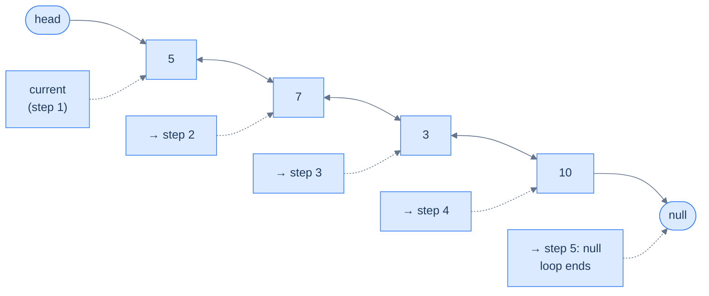
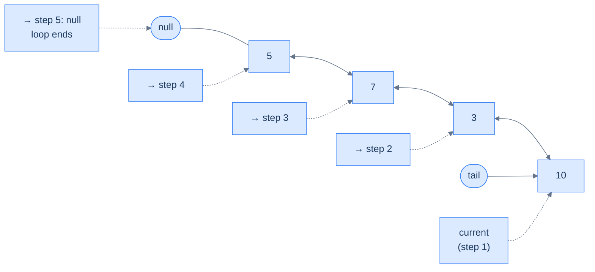
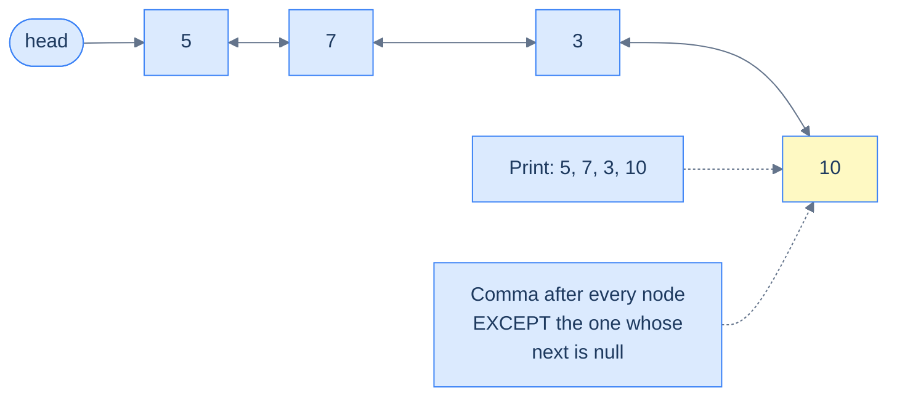
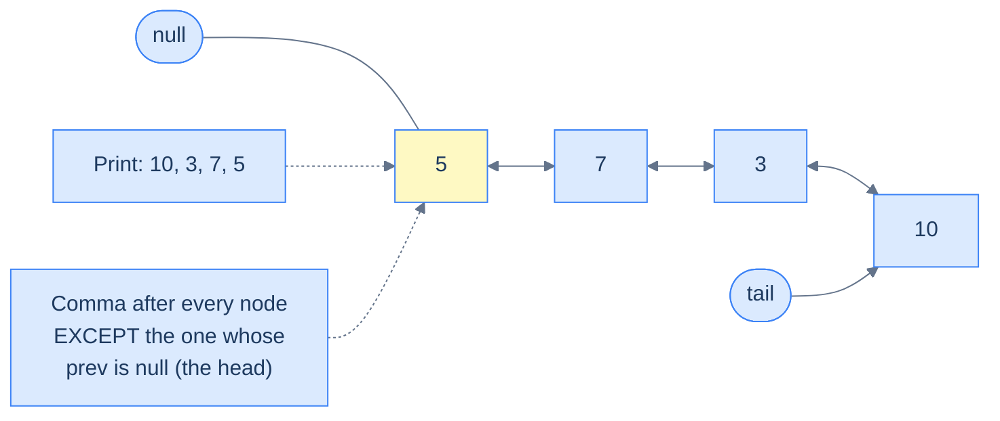
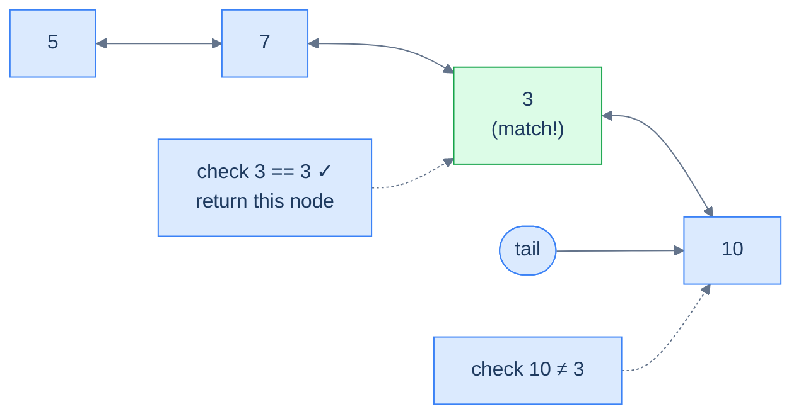

# 2. Traversal in Doubly Linked Lists

## The Hook

Picture a one-way street. Cars enter at one end, exit at the other, and any driver who needs the *previous* exit has to loop all the way around the block. That's a singly linked list — every traversal flows in exactly one direction. Now imagine a regular two-way street: same lane, same nodes, same destinations — but you can drive in either direction, and your start point dictates which direction makes sense.

This single change unlocks something subtle. With a doubly linked list, **the entry point you're given silently chooses your direction.** Hand you a `head`? You walk forward. Hand you a `tail`? You walk backward — and you don't lose any information; in fact, you gain a free reversal of the output for nothing more than starting from the other end. By the end of this lesson, you'll write a list-printer that *prints in reverse* without ever calling a reversal function — just by changing one pointer name.

---

## Table of contents

1. [Understanding traversal](#understanding-traversal)
2. [Node expedition](#node-expedition)
3. [Node expedition II](#node-expedition-ii)
4. [Node search](#node-search)

***

# Understanding traversal

Traversal is the most fundamental operation on a doubly linked list, and the basic mechanic is the same as in a singly linked list: hold a "cursor" variable, follow a pointer, repeat until the cursor lands on `null`. The extra information about the previous node that every node in a doubly linked list stores gives us a brand-new ability — the same loop, run on `prev` instead of `next`, walks the list in **reverse**. Two traversals for the price of one extra pointer per node.

## Forward Traversal

Forward traversal is moving from the **head** to the **tail** node in the doubly linked list. It is implemented exactly the way you remember from singly linked lists. We use a variable that holds a reference to a node in the linked list as the loop control variable, and every iteration we *advance* it by reading the `next` pointer of the current node — `current = current.next` — until it falls off the end and lands on `null`.



<p align="center"><strong>Forward traversal using the <code>next</code> pointer — start at <code>head</code>, follow <code>current.next</code> on each iteration, stop when <code>current</code> becomes <code>null</code>.</strong></p>

Given below is the code implementation of forward traversal in a doubly linked list, shown in two equivalent forms — a `for` loop that puts initialisation, condition, and advance on a single line, and a `while` loop that spreads them out for clarity.

<div class="lang-tabs">

```pseudocode
# Forward walk from the head.
current ← head
while current is not null:
    # ... process current.val ...
    current ← current.next                             # advance forward; null at tail
```

```python,editable
# Python idiom — `while` is the canonical form for pointer-walking
current = head            # Start at the head — the only entry point given
while current is not None:
    # ... do something with current.val ...
    current = current.next  # Advance to the successor; falls off to None at the tail
```

```java,editable
// for loop — initialiser + condition + step on one line
for (ListNode current = head; current != null; current = current.next) {
    // ... do something with current.val ...
}

// while loop — same logic, three statements
ListNode current = head;
while (current != null) {
    // ... do something with current.val ...
    current = current.next;
}
```

```c,editable
/* for loop */
for (ListNode *current = head; current != NULL; current = current->next) {
    /* ... do something with current->val ... */
}

/* while loop */
ListNode *current = head;
while (current != NULL) {
    /* ... do something with current->val ... */
    current = current->next;
}
```

```cpp,editable
// for loop
for (ListNode* current = head; current != nullptr; current = current->next) {
    // ... do something with current->val ...
}

// while loop
ListNode *current = head;
while (current != nullptr) {
    // ... do something with current->val ...
    current = current->next;
}
```

```scala,editable
// while loop is the cleanest equivalent in Scala
var current = head            // Start at the head
while (current != null) {
  // ... do something with current.v ...
  current = current.next      // Advance to the successor
}
```

```typescript,editable
// for loop
for (let current: ListNode | null = head; current !== null; current = current.next) {
    // ... do something with current.val ...
}

// while loop
let current: ListNode | null = head;
while (current !== null) {
    // ... do something with current.val ...
    current = current.next;
}
```

```go,editable
// for loop (Go's only loop construct)
for current := head; current != nil; current = current.Next {
    // ... do something with current.Val ...
}

// while-style for loop
current := head
for current != nil {
    // ... do something with current.Val ...
    current = current.Next
}
```

```rust,editable
// Rust pointer walks typically use `while let` to unwrap Option in one step
let mut current = head.as_ref();          // Option<&Box<ListNode>>
while let Some(node) = current {
    // ... do something with node.val ...
    current = node.next.as_ref();         // Advance to next; becomes None at tail
}
```

</div>

## Reverse Traversal

Unlike a singly linked list, we can also traverse a doubly linked list in the reverse direction — from the **tail** node back to the **head** — thanks to the `prev` pointer in every node that stores the reference to the previous node. The shape of the loop is *identical* to forward traversal; only two things change: we start at `tail` instead of `head`, and we advance via `current.prev` instead of `current.next`. The terminator is still `null` — but now it's the head's `prev`, not the tail's `next`, that ends the walk.



<p align="center"><strong>Reverse traversal using the <code>prev</code> pointer — start at <code>tail</code>, follow <code>current.prev</code> on each iteration, stop when <code>current</code> becomes <code>null</code> (i.e. when we walk past the head).</strong></p>

Given below is the code implementation of reverse traversal — note how it is the *mirror image* of the forward version, swapping `head ↔ tail` and `next ↔ prev`.

<div class="lang-tabs">

```pseudocode
# Backward walk from the tail — only possible because each node has a `prev` pointer.
current ← tail
while current is not null:
    # ... process current.val ...
    current ← current.prev                             # advance backward; null at head
```

```python,editable
# Reverse walk — start at tail, follow prev
current = tail
while current is not None:
    # ... do something with current.val ...
    current = current.prev   # Advance to the predecessor; falls off to None at the head
```

```java,editable
// for loop — note tail/prev instead of head/next
for (ListNode current = tail; current != null; current = current.prev) {
    // ... do something with current.val ...
}

// while loop
ListNode current = tail;
while (current != null) {
    // ... do something with current.val ...
    current = current.prev;
}
```

```c,editable
/* for loop */
for (ListNode *current = tail; current != NULL; current = current->prev) {
    /* ... do something with current->val ... */
}

/* while loop */
ListNode *current = tail;
while (current != NULL) {
    /* ... do something with current->val ... */
    current = current->prev;
}
```

```cpp,editable
// for loop
for (ListNode* current = tail; current != nullptr; current = current->prev) {
    // ... do something with current->val ...
}

// while loop
ListNode *current = tail;
while (current != nullptr) {
    // ... do something with current->val ...
    current = current->prev;
}
```

```scala,editable
var current = tail
while (current != null) {
  // ... do something with current.v ...
  current = current.prev   // Walk backwards via prev
}
```

```typescript,editable
// for loop
for (let current: ListNode | null = tail; current !== null; current = current.prev) {
    // ... do something with current.val ...
}

// while loop
let current: ListNode | null = tail;
while (current !== null) {
    // ... do something with current.val ...
    current = current.prev;
}
```

```go,editable
// for loop
for current := tail; current != nil; current = current.Prev {
    // ... do something with current.Val ...
}

// while-style
current := tail
for current != nil {
    // ... do something with current.Val ...
    current = current.Prev
}
```

```rust,editable
// Reverse walks in safe Rust typically require Rc<RefCell<...>> or unsafe
// pointers — see the design lesson at the end of this section. The
// pattern below shows the conceptual shape using a hypothetical `prev`.
//
// while let Some(node) = current {
//     // use node.val
//     current = node.prev.as_ref();
// }
```

</div>

> *Pause and predict — if you wrote the forward traversal once and the reverse traversal once, the only differences would be: ___ and ___.*
>
> The starting reference (`head` ↔ `tail`) and the advance pointer (`next` ↔ `prev`). Everything else — the loop shape, the null check, the body — is byte-for-byte identical. **This symmetry is the whole point of a doubly linked list.** Write your traversal once, parameterise the direction, and you've doubled your toolkit.

Later in this course, we will learn more about how to piggyback on this generic forward and reverse traversal logic to do various things as we traverse a doubly linked list — printing, searching, summing, splitting, merging, and (much later) implementing operations like LRU eviction that need *both* directions running simultaneously.

***

# Node expedition

## The Problem

> Given the **head** of a doubly linked list, write a function to print a comma-separated list of all the values from the start to the end.
>
> *In TypeScript and JavaScript, use `process.stdout.write` instead of `console.log`, since `console.log` automatically appends a newline character to the output, which may cause the judge to fail the submission.*

```
Input:  head = [5, 7, 3, 10]
Output: 5, 7, 3, 10
```

### What we are practising

Forward traversal with a small twist: a **separator** between values, and *no trailing separator* after the last value. The classic "print joined" pattern — every loop body needs a way to know whether it's looking at the last element so it can suppress the comma.



<p align="center"><strong>The "lookahead" trick — print the value first, then look at <code>current.next</code> to decide whether a comma follows. The tail node is the only one whose <code>next</code> is <code>null</code>, and it is the only one that does not get a trailing comma.</strong></p>

## The Solution

<div class="lang-tabs">

```pseudocode
function nodeExpedition(head):
    current ← head
    while current is not null:
        print current.val
        if current.next is not null:
            print ", "
        current ← current.next
```

```python,editable
class ListNode:
    def __init__(self, val=0, prev=None, next=None):
        self.val, self.prev, self.next = val, prev, next

class Solution:
    def node_expedition(self, head: ListNode) -> None:
        current = head                    # Start from the head — only entry given
        while current is not None:        # Stop when we step past the tail
            print(current.val, end="")    # Print value with no newline
            if current.next is not None:  # If there is a successor, this isn't the tail
                print(", ", end="")       #   → emit the separator
            current = current.next        # Advance forward
```

```java,editable
class Solution {
    public void nodeExpedition(ListNode head) {
        ListNode current = head;                    // Start at head
        while (current != null) {                   // Walk until past the tail
            System.out.print(current.val);          // Print value (no newline)
            if (current.next != null) {             // Not the tail?
                System.out.print(", ");             //   → emit separator
            }
            current = current.next;                 // Advance forward
        }
    }
}
```

```c,editable
void nodeExpedition(ListNode *head) {
    ListNode *current = head;             /* Start at head */
    while (current != NULL) {             /* Walk until past the tail */
        printf("%d", current->val);       /* Print value (no newline) */
        if (current->next != NULL) {      /* Not the tail? */
            printf(", ");                 /*   → emit separator */
        }
        current = current->next;          /* Advance forward */
    }
}
```

```cpp,editable
class Solution {
public:
    void nodeExpedition(ListNode *head) {
        ListNode *current = head;          // Start from the head of the linked list
        while (current != nullptr) {       // Iterate until the current node is null
            std::cout << current->val;     // Print the value of the current node
            if (current->next != nullptr) {// If there is a next node, this isn't the tail
                std::cout << ", ";         //   → print a comma after the value
            }
            current = current->next;       // Move to the next node
        }
    }
};
```

```scala,editable
class Solution {
  def nodeExpedition(head: ListNode): Unit = {
    var current = head                    // Start at head
    while (current != null) {             // Walk until past the tail
      print(current.v)                    // Print value (no newline)
      if (current.next != null) print(", ")  // Separator unless this is the tail
      current = current.next              // Advance forward
    }
  }
}
```

```typescript,editable
class Solution {
    nodeExpedition(head: ListNode | null): void {
        let current: ListNode | null = head;             // Start at head
        while (current !== null) {                       // Walk until past the tail
            process.stdout.write(String(current.val));   // Print without newline
            if (current.next !== null) {                 // Not the tail?
                process.stdout.write(", ");              //   → emit separator
            }
            current = current.next;                      // Advance forward
        }
    }
}
```

```go,editable
func nodeExpedition(head *ListNode) {
    current := head                       // Start at head
    for current != nil {                  // Walk until past the tail
        fmt.Print(current.Val)            // Print value (no newline)
        if current.Next != nil {          // Not the tail?
            fmt.Print(", ")               //   → emit separator
        }
        current = current.Next            // Advance forward
    }
}
```

```rust,editable
// Conceptual translation — production Rust DLLs typically use Rc<RefCell<...>>.
fn node_expedition(head: Option<&Box<ListNode>>) {
    let mut current = head;
    while let Some(node) = current {
        print!("{}", node.val);                       // Print value (no newline)
        if node.next.is_some() { print!(", "); }      // Separator unless this is the tail
        current = node.next.as_ref();                 // Advance forward
    }
}
```

</div>

<details>
<summary><strong>Trace — head = [5, 7, 3, 10]</strong></summary>

```
Step 1 │ current = node(5)  │ print "5",  next != null → print ", "   │ output: "5, "
Step 2 │ current = node(7)  │ print "7",  next != null → print ", "   │ output: "5, 7, "
Step 3 │ current = node(3)  │ print "3",  next != null → print ", "   │ output: "5, 7, 3, "
Step 4 │ current = node(10) │ print "10", next == null → no separator │ output: "5, 7, 3, 10"
Step 5 │ current = null     │ loop terminates
Result: "5, 7, 3, 10" ✓
```

The lookahead at `current.next` is what suppresses the trailing comma — the tail is the only node whose successor is `null`, so it's the only one that prints its value alone.

</details>

***

# Node expedition II

## The Problem

> Given the **tail** of a doubly linked list, write a function to print a comma-separated list of all the values from the tail to the head.
>
> *In TypeScript and JavaScript, use `process.stdout.write` instead of `console.log`, since `console.log` automatically appends a newline character to the output, which may cause the judge to fail the submission.*

```
Input:  tail = [5, 7, 3, 10]      # logical list, tail is node(10)
Output: 10, 3, 7, 5
```

### What we are practising

This is the *mirror image* of the previous problem. Same algorithm, same separator trick, same null-terminator — only the entry point and the advance direction flip. The lookahead this time is at `current.prev`, because the **head** is now the node we want to print without a trailing comma.



<p align="center"><strong>Reverse expedition — start at <code>tail</code>, advance via <code>prev</code>, suppress the trailing separator on the node whose <code>prev</code> is <code>null</code> (the head).</strong></p>

## The Solution

<div class="lang-tabs">

```pseudocode
# Same expedition, but starting at the tail and walking backward.
function nodeExpeditionII(tail):
    current ← tail
    while current is not null:
        print current.val
        if current.prev is not null:
            print ", "
        current ← current.prev
```

```python,editable
class Solution:
    def node_expedition_ii(self, tail: ListNode) -> None:
        current = tail                    # Start from the tail — entry point given
        while current is not None:        # Walk until we step past the head
            print(current.val, end="")    # Print value (no newline)
            if current.prev is not None:  # If there is a predecessor, this isn't the head
                print(", ", end="")       #   → emit separator
            current = current.prev        # Advance backward
```

```java,editable
class Solution {
    public void nodeExpeditionII(ListNode tail) {
        ListNode current = tail;                    // Start at tail
        while (current != null) {                   // Walk until past the head
            System.out.print(current.val);          // Print value (no newline)
            if (current.prev != null) {             // Not the head?
                System.out.print(", ");             //   → emit separator
            }
            current = current.prev;                 // Advance backward
        }
    }
}
```

```c,editable
void nodeExpeditionII(ListNode *tail) {
    ListNode *current = tail;             /* Start at tail */
    while (current != NULL) {             /* Walk until past the head */
        printf("%d", current->val);
        if (current->prev != NULL) {      /* Not the head? */
            printf(", ");                 /*   → emit separator */
        }
        current = current->prev;          /* Advance backward */
    }
}
```

```cpp,editable
class Solution {
public:
    void nodeExpeditionII(ListNode *tail) {
        ListNode *current = tail;            // Start from the tail
        while (current != nullptr) {         // Walk until past the head
            std::cout << current->val;       // Print the value
            if (current->prev != nullptr) {  // If a predecessor exists, this isn't the head
                std::cout << ", ";           //   → print separator
            }
            current = current->prev;         // Move to the previous node
        }
    }
};
```

```scala,editable
class Solution {
  def nodeExpeditionII(tail: ListNode): Unit = {
    var current = tail
    while (current != null) {
      print(current.v)
      if (current.prev != null) print(", ")
      current = current.prev      // Walk backwards
    }
  }
}
```

```typescript,editable
class Solution {
    nodeExpeditionII(tail: ListNode | null): void {
        let current: ListNode | null = tail;
        while (current !== null) {
            process.stdout.write(String(current.val));
            if (current.prev !== null) {
                process.stdout.write(", ");
            }
            current = current.prev;
        }
    }
}
```

```go,editable
func nodeExpeditionII(tail *ListNode) {
    current := tail                       // Start at tail
    for current != nil {                  // Walk until past the head
        fmt.Print(current.Val)
        if current.Prev != nil {          // Not the head?
            fmt.Print(", ")
        }
        current = current.Prev            // Advance backward
    }
}
```

```rust,editable
// Conceptual — see lesson 09 for a real Rc<RefCell<...>> implementation.
// fn node_expedition_ii(tail: ...) {
//     let mut current = tail;
//     while let Some(node) = current {
//         print!("{}", node.val);
//         if node.prev.is_some() { print!(", "); }
//         current = node.prev;
//     }
// }
```

</div>

<details>
<summary><strong>Trace — tail = node(10) of [5, 7, 3, 10]</strong></summary>

```
Step 1 │ current = node(10) │ print "10", prev != null → print ", "  │ output: "10, "
Step 2 │ current = node(3)  │ print "3",  prev != null → print ", "  │ output: "10, 3, "
Step 3 │ current = node(7)  │ print "7",  prev != null → print ", "  │ output: "10, 3, 7, "
Step 4 │ current = node(5)  │ print "5",  prev == null → no separator │ output: "10, 3, 7, 5"
Step 5 │ current = null     │ loop terminates
Result: "10, 3, 7, 5" ✓
```

We never called a reversal routine — just walked the chain from the *other* end. **Reverse output for free** is the doubly linked list's signature trick.

</details>

***

# Node search

## The Problem

> Given the **tail** of a doubly linked list and a **data** value, write a function to return the first node containing the given data, searching from the tail toward the head. If no such node is found, return `null`.

```
Input:  head = [5, 7, 3, 10], data = 3
Output: node containing 3

Input:  head = [5, 7, 6, 10], data = 3
Output: null
```

### What we are practising

A **linear search** that exploits the doubly linked list's reverse traversability. The mechanic is identical to "find first match" in any other linear container — walk, compare, return on first hit, return `null` if the walk finishes empty-handed.



<p align="center"><strong>Linear search from tail to head — return the first node whose value matches; if the loop falls off the head with no match, return <code>null</code>.</strong></p>

> *Why search from the tail when we could've gone from the head? In *this* problem the input is `tail`, so we have no choice — but the takeaway is more general. **Search direction is now a free parameter.** When you have a hint about *where* the target probably lives (recently added items live near the tail in an LRU; older items live near the head), you can pick the direction that statistically wins.*

## The Solution

<div class="lang-tabs">

```pseudocode
# Search backwards from the tail. First match wins.
function nodeSearch(tail, data):
    current ← tail
    while current is not null:
        if current.val = data: return current
        current ← current.prev
    return null
```

```python,editable
class Solution:
    def node_search(self, tail: ListNode, data: int) -> ListNode | None:
        current = tail                    # Start at tail (entry point given)
        while current is not None:        # Walk until past the head
            if current.val == data:       # First match wins
                return current
            current = current.prev        # Advance backward
        return None                       # Walked the whole list, no match
```

```java,editable
class Solution {
    public ListNode nodeSearch(ListNode tail, int data) {
        ListNode current = tail;
        while (current != null) {
            if (current.val == data) {       // Return the first matching node
                return current;
            }
            current = current.prev;          // Move backward
        }
        return null;                         // No match anywhere in the list
    }
}
```

```c,editable
ListNode* nodeSearch(ListNode *tail, int data) {
    ListNode *current = tail;
    while (current != NULL) {
        if (current->val == data) {
            return current;
        }
        current = current->prev;
    }
    return NULL;
}
```

```cpp,editable
class Solution {
public:
    ListNode *nodeSearch(ListNode *tail, int data) {
        ListNode *current = tail;          // Start at the tail (entry point given)
        while (current != nullptr) {       // Walk until we step past the head
            if (current->val == data) {    // First match wins
                return current;
            }
            current = current->prev;       // Move backward
        }
        return nullptr;                    // Loop finished — no node matched
    }
};
```

```scala,editable
class Solution {
  def nodeSearch(tail: ListNode, data: Int): ListNode = {
    var current = tail
    while (current != null) {
      if (current.v == data) return current   // First match wins
      current = current.prev
    }
    null                                       // No match
  }
}
```

```typescript,editable
class Solution {
    nodeSearch(tail: ListNode | null, data: number): ListNode | null {
        let current: ListNode | null = tail;
        while (current !== null) {
            if (current.val === data) {       // First match wins
                return current;
            }
            current = current.prev;
        }
        return null;
    }
}
```

```go,editable
func nodeSearch(tail *ListNode, data int) *ListNode {
    current := tail
    for current != nil {
        if current.Val == data {              // First match wins
            return current
        }
        current = current.Prev
    }
    return nil
}
```

```rust,editable
// Conceptual — true bidirectional Rust DLL is covered in lesson 09.
// fn node_search(tail: ..., data: i32) -> ... {
//     let mut current = tail;
//     while let Some(node) = current {
//         if node.val == data { return Some(node); }
//         current = node.prev;
//     }
//     None
// }
```

</div>

<details>
<summary><strong>Trace 1 — tail = node(10) of [5, 7, 3, 10], data = 3</strong></summary>

```
Step 1 │ current = node(10) │ 10 ≠ 3 → continue │ current = node(3)
Step 2 │ current = node(3)  │ 3 == 3 ✓          │ return node(3)
Result: node(3) ✓
```

</details>

<details>
<summary><strong>Trace 2 — tail = node(10) of [5, 7, 6, 10], data = 3</strong></summary>

```
Step 1 │ current = node(10) │ 10 ≠ 3 → continue │ current = node(6)
Step 2 │ current = node(6)  │ 6 ≠ 3 → continue  │ current = node(7)
Step 3 │ current = node(7)  │ 7 ≠ 3 → continue  │ current = node(5)
Step 4 │ current = node(5)  │ 5 ≠ 3 → continue  │ current = null
Step 5 │ current = null     │ loop terminates   │ return null
Result: null ✓
```

The "no-match" case is what makes the `null` return value non-negotiable — the function must distinguish *"I found nothing"* from *"I found the head"* (which is also a valid return). The terminator pointer carries that information for free.

</details>

---

## Complexity Analysis

| Operation | Time | Space | Why |
|---|---|---|---|
| Forward / reverse traversal | **O(n)** | **O(1)** | Each node is visited at most once; only a single cursor variable is held. |
| Node expedition (print) | **O(n)** | **O(1)** | One print per node, no auxiliary data structure. |
| Node search (linear) | **O(n)** worst, O(1) best | **O(1)** | Best case the target is the entry node; worst case it's at the far end or absent. |

> *The space term is the headline — every doubly linked list traversal is **O(1) extra space**. We don't allocate a stack, a queue, or a copy. We mutate one pointer in place. This becomes load-bearing later when we attack problems with hard memory budgets — like reversing a list with a million nodes on a constrained system.*

## Final Takeaway

A doubly linked list traversal is a *parameterised* singly linked list traversal — same loop, configurable direction. Pick `head + next` to walk forward, `tail + prev` to walk backward, and the same algorithm works for both. This symmetry is what makes the data structure punch above its weight: **every "do this thing forward" operation comes with a free "do it backward" twin** as long as you remember to pass the other endpoint.

> **Transfer challenge:** Given the head of a doubly linked list of integers, return the *sum of values whose index from the right is even* (i.e. the tail is index 0, the node before it is index 1, and so on) — without using extra arrays. Hint: you only need one pointer and one counter.
>
> <details>
> <summary>Solution sketch</summary>
>
> Find the tail in O(n) (walk forward once), then walk backward via `prev`, incrementing an index counter and adding `current.val` to the sum whenever the index is even. Two passes, O(1) space — no array, no stack. The reverse traversal is what makes "index from the right" cheap.
>
> </details>

In the next lesson we leave traversal behind and start *modifying* the list. Insertion is where the doubly linked list's second pointer earns its keep — we'll see operations the singly linked list literally cannot match in time complexity.
