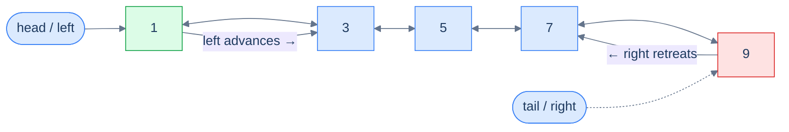
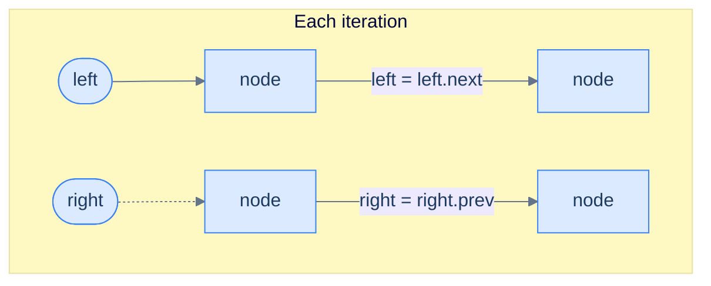
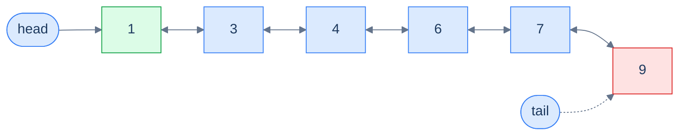
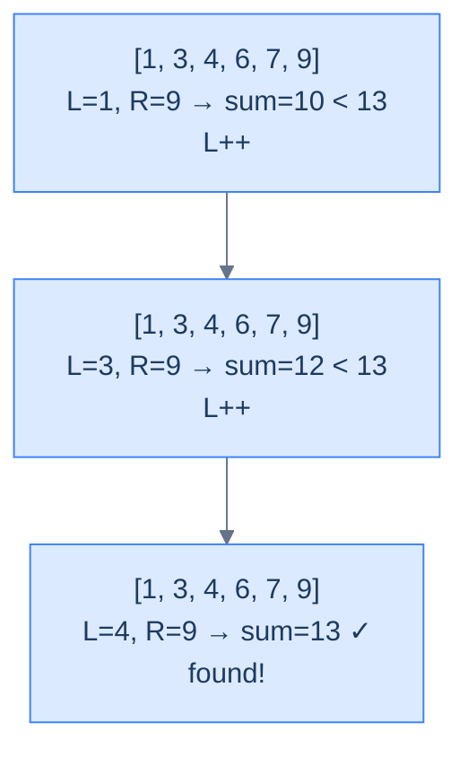
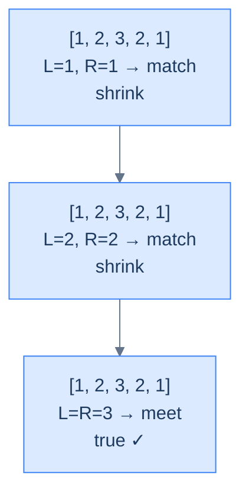
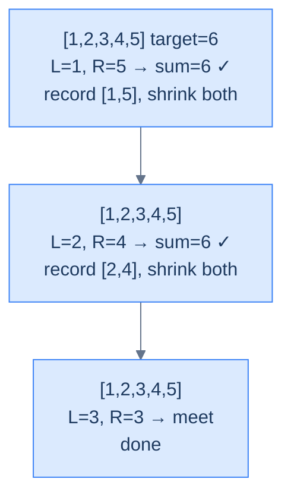
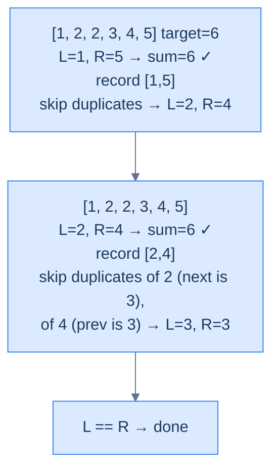
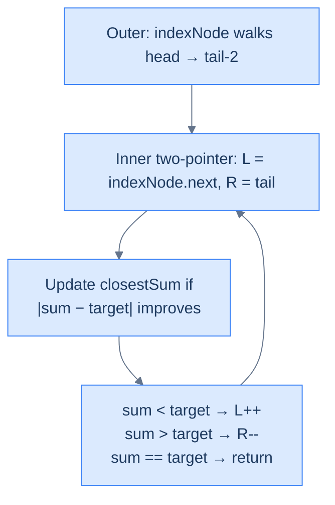

# 7. Pattern: Two Pointers

## The Hook

In a singly linked list, "scan from both ends" is a fantasy. The list refuses to tell you who lives behind any given address — one pointer can only crawl forward, and the only way to "come from the right" is to walk all the way there first. So sorted-array tricks like "shrink from both sides until they meet" simply don't translate.

A doubly linked list breaks that ceiling. Every node knows its predecessor, so you can plant `left = head` and `right = tail` and march them toward each other in lockstep — exactly the way you would on a sorted array. Suddenly the entire two-pointer playbook from arrays — Two Sum, palindrome check, 3Sum-Closest — becomes available on a *linked* structure, in linear time and constant space. That's the surprise: a structure most people think of as "fancy linked list" turns out to be the bridge that lets you reuse array-style two-pointer reasoning on a non-contiguous, dynamically-sized data structure.

By the end of this lesson, you'll know exactly when to reach for two pointers on a DLL — and exactly which pointer to move next, and why.

---

## Table of contents

1. [Understanding the Two-Pointer Pattern](#understanding-the-two-pointer-pattern)
2. [Identifying the Two-Pointer Pattern](#identifying-the-two-pointer-pattern)
3. [Palindrome Number](#palindrome-number)
4. [Two Sum](#two-sum)
5. [Duplicate-Aware Two Sum](#duplicate-aware-two-sum)
6. [Approximate Three Sum](#approximate-three-sum)

---

# Understanding the Two-Pointer Pattern

## The World — Two Walkers, One Hallway

Picture a long hallway with numbered doors lined up in increasing order. One person stands at the first door, another at the last. They walk toward each other, comparing the numbers on their doors at every step. If the **sum** of the two numbers is too small, the left walker advances; if it's too large, the right walker steps back. Eventually they shake hands in the middle — and somewhere along the way, they've inspected every *useful* combination of doors without ever doubling back.

That's the two-pointer technique. On a doubly linked list, the hallway is the list itself, the walkers are `left` and `right` pointers, and "stepping" is just `left = left.next` or `right = right.prev`.



<p align="center"><strong>Two-pointer traversal on a DLL — <code>left</code> walks forward via <code>next</code>, <code>right</code> walks backward via <code>prev</code>. They converge from both ends until they meet (or cross) in the middle.</strong></p>

## Why a Singly Linked List Can't Do This

To perform any operation on the data items in a **singly** linked list, we must traverse from `head` to `tail` and find those items in one direction only. A doubly linked list, however, can be traversed in *two* directions — head-to-tail or tail-to-head — and depending on the problem, we may choose one direction over the other.

Some problems, though, require us to traverse the linked list in *both* directions **simultaneously**. With a singly linked list this is impossible without first reversing or copying the list (extra space, extra time). With a DLL it's free — every node already stores `prev`, so the `right` walker has somewhere to go.

> **The key claim:** the two-pointer technique allows us to solve certain problems in **linear time, single-pass, O(1) space** — problems that would otherwise force nested loops or auxiliary data structures.

The two-pointer pattern is the family of problems solvable using this two-pointer traversal technique.

## The Two-Pointer Technique

The technique uses two references, `left` and `right`, initialised at `head` and `tail` respectively. We traverse in both directions by following `next` from `left` and `prev` from `right`, until they meet in the middle or `left` crosses past `right`. At each iteration we inspect the nodes held by `left` and `right`, do whatever the problem demands, and decide which pointer to advance — possibly both, possibly only one — to close the gap.



<p align="center"><strong>Each iteration: act on <code>left</code> and <code>right</code>, then move one or both inward by one step.</strong></p>

## The Generic Algorithm

> -   **Step 1:** Initialise `left = head` and `right = tail`.
> -   **Step 2:** Loop while `left != right` **and** `left.prev != right` (the second guard catches the moment they cross — see the friction prompt below):
>     -   **Step 2.1:** Perform the operation on the nodes held by `left` and `right` as the problem dictates.
>     -   **Step 2.2:** Decide whether `left` should advance — if yes, set `left = left.next` (possibly more than once).
>     -   **Step 2.3:** Decide whether `right` should retreat — if yes, set `right = right.prev` (possibly more than once).

> *Friction prompt — before reading on:* why do we need **both** termination guards? What goes wrong with only `left != right`? Predict before scrolling.
>
> Answer: with an even-length list, `left` and `right` never land on the *same* node — they swap past each other. After one final inward step, `left.prev == right` (they crossed). Without the second guard, the loop would run one iteration too many on already-processed nodes, comparing them backwards. The pair `(left != right) && (left.prev != right)` covers both odd-length (meet) and even-length (cross) lists.

## Generic Implementation

The skeleton below is the template every problem in this lesson specialises. Read it once, then watch how each problem changes only the *condition* and the *what to do at each step*.

<div class="lang-tabs">

```python,editable
"""
Definition for doubly-linked list.
class ListNode:
    def __init__(self, val):
        self.val = val
        self.prev = None
        self.next = None
"""
from typing import Optional

def two_pointer(head: Optional["ListNode"], tail: Optional["ListNode"]) -> None:
    # Trivial cases — empty, single node, or two adjacent nodes need no convergence
    if not head or not tail or head == tail or head.next == tail:
        return

    left, right = head, tail                           # Plant walkers at both ends
    while left != right and left.prev != right:        # Stop when they meet OR cross
        # --- Problem-specific work on (left, right) goes here ---

        if should_move_left:                           # Decision driven by the problem
            left = left.next                           # Advance from the head side
        if should_move_right:                          # Independent of the left decision
            right = right.prev                         # Retreat from the tail side
    return
```

```java,editable
/**
 * Definition for doubly-linked list.
 * class ListNode { int val; ListNode prev, next; ... }
 */
class Solution {
    public void twoPointer(ListNode head, ListNode tail) {
        // Trivial cases — empty, single, or two adjacent nodes need no work
        if (head == null || tail == null || head == tail || head.next == tail) return;

        ListNode left = head, right = tail;            // Plant walkers at both ends
        while (left != right && left.prev != right) {  // Stop when they meet OR cross
            // --- Problem-specific work on (left, right) ---

            if (shouldMoveLeft)  left = left.next;     // Advance from head side
            if (shouldMoveRight) right = right.prev;   // Retreat from tail side
        }
    }
}
```

```c,editable
/* Definition: typedef struct ListNode { int val; struct ListNode *prev, *next; } ListNode; */
void twoPointer(ListNode *head, ListNode *tail) {
    /* Trivial cases — nothing to converge */
    if (!head || !tail || head == tail || head->next == tail) return;

    ListNode *left = head, *right = tail;
    while (left != right && left->prev != right) {     /* Meet OR cross */
        /* --- Problem-specific work on (left, right) --- */

        if (shouldMoveLeft)  left  = left->next;       /* Advance head side */
        if (shouldMoveRight) right = right->prev;      /* Retreat tail side */
    }
}
```

```cpp,editable
/**
 * struct ListNode { int val; ListNode *prev, *next; ... };
 */
class Solution {
public:
    void twoPointer(ListNode *head, ListNode *tail) {
        // Trivial cases — empty, single, or adjacent
        if (!head || !tail || head == tail || head->next == tail) return;

        ListNode *left = head, *right = tail;
        while (left != right && left->prev != right) {  // Meet OR cross
            // --- Problem-specific work on (left, right) ---

            if (shouldMoveLeft)  left  = left->next;
            if (shouldMoveRight) right = right->prev;
        }
    }
};
```

```scala,editable
class Solution {
  def twoPointer(head: ListNode, tail: ListNode): Unit = {
    // Trivial cases — nothing to converge
    if (head == null || tail == null || head == tail || head.next == tail) return

    var left  = head
    var right = tail
    while (left != right && left.prev != right) {       // Meet OR cross
      // --- Problem-specific work on (left, right) ---

      if (shouldMoveLeft)  left  = left.next
      if (shouldMoveRight) right = right.prev
    }
  }
}
```

```javascript,editable
function twoPointer(head, tail) {
    // Trivial cases — empty, single, or adjacent
    if (!head || !tail || head === tail || head.next === tail) return;

    let left = head, right = tail;
    while (left !== right && left.prev !== right) {     // Meet OR cross
        // --- Problem-specific work on (left, right) ---

        if (shouldMoveLeft)  left  = left.next;
        if (shouldMoveRight) right = right.prev;
    }
}
```

```typescript,editable
function twoPointer(head: ListNode | null, tail: ListNode | null): void {
    // Trivial cases — empty, single, or adjacent
    if (!head || !tail || head === tail || head.next === tail) return;

    let left:  ListNode | null = head;
    let right: ListNode | null = tail;
    while (left !== right && left!.prev !== right) {    // Meet OR cross
        // --- Problem-specific work on (left, right) ---

        if (shouldMoveLeft)  left  = left!.next;
        if (shouldMoveRight) right = right!.prev;
    }
}
```

```go,editable
func twoPointer(head, tail *ListNode) {
    // Trivial cases — nothing to converge
    if head == nil || tail == nil || head == tail || head.Next == tail { return }

    left, right := head, tail
    for left != right && left.Prev != right {            // Meet OR cross
        // --- Problem-specific work on (left, right) ---

        if shouldMoveLeft  { left  = left.Next }
        if shouldMoveRight { right = right.Prev }
    }
}
```

```kotlin,editable
class Solution {
    fun twoPointer(head: ListNode?, tail: ListNode?) {
        // Trivial cases — empty, single, or adjacent
        if (head == null || tail == null || head == tail || head.next == tail) return

        var left  = head
        var right = tail
        while (left != right && left?.prev != right) {   // Meet OR cross
            // --- Problem-specific work on (left, right) ---

            if (shouldMoveLeft)  left  = left?.next
            if (shouldMoveRight) right = right?.prev
        }
    }
}
```

```rust,editable
// See lesson 09 for a complete Rc<RefCell<...>> implementation.
// fn two_pointer(head: Link, tail: Link) {
//     if head.is_none() || tail.is_none() || head == tail { return; }
//     let mut left  = head;
//     let mut right = tail;
//     while left != right && left.prev() != right {
//         // problem-specific work on (left, right)
//         if should_move_left  { left  = left.next();  }
//         if should_move_right { right = right.prev(); }
//     }
// }
```

</div>

## Complexity Analysis

Both pointers traverse the list once, from opposite ends, and meet in the middle — collectively visiting each node at most once. That's logically equivalent to one full sweep.

| Measure | Value | Why |
|---|---|---|
| Time  | **O(N)** | `left` and `right` together cover every node exactly once before crossing. |
| Space | **O(1)** | Two pointers, no auxiliary structure. |

> **Best Case**: Time **O(N)**, Space **O(1)**
>
> **Worst Case**: Time **O(N)**, Space **O(1)**

We unlocked a structural superpower — but where exactly is it the *right* tool? That's the next question.

---

# Identifying the Two-Pointer Pattern

Almost every two-pointer **array** problem can be reformulated as a doubly linked list problem and solved the same way. These tend to be **medium** or **hard** on a DLL because pointer plumbing and null-checks are more delicate than array indexing — but the underlying logic is identical.

If a problem statement (or its naive solution) fits the template below, it's a two-pointer problem:

> **Template:** Given a doubly linked list, perform an operation on two nodes `left` and `right` where `left` starts at `x` and `right` starts at `y` with `x` to the left of `y`, and on each iteration `left` and `right` move strictly closer to each other.

## Worked Example — Spotting It in the Wild

> **Problem:** Given the `head` and `tail` of a doubly linked list of integers sorted non-decreasing, and an integer `target`, return `true` if any two nodes have values summing to `target`.

Take the list below with `target = 13` — two nodes obviously satisfy the requirement.



<p align="center"><strong>Find a pair summing to 13 — sorted order plus DLL bidirectionality is the exact recipe two-pointers eats for breakfast.</strong></p>

### The Two-Pointer Solution

The classic Two-Sum array solution sorts the array, then uses two pointers (the proof of correctness was covered in the array two-pointer chapter). Here, the values are *already* sorted — so we can apply the same logic directly:

- Plant `left = head`, `right = tail`.
- Compute `sum = left.val + right.val`.
- If `sum < target`, `left.val` is paired against the *largest* possible partner and still falls short — that means `left.val` can never participate in a valid pair, **so advance `left`** (drop it).
- If `sum > target`, `right.val` is paired against the *smallest* possible partner and still overshoots — `right.val` can never participate, **so retreat `right`**.
- If `sum == target`, record the pair and shrink both inward.

This fits the template exactly.



<p align="center"><strong>Finding a pair with sum 13 — each iteration shrinks the search range by discarding a value that provably cannot participate.</strong></p>

The reference C++ implementation (we'll see all 10 languages in the dedicated Two Sum section below):

```cpp
class Solution {
public:
    vector<vector<int>> twoSum(ListNode *head, ListNode *tail, int target) {
        if (!head || !head->next) return {};
        vector<vector<int>> result;
        ListNode *left = head, *right = tail;
        while (left && right && left->val < right->val) {
            int sum = left->val + right->val;
            if (sum == target) {
                result.push_back({left->val, right->val});
                left = left->next; right = right->prev;
            } else if (sum < target) {
                left = left->next;
            } else {
                right = right->prev;
            }
        }
        return result;
    }
};
```

Single pass, no extra space — exactly the speedup the pattern promises.

## The Problem Roster

We'll now cement the technique with four concrete problems of growing difficulty:

> -   **Palindrome Number** — pure mirror check
> -   **Two Sum** — the canonical sorted-pair search
> -   **Duplicate-Aware Two Sum** — same idea, but skip-duplicate plumbing
> -   **Approximate Three Sum** — fix one node, two-pointer the rest

---

# Palindrome Number

## The Problem

Given the **head** and **tail** of a sorted (well — *symmetric*) doubly linked list, return `true` if the list reads the same forwards and backwards, `false` otherwise. A palindrome number reads identically left-to-right and right-to-left.

```
Input:  head = [1, 2, 3, 2, 1]
Output: true

Input:  head = [6, 6, 6]
Output: true

Input:  head = [1, 2, 3, 4, 5]
Output: false
```

## The Mirror Strategy (Visualised)

Plant `left` at the start, `right` at the end. At each step, compare the two values; if they ever differ, return `false`. Otherwise step inward and keep going until the pointers meet (odd length) or cross (even length).



<p align="center"><strong>Palindrome check — mirror comparison from both ends until pointers meet or cross.</strong></p>

## The Solution

<div class="lang-tabs">

```python,editable
class Solution:
    def palindrome_number(self, head, tail):
        # Empty list or single node trivially mirrors itself
        if not head or head == tail:
            return True

        left, right = head, tail
        # Loop guards: stop when they meet (odd length) OR cross (even length)
        while left and right and left != right and left.prev != right:
            if left.val != right.val:        # Any mismatch breaks symmetry — done
                return False
            left  = left.next                # Step inward from the head side
            right = right.prev               # Step inward from the tail side
        return True                          # Every mirrored pair matched
```

```java,editable
class Solution {
    public boolean palindromeNumber(ListNode head, ListNode tail) {
        if (head == null || head == tail) return true;       // Empty / single = palindrome
        ListNode left = head, right = tail;
        while (left != null && right != null && left != right && left.prev != right) {
            if (left.val != right.val) return false;         // Mismatch — not a palindrome
            left  = left.next;                               // Shrink from head side
            right = right.prev;                              // Shrink from tail side
        }
        return true;
    }
}
```

```c,editable
bool palindromeNumber(ListNode *head, ListNode *tail) {
    if (!head || head == tail) return true;                  /* Empty / single */
    ListNode *left = head, *right = tail;
    while (left && right && left != right && left->prev != right) {
        if (left->val != right->val) return false;           /* Mismatch */
        left  = left->next;
        right = right->prev;
    }
    return true;
}
```

```cpp,editable
class Solution {
public:
    bool palindromeNumber(ListNode *head, ListNode *tail) {
        if (!head || head == tail) return true;              // Empty / single
        ListNode *left = head, *right = tail;
        while (left && right && left != right && left->prev != right) {
            if (left->val != right->val) return false;       // Mismatch
            left  = left->next;
            right = right->prev;
        }
        return true;
    }
};
```

```scala,editable
class Solution {
  def palindromeNumber(head: ListNode, tail: ListNode): Boolean = {
    if (head == null || head == tail) return true
    var left  = head
    var right = tail
    while (left != null && right != null && left != right && left.prev != right) {
      if (left.value != right.value) return false
      left  = left.next
      right = right.prev
    }
    true
  }
}
```

```javascript,editable
class Solution {
    palindromeNumber(head, tail) {
        if (!head || head === tail) return true;
        let left = head, right = tail;
        while (left && right && left !== right && left.prev !== right) {
            if (left.val !== right.val) return false;
            left  = left.next;
            right = right.prev;
        }
        return true;
    }
}
```

```typescript,editable
class Solution {
    palindromeNumber(head: ListNode | null, tail: ListNode | null): boolean {
        if (!head || head === tail) return true;
        let left:  ListNode | null = head;
        let right: ListNode | null = tail;
        while (left && right && left !== right && left.prev !== right) {
            if (left.val !== right.val) return false;
            left  = left.next;
            right = right.prev;
        }
        return true;
    }
}
```

```go,editable
func palindromeNumber(head, tail *ListNode) bool {
    if head == nil || head == tail { return true }
    left, right := head, tail
    for left != nil && right != nil && left != right && left.Prev != right {
        if left.Val != right.Val { return false }
        left  = left.Next
        right = right.Prev
    }
    return true
}
```

```kotlin,editable
class Solution {
    fun palindromeNumber(head: ListNode?, tail: ListNode?): Boolean {
        if (head == null || head == tail) return true
        var left  = head
        var right = tail
        while (left != null && right != null && left != right && left.prev != right) {
            if (left.value != right.value) return false
            left  = left.next
            right = right.prev
        }
        return true
    }
}
```

```rust,editable
// See lesson 09 for a complete Rc<RefCell<...>> implementation.
// fn palindrome_number(head: Link, tail: Link) -> bool {
//     if head.is_none() || head == tail { return true; }
//     let (mut l, mut r) = (head, tail);
//     while l.is_some() && r.is_some() && l != r && l.prev() != r {
//         if l.val() != r.val() { return false; }
//         l = l.next(); r = r.prev();
//     }
//     true
// }
```

</div>

<details>
<summary><strong>Trace — head = [1, 2, 3, 2, 1]</strong></summary>

```
list = [1, 2, 3, 2, 1]

Step 1 │ L=node(1), R=node(1)         │ vals match (1 == 1) │ L→2, R→2
Step 2 │ L=node(2), R=node(2)         │ vals match (2 == 2) │ L→3, R→3
Done   │ L == R (both at node(3))     │ loop exits           │ return true
Result: true ✓ (every mirrored pair matched and pointers met in the middle)
```

</details>

<details>
<summary><strong>Trace — head = [1, 2, 3, 4, 5]</strong></summary>

```
list = [1, 2, 3, 4, 5]

Step 1 │ L=node(1), R=node(5)         │ 1 != 5 → mismatch    │ return false
Result: false ✓ (mismatch detected on the very first iteration)
```

</details>

## Complexity Analysis

| Measure | Value | Reason |
|---|---|---|
| Time  | **O(N)** | Each pointer covers half the list; together they touch every node at most once. |
| Space | **O(1)** | Two pointers — no copy, no reverse. |

## Edge Cases

| Case | Example | Expected | Reasoning |
|---|---|---|---|
| Empty list | `head = null` | `true` | Vacuously palindromic. |
| Single node | `[7]` | `true` | A length-1 sequence equals its reverse. |
| Even length match | `[1, 2, 2, 1]` | `true` | Pointers cross (`left.prev == right`) without ever colliding. |
| Even length mismatch | `[1, 2, 3, 1]` | `false` | Inner pair `(2, 3)` fails — return early. |

We've used both pointers symmetrically. Up next: a problem where the *decision* of which pointer to move depends on a computed value.

---

# Two Sum

## The Problem

Given the **head** and **tail** of a doubly linked list sorted in non-decreasing order and an integer **target**, return *all* unique pairs that sum to the target. Do it without extra space. Inputs contain no duplicates.

```
Input:  head = [1, 2, 3, 4, 5], target = 6
Output: [[1, 5], [2, 4]]

Input:  head = [1, 2, 3, 4, 5], target = 10
Output: []

Input:  head = [1, 2, 3, 4, 5], target = 9
Output: [[4, 5]]
```

## What Does "Decisive Direction" Mean?

The whole reason two-pointers works on a sorted DLL is that **every move has a guaranteed effect on the running sum**:

- `left.val` is the *minimum* of the unexplored region.
- `right.val` is the *maximum* of the unexplored region.
- Advancing `left` (toward the tail) → sum can only **increase**.
- Retreating `right` (toward the head) → sum can only **decrease**.

So if `sum < target`, the only hope is to grow the sum, and the only way to grow it is `left++`. If `sum > target`, mirror: `right--`. No guesswork.

> *Friction prompt — predict before reading on:* if `sum < target`, why can we *throw away* `left.val` entirely (move past it forever) instead of pairing it with smaller `right` values?
>
> Answer: because `right.val` is the *largest* remaining value. If `left.val + (largest)` is already too small, no smaller partner could ever lift the sum to the target. `left.val` is provably useless — discard it.

## The Converging Walkers Strategy (Visualised)



<p align="center"><strong>Two Sum on a sorted DLL — pointers converge, sum drives every decision, no node is ever revisited.</strong></p>

## The Solution

<div class="lang-tabs">

```python,editable
from typing import Optional, List

class Solution:
    def two_sum(self, head: Optional["ListNode"], tail: Optional["ListNode"], target: int) -> List[List[int]]:
        # Empty or single-node list cannot form a pair
        if head is None or head.next is None:
            return []

        result: List[List[int]] = []
        left, right = head, tail
        # left.val < right.val is the convergence guard:
        # once the values cross we've examined every distinct pair
        while left and right and left.val < right.val:
            s = left.val + right.val
            if s == target:
                result.append([left.val, right.val])  # Record this pair
                left  = left.next                     # Both move — they can't pair again
                right = right.prev
            elif s < target:
                left  = left.next                     # Need bigger sum → grow left
            else:
                right = right.prev                    # Need smaller sum → shrink right
        return result
```

```java,editable
import java.util.*;
class Solution {
    public List<List<Integer>> twoSum(ListNode head, ListNode tail, int target) {
        if (head == null || head.next == null) return new ArrayList<>();
        List<List<Integer>> result = new ArrayList<>();
        ListNode left = head, right = tail;
        while (left != null && right != null && left.val < right.val) {
            int sum = left.val + right.val;
            if (sum == target) {
                result.add(Arrays.asList(left.val, right.val));
                left  = left.next;
                right = right.prev;
            } else if (sum < target) {
                left  = left.next;                    // Sum too small — grow it
            } else {
                right = right.prev;                   // Sum too large — shrink it
            }
        }
        return result;
    }
}
```

```c,editable
/* Returns count of pairs via *outCount; caller frees pairs[i] and pairs */
int** twoSum(ListNode *head, ListNode *tail, int target, int *outCount) {
    *outCount = 0;
    if (!head || !head->next) return NULL;
    int cap = 8;
    int **pairs = malloc(sizeof(int*) * cap);
    ListNode *left = head, *right = tail;
    while (left && right && left->val < right->val) {
        int sum = left->val + right->val;
        if (sum == target) {
            if (*outCount == cap) { cap *= 2; pairs = realloc(pairs, sizeof(int*) * cap); }
            pairs[*outCount] = malloc(sizeof(int) * 2);
            pairs[*outCount][0] = left->val;
            pairs[*outCount][1] = right->val;
            (*outCount)++;
            left  = left->next;
            right = right->prev;
        } else if (sum < target) {
            left  = left->next;
        } else {
            right = right->prev;
        }
    }
    return pairs;
}
```

```cpp,editable
class Solution {
public:
    vector<vector<int>> twoSum(ListNode *head, ListNode *tail, int target) {
        if (!head || !head->next) return {};                   // No pair possible
        vector<vector<int>> result;
        ListNode *left = head, *right = tail;
        while (left && right && left->val < right->val) {
            int sum = left->val + right->val;
            if (sum == target) {
                result.push_back({left->val, right->val});     // Record pair
                left  = left->next;                            // Both shrink
                right = right->prev;
            } else if (sum < target) {
                left  = left->next;                            // Grow sum
            } else {
                right = right->prev;                           // Shrink sum
            }
        }
        return result;
    }
};
```

```scala,editable
class Solution {
  def twoSum(head: ListNode, tail: ListNode, target: Int): List[List[Int]] = {
    if (head == null || head.next == null) return Nil
    val buf = scala.collection.mutable.ListBuffer.empty[List[Int]]
    var left  = head
    var right = tail
    while (left != null && right != null && left.value < right.value) {
      val sum = left.value + right.value
      if (sum == target) {
        buf += List(left.value, right.value)
        left  = left.next
        right = right.prev
      } else if (sum < target) {
        left  = left.next
      } else {
        right = right.prev
      }
    }
    buf.toList
  }
}
```

```javascript,editable
class Solution {
    twoSum(head, tail, target) {
        if (!head || !head.next) return [];
        const result = [];
        let left = head, right = tail;
        while (left && right && left.val < right.val) {
            const sum = left.val + right.val;
            if (sum === target) {
                result.push([left.val, right.val]);
                left  = left.next;
                right = right.prev;
            } else if (sum < target) {
                left  = left.next;
            } else {
                right = right.prev;
            }
        }
        return result;
    }
}
```

```typescript,editable
class Solution {
    twoSum(head: ListNode | null, tail: ListNode | null, target: number): number[][] {
        if (!head || !head.next) return [];
        const result: number[][] = [];
        let left:  ListNode | null = head;
        let right: ListNode | null = tail;
        while (left && right && left.val < right.val) {
            const sum = left.val + right.val;
            if (sum === target) {
                result.push([left.val, right.val]);
                left  = left.next;
                right = right.prev;
            } else if (sum < target) {
                left  = left.next;
            } else {
                right = right.prev;
            }
        }
        return result;
    }
}
```

```go,editable
func twoSum(head, tail *ListNode, target int) [][]int {
    if head == nil || head.Next == nil { return [][]int{} }
    result := [][]int{}
    left, right := head, tail
    for left != nil && right != nil && left.Val < right.Val {
        sum := left.Val + right.Val
        switch {
        case sum == target:
            result = append(result, []int{left.Val, right.Val})
            left  = left.Next
            right = right.Prev
        case sum < target:
            left  = left.Next
        default:
            right = right.Prev
        }
    }
    return result
}
```

```kotlin,editable
class Solution {
    fun twoSum(head: ListNode?, tail: ListNode?, target: Int): List<List<Int>> {
        if (head == null || head.next == null) return emptyList()
        val result = mutableListOf<List<Int>>()
        var left  = head
        var right = tail
        while (left != null && right != null && left.value < right.value) {
            val sum = left.value + right.value
            when {
                sum == target -> {
                    result.add(listOf(left.value, right.value))
                    left  = left.next
                    right = right.prev
                }
                sum < target  -> left  = left.next
                else          -> right = right.prev
            }
        }
        return result
    }
}
```

```rust,editable
// See lesson 09 for a complete Rc<RefCell<...>> implementation.
// fn two_sum(head: Link, tail: Link, target: i32) -> Vec<[i32; 2]> {
//     let mut result = Vec::new();
//     let (mut l, mut r) = (head, tail);
//     while l.is_some() && r.is_some() && l.val() < r.val() {
//         let sum = l.val() + r.val();
//         if sum == target { result.push([l.val(), r.val()]); l = l.next(); r = r.prev(); }
//         else if sum < target { l = l.next(); }
//         else { r = r.prev(); }
//     }
//     result
// }
```

</div>

<details>
<summary><strong>Trace — head = [1, 2, 3, 4, 5], target = 6</strong></summary>

```
list = [1, 2, 3, 4, 5], target = 6, result = []

Step 1 │ L=1, R=5 │ sum=6 == 6 │ record [1,5] → result=[[1,5]] │ L→2, R→4
Step 2 │ L=2, R=4 │ sum=6 == 6 │ record [2,4] → result=[[1,5],[2,4]] │ L→3, R→3
Done   │ L.val < R.val false (3 == 3) │ exit
Result: [[1, 5], [2, 4]] ✓
```

</details>

## Complexity Analysis

| Measure | Value | Reason |
|---|---|---|
| Time  | **O(N)** | Single converging pass — each node visited at most once. |
| Space | **O(1)** auxiliary | Output list excluded; only two pointers and a sum scalar. |

## Edge Cases

| Case | Example | Expected | Reasoning |
|---|---|---|---|
| Empty / single node | `head = []` or `[7]` | `[]` | Cannot form a pair. |
| No valid pair | `[1,2,3,4,5], target=10` | `[]` | Loop exits with `left.val == right.val`. |
| All values smaller than target | `[1,2,3], target=100` | `[]` | `sum < target` always — `left` walks off the end. |

The sorted, no-duplicate Two Sum is clean. But what if the list contains repeats? That's where the same algorithm sprouts an awkward little subroutine.

---

# Duplicate-Aware Two Sum

## The Problem

Given the **head** and **tail** of a doubly linked list sorted non-decreasing, and an integer **target**, return all unique pairs summing to `target`. The list **may contain duplicates**, but the result must not contain duplicate pairs (in any order).

```
Input:  head = [1, 2, 2, 3, 4, 5], target = 6
Output: [[1, 5], [2, 4]]
Explanation: 1+5=6 and 2+4=6. The duplicate 2 is not paired again.

Input:  head = [1, 2, 2, 2, 2], target = 3
Output: [[1, 2]]
Explanation: 1+2=3 — but only one such pair, despite four 2s.

Input:  head = [2], target = 2
Output: []
Explanation: Need two values to sum.
```

## What Does "Skipping Duplicates Safely" Mean?

When we find a pair, naively moving each pointer one step risks finding the *same value pair* again. We need to advance `left` past every node sharing its current value, and `right` back past every node sharing its current value. Two helpers do exactly this — and they must be called in the right order so that the second sees the *already-advanced* first pointer (otherwise `left == right` checks misfire on tight inputs).

## The Skip-Duplicates Strategy (Visualised)



<p align="center"><strong>Duplicate-aware Two Sum — after each match, both pointers walk past every node sharing their value before resuming.</strong></p>

> *Friction prompt:* what would happen if we forgot the duplicate skip and the input were `[2,2,2,2], target=4`? Predict the output before peeking.
>
> Answer: without skipping, `(L=2, R=2)` matches, both move inward, match again, etc. — we'd record `[2,2]` multiple times. The skip ensures we land on the *next distinct* values on both sides.

## The Solution

<div class="lang-tabs">

```python,editable
from typing import Optional, List

class Solution:
    def _skip_left(self, left, right):
        # Walk left forward past every duplicate of its current value.
        # Stop early if we collide with right to avoid stepping past it.
        while left and left.next and left != right and left.val == left.next.val:
            left = left.next
        return left.next                                    # Land on the next distinct value

    def _skip_right(self, left, right):
        # Walk right backward past every duplicate of its current value.
        while right and right.prev and left != right and right.val == right.prev.val:
            right = right.prev
        return right.prev                                   # Land on the next distinct value

    def duplicate_aware_two_sum(self, head, tail, target):
        if head is None or head.next is None:
            return []

        result: List[List[int]] = []
        left, right = head, tail

        # left.val <= right.val tolerates the moment they meet on equal values
        while left and right and left != right and left.val <= right.val:
            s = left.val + right.val
            if s == target:
                result.append([left.val, right.val])
                # Order matters — advance left first, then pass the NEW left to skip_right
                left  = self._skip_left(left, right)
                right = self._skip_right(left, right)
            elif s < target:
                left  = left.next                           # Need bigger sum
            else:
                right = right.prev                          # Need smaller sum
        return result
```

```java,editable
import java.util.*;
class Solution {
    private ListNode skipLeft(ListNode left, ListNode right) {
        while (left != null && left.next != null && left != right && left.val == left.next.val) {
            left = left.next;
        }
        return left.next;
    }
    private ListNode skipRight(ListNode left, ListNode right) {
        while (right != null && right.prev != null && left != right && right.val == right.prev.val) {
            right = right.prev;
        }
        return right.prev;
    }
    public List<List<Integer>> duplicateAwareTwoSum(ListNode head, ListNode tail, int target) {
        if (head == null || head.next == null) return new ArrayList<>();
        List<List<Integer>> result = new ArrayList<>();
        ListNode left = head, right = tail;
        while (left != null && right != null && left != right && left.val <= right.val) {
            int sum = left.val + right.val;
            if (sum == target) {
                result.add(Arrays.asList(left.val, right.val));
                left  = skipLeft(left, right);
                right = skipRight(left, right);             // Pass NEW left
            } else if (sum < target) {
                left  = left.next;
            } else {
                right = right.prev;
            }
        }
        return result;
    }
}
```

```c,editable
static ListNode* skipLeft(ListNode *left, ListNode *right) {
    while (left && left->next && left != right && left->val == left->next->val) left = left->next;
    return left->next;
}
static ListNode* skipRight(ListNode *left, ListNode *right) {
    while (right && right->prev && left != right && right->val == right->prev->val) right = right->prev;
    return right->prev;
}
int** duplicateAwareTwoSum(ListNode *head, ListNode *tail, int target, int *outCount) {
    *outCount = 0;
    if (!head || !head->next) return NULL;
    int cap = 8;
    int **pairs = malloc(sizeof(int*) * cap);
    ListNode *left = head, *right = tail;
    while (left && right && left != right && left->val <= right->val) {
        int sum = left->val + right->val;
        if (sum == target) {
            if (*outCount == cap) { cap *= 2; pairs = realloc(pairs, sizeof(int*) * cap); }
            pairs[*outCount] = malloc(sizeof(int) * 2);
            pairs[*outCount][0] = left->val;
            pairs[*outCount][1] = right->val;
            (*outCount)++;
            left  = skipLeft(left, right);
            right = skipRight(left, right);
        } else if (sum < target) {
            left  = left->next;
        } else {
            right = right->prev;
        }
    }
    return pairs;
}
```

```cpp,editable
class Solution {
public:
    ListNode* skipDuplicatesLeft(ListNode *left, ListNode *right) {
        while (left && left->next && left != right && left->val == left->next->val) {
            left = left->next;
        }
        return left->next;                                  // Next distinct value
    }
    ListNode* skipDuplicatesRight(ListNode *left, ListNode *right) {
        while (right && right->prev && left != right && right->val == right->prev->val) {
            right = right->prev;
        }
        return right->prev;                                 // Next distinct value
    }
    vector<vector<int>> duplicateAwareTwoSum(ListNode *head, ListNode *tail, int target) {
        if (!head || !head->next) return {};
        vector<vector<int>> result;
        ListNode *left = head, *right = tail;
        while (left && right && left != right && left->val <= right->val) {
            int sum = left->val + right->val;
            if (sum == target) {
                result.push_back({left->val, right->val});
                left  = skipDuplicatesLeft(left, right);
                right = skipDuplicatesRight(left, right);   // NEW left
            } else if (sum < target) {
                left  = left->next;
            } else {
                right = right->prev;
            }
        }
        return result;
    }
};
```

```scala,editable
class Solution {
  private def skipLeft(left0: ListNode, right: ListNode): ListNode = {
    var left = left0
    while (left != null && left.next != null && left != right && left.value == left.next.value) {
      left = left.next
    }
    left.next
  }
  private def skipRight(left: ListNode, right0: ListNode): ListNode = {
    var right = right0
    while (right != null && right.prev != null && left != right && right.value == right.prev.value) {
      right = right.prev
    }
    right.prev
  }
  def duplicateAwareTwoSum(head: ListNode, tail: ListNode, target: Int): List[List[Int]] = {
    if (head == null || head.next == null) return Nil
    val buf = scala.collection.mutable.ListBuffer.empty[List[Int]]
    var left  = head
    var right = tail
    while (left != null && right != null && left != right && left.value <= right.value) {
      val sum = left.value + right.value
      if (sum == target) {
        buf += List(left.value, right.value)
        left  = skipLeft(left, right)
        right = skipRight(left, right)
      } else if (sum < target) left = left.next
      else right = right.prev
    }
    buf.toList
  }
}
```

```javascript,editable
class Solution {
    skipLeft(left, right) {
        while (left && left.next && left !== right && left.val === left.next.val) left = left.next;
        return left.next;
    }
    skipRight(left, right) {
        while (right && right.prev && left !== right && right.val === right.prev.val) right = right.prev;
        return right.prev;
    }
    duplicateAwareTwoSum(head, tail, target) {
        if (!head || !head.next) return [];
        const result = [];
        let left = head, right = tail;
        while (left && right && left !== right && left.val <= right.val) {
            const sum = left.val + right.val;
            if (sum === target) {
                result.push([left.val, right.val]);
                left  = this.skipLeft(left, right);
                right = this.skipRight(left, right);
            } else if (sum < target) left = left.next;
            else right = right.prev;
        }
        return result;
    }
}
```

```typescript,editable
class Solution {
    private skipLeft(left: ListNode | null, right: ListNode | null): ListNode | null {
        while (left && left.next && left !== right && left.val === left.next.val) left = left.next;
        return left!.next;
    }
    private skipRight(left: ListNode | null, right: ListNode | null): ListNode | null {
        while (right && right.prev && left !== right && right.val === right.prev.val) right = right.prev;
        return right!.prev;
    }
    duplicateAwareTwoSum(head: ListNode | null, tail: ListNode | null, target: number): number[][] {
        if (!head || !head.next) return [];
        const result: number[][] = [];
        let left:  ListNode | null = head;
        let right: ListNode | null = tail;
        while (left && right && left !== right && left.val <= right.val) {
            const sum = left.val + right.val;
            if (sum === target) {
                result.push([left.val, right.val]);
                left  = this.skipLeft(left, right);
                right = this.skipRight(left, right);
            } else if (sum < target) left = left.next;
            else right = right.prev;
        }
        return result;
    }
}
```

```go,editable
func skipLeft(left, right *ListNode) *ListNode {
    for left != nil && left.Next != nil && left != right && left.Val == left.Next.Val {
        left = left.Next
    }
    return left.Next
}
func skipRight(left, right *ListNode) *ListNode {
    for right != nil && right.Prev != nil && left != right && right.Val == right.Prev.Val {
        right = right.Prev
    }
    return right.Prev
}
func duplicateAwareTwoSum(head, tail *ListNode, target int) [][]int {
    if head == nil || head.Next == nil { return [][]int{} }
    result := [][]int{}
    left, right := head, tail
    for left != nil && right != nil && left != right && left.Val <= right.Val {
        sum := left.Val + right.Val
        switch {
        case sum == target:
            result = append(result, []int{left.Val, right.Val})
            left  = skipLeft(left, right)
            right = skipRight(left, right)
        case sum < target:
            left  = left.Next
        default:
            right = right.Prev
        }
    }
    return result
}
```

```kotlin,editable
class Solution {
    private fun skipLeft(left0: ListNode?, right: ListNode?): ListNode? {
        var left = left0
        while (left != null && left.next != null && left != right && left.value == left.next!!.value) {
            left = left.next
        }
        return left?.next
    }
    private fun skipRight(left: ListNode?, right0: ListNode?): ListNode? {
        var right = right0
        while (right != null && right.prev != null && left != right && right.value == right.prev!!.value) {
            right = right.prev
        }
        return right?.prev
    }
    fun duplicateAwareTwoSum(head: ListNode?, tail: ListNode?, target: Int): List<List<Int>> {
        if (head == null || head.next == null) return emptyList()
        val result = mutableListOf<List<Int>>()
        var left  = head
        var right = tail
        while (left != null && right != null && left != right && left.value <= right.value) {
            val sum = left.value + right.value
            when {
                sum == target -> {
                    result.add(listOf(left.value, right.value))
                    left  = skipLeft(left, right)
                    right = skipRight(left, right)
                }
                sum < target  -> left  = left.next
                else          -> right = right.prev
            }
        }
        return result
    }
}
```

```rust,editable
// See lesson 09 for a complete Rc<RefCell<...>> implementation.
// The shape mirrors the C++ version: two helpers walk past duplicate runs
// before the main loop continues.
```

</div>

<details>
<summary><strong>Trace — head = [1, 2, 2, 3, 4, 5], target = 6</strong></summary>

```
list = [1, 2, 2, 3, 4, 5], target = 6, result = []

Step 1 │ L=1, R=5 │ sum=6 == 6 │ record [1,5] → result=[[1,5]]
       │ skip_left(1,5): no dups → L=2 (first 2)
       │ skip_right(2,5): no dups → R=4
Step 2 │ L=2, R=4 │ sum=6 == 6 │ record [2,4] → result=[[1,5],[2,4]]
       │ skip_left(2,4): val=2, next=2 → walk to second 2; next is 3 → L=3
       │ skip_right(3,4): no dups (4's prev is 3) → R=3
Done   │ L == R (both at 3) → exit
Result: [[1, 5], [2, 4]] ✓
```

</details>

## Complexity Analysis

| Measure | Value | Reason |
|---|---|---|
| Time  | **O(N)** | Each node visited at most once across the main loop and skip helpers. |
| Space | **O(1)** auxiliary | Constant pointers; output excluded. |

## Edge Cases

| Case | Example | Expected | Reasoning |
|---|---|---|---|
| All duplicates | `[2,2,2,2], target=4` | `[[2,2]]` | First match recorded; skip helpers collapse the run to a single pair. |
| Target unreachable | `[1,1,1], target=10` | `[]` | `sum < target` always. |
| Single node | `[2]` | `[]` | Cannot form a pair. |

The pattern stays the same — we just bolted on a way to dodge repeats. Now the real boss fight: what if we need *three* numbers, and an exact match isn't even guaranteed?

---

# Approximate Three Sum

## The Problem

Given the **head** of a doubly linked list sorted in non-decreasing order and an integer **target**, find three values whose sum is closest to `target`. Return that sum. Each input has exactly one solution.

```
Input:  head = [2, 7, 11, 15], target = 3
Output: 20
Explanation: 2 + 7 + 11 = 20 is the closest reachable sum to 3.

Input:  head = [-4, -1, 1, 2], target = 1
Output: 2
Explanation: -1 + 2 + 1 = 2.

Input:  head = [0, 0, 0], target = 1
Output: 0
Explanation: 0 + 0 + 0 = 0.
```

## What Does "Fix One, Two-Pointer the Rest" Mean?

Three Sum collapses to Two Sum the moment you fix the first value: for every choice of `indexNode`, find the closest **two-sum** to `target − indexNode.val` in the *remaining* sublist. We already know how to do that in linear time. So:

- **Outer loop:** walk `indexNode` from `head` toward the tail.
- **Inner two-pointer:** plant `left = indexNode.next`, `right = tail`, converge.
- **Track the best:** keep `closestSum` — update whenever we find a triple closer to `target`.

Outer loop is O(N), inner two-pointer is O(N) — total **O(N²)**. That's the canonical 3-Sum complexity, and it's optimal without hashing.

## The Outer-Inner Strategy (Visualised)



<p align="center"><strong>Approximate 3-Sum — outer loop fixes one node, inner two-pointer searches the rest. The "closest" tracker survives across iterations.</strong></p>

## The Solution

<div class="lang-tabs">

```python,editable
import sys
from typing import Optional

class Solution:
    def _closest_two_sum(self, index_node, tail, target):
        left  = index_node.next
        right = tail
        closest_sum = sys.maxsize                                  # Worst possible — guaranteed to lose
        while left and right and left != right and left.prev != right:
            s = index_node.val + left.val + right.val              # Triple sum, including the fixed node
            # Update closest if this triple is nearer to target than the prior best
            if abs(s - target) < abs(closest_sum - target):
                closest_sum = s
            if s == target:                                        # Can't get closer than zero distance
                return s
            elif s < target:
                left  = left.next                                  # Need bigger
            else:
                right = right.prev                                 # Need smaller
        return closest_sum

    def approximate_three_sum(self, head: Optional["ListNode"], tail: Optional["ListNode"], target: int) -> int:
        closest_sum = sys.maxsize                                  # Sentinel — first real sum will replace it
        current = head
        # Outer loop: fix one node and two-pointer the rest of the list
        while current and current.next:
            current_sum = self._closest_two_sum(current, tail, target)
            if abs(current_sum - target) < abs(closest_sum - target):
                closest_sum = current_sum
            current = current.next
        return closest_sum
```

```java,editable
class Solution {
    private int closestTwoSum(ListNode indexNode, ListNode tail, int target) {
        ListNode left = indexNode.next, right = tail;
        int closestSum = Integer.MAX_VALUE;
        while (left != null && right != null && left != right && left.prev != right) {
            int sum = indexNode.val + left.val + right.val;
            if (Math.abs(sum - target) < Math.abs(closestSum - target)) closestSum = sum;
            if (sum == target) return sum;
            else if (sum < target) left = left.next;
            else right = right.prev;
        }
        return closestSum;
    }
    public int approximateThreeSum(ListNode head, ListNode tail, int target) {
        int closestSum = Integer.MAX_VALUE;
        ListNode current = head;
        while (current != null && current.next != null) {
            int currentSum = closestTwoSum(current, tail, target);
            if (Math.abs(currentSum - target) < Math.abs(closestSum - target)) closestSum = currentSum;
            current = current.next;
        }
        return closestSum;
    }
}
```

```c,editable
#include <limits.h>
#include <stdlib.h>
static int closestTwoSum(ListNode *idx, ListNode *tail, int target) {
    ListNode *left = idx->next, *right = tail;
    int closest = INT_MAX;
    while (left && right && left != right && left->prev != right) {
        int sum = idx->val + left->val + right->val;
        if (abs(sum - target) < abs(closest - target)) closest = sum;
        if (sum == target) return sum;
        else if (sum < target) left = left->next;
        else right = right->prev;
    }
    return closest;
}
int approximateThreeSum(ListNode *head, ListNode *tail, int target) {
    int closest = INT_MAX;
    ListNode *cur = head;
    while (cur && cur->next) {
        int s = closestTwoSum(cur, tail, target);
        if (abs(s - target) < abs(closest - target)) closest = s;
        cur = cur->next;
    }
    return closest;
}
```

```cpp,editable
#include <climits>
class Solution {
public:
    int closestTwoSum(ListNode *indexNode, ListNode *tail, int target) {
        ListNode *left = indexNode->next, *right = tail;
        int closestSum = INT_MAX;
        while (left && right && left != right && left->prev != right) {
            int sum = indexNode->val + left->val + right->val;        // Fixed + two converging
            if (abs(sum - target) < abs(closestSum - target)) closestSum = sum;
            if (sum == target) return sum;                            // Distance zero — done
            else if (sum < target) left  = left->next;
            else                   right = right->prev;
        }
        return closestSum;
    }
    int approximateThreeSum(ListNode *head, ListNode *tail, int target) {
        int closestSum = INT_MAX;
        ListNode *currentNode = head;
        while (currentNode && currentNode->next) {
            int currentSum = closestTwoSum(currentNode, tail, target);
            if (abs(currentSum - target) < abs(closestSum - target)) closestSum = currentSum;
            currentNode = currentNode->next;
        }
        return closestSum;
    }
};
```

```scala,editable
class Solution {
  private def closestTwoSum(indexNode: ListNode, tail: ListNode, target: Int): Int = {
    var left  = indexNode.next
    var right = tail
    var closestSum = Int.MaxValue
    while (left != null && right != null && left != right && left.prev != right) {
      val sum = indexNode.value + left.value + right.value
      if (math.abs(sum - target) < math.abs(closestSum - target)) closestSum = sum
      if (sum == target) return sum
      else if (sum < target) left = left.next
      else right = right.prev
    }
    closestSum
  }
  def approximateThreeSum(head: ListNode, tail: ListNode, target: Int): Int = {
    var closestSum = Int.MaxValue
    var current = head
    while (current != null && current.next != null) {
      val s = closestTwoSum(current, tail, target)
      if (math.abs(s - target) < math.abs(closestSum - target)) closestSum = s
      current = current.next
    }
    closestSum
  }
}
```

```javascript,editable
class Solution {
    closestTwoSum(indexNode, tail, target) {
        let left = indexNode.next, right = tail;
        let closestSum = Number.MAX_SAFE_INTEGER;
        while (left && right && left !== right && left.prev !== right) {
            const sum = indexNode.val + left.val + right.val;
            if (Math.abs(sum - target) < Math.abs(closestSum - target)) closestSum = sum;
            if (sum === target) return sum;
            else if (sum < target) left = left.next;
            else right = right.prev;
        }
        return closestSum;
    }
    approximateThreeSum(head, tail, target) {
        let closestSum = Number.MAX_SAFE_INTEGER;
        let current = head;
        while (current && current.next) {
            const s = this.closestTwoSum(current, tail, target);
            if (Math.abs(s - target) < Math.abs(closestSum - target)) closestSum = s;
            current = current.next;
        }
        return closestSum;
    }
}
```

```typescript,editable
class Solution {
    private closestTwoSum(indexNode: ListNode, tail: ListNode | null, target: number): number {
        let left:  ListNode | null = indexNode.next;
        let right: ListNode | null = tail;
        let closestSum = Number.MAX_SAFE_INTEGER;
        while (left && right && left !== right && left.prev !== right) {
            const sum = indexNode.val + left.val + right.val;
            if (Math.abs(sum - target) < Math.abs(closestSum - target)) closestSum = sum;
            if (sum === target) return sum;
            else if (sum < target) left = left.next;
            else right = right.prev;
        }
        return closestSum;
    }
    approximateThreeSum(head: ListNode | null, tail: ListNode | null, target: number): number {
        let closestSum = Number.MAX_SAFE_INTEGER;
        let current: ListNode | null = head;
        while (current && current.next) {
            const s = this.closestTwoSum(current, tail, target);
            if (Math.abs(s - target) < Math.abs(closestSum - target)) closestSum = s;
            current = current.next;
        }
        return closestSum;
    }
}
```

```go,editable
import "math"

func closestTwoSum(idx, tail *ListNode, target int) int {
    left, right := idx.Next, tail
    closest := math.MaxInt32
    abs := func(x int) int { if x < 0 { return -x }; return x }
    for left != nil && right != nil && left != right && left.Prev != right {
        sum := idx.Val + left.Val + right.Val
        if abs(sum-target) < abs(closest-target) { closest = sum }
        switch {
        case sum == target: return sum
        case sum <  target: left  = left.Next
        default:            right = right.Prev
        }
    }
    return closest
}
func approximateThreeSum(head, tail *ListNode, target int) int {
    abs := func(x int) int { if x < 0 { return -x }; return x }
    closest := math.MaxInt32
    cur := head
    for cur != nil && cur.Next != nil {
        s := closestTwoSum(cur, tail, target)
        if abs(s-target) < abs(closest-target) { closest = s }
        cur = cur.Next
    }
    return closest
}
```

```kotlin,editable
import kotlin.math.abs
class Solution {
    private fun closestTwoSum(indexNode: ListNode, tail: ListNode?, target: Int): Int {
        var left  = indexNode.next
        var right = tail
        var closest = Int.MAX_VALUE
        while (left != null && right != null && left != right && left.prev != right) {
            val sum = indexNode.value + left.value + right.value
            if (abs(sum - target) < abs(closest - target)) closest = sum
            when {
                sum == target -> return sum
                sum <  target -> left  = left.next
                else          -> right = right.prev
            }
        }
        return closest
    }
    fun approximateThreeSum(head: ListNode?, tail: ListNode?, target: Int): Int {
        var closest = Int.MAX_VALUE
        var current = head
        while (current != null && current.next != null) {
            val s = closestTwoSum(current, tail, target)
            if (abs(s - target) < abs(closest - target)) closest = s
            current = current.next
        }
        return closest
    }
}
```

```rust,editable
// See lesson 09 for a complete Rc<RefCell<...>> implementation.
// Outer loop fixes a node; inner closest_two_sum runs the converging
// two-pointer over the remainder, tracking |sum - target|.
```

</div>

<details>
<summary><strong>Trace — head = [-4, -1, 1, 2], target = 1</strong></summary>

```
list = [-4, -1, 1, 2], target = 1, closest = +∞

Outer: idx = -4
  inner: L=-1, R=2 → sum=-3, |dist|=4 → closest=-3
         sum < 1 → L++
         L=1, R=2 → sum=-1, |dist|=2 → closest=-1
         sum < 1 → L++
         L == R → stop
Outer: idx = -1
  inner: L=1, R=2 → sum=2, |dist|=1 → closest=2
         sum > 1 → R--
         L == R → stop
Outer: idx = 1
  inner: L=2, R=2 → L == R → stop
Done. Result: 2 ✓
```

</details>

## Complexity Analysis

| Measure | Value | Reason |
|---|---|---|
| Time  | **O(N²)** | Outer loop O(N) × inner two-pointer O(N). |
| Space | **O(1)** | A handful of pointers and a closest-sum scalar. |

## Edge Cases

| Case | Example | Expected | Reasoning |
|---|---|---|---|
| Exact match exists | `[0,0,0], target=0` | `0` | Inner loop returns early on `sum == target`. |
| Negatives | `[-4,-1,1,2], target=1` | `2` | Sorted-list assumption holds for negatives too. |
| Minimum length | `[a,b,c]` | `a+b+c` | One outer iteration, one inner step. |

---

## The Relationship — Why These Four Problems Are All the Same Problem

| Problem | Outer loop | Inner mechanic | What drives the move |
|---|---|---|---|
| Palindrome Number | — | Two pointers converge | Equality check |
| Two Sum | — | Two pointers converge | `sum vs target` |
| Duplicate-Aware Two Sum | — | Two pointers + skip-duplicates | `sum vs target`, then run-skip |
| Approximate Three Sum | Walk `indexNode` | Two pointers converge | `sum vs target` and `|sum − target|` |

Same skeleton, four flavours. Once the converging-walkers mental model clicks, you're reading variations on a theme.

---

## Final Takeaway

The two-pointer pattern on a doubly linked list is the moment a "fancy linked list" stops feeling like a textbook curiosity and starts feeling like an *array with insertions*. Because every node knows its predecessor, you can run the entire sorted-array two-pointer playbook — convergence, skip-duplicates, fix-one-and-reduce — without ever leaving linked-list land. Linear time, constant extra space, single pass.

You didn't just learn four problems. You learned a *recognition reflex*: whenever a sorted DLL problem can be phrased as "act on two nodes, then move them strictly closer," reach for two pointers before you reach for hashing.

> **Transfer challenge:** Given the `head` and `tail` of a sorted doubly linked list and a target `k`, return the **count** of unordered triples `(a, b, c)` whose sum is **less than** `k`. (Hint: fix one node, then for the remaining range, when `sum < k`, you've just discovered `right − left` valid pairs at once.)
>
> <details><summary><strong>Solution sketch</strong></summary>
>
> Outer loop on `indexNode` from `head` to the third-from-last node. Inner two-pointer with `left = indexNode.next`, `right = tail`. If `indexNode.val + left.val + right.val < k`, then *every* pairing of `left` with nodes between `left+1` and `right` also satisfies the bound — add `(positionOf(right) − positionOf(left))` to the count, then `left = left.next`. Otherwise `right = right.prev`. O(N²) time, O(1) space. The trick is realising that "shrink right" is wasteful when the sum is already small enough — count in batches, not one at a time.
> </details>

Next up — **lesson 08: Pattern — Sliding Window**, where the two pointers stop converging and start chasing each other in the same direction. Same DLL, brand-new geometry.
