# 3. Linear Probing

## The Hook

Picture a movie theatre at midnight, every seat numbered, almost full. You walk in with ticket **A7**. You shuffle along to **A7** — and there's already someone sitting there. You don't dump them on the floor. You don't go find a manager. You glance at **A8**: empty. You sit down.

Now imagine the next person walks in with ticket **A8**. They go to **A8** — taken (by you). They check **A9**: also empty. They sit. The next person, **A7** again, goes to **A7** (still taken), then **A8** (taken — by you), then **A9** (taken), and finally lands on **A10**.

That escalating shuffle is **linear probing**. When a slot is taken, you don't grow a side-list (separate chaining); you keep walking the same row, one seat at a time, until you find an empty seat. The whole hash table lives in a single contiguous array — no chains, no extra pointers, just a beautifully cache-friendly slab of records that the CPU can fly through.

That's the upside. The *downside* is something we'll discover with horror in this lesson — collisions don't stay localised. They form **clusters** that grow into longer and longer runs, and as the table fills, performance falls off a cliff in a way separate chaining never does. Linear probing is the simplest open-addressing scheme to implement, and the most instructive to get burned by. We'll build it, measure it, break it — and then in the next lesson we'll see what cleverer probe sequences buy us.

---

## Table of contents

1. [Introduction to linear probing](#introduction-to-linear-probing)
2. [Key components of linear probing](#key-components-of-linear-probing)
3. [Implementing the hash table class](#implementing-the-hash-table-class)
4. [Search operation in linear probing](#search-operation-in-linear-probing)
5. [Insert operation in linear probing](#insert-operation-in-linear-probing)
6. [Delete operation in linear probing](#delete-operation-in-linear-probing)
7. [Design a hash table with linear probing](#design-a-hash-table-with-linear-probing)

***

# Introduction to linear probing

Now that we know how a hash table is implemented using separate chaining and have lived through its trade-offs, let's look at another popular collision-resolution scheme: **linear probing**. Separate chaining had two structural costs we couldn't paper over — *unbounded chain growth* and *cache-hostile pointer chasing*. Linear probing solves both by going the opposite direction: keep everything in a **single contiguous array**, and never add a side-data-structure. When two keys collide, the second one slides forward to the next empty slot in the array.

In linear probing, every slot in the internal array stores **one** key-value pair (or nothing). The size of the internal array therefore caps the size of the hash table — you cannot fit 10 keys into an array of length 8. The huge upside is **cache locality**: the entire table is one slab of memory the CPU can stream through with prefetching, and walking N slots is *brutally* faster than chasing N linked-list nodes scattered around the heap.

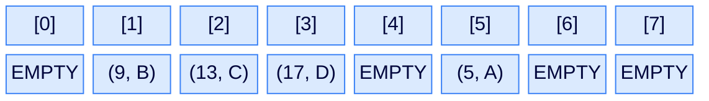

<p align="center"><strong>Logical view of a linear-probing hash table — the internal array stores key-value pairs directly. Some slots are occupied, others are empty. Everything lives in one contiguous block of memory; there are no chains.</strong></p>

In real-world implementations, the array is often **dynamic**: when occupancy crosses some threshold (typically 70%), the table is rehashed into a larger array. To keep this lesson focused on the probing scheme itself, we'll work with a **fixed-size** array — and when it fills up, inserts simply fail.

## Handling collisions

When two keys hash to the same index, the first one wins that slot. The second one starts a **linear probe**: check `index + 1`, then `index + 2`, then `index + 3`, and so on, wrapping around to the start of the array if needed. The first empty slot it finds is where it goes.

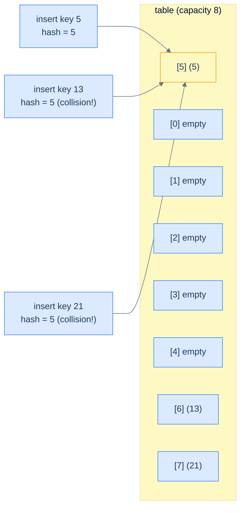

<p align="center"><strong>Three keys that all hash to index 5 — the first lands at slot 5, the second probes one step forward to slot 6, the third probes two steps forward to slot 7. The colliding keys end up <em>consecutively</em> in the array.</strong></p>

The probe is bounded — we never iterate more than `capacity` steps, because after `capacity` probes we have visited every slot in the array. The wrap-around is implemented with a mod operator: `probeIndex = (startIndex + i) % capacity`.

> **Insert (sketch)**
>
> -   **Step 1:** Compute the hash of the key.
> -   **Step 2:** Linear-probe from that index until an unoccupied slot is found.
> -   **Step 3:** Place the key-value pair at that slot.
>
> **Search (sketch)**
>
> -   **Step 1:** Compute the hash of the key.
> -   **Step 2:** Linear-probe from that index until either the key is found or an empty slot is hit.
> -   **Step 3:** Return the value if the key is found; otherwise return `-1`.

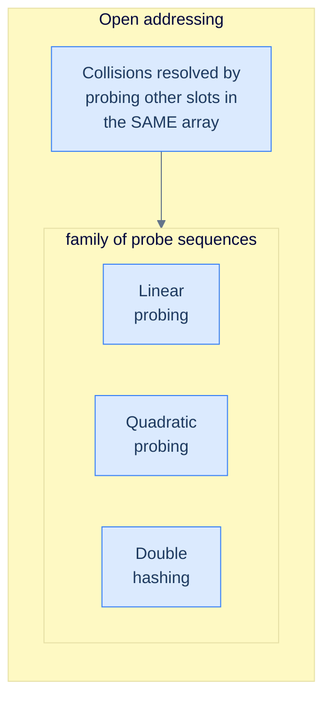

<p align="center"><strong>Linear probing belongs to the broader family called <strong>open addressing</strong> — the address (slot index) is "open" because a key can end up at <em>any</em> slot, not just the one its hash points to. The next two lessons will explore the other two probe sequences in this family.</strong></p>

> **Open addressing** is the umbrella term for any collision-resolution scheme that handles collisions by probing for *alternate locations within the same array*. Linear probing is the simplest member of the family; quadratic probing and double hashing are coming next.

***

# Key components of linear probing

A linear-probing hash table has three parts: a record type that tracks slot state, an internal array of those records, and a hash function. The interesting wrinkle this time is the slot state — separate chaining only ever needed "occupied or not"; linear probing needs **three** states, and one of them is going to seem mysterious until we get to deletion.

## Record

In linear probing, each slot stores exactly one record (or nothing). But "nothing" turns out to come in two flavours that the table must distinguish, so each record carries an explicit **state** field with three possible values:

> -   **EMPTY** — this slot has never held a record. A search hitting an `EMPTY` slot can stop immediately: the key cannot be further along the probe chain.
> -   **OCCUPIED** — this slot currently holds a key-value pair.
> -   **DELETED** — this slot used to hold a record, but it was deleted. A search hitting a `DELETED` slot must keep probing, because the key it's looking for might have been placed *past* this slot during a long probe chain.

We'll see exactly why `DELETED` is necessary (and not just "set the slot to `EMPTY`") when we get to the delete operation. For now, take the three states as a given.

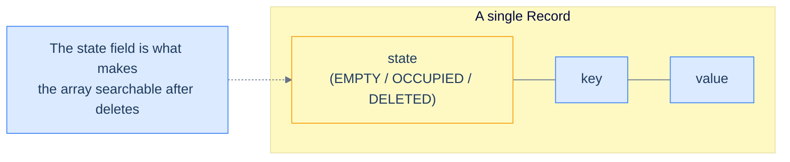

<p align="center"><strong>A linear-probing record carries three fields — the state tag plus the (key, value) payload. The state field is the secret ingredient that lets the table survive deletions without losing data; we'll see why in the delete section.</strong></p>

<div class="lang-tabs">

```python,editable
from enum import Enum

class RecordType(Enum):
    EMPTY    = 0    # Slot never held a record — search can stop here
    DELETED  = 1    # Slot held a record but was deleted — search must continue past
    OCCUPIED = 2    # Slot holds a live (key, value) pair

class Record:
    def __init__(self, key=None, value=None):
        # Default-construct as EMPTY; only OCCUPIED when key+value are supplied
        if key is not None and value is not None:
            self.state, self.key, self.value = RecordType.OCCUPIED, key, value
        else:
            self.state, self.key, self.value = RecordType.EMPTY, 0, 0

# Demo
r = Record(7, 100)
print(r.state, r.key, r.value)   # RecordType.OCCUPIED 7 100
```

```java,editable
public class Main {
    enum RecordType { EMPTY, DELETED, OCCUPIED }

    static class Record {
        RecordType state = RecordType.EMPTY;
        int        key   = 0;
        int        value = 0;
        Record() {}
        Record(int key, int value) {
            this.state = RecordType.OCCUPIED;   // OCCUPIED only when populated
            this.key   = key;
            this.value = value;
        }
    }

    public static void main(String[] args) {
        Record r = new Record(7, 100);
        System.out.println(r.state + " " + r.key + " " + r.value);
    }
}
```

```c,editable
#include <stdio.h>

typedef enum { EMPTY = 0, DELETED = 1, OCCUPIED = 2 } RecordType;

typedef struct {
    RecordType state;
    int        key;
    int        value;
} Record;

int main() {
    Record r = { .state = OCCUPIED, .key = 7, .value = 100 };
    printf("%d %d %d\n", r.state, r.key, r.value);
    return 0;
}
```

```cpp,editable
#include <iostream>

enum RecordType { EMPTY, DELETED, OCCUPIED };

struct Record {
    RecordType state = EMPTY;
    int        key   = 0;
    int        value = 0;
    Record() = default;
    Record(int key, int value)
        : state(OCCUPIED), key(key), value(value) {}
};

int main() {
    Record r(7, 100);
    std::cout << r.state << " " << r.key << " " << r.value << "\n";
}
```

```scala,editable
object RecordType extends Enumeration {
  val EMPTY, DELETED, OCCUPIED = Value
}

class Record(
  var state: RecordType.Value = RecordType.EMPTY,
  var key:   Int              = 0,
  var value: Int              = 0,
) {
  def this(key: Int, value: Int) = this(RecordType.OCCUPIED, key, value)
}

object Main extends App {
  val r = new Record(7, 100)
  println(s"${r.state} ${r.key} ${r.value}")
}
```

```javascript,editable
const RecordType = Object.freeze({ EMPTY: 0, DELETED: 1, OCCUPIED: 2 });

class Record {
    constructor(key, value) {
        if (key !== undefined && value !== undefined) {
            this.state = RecordType.OCCUPIED;   // Populated → OCCUPIED
            this.key   = key;
            this.value = value;
        } else {
            this.state = RecordType.EMPTY;      // Default-constructed → EMPTY
            this.key   = 0;
            this.value = 0;
        }
    }
}

const r = new Record(7, 100);
console.log(r.state, r.key, r.value);   // 2 7 100
```

```typescript,editable
enum RecordType { EMPTY, DELETED, OCCUPIED }

class Record {
    state: RecordType = RecordType.EMPTY;
    key:   number     = 0;
    value: number     = 0;
    constructor(key?: number, value?: number) {
        if (key !== undefined && value !== undefined) {
            this.state = RecordType.OCCUPIED;
            this.key   = key;
            this.value = value;
        }
    }
}

const r = new Record(7, 100);
console.log(r.state, r.key, r.value);
```

```go,editable
package main

import "fmt"

type RecordType int
const (
    EMPTY    RecordType = 0
    DELETED  RecordType = 1
    OCCUPIED RecordType = 2
)

type Record struct {
    State RecordType
    Key   int
    Value int
}

func newRecord(key, value int) Record {
    return Record{State: OCCUPIED, Key: key, Value: value}
}

func main() {
    r := newRecord(7, 100)
    fmt.Println(r.State, r.Key, r.Value)
}
```

```kotlin,editable
enum class RecordType { EMPTY, DELETED, OCCUPIED }

class Record(
    var state: RecordType = RecordType.EMPTY,
    var key:   Int        = 0,
    var value: Int        = 0,
) {
    constructor(key: Int, value: Int)
        : this(RecordType.OCCUPIED, key, value)
}

fun main() {
    val r = Record(7, 100)
    println("${r.state} ${r.key} ${r.value}")
}
```

```rust,editable
#[derive(Clone, Copy, Debug, PartialEq)]
enum RecordType { Empty, Deleted, Occupied }

#[derive(Clone, Debug)]
struct Record {
    state: RecordType,
    key:   i32,
    value: i32,
}

impl Record {
    fn empty()  -> Self { Record { state: RecordType::Empty,    key: 0, value: 0 } }
    fn occupied(key: i32, value: i32) -> Self {
        Record { state: RecordType::Occupied, key, value }
    }
}

fn main() {
    let r = Record::occupied(7, 100);
    println!("{:?} {} {}", r.state, r.key, r.value);
}
```

</div>

## Internal array

The internal array is just `capacity` records sitting back-to-back. Every slot starts in the `EMPTY` state. Inserts flip slots to `OCCUPIED`; deletes flip occupied slots to `DELETED`; the array's *length* never changes.

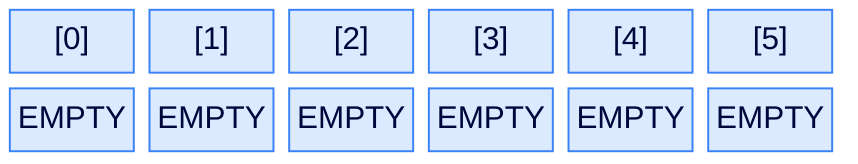

<p align="center"><strong>An empty linear-probing hash table — one contiguous array, every slot in <code>EMPTY</code> state. Compare with separate chaining, where the array contained chain references; here the array contains the records themselves.</strong></p>

## Hash function

The hash function does the same job as before — turn a key into an integer index. Collisions are no longer absorbed by the slot itself; they trigger a probe. We'll keep using the simple division-method `key % capacity` so we can focus on probing.

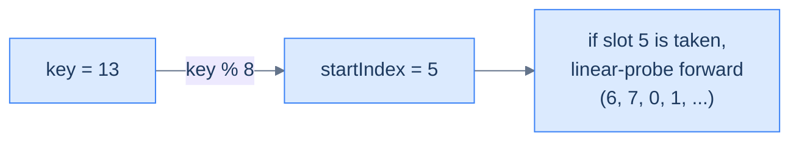

<p align="center"><strong>The hash function picks the <em>starting</em> probe index. The probe sequence does the rest of the work, walking forward until an empty (for insert) or matching (for search) slot is found.</strong></p>

***

# Implementing the hash table class

We now wrap everything into a `MyHashTable` class. The constructor builds an array of `capacity` records, all `EMPTY`; the public methods are stubs we'll fill in next.

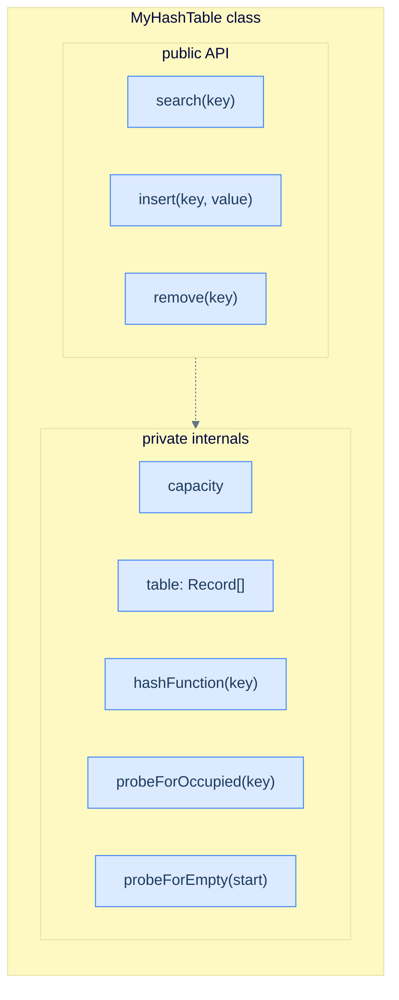

<p align="center"><strong>The class wraps two helpers around the hash function — <code>probeForOccupied</code> finds an existing key, <code>probeForEmpty</code> finds the next free slot. Every public operation will call one or both.</strong></p>

## Implementation

<div class="lang-tabs">

```python,editable
from enum import Enum

class RecordType(Enum):
    EMPTY = 0; DELETED = 1; OCCUPIED = 2

class Record:
    def __init__(self, key=None, value=None):
        if key is not None and value is not None:
            self.state, self.key, self.value = RecordType.OCCUPIED, key, value
        else:
            self.state, self.key, self.value = RecordType.EMPTY, 0, 0

class MyHashTable:
    def __init__(self, capacity):
        self.capacity = capacity
        self.table    = [Record() for _ in range(capacity)]   # All EMPTY

    def _hash(self, key):
        return key % self.capacity                            # Division method

    def search(self, key):  pass        # filled in next
    def insert(self, key, value): pass
    def remove(self, key):  pass

print("table created with capacity 5")
h = MyHashTable(5)
```

```java,editable
import java.util.*;

public class Main {
    enum RecordType { EMPTY, DELETED, OCCUPIED }

    static class Record {
        RecordType state = RecordType.EMPTY; int key, value;
        Record() {}
        Record(int k, int v) { state = RecordType.OCCUPIED; key = k; value = v; }
    }

    static class MyHashTable {
        private final int          capacity;
        private final List<Record> table;
        MyHashTable(int capacity) {
            this.capacity = capacity;
            this.table    = new ArrayList<>(capacity);
            for (int i = 0; i < capacity; i++) table.add(new Record());
        }
        private int hash(int key) { return key % capacity; }

        int     search(int key)              { return -1;   }
        boolean insert(int key, int value)   { return false;}
        void    remove(int key)              {              }
    }

    public static void main(String[] args) {
        MyHashTable h = new MyHashTable(5);
        System.out.println("table created with capacity 5");
    }
}
```

```c,editable
#include <stdio.h>
#include <stdlib.h>

typedef enum { EMPTY = 0, DELETED = 1, OCCUPIED = 2 } RecordType;
typedef struct { RecordType state; int key, value; } Record;

typedef struct { int capacity; Record *table; } MyHashTable;

MyHashTable* createTable(int capacity) {
    MyHashTable *h = malloc(sizeof(MyHashTable));
    h->capacity = capacity;
    h->table    = calloc(capacity, sizeof(Record));   // EMPTY = 0, so calloc fits
    return h;
}

int  hash_fn(MyHashTable *h, int key) { return key % h->capacity; }
int  search_op(MyHashTable *h, int key)              { return -1; }
int  insert_op(MyHashTable *h, int key, int value)   { return 0;  }
void remove_op(MyHashTable *h, int key)              {            }

int main() {
    MyHashTable *h = createTable(5);
    printf("table created with capacity %d\n", h->capacity);
    free(h->table); free(h);
    return 0;
}
```

```cpp,editable
#include <iostream>
#include <vector>

enum RecordType { EMPTY, DELETED, OCCUPIED };

struct Record {
    RecordType state = EMPTY;
    int key = 0, value = 0;
    Record() = default;
    Record(int k, int v) : state(OCCUPIED), key(k), value(v) {}
};

class MyHashTable {
    int                 capacity;
    std::vector<Record> table;
    int hash(int key) { return key % capacity; }
public:
    MyHashTable(int cap) : capacity(cap), table(cap) {}

    int  search(int key)             { return -1; }
    bool insert(int key, int value)  { return false; }
    void remove(int key)             {            }
};

int main() {
    MyHashTable h(5);
    std::cout << "table created with capacity 5\n";
}
```

```scala,editable
object RecordType extends Enumeration { val EMPTY, DELETED, OCCUPIED = Value }

class Record(
  var state: RecordType.Value = RecordType.EMPTY,
  var key:   Int              = 0,
  var value: Int              = 0,
) { def this(k: Int, v: Int) = this(RecordType.OCCUPIED, k, v) }

class MyHashTable(val capacity: Int) {
  protected val table: Array[Record] = Array.fill(capacity)(new Record())
  protected def hash(key: Int): Int  = key % capacity

  def search(key: Int):              Int     = -1
  def insert(key: Int, value: Int):  Boolean = false
  def remove(key: Int):              Unit    = ()
}

object Main extends App {
  val h = new MyHashTable(5)
  println("table created with capacity 5")
}
```

```javascript,editable
const RecordType = Object.freeze({ EMPTY: 0, DELETED: 1, OCCUPIED: 2 });

class Record {
    constructor(key, value) {
        if (key !== undefined && value !== undefined) {
            this.state = RecordType.OCCUPIED; this.key = key; this.value = value;
        } else {
            this.state = RecordType.EMPTY;    this.key = 0;   this.value = 0;
        }
    }
}

class MyHashTable {
    constructor(capacity) {
        this.capacity = capacity;
        this.table    = Array.from({ length: capacity }, () => new Record());
    }
    _hash(key) { return key % this.capacity; }

    search(key)        { return -1;    }
    insert(key, value) { return false; }
    remove(key)        {                }
}

const h = new MyHashTable(5);
console.log("table created with capacity 5");
```

```typescript,editable
enum RecordType { EMPTY, DELETED, OCCUPIED }

class Record {
    state: RecordType = RecordType.EMPTY;
    key:   number     = 0;
    value: number     = 0;
    constructor(key?: number, value?: number) {
        if (key !== undefined && value !== undefined) {
            this.state = RecordType.OCCUPIED; this.key = key; this.value = value;
        }
    }
}

class MyHashTable {
    protected capacity: number;
    protected table:    Record[];
    constructor(capacity: number) {
        this.capacity = capacity;
        this.table    = Array.from({ length: capacity }, () => new Record());
    }
    protected hash(key: number): number { return key % this.capacity; }

    search(key: number):                 number  { return -1;    }
    insert(key: number, value: number):  boolean { return false; }
    remove(key: number):                 void    {                }
}

const h = new MyHashTable(5);
console.log("table created with capacity 5");
```

```go,editable
package main

import "fmt"

type RecordType int
const (EMPTY RecordType = iota; DELETED; OCCUPIED)

type Record struct { State RecordType; Key, Value int }

type MyHashTable struct {
    capacity int
    table    []Record
}

func newTable(capacity int) *MyHashTable {
    return &MyHashTable{capacity: capacity, table: make([]Record, capacity)} // EMPTY zero-value
}
func (h *MyHashTable) hash(key int) int { return key % h.capacity }

func (h *MyHashTable) Search(key int) int               { return -1   }
func (h *MyHashTable) Insert(key, value int) bool       { return false }
func (h *MyHashTable) Remove(key int)                   {              }

func main() {
    h := newTable(5)
    fmt.Printf("table created with capacity %d\n", h.capacity)
}
```

```kotlin,editable
enum class RecordType { EMPTY, DELETED, OCCUPIED }

class Record(
    var state: RecordType = RecordType.EMPTY,
    var key:   Int        = 0,
    var value: Int        = 0,
) { constructor(k: Int, v: Int) : this(RecordType.OCCUPIED, k, v) }

open class MyHashTable(protected val capacity: Int) {
    protected val table: Array<Record> = Array(capacity) { Record() }
    protected fun hash(key: Int): Int  = key % capacity

    open fun search(key: Int): Int                  = -1
    open fun insert(key: Int, value: Int): Boolean  = false
    open fun remove(key: Int): Unit                 = Unit
}

fun main() {
    val h = MyHashTable(5)
    println("table created with capacity 5")
}
```

```rust,editable
#[derive(Clone, Copy, Debug, PartialEq)]
enum RecordType { Empty, Deleted, Occupied }

#[derive(Clone, Debug)]
struct Record { state: RecordType, key: i32, value: i32 }
impl Record {
    fn empty() -> Self { Record { state: RecordType::Empty, key: 0, value: 0 } }
}

struct MyHashTable { capacity: usize, table: Vec<Record> }
impl MyHashTable {
    fn new(capacity: usize) -> Self {
        MyHashTable { capacity, table: vec![Record::empty(); capacity] }
    }
    fn hash(&self, key: i32) -> usize { (key as usize) % self.capacity }

    fn search(&self,     _key: i32)              -> i32  { -1 }
    fn insert(&mut self, _key: i32, _val: i32)   -> bool { false }
    fn remove(&mut self, _key: i32)                      {       }
}

fn main() {
    let h = MyHashTable::new(5);
    println!("table created with capacity {}", h.capacity);
}
```

</div>

> *Predict before reading on — when search hits a slot, it must answer one of three questions: "is this my key?", "is this empty?", or "should I keep going?". Which slot states map to which decisions? Try to write the rule in your head before reading the next section.*

***

# Search operation in linear probing

Search is the operation that exposes why we need three slot states. We probe forward from the hashed index, checking each slot. Three things can happen:

## Algorithm

### 1. The key is present

If we land on an `OCCUPIED` slot whose key matches, we've found it. Return the value.

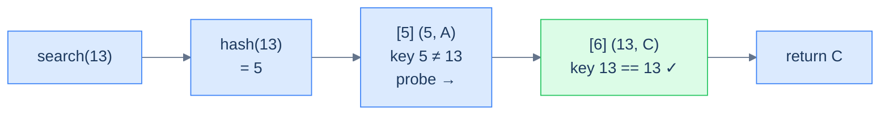

<p align="center"><strong>Successful search — probe walks forward through occupied slots, comparing keys, until it finds the match.</strong></p>

> **Algorithm — case 1**
>
> -   **Step 1:** Compute the hashed index for the key.
> -   **Step 2:** Linear-probe forward from that index.
> -   **Step 3:** If an `OCCUPIED` slot with a matching key is found, return its value.

### 2. An EMPTY slot is found

If we hit an `EMPTY` slot before finding the key, the key is not in the table — and we can stop *immediately*. Why? Because if the key had been inserted, the insert procedure would have placed it at *this exact slot* (or earlier in the probe). The fact that this slot is empty proves the key was never inserted into this probe chain.

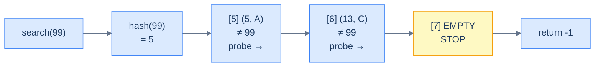

<p align="center"><strong>Search hits an EMPTY slot — terminate immediately. Had the key been inserted, it would have landed here or earlier; an empty slot proves it never made it past this point.</strong></p>

> **Algorithm — case 2**
>
> -   **Step 1:** Compute the hashed index for the key.
> -   **Step 2:** Linear-probe forward from that index.
> -   **Step 3:** If an `EMPTY` slot is encountered, return `-1`.

### 3. The table is full

If we walk the entire array (`capacity` probes) without finding either the key or an `EMPTY` slot, the table is completely full and the key is not present. Return `-1`.

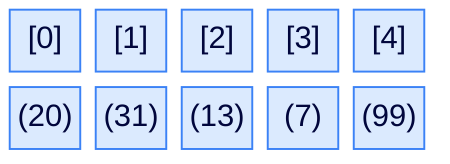

<p align="center"><strong>A full table — every slot OCCUPIED. A search for a key not in the table walks the entire array and returns -1 only after <code>capacity</code> probes.</strong></p>

> **Algorithm — case 3**
>
> -   **Step 1:** Compute the hashed index for the key.
> -   **Step 2:** Linear-probe forward.
> -   **Step 3:** If the entire array has been traversed without finding the key, return `-1`.

## Implementation

We extract the probe loop into a private helper `probeForOccupiedIndex` so insert and delete can reuse it. The helper returns the index of the matching record or `-1` if no match exists.

<div class="lang-tabs">

```python,editable
from enum import Enum

class RecordType(Enum):
    EMPTY = 0; DELETED = 1; OCCUPIED = 2

class Record:
    def __init__(self, key=None, value=None):
        if key is not None and value is not None:
            self.state, self.key, self.value = RecordType.OCCUPIED, key, value
        else:
            self.state, self.key, self.value = RecordType.EMPTY, 0, 0

class MyHashTable:
    def __init__(self, capacity):
        self.capacity = capacity
        self.table    = [Record() for _ in range(capacity)]
    def _hash(self, key): return key % self.capacity

    def _probe_for_occupied(self, key, start):
        # Walk up to `capacity` slots; abort on EMPTY (key cannot be past it)
        for i in range(self.capacity):
            idx = (start + i) % self.capacity
            slot = self.table[idx]
            if slot.state == RecordType.EMPTY:
                return -1                          # Stop — key not in chain
            if slot.state == RecordType.OCCUPIED and slot.key == key:
                return idx                         # Found
            # DELETED → keep walking; key may be further along
        return -1                                  # Full traversal, not found

    def search(self, key):
        idx = self._probe_for_occupied(key, self._hash(key))
        return -1 if idx == -1 else self.table[idx].value

# Demo
h = MyHashTable(5)
print(h.search(7))    # -1
```

```java,editable
import java.util.*;

public class Main {
    enum RecordType { EMPTY, DELETED, OCCUPIED }

    static class Record {
        RecordType state = RecordType.EMPTY; int key, value;
        Record() {}
        Record(int k, int v) { state = RecordType.OCCUPIED; key = k; value = v; }
    }

    static class MyHashTable {
        private final int          capacity;
        private final List<Record> table;
        MyHashTable(int capacity) {
            this.capacity = capacity;
            this.table = new ArrayList<>(capacity);
            for (int i = 0; i < capacity; i++) table.add(new Record());
        }
        private int hash(int key) { return key % capacity; }

        protected int probeForOccupied(int key, int start) {
            for (int i = 0; i < capacity; i++) {
                int idx  = (start + i) % capacity;
                Record s = table.get(idx);
                if (s.state == RecordType.EMPTY)                      return -1;
                if (s.state == RecordType.OCCUPIED && s.key == key)   return idx;
                // DELETED → keep walking
            }
            return -1;
        }

        int search(int key) {
            int idx = probeForOccupied(key, hash(key));
            return idx == -1 ? -1 : table.get(idx).value;
        }
    }

    public static void main(String[] args) {
        MyHashTable h = new MyHashTable(5);
        System.out.println(h.search(7));   // -1
    }
}
```

```c,editable
#include <stdio.h>
#include <stdlib.h>

typedef enum { EMPTY = 0, DELETED = 1, OCCUPIED = 2 } RecordType;
typedef struct { RecordType state; int key, value; } Record;
typedef struct { int capacity; Record *table; } MyHashTable;

int hash_fn(MyHashTable *h, int key) { return key % h->capacity; }

int probe_for_occupied(MyHashTable *h, int key, int start) {
    for (int i = 0; i < h->capacity; i++) {
        int idx = (start + i) % h->capacity;
        if (h->table[idx].state == EMPTY) return -1;
        if (h->table[idx].state == OCCUPIED && h->table[idx].key == key)
            return idx;
        // DELETED → keep walking
    }
    return -1;
}
int search_op(MyHashTable *h, int key) {
    int idx = probe_for_occupied(h, key, hash_fn(h, key));
    return idx == -1 ? -1 : h->table[idx].value;
}

int main() {
    MyHashTable h = { .capacity = 5, .table = calloc(5, sizeof(Record)) };
    printf("%d\n", search_op(&h, 7));   // -1
    free(h.table);
    return 0;
}
```

```cpp,editable
#include <iostream>
#include <vector>

enum RecordType { EMPTY, DELETED, OCCUPIED };

struct Record {
    RecordType state = EMPTY;
    int key = 0, value = 0;
    Record() = default;
    Record(int k, int v) : state(OCCUPIED), key(k), value(v) {}
};

class MyHashTable {
protected:
    int                 capacity;
    std::vector<Record> table;
    int hash(int key) { return key % capacity; }

    int probeForOccupied(int key, int start) {
        for (int i = 0; i < capacity; i++) {
            int idx = (start + i) % capacity;
            if (table[idx].state == EMPTY) return -1;
            if (table[idx].state == OCCUPIED && table[idx].key == key) return idx;
        }
        return -1;
    }
public:
    MyHashTable(int cap) : capacity(cap), table(cap) {}

    int search(int key) {
        int idx = probeForOccupied(key, hash(key));
        return idx == -1 ? -1 : table[idx].value;
    }
};

int main() {
    MyHashTable h(5);
    std::cout << h.search(7) << "\n";   // -1
}
```

```scala,editable
object RecordType extends Enumeration { val EMPTY, DELETED, OCCUPIED = Value }

class Record(
  var state: RecordType.Value = RecordType.EMPTY,
  var key:   Int              = 0,
  var value: Int              = 0,
) { def this(k: Int, v: Int) = this(RecordType.OCCUPIED, k, v) }

class MyHashTable(val capacity: Int) {
  protected val table: Array[Record] = Array.fill(capacity)(new Record())
  protected def hash(key: Int): Int  = key % capacity

  protected def probeForOccupied(key: Int, start: Int): Int = {
    var i = 0
    while (i < capacity) {
      val idx = (start + i) % capacity
      val s   = table(idx)
      if (s.state == RecordType.EMPTY)                              return -1
      if (s.state == RecordType.OCCUPIED && s.key == key)           return idx
      i += 1
    }
    -1
  }

  def search(key: Int): Int = {
    val idx = probeForOccupied(key, hash(key))
    if (idx == -1) -1 else table(idx).value
  }
}

object Main extends App {
  val h = new MyHashTable(5)
  println(h.search(7))   // -1
}
```

```javascript,editable
const RecordType = Object.freeze({ EMPTY: 0, DELETED: 1, OCCUPIED: 2 });

class Record {
    constructor(key, value) {
        if (key !== undefined && value !== undefined) {
            this.state = RecordType.OCCUPIED; this.key = key; this.value = value;
        } else {
            this.state = RecordType.EMPTY;    this.key = 0;   this.value = 0;
        }
    }
}

class MyHashTable {
    constructor(capacity) {
        this.capacity = capacity;
        this.table    = Array.from({ length: capacity }, () => new Record());
    }
    _hash(key) { return key % this.capacity; }

    _probeForOccupied(key, start) {
        for (let i = 0; i < this.capacity; i++) {
            const idx = (start + i) % this.capacity;
            const s   = this.table[idx];
            if (s.state === RecordType.EMPTY)                       return -1;
            if (s.state === RecordType.OCCUPIED && s.key === key)   return idx;
        }
        return -1;
    }

    search(key) {
        const idx = this._probeForOccupied(key, this._hash(key));
        return idx === -1 ? -1 : this.table[idx].value;
    }
}

const h = new MyHashTable(5);
console.log(h.search(7));   // -1
```

```typescript,editable
enum RecordType { EMPTY, DELETED, OCCUPIED }

class Record {
    state: RecordType = RecordType.EMPTY;
    key:   number     = 0;
    value: number     = 0;
    constructor(key?: number, value?: number) {
        if (key !== undefined && value !== undefined) {
            this.state = RecordType.OCCUPIED; this.key = key; this.value = value;
        }
    }
}

class MyHashTable {
    protected capacity: number;
    protected table:    Record[];
    constructor(capacity: number) {
        this.capacity = capacity;
        this.table    = Array.from({ length: capacity }, () => new Record());
    }
    protected hash(key: number): number { return key % this.capacity; }

    protected probeForOccupied(key: number, start: number): number {
        for (let i = 0; i < this.capacity; i++) {
            const idx = (start + i) % this.capacity;
            const s   = this.table[idx];
            if (s.state === RecordType.EMPTY)                       return -1;
            if (s.state === RecordType.OCCUPIED && s.key === key)   return idx;
        }
        return -1;
    }

    search(key: number): number {
        const idx = this.probeForOccupied(key, this.hash(key));
        return idx === -1 ? -1 : this.table[idx].value;
    }
}

const h = new MyHashTable(5);
console.log(h.search(7));   // -1
```

```go,editable
package main

import "fmt"

type RecordType int
const (EMPTY RecordType = iota; DELETED; OCCUPIED)

type Record struct { State RecordType; Key, Value int }
type MyHashTable struct { capacity int; table []Record }

func newTable(capacity int) *MyHashTable {
    return &MyHashTable{capacity, make([]Record, capacity)}
}
func (h *MyHashTable) hash(key int) int { return key % h.capacity }

func (h *MyHashTable) probeForOccupied(key, start int) int {
    for i := 0; i < h.capacity; i++ {
        idx := (start + i) % h.capacity
        s   := h.table[idx]
        if s.State == EMPTY                                       { return -1 }
        if s.State == OCCUPIED && s.Key == key                    { return idx }
    }
    return -1
}

func (h *MyHashTable) Search(key int) int {
    idx := h.probeForOccupied(key, h.hash(key))
    if idx == -1 { return -1 }
    return h.table[idx].Value
}

func main() {
    h := newTable(5)
    fmt.Println(h.Search(7))   // -1
}
```

```kotlin,editable
enum class RecordType { EMPTY, DELETED, OCCUPIED }

class Record(
    var state: RecordType = RecordType.EMPTY,
    var key:   Int        = 0,
    var value: Int        = 0,
) { constructor(k: Int, v: Int) : this(RecordType.OCCUPIED, k, v) }

open class MyHashTable(protected val capacity: Int) {
    protected val table: Array<Record> = Array(capacity) { Record() }
    protected fun hash(key: Int): Int  = key % capacity

    protected fun probeForOccupied(key: Int, start: Int): Int {
        for (i in 0 until capacity) {
            val idx = (start + i) % capacity
            val s   = table[idx]
            if (s.state == RecordType.EMPTY)                          return -1
            if (s.state == RecordType.OCCUPIED && s.key == key)       return idx
        }
        return -1
    }

    open fun search(key: Int): Int {
        val idx = probeForOccupied(key, hash(key))
        return if (idx == -1) -1 else table[idx].value
    }
}

fun main() {
    val h = MyHashTable(5)
    println(h.search(7))   // -1
}
```

```rust,editable
#[derive(Clone, Copy, Debug, PartialEq)]
enum RecordType { Empty, Deleted, Occupied }

#[derive(Clone, Debug)]
struct Record { state: RecordType, key: i32, value: i32 }
impl Record { fn empty() -> Self { Record { state: RecordType::Empty, key: 0, value: 0 } } }

struct MyHashTable { capacity: usize, table: Vec<Record> }
impl MyHashTable {
    fn new(capacity: usize) -> Self {
        MyHashTable { capacity, table: vec![Record::empty(); capacity] }
    }
    fn hash(&self, key: i32) -> usize { (key as usize) % self.capacity }

    fn probe_for_occupied(&self, key: i32, start: usize) -> i32 {
        for i in 0..self.capacity {
            let idx = (start + i) % self.capacity;
            match self.table[idx].state {
                RecordType::Empty                                => return -1,
                RecordType::Occupied if self.table[idx].key == key => return idx as i32,
                _ => {}     // Deleted or non-matching Occupied → keep walking
            }
        }
        -1
    }

    fn search(&self, key: i32) -> i32 {
        let idx = self.probe_for_occupied(key, self.hash(key));
        if idx == -1 { -1 } else { self.table[idx as usize].value }
    }
}

fn main() {
    let h = MyHashTable::new(5);
    println!("{}", h.search(7));   // -1
}
```

</div>

## Complexity analysis

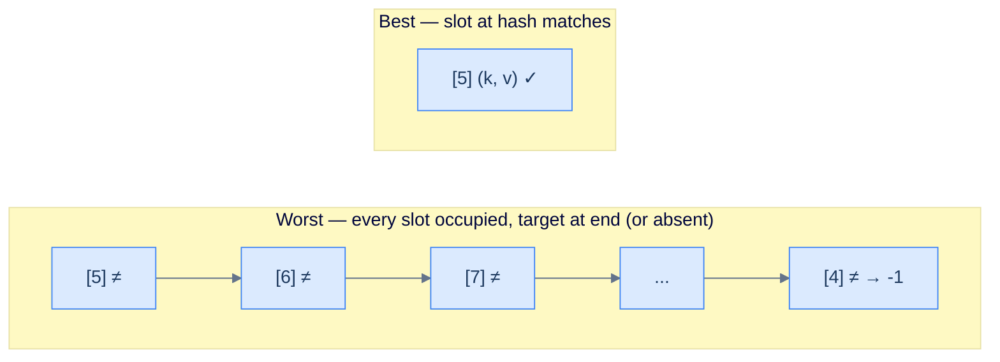

<p align="center"><strong>Search performance — best case is one comparison; worst case (table full of collisions) requires walking every slot. The cache-friendliness of the contiguous array means linear probing typically beats separate chaining in wall-clock time even when the asymptotic complexity is identical.</strong></p>

> **Best case** — first probe matches
>
> -   Time: **O(1)** | Space: **O(1)**
>
> **Average case** — well-distributed hash values, low load factor
>
> -   Time: **O(1)** | Space: **O(1)**
>
> **Worst case** — table full or 100% collision
>
> -   Time: **O(N)** | Space: **O(1)**

***

# Insert operation in linear probing

Insert is search plus "find the first slot we can write to". A *writable* slot is anything that isn't `OCCUPIED` — so either `EMPTY` or `DELETED`. Reusing `DELETED` slots is what makes the table memory-efficient over long sequences of inserts and deletes.

## Algorithm

### 1. Key already exists

If the probe finds an `OCCUPIED` slot whose key matches, we update the value in place and return `true`.

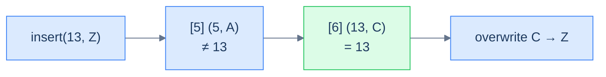

<p align="center"><strong>Insert with an existing key — the probe finds the matching record and overwrites its value. Table size unchanged.</strong></p>

### 2. Free slot found

If the probe doesn't find the key but does find a non-`OCCUPIED` slot (`EMPTY` or `DELETED`), the key isn't in the table. Place the new record at the **first** non-occupied slot encountered (this is the slot the algorithm prefers — preferring `DELETED` first lets the table reclaim tombstones aggressively).

A subtle but important rule: we run the probe **twice** — first to confirm the key isn't already present anywhere in the probe chain (we have to check past `DELETED` slots, so we *cannot* stop at the first free one), then to find the first free slot. This double pass is what guarantees we never insert a duplicate key.

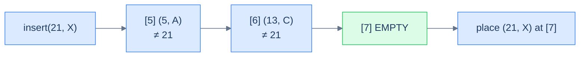

<p align="center"><strong>Insert with a new key — the probe walks past occupied slots until it finds the first non-occupied slot, then writes the new record there.</strong></p>

### 3. Table is full

If the entire array is OCCUPIED and the key is not present, insert fails — return `false`.


<p align="center"><strong>Insert into a full table fails. In production, this is the trigger for resizing — copy every record into a larger array. Our fixed-capacity teaching version simply returns <code>false</code>.</strong></p>

## Implementation

<div class="lang-tabs">

```python,editable
from enum import Enum

class RecordType(Enum):
    EMPTY = 0; DELETED = 1; OCCUPIED = 2

class Record:
    def __init__(self, key=None, value=None):
        if key is not None and value is not None:
            self.state, self.key, self.value = RecordType.OCCUPIED, key, value
        else:
            self.state, self.key, self.value = RecordType.EMPTY, 0, 0

class MyHashTable:
    def __init__(self, capacity):
        self.capacity = capacity
        self.table    = [Record() for _ in range(capacity)]
    def _hash(self, key): return key % self.capacity

    def _probe_for_occupied(self, key, start):
        for i in range(self.capacity):
            idx = (start + i) % self.capacity
            if self.table[idx].state == RecordType.EMPTY:                  return -1
            if self.table[idx].state == RecordType.OCCUPIED and self.table[idx].key == key:
                return idx
        return -1

    def _probe_for_free(self, start):
        # First non-OCCUPIED slot — works for both EMPTY and DELETED
        for i in range(self.capacity):
            idx = (start + i) % self.capacity
            if self.table[idx].state != RecordType.OCCUPIED:
                return idx
        return -1                                          # Table full

    def search(self, key):
        idx = self._probe_for_occupied(key, self._hash(key))
        return -1 if idx == -1 else self.table[idx].value

    def insert(self, key, value):
        start = self._hash(key)
        # First pass — does the key already exist?
        occ = self._probe_for_occupied(key, start)
        if occ != -1:
            self.table[occ].value = value                  # Update in place
            return True
        # Second pass — find a writable slot
        free = self._probe_for_free(start)
        if free == -1:
            return False                                   # Table full
        self.table[free] = Record(key, value)
        return True

# Demo — three keys all collide at index 0
h = MyHashTable(5)
h.insert(5, 50);  h.insert(10, 100);  h.insert(15, 150)   # all hash to 0
print(h.search(15), h.search(10), h.search(5))             # 150 100 50
h.insert(15, 999)                                          # update
print(h.search(15))                                        # 999
```

```java,editable
import java.util.*;

public class Main {
    enum RecordType { EMPTY, DELETED, OCCUPIED }

    static class Record {
        RecordType state = RecordType.EMPTY; int key, value;
        Record() {}
        Record(int k, int v) { state = RecordType.OCCUPIED; key = k; value = v; }
    }

    static class MyHashTable {
        protected final int          capacity;
        protected final List<Record> table;
        MyHashTable(int capacity) {
            this.capacity = capacity;
            this.table = new ArrayList<>(capacity);
            for (int i = 0; i < capacity; i++) table.add(new Record());
        }
        protected int hash(int key) { return key % capacity; }

        protected int probeForOccupied(int key, int start) {
            for (int i = 0; i < capacity; i++) {
                int idx = (start + i) % capacity;
                Record s = table.get(idx);
                if (s.state == RecordType.EMPTY)                     return -1;
                if (s.state == RecordType.OCCUPIED && s.key == key)  return idx;
            }
            return -1;
        }
        protected int probeForFree(int start) {
            for (int i = 0; i < capacity; i++) {
                int idx = (start + i) % capacity;
                if (table.get(idx).state != RecordType.OCCUPIED)     return idx;
            }
            return -1;
        }

        int search(int key) {
            int idx = probeForOccupied(key, hash(key));
            return idx == -1 ? -1 : table.get(idx).value;
        }
        boolean insert(int key, int value) {
            int start = hash(key);
            int occ = probeForOccupied(key, start);
            if (occ != -1) { table.get(occ).value = value; return true; }
            int free = probeForFree(start);
            if (free == -1) return false;
            table.set(free, new Record(key, value));
            return true;
        }
    }

    public static void main(String[] args) {
        MyHashTable h = new MyHashTable(5);
        h.insert(5, 50); h.insert(10, 100); h.insert(15, 150);
        System.out.println(h.search(15) + " " + h.search(10) + " " + h.search(5));
        h.insert(15, 999);
        System.out.println(h.search(15));   // 999
    }
}
```

```c,editable
#include <stdio.h>
#include <stdlib.h>

typedef enum { EMPTY = 0, DELETED = 1, OCCUPIED = 2 } RecordType;
typedef struct { RecordType state; int key, value; } Record;
typedef struct { int capacity; Record *table; } MyHashTable;

int hash_fn(MyHashTable *h, int key) { return key % h->capacity; }

int probe_for_occupied(MyHashTable *h, int key, int start) {
    for (int i = 0; i < h->capacity; i++) {
        int idx = (start + i) % h->capacity;
        if (h->table[idx].state == EMPTY) return -1;
        if (h->table[idx].state == OCCUPIED && h->table[idx].key == key)
            return idx;
    }
    return -1;
}
int probe_for_free(MyHashTable *h, int start) {
    for (int i = 0; i < h->capacity; i++) {
        int idx = (start + i) % h->capacity;
        if (h->table[idx].state != OCCUPIED) return idx;
    }
    return -1;
}

int search_op(MyHashTable *h, int key) {
    int idx = probe_for_occupied(h, key, hash_fn(h, key));
    return idx == -1 ? -1 : h->table[idx].value;
}
int insert_op(MyHashTable *h, int key, int value) {
    int start = hash_fn(h, key);
    int occ   = probe_for_occupied(h, key, start);
    if (occ != -1) { h->table[occ].value = value; return 1; }
    int free  = probe_for_free(h, start);
    if (free == -1) return 0;
    h->table[free] = (Record){ OCCUPIED, key, value };
    return 1;
}

int main() {
    MyHashTable h = { .capacity = 5, .table = calloc(5, sizeof(Record)) };
    insert_op(&h, 5, 50); insert_op(&h, 10, 100); insert_op(&h, 15, 150);
    printf("%d %d %d\n", search_op(&h, 15), search_op(&h, 10), search_op(&h, 5));
    insert_op(&h, 15, 999);
    printf("%d\n", search_op(&h, 15));
    free(h.table);
    return 0;
}
```

```cpp,editable
#include <iostream>
#include <vector>

enum RecordType { EMPTY, DELETED, OCCUPIED };

struct Record {
    RecordType state = EMPTY;
    int key = 0, value = 0;
    Record() = default;
    Record(int k, int v) : state(OCCUPIED), key(k), value(v) {}
};

class MyHashTable {
protected:
    int                 capacity;
    std::vector<Record> table;
    int hash(int key) { return key % capacity; }

    int probeForOccupied(int key, int start) {
        for (int i = 0; i < capacity; i++) {
            int idx = (start + i) % capacity;
            if (table[idx].state == EMPTY) return -1;
            if (table[idx].state == OCCUPIED && table[idx].key == key) return idx;
        }
        return -1;
    }
    int probeForFree(int start) {
        for (int i = 0; i < capacity; i++) {
            int idx = (start + i) % capacity;
            if (table[idx].state != OCCUPIED) return idx;
        }
        return -1;
    }
public:
    MyHashTable(int cap) : capacity(cap), table(cap) {}

    int search(int key) {
        int idx = probeForOccupied(key, hash(key));
        return idx == -1 ? -1 : table[idx].value;
    }
    bool insert(int key, int value) {
        int start = hash(key);
        int occ = probeForOccupied(key, start);
        if (occ != -1) { table[occ].value = value; return true; }
        int free = probeForFree(start);
        if (free == -1) return false;
        table[free] = Record(key, value);
        return true;
    }
};

int main() {
    MyHashTable h(5);
    h.insert(5, 50); h.insert(10, 100); h.insert(15, 150);
    std::cout << h.search(15) << " " << h.search(10) << " " << h.search(5) << "\n";
    h.insert(15, 999);
    std::cout << h.search(15) << "\n";
}
```

```scala,editable
object RecordType extends Enumeration { val EMPTY, DELETED, OCCUPIED = Value }

class Record(
  var state: RecordType.Value = RecordType.EMPTY,
  var key:   Int              = 0,
  var value: Int              = 0,
) { def this(k: Int, v: Int) = this(RecordType.OCCUPIED, k, v) }

class MyHashTable(val capacity: Int) {
  protected val table: Array[Record] = Array.fill(capacity)(new Record())
  protected def hash(key: Int): Int  = key % capacity

  protected def probeForOccupied(key: Int, start: Int): Int = {
    var i = 0
    while (i < capacity) {
      val idx = (start + i) % capacity
      val s   = table(idx)
      if (s.state == RecordType.EMPTY)                          return -1
      if (s.state == RecordType.OCCUPIED && s.key == key)       return idx
      i += 1
    }
    -1
  }
  protected def probeForFree(start: Int): Int = {
    var i = 0
    while (i < capacity) {
      val idx = (start + i) % capacity
      if (table(idx).state != RecordType.OCCUPIED)              return idx
      i += 1
    }
    -1
  }

  def search(key: Int): Int = {
    val idx = probeForOccupied(key, hash(key))
    if (idx == -1) -1 else table(idx).value
  }
  def insert(key: Int, value: Int): Boolean = {
    val start = hash(key)
    val occ   = probeForOccupied(key, start)
    if (occ != -1) { table(occ).value = value; return true }
    val free  = probeForFree(start)
    if (free == -1) return false
    table(free) = new Record(key, value)
    true
  }
}

object Main extends App {
  val h = new MyHashTable(5)
  h.insert(5, 50); h.insert(10, 100); h.insert(15, 150)
  println(s"${h.search(15)} ${h.search(10)} ${h.search(5)}")
  h.insert(15, 999); println(h.search(15))
}
```

```javascript,editable
const RecordType = Object.freeze({ EMPTY: 0, DELETED: 1, OCCUPIED: 2 });

class Record {
    constructor(key, value) {
        if (key !== undefined && value !== undefined) {
            this.state = RecordType.OCCUPIED; this.key = key; this.value = value;
        } else {
            this.state = RecordType.EMPTY;    this.key = 0;   this.value = 0;
        }
    }
}

class MyHashTable {
    constructor(capacity) {
        this.capacity = capacity;
        this.table    = Array.from({ length: capacity }, () => new Record());
    }
    _hash(key) { return key % this.capacity; }

    _probeForOccupied(key, start) {
        for (let i = 0; i < this.capacity; i++) {
            const idx = (start + i) % this.capacity;
            const s   = this.table[idx];
            if (s.state === RecordType.EMPTY) return -1;
            if (s.state === RecordType.OCCUPIED && s.key === key) return idx;
        }
        return -1;
    }
    _probeForFree(start) {
        for (let i = 0; i < this.capacity; i++) {
            const idx = (start + i) % this.capacity;
            if (this.table[idx].state !== RecordType.OCCUPIED) return idx;
        }
        return -1;
    }

    search(key) {
        const idx = this._probeForOccupied(key, this._hash(key));
        return idx === -1 ? -1 : this.table[idx].value;
    }
    insert(key, value) {
        const start = this._hash(key);
        const occ   = this._probeForOccupied(key, start);
        if (occ !== -1) { this.table[occ].value = value; return true; }
        const free  = this._probeForFree(start);
        if (free === -1) return false;
        this.table[free] = new Record(key, value);
        return true;
    }
}

const h = new MyHashTable(5);
h.insert(5, 50); h.insert(10, 100); h.insert(15, 150);
console.log(h.search(15), h.search(10), h.search(5));
h.insert(15, 999); console.log(h.search(15));
```

```typescript,editable
enum RecordType { EMPTY, DELETED, OCCUPIED }

class Record {
    state: RecordType = RecordType.EMPTY;
    key: number = 0; value: number = 0;
    constructor(key?: number, value?: number) {
        if (key !== undefined && value !== undefined) {
            this.state = RecordType.OCCUPIED; this.key = key; this.value = value;
        }
    }
}

class MyHashTable {
    protected capacity: number;
    protected table:    Record[];
    constructor(capacity: number) {
        this.capacity = capacity;
        this.table    = Array.from({ length: capacity }, () => new Record());
    }
    protected hash(key: number): number { return key % this.capacity; }

    protected probeForOccupied(key: number, start: number): number {
        for (let i = 0; i < this.capacity; i++) {
            const idx = (start + i) % this.capacity;
            const s   = this.table[idx];
            if (s.state === RecordType.EMPTY) return -1;
            if (s.state === RecordType.OCCUPIED && s.key === key) return idx;
        }
        return -1;
    }
    protected probeForFree(start: number): number {
        for (let i = 0; i < this.capacity; i++) {
            const idx = (start + i) % this.capacity;
            if (this.table[idx].state !== RecordType.OCCUPIED) return idx;
        }
        return -1;
    }

    search(key: number): number {
        const idx = this.probeForOccupied(key, this.hash(key));
        return idx === -1 ? -1 : this.table[idx].value;
    }
    insert(key: number, value: number): boolean {
        const start = this.hash(key);
        const occ   = this.probeForOccupied(key, start);
        if (occ !== -1) { this.table[occ].value = value; return true; }
        const free  = this.probeForFree(start);
        if (free === -1) return false;
        this.table[free] = new Record(key, value);
        return true;
    }
}

const h = new MyHashTable(5);
h.insert(5, 50); h.insert(10, 100); h.insert(15, 150);
console.log(h.search(15), h.search(10), h.search(5));
h.insert(15, 999); console.log(h.search(15));
```

```go,editable
package main

import "fmt"

type RecordType int
const (EMPTY RecordType = iota; DELETED; OCCUPIED)

type Record struct { State RecordType; Key, Value int }
type MyHashTable struct { capacity int; table []Record }

func newTable(capacity int) *MyHashTable { return &MyHashTable{capacity, make([]Record, capacity)} }
func (h *MyHashTable) hash(key int) int  { return key % h.capacity }

func (h *MyHashTable) probeForOccupied(key, start int) int {
    for i := 0; i < h.capacity; i++ {
        idx := (start + i) % h.capacity
        if h.table[idx].State == EMPTY                           { return -1 }
        if h.table[idx].State == OCCUPIED && h.table[idx].Key == key { return idx }
    }
    return -1
}
func (h *MyHashTable) probeForFree(start int) int {
    for i := 0; i < h.capacity; i++ {
        idx := (start + i) % h.capacity
        if h.table[idx].State != OCCUPIED { return idx }
    }
    return -1
}

func (h *MyHashTable) Search(key int) int {
    idx := h.probeForOccupied(key, h.hash(key))
    if idx == -1 { return -1 }
    return h.table[idx].Value
}
func (h *MyHashTable) Insert(key, value int) bool {
    start := h.hash(key)
    occ   := h.probeForOccupied(key, start)
    if occ != -1 { h.table[occ].Value = value; return true }
    free  := h.probeForFree(start)
    if free == -1 { return false }
    h.table[free] = Record{OCCUPIED, key, value}
    return true
}

func main() {
    h := newTable(5)
    h.Insert(5, 50); h.Insert(10, 100); h.Insert(15, 150)
    fmt.Println(h.Search(15), h.Search(10), h.Search(5))
    h.Insert(15, 999); fmt.Println(h.Search(15))
}
```

```kotlin,editable
enum class RecordType { EMPTY, DELETED, OCCUPIED }

class Record(
    var state: RecordType = RecordType.EMPTY,
    var key: Int = 0, var value: Int = 0,
) { constructor(k: Int, v: Int) : this(RecordType.OCCUPIED, k, v) }

open class MyHashTable(protected val capacity: Int) {
    protected val table: Array<Record> = Array(capacity) { Record() }
    protected fun hash(key: Int): Int  = key % capacity

    protected fun probeForOccupied(key: Int, start: Int): Int {
        for (i in 0 until capacity) {
            val idx = (start + i) % capacity
            val s   = table[idx]
            if (s.state == RecordType.EMPTY) return -1
            if (s.state == RecordType.OCCUPIED && s.key == key) return idx
        }
        return -1
    }
    protected fun probeForFree(start: Int): Int {
        for (i in 0 until capacity) {
            val idx = (start + i) % capacity
            if (table[idx].state != RecordType.OCCUPIED) return idx
        }
        return -1
    }

    open fun search(key: Int): Int {
        val idx = probeForOccupied(key, hash(key))
        return if (idx == -1) -1 else table[idx].value
    }
    open fun insert(key: Int, value: Int): Boolean {
        val start = hash(key)
        val occ = probeForOccupied(key, start)
        if (occ != -1) { table[occ].value = value; return true }
        val free = probeForFree(start)
        if (free == -1) return false
        table[free] = Record(key, value)
        return true
    }
}

fun main() {
    val h = MyHashTable(5)
    h.insert(5, 50); h.insert(10, 100); h.insert(15, 150)
    println("${h.search(15)} ${h.search(10)} ${h.search(5)}")
    h.insert(15, 999); println(h.search(15))
}
```

```rust,editable
#[derive(Clone, Copy, Debug, PartialEq)]
enum RecordType { Empty, Deleted, Occupied }

#[derive(Clone, Debug)]
struct Record { state: RecordType, key: i32, value: i32 }
impl Record { fn empty() -> Self { Record { state: RecordType::Empty, key: 0, value: 0 } } }

struct MyHashTable { capacity: usize, table: Vec<Record> }
impl MyHashTable {
    fn new(capacity: usize) -> Self { MyHashTable { capacity, table: vec![Record::empty(); capacity] } }
    fn hash(&self, key: i32) -> usize { (key as usize) % self.capacity }

    fn probe_for_occupied(&self, key: i32, start: usize) -> i32 {
        for i in 0..self.capacity {
            let idx = (start + i) % self.capacity;
            match self.table[idx].state {
                RecordType::Empty                                => return -1,
                RecordType::Occupied if self.table[idx].key == key => return idx as i32,
                _ => {}
            }
        }
        -1
    }
    fn probe_for_free(&self, start: usize) -> i32 {
        for i in 0..self.capacity {
            let idx = (start + i) % self.capacity;
            if self.table[idx].state != RecordType::Occupied { return idx as i32; }
        }
        -1
    }

    fn search(&self, key: i32) -> i32 {
        let idx = self.probe_for_occupied(key, self.hash(key));
        if idx == -1 { -1 } else { self.table[idx as usize].value }
    }
    fn insert(&mut self, key: i32, value: i32) -> bool {
        let start = self.hash(key);
        let occ = self.probe_for_occupied(key, start);
        if occ != -1 { self.table[occ as usize].value = value; return true; }
        let free = self.probe_for_free(start);
        if free == -1 { return false; }
        self.table[free as usize] = Record { state: RecordType::Occupied, key, value };
        true
    }
}

fn main() {
    let mut h = MyHashTable::new(5);
    h.insert(5, 50); h.insert(10, 100); h.insert(15, 150);
    println!("{} {} {}", h.search(15), h.search(10), h.search(5));
    h.insert(15, 999); println!("{}", h.search(15));
}
```

</div>

## Complexity analysis

> **Best case** — first probe is a writable slot (empty or matching key)
>
> -   Time: **O(1)** | Space: **O(1)**
>
> **Average case** — well-distributed hashes, low load factor
>
> -   Time: **O(1)** | Space: **O(1)**
>
> **Worst case** — table almost full, long probe chain
>
> -   Time: **O(N)** | Space: **O(1)**

***

# Delete operation in linear probing

Now we meet the most subtle operation — and the reason `DELETED` exists as a separate state from `EMPTY`. Naïve deletion (just set the slot to `EMPTY`) **silently corrupts the table** by breaking probe chains. We have to use a tombstone.

> **The Twist — why we can't just set the slot to EMPTY:**
>
> Imagine a probe chain `[5] → [6] → [7]` for a key inserted at `[7]`. Now we delete the record at `[6]` and naively mark it `EMPTY`. The next time someone searches for the key at `[7]`, the search probes `[5]` (occupied, no match), reaches `[6]` (EMPTY) — and returns "not found", because the search-on-EMPTY rule says stop. But the record at `[7]` is still there! We've made it unreachable. *Phantom data.*
>
> The fix is the `DELETED` tombstone: marking `[6]` as `DELETED` keeps the probe chain alive ("keep searching past me"), so the search continues to `[7]` and finds the record. Subsequent inserts can still reuse the slot (it's not OCCUPIED), so the table doesn't bloat with tombstones.

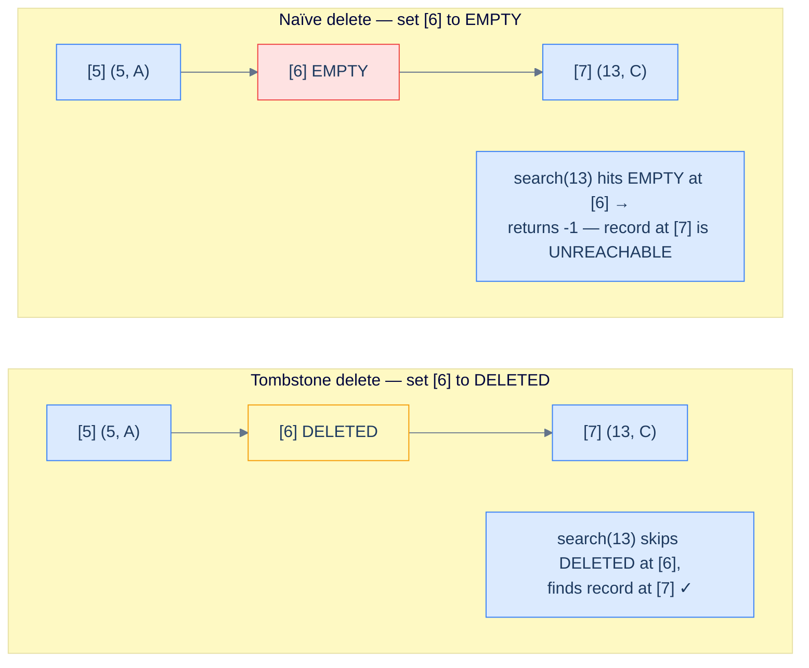

<p align="center"><strong>Why the DELETED tombstone exists — naïvely setting a deleted slot to EMPTY breaks the probe chain and orphans every record beyond it. The DELETED tombstone keeps the chain walkable for searches while still letting inserts reuse the slot.</strong></p>

## Algorithm

### 1. Key is present

Probe forward; when an `OCCUPIED` slot with the matching key is found, mark it `DELETED`.

### 2. Key is not present (EMPTY hit)

If the probe hits an `EMPTY` slot before finding the key, the key was never in the table. No-op.

### 3. Table fully scanned

If the entire array has been traversed without finding the key, no-op.

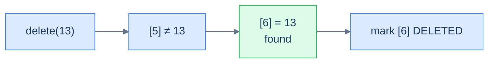

<p align="center"><strong>Delete with the key present — the matching slot is flipped to DELETED. Record stays in memory but is invisible to search; future inserts may reuse the slot.</strong></p>

## Implementation

<div class="lang-tabs">

```python,editable
from enum import Enum

class RecordType(Enum):
    EMPTY = 0; DELETED = 1; OCCUPIED = 2

class Record:
    def __init__(self, key=None, value=None):
        if key is not None and value is not None:
            self.state, self.key, self.value = RecordType.OCCUPIED, key, value
        else:
            self.state, self.key, self.value = RecordType.EMPTY, 0, 0

class MyHashTable:
    def __init__(self, capacity):
        self.capacity = capacity
        self.table    = [Record() for _ in range(capacity)]
    def _hash(self, key): return key % self.capacity

    def _probe_for_occupied(self, key, start):
        for i in range(self.capacity):
            idx = (start + i) % self.capacity
            if self.table[idx].state == RecordType.EMPTY: return -1
            if self.table[idx].state == RecordType.OCCUPIED and self.table[idx].key == key: return idx
        return -1
    def _probe_for_free(self, start):
        for i in range(self.capacity):
            idx = (start + i) % self.capacity
            if self.table[idx].state != RecordType.OCCUPIED: return idx
        return -1

    def search(self, key):
        idx = self._probe_for_occupied(key, self._hash(key))
        return -1 if idx == -1 else self.table[idx].value
    def insert(self, key, value):
        start = self._hash(key)
        occ = self._probe_for_occupied(key, start)
        if occ != -1: self.table[occ].value = value; return True
        free = self._probe_for_free(start)
        if free == -1: return False
        self.table[free] = Record(key, value); return True
    def remove(self, key):
        idx = self._probe_for_occupied(key, self._hash(key))
        if idx != -1:
            # Tombstone — keeps probe chains intact for keys past this slot
            self.table[idx].state = RecordType.DELETED

# Demo — delete in the middle of a collision cluster
h = MyHashTable(5)
h.insert(5, 50); h.insert(10, 100); h.insert(15, 150)   # all hash to 0
h.remove(10)
print(h.search(15))    # 150 — still reachable thanks to the tombstone
print(h.search(10))    # -1
```

```java,editable
import java.util.*;

public class Main {
    enum RecordType { EMPTY, DELETED, OCCUPIED }

    static class Record {
        RecordType state = RecordType.EMPTY; int key, value;
        Record() {}
        Record(int k, int v) { state = RecordType.OCCUPIED; key = k; value = v; }
    }

    static class MyHashTable {
        protected final int          capacity;
        protected final List<Record> table;
        MyHashTable(int capacity) {
            this.capacity = capacity;
            this.table = new ArrayList<>(capacity);
            for (int i = 0; i < capacity; i++) table.add(new Record());
        }
        protected int hash(int key) { return key % capacity; }

        protected int probeForOccupied(int key, int start) {
            for (int i = 0; i < capacity; i++) {
                int idx = (start + i) % capacity;
                Record s = table.get(idx);
                if (s.state == RecordType.EMPTY) return -1;
                if (s.state == RecordType.OCCUPIED && s.key == key) return idx;
            }
            return -1;
        }
        protected int probeForFree(int start) {
            for (int i = 0; i < capacity; i++) {
                int idx = (start + i) % capacity;
                if (table.get(idx).state != RecordType.OCCUPIED) return idx;
            }
            return -1;
        }

        int search(int key) {
            int idx = probeForOccupied(key, hash(key));
            return idx == -1 ? -1 : table.get(idx).value;
        }
        boolean insert(int key, int value) {
            int start = hash(key);
            int occ = probeForOccupied(key, start);
            if (occ != -1) { table.get(occ).value = value; return true; }
            int free = probeForFree(start);
            if (free == -1) return false;
            table.set(free, new Record(key, value));
            return true;
        }
        void remove(int key) {
            int idx = probeForOccupied(key, hash(key));
            if (idx != -1) table.get(idx).state = RecordType.DELETED;
        }
    }

    public static void main(String[] args) {
        MyHashTable h = new MyHashTable(5);
        h.insert(5, 50); h.insert(10, 100); h.insert(15, 150);
        h.remove(10);
        System.out.println(h.search(15));  // 150
        System.out.println(h.search(10));  // -1
    }
}
```

```c,editable
#include <stdio.h>
#include <stdlib.h>

typedef enum { EMPTY = 0, DELETED = 1, OCCUPIED = 2 } RecordType;
typedef struct { RecordType state; int key, value; } Record;
typedef struct { int capacity; Record *table; } MyHashTable;

int hash_fn(MyHashTable *h, int key) { return key % h->capacity; }
int probe_for_occupied(MyHashTable *h, int key, int start) {
    for (int i = 0; i < h->capacity; i++) {
        int idx = (start + i) % h->capacity;
        if (h->table[idx].state == EMPTY) return -1;
        if (h->table[idx].state == OCCUPIED && h->table[idx].key == key) return idx;
    }
    return -1;
}
int probe_for_free(MyHashTable *h, int start) {
    for (int i = 0; i < h->capacity; i++) {
        int idx = (start + i) % h->capacity;
        if (h->table[idx].state != OCCUPIED) return idx;
    }
    return -1;
}
int  search_op(MyHashTable *h, int key) {
    int idx = probe_for_occupied(h, key, hash_fn(h, key));
    return idx == -1 ? -1 : h->table[idx].value;
}
int  insert_op(MyHashTable *h, int key, int value) {
    int start = hash_fn(h, key);
    int occ   = probe_for_occupied(h, key, start);
    if (occ != -1) { h->table[occ].value = value; return 1; }
    int free  = probe_for_free(h, start);
    if (free == -1) return 0;
    h->table[free] = (Record){OCCUPIED, key, value};
    return 1;
}
void remove_op(MyHashTable *h, int key) {
    int idx = probe_for_occupied(h, key, hash_fn(h, key));
    if (idx != -1) h->table[idx].state = DELETED;
}

int main() {
    MyHashTable h = { .capacity = 5, .table = calloc(5, sizeof(Record)) };
    insert_op(&h, 5, 50); insert_op(&h, 10, 100); insert_op(&h, 15, 150);
    remove_op(&h, 10);
    printf("%d %d\n", search_op(&h, 15), search_op(&h, 10));   // 150 -1
    free(h.table);
    return 0;
}
```

```cpp,editable
#include <iostream>
#include <vector>

enum RecordType { EMPTY, DELETED, OCCUPIED };

struct Record {
    RecordType state = EMPTY;
    int key = 0, value = 0;
    Record() = default;
    Record(int k, int v) : state(OCCUPIED), key(k), value(v) {}
};

class MyHashTable {
protected:
    int                 capacity;
    std::vector<Record> table;
    int hash(int key) { return key % capacity; }

    int probeForOccupied(int key, int start) {
        for (int i = 0; i < capacity; i++) {
            int idx = (start + i) % capacity;
            if (table[idx].state == EMPTY) return -1;
            if (table[idx].state == OCCUPIED && table[idx].key == key) return idx;
        }
        return -1;
    }
    int probeForFree(int start) {
        for (int i = 0; i < capacity; i++) {
            int idx = (start + i) % capacity;
            if (table[idx].state != OCCUPIED) return idx;
        }
        return -1;
    }
public:
    MyHashTable(int cap) : capacity(cap), table(cap) {}

    int search(int key) {
        int idx = probeForOccupied(key, hash(key));
        return idx == -1 ? -1 : table[idx].value;
    }
    bool insert(int key, int value) {
        int start = hash(key);
        int occ = probeForOccupied(key, start);
        if (occ != -1) { table[occ].value = value; return true; }
        int free = probeForFree(start);
        if (free == -1) return false;
        table[free] = Record(key, value);
        return true;
    }
    void remove(int key) {
        int idx = probeForOccupied(key, hash(key));
        if (idx != -1) table[idx].state = DELETED;
    }
};

int main() {
    MyHashTable h(5);
    h.insert(5, 50); h.insert(10, 100); h.insert(15, 150);
    h.remove(10);
    std::cout << h.search(15) << " " << h.search(10) << "\n";   // 150 -1
}
```

```scala,editable
object RecordType extends Enumeration { val EMPTY, DELETED, OCCUPIED = Value }

class Record(
  var state: RecordType.Value = RecordType.EMPTY,
  var key:   Int              = 0,
  var value: Int              = 0,
) { def this(k: Int, v: Int) = this(RecordType.OCCUPIED, k, v) }

class MyHashTable(val capacity: Int) {
  protected val table: Array[Record] = Array.fill(capacity)(new Record())
  protected def hash(key: Int): Int  = key % capacity

  protected def probeForOccupied(key: Int, start: Int): Int = {
    var i = 0
    while (i < capacity) {
      val idx = (start + i) % capacity
      val s   = table(idx)
      if (s.state == RecordType.EMPTY) return -1
      if (s.state == RecordType.OCCUPIED && s.key == key) return idx
      i += 1
    }; -1
  }
  protected def probeForFree(start: Int): Int = {
    var i = 0
    while (i < capacity) {
      val idx = (start + i) % capacity
      if (table(idx).state != RecordType.OCCUPIED) return idx
      i += 1
    }; -1
  }

  def search(key: Int): Int = {
    val idx = probeForOccupied(key, hash(key))
    if (idx == -1) -1 else table(idx).value
  }
  def insert(key: Int, value: Int): Boolean = {
    val start = hash(key); val occ = probeForOccupied(key, start)
    if (occ != -1) { table(occ).value = value; return true }
    val free = probeForFree(start); if (free == -1) return false
    table(free) = new Record(key, value); true
  }
  def remove(key: Int): Unit = {
    val idx = probeForOccupied(key, hash(key))
    if (idx != -1) table(idx).state = RecordType.DELETED
  }
}

object Main extends App {
  val h = new MyHashTable(5)
  h.insert(5, 50); h.insert(10, 100); h.insert(15, 150)
  h.remove(10)
  println(s"${h.search(15)} ${h.search(10)}")   // 150 -1
}
```

```javascript,editable
const RecordType = Object.freeze({ EMPTY: 0, DELETED: 1, OCCUPIED: 2 });

class Record {
    constructor(key, value) {
        if (key !== undefined && value !== undefined) {
            this.state = RecordType.OCCUPIED; this.key = key; this.value = value;
        } else {
            this.state = RecordType.EMPTY;    this.key = 0;   this.value = 0;
        }
    }
}

class MyHashTable {
    constructor(capacity) {
        this.capacity = capacity;
        this.table    = Array.from({ length: capacity }, () => new Record());
    }
    _hash(key) { return key % this.capacity; }

    _probeForOccupied(key, start) {
        for (let i = 0; i < this.capacity; i++) {
            const idx = (start + i) % this.capacity;
            const s   = this.table[idx];
            if (s.state === RecordType.EMPTY) return -1;
            if (s.state === RecordType.OCCUPIED && s.key === key) return idx;
        }
        return -1;
    }
    _probeForFree(start) {
        for (let i = 0; i < this.capacity; i++) {
            const idx = (start + i) % this.capacity;
            if (this.table[idx].state !== RecordType.OCCUPIED) return idx;
        }
        return -1;
    }

    search(key) {
        const idx = this._probeForOccupied(key, this._hash(key));
        return idx === -1 ? -1 : this.table[idx].value;
    }
    insert(key, value) {
        const start = this._hash(key);
        const occ   = this._probeForOccupied(key, start);
        if (occ !== -1) { this.table[occ].value = value; return true; }
        const free  = this._probeForFree(start);
        if (free === -1) return false;
        this.table[free] = new Record(key, value);
        return true;
    }
    remove(key) {
        const idx = this._probeForOccupied(key, this._hash(key));
        if (idx !== -1) this.table[idx].state = RecordType.DELETED;
    }
}

const h = new MyHashTable(5);
h.insert(5, 50); h.insert(10, 100); h.insert(15, 150);
h.remove(10);
console.log(h.search(15), h.search(10));   // 150 -1
```

```typescript,editable
enum RecordType { EMPTY, DELETED, OCCUPIED }

class Record {
    state: RecordType = RecordType.EMPTY;
    key: number = 0; value: number = 0;
    constructor(key?: number, value?: number) {
        if (key !== undefined && value !== undefined) {
            this.state = RecordType.OCCUPIED; this.key = key; this.value = value;
        }
    }
}

class MyHashTable {
    protected capacity: number;
    protected table:    Record[];
    constructor(capacity: number) {
        this.capacity = capacity;
        this.table    = Array.from({ length: capacity }, () => new Record());
    }
    protected hash(key: number): number { return key % this.capacity; }

    protected probeForOccupied(key: number, start: number): number {
        for (let i = 0; i < this.capacity; i++) {
            const idx = (start + i) % this.capacity;
            const s   = this.table[idx];
            if (s.state === RecordType.EMPTY) return -1;
            if (s.state === RecordType.OCCUPIED && s.key === key) return idx;
        }
        return -1;
    }
    protected probeForFree(start: number): number {
        for (let i = 0; i < this.capacity; i++) {
            const idx = (start + i) % this.capacity;
            if (this.table[idx].state !== RecordType.OCCUPIED) return idx;
        }
        return -1;
    }

    search(key: number): number {
        const idx = this.probeForOccupied(key, this.hash(key));
        return idx === -1 ? -1 : this.table[idx].value;
    }
    insert(key: number, value: number): boolean {
        const start = this.hash(key);
        const occ = this.probeForOccupied(key, start);
        if (occ !== -1) { this.table[occ].value = value; return true; }
        const free = this.probeForFree(start);
        if (free === -1) return false;
        this.table[free] = new Record(key, value);
        return true;
    }
    remove(key: number): void {
        const idx = this.probeForOccupied(key, this.hash(key));
        if (idx !== -1) this.table[idx].state = RecordType.DELETED;
    }
}

const h = new MyHashTable(5);
h.insert(5, 50); h.insert(10, 100); h.insert(15, 150);
h.remove(10);
console.log(h.search(15), h.search(10));   // 150 -1
```

```go,editable
package main

import "fmt"

type RecordType int
const (EMPTY RecordType = iota; DELETED; OCCUPIED)

type Record struct { State RecordType; Key, Value int }
type MyHashTable struct { capacity int; table []Record }

func newTable(capacity int) *MyHashTable { return &MyHashTable{capacity, make([]Record, capacity)} }
func (h *MyHashTable) hash(key int) int  { return key % h.capacity }

func (h *MyHashTable) probeForOccupied(key, start int) int {
    for i := 0; i < h.capacity; i++ {
        idx := (start + i) % h.capacity
        if h.table[idx].State == EMPTY                                  { return -1 }
        if h.table[idx].State == OCCUPIED && h.table[idx].Key == key    { return idx }
    }
    return -1
}
func (h *MyHashTable) probeForFree(start int) int {
    for i := 0; i < h.capacity; i++ {
        idx := (start + i) % h.capacity
        if h.table[idx].State != OCCUPIED { return idx }
    }
    return -1
}

func (h *MyHashTable) Search(key int) int {
    idx := h.probeForOccupied(key, h.hash(key))
    if idx == -1 { return -1 }; return h.table[idx].Value
}
func (h *MyHashTable) Insert(key, value int) bool {
    start := h.hash(key); occ := h.probeForOccupied(key, start)
    if occ != -1 { h.table[occ].Value = value; return true }
    free := h.probeForFree(start); if free == -1 { return false }
    h.table[free] = Record{OCCUPIED, key, value}; return true
}
func (h *MyHashTable) Remove(key int) {
    idx := h.probeForOccupied(key, h.hash(key))
    if idx != -1 { h.table[idx].State = DELETED }
}

func main() {
    h := newTable(5)
    h.Insert(5, 50); h.Insert(10, 100); h.Insert(15, 150)
    h.Remove(10)
    fmt.Println(h.Search(15), h.Search(10))   // 150 -1
}
```

```kotlin,editable
enum class RecordType { EMPTY, DELETED, OCCUPIED }

class Record(
    var state: RecordType = RecordType.EMPTY,
    var key: Int = 0, var value: Int = 0,
) { constructor(k: Int, v: Int) : this(RecordType.OCCUPIED, k, v) }

open class MyHashTable(protected val capacity: Int) {
    protected val table: Array<Record> = Array(capacity) { Record() }
    protected fun hash(key: Int): Int = key % capacity

    protected fun probeForOccupied(key: Int, start: Int): Int {
        for (i in 0 until capacity) {
            val idx = (start + i) % capacity
            val s = table[idx]
            if (s.state == RecordType.EMPTY) return -1
            if (s.state == RecordType.OCCUPIED && s.key == key) return idx
        }
        return -1
    }
    protected fun probeForFree(start: Int): Int {
        for (i in 0 until capacity) {
            val idx = (start + i) % capacity
            if (table[idx].state != RecordType.OCCUPIED) return idx
        }
        return -1
    }

    open fun search(key: Int): Int {
        val idx = probeForOccupied(key, hash(key))
        return if (idx == -1) -1 else table[idx].value
    }
    open fun insert(key: Int, value: Int): Boolean {
        val start = hash(key); val occ = probeForOccupied(key, start)
        if (occ != -1) { table[occ].value = value; return true }
        val free = probeForFree(start); if (free == -1) return false
        table[free] = Record(key, value); return true
    }
    open fun remove(key: Int) {
        val idx = probeForOccupied(key, hash(key))
        if (idx != -1) table[idx].state = RecordType.DELETED
    }
}

fun main() {
    val h = MyHashTable(5)
    h.insert(5, 50); h.insert(10, 100); h.insert(15, 150)
    h.remove(10)
    println("${h.search(15)} ${h.search(10)}")   // 150 -1
}
```

```rust,editable
#[derive(Clone, Copy, Debug, PartialEq)]
enum RecordType { Empty, Deleted, Occupied }

#[derive(Clone, Debug)]
struct Record { state: RecordType, key: i32, value: i32 }
impl Record { fn empty() -> Self { Record { state: RecordType::Empty, key: 0, value: 0 } } }

struct MyHashTable { capacity: usize, table: Vec<Record> }
impl MyHashTable {
    fn new(capacity: usize) -> Self { MyHashTable { capacity, table: vec![Record::empty(); capacity] } }
    fn hash(&self, key: i32) -> usize { (key as usize) % self.capacity }

    fn probe_for_occupied(&self, key: i32, start: usize) -> i32 {
        for i in 0..self.capacity {
            let idx = (start + i) % self.capacity;
            match self.table[idx].state {
                RecordType::Empty => return -1,
                RecordType::Occupied if self.table[idx].key == key => return idx as i32,
                _ => {}
            }
        }
        -1
    }
    fn probe_for_free(&self, start: usize) -> i32 {
        for i in 0..self.capacity {
            let idx = (start + i) % self.capacity;
            if self.table[idx].state != RecordType::Occupied { return idx as i32; }
        }
        -1
    }

    fn search(&self, key: i32) -> i32 {
        let idx = self.probe_for_occupied(key, self.hash(key));
        if idx == -1 { -1 } else { self.table[idx as usize].value }
    }
    fn insert(&mut self, key: i32, value: i32) -> bool {
        let start = self.hash(key);
        let occ = self.probe_for_occupied(key, start);
        if occ != -1 { self.table[occ as usize].value = value; return true; }
        let free = self.probe_for_free(start);
        if free == -1 { return false; }
        self.table[free as usize] = Record { state: RecordType::Occupied, key, value };
        true
    }
    fn remove(&mut self, key: i32) {
        let idx = self.probe_for_occupied(key, self.hash(key));
        if idx != -1 { self.table[idx as usize].state = RecordType::Deleted; }
    }
}

fn main() {
    let mut h = MyHashTable::new(5);
    h.insert(5, 50); h.insert(10, 100); h.insert(15, 150);
    h.remove(10);
    println!("{} {}", h.search(15), h.search(10));   // 150 -1
}
```

</div>

## Complexity analysis

> **Best case** — first probe is the target
>
> -   Time: **O(1)** | Space: **O(1)**
>
> **Average case** — well-distributed hashes
>
> -   Time: **O(1)** | Space: **O(1)**
>
> **Worst case** — long collision cluster
>
> -   Time: **O(N)** | Space: **O(1)**

***

# Design a hash table with linear probing

## Problem Statement

Given the skeleton of a `MyHashTable` class, complete it by implementing:

> -   **MyHashTable(int capacity)** — Initialise with the given capacity.
> -   **search(int key)** — Return the value, or `-1`.
> -   **insert(int key, int value)** — Insert or update; return `true` on success, `false` if the table is full.
> -   **remove(int key)** — Remove the mapping (no-op if absent).
> -   **getKeyAtIndex(int index)** — Return the key currently stored at `table[index]`, or `-1` if the slot isn't `OCCUPIED`.

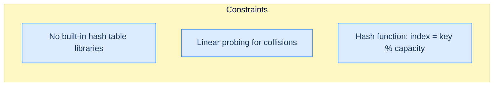

<p align="center"><strong>Constraints — implement everything from scratch with linear probing and the simple division-method hash.</strong></p>

> **Example:**
>
> -   **Input:** `[MyHashTable, insert, insert, search, insert, search, insert, search, search, getKeyAtIndex]`, `[[3], [1, 2], [2, 4], [1], [1, 3], [1], [2, 5], [2], [3], [0]]`
>
> -   **Output:** `[null, true, true, 2, true, 3, true, 5, -1, -1]`
>
> **Explanation:**
>
> | Operation | Effect | Result |
> |---|---|---|
> | `MyHashTable(3)` | empty table, capacity 3 | `null` |
> | `insert(1, 2)` | `[EMPTY, (1, 2), EMPTY]` (1 % 3 = 1) | `true` |
> | `insert(2, 4)` | `[EMPTY, (1, 2), (2, 4)]` (2 % 3 = 2) | `true` |
> | `search(1)` | found at index 1 | `2` |
> | `insert(1, 3)` | update existing | `true` |
> | `search(1)` | | `3` |
> | `insert(2, 5)` | update existing | `true` |
> | `search(2)` | | `5` |
> | `search(3)` | 3 % 3 = 0; index 0 is EMPTY → not found | `-1` |
> | `getKeyAtIndex(0)` | slot 0 is EMPTY | `-1` |

## Solution

The full 10-language implementation. `getKeyAtIndex` is a one-liner: return the stored key if the slot is `OCCUPIED`, otherwise `-1` (covers both `EMPTY` and `DELETED` slots).

<div class="lang-tabs">

```python,editable
from enum import Enum

class RecordType(Enum):
    EMPTY = 0; DELETED = 1; OCCUPIED = 2

class Record:
    def __init__(self, key=None, value=None):
        if key is not None and value is not None:
            self.state, self.key, self.value = RecordType.OCCUPIED, key, value
        else:
            self.state, self.key, self.value = RecordType.EMPTY, 0, 0

class MyHashTable:
    def __init__(self, capacity):
        self.capacity = capacity
        self.table    = [Record() for _ in range(capacity)]
    def _hash(self, key): return key % self.capacity

    def _probe_for_occupied(self, key, start):
        for i in range(self.capacity):
            idx = (start + i) % self.capacity
            if self.table[idx].state == RecordType.EMPTY: return -1
            if self.table[idx].state == RecordType.OCCUPIED and self.table[idx].key == key: return idx
        return -1
    def _probe_for_free(self, start):
        for i in range(self.capacity):
            idx = (start + i) % self.capacity
            if self.table[idx].state != RecordType.OCCUPIED: return idx
        return -1

    def search(self, key):
        idx = self._probe_for_occupied(key, self._hash(key))
        return -1 if idx == -1 else self.table[idx].value
    def insert(self, key, value):
        start = self._hash(key); occ = self._probe_for_occupied(key, start)
        if occ != -1: self.table[occ].value = value; return True
        free = self._probe_for_free(start)
        if free == -1: return False
        self.table[free] = Record(key, value); return True
    def remove(self, key):
        idx = self._probe_for_occupied(key, self._hash(key))
        if idx != -1: self.table[idx].state = RecordType.DELETED
    def getKeyAtIndex(self, index):
        if 0 <= index < self.capacity and self.table[index].state == RecordType.OCCUPIED:
            return self.table[index].key
        return -1

# Boss-fight demo
h = MyHashTable(3)
h.insert(1, 2); h.insert(2, 4)
print(h.search(1))         # 2
h.insert(1, 3)
print(h.search(1))         # 3
h.insert(2, 5)
print(h.search(2), h.search(3))   # 5 -1
print(h.getKeyAtIndex(0))  # -1
```

```java,editable
import java.util.*;

public class Main {
    enum RecordType { EMPTY, DELETED, OCCUPIED }

    static class Record {
        RecordType state = RecordType.EMPTY; int key, value;
        Record() {}
        Record(int k, int v) { state = RecordType.OCCUPIED; key = k; value = v; }
    }

    static class MyHashTable {
        protected final int          capacity;
        protected final List<Record> table;
        MyHashTable(int capacity) {
            this.capacity = capacity;
            this.table = new ArrayList<>(capacity);
            for (int i = 0; i < capacity; i++) table.add(new Record());
        }
        protected int hash(int key) { return key % capacity; }

        protected int probeForOccupied(int key, int start) {
            for (int i = 0; i < capacity; i++) {
                int idx = (start + i) % capacity;
                Record s = table.get(idx);
                if (s.state == RecordType.EMPTY) return -1;
                if (s.state == RecordType.OCCUPIED && s.key == key) return idx;
            }
            return -1;
        }
        protected int probeForFree(int start) {
            for (int i = 0; i < capacity; i++) {
                int idx = (start + i) % capacity;
                if (table.get(idx).state != RecordType.OCCUPIED) return idx;
            }
            return -1;
        }

        int search(int key) {
            int idx = probeForOccupied(key, hash(key));
            return idx == -1 ? -1 : table.get(idx).value;
        }
        boolean insert(int key, int value) {
            int start = hash(key); int occ = probeForOccupied(key, start);
            if (occ != -1) { table.get(occ).value = value; return true; }
            int free = probeForFree(start); if (free == -1) return false;
            table.set(free, new Record(key, value)); return true;
        }
        void remove(int key) {
            int idx = probeForOccupied(key, hash(key));
            if (idx != -1) table.get(idx).state = RecordType.DELETED;
        }
        int getKeyAtIndex(int index) {
            if (index < 0 || index >= capacity) return -1;
            Record s = table.get(index);
            return s.state == RecordType.OCCUPIED ? s.key : -1;
        }
    }

    public static void main(String[] args) {
        MyHashTable h = new MyHashTable(3);
        h.insert(1, 2); h.insert(2, 4);
        System.out.println(h.search(1));   // 2
        h.insert(1, 3); System.out.println(h.search(1));   // 3
        h.insert(2, 5);
        System.out.println(h.search(2) + " " + h.search(3));   // 5 -1
        System.out.println(h.getKeyAtIndex(0));   // -1
    }
}
```

```c,editable
#include <stdio.h>
#include <stdlib.h>

typedef enum { EMPTY = 0, DELETED = 1, OCCUPIED = 2 } RecordType;
typedef struct { RecordType state; int key, value; } Record;
typedef struct { int capacity; Record *table; } MyHashTable;

int hash_fn(MyHashTable *h, int key) { return key % h->capacity; }
int probe_for_occupied(MyHashTable *h, int key, int start) {
    for (int i = 0; i < h->capacity; i++) {
        int idx = (start + i) % h->capacity;
        if (h->table[idx].state == EMPTY) return -1;
        if (h->table[idx].state == OCCUPIED && h->table[idx].key == key) return idx;
    }
    return -1;
}
int probe_for_free(MyHashTable *h, int start) {
    for (int i = 0; i < h->capacity; i++) {
        int idx = (start + i) % h->capacity;
        if (h->table[idx].state != OCCUPIED) return idx;
    }
    return -1;
}

int  search_op(MyHashTable *h, int key) {
    int idx = probe_for_occupied(h, key, hash_fn(h, key));
    return idx == -1 ? -1 : h->table[idx].value;
}
int  insert_op(MyHashTable *h, int key, int value) {
    int start = hash_fn(h, key); int occ = probe_for_occupied(h, key, start);
    if (occ != -1) { h->table[occ].value = value; return 1; }
    int free = probe_for_free(h, start); if (free == -1) return 0;
    h->table[free] = (Record){OCCUPIED, key, value}; return 1;
}
void remove_op(MyHashTable *h, int key) {
    int idx = probe_for_occupied(h, key, hash_fn(h, key));
    if (idx != -1) h->table[idx].state = DELETED;
}
int  get_key_at_index(MyHashTable *h, int index) {
    if (index < 0 || index >= h->capacity) return -1;
    return h->table[index].state == OCCUPIED ? h->table[index].key : -1;
}

int main() {
    MyHashTable h = { .capacity = 3, .table = calloc(3, sizeof(Record)) };
    insert_op(&h, 1, 2); insert_op(&h, 2, 4);
    printf("%d\n", search_op(&h, 1));   // 2
    insert_op(&h, 1, 3); printf("%d\n", search_op(&h, 1));   // 3
    insert_op(&h, 2, 5);
    printf("%d %d\n", search_op(&h, 2), search_op(&h, 3));   // 5 -1
    printf("%d\n", get_key_at_index(&h, 0));   // -1
    free(h.table); return 0;
}
```

```cpp,editable
#include <iostream>
#include <vector>

enum RecordType { EMPTY, DELETED, OCCUPIED };

struct Record {
    RecordType state = EMPTY; int key = 0, value = 0;
    Record() = default;
    Record(int k, int v) : state(OCCUPIED), key(k), value(v) {}
};

class MyHashTable {
protected:
    int                 capacity;
    std::vector<Record> table;
    int hash(int key) { return key % capacity; }

    int probeForOccupied(int key, int start) {
        for (int i = 0; i < capacity; i++) {
            int idx = (start + i) % capacity;
            if (table[idx].state == EMPTY) return -1;
            if (table[idx].state == OCCUPIED && table[idx].key == key) return idx;
        }
        return -1;
    }
    int probeForFree(int start) {
        for (int i = 0; i < capacity; i++) {
            int idx = (start + i) % capacity;
            if (table[idx].state != OCCUPIED) return idx;
        }
        return -1;
    }
public:
    MyHashTable(int cap) : capacity(cap), table(cap) {}

    int search(int key) {
        int idx = probeForOccupied(key, hash(key));
        return idx == -1 ? -1 : table[idx].value;
    }
    bool insert(int key, int value) {
        int start = hash(key); int occ = probeForOccupied(key, start);
        if (occ != -1) { table[occ].value = value; return true; }
        int free = probeForFree(start); if (free == -1) return false;
        table[free] = Record(key, value); return true;
    }
    void remove(int key) {
        int idx = probeForOccupied(key, hash(key));
        if (idx != -1) table[idx].state = DELETED;
    }
    int getKeyAtIndex(int index) {
        if (index < 0 || index >= capacity) return -1;
        return table[index].state == OCCUPIED ? table[index].key : -1;
    }
};

int main() {
    MyHashTable h(3);
    h.insert(1, 2); h.insert(2, 4);
    std::cout << h.search(1) << "\n";   // 2
    h.insert(1, 3); std::cout << h.search(1) << "\n";   // 3
    h.insert(2, 5);
    std::cout << h.search(2) << " " << h.search(3) << "\n";   // 5 -1
    std::cout << h.getKeyAtIndex(0) << "\n";   // -1
}
```

```scala,editable
object RecordType extends Enumeration { val EMPTY, DELETED, OCCUPIED = Value }

class Record(
  var state: RecordType.Value = RecordType.EMPTY,
  var key:   Int              = 0,
  var value: Int              = 0,
) { def this(k: Int, v: Int) = this(RecordType.OCCUPIED, k, v) }

class MyHashTable(val capacity: Int) {
  protected val table: Array[Record] = Array.fill(capacity)(new Record())
  protected def hash(key: Int): Int  = key % capacity

  protected def probeForOccupied(key: Int, start: Int): Int = {
    var i = 0
    while (i < capacity) {
      val idx = (start + i) % capacity; val s = table(idx)
      if (s.state == RecordType.EMPTY) return -1
      if (s.state == RecordType.OCCUPIED && s.key == key) return idx
      i += 1
    }; -1
  }
  protected def probeForFree(start: Int): Int = {
    var i = 0
    while (i < capacity) {
      val idx = (start + i) % capacity
      if (table(idx).state != RecordType.OCCUPIED) return idx
      i += 1
    }; -1
  }

  def search(key: Int): Int = {
    val idx = probeForOccupied(key, hash(key))
    if (idx == -1) -1 else table(idx).value
  }
  def insert(key: Int, value: Int): Boolean = {
    val start = hash(key); val occ = probeForOccupied(key, start)
    if (occ != -1) { table(occ).value = value; return true }
    val free = probeForFree(start); if (free == -1) return false
    table(free) = new Record(key, value); true
  }
  def remove(key: Int): Unit = {
    val idx = probeForOccupied(key, hash(key))
    if (idx != -1) table(idx).state = RecordType.DELETED
  }
  def getKeyAtIndex(index: Int): Int =
    if (index < 0 || index >= capacity) -1
    else if (table(index).state == RecordType.OCCUPIED) table(index).key
    else -1
}

object Main extends App {
  val h = new MyHashTable(3)
  h.insert(1, 2); h.insert(2, 4); println(h.search(1))
  h.insert(1, 3); println(h.search(1))
  h.insert(2, 5)
  println(s"${h.search(2)} ${h.search(3)}")
  println(h.getKeyAtIndex(0))
}
```

```javascript,editable
const RecordType = Object.freeze({ EMPTY: 0, DELETED: 1, OCCUPIED: 2 });

class Record {
    constructor(key, value) {
        if (key !== undefined && value !== undefined) {
            this.state = RecordType.OCCUPIED; this.key = key; this.value = value;
        } else {
            this.state = RecordType.EMPTY;    this.key = 0;   this.value = 0;
        }
    }
}

class MyHashTable {
    constructor(capacity) {
        this.capacity = capacity;
        this.table    = Array.from({ length: capacity }, () => new Record());
    }
    _hash(key) { return key % this.capacity; }

    _probeForOccupied(key, start) {
        for (let i = 0; i < this.capacity; i++) {
            const idx = (start + i) % this.capacity;
            const s = this.table[idx];
            if (s.state === RecordType.EMPTY) return -1;
            if (s.state === RecordType.OCCUPIED && s.key === key) return idx;
        }
        return -1;
    }
    _probeForFree(start) {
        for (let i = 0; i < this.capacity; i++) {
            const idx = (start + i) % this.capacity;
            if (this.table[idx].state !== RecordType.OCCUPIED) return idx;
        }
        return -1;
    }

    search(key) {
        const idx = this._probeForOccupied(key, this._hash(key));
        return idx === -1 ? -1 : this.table[idx].value;
    }
    insert(key, value) {
        const start = this._hash(key);
        const occ = this._probeForOccupied(key, start);
        if (occ !== -1) { this.table[occ].value = value; return true; }
        const free = this._probeForFree(start);
        if (free === -1) return false;
        this.table[free] = new Record(key, value); return true;
    }
    remove(key) {
        const idx = this._probeForOccupied(key, this._hash(key));
        if (idx !== -1) this.table[idx].state = RecordType.DELETED;
    }
    getKeyAtIndex(index) {
        if (index < 0 || index >= this.capacity) return -1;
        const s = this.table[index];
        return s.state === RecordType.OCCUPIED ? s.key : -1;
    }
}

const h = new MyHashTable(3);
h.insert(1, 2); h.insert(2, 4); console.log(h.search(1));
h.insert(1, 3); console.log(h.search(1));
h.insert(2, 5);
console.log(h.search(2), h.search(3));
console.log(h.getKeyAtIndex(0));
```

```typescript,editable
enum RecordType { EMPTY, DELETED, OCCUPIED }

class Record {
    state: RecordType = RecordType.EMPTY;
    key: number = 0; value: number = 0;
    constructor(key?: number, value?: number) {
        if (key !== undefined && value !== undefined) {
            this.state = RecordType.OCCUPIED; this.key = key; this.value = value;
        }
    }
}

class MyHashTable {
    protected capacity: number;
    protected table:    Record[];
    constructor(capacity: number) {
        this.capacity = capacity;
        this.table    = Array.from({ length: capacity }, () => new Record());
    }
    protected hash(key: number): number { return key % this.capacity; }

    protected probeForOccupied(key: number, start: number): number {
        for (let i = 0; i < this.capacity; i++) {
            const idx = (start + i) % this.capacity;
            const s = this.table[idx];
            if (s.state === RecordType.EMPTY) return -1;
            if (s.state === RecordType.OCCUPIED && s.key === key) return idx;
        }
        return -1;
    }
    protected probeForFree(start: number): number {
        for (let i = 0; i < this.capacity; i++) {
            const idx = (start + i) % this.capacity;
            if (this.table[idx].state !== RecordType.OCCUPIED) return idx;
        }
        return -1;
    }

    search(key: number): number {
        const idx = this.probeForOccupied(key, this.hash(key));
        return idx === -1 ? -1 : this.table[idx].value;
    }
    insert(key: number, value: number): boolean {
        const start = this.hash(key);
        const occ = this.probeForOccupied(key, start);
        if (occ !== -1) { this.table[occ].value = value; return true; }
        const free = this.probeForFree(start); if (free === -1) return false;
        this.table[free] = new Record(key, value); return true;
    }
    remove(key: number): void {
        const idx = this.probeForOccupied(key, this.hash(key));
        if (idx !== -1) this.table[idx].state = RecordType.DELETED;
    }
    getKeyAtIndex(index: number): number {
        if (index < 0 || index >= this.capacity) return -1;
        const s = this.table[index];
        return s.state === RecordType.OCCUPIED ? s.key : -1;
    }
}

const h = new MyHashTable(3);
h.insert(1, 2); h.insert(2, 4); console.log(h.search(1));
h.insert(1, 3); console.log(h.search(1));
h.insert(2, 5);
console.log(h.search(2), h.search(3));
console.log(h.getKeyAtIndex(0));
```

```go,editable
package main

import "fmt"

type RecordType int
const (EMPTY RecordType = iota; DELETED; OCCUPIED)

type Record struct { State RecordType; Key, Value int }
type MyHashTable struct { capacity int; table []Record }

func newTable(capacity int) *MyHashTable { return &MyHashTable{capacity, make([]Record, capacity)} }
func (h *MyHashTable) hash(key int) int  { return key % h.capacity }

func (h *MyHashTable) probeForOccupied(key, start int) int {
    for i := 0; i < h.capacity; i++ {
        idx := (start + i) % h.capacity
        if h.table[idx].State == EMPTY                                  { return -1 }
        if h.table[idx].State == OCCUPIED && h.table[idx].Key == key    { return idx }
    }
    return -1
}
func (h *MyHashTable) probeForFree(start int) int {
    for i := 0; i < h.capacity; i++ {
        idx := (start + i) % h.capacity
        if h.table[idx].State != OCCUPIED { return idx }
    }
    return -1
}

func (h *MyHashTable) Search(key int) int {
    idx := h.probeForOccupied(key, h.hash(key))
    if idx == -1 { return -1 }; return h.table[idx].Value
}
func (h *MyHashTable) Insert(key, value int) bool {
    start := h.hash(key); occ := h.probeForOccupied(key, start)
    if occ != -1 { h.table[occ].Value = value; return true }
    free := h.probeForFree(start); if free == -1 { return false }
    h.table[free] = Record{OCCUPIED, key, value}; return true
}
func (h *MyHashTable) Remove(key int) {
    idx := h.probeForOccupied(key, h.hash(key))
    if idx != -1 { h.table[idx].State = DELETED }
}
func (h *MyHashTable) GetKeyAtIndex(index int) int {
    if index < 0 || index >= h.capacity { return -1 }
    s := h.table[index]
    if s.State == OCCUPIED { return s.Key }
    return -1
}

func main() {
    h := newTable(3)
    h.Insert(1, 2); h.Insert(2, 4); fmt.Println(h.Search(1))
    h.Insert(1, 3); fmt.Println(h.Search(1))
    h.Insert(2, 5)
    fmt.Println(h.Search(2), h.Search(3))
    fmt.Println(h.GetKeyAtIndex(0))
}
```

```kotlin,editable
enum class RecordType { EMPTY, DELETED, OCCUPIED }

class Record(
    var state: RecordType = RecordType.EMPTY,
    var key: Int = 0, var value: Int = 0,
) { constructor(k: Int, v: Int) : this(RecordType.OCCUPIED, k, v) }

open class MyHashTable(protected val capacity: Int) {
    protected val table: Array<Record> = Array(capacity) { Record() }
    protected fun hash(key: Int): Int  = key % capacity

    protected fun probeForOccupied(key: Int, start: Int): Int {
        for (i in 0 until capacity) {
            val idx = (start + i) % capacity; val s = table[idx]
            if (s.state == RecordType.EMPTY) return -1
            if (s.state == RecordType.OCCUPIED && s.key == key) return idx
        }
        return -1
    }
    protected fun probeForFree(start: Int): Int {
        for (i in 0 until capacity) {
            val idx = (start + i) % capacity
            if (table[idx].state != RecordType.OCCUPIED) return idx
        }
        return -1
    }

    open fun search(key: Int): Int {
        val idx = probeForOccupied(key, hash(key))
        return if (idx == -1) -1 else table[idx].value
    }
    open fun insert(key: Int, value: Int): Boolean {
        val start = hash(key); val occ = probeForOccupied(key, start)
        if (occ != -1) { table[occ].value = value; return true }
        val free = probeForFree(start); if (free == -1) return false
        table[free] = Record(key, value); return true
    }
    open fun remove(key: Int) {
        val idx = probeForOccupied(key, hash(key))
        if (idx != -1) table[idx].state = RecordType.DELETED
    }
    fun getKeyAtIndex(index: Int): Int {
        if (index < 0 || index >= capacity) return -1
        val s = table[index]
        return if (s.state == RecordType.OCCUPIED) s.key else -1
    }
}

fun main() {
    val h = MyHashTable(3)
    h.insert(1, 2); h.insert(2, 4); println(h.search(1))
    h.insert(1, 3); println(h.search(1))
    h.insert(2, 5)
    println("${h.search(2)} ${h.search(3)}")
    println(h.getKeyAtIndex(0))
}
```

```rust,editable
#[derive(Clone, Copy, Debug, PartialEq)]
enum RecordType { Empty, Deleted, Occupied }

#[derive(Clone, Debug)]
struct Record { state: RecordType, key: i32, value: i32 }
impl Record { fn empty() -> Self { Record { state: RecordType::Empty, key: 0, value: 0 } } }

struct MyHashTable { capacity: usize, table: Vec<Record> }
impl MyHashTable {
    fn new(capacity: usize) -> Self { MyHashTable { capacity, table: vec![Record::empty(); capacity] } }
    fn hash(&self, key: i32) -> usize { (key as usize) % self.capacity }

    fn probe_for_occupied(&self, key: i32, start: usize) -> i32 {
        for i in 0..self.capacity {
            let idx = (start + i) % self.capacity;
            match self.table[idx].state {
                RecordType::Empty => return -1,
                RecordType::Occupied if self.table[idx].key == key => return idx as i32,
                _ => {}
            }
        }
        -1
    }
    fn probe_for_free(&self, start: usize) -> i32 {
        for i in 0..self.capacity {
            let idx = (start + i) % self.capacity;
            if self.table[idx].state != RecordType::Occupied { return idx as i32; }
        }
        -1
    }

    fn search(&self, key: i32) -> i32 {
        let idx = self.probe_for_occupied(key, self.hash(key));
        if idx == -1 { -1 } else { self.table[idx as usize].value }
    }
    fn insert(&mut self, key: i32, value: i32) -> bool {
        let start = self.hash(key); let occ = self.probe_for_occupied(key, start);
        if occ != -1 { self.table[occ as usize].value = value; return true; }
        let free = self.probe_for_free(start); if free == -1 { return false; }
        self.table[free as usize] = Record { state: RecordType::Occupied, key, value }; true
    }
    fn remove(&mut self, key: i32) {
        let idx = self.probe_for_occupied(key, self.hash(key));
        if idx != -1 { self.table[idx as usize].state = RecordType::Deleted; }
    }
    fn get_key_at_index(&self, index: usize) -> i32 {
        if index >= self.capacity { return -1; }
        if self.table[index].state == RecordType::Occupied { self.table[index].key } else { -1 }
    }
}

fn main() {
    let mut h = MyHashTable::new(3);
    h.insert(1, 2); h.insert(2, 4); println!("{}", h.search(1));
    h.insert(1, 3); println!("{}", h.search(1));
    h.insert(2, 5);
    println!("{} {}", h.search(2), h.search(3));
    println!("{}", h.get_key_at_index(0));
}
```

</div>

## Final Takeaway

Linear probing trades the chains of separate chaining for a single, dense, contiguous array. The wins are real: cache locality is unbeatable, no extra pointer overhead per record, and the implementation is short. The cost is hidden in three places — slot states with the `DELETED` tombstone, the inability to grow past `capacity`, and (most insidiously) **primary clustering**.

> **Primary clustering — the dragon at the door:**
>
> When a single insert causes a probe of length `k`, the *next* insert that lands anywhere in that cluster gets a probe of at least `k`. Clusters grow approximately **as the square** of their length — a cluster of size 4 doesn't grow at the rate of one new key per slot; it absorbs new keys at a rate proportional to 4. Once a few clusters form, they stretch toward each other and merge. Average probe lengths balloon. By the time the load factor crosses ~0.7, performance is visibly degrading; cross 0.85 and it falls off a cliff.

Two takeaways to carry forward:

1. **Cache locality matters more than asymptotic constants.** A dense array with `O(N)` worst case routinely outperforms a chained structure with `O(1)` average — for small to medium tables — because the constant factor on a cache miss is enormous.
2. **Tombstones are how you stay correct under deletion.** The `DELETED` state is not optional: it is the contract that keeps the probe chain walkable.

> *Coming up — primary clustering is the bug, and the next two lessons are the cures. <strong>Quadratic probing</strong> jumps further with each probe (1, 4, 9, 16, ...) instead of one slot at a time, which spreads collisions across the array. <strong>Double hashing</strong> goes further still, using a <em>second</em> hash function to give each key its own probe rhythm. Both are subtle; both have edge cases that linear probing doesn't. Let's see them.*
