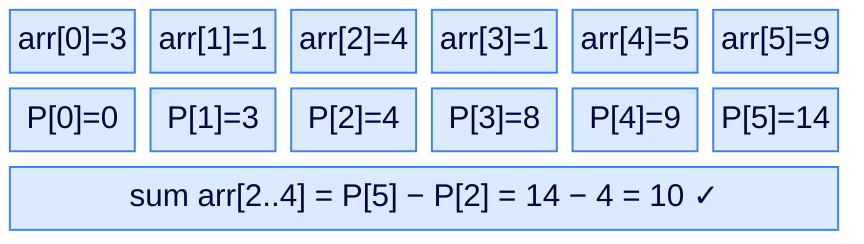
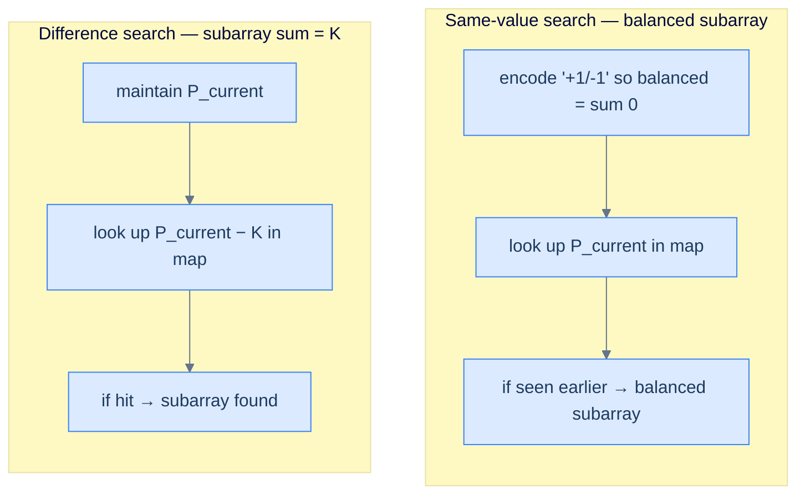
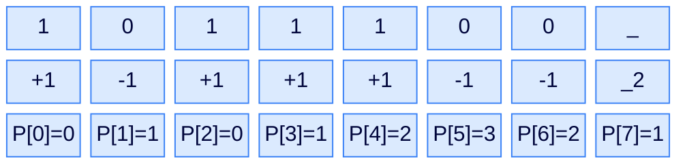
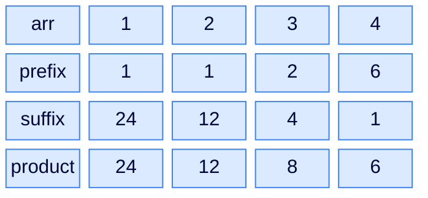

# 10. Pattern: Prefix Sum

## The Hook

You're tracking the running balance in a bank account. After every transaction, you write down the new balance. Now someone asks: "Was there ever a stretch of consecutive transactions that exactly cancelled out — net zero change?". Walking every pair of indices and summing the transactions between them is O(N²). Brutal for a million-row ledger.

But notice — *if the balance after transaction i equals the balance after transaction j*, then the transactions between them must have summed to zero. The two balances are identical; whatever happened in between cancelled out perfectly. Suddenly, "find a zero-sum stretch" becomes "find any two equal balances" — and that's a one-pass scan with a hash map.

That's the **prefix-sum + hash** pattern. Where sliding windows fail (negatives! non-monotonic conditions!), prefix sums step in. The trick is brutal in its elegance: convert "*does some subarray sum to S?*" into "*do two prefix sums differ by S?*" — and a hash map of prefix sums turns *that* into O(1) per element. Subarray-sum-equals-K, balanced binary subarray, equilibrium points, zero-sum stretches, longest-with-property — every one of them is a small twist on the same idea.

This is the last hash-table pattern in the section, and it's the one that finishes the toolkit. Once you internalise *"subarray sum = difference of prefix sums"*, you'll start seeing it in problems that don't even mention sums.

---

## Table of contents

1. [Understanding the prefix-sum pattern](#understanding-the-prefix-sum-pattern)
2. [Identifying the prefix-sum pattern](#identifying-the-prefix-sum-pattern)
3. [First equilibrium point](#first-equilibrium-point)
4. [Self excluded array product](#self-excluded-array-product)
5. [Balanced binary subarray](#balanced-binary-subarray)
6. [Zero sum subarrays](#zero-sum-subarrays)

***

# Understanding the prefix-sum pattern

The **prefix sum** of an array `arr` at index `i` is the sum of all elements from `arr[0]` through `arr[i]`, inclusive. Define `P[0] = 0` and `P[i] = arr[0] + arr[1] + ... + arr[i-1]` for `i ≥ 1`. With this convention, the sum of any subarray `arr[l..r]` equals **`P[r+1] − P[l]`** — a single subtraction once the prefix sums are computed.



<p align="center"><strong>Prefix sums in action — once <code>P</code> is built, any subarray sum is <em>one subtraction</em>. Every subarray-sum question becomes a question about <em>differences</em> between prefix sums, which is exactly the kind of question a hash map answers in O(1).</strong></p>

The hash-map combination is the magic. Walking the array left-to-right while maintaining the running prefix sum, at each index we ask: *"is there an earlier prefix sum that, when subtracted from mine, gives the target?"* If we keep a hash map `{prefixSum → index}` (or list of indices), the answer is a single lookup — O(1) per index, O(N) overall.

## Prefix-sum technique

Two flavours of the technique come up over and over:

- **Difference search** — given target `K`, find subarrays summing to `K`. Iterate while maintaining `P` and a map `{prefixSum → index/count}`. At each step, look up `P_current − K`; if it exists, we've found a subarray.
- **Same-value search** — given a property "subarray X is balanced" (zero-sum, equal 0s and 1s, etc.), encode the property so that "balanced" means *the same prefix value appears twice*. Iterate maintaining `P` and `{prefixSum → first-index}`; whenever `P_current` reappears, the slice between the two indices is balanced.



<p align="center"><strong>Two flavours of the prefix-sum trick — both convert a hard subarray question into a fast lookup. The difference-search flavour solves "sum equals K"; the same-value-search flavour solves "balanced/zero-net" via clever encoding.</strong></p>

## Algorithm — generic difference-search version

> **Algorithm**
>
> -   **Step 1:** Initialise `prefixSum = 0` and `map = {0: -1}` (the empty prefix has sum 0 and notional "index −1").
> -   **Step 2:** For `i` from 0 to `n − 1`:
>     -   `prefixSum += arr[i]`
>     -   If `prefixSum − K` is a key of `map`, the subarray `arr[map[prefixSum−K]+1 .. i]` sums to K.
>     -   Insert `prefixSum → i` into `map` (if not already there, depending on whether you want longest/first/count).

The base case `map[0] = -1` is what handles "the entire prefix from index 0 sums to K" — without it, you'd miss subarrays that start at index 0. *That is the single most common bug in prefix-sum code; if your tests show "off by one starting at index 0", check this line.*

## Implementation

A concrete example: count how many subarrays sum to K (a closely related variant of the longest-subarray problem from Lesson 9).

<div class="lang-tabs">

```python,editable
from collections import defaultdict

def count_subarrays_with_sum_k(arr, k):
    # Map prefix-sum → number of times it has appeared so far.
    seen = defaultdict(int); seen[0] = 1   # empty-prefix base case
    prefix = 0; count = 0
    for x in arr:
        prefix += x
        # Any earlier prefix equal to (prefix - k) gives a subarray summing to k
        count += seen[prefix - k]
        seen[prefix] += 1
    return count

print(count_subarrays_with_sum_k([1, 1, 1], 2))           # 2
print(count_subarrays_with_sum_k([3, 4, 7, 2, -3, 1, 4, 2], 7))   # 4
```

```java,editable
import java.util.*;

public class Main {
    static int countSubarraysWithSumK(int[] arr, int k) {
        Map<Integer, Integer> seen = new HashMap<>();
        seen.put(0, 1);
        int prefix = 0, count = 0;
        for (int x : arr) {
            prefix += x;
            count += seen.getOrDefault(prefix - k, 0);
            seen.merge(prefix, 1, Integer::sum);
        }
        return count;
    }
    public static void main(String[] args) {
        System.out.println(countSubarraysWithSumK(new int[]{1,1,1}, 2));         // 2
        System.out.println(countSubarraysWithSumK(new int[]{3,4,7,2,-3,1,4,2}, 7)); // 4
    }
}
```

```c,editable
#include <stdio.h>

// O(n) using a small linear-probing hash map (capacity power of 2).
#define CAP 4096
typedef struct { int key; int val; int used; } Slot;
static Slot table[CAP];

unsigned hash_int(int k) { unsigned x = (unsigned)k * 2654435761u; return x; }

int hm_get(int key) {
    unsigned i = hash_int(key) & (CAP - 1);
    for (int t = 0; t < CAP; t++) {
        if (!table[i].used) return 0;
        if (table[i].key == key) return table[i].val;
        i = (i + 1) & (CAP - 1);
    }
    return 0;
}
void hm_inc(int key) {
    unsigned i = hash_int(key) & (CAP - 1);
    while (table[i].used && table[i].key != key) i = (i + 1) & (CAP - 1);
    if (!table[i].used) { table[i].used = 1; table[i].key = key; table[i].val = 0; }
    table[i].val++;
}
void hm_clear() { for (int i = 0; i < CAP; i++) table[i].used = 0; }

int count_subarrays_with_sum_k(int *arr, int n, int k) {
    hm_clear(); hm_inc(0);
    int prefix = 0, count = 0;
    for (int i = 0; i < n; i++) {
        prefix += arr[i];
        count += hm_get(prefix - k);
        hm_inc(prefix);
    }
    return count;
}

int main() {
    int a1[] = {1,1,1}, a2[] = {3,4,7,2,-3,1,4,2};
    printf("%d\n", count_subarrays_with_sum_k(a1, 3, 2));
    printf("%d\n", count_subarrays_with_sum_k(a2, 8, 7));
}
```

```cpp,editable
#include <iostream>
#include <unordered_map>
#include <vector>

int countSubarraysWithSumK(std::vector<int> &arr, int k) {
    std::unordered_map<int, int> seen; seen[0] = 1;
    int prefix = 0, count = 0;
    for (int x : arr) {
        prefix += x;
        if (seen.count(prefix - k)) count += seen[prefix - k];
        seen[prefix]++;
    }
    return count;
}

int main() {
    std::vector<int> a1 = {1,1,1}, a2 = {3,4,7,2,-3,1,4,2};
    std::cout << countSubarraysWithSumK(a1, 2) << "\n"
              << countSubarraysWithSumK(a2, 7) << "\n";
}
```

```scala,editable
import scala.collection.mutable

def countSubarraysWithSumK(arr: Array[Int], k: Int): Int = {
  val seen = mutable.Map[Int, Int]().withDefaultValue(0); seen(0) = 1
  var prefix = 0; var count = 0
  for (x <- arr) {
    prefix += x
    count += seen(prefix - k)
    seen(prefix) += 1
  }
  count
}

object Main extends App {
  println(countSubarraysWithSumK(Array(1,1,1), 2))
  println(countSubarraysWithSumK(Array(3,4,7,2,-3,1,4,2), 7))
}
```

```javascript,editable
function countSubarraysWithSumK(arr, k) {
    const seen = new Map(); seen.set(0, 1);
    let prefix = 0, count = 0;
    for (const x of arr) {
        prefix += x;
        count += seen.get(prefix - k) || 0;
        seen.set(prefix, (seen.get(prefix) || 0) + 1);
    }
    return count;
}
console.log(countSubarraysWithSumK([1,1,1], 2));
console.log(countSubarraysWithSumK([3,4,7,2,-3,1,4,2], 7));
```

```typescript,editable
function countSubarraysWithSumK(arr: number[], k: number): number {
    const seen = new Map<number, number>(); seen.set(0, 1);
    let prefix = 0, count = 0;
    for (const x of arr) {
        prefix += x;
        count += seen.get(prefix - k) || 0;
        seen.set(prefix, (seen.get(prefix) || 0) + 1);
    }
    return count;
}
console.log(countSubarraysWithSumK([1,1,1], 2));
```

```go,editable
package main

import "fmt"

func countSubarraysWithSumK(arr []int, k int) int {
    seen := make(map[int]int); seen[0] = 1
    prefix, count := 0, 0
    for _, x := range arr {
        prefix += x
        count += seen[prefix - k]
        seen[prefix]++
    }
    return count
}

func main() {
    fmt.Println(countSubarraysWithSumK([]int{1,1,1}, 2))
    fmt.Println(countSubarraysWithSumK([]int{3,4,7,2,-3,1,4,2}, 7))
}
```

```kotlin,editable
fun countSubarraysWithSumK(arr: IntArray, k: Int): Int {
    val seen = HashMap<Int, Int>(); seen[0] = 1
    var prefix = 0; var count = 0
    for (x in arr) {
        prefix += x
        count += seen[prefix - k] ?: 0
        seen[prefix] = (seen[prefix] ?: 0) + 1
    }
    return count
}

fun main() {
    println(countSubarraysWithSumK(intArrayOf(1,1,1), 2))
    println(countSubarraysWithSumK(intArrayOf(3,4,7,2,-3,1,4,2), 7))
}
```

```rust,editable
use std::collections::HashMap;

fn count_subarrays_with_sum_k(arr: &[i32], k: i32) -> i32 {
    let mut seen: HashMap<i32, i32> = HashMap::new();
    seen.insert(0, 1);
    let (mut prefix, mut count) = (0i32, 0i32);
    for &x in arr {
        prefix += x;
        count += seen.get(&(prefix - k)).copied().unwrap_or(0);
        *seen.entry(prefix).or_insert(0) += 1;
    }
    count
}

fn main() {
    println!("{}", count_subarrays_with_sum_k(&[1,1,1], 2));
    println!("{}", count_subarrays_with_sum_k(&[3,4,7,2,-3,1,4,2], 7));
}
```

</div>

***

# Identifying the prefix-sum pattern

This pattern fits problems where:

1. The answer involves a **subarray sum** (or a property reducible to a subarray sum, e.g. counts).
2. The array can contain **negatives** or **zeros** (which break sliding-window monotonicity).
3. The query is "exists / count / longest subarray with sum X" or "subarray that balances some property".

**Template:**
> Walk the array maintaining a running prefix value (sum, signed count, balance). At each step, query a hash map of past prefix values to find any earlier index that turns the current state into a solution. Update the map; repeat.

If the problem can be rephrased as "two prefix values that differ by D" (or "two prefix values that are equal"), this template fits.

## Example — equal 0s and 1s

> **Problem:** Given a binary array, find the longest subarray with an equal number of 0s and 1s.

The encoding trick: **treat 0 as −1 and 1 as +1**. Now "equal counts" becomes "subarray sum = 0", which becomes "two prefix sums are equal" — and the same-value-search flavour kicks in.



<p align="center"><strong>Equal 0s/1s via re-encoding — turning <code>0 → −1</code> makes "equal counts" equivalent to "prefix-sum difference is 0". The longest subarray with equal counts is the longest gap between two equal prefix sums.</strong></p>

> *Predict before reading on — in the encoded array <code>+1, -1, +1, +1, +1, -1, -1</code> with prefix sums <code>0, 1, 0, 1, 2, 3, 2</code>, prefix value <code>1</code> first appears at index 1 and reappears at index 3 (length 2) and index 7 (length 6). Prefix value <code>2</code> first appears at index 4 and reappears at index 6 (length 2). The best run is length 6 — that's our answer for "balanced binary subarray".*

## Example problems

> -   First equilibrium point — split point where left sum equals right sum
> -   Self excluded array product — every position holds the product of all *other* elements
> -   Balanced binary subarray — longest run with equal 0s and 1s
> -   Zero sum subarrays — all subarrays that sum to zero

***

# First equilibrium point

## Problem Statement

Given an array `arr`, return the first index `i` such that `sum(arr[0..i-1]) == sum(arr[i+1..n-1])`. Return `-1` if no such index exists.

### Example 1
> -   **Input:** `arr = [1, 3, 5, 2, 2]` → **Output:** `2` (sum left = sum right = 4)

### Example 2
> -   **Input:** `arr = [5, 5, 5, 5, 5]` → **Output:** `2` (sum left = sum right = 10)

### Example 3
> -   **Input:** `arr = [1, 3, 5, 10]` → **Output:** `-1`

## Approach

Compute the total `T = sum(arr)`. Walk left to right with a running `leftSum`. At index `i`, the sum of everything to the right is `T − leftSum − arr[i]`. The equilibrium condition reduces to `leftSum == T − leftSum − arr[i]`. One pass after one warm-up — **O(N)**.

## Solution

<div class="lang-tabs">

```python,editable
def first_equilibrium_point(arr):
    total = sum(arr); left = 0
    for i, x in enumerate(arr):
        # right_sum = total - left - x
        if left == total - left - x:
            return i
        left += x
    return -1

print(first_equilibrium_point([1,3,5,2,2]))   # 2
print(first_equilibrium_point([5,5,5,5,5]))   # 2
print(first_equilibrium_point([1,3,5,10]))    # -1
```

```java,editable
public class Main {
    static int firstEquilibriumPoint(int[] arr) {
        int total = 0; for (int x : arr) total += x;
        int left = 0;
        for (int i = 0; i < arr.length; i++) {
            if (left == total - left - arr[i]) return i;
            left += arr[i];
        }
        return -1;
    }
    public static void main(String[] args) {
        System.out.println(firstEquilibriumPoint(new int[]{1,3,5,2,2}));
        System.out.println(firstEquilibriumPoint(new int[]{5,5,5,5,5}));
        System.out.println(firstEquilibriumPoint(new int[]{1,3,5,10}));
    }
}
```

```c,editable
#include <stdio.h>

int first_equilibrium_point(int *arr, int n) {
    int total = 0; for (int i = 0; i < n; i++) total += arr[i];
    int left = 0;
    for (int i = 0; i < n; i++) {
        if (left == total - left - arr[i]) return i;
        left += arr[i];
    }
    return -1;
}

int main() {
    int a1[] = {1,3,5,2,2}, a2[] = {5,5,5,5,5}, a3[] = {1,3,5,10};
    printf("%d %d %d\n",
        first_equilibrium_point(a1, 5),
        first_equilibrium_point(a2, 5),
        first_equilibrium_point(a3, 4));
}
```

```cpp,editable
#include <iostream>
#include <vector>
#include <numeric>

int firstEquilibriumPoint(std::vector<int> &arr) {
    int total = std::accumulate(arr.begin(), arr.end(), 0);
    int left = 0;
    for (int i = 0; i < (int)arr.size(); i++) {
        if (left == total - left - arr[i]) return i;
        left += arr[i];
    }
    return -1;
}

int main() {
    std::vector<int> a = {1,3,5,2,2};
    std::cout << firstEquilibriumPoint(a) << "\n";
}
```

```scala,editable
def firstEquilibriumPoint(arr: Array[Int]): Int = {
  val total = arr.sum
  var left = 0
  for (i <- arr.indices) {
    if (left == total - left - arr(i)) return i
    left += arr(i)
  }
  -1
}

object Main extends App {
  println(firstEquilibriumPoint(Array(1,3,5,2,2)))
  println(firstEquilibriumPoint(Array(5,5,5,5,5)))
  println(firstEquilibriumPoint(Array(1,3,5,10)))
}
```

```javascript,editable
function firstEquilibriumPoint(arr) {
    const total = arr.reduce((a, b) => a + b, 0);
    let left = 0;
    for (let i = 0; i < arr.length; i++) {
        if (left === total - left - arr[i]) return i;
        left += arr[i];
    }
    return -1;
}
console.log(firstEquilibriumPoint([1,3,5,2,2]));
console.log(firstEquilibriumPoint([5,5,5,5,5]));
console.log(firstEquilibriumPoint([1,3,5,10]));
```

```typescript,editable
function firstEquilibriumPoint(arr: number[]): number {
    const total = arr.reduce((a, b) => a + b, 0);
    let left = 0;
    for (let i = 0; i < arr.length; i++) {
        if (left === total - left - arr[i]) return i;
        left += arr[i];
    }
    return -1;
}
console.log(firstEquilibriumPoint([1,3,5,2,2]));
```

```go,editable
package main

import "fmt"

func firstEquilibriumPoint(arr []int) int {
    total := 0; for _, x := range arr { total += x }
    left := 0
    for i, x := range arr {
        if left == total - left - x { return i }
        left += x
    }
    return -1
}

func main() {
    fmt.Println(firstEquilibriumPoint([]int{1,3,5,2,2}))
    fmt.Println(firstEquilibriumPoint([]int{5,5,5,5,5}))
    fmt.Println(firstEquilibriumPoint([]int{1,3,5,10}))
}
```

```kotlin,editable
fun firstEquilibriumPoint(arr: IntArray): Int {
    val total = arr.sum(); var left = 0
    for (i in arr.indices) {
        if (left == total - left - arr[i]) return i
        left += arr[i]
    }
    return -1
}

fun main() {
    println(firstEquilibriumPoint(intArrayOf(1,3,5,2,2)))
    println(firstEquilibriumPoint(intArrayOf(5,5,5,5,5)))
    println(firstEquilibriumPoint(intArrayOf(1,3,5,10)))
}
```

```rust,editable
fn first_equilibrium_point(arr: &[i32]) -> i32 {
    let total: i32 = arr.iter().sum();
    let mut left = 0;
    for (i, &x) in arr.iter().enumerate() {
        if left == total - left - x { return i as i32; }
        left += x;
    }
    -1
}

fn main() {
    println!("{} {} {}",
        first_equilibrium_point(&[1,3,5,2,2]),
        first_equilibrium_point(&[5,5,5,5,5]),
        first_equilibrium_point(&[1,3,5,10]));
}
```

</div>

***

# Self excluded array product

## Problem Statement

Given `arr`, return an array `product` where `product[i]` equals the product of all elements **except** `arr[i]`. Solve in `O(n)` and **without division**.

### Example 1
> -   **Input:** `[1, 2, 3, 4]` → **Output:** `[24, 12, 8, 6]`

### Example 2
> -   **Input:** `[2, 3, 0]` → **Output:** `[0, 0, 6]`

### Example 3
> -   **Input:** `[3, 4]` → **Output:** `[4, 3]`

## Approach

This is the prefix-sum trick generalised to **prefix products**. Build two arrays:

- `prefix[i] = arr[0] * arr[1] * ... * arr[i-1]` (product of everything strictly before `i`).
- `suffix[i] = arr[i+1] * arr[i+2] * ... * arr[n-1]` (product of everything strictly after `i`).

Then `product[i] = prefix[i] * suffix[i]`. Two passes (one left-to-right, one right-to-left), no division, O(N) time and O(N) space (which can be optimised to O(1) extra by computing one direction in-place).



<p align="center"><strong>Self-excluded product — prefix product holds "everything before me", suffix product holds "everything after me", and their pointwise product is the answer. The technique is prefix-sum's multiplicative cousin.</strong></p>

## Solution

<div class="lang-tabs">

```python,editable
def self_excluded_array_product(arr):
    n = len(arr)
    prefix = [1] * n
    suffix = [1] * n
    # prefix[i] = product of arr[0..i-1]
    for i in range(1, n):
        prefix[i] = prefix[i-1] * arr[i-1]
    # suffix[i] = product of arr[i+1..n-1]
    for i in range(n-2, -1, -1):
        suffix[i] = suffix[i+1] * arr[i+1]
    return [prefix[i] * suffix[i] for i in range(n)]

print(self_excluded_array_product([1,2,3,4]))   # [24, 12, 8, 6]
print(self_excluded_array_product([2,3,0]))     # [0, 0, 6]
print(self_excluded_array_product([3,4]))       # [4, 3]
```

```java,editable
public class Main {
    static int[] selfExcludedArrayProduct(int[] arr) {
        int n = arr.length;
        int[] prefix = new int[n], suffix = new int[n], result = new int[n];
        prefix[0] = 1;
        for (int i = 1; i < n; i++) prefix[i] = prefix[i-1] * arr[i-1];
        suffix[n-1] = 1;
        for (int i = n-2; i >= 0; i--) suffix[i] = suffix[i+1] * arr[i+1];
        for (int i = 0; i < n; i++) result[i] = prefix[i] * suffix[i];
        return result;
    }
    public static void main(String[] args) {
        System.out.println(java.util.Arrays.toString(selfExcludedArrayProduct(new int[]{1,2,3,4})));
        System.out.println(java.util.Arrays.toString(selfExcludedArrayProduct(new int[]{2,3,0})));
        System.out.println(java.util.Arrays.toString(selfExcludedArrayProduct(new int[]{3,4})));
    }
}
```

```c,editable
#include <stdio.h>
#include <stdlib.h>

int* self_excluded_array_product(int *arr, int n) {
    int *prefix = malloc(sizeof(int) * n);
    int *suffix = malloc(sizeof(int) * n);
    int *result = malloc(sizeof(int) * n);
    prefix[0] = 1;
    for (int i = 1; i < n; i++) prefix[i] = prefix[i-1] * arr[i-1];
    suffix[n-1] = 1;
    for (int i = n-2; i >= 0; i--) suffix[i] = suffix[i+1] * arr[i+1];
    for (int i = 0; i < n; i++) result[i] = prefix[i] * suffix[i];
    free(prefix); free(suffix);
    return result;
}

int main() {
    int a[] = {1,2,3,4};
    int *r = self_excluded_array_product(a, 4);
    for (int i = 0; i < 4; i++) printf("%d ", r[i]); printf("\n");
    free(r);
}
```

```cpp,editable
#include <iostream>
#include <vector>

std::vector<int> selfExcludedArrayProduct(std::vector<int> &arr) {
    int n = (int)arr.size();
    std::vector<int> prefix(n, 1), suffix(n, 1), result(n);
    for (int i = 1; i < n; i++) prefix[i] = prefix[i-1] * arr[i-1];
    for (int i = n-2; i >= 0; i--) suffix[i] = suffix[i+1] * arr[i+1];
    for (int i = 0; i < n; i++) result[i] = prefix[i] * suffix[i];
    return result;
}

int main() {
    std::vector<int> a = {1,2,3,4};
    for (int x : selfExcludedArrayProduct(a)) std::cout << x << " "; std::cout << "\n";
}
```

```scala,editable
def selfExcludedArrayProduct(arr: Array[Int]): Array[Int] = {
  val n = arr.length
  val prefix = Array.fill(n)(1); val suffix = Array.fill(n)(1)
  for (i <- 1 until n) prefix(i) = prefix(i-1) * arr(i-1)
  for (i <- (0 until n-1).reverse) suffix(i) = suffix(i+1) * arr(i+1)
  Array.tabulate(n)(i => prefix(i) * suffix(i))
}

object Main extends App {
  println(selfExcludedArrayProduct(Array(1,2,3,4)).mkString(", "))
  println(selfExcludedArrayProduct(Array(2,3,0)).mkString(", "))
  println(selfExcludedArrayProduct(Array(3,4)).mkString(", "))
}
```

```javascript,editable
function selfExcludedArrayProduct(arr) {
    const n = arr.length;
    const prefix = new Array(n).fill(1);
    const suffix = new Array(n).fill(1);
    for (let i = 1; i < n; i++) prefix[i] = prefix[i-1] * arr[i-1];
    for (let i = n-2; i >= 0; i--) suffix[i] = suffix[i+1] * arr[i+1];
    return prefix.map((p, i) => p * suffix[i]);
}
console.log(selfExcludedArrayProduct([1,2,3,4]));
console.log(selfExcludedArrayProduct([2,3,0]));
console.log(selfExcludedArrayProduct([3,4]));
```

```typescript,editable
function selfExcludedArrayProduct(arr: number[]): number[] {
    const n = arr.length;
    const prefix = new Array(n).fill(1);
    const suffix = new Array(n).fill(1);
    for (let i = 1; i < n; i++) prefix[i] = prefix[i-1] * arr[i-1];
    for (let i = n-2; i >= 0; i--) suffix[i] = suffix[i+1] * arr[i+1];
    return prefix.map((p, i) => p * suffix[i]);
}
console.log(selfExcludedArrayProduct([1,2,3,4]));
```

```go,editable
package main

import "fmt"

func selfExcludedArrayProduct(arr []int) []int {
    n := len(arr)
    prefix := make([]int, n); suffix := make([]int, n); result := make([]int, n)
    prefix[0] = 1
    for i := 1; i < n; i++ { prefix[i] = prefix[i-1] * arr[i-1] }
    suffix[n-1] = 1
    for i := n - 2; i >= 0; i-- { suffix[i] = suffix[i+1] * arr[i+1] }
    for i := 0; i < n; i++ { result[i] = prefix[i] * suffix[i] }
    return result
}

func main() {
    fmt.Println(selfExcludedArrayProduct([]int{1,2,3,4}))
    fmt.Println(selfExcludedArrayProduct([]int{2,3,0}))
    fmt.Println(selfExcludedArrayProduct([]int{3,4}))
}
```

```kotlin,editable
fun selfExcludedArrayProduct(arr: IntArray): IntArray {
    val n = arr.size
    val prefix = IntArray(n) { 1 }; val suffix = IntArray(n) { 1 }
    for (i in 1 until n) prefix[i] = prefix[i-1] * arr[i-1]
    for (i in n-2 downTo 0)   suffix[i] = suffix[i+1] * arr[i+1]
    return IntArray(n) { i -> prefix[i] * suffix[i] }
}

fun main() {
    println(selfExcludedArrayProduct(intArrayOf(1,2,3,4)).toList())
    println(selfExcludedArrayProduct(intArrayOf(2,3,0)).toList())
    println(selfExcludedArrayProduct(intArrayOf(3,4)).toList())
}
```

```rust,editable
fn self_excluded_array_product(arr: &[i32]) -> Vec<i32> {
    let n = arr.len();
    let mut prefix = vec![1i32; n];
    let mut suffix = vec![1i32; n];
    for i in 1..n { prefix[i] = prefix[i-1] * arr[i-1]; }
    for i in (0..n-1).rev() { suffix[i] = suffix[i+1] * arr[i+1]; }
    (0..n).map(|i| prefix[i] * suffix[i]).collect()
}

fn main() {
    println!("{:?}", self_excluded_array_product(&[1,2,3,4]));
    println!("{:?}", self_excluded_array_product(&[2,3,0]));
    println!("{:?}", self_excluded_array_product(&[3,4]));
}
```

</div>

***

# Balanced binary subarray

## Problem Statement

Given a binary array `arr` (only 0s and 1s), return the length of the longest subarray with an **equal** number of 0s and 1s.

### Example 1
> -   **Input:** `[1, 0, 1, 1, 1, 0, 0]` → **Output:** `6` (indices 1..6)

### Example 2
> -   **Input:** `[0, 0, 1, 1, 0]` → **Output:** `4`

### Example 3
> -   **Input:** `[1, 1, 1, 1]` → **Output:** `0`

## Approach

The encoding trick: **0 → −1, 1 → +1**. Now "equal 0s and 1s" becomes "subarray sums to 0", which becomes "two prefix sums are equal". Walk the array maintaining `prefixSum`; for each new value, check if it has been seen before. If yes, the subarray between the first occurrence and now has sum 0 → equal counts. Track the max length.

The `prefixSumIndex[0] = -1` base case handles subarrays starting at index 0.

## Solution

<div class="lang-tabs">

```python,editable
def balanced_binary_subarray(arr):
    first_index = {0: -1}    # base case: empty prefix has sum 0 at index -1
    prefix = 0; max_len = 0
    for i, x in enumerate(arr):
        prefix += -1 if x == 0 else 1
        if prefix in first_index:
            # subarray (first_index[prefix] + 1 .. i) has sum 0
            max_len = max(max_len, i - first_index[prefix])
        else:
            first_index[prefix] = i
    return max_len

print(balanced_binary_subarray([1,0,1,1,1,0,0]))   # 6
print(balanced_binary_subarray([0,0,1,1,0]))       # 4
print(balanced_binary_subarray([1,1,1,1]))         # 0
```

```java,editable
import java.util.*;

public class Main {
    static int balancedBinarySubarray(int[] arr) {
        Map<Integer, Integer> firstIndex = new HashMap<>();
        firstIndex.put(0, -1);
        int prefix = 0, max = 0;
        for (int i = 0; i < arr.length; i++) {
            prefix += (arr[i] == 0 ? -1 : 1);
            if (firstIndex.containsKey(prefix))
                max = Math.max(max, i - firstIndex.get(prefix));
            else
                firstIndex.put(prefix, i);
        }
        return max;
    }
    public static void main(String[] args) {
        System.out.println(balancedBinarySubarray(new int[]{1,0,1,1,1,0,0}));
        System.out.println(balancedBinarySubarray(new int[]{0,0,1,1,0}));
        System.out.println(balancedBinarySubarray(new int[]{1,1,1,1}));
    }
}
```

```c,editable
#include <stdio.h>

// Prefix sum can be in [-n, n], so shift by n to use as array index
int balanced_binary_subarray(int *arr, int n) {
    int *firstIndex = malloc(sizeof(int) * (2*n + 1));
    for (int i = 0; i < 2*n + 1; i++) firstIndex[i] = -2;     // -2 = "not seen"
    firstIndex[n] = -1;                                       // prefix 0 at index -1
    int prefix = 0, max = 0;
    for (int i = 0; i < n; i++) {
        prefix += (arr[i] == 0 ? -1 : 1);
        int idx = prefix + n;
        if (firstIndex[idx] != -2) {
            int len = i - firstIndex[idx];
            if (len > max) max = len;
        } else firstIndex[idx] = i;
    }
    free(firstIndex);
    return max;
}

#include <stdlib.h>
int main() {
    int a1[] = {1,0,1,1,1,0,0}, a2[] = {0,0,1,1,0}, a3[] = {1,1,1,1};
    printf("%d %d %d\n",
        balanced_binary_subarray(a1, 7),
        balanced_binary_subarray(a2, 5),
        balanced_binary_subarray(a3, 4));
}
```

```cpp,editable
#include <iostream>
#include <unordered_map>
#include <vector>

int balancedBinarySubarray(std::vector<int> &arr) {
    std::unordered_map<int, int> firstIndex; firstIndex[0] = -1;
    int prefix = 0, max = 0;
    for (int i = 0; i < (int)arr.size(); i++) {
        prefix += (arr[i] == 0 ? -1 : 1);
        if (firstIndex.count(prefix))
            max = std::max(max, i - firstIndex[prefix]);
        else
            firstIndex[prefix] = i;
    }
    return max;
}

int main() {
    std::vector<int> a = {1,0,1,1,1,0,0};
    std::cout << balancedBinarySubarray(a) << "\n";
}
```

```scala,editable
import scala.collection.mutable

def balancedBinarySubarray(arr: Array[Int]): Int = {
  val firstIndex = mutable.Map[Int, Int](0 -> -1)
  var prefix = 0; var max = 0
  for (i <- arr.indices) {
    prefix += (if (arr(i) == 0) -1 else 1)
    firstIndex.get(prefix) match {
      case Some(j) => if (i - j > max) max = i - j
      case None    => firstIndex(prefix) = i
    }
  }
  max
}

object Main extends App {
  println(balancedBinarySubarray(Array(1,0,1,1,1,0,0)))
  println(balancedBinarySubarray(Array(0,0,1,1,0)))
  println(balancedBinarySubarray(Array(1,1,1,1)))
}
```

```javascript,editable
function balancedBinarySubarray(arr) {
    const firstIndex = new Map(); firstIndex.set(0, -1);
    let prefix = 0, max = 0;
    for (let i = 0; i < arr.length; i++) {
        prefix += (arr[i] === 0 ? -1 : 1);
        if (firstIndex.has(prefix))
            max = Math.max(max, i - firstIndex.get(prefix));
        else
            firstIndex.set(prefix, i);
    }
    return max;
}
console.log(balancedBinarySubarray([1,0,1,1,1,0,0]));   // 6
console.log(balancedBinarySubarray([0,0,1,1,0]));       // 4
console.log(balancedBinarySubarray([1,1,1,1]));         // 0
```

```typescript,editable
function balancedBinarySubarray(arr: number[]): number {
    const firstIndex = new Map<number, number>(); firstIndex.set(0, -1);
    let prefix = 0, max = 0;
    for (let i = 0; i < arr.length; i++) {
        prefix += (arr[i] === 0 ? -1 : 1);
        if (firstIndex.has(prefix))
            max = Math.max(max, i - firstIndex.get(prefix)!);
        else
            firstIndex.set(prefix, i);
    }
    return max;
}
console.log(balancedBinarySubarray([1,0,1,1,1,0,0]));
```

```go,editable
package main

import "fmt"

func balancedBinarySubarray(arr []int) int {
    firstIndex := map[int]int{0: -1}
    prefix, max := 0, 0
    for i := 0; i < len(arr); i++ {
        if arr[i] == 0 { prefix-- } else { prefix++ }
        if j, ok := firstIndex[prefix]; ok {
            if i - j > max { max = i - j }
        } else { firstIndex[prefix] = i }
    }
    return max
}

func main() {
    fmt.Println(balancedBinarySubarray([]int{1,0,1,1,1,0,0}))
    fmt.Println(balancedBinarySubarray([]int{0,0,1,1,0}))
    fmt.Println(balancedBinarySubarray([]int{1,1,1,1}))
}
```

```kotlin,editable
fun balancedBinarySubarray(arr: IntArray): Int {
    val firstIndex = HashMap<Int, Int>(); firstIndex[0] = -1
    var prefix = 0; var max = 0
    for (i in arr.indices) {
        prefix += if (arr[i] == 0) -1 else 1
        val j = firstIndex[prefix]
        if (j != null) { if (i - j > max) max = i - j }
        else firstIndex[prefix] = i
    }
    return max
}

fun main() {
    println(balancedBinarySubarray(intArrayOf(1,0,1,1,1,0,0)))
    println(balancedBinarySubarray(intArrayOf(0,0,1,1,0)))
    println(balancedBinarySubarray(intArrayOf(1,1,1,1)))
}
```

```rust,editable
use std::collections::HashMap;

fn balanced_binary_subarray(arr: &[i32]) -> i32 {
    let mut first_index: HashMap<i32, i32> = HashMap::new();
    first_index.insert(0, -1);
    let (mut prefix, mut max) = (0i32, 0i32);
    for i in 0..arr.len() {
        prefix += if arr[i] == 0 { -1 } else { 1 };
        if let Some(&j) = first_index.get(&prefix) {
            if i as i32 - j > max { max = i as i32 - j; }
        } else {
            first_index.insert(prefix, i as i32);
        }
    }
    max
}

fn main() {
    println!("{}", balanced_binary_subarray(&[1,0,1,1,1,0,0]));
    println!("{}", balanced_binary_subarray(&[0,0,1,1,0]));
    println!("{}", balanced_binary_subarray(&[1,1,1,1]));
}
```

</div>

***

# Zero sum subarrays

## Problem Statement

Given an array `arr`, return the start/end indices of **every** subarray that sums to `0`.

### Example 1
> -   **Input:** `[6, 3, -1, -3, 4, -2, 2, 4, 6, -12, -7]`
> -   **Output:** `[[2, 4], [2, 6], [5, 6], [6, 9], [0, 10]]`

### Example 2
> -   **Input:** `[1, 2, 3, 4, 0]` → **Output:** `[[4, 4]]`

### Example 3
> -   **Input:** `[1, 2, 3]` → **Output:** `[]`

## Approach

Same prefix-sum trick. Two indices `i < j` with `P[i] == P[j+1]` means `arr[i..j]` sums to zero. So maintain a hash map `{prefixSum → list of indices where it appeared}`; whenever we see a prefix sum that has appeared before, every previous occurrence is the *start − 1* of a zero-sum subarray ending at the current index.

The base case `prefixSumIndices[0] = [-1]` lets us catch zero-sum subarrays that start at index 0.

## Solution

<div class="lang-tabs">

```python,editable
from collections import defaultdict

def zero_sum_subarrays(arr):
    indices = defaultdict(list); indices[0].append(-1)
    prefix = 0; out = []
    for i, x in enumerate(arr):
        prefix += x
        if prefix in indices:
            for j in indices[prefix]:
                out.append([j + 1, i])
        indices[prefix].append(i)
    return out

print(zero_sum_subarrays([6, 3, -1, -3, 4, -2, 2, 4, 6, -12, -7]))
print(zero_sum_subarrays([1, 2, 3, 4, 0]))
print(zero_sum_subarrays([1, 2, 3]))
```

```java,editable
import java.util.*;

public class Main {
    static List<int[]> zeroSumSubarrays(int[] arr) {
        Map<Integer, List<Integer>> indices = new HashMap<>();
        indices.computeIfAbsent(0, k -> new ArrayList<>()).add(-1);
        int prefix = 0; List<int[]> out = new ArrayList<>();
        for (int i = 0; i < arr.length; i++) {
            prefix += arr[i];
            if (indices.containsKey(prefix))
                for (int j : indices.get(prefix)) out.add(new int[]{j + 1, i});
            indices.computeIfAbsent(prefix, k -> new ArrayList<>()).add(i);
        }
        return out;
    }
    public static void main(String[] args) {
        var r = zeroSumSubarrays(new int[]{6,3,-1,-3,4,-2,2,4,6,-12,-7});
        for (int[] p : r) System.out.println("[" + p[0] + ", " + p[1] + "]");
    }
}
```

```c,editable
#include <stdio.h>
// O(n^2) for clarity in C — production code would use a hash map.
void zero_sum_subarrays(int *arr, int n) {
    for (int i = 0; i < n; i++) {
        int sum = 0;
        for (int j = i; j < n; j++) {
            sum += arr[j];
            if (sum == 0) printf("[%d, %d] ", i, j);
        }
    }
    printf("\n");
}

int main() {
    int a[] = {6,3,-1,-3,4,-2,2,4,6,-12,-7};
    zero_sum_subarrays(a, 11);
}
```

```cpp,editable
#include <iostream>
#include <unordered_map>
#include <vector>

std::vector<std::vector<int>> zeroSumSubarrays(std::vector<int> &arr) {
    std::unordered_map<int, std::vector<int>> indices;
    indices[0].push_back(-1);
    int prefix = 0;
    std::vector<std::vector<int>> out;
    for (int i = 0; i < (int)arr.size(); i++) {
        prefix += arr[i];
        if (indices.count(prefix))
            for (int j : indices[prefix]) out.push_back({j + 1, i});
        indices[prefix].push_back(i);
    }
    return out;
}

int main() {
    std::vector<int> a = {6,3,-1,-3,4,-2,2,4,6,-12,-7};
    for (auto &p : zeroSumSubarrays(a))
        std::cout << "[" << p[0] << ", " << p[1] << "]\n";
}
```

```scala,editable
import scala.collection.mutable

def zeroSumSubarrays(arr: Array[Int]): List[(Int, Int)] = {
  val indices = mutable.Map[Int, List[Int]]().withDefaultValue(Nil)
  indices(0) = List(-1)
  var prefix = 0
  val out = mutable.ArrayBuffer[(Int, Int)]()
  for (i <- arr.indices) {
    prefix += arr(i)
    indices(prefix).foreach(j => out += ((j + 1, i)))
    indices(prefix) = i :: indices(prefix)
  }
  out.toList
}

object Main extends App {
  println(zeroSumSubarrays(Array(6,3,-1,-3,4,-2,2,4,6,-12,-7)))
}
```

```javascript,editable
function zeroSumSubarrays(arr) {
    const indices = new Map(); indices.set(0, [-1]);
    let prefix = 0; const out = [];
    for (let i = 0; i < arr.length; i++) {
        prefix += arr[i];
        if (indices.has(prefix))
            for (const j of indices.get(prefix)) out.push([j + 1, i]);
        if (!indices.has(prefix)) indices.set(prefix, []);
        indices.get(prefix).push(i);
    }
    return out;
}
console.log(zeroSumSubarrays([6,3,-1,-3,4,-2,2,4,6,-12,-7]));
```

```typescript,editable
function zeroSumSubarrays(arr: number[]): number[][] {
    const indices = new Map<number, number[]>(); indices.set(0, [-1]);
    let prefix = 0; const out: number[][] = [];
    for (let i = 0; i < arr.length; i++) {
        prefix += arr[i];
        if (indices.has(prefix))
            for (const j of indices.get(prefix)!) out.push([j + 1, i]);
        if (!indices.has(prefix)) indices.set(prefix, []);
        indices.get(prefix)!.push(i);
    }
    return out;
}
console.log(zeroSumSubarrays([6,3,-1,-3,4,-2,2,4,6,-12,-7]));
```

```go,editable
package main

import "fmt"

func zeroSumSubarrays(arr []int) [][]int {
    indices := map[int][]int{0: {-1}}
    prefix := 0; out := [][]int{}
    for i := 0; i < len(arr); i++ {
        prefix += arr[i]
        if js, ok := indices[prefix]; ok {
            for _, j := range js { out = append(out, []int{j + 1, i}) }
        }
        indices[prefix] = append(indices[prefix], i)
    }
    return out
}

func main() {
    fmt.Println(zeroSumSubarrays([]int{6,3,-1,-3,4,-2,2,4,6,-12,-7}))
}
```

```kotlin,editable
fun zeroSumSubarrays(arr: IntArray): List<Pair<Int, Int>> {
    val indices = HashMap<Int, MutableList<Int>>()
    indices[0] = mutableListOf(-1)
    var prefix = 0
    val out = mutableListOf<Pair<Int, Int>>()
    for (i in arr.indices) {
        prefix += arr[i]
        indices[prefix]?.forEach { j -> out.add(j + 1 to i) }
        indices.getOrPut(prefix) { mutableListOf() }.add(i)
    }
    return out
}

fun main() {
    println(zeroSumSubarrays(intArrayOf(6,3,-1,-3,4,-2,2,4,6,-12,-7)))
}
```

```rust,editable
use std::collections::HashMap;

fn zero_sum_subarrays(arr: &[i32]) -> Vec<(usize, usize)> {
    let mut indices: HashMap<i32, Vec<i32>> = HashMap::new();
    indices.insert(0, vec![-1]);
    let mut prefix = 0i32;
    let mut out = Vec::new();
    for i in 0..arr.len() {
        prefix += arr[i];
        if let Some(js) = indices.get(&prefix) {
            for &j in js { out.push(((j + 1) as usize, i)); }
        }
        indices.entry(prefix).or_insert_with(Vec::new).push(i as i32);
    }
    out
}

fn main() {
    println!("{:?}", zero_sum_subarrays(&[6,3,-1,-3,4,-2,2,4,6,-12,-7]));
}
```

</div>

***

## Final Takeaway

Prefix sum is the bridge that turns *quadratic* subarray problems into *linear* ones. The pattern is so flexible it shows up in problems that don't even mention sums — anywhere "balanced" or "equal" or "net zero" can be encoded as a sum, the same machinery applies.

The four moves:

1. **Define the prefix.** Sum, signed-count, balance, parity — pick whatever encodes "the question".
2. **Re-encode if needed.** "Equal 0s and 1s" → 0 ↦ −1, 1 ↦ +1. "Equal As and non-As" → As ↦ +1, others ↦ −1. "Subarray sum = K" works directly.
3. **Hash map of prefix values.** What you store depends on the answer shape: first-index for *longest*, list of indices for *all*, count for *how many*.
4. **The `0 → −1` (or `0 → −1` index) base case.** Forgetting it is the canonical bug. Always start with `map[0] = -1` (for first-index) or `map[0] = 1` (for count).

> **A panoramic view of the five hash-table patterns:**
>
> | Pattern | Question shape | Best hash-map use |
> |---|---|---|
> | Counting | "how often / how many of X?" | freq map of items |
> | Key generation | "which inputs are equivalent?" | key → group |
> | Fixed sliding window | "for each window of size K, …?" | freq map of window |
> | Variable sliding window | "longest/shortest with property P?" | freq map + grow/shrink |
> | Prefix sum + hash | "subarray sum = X?" / "balanced subarray?" | prefix-value → index/count |

> *Coming up — a different kind of lesson. The next file is the **design** lesson: two classic interview problems (LRU cache, RandomisedSet) where you build whole composite data structures from a hash table plus one other piece (a doubly-linked list, a dynamic array). The patterns we just covered prepared us; design problems force us to combine them into a single coherent structure.*
