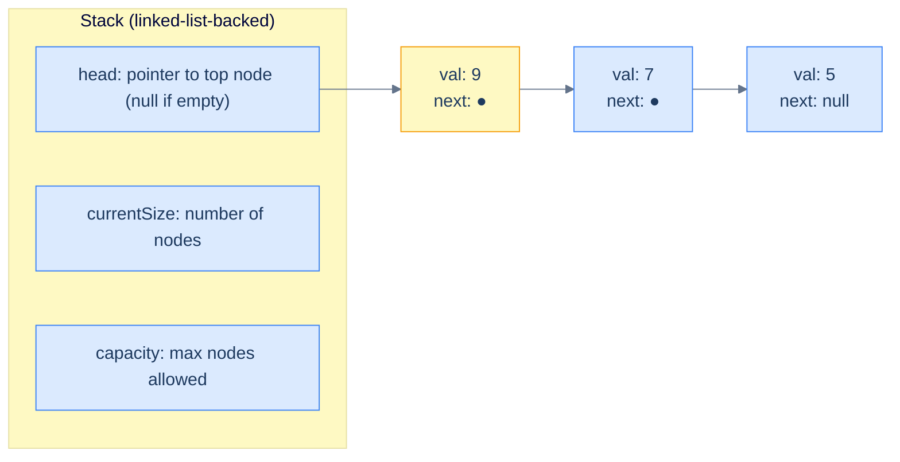
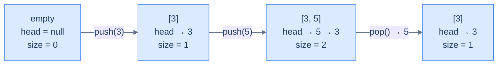
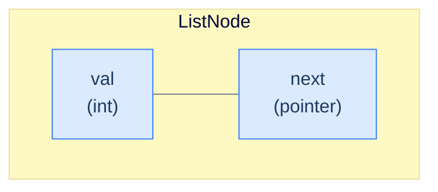
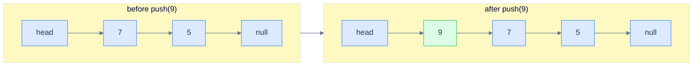
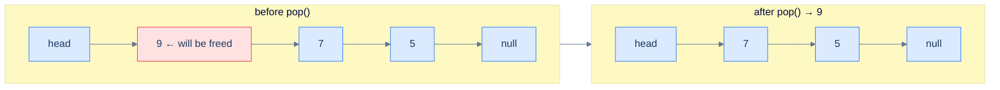

# 3. Linked-List Implementation of Stacks

## The Hook

Imagine the array-backed stack from the last lesson, but instead of pre-allocating a fixed-size buffer, every push *creates a brand-new node on the fly* and links it onto the front of a singly-linked list. The "top of the stack" is whatever the `head` pointer is currently pointing at. Push? Allocate a new node, point it at the old head, swing the head to the new node — three pointer moves, all O(1). Pop? Read the head's value, swing the head to `head.next`, free the old node — three pointer moves, all O(1).

There's no fixed capacity. There's no resize cost. There's no "stack overflow" until the operating system itself runs out of memory. Every push is the same constant-time work; every pop is the same constant-time work; the asymptotics are *identical* to the array version, but the trade-offs are different in ways that matter on real hardware:

- **No upfront allocation** — a million-capacity array reserves a million slots even if you only ever push five. A linked list grows one node at a time.
- **No resize spikes** — array stacks that grow by doubling pay an occasional O(N) cost; linked-list stacks pay O(1) every time, predictably.
- **But: no cache locality** — every node is a separate heap allocation, scattered across RAM. The CPU can't prefetch the "next" item on pop because it doesn't know where it lives until it dereferences `head.next`.

This lesson builds the linked-list stack end-to-end in 10 languages — same five operations, same O(1) cost, but a completely different memory model. The kind of trade-off you make consciously in production code: array stacks for speed-on-known-workloads, linked-list stacks for unbounded-or-bursty-workloads.

---

## Table of contents

1. [Structure of a linked-list-based stack](#structure-of-a-linked-list-based-stack)
2. [Implementing the stack class using a linked list](#implementing-the-stack-class-using-a-linked-list)
3. [Determining the size of the stack](#determining-the-size-of-the-stack)
4. [Checking if the stack is empty](#checking-if-the-stack-is-empty)
5. [Accessing the top of the stack](#accessing-the-top-of-the-stack)
6. [Pushing an item onto the stack](#pushing-an-item-onto-the-stack)
7. [Popping an item from the stack](#popping-an-item-from-the-stack)
8. [Design a stack using a linked list](#design-a-stack-using-a-linked-list)

***

# Structure of a linked-list-based stack

A linked-list stack stores its top at the **head** of a singly linked list. Three fields wrap that list:



<p align="center"><strong>Linked-list stack — <code>head</code> always points at the top. To push, allocate a new node and make it the new head; to pop, advance head to <code>head.next</code> and free the old head. Both are O(1) regardless of the stack's depth.</strong></p>

## State information

### Top

In the array version, "top" was an index. Here, it's a **pointer**. `head` references the most-recently-pushed node, or is `null` if the stack is empty. Every operation that touches the top — `push`, `pop`, `top()` — does so through this pointer.

> *Why is the top at the* head *of the list and not the tail?*
>
> Because head insertion and head deletion are O(1) — no traversal required. Tail insertion and tail deletion are O(N) without a tail pointer (you'd have to walk the list to find the second-to-last node before you could re-link). For a stack, where every operation is on the top, putting the top at the head is the only choice that keeps the implementation O(1).

### Current size

A linked list doesn't know its own length unless someone counts. We could compute size by walking the list — that's O(N). Or we maintain an integer `currentSize` that's incremented on push and decremented on pop. We'll do the latter — `size()` becomes O(1).

### Capacity

`capacity` is the maximum allowed size. A *bounded* linked-list stack rejects pushes when `currentSize == capacity`; an *unbounded* one ignores capacity entirely. We'll build the bounded version to mirror the array stack's interface — same contract, different storage.



<p align="center"><strong>Lifecycle — every push prepends a node at the head and bumps size; every pop removes the head and drops size. The list grows and shrinks at the same end, perfectly mirroring the LIFO contract.</strong></p>

***

# Implementing the stack class using a linked list

Two pieces: a tiny `ListNode` type for the chain, and the `Stack` class that wraps it.

## Linked list node

A node holds a value and a pointer to the next node. That's the entire definition. The first lesson of the linked-list section already covered this, so we'll keep it minimal.



<p align="center"><strong>The chain node — one value plus one pointer. Push allocates one of these; pop frees one.</strong></p>

## Stack class — skeleton

The class encapsulates `head`, `currentSize`, and `capacity`, exposing the same five operations as the array version.

<div class="lang-tabs">

```python,editable
class _ListNode:
    __slots__ = ('val', 'next')
    def __init__(self, val):
        self.val, self.next = val, None

class Stack:
    def __init__(self, capacity: int):
        self.capacity     = capacity
        self.head         = None    # pointer to top node
        self.current_size = 0

    def size(self):  pass
    def empty(self): pass
    def top(self):   pass
    def push(self, val): pass
    def pop(self):   pass

s = Stack(4); print("created stack with capacity 4")
```

```java,editable
public class Main {
    static class ListNode {
        int      val;
        ListNode next;
        ListNode(int v) { val = v; }
    }
    static class Stack {
        private ListNode head;            // top of stack
        private int      currentSize;
        private int      capacity;
        Stack(int capacity) { this.capacity = capacity; }

        int     size()  { return 0;     }
        boolean empty() { return true;  }
        int     top()   { return -1;    }
        boolean push(int val) { return false; }
        int     pop()   { return -1;    }
    }
    public static void main(String[] args) {
        Stack s = new Stack(4);
        System.out.println("created stack with capacity 4");
    }
}
```

```c,editable
#include <stdio.h>
#include <stdlib.h>
#include <stdbool.h>

typedef struct ListNode {
    int               val;
    struct ListNode  *next;
} ListNode;

typedef struct {
    ListNode *head;
    int       capacity;
    int       currentSize;
} Stack;

Stack* stack_create(int capacity) {
    Stack *s = malloc(sizeof(Stack));
    s->head = NULL; s->capacity = capacity; s->currentSize = 0;
    return s;
}

int  stack_size (Stack *s)              { return 0; }
bool stack_empty(Stack *s)              { return true; }
int  stack_top  (Stack *s)              { return -1; }
bool stack_push (Stack *s, int val)     { return false; }
int  stack_pop  (Stack *s)              { return -1; }

int main() { Stack *s = stack_create(4); printf("created stack with capacity %d\n", s->capacity); free(s); }
```

```cpp,editable
#include <iostream>

struct ListNode {
    int       val;
    ListNode *next;
    ListNode(int v) : val(v), next(nullptr) {}
};

class Stack {
    ListNode *head        = nullptr;
    int       currentSize = 0;
    int       capacity;
public:
    Stack(int cap) : capacity(cap) {}

    int  size()  { return 0;     }
    bool empty() { return true;  }
    int  top()   { return -1;    }
    bool push(int val) { return false; }
    int  pop()   { return -1;    }
};

int main() { Stack s(4); std::cout << "created stack with capacity 4\n"; }
```

```scala,editable
class ListNode(var v: Int, var next: ListNode = null)

class Stack(val capacity: Int) {
  protected var head: ListNode = null
  protected var currentSize    = 0

  def size:  Int     = 0
  def empty: Boolean = true
  def top:   Int     = -1
  def push(v: Int): Boolean = false
  def pop:   Int     = -1
}

object Main extends App {
  val s = new Stack(4); println("created stack with capacity 4")
}
```

```javascript,editable
class ListNode {
    constructor(val) { this.val = val; this.next = null; }
}
class Stack {
    constructor(capacity) {
        this.capacity    = capacity;
        this.head        = null;
        this.currentSize = 0;
    }
    size()  { return 0; }
    empty() { return true; }
    top()   { return -1; }
    push(val) { return false; }
    pop()   { return -1; }
}
const s = new Stack(4);
console.log("created stack with capacity 4");
```

```typescript,editable
class ListNode {
    val: number; next: ListNode | null;
    constructor(val: number) { this.val = val; this.next = null; }
}
class Stack {
    protected capacity: number;
    protected head: ListNode | null = null;
    protected currentSize = 0;
    constructor(capacity: number) { this.capacity = capacity; }

    size():  number  { return 0; }
    empty(): boolean { return true; }
    top():   number  { return -1; }
    push(val: number): boolean { return false; }
    pop():   number  { return -1; }
}
const s = new Stack(4);
console.log("created stack with capacity 4");
```

```go,editable
package main
import "fmt"

type ListNode struct {
    Val  int
    Next *ListNode
}

type Stack struct {
    head        *ListNode
    capacity    int
    currentSize int
}

func NewStack(capacity int) *Stack { return &Stack{capacity: capacity} }
func (s *Stack) Size()  int  { return 0 }
func (s *Stack) Empty() bool { return true }
func (s *Stack) Top()   int  { return -1 }
func (s *Stack) Push(val int) bool { return false }
func (s *Stack) Pop()   int  { return -1 }

func main() {
    s := NewStack(4)
    fmt.Printf("created stack with capacity %d\n", s.capacity)
}
```

```kotlin,editable
class ListNode(var v: Int, var next: ListNode? = null)

open class Stack(protected val capacity: Int) {
    protected var head: ListNode? = null
    protected var currentSize     = 0

    open fun size():  Int     = 0
    open fun empty(): Boolean = true
    open fun top():   Int     = -1
    open fun push(v: Int): Boolean = false
    open fun pop():   Int     = -1
}

fun main() { val s = Stack(4); println("created stack with capacity 4") }
```

```rust,editable
// A pedagogical singly-linked-stack using Box for ownership.
struct ListNode { val: i32, next: Option<Box<ListNode>> }

pub struct Stack {
    head:         Option<Box<ListNode>>,
    capacity:     usize,
    current_size: usize,
}

impl Stack {
    pub fn new(capacity: usize) -> Self {
        Stack { head: None, capacity, current_size: 0 }
    }
    pub fn size(&self)  -> i32  { 0 }
    pub fn empty(&self) -> bool { true }
    pub fn top(&self)   -> i32  { -1 }
    pub fn push(&mut self, _v: i32) -> bool { false }
    pub fn pop(&mut self) -> i32 { -1 }
}

fn main() {
    let s = Stack::new(4);
    println!("created stack with capacity {}", s.capacity);
}
```

</div>

***

# Determining the size of the stack

We maintain `currentSize` as a counter that's bumped on push and dropped on pop, so `size()` is a single integer read.

> *Why a counter and not a list walk?*
>
> Walking the list is O(N). Maintaining a counter is O(1) per mutation, O(1) per query. The extra integer is a tiny memory cost for a huge speed win — and it lets us cheaply check capacity on every push.

> **Algorithm**
>
> -   **Step 1:** Return `currentSize`.

## Implementation

<div class="lang-tabs">

```python,editable
class _ListNode:
    def __init__(self, v): self.val, self.next = v, None
class Stack:
    def __init__(self, capacity):
        self.capacity, self.head, self.current_size = capacity, None, 0
    def size(self): return self.current_size

print(Stack(4).size())   # 0
```

```java,editable
public class Main {
    static class ListNode { int val; ListNode next; ListNode(int v){ val = v; } }
    static class Stack {
        private ListNode head; private int currentSize, capacity;
        Stack(int c){ capacity = c; }
        int size() { return currentSize; }
    }
    public static void main(String[] args){ System.out.println(new Stack(4).size()); }
}
```

```c,editable
#include <stdio.h>
#include <stdlib.h>
typedef struct ListNode { int val; struct ListNode *next; } ListNode;
typedef struct { ListNode *head; int capacity, currentSize; } Stack;
Stack* stack_create(int c){ Stack *s = malloc(sizeof(*s)); s->head=NULL; s->capacity=c; s->currentSize=0; return s; }
int    stack_size  (Stack *s){ return s->currentSize; }

int main(){ Stack *s = stack_create(4); printf("%d\n", stack_size(s)); free(s); }
```

```cpp,editable
#include <iostream>
struct ListNode { int val; ListNode *next; ListNode(int v):val(v),next(nullptr){} };

class Stack {
    ListNode *head = nullptr; int currentSize = 0; int capacity;
public:
    Stack(int c) : capacity(c) {}
    int size() { return currentSize; }
};

int main(){ std::cout << Stack(4).size() << "\n"; }
```

```scala,editable
class ListNode(var v: Int, var next: ListNode = null)
class Stack(val capacity: Int) {
  protected var head: ListNode = null
  protected var currentSize    = 0
  def size: Int = currentSize
}
object Main extends App { println(new Stack(4).size) }
```

```javascript,editable
class ListNode { constructor(v){ this.val = v; this.next = null; } }
class Stack {
    constructor(c){ this.capacity = c; this.head = null; this.currentSize = 0; }
    size(){ return this.currentSize; }
}
console.log(new Stack(4).size());
```

```typescript,editable
class ListNode { val: number; next: ListNode | null; constructor(v: number){ this.val = v; this.next = null; } }
class Stack {
    protected capacity: number; protected head: ListNode | null = null; protected currentSize = 0;
    constructor(c: number){ this.capacity = c; }
    size(): number { return this.currentSize; }
}
console.log(new Stack(4).size());
```

```go,editable
package main
import "fmt"
type ListNode struct{ Val int; Next *ListNode }
type Stack struct{ head *ListNode; capacity, currentSize int }
func NewStack(c int) *Stack { return &Stack{capacity: c} }
func (s *Stack) Size() int { return s.currentSize }
func main(){ fmt.Println(NewStack(4).Size()) }
```

```kotlin,editable
class ListNode(var v: Int, var next: ListNode? = null)
open class Stack(protected val capacity: Int) {
    protected var head: ListNode? = null; protected var currentSize = 0
    open fun size() = currentSize
}
fun main(){ println(Stack(4).size()) }
```

```rust,editable
struct ListNode { val: i32, next: Option<Box<ListNode>> }
pub struct Stack { head: Option<Box<ListNode>>, capacity: usize, current_size: usize }
impl Stack {
    pub fn new(c: usize) -> Self { Stack { head: None, capacity: c, current_size: 0 } }
    pub fn size(&self) -> usize { self.current_size }
}
fn main(){ println!("{}", Stack::new(4).size()); }
```

</div>

## Complexity Analysis

> **All cases** — Time: **O(1)** | Space: **O(1)**

***

# Checking if the stack is empty

Same approach as before — directly compare against the size counter, or equivalently check whether `head == null`. Either works; the counter check is more uniform.

> **Algorithm**
>
> -   **Step 1:** Return `currentSize == 0` (equivalently, `head == null`).

## Implementation

<div class="lang-tabs">

```python,editable
class Stack:
    def __init__(self, c): self.capacity, self.head, self.current_size = c, None, 0
    def empty(self): return self.current_size == 0

print(Stack(4).empty())    # True
```

```java,editable
public class Main {
    static class ListNode { int val; ListNode next; ListNode(int v){ val = v; } }
    static class Stack {
        private ListNode head; private int currentSize, capacity;
        Stack(int c){ capacity = c; }
        boolean empty() { return currentSize == 0; }
    }
    public static void main(String[] args){ System.out.println(new Stack(4).empty()); }
}
```

```c,editable
#include <stdio.h>
#include <stdlib.h>
#include <stdbool.h>
typedef struct ListNode { int val; struct ListNode *next; } ListNode;
typedef struct { ListNode *head; int capacity, currentSize; } Stack;
Stack* stack_create(int c){ Stack *s = malloc(sizeof(*s)); s->head=NULL; s->capacity=c; s->currentSize=0; return s; }
bool   stack_empty (Stack *s){ return s->currentSize == 0; }

int main(){ Stack *s = stack_create(4); printf("%d\n", stack_empty(s)); free(s); }
```

```cpp,editable
#include <iostream>
struct ListNode { int val; ListNode *next; ListNode(int v):val(v),next(nullptr){} };
class Stack {
    ListNode *head = nullptr; int currentSize = 0; int capacity;
public:
    Stack(int c) : capacity(c) {}
    bool empty() { return currentSize == 0; }
};
int main(){ std::cout << Stack(4).empty() << "\n"; }
```

```scala,editable
class ListNode(var v: Int, var next: ListNode = null)
class Stack(val capacity: Int) {
  protected var head: ListNode = null; protected var currentSize = 0
  def empty: Boolean = currentSize == 0
}
object Main extends App { println(new Stack(4).empty) }
```

```javascript,editable
class ListNode { constructor(v){ this.val=v; this.next=null; } }
class Stack {
    constructor(c){ this.capacity=c; this.head=null; this.currentSize=0; }
    empty(){ return this.currentSize === 0; }
}
console.log(new Stack(4).empty());
```

```typescript,editable
class ListNode { val: number; next: ListNode | null; constructor(v: number){ this.val=v; this.next=null; } }
class Stack {
    protected capacity: number; protected head: ListNode|null = null; protected currentSize = 0;
    constructor(c: number){ this.capacity = c; }
    empty(): boolean { return this.currentSize === 0; }
}
console.log(new Stack(4).empty());
```

```go,editable
package main
import "fmt"
type ListNode struct{ Val int; Next *ListNode }
type Stack struct{ head *ListNode; capacity, currentSize int }
func NewStack(c int) *Stack { return &Stack{capacity: c} }
func (s *Stack) Empty() bool { return s.currentSize == 0 }
func main(){ fmt.Println(NewStack(4).Empty()) }
```

```kotlin,editable
class ListNode(var v: Int, var next: ListNode? = null)
open class Stack(protected val capacity: Int) {
    protected var head: ListNode? = null; protected var currentSize = 0
    open fun empty() = currentSize == 0
}
fun main(){ println(Stack(4).empty()) }
```

```rust,editable
struct ListNode { val: i32, next: Option<Box<ListNode>> }
pub struct Stack { head: Option<Box<ListNode>>, capacity: usize, current_size: usize }
impl Stack {
    pub fn new(c: usize) -> Self { Stack { head: None, capacity: c, current_size: 0 } }
    pub fn empty(&self) -> bool { self.current_size == 0 }
}
fn main(){ println!("{}", Stack::new(4).empty()); }
```

</div>

## Complexity Analysis

> **All cases** — Time: **O(1)** | Space: **O(1)**

***

# Accessing the top of the stack

`head` *is* the top, so reading it is one pointer dereference. Two cases:

## 1. Stack is empty

`head == null`. There's no top to return — return `-1`.

## 2. Stack is not empty

Return `head.val`. The list and head pointer are unchanged.

```mermaid
---
config:
  theme: base
  themeVariables:
    primaryColor: "#dbeafe"
    primaryBorderColor: "#3b82f6"
    primaryTextColor: "#1e3a5f"
    lineColor: "#64748b"
    secondaryColor: "#ede9fe"
    tertiaryColor: "#fef9c3"
---
flowchart LR
    Q["top()"] --> E{"head == null?"}
    E -->|"yes"| R1["return -1"]
    E -->|"no"|  R2["return head.val"]
```

<p align="center"><strong>Top — peek through the head pointer. The list itself is untouched, so back-to-back <code>top()</code> calls are idempotent.</strong></p>

> **Algorithm**
>
> -   **Step 1:** If `empty()`, return `-1`.
> -   **Step 2:** Return `head.val`.

## Implementation

<div class="lang-tabs">

```python,editable
class Stack:
    def __init__(self, c): self.capacity, self.head, self.current_size = c, None, 0
    def empty(self): return self.current_size == 0
    def top(self):   return -1 if self.empty() else self.head.val
```

```java,editable
public class Main {
    static class ListNode { int val; ListNode next; ListNode(int v){val=v;} }
    static class Stack {
        private ListNode head; private int currentSize, capacity;
        Stack(int c){ capacity = c; }
        boolean empty() { return currentSize == 0; }
        int top()       { return empty() ? -1 : head.val; }
    }
}
```

```c,editable
#include <stdio.h>
typedef struct ListNode { int val; struct ListNode *next; } ListNode;
typedef struct { ListNode *head; int capacity, currentSize; } Stack;
int stack_top(Stack *s){ return s->currentSize == 0 ? -1 : s->head->val; }
```

```cpp,editable
struct ListNode { int val; ListNode *next; ListNode(int v):val(v),next(nullptr){} };
class Stack {
    ListNode *head = nullptr; int currentSize = 0; int capacity;
public:
    Stack(int c) : capacity(c) {}
    bool empty() { return currentSize == 0; }
    int  top()   { return empty() ? -1 : head->val; }
};
```

```scala,editable
class ListNode(var v: Int, var next: ListNode = null)
class Stack(val capacity: Int) {
  protected var head: ListNode = null; protected var currentSize = 0
  def empty: Boolean = currentSize == 0
  def top:   Int     = if (empty) -1 else head.v
}
```

```javascript,editable
class ListNode { constructor(v){ this.val=v; this.next=null; } }
class Stack {
    constructor(c){ this.capacity=c; this.head=null; this.currentSize=0; }
    empty(){ return this.currentSize === 0; }
    top(){ return this.empty() ? -1 : this.head.val; }
}
```

```typescript,editable
class ListNode { val: number; next: ListNode | null; constructor(v: number){ this.val=v; this.next=null; } }
class Stack {
    protected capacity: number; protected head: ListNode|null = null; protected currentSize = 0;
    constructor(c: number){ this.capacity=c; }
    empty(): boolean { return this.currentSize === 0; }
    top():   number  { return this.empty() ? -1 : this.head!.val; }
}
```

```go,editable
package main
type ListNode struct{ Val int; Next *ListNode }
type Stack struct{ head *ListNode; capacity, currentSize int }
func (s *Stack) Empty() bool { return s.currentSize == 0 }
func (s *Stack) Top()   int  { if s.Empty() { return -1 }; return s.head.Val }
```

```kotlin,editable
class ListNode(var v: Int, var next: ListNode? = null)
open class Stack(protected val capacity: Int) {
    protected var head: ListNode? = null; protected var currentSize = 0
    open fun empty() = currentSize == 0
    open fun top()   = if (empty()) -1 else head!!.v
}
```

```rust,editable
struct ListNode { val: i32, next: Option<Box<ListNode>> }
pub struct Stack { head: Option<Box<ListNode>>, capacity: usize, current_size: usize }
impl Stack {
    pub fn empty(&self) -> bool { self.current_size == 0 }
    pub fn top(&self)   -> i32  { match &self.head { Some(n) => n.val, None => -1 } }
}
```

</div>

## Complexity Analysis

> **All cases** — Time: **O(1)** | Space: **O(1)**

***

# Pushing an item onto the stack

Push allocates a new node, links it to the old head, and makes it the new head.

## 1. Stack is full

`currentSize == capacity`. Reject the push — return `false`.

## 2. Stack is not full

Three steps, all O(1):

1. Allocate a new node `newNode` with the given value.
2. Set `newNode.next = head` (the old top is now the second element).
3. Set `head = newNode` and increment `currentSize`.

The order of those three steps matters: if you set `head = newNode` *before* setting `newNode.next = head`, you'll set `newNode.next` to itself, creating a cycle of length 1. Always rewire the new node's `next` *first*, then update `head`.



<p align="center"><strong>Push — the new node lands at the head; the old head becomes <code>newNode.next</code>. Three pointer assignments, regardless of how many nodes are already in the list.</strong></p>

> **Algorithm**
>
> -   **Step 1:** If `currentSize == capacity`, return `false`.
> -   **Step 2:** Create a new node `newNode` with the given value.
> -   **Step 3:** `newNode.next = head; head = newNode; currentSize++`.
> -   **Step 4:** Return `true`.

## Implementation

<div class="lang-tabs">

```python,editable
class _ListNode:
    def __init__(self, v): self.val, self.next = v, None

class Stack:
    def __init__(self, c): self.capacity, self.head, self.current_size = c, None, 0
    def push(self, val):
        if self.current_size == self.capacity: return False
        new_node = _ListNode(val)
        new_node.next = self.head      # rewire next BEFORE moving head
        self.head     = new_node
        self.current_size += 1
        return True

s = Stack(2); print(s.push(7), s.push(9), s.push(11))   # True True False
```

```java,editable
public class Main {
    static class ListNode { int val; ListNode next; ListNode(int v){ val = v; } }
    static class Stack {
        private ListNode head; private int currentSize, capacity;
        Stack(int c){ capacity = c; }
        boolean push(int val) {
            if (currentSize == capacity) return false;
            ListNode n = new ListNode(val);
            n.next = head;
            head   = n;
            currentSize++;
            return true;
        }
    }
    public static void main(String[] args){
        Stack s = new Stack(2);
        System.out.println(s.push(7) + " " + s.push(9) + " " + s.push(11));
    }
}
```

```c,editable
#include <stdio.h>
#include <stdlib.h>
#include <stdbool.h>

typedef struct ListNode { int val; struct ListNode *next; } ListNode;
typedef struct { ListNode *head; int capacity, currentSize; } Stack;

Stack* stack_create(int c){ Stack *s=malloc(sizeof(*s)); s->head=NULL; s->capacity=c; s->currentSize=0; return s; }
bool stack_push(Stack *s, int val){
    if (s->currentSize == s->capacity) return false;
    ListNode *n = malloc(sizeof(ListNode));
    n->val  = val;
    n->next = s->head;
    s->head = n;
    s->currentSize++;
    return true;
}

int main() {
    Stack *s = stack_create(2);
    printf("%d %d %d\n", stack_push(s,7), stack_push(s,9), stack_push(s,11));
}
```

```cpp,editable
#include <iostream>

struct ListNode { int val; ListNode *next; ListNode(int v):val(v),next(nullptr){} };

class Stack {
    ListNode *head = nullptr; int currentSize = 0; int capacity;
public:
    Stack(int c) : capacity(c) {}
    bool push(int val) {
        if (currentSize == capacity) return false;
        ListNode *n = new ListNode(val);
        n->next = head;
        head    = n;
        currentSize++;
        return true;
    }
};

int main() {
    Stack s(2);
    std::cout << s.push(7) << " " << s.push(9) << " " << s.push(11) << "\n";
}
```

```scala,editable
class ListNode(var v: Int, var next: ListNode = null)

class Stack(val capacity: Int) {
  protected var head: ListNode = null
  protected var currentSize    = 0
  def push(v: Int): Boolean = {
    if (currentSize == capacity) return false
    val n = new ListNode(v); n.next = head
    head  = n
    currentSize += 1
    true
  }
}

object Main extends App {
  val s = new Stack(2)
  println(s"${s.push(7)} ${s.push(9)} ${s.push(11)}")
}
```

```javascript,editable
class ListNode { constructor(v){ this.val = v; this.next = null; } }
class Stack {
    constructor(c){ this.capacity=c; this.head=null; this.currentSize=0; }
    push(val){
        if (this.currentSize === this.capacity) return false;
        const n = new ListNode(val);
        n.next     = this.head;
        this.head  = n;
        this.currentSize++;
        return true;
    }
}
const s = new Stack(2);
console.log(s.push(7), s.push(9), s.push(11));
```

```typescript,editable
class ListNode { val: number; next: ListNode | null; constructor(v: number){ this.val=v; this.next=null; } }
class Stack {
    protected capacity: number; protected head: ListNode|null = null; protected currentSize = 0;
    constructor(c: number){ this.capacity = c; }
    push(val: number): boolean {
        if (this.currentSize === this.capacity) return false;
        const n = new ListNode(val);
        n.next     = this.head;
        this.head  = n;
        this.currentSize++;
        return true;
    }
}
const s = new Stack(2);
console.log(s.push(7), s.push(9), s.push(11));
```

```go,editable
package main
import "fmt"

type ListNode struct{ Val int; Next *ListNode }
type Stack    struct{ head *ListNode; capacity, currentSize int }

func NewStack(c int) *Stack { return &Stack{capacity: c} }
func (s *Stack) Push(val int) bool {
    if s.currentSize == s.capacity { return false }
    n := &ListNode{Val: val, Next: s.head}
    s.head = n
    s.currentSize++
    return true
}

func main() {
    s := NewStack(2)
    fmt.Println(s.Push(7), s.Push(9), s.Push(11))
}
```

```kotlin,editable
class ListNode(var v: Int, var next: ListNode? = null)

open class Stack(protected val capacity: Int) {
    protected var head: ListNode? = null
    protected var currentSize     = 0
    open fun push(v: Int): Boolean {
        if (currentSize == capacity) return false
        val n = ListNode(v); n.next = head
        head  = n
        currentSize++
        return true
    }
}

fun main() {
    val s = Stack(2)
    println("${s.push(7)} ${s.push(9)} ${s.push(11)}")
}
```

```rust,editable
struct ListNode { val: i32, next: Option<Box<ListNode>> }

pub struct Stack { head: Option<Box<ListNode>>, capacity: usize, current_size: usize }
impl Stack {
    pub fn new(c: usize) -> Self { Stack { head: None, capacity: c, current_size: 0 } }
    pub fn push(&mut self, val: i32) -> bool {
        if self.current_size == self.capacity { return false; }
        // Take ownership of the old head, build a new node pointing to it.
        let new_node = Box::new(ListNode { val, next: self.head.take() });
        self.head = Some(new_node);
        self.current_size += 1;
        true
    }
}

fn main() {
    let mut s = Stack::new(2);
    println!("{} {} {}", s.push(7), s.push(9), s.push(11));
}
```

</div>

## Complexity Analysis

> **All cases** — Time: **O(1)** | Space: **O(1)** (one node allocated per push)

***

# Popping an item from the stack

Pop removes the head node, returns its value, and frees the memory.

## 1. Stack is empty

`head == null`. Return `-1`.

## 2. Stack is not empty

Three steps:

1. Save `head.val` into a temporary.
2. Save the old head pointer (so we can free it).
3. Advance `head = head.next` and decrement `currentSize`.
4. Free (delete) the saved old head and return the saved value.

The "save old head before moving" sequence matters in languages with manual memory management — if you advance `head` first and *then* try to delete the old head, you've already lost the pointer to it.



<p align="center"><strong>Pop — read the head's value, advance head, free the old head. The list shrinks by one node from the front.</strong></p>

> **Algorithm**
>
> -   **Step 1:** If `empty()`, return `-1`.
> -   **Step 2:** Save `value = head.val` and `temp = head`.
> -   **Step 3:** `head = head.next; currentSize--`.
> -   **Step 4:** Free `temp` (in languages without GC); return `value`.

## Implementation

<div class="lang-tabs">

```python,editable
class _ListNode:
    def __init__(self, v): self.val, self.next = v, None

class Stack:
    def __init__(self, c): self.capacity, self.head, self.current_size = c, None, 0
    def empty(self): return self.current_size == 0
    def push(self, v):
        if self.current_size == self.capacity: return False
        n = _ListNode(v); n.next = self.head; self.head = n
        self.current_size += 1
        return True
    def pop(self):
        if self.empty(): return -1
        value     = self.head.val
        self.head = self.head.next      # GC reclaims the old head node
        self.current_size -= 1
        return value

s = Stack(3); s.push(1); s.push(2); s.push(3)
print(s.pop(), s.pop(), s.pop(), s.pop())   # 3 2 1 -1
```

```java,editable
public class Main {
    static class ListNode { int val; ListNode next; ListNode(int v){ val=v; } }
    static class Stack {
        private ListNode head; private int currentSize, capacity;
        Stack(int c){ capacity = c; }
        boolean empty(){ return currentSize == 0; }
        boolean push(int v){
            if (currentSize == capacity) return false;
            ListNode n = new ListNode(v); n.next = head; head = n;
            currentSize++; return true;
        }
        int pop(){
            if (empty()) return -1;
            int value = head.val;
            head      = head.next;       // old head becomes garbage
            currentSize--;
            return value;
        }
    }
    public static void main(String[] args){
        Stack s = new Stack(3);
        s.push(1); s.push(2); s.push(3);
        System.out.println(s.pop() + " " + s.pop() + " " + s.pop() + " " + s.pop());
    }
}
```

```c,editable
#include <stdio.h>
#include <stdlib.h>
#include <stdbool.h>

typedef struct ListNode { int val; struct ListNode *next; } ListNode;
typedef struct { ListNode *head; int capacity, currentSize; } Stack;

Stack* stack_create(int c){ Stack *s=malloc(sizeof(*s)); s->head=NULL; s->capacity=c; s->currentSize=0; return s; }
bool stack_empty(Stack *s){ return s->currentSize == 0; }
bool stack_push (Stack *s, int v){
    if (s->currentSize == s->capacity) return false;
    ListNode *n = malloc(sizeof(*n)); n->val = v; n->next = s->head; s->head = n;
    s->currentSize++; return true;
}
int  stack_pop  (Stack *s){
    if (stack_empty(s)) return -1;
    int value = s->head->val;
    ListNode *old = s->head;            // save BEFORE advancing
    s->head = s->head->next;
    free(old);                          // and free AFTER advancing
    s->currentSize--;
    return value;
}

int main(){
    Stack *s = stack_create(3);
    stack_push(s,1); stack_push(s,2); stack_push(s,3);
    printf("%d %d %d %d\n", stack_pop(s), stack_pop(s), stack_pop(s), stack_pop(s));
    free(s);
}
```

```cpp,editable
#include <iostream>

struct ListNode { int val; ListNode *next; ListNode(int v):val(v),next(nullptr){} };

class Stack {
    ListNode *head = nullptr; int currentSize = 0; int capacity;
public:
    Stack(int c) : capacity(c) {}
    bool empty(){ return currentSize == 0; }
    bool push(int v){
        if (currentSize == capacity) return false;
        ListNode *n = new ListNode(v); n->next = head; head = n;
        currentSize++; return true;
    }
    int pop(){
        if (empty()) return -1;
        int v = head->val;
        ListNode *old = head;
        head = head->next;
        delete old;
        currentSize--;
        return v;
    }
};

int main(){
    Stack s(3);
    s.push(1); s.push(2); s.push(3);
    std::cout << s.pop() << " " << s.pop() << " " << s.pop() << " " << s.pop() << "\n";
}
```

```scala,editable
class ListNode(var v: Int, var next: ListNode = null)

class Stack(val capacity: Int) {
  protected var head: ListNode = null
  protected var currentSize    = 0
  def empty: Boolean = currentSize == 0
  def push(v: Int): Boolean = {
    if (currentSize == capacity) return false
    val n = new ListNode(v); n.next = head
    head  = n; currentSize += 1; true
  }
  def pop: Int = {
    if (empty) return -1
    val value = head.v
    head      = head.next      // GC reclaims the old node
    currentSize -= 1
    value
  }
}

object Main extends App {
  val s = new Stack(3)
  s.push(1); s.push(2); s.push(3)
  println(s"${s.pop} ${s.pop} ${s.pop} ${s.pop}")
}
```

```javascript,editable
class ListNode { constructor(v){ this.val = v; this.next = null; } }
class Stack {
    constructor(c){ this.capacity=c; this.head=null; this.currentSize=0; }
    empty(){ return this.currentSize === 0; }
    push(v){
        if (this.currentSize === this.capacity) return false;
        const n = new ListNode(v); n.next = this.head; this.head = n;
        this.currentSize++; return true;
    }
    pop(){
        if (this.empty()) return -1;
        const v = this.head.val;
        this.head = this.head.next;     // GC reclaims old node
        this.currentSize--;
        return v;
    }
}
const s = new Stack(3);
s.push(1); s.push(2); s.push(3);
console.log(s.pop(), s.pop(), s.pop(), s.pop());
```

```typescript,editable
class ListNode { val: number; next: ListNode | null; constructor(v: number){ this.val=v; this.next=null; } }
class Stack {
    protected capacity: number; protected head: ListNode|null = null; protected currentSize = 0;
    constructor(c: number){ this.capacity = c; }
    empty(): boolean { return this.currentSize === 0; }
    push(v: number): boolean {
        if (this.currentSize === this.capacity) return false;
        const n = new ListNode(v); n.next = this.head; this.head = n;
        this.currentSize++; return true;
    }
    pop(): number {
        if (this.empty()) return -1;
        const v = this.head!.val;
        this.head = this.head!.next;
        this.currentSize--;
        return v;
    }
}
const s = new Stack(3);
s.push(1); s.push(2); s.push(3);
console.log(s.pop(), s.pop(), s.pop(), s.pop());
```

```go,editable
package main
import "fmt"

type ListNode struct{ Val int; Next *ListNode }
type Stack    struct{ head *ListNode; capacity, currentSize int }

func NewStack(c int) *Stack { return &Stack{capacity: c} }
func (s *Stack) Empty() bool { return s.currentSize == 0 }
func (s *Stack) Push(v int) bool {
    if s.currentSize == s.capacity { return false }
    s.head = &ListNode{Val: v, Next: s.head}
    s.currentSize++
    return true
}
func (s *Stack) Pop() int {
    if s.Empty() { return -1 }
    v := s.head.Val
    s.head = s.head.Next       // GC reclaims old node
    s.currentSize--
    return v
}

func main() {
    s := NewStack(3)
    s.Push(1); s.Push(2); s.Push(3)
    fmt.Println(s.Pop(), s.Pop(), s.Pop(), s.Pop())
}
```

```kotlin,editable
class ListNode(var v: Int, var next: ListNode? = null)
open class Stack(protected val capacity: Int) {
    protected var head: ListNode? = null
    protected var currentSize     = 0
    open fun empty() = currentSize == 0
    open fun push(v: Int): Boolean {
        if (currentSize == capacity) return false
        val n = ListNode(v); n.next = head; head = n
        currentSize++; return true
    }
    open fun pop(): Int {
        if (empty()) return -1
        val v = head!!.v
        head  = head!!.next
        currentSize--
        return v
    }
}
fun main() {
    val s = Stack(3)
    s.push(1); s.push(2); s.push(3)
    println("${s.pop()} ${s.pop()} ${s.pop()} ${s.pop()}")
}
```

```rust,editable
struct ListNode { val: i32, next: Option<Box<ListNode>> }

pub struct Stack { head: Option<Box<ListNode>>, capacity: usize, current_size: usize }
impl Stack {
    pub fn new(c: usize) -> Self { Stack { head: None, capacity: c, current_size: 0 } }
    pub fn empty(&self) -> bool { self.current_size == 0 }
    pub fn push(&mut self, v: i32) -> bool {
        if self.current_size == self.capacity { return false; }
        self.head = Some(Box::new(ListNode { val: v, next: self.head.take() }));
        self.current_size += 1;
        true
    }
    pub fn pop(&mut self) -> i32 {
        match self.head.take() {
            None => -1,                          // empty stack
            Some(mut node) => {
                self.head = node.next.take();    // promote node.next to head
                self.current_size -= 1;
                node.val                         // node is dropped here
            }
        }
    }
}

fn main() {
    let mut s = Stack::new(3);
    s.push(1); s.push(2); s.push(3);
    println!("{} {} {} {}", s.pop(), s.pop(), s.pop(), s.pop());
}
```

</div>

## Complexity Analysis

> **All cases** — Time: **O(1)** | Space: **O(1)** (one node freed per pop)

***

# Design a stack using a linked list

## Problem Statement

Implement the same `Stack` class from the array-implementation lesson, but **backed by a singly linked list** instead of an array.

> -   **`Stack(int capacity)`** — initialise with the given capacity.
> -   **`size()`** — current size.
> -   **`empty()`** — is the stack empty?
> -   **`top()`** — value at the top, or `-1` if empty.
> -   **`push(int val)`** — push onto the top; return `true` on success, `false` if full.
> -   **`pop()`** — pop and return the top, or `-1` if empty.

> **Constraint:** Use a **linked list** as the internal data structure.

> **Example:** identical to the array version. Same input, same output.

## Solution

The full implementation, in 10 languages, combining everything we built incrementally above.

<div class="lang-tabs">

```python,editable
class _ListNode:
    __slots__ = ('val', 'next')
    def __init__(self, val):
        self.val, self.next = val, None

class Stack:
    def __init__(self, capacity: int):
        self.capacity     = capacity
        self.head         = None
        self.current_size = 0

    def size(self):  return self.current_size
    def empty(self): return self.current_size == 0
    def top(self):   return -1 if self.empty() else self.head.val

    def push(self, val):
        if self.current_size == self.capacity: return False
        n = _ListNode(val); n.next = self.head; self.head = n
        self.current_size += 1
        return True

    def pop(self):
        if self.empty(): return -1
        v = self.head.val
        self.head = self.head.next
        self.current_size -= 1
        return v

# Boss-fight demo
s = Stack(2)
print(s.push(2), s.push(3))      # True True
print(s.top(), s.empty())        # 3 False
print(s.pop())                   # 3
print(s.top())                   # 2
print(s.push(8), s.push(9))      # True False (capacity is 2)
print(s.empty())                 # False
```

```java,editable
public class Main {
    static class ListNode { int val; ListNode next; ListNode(int v){ val = v; } }

    static class Stack {
        private ListNode head;
        private final int capacity;
        private int       currentSize;
        Stack(int capacity) { this.capacity = capacity; }

        int     size()  { return currentSize; }
        boolean empty() { return currentSize == 0; }
        int     top()   { return empty() ? -1 : head.val; }

        boolean push(int val) {
            if (currentSize == capacity) return false;
            ListNode n = new ListNode(val); n.next = head; head = n;
            currentSize++; return true;
        }
        int pop() {
            if (empty()) return -1;
            int v = head.val;
            head  = head.next;
            currentSize--;
            return v;
        }
    }

    public static void main(String[] args) {
        Stack s = new Stack(2);
        System.out.println(s.push(2) + " " + s.push(3));
        System.out.println(s.top()  + " " + s.empty());
        System.out.println(s.pop());
        System.out.println(s.top());
        System.out.println(s.push(8) + " " + s.push(9));
        System.out.println(s.empty());
    }
}
```

```c,editable
#include <stdio.h>
#include <stdlib.h>
#include <stdbool.h>

typedef struct ListNode { int val; struct ListNode *next; } ListNode;
typedef struct { ListNode *head; int capacity, currentSize; } Stack;

Stack* stack_create(int c){ Stack *s=malloc(sizeof(*s)); s->head=NULL; s->capacity=c; s->currentSize=0; return s; }
int    stack_size  (Stack *s){ return s->currentSize; }
bool   stack_empty (Stack *s){ return s->currentSize == 0; }
int    stack_top   (Stack *s){ return stack_empty(s) ? -1 : s->head->val; }
bool   stack_push  (Stack *s, int v){
    if (s->currentSize == s->capacity) return false;
    ListNode *n = malloc(sizeof(*n)); n->val = v; n->next = s->head; s->head = n;
    s->currentSize++; return true;
}
int    stack_pop   (Stack *s){
    if (stack_empty(s)) return -1;
    int v = s->head->val;
    ListNode *old = s->head; s->head = s->head->next; free(old);
    s->currentSize--; return v;
}

int main() {
    Stack *s = stack_create(2);
    printf("%d %d\n", stack_push(s,2), stack_push(s,3));
    printf("%d %d\n", stack_top(s),    stack_empty(s));
    printf("%d\n",    stack_pop(s));
    printf("%d\n",    stack_top(s));
    printf("%d %d\n", stack_push(s,8), stack_push(s,9));
    printf("%d\n",    stack_empty(s));
    free(s);
}
```

```cpp,editable
#include <iostream>

struct ListNode { int val; ListNode *next; ListNode(int v):val(v),next(nullptr){} };

class Stack {
    ListNode *head        = nullptr;
    int       currentSize = 0;
    int       capacity;
public:
    Stack(int c) : capacity(c) {}
    int  size()  { return currentSize; }
    bool empty() { return currentSize == 0; }
    int  top()   { return empty() ? -1 : head->val; }
    bool push(int v) {
        if (currentSize == capacity) return false;
        ListNode *n = new ListNode(v); n->next = head; head = n;
        currentSize++; return true;
    }
    int pop() {
        if (empty()) return -1;
        int v = head->val;
        ListNode *old = head; head = head->next; delete old;
        currentSize--; return v;
    }
    ~Stack() { while (!empty()) pop(); }
};

int main() {
    Stack s(2);
    std::cout << s.push(2) << " " << s.push(3) << "\n";
    std::cout << s.top()   << " " << s.empty() << "\n";
    std::cout << s.pop()   << "\n";
    std::cout << s.top()   << "\n";
    std::cout << s.push(8) << " " << s.push(9) << "\n";
    std::cout << s.empty() << "\n";
}
```

```scala,editable
class ListNode(var v: Int, var next: ListNode = null)

class Stack(val capacity: Int) {
  private var head: ListNode = null
  private var currentSize    = 0

  def size:  Int     = currentSize
  def empty: Boolean = currentSize == 0
  def top:   Int     = if (empty) -1 else head.v

  def push(v: Int): Boolean = {
    if (currentSize == capacity) return false
    val n = new ListNode(v); n.next = head
    head  = n; currentSize += 1; true
  }
  def pop: Int = {
    if (empty) return -1
    val value = head.v
    head      = head.next
    currentSize -= 1
    value
  }
}

object Main extends App {
  val s = new Stack(2)
  println(s"${s.push(2)} ${s.push(3)}")
  println(s"${s.top} ${s.empty}")
  println(s.pop)
  println(s.top)
  println(s"${s.push(8)} ${s.push(9)}")
  println(s.empty)
}
```

```javascript,editable
class ListNode { constructor(v){ this.val = v; this.next = null; } }

class Stack {
    constructor(capacity) {
        this.capacity    = capacity;
        this.head        = null;
        this.currentSize = 0;
    }
    size()  { return this.currentSize; }
    empty() { return this.currentSize === 0; }
    top()   { return this.empty() ? -1 : this.head.val; }
    push(v) {
        if (this.currentSize === this.capacity) return false;
        const n = new ListNode(v); n.next = this.head; this.head = n;
        this.currentSize++; return true;
    }
    pop()   {
        if (this.empty()) return -1;
        const v = this.head.val;
        this.head = this.head.next;
        this.currentSize--;
        return v;
    }
}

const s = new Stack(2);
console.log(s.push(2), s.push(3));
console.log(s.top(),   s.empty());
console.log(s.pop());
console.log(s.top());
console.log(s.push(8), s.push(9));
console.log(s.empty());
```

```typescript,editable
class ListNode {
    val: number; next: ListNode | null;
    constructor(val: number) { this.val = val; this.next = null; }
}

class Stack {
    private capacity:    number;
    private head:        ListNode | null = null;
    private currentSize: number = 0;
    constructor(capacity: number) { this.capacity = capacity; }

    size():  number  { return this.currentSize; }
    empty(): boolean { return this.currentSize === 0; }
    top():   number  { return this.empty() ? -1 : this.head!.val; }
    push(v: number): boolean {
        if (this.currentSize === this.capacity) return false;
        const n = new ListNode(v); n.next = this.head; this.head = n;
        this.currentSize++; return true;
    }
    pop(): number {
        if (this.empty()) return -1;
        const v = this.head!.val;
        this.head = this.head!.next;
        this.currentSize--;
        return v;
    }
}

const s = new Stack(2);
console.log(s.push(2), s.push(3));
console.log(s.top(),   s.empty());
console.log(s.pop());
console.log(s.top());
console.log(s.push(8), s.push(9));
console.log(s.empty());
```

```go,editable
package main
import "fmt"

type ListNode struct{ Val int; Next *ListNode }

type Stack struct {
    head        *ListNode
    capacity    int
    currentSize int
}

func NewStack(c int) *Stack { return &Stack{capacity: c} }
func (s *Stack) Size()  int  { return s.currentSize }
func (s *Stack) Empty() bool { return s.currentSize == 0 }
func (s *Stack) Top()   int  { if s.Empty() { return -1 }; return s.head.Val }
func (s *Stack) Push(v int) bool {
    if s.currentSize == s.capacity { return false }
    s.head = &ListNode{Val: v, Next: s.head}
    s.currentSize++
    return true
}
func (s *Stack) Pop() int {
    if s.Empty() { return -1 }
    v := s.head.Val; s.head = s.head.Next; s.currentSize--
    return v
}

func main() {
    s := NewStack(2)
    fmt.Println(s.Push(2), s.Push(3))
    fmt.Println(s.Top(),   s.Empty())
    fmt.Println(s.Pop())
    fmt.Println(s.Top())
    fmt.Println(s.Push(8), s.Push(9))
    fmt.Println(s.Empty())
}
```

```kotlin,editable
class ListNode(var v: Int, var next: ListNode? = null)

class Stack(private val capacity: Int) {
    private var head: ListNode? = null
    private var currentSize     = 0

    fun size():  Int     = currentSize
    fun empty(): Boolean = currentSize == 0
    fun top():   Int     = if (empty()) -1 else head!!.v
    fun push(v: Int): Boolean {
        if (currentSize == capacity) return false
        val n = ListNode(v); n.next = head; head = n
        currentSize++; return true
    }
    fun pop(): Int {
        if (empty()) return -1
        val v = head!!.v
        head  = head!!.next
        currentSize--
        return v
    }
}

fun main() {
    val s = Stack(2)
    println("${s.push(2)} ${s.push(3)}")
    println("${s.top()} ${s.empty()}")
    println(s.pop())
    println(s.top())
    println("${s.push(8)} ${s.push(9)}")
    println(s.empty())
}
```

```rust,editable
struct ListNode { val: i32, next: Option<Box<ListNode>> }

pub struct Stack {
    head:         Option<Box<ListNode>>,
    capacity:     usize,
    current_size: usize,
}

impl Stack {
    pub fn new(capacity: usize) -> Self {
        Stack { head: None, capacity, current_size: 0 }
    }
    pub fn size(&self)  -> i32  { self.current_size as i32 }
    pub fn empty(&self) -> bool { self.current_size == 0 }
    pub fn top(&self)   -> i32  {
        match &self.head { Some(n) => n.val, None => -1 }
    }
    pub fn push(&mut self, v: i32) -> bool {
        if self.current_size == self.capacity { return false; }
        self.head = Some(Box::new(ListNode { val: v, next: self.head.take() }));
        self.current_size += 1;
        true
    }
    pub fn pop(&mut self) -> i32 {
        match self.head.take() {
            None => -1,
            Some(mut node) => {
                self.head = node.next.take();
                self.current_size -= 1;
                node.val
            }
        }
    }
}

fn main() {
    let mut s = Stack::new(2);
    println!("{} {}", s.push(2), s.push(3));
    println!("{} {}", s.top(),   s.empty());
    println!("{}", s.pop());
    println!("{}", s.top());
    println!("{} {}", s.push(8), s.push(9));
    println!("{}", s.empty());
}
```

</div>

***

## Final Takeaway

Linked-list and array stacks implement the same interface with the same asymptotic costs but different real-world behaviour. Three lessons:

1. **Same complexity, different memory model.** Both implementations are O(1) per operation. The difference is in *how* that constant cost is realised: an array stack writes to one slot of a contiguous buffer (cache-friendly, requires up-front allocation); a linked-list stack allocates and frees one node per operation (no upfront allocation, no cache locality).
2. **Maintain `currentSize` explicitly.** Walking the list to count nodes is O(N); a counter makes `size()` and `empty()` constant time at the cost of one integer.
3. **Wire the new node's `next` first, then move `head`.** The order of those three pointer assignments is the most common bug in linked-list pushes — get it wrong and you create a self-loop.

> **Choosing between array and linked-list stacks:**
>
> | Need | Pick |
> |---|---|
> | Predictable upper bound on size, performance-critical | array |
> | Bursty workload, unknown maximum size | linked list (or growable array) |
> | Memory-constrained, can afford one buffer | array |
> | Many short-lived stacks (one per call site, etc.) | array (small fixed-size for stack-allocated speed) |
> | Want guaranteed O(1) push (no occasional resize spike) | linked list |
>
> Most language standard libraries default to growable arrays (`std::stack` over `std::deque`, Python `list`, Java `ArrayDeque`) because the amortised cost wins on most workloads. Linked-list stacks shine when you have many small stacks, when allocation cost is dominated by something else (a GC tier, a slab allocator), or when you want predictable per-operation latency.

> *Coming up — we shift gears from implementations to *applications*. The next three lessons cover **expression evaluation**: infix vs. postfix vs. prefix notation, evaluating a postfix expression with a stack, and converting infix to postfix using two stacks. These are some of the most beautiful uses of a stack in all of computer science — and the foundation of every calculator, every parser, and every compiler you'll ever read about.*
