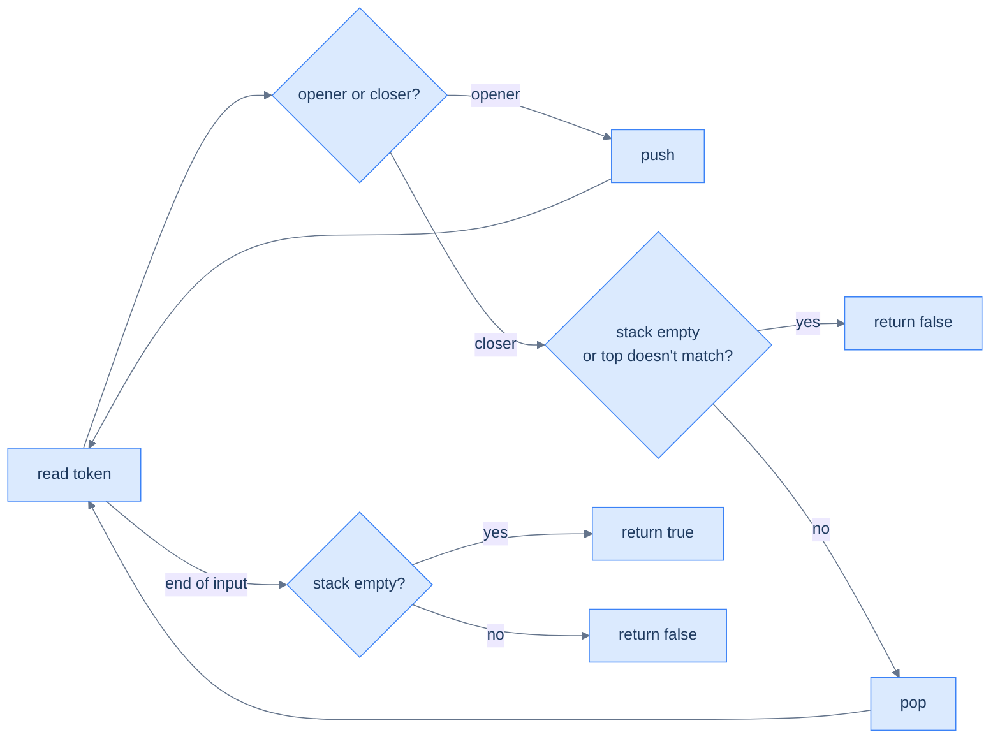
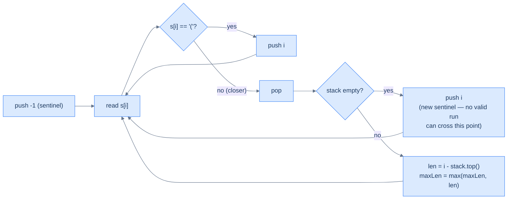

# 10. Pattern: Sequence Validation

## The Hook

`((1 + 2) * (3 - 4))` is balanced. `(1 + 2))` isn't. `[(1 + 2}]` isn't either. The difference between "valid" and "invalid" comes down to whether every opening bracket finds its *matching* closing bracket, in the *right order*. The matching rule looks subtle until you realise it's exactly the LIFO contract: when you finally close a bracket, the one you must close is the *most recent unmatched opener*. Last in, first out — the stack is born for this.

This is the **sequence validation** pattern. Push every "opener" you see; on every "closer", pop and check the match. At end-of-input, the stack should be empty (everything matched). It's the algorithm every IDE uses to highlight unmatched brackets, every JSON parser uses to reject malformed input, and every compiler uses to make sure your `if`s have their `}`s in the right places.

This lesson covers four problems on the spectrum from "is this balanced?" to "what's the longest balanced run?", with insertions/deletions and redundancy detection in between.

---

## Table of contents

1. [Understanding the sequence validation pattern](#understanding-the-sequence-validation-pattern)
2. [Identify the sequence validation pattern](#identify-the-sequence-validation-pattern)
3. [Parentheses checker](#parentheses-checker)
4. [Minimum edits](#minimum-edits)
5. [Redundant parentheses](#redundant-parentheses)
6. [Balanced span](#balanced-span)

***

# Understanding the sequence validation pattern

Two classes of token: **openers** (`(`, `[`, `{`) and **closers** (`)`, `]`, `}`). The rules:

1. **Every closer must match the most recent unmatched opener.**
2. **At the end, no openers may be left unmatched.**

The stack enforces both rules in O(N).



<p align="center"><strong>Sequence validation — push openers, pop-and-match on closers, demand empty stack at the end. Two failure modes: a closer with no matching opener, or leftover openers at end-of-input.</strong></p>

## Algorithm

> -   **Step 1:** Initialise an empty stack.
> -   **Step 2:** For each character:
>     -   Opener → push.
>     -   Closer → if stack empty or top doesn't match this closer, return `false`. Otherwise pop.
> -   **Step 3:** Return `stack.empty()`.

***

# Identify the sequence validation pattern

Anywhere the input has *paired delimiters with order constraints*, this pattern fits. Bracket matching is the canonical example, but the same machinery validates HTML/XML tag nesting, balanced binary tree pre-order traversals, valid JSON, and strings of valid push/pop sequences.

**Template:**
> Iterate the input; push openers; on closers, verify the top matches and pop; at end-of-input require an empty stack.

***

# Parentheses checker

## Problem Statement

Given a string `s` containing only `(`, `)`, `[`, `]`, `{`, `}`, return `true` iff every bracket is matched and closed in the right order.

### Example 1
> -   **Input:** `s = "()"` → **Output:** `true`

### Example 2
> -   **Input:** `s = "(({}))[]"` → **Output:** `true`

### Example 3
> -   **Input:** `s = "({{)[]"` → **Output:** `false`

## Solution

<div class="lang-tabs">

```python,editable
def parentheses_checker(s: str) -> bool:
    pair = {')': '(', ']': '[', '}': '{'}
    stack = []
    for ch in s:
        if ch in "([{":
            stack.append(ch)
        else:
            if not stack or stack[-1] != pair[ch]:
                return False
            stack.pop()
    return not stack

print(parentheses_checker("()"))         # True
print(parentheses_checker("(({}))[]"))   # True
print(parentheses_checker("({{)[]"))     # False
```

```java,editable
import java.util.*;
public class Main {
    static boolean parenthesesChecker(String s) {
        Map<Character, Character> pair = Map.of(')', '(', ']', '[', '}', '{');
        Deque<Character> st = new ArrayDeque<>();
        for (char ch : s.toCharArray()) {
            if (ch == '(' || ch == '[' || ch == '{') st.push(ch);
            else {
                if (st.isEmpty() || st.peek() != pair.get(ch)) return false;
                st.pop();
            }
        }
        return st.isEmpty();
    }
    public static void main(String[] args) {
        System.out.println(parenthesesChecker("()"));
        System.out.println(parenthesesChecker("(({}))[]"));
        System.out.println(parenthesesChecker("({{)[]"));
    }
}
```

```c,editable
#include <stdio.h>
#include <stdbool.h>

char match(char c) { return c == ')' ? '(' : (c == ']' ? '[' : '{'); }

bool parentheses_checker(const char *s) {
    char st[1024]; int top = -1;
    for (; *s; s++) {
        char c = *s;
        if (c == '(' || c == '[' || c == '{') st[++top] = c;
        else {
            if (top < 0 || st[top] != match(c)) return false;
            top--;
        }
    }
    return top == -1;
}
int main() {
    printf("%d %d %d\n",
        parentheses_checker("()"),
        parentheses_checker("(({}))[]"),
        parentheses_checker("({{)[]"));
}
```

```cpp,editable
#include <iostream>
#include <stack>
#include <unordered_map>

bool parenthesesChecker(const std::string &s) {
    std::unordered_map<char, char> pair = {{')', '('}, {']', '['}, {'}', '{'}};
    std::stack<char> st;
    for (char ch : s) {
        if (ch == '(' || ch == '[' || ch == '{') st.push(ch);
        else {
            if (st.empty() || st.top() != pair[ch]) return false;
            st.pop();
        }
    }
    return st.empty();
}
int main() {
    std::cout << parenthesesChecker("()")        << "\n";
    std::cout << parenthesesChecker("(({}))[]")  << "\n";
    std::cout << parenthesesChecker("({{)[]")    << "\n";
}
```

```scala,editable
import scala.collection.mutable
def parenthesesChecker(s: String): Boolean = {
  val pair = Map(')' -> '(', ']' -> '[', '}' -> '{')
  val st = mutable.Stack[Char]()
  for (ch <- s) {
    if (ch == '(' || ch == '[' || ch == '{') st.push(ch)
    else {
      if (st.isEmpty || st.top != pair(ch)) return false
      st.pop()
    }
  }
  st.isEmpty
}
object Main extends App {
  println(parenthesesChecker("()"))
  println(parenthesesChecker("(({}))[]"))
  println(parenthesesChecker("({{)[]"))
}
```

```javascript,editable
function parenthesesChecker(s) {
    const pair = { ')': '(', ']': '[', '}': '{' };
    const st = [];
    for (const ch of s) {
        if ("([{".includes(ch)) st.push(ch);
        else {
            if (!st.length || st[st.length-1] !== pair[ch]) return false;
            st.pop();
        }
    }
    return !st.length;
}
console.log(parenthesesChecker("()"));
console.log(parenthesesChecker("(({}))[]"));
console.log(parenthesesChecker("({{)[]"));
```

```typescript,editable
function parenthesesChecker(s: string): boolean {
    const pair: Record<string, string> = { ')': '(', ']': '[', '}': '{' };
    const st: string[] = [];
    for (const ch of s) {
        if ("([{".includes(ch)) st.push(ch);
        else {
            if (!st.length || st[st.length-1] !== pair[ch]) return false;
            st.pop();
        }
    }
    return !st.length;
}
console.log(parenthesesChecker("()"));
console.log(parenthesesChecker("(({}))[]"));
console.log(parenthesesChecker("({{)[]"));
```

```go,editable
package main
import "fmt"

func parenthesesChecker(s string) bool {
    pair := map[byte]byte{')': '(', ']': '[', '}': '{'}
    st := []byte{}
    for i := 0; i < len(s); i++ {
        c := s[i]
        if c == '(' || c == '[' || c == '{' { st = append(st, c)
        } else {
            if len(st) == 0 || st[len(st)-1] != pair[c] { return false }
            st = st[:len(st)-1]
        }
    }
    return len(st) == 0
}

func main() {
    fmt.Println(parenthesesChecker("()"))
    fmt.Println(parenthesesChecker("(({}))[]"))
    fmt.Println(parenthesesChecker("({{)[]"))
}
```

```kotlin,editable
fun parenthesesChecker(s: String): Boolean {
    val pair = mapOf(')' to '(', ']' to '[', '}' to '{')
    val st = ArrayDeque<Char>()
    for (ch in s) {
        if (ch in "([{") st.addLast(ch)
        else {
            if (st.isEmpty() || st.last() != pair[ch]) return false
            st.removeLast()
        }
    }
    return st.isEmpty()
}
fun main() {
    println(parenthesesChecker("()"))
    println(parenthesesChecker("(({}))[]"))
    println(parenthesesChecker("({{)[]"))
}
```

```rust,editable
use std::collections::HashMap;
fn parentheses_checker(s: &str) -> bool {
    let pair: HashMap<char, char> = [(')','('), (']','['), ('}','{')].into_iter().collect();
    let mut st: Vec<char> = Vec::new();
    for ch in s.chars() {
        if "([{".contains(ch) { st.push(ch); }
        else {
            match st.last() {
                Some(&top) if top == pair[&ch] => { st.pop(); }
                _ => return false
            }
        }
    }
    st.is_empty()
}
fn main() {
    println!("{} {} {}",
        parentheses_checker("()"),
        parentheses_checker("(({}))[]"),
        parentheses_checker("({{)[]"));
}
```

</div>

***

# Minimum edits

## Problem Statement

Given a string `s` of `(` and `)` only, return the minimum number of insertions or deletions needed to make the sequence valid.

### Example 1
> -   **Input:** `s = "())"` → **Output:** `1`

### Example 2
> -   **Input:** `s = "))"` → **Output:** `2`

### Example 3
> -   **Input:** `s = "(((())))"` → **Output:** `0`

## Approach

Walk the string with a stack of `(`s. For each `)`:

- If the stack has a `(`, **pop** (matched).
- If the stack is empty, this `)` is unmatched — **count it** as one edit (insert a `(` before it, or delete this `)` — same cost).

At end of input, the stack holds every unmatched `(`. Each one needs an edit (insert a `)` after it or delete it). **Total edits = unmatched `(` left on stack + unmatched `)` counted on the fly.**

## Solution

<div class="lang-tabs">

```python,editable
def minimum_edits(s: str) -> int:
    stack = []
    edits = 0
    for c in s:
        if c == '(':
            stack.append(c)
        else:                              # closing
            if stack and stack[-1] == '(':
                stack.pop()
            else:
                edits += 1                  # unmatched ')'
    return len(stack) + edits               # leftover '(' + unmatched ')'

print(minimum_edits("())"))         # 1
print(minimum_edits("))"))          # 2
print(minimum_edits("(((())))"))    # 0
```

```java,editable
import java.util.*;
public class Main {
    static int minimumEdits(String s) {
        Deque<Character> st = new ArrayDeque<>();
        int edits = 0;
        for (char c : s.toCharArray()) {
            if (c == '(') st.push(c);
            else {
                if (!st.isEmpty() && st.peek() == '(') st.pop();
                else edits++;
            }
        }
        return st.size() + edits;
    }
    public static void main(String[] args) {
        System.out.println(minimumEdits("())"));
        System.out.println(minimumEdits("))"));
        System.out.println(minimumEdits("(((())))"));
    }
}
```

```c,editable
#include <stdio.h>
int minimum_edits(const char *s) {
    int top = -1; int edits = 0;
    for (; *s; s++) {
        if (*s == '(') top++;             // push
        else {
            if (top >= 0) top--;           // matched pair
            else edits++;
        }
    }
    return (top + 1) + edits;
}
int main() {
    printf("%d %d %d\n", minimum_edits("())"), minimum_edits("))"), minimum_edits("(((())))"));
}
```

```cpp,editable
#include <iostream>
#include <stack>
int minimumEdits(const std::string &s) {
    std::stack<char> st;
    int edits = 0;
    for (char c : s) {
        if (c == '(') st.push(c);
        else {
            if (!st.empty() && st.top() == '(') st.pop();
            else edits++;
        }
    }
    return (int)st.size() + edits;
}
int main() {
    std::cout << minimumEdits("())")        << "\n";
    std::cout << minimumEdits("))")          << "\n";
    std::cout << minimumEdits("(((())))")    << "\n";
}
```

```scala,editable
import scala.collection.mutable
def minimumEdits(s: String): Int = {
  val st = mutable.Stack[Char]()
  var edits = 0
  for (c <- s) {
    if (c == '(') st.push(c)
    else {
      if (st.nonEmpty && st.top == '(') st.pop()
      else edits += 1
    }
  }
  st.size + edits
}
object Main extends App {
  println(minimumEdits("())"))
  println(minimumEdits("))"))
  println(minimumEdits("(((())))"))
}
```

```javascript,editable
function minimumEdits(s) {
    const st = [];
    let edits = 0;
    for (const c of s) {
        if (c === '(') st.push(c);
        else {
            if (st.length && st[st.length-1] === '(') st.pop();
            else edits++;
        }
    }
    return st.length + edits;
}
console.log(minimumEdits("())"));
console.log(minimumEdits("))"));
console.log(minimumEdits("(((())))"));
```

```typescript,editable
function minimumEdits(s: string): number {
    const st: string[] = [];
    let edits = 0;
    for (const c of s) {
        if (c === '(') st.push(c);
        else {
            if (st.length && st[st.length-1] === '(') st.pop();
            else edits++;
        }
    }
    return st.length + edits;
}
console.log(minimumEdits("())"));
console.log(minimumEdits("))"));
console.log(minimumEdits("(((())))"));
```

```go,editable
package main
import "fmt"
func minimumEdits(s string) int {
    top := -1; edits := 0
    for i := 0; i < len(s); i++ {
        if s[i] == '(' { top++ } else { if top >= 0 { top-- } else { edits++ } }
    }
    return (top + 1) + edits
}
func main() {
    fmt.Println(minimumEdits("())"))
    fmt.Println(minimumEdits("))"))
    fmt.Println(minimumEdits("(((())))"))
}
```

```kotlin,editable
fun minimumEdits(s: String): Int {
    val st = ArrayDeque<Char>(); var edits = 0
    for (c in s) {
        if (c == '(') st.addLast(c)
        else {
            if (st.isNotEmpty() && st.last() == '(') st.removeLast()
            else edits++
        }
    }
    return st.size + edits
}
fun main() {
    println(minimumEdits("())"))
    println(minimumEdits("))"))
    println(minimumEdits("(((())))"))
}
```

```rust,editable
fn minimum_edits(s: &str) -> usize {
    let mut top: i32 = 0; let mut edits = 0usize;
    for c in s.chars() {
        if c == '(' { top += 1; }
        else {
            if top > 0 { top -= 1; }
            else { edits += 1; }
        }
    }
    (top as usize) + edits
}
fn main() {
    println!("{} {} {}", minimum_edits("())"), minimum_edits("))"), minimum_edits("(((())))"));
}
```

</div>

***

# Redundant parentheses

## Problem Statement

Given a balanced expression `s` (containing operators, operands, and parentheses), return `true` if there exists a redundant pair of parentheses — a pair that wraps **either nothing or a single operand**, contributing no precedence value.

### Example 1
> -   **Input:** `s = "((2+3))+7"` → **Output:** `true` (the outer parens around `(2+3)` are redundant)

### Example 2
> -   **Input:** `s = "(2+3)"` → **Output:** `false` (single pair around an operation; not redundant)

### Example 3
> -   **Input:** `s = "((2+3)+7)"` → **Output:** `false`

## Approach

Push every character except `)`. When you hit `)`, look at what was pushed *between* the most recent `(` and now. **If only operands and no operators are inside, the parens are redundant.** Equivalently: if the top of the stack is `(` *immediately* (i.e. zero operators between this `)` and its `(`), the pair is redundant.

But we should also detect `(((expr)))` — wrapping an already-parenthesised expression in *another* pair. To catch that, we should pop characters until we hit `(`. If the top *was* `(` immediately, redundant. Otherwise, check whether at least one operator was popped — if not, even though there were operands, no operator means redundant.

The simpler formulation that's used in the canonical solution: when `)` arrives, **if the top of the stack is `(`, redundant**. Otherwise pop until matching `(`, also pop the `(`. (This works because operators pushed between `(` and `)` keep the stack from being `(` directly.)

## Solution

<div class="lang-tabs">

```python,editable
def redundant_parentheses(s: str) -> bool:
    if s == "()": return False
    stack = []
    for ch in s:
        if ch == ')':
            # If `(` is right on top, this pair contains nothing → redundant
            if stack and stack[-1] == '(':
                return True
            # Otherwise pop everything until the matching `(`
            while stack and stack[-1] != '(':
                stack.pop()
            stack.pop()                    # discard `(`
        else:
            stack.append(ch)
    return False

print(redundant_parentheses("((2+3))+7"))   # True
print(redundant_parentheses("(2+3)"))       # False
print(redundant_parentheses("((2+3)+7)"))   # False
```

```java,editable
import java.util.*;
public class Main {
    static boolean redundantParentheses(String s) {
        if (s.equals("()")) return false;
        Deque<Character> st = new ArrayDeque<>();
        for (char ch : s.toCharArray()) {
            if (ch == ')') {
                if (!st.isEmpty() && st.peek() == '(') return true;
                while (!st.isEmpty() && st.peek() != '(') st.pop();
                if (!st.isEmpty()) st.pop();
            } else st.push(ch);
        }
        return false;
    }
    public static void main(String[] args) {
        System.out.println(redundantParentheses("((2+3))+7"));
        System.out.println(redundantParentheses("(2+3)"));
        System.out.println(redundantParentheses("((2+3)+7)"));
    }
}
```

```c,editable
#include <stdio.h>
#include <string.h>
#include <stdbool.h>

bool redundant_parentheses(const char *s) {
    if (strcmp(s, "()") == 0) return false;
    char st[1024]; int top = -1;
    for (; *s; s++) {
        if (*s == ')') {
            if (top >= 0 && st[top] == '(') return true;
            while (top >= 0 && st[top] != '(') top--;
            if (top >= 0) top--;
        } else st[++top] = *s;
    }
    return false;
}
int main() {
    printf("%d %d %d\n",
        redundant_parentheses("((2+3))+7"),
        redundant_parentheses("(2+3)"),
        redundant_parentheses("((2+3)+7)"));
}
```

```cpp,editable
#include <iostream>
#include <stack>
bool redundantParentheses(const std::string &s) {
    if (s == "()") return false;
    std::stack<char> st;
    for (char ch : s) {
        if (ch == ')') {
            if (!st.empty() && st.top() == '(') return true;
            while (!st.empty() && st.top() != '(') st.pop();
            if (!st.empty()) st.pop();
        } else st.push(ch);
    }
    return false;
}
int main() {
    std::cout << redundantParentheses("((2+3))+7") << "\n";
    std::cout << redundantParentheses("(2+3)")     << "\n";
    std::cout << redundantParentheses("((2+3)+7)") << "\n";
}
```

```scala,editable
import scala.collection.mutable
def redundantParentheses(s: String): Boolean = {
  if (s == "()") return false
  val st = mutable.Stack[Char]()
  for (ch <- s) {
    if (ch == ')') {
      if (st.nonEmpty && st.top == '(') return true
      while (st.nonEmpty && st.top != '(') st.pop()
      if (st.nonEmpty) st.pop()
    } else st.push(ch)
  }
  false
}
object Main extends App {
  println(redundantParentheses("((2+3))+7"))
  println(redundantParentheses("(2+3)"))
  println(redundantParentheses("((2+3)+7)"))
}
```

```javascript,editable
function redundantParentheses(s) {
    if (s === "()") return false;
    const st = [];
    for (const ch of s) {
        if (ch === ')') {
            if (st.length && st[st.length-1] === '(') return true;
            while (st.length && st[st.length-1] !== '(') st.pop();
            if (st.length) st.pop();
        } else st.push(ch);
    }
    return false;
}
console.log(redundantParentheses("((2+3))+7"));
console.log(redundantParentheses("(2+3)"));
console.log(redundantParentheses("((2+3)+7)"));
```

```typescript,editable
function redundantParentheses(s: string): boolean {
    if (s === "()") return false;
    const st: string[] = [];
    for (const ch of s) {
        if (ch === ')') {
            if (st.length && st[st.length-1] === '(') return true;
            while (st.length && st[st.length-1] !== '(') st.pop();
            if (st.length) st.pop();
        } else st.push(ch);
    }
    return false;
}
console.log(redundantParentheses("((2+3))+7"));
```

```go,editable
package main
import "fmt"
func redundantParentheses(s string) bool {
    if s == "()" { return false }
    st := []byte{}
    for i := 0; i < len(s); i++ {
        ch := s[i]
        if ch == ')' {
            if len(st) > 0 && st[len(st)-1] == '(' { return true }
            for len(st) > 0 && st[len(st)-1] != '(' { st = st[:len(st)-1] }
            if len(st) > 0 { st = st[:len(st)-1] }
        } else { st = append(st, ch) }
    }
    return false
}
func main() {
    fmt.Println(redundantParentheses("((2+3))+7"))
    fmt.Println(redundantParentheses("(2+3)"))
    fmt.Println(redundantParentheses("((2+3)+7)"))
}
```

```kotlin,editable
fun redundantParentheses(s: String): Boolean {
    if (s == "()") return false
    val st = ArrayDeque<Char>()
    for (ch in s) {
        if (ch == ')') {
            if (st.isNotEmpty() && st.last() == '(') return true
            while (st.isNotEmpty() && st.last() != '(') st.removeLast()
            if (st.isNotEmpty()) st.removeLast()
        } else st.addLast(ch)
    }
    return false
}
fun main() {
    println(redundantParentheses("((2+3))+7"))
    println(redundantParentheses("(2+3)"))
    println(redundantParentheses("((2+3)+7)"))
}
```

```rust,editable
fn redundant_parentheses(s: &str) -> bool {
    if s == "()" { return false; }
    let mut st: Vec<char> = Vec::new();
    for ch in s.chars() {
        if ch == ')' {
            if st.last() == Some(&'(') { return true; }
            while st.last().is_some() && *st.last().unwrap() != '(' { st.pop(); }
            st.pop();
        } else { st.push(ch); }
    }
    false
}
fn main() {
    println!("{} {} {}",
        redundant_parentheses("((2+3))+7"),
        redundant_parentheses("(2+3)"),
        redundant_parentheses("((2+3)+7)"));
}
```

</div>

***

# Balanced span

## Problem Statement

Given a string `s` of `(` and `)`, return the length of the **longest valid (balanced) parentheses substring**.

### Example 1
> -   **Input:** `s = "((()()"` → **Output:** `4` (`"()()"`)

### Example 2
> -   **Input:** `s = "(()())(()"` → **Output:** `6` (`"(()())"`)

### Example 3
> -   **Input:** `s = "(((("` → **Output:** `0`

## Approach — index stack with sentinel

The trick is to push **indices** (not characters), starting with a sentinel `-1` at the bottom. The top of the stack always represents *the index just before the current valid substring started*. When we hit `(`: push its index. When we hit `)`: pop. If the stack is now empty (we popped the sentinel), push the current index as a *new sentinel* (no valid substring can include it). Otherwise, the new top is "one before the current valid run", so the current run length is `i − stack.top()`.



<p align="center"><strong>Balanced span — index stack with sentinel <code>-1</code>. The top is always "one before the current valid run". Pop on closer; if the stack drops to empty, the current index becomes the new sentinel (no run can cross an unmatched closer).</strong></p>

## Solution

<div class="lang-tabs">

```python,editable
def balanced_span(s: str) -> int:
    stack = [-1]                    # sentinel
    max_len = 0
    for i, c in enumerate(s):
        if c == '(':
            stack.append(i)
        else:
            stack.pop()
            if not stack:
                stack.append(i)     # new sentinel — no run crosses here
            else:
                max_len = max(max_len, i - stack[-1])
    return max_len

print(balanced_span("((()()"))     # 4
print(balanced_span("(()())(()"))  # 6
print(balanced_span("(((("))       # 0
```

```java,editable
import java.util.*;
public class Main {
    static int balancedSpan(String s) {
        Deque<Integer> st = new ArrayDeque<>();
        st.push(-1);
        int max = 0;
        for (int i = 0; i < s.length(); i++) {
            if (s.charAt(i) == '(') st.push(i);
            else {
                st.pop();
                if (st.isEmpty()) st.push(i);
                else max = Math.max(max, i - st.peek());
            }
        }
        return max;
    }
    public static void main(String[] args) {
        System.out.println(balancedSpan("((()("));
        System.out.println(balancedSpan("(()())(()"));
        System.out.println(balancedSpan("(((("));
    }
}
```

```c,editable
#include <stdio.h>
#include <string.h>
int balanced_span(const char *s) {
    int n = (int)strlen(s);
    int st[1024]; int top = -1;
    st[++top] = -1;
    int max = 0;
    for (int i = 0; i < n; i++) {
        if (s[i] == '(') st[++top] = i;
        else {
            top--;
            if (top < 0) st[++top] = i;
            else { int len = i - st[top]; if (len > max) max = len; }
        }
    }
    return max;
}
int main() {
    printf("%d %d %d\n", balanced_span("((()("), balanced_span("(()())(()"), balanced_span("(((("));
}
```

```cpp,editable
#include <iostream>
#include <stack>
#include <algorithm>
int balancedSpan(const std::string &s) {
    std::stack<int> st;
    st.push(-1);
    int max = 0;
    for (int i = 0; i < (int)s.size(); i++) {
        if (s[i] == '(') st.push(i);
        else {
            st.pop();
            if (st.empty()) st.push(i);
            else max = std::max(max, i - st.top());
        }
    }
    return max;
}
int main() {
    std::cout << balancedSpan("((()(")     << "\n";
    std::cout << balancedSpan("(()())(()") << "\n";
    std::cout << balancedSpan("((((")      << "\n";
}
```

```scala,editable
import scala.collection.mutable
def balancedSpan(s: String): Int = {
  val st = mutable.Stack[Int]()
  st.push(-1)
  var max = 0
  for (i <- s.indices) {
    if (s(i) == '(') st.push(i)
    else {
      st.pop()
      if (st.isEmpty) st.push(i)
      else max = math.max(max, i - st.top)
    }
  }
  max
}
object Main extends App {
  println(balancedSpan("((()("))
  println(balancedSpan("(()())(()"))
  println(balancedSpan("(((("))
}
```

```javascript,editable
function balancedSpan(s) {
    const st = [-1];
    let max = 0;
    for (let i = 0; i < s.length; i++) {
        if (s[i] === '(') st.push(i);
        else {
            st.pop();
            if (!st.length) st.push(i);
            else max = Math.max(max, i - st[st.length-1]);
        }
    }
    return max;
}
console.log(balancedSpan("((()("));
console.log(balancedSpan("(()())(()"));
console.log(balancedSpan("(((("));
```

```typescript,editable
function balancedSpan(s: string): number {
    const st: number[] = [-1];
    let max = 0;
    for (let i = 0; i < s.length; i++) {
        if (s[i] === '(') st.push(i);
        else {
            st.pop();
            if (!st.length) st.push(i);
            else max = Math.max(max, i - st[st.length-1]);
        }
    }
    return max;
}
console.log(balancedSpan("((()("));
console.log(balancedSpan("(()())(()"));
console.log(balancedSpan("(((("));
```

```go,editable
package main
import "fmt"
func balancedSpan(s string) int {
    st := []int{-1}; max := 0
    for i := 0; i < len(s); i++ {
        if s[i] == '(' { st = append(st, i)
        } else {
            st = st[:len(st)-1]
            if len(st) == 0 { st = append(st, i)
            } else if l := i - st[len(st)-1]; l > max { max = l }
        }
    }
    return max
}
func main() {
    fmt.Println(balancedSpan("((()("))
    fmt.Println(balancedSpan("(()())(()"))
    fmt.Println(balancedSpan("(((("))
}
```

```kotlin,editable
fun balancedSpan(s: String): Int {
    val st = ArrayDeque<Int>(); st.addLast(-1)
    var max = 0
    for (i in s.indices) {
        if (s[i] == '(') st.addLast(i)
        else {
            st.removeLast()
            if (st.isEmpty()) st.addLast(i)
            else max = maxOf(max, i - st.last())
        }
    }
    return max
}
fun main() {
    println(balancedSpan("((()("))
    println(balancedSpan("(()())(()"))
    println(balancedSpan("(((("))
}
```

```rust,editable
fn balanced_span(s: &str) -> i32 {
    let mut st: Vec<i32> = vec![-1];
    let mut max = 0i32;
    for (i, c) in s.chars().enumerate() {
        if c == '(' { st.push(i as i32); }
        else {
            st.pop();
            if st.is_empty() { st.push(i as i32); }
            else { max = max.max(i as i32 - *st.last().unwrap()); }
        }
    }
    max
}
fn main() {
    println!("{} {} {}",
        balanced_span("((()("),
        balanced_span("(()())(()"),
        balanced_span("(((("));
}
```

</div>

***

## Final Takeaway

Three lessons:

1. **A stack is a matching memory.** Push openers, pop on closers, demand empty at the end. It's the simplest correct way to validate any LIFO-paired sequence — brackets, HTML tags, JSON nesting, function-call frames.
2. **Indices, not characters, when length matters.** Storing indices on the stack lets you measure spans (balanced-span), compute widths (histogram), and resolve answers retroactively (next-greater).
3. **A sentinel `-1` makes the boundary case disappear.** Pre-pushing `-1` on the balanced-span stack means *every* `i − stack.top()` calculation works even at the start of input, with no special-casing.

> *Coming up — the **linear evaluation** pattern. The last problem-solving pattern in this section. It's the umbrella term for stack-based algorithms that build up an *answer* one element at a time by repeatedly popping until a condition is met, then pushing. Score-of-parentheses, decode-string, simplified-Unix-paths, and the asteroid collision problem all fall here.*
