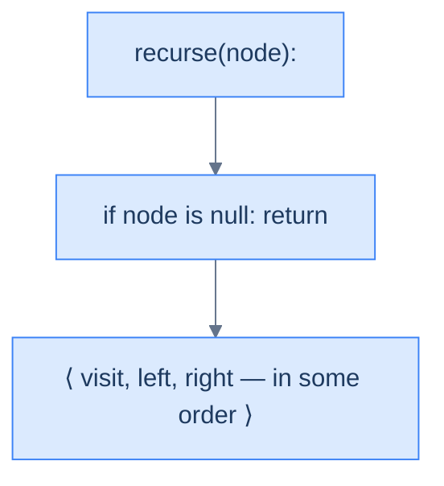
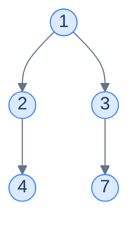
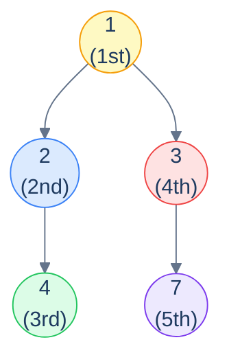
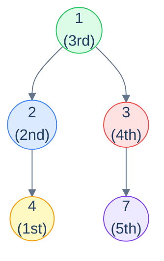
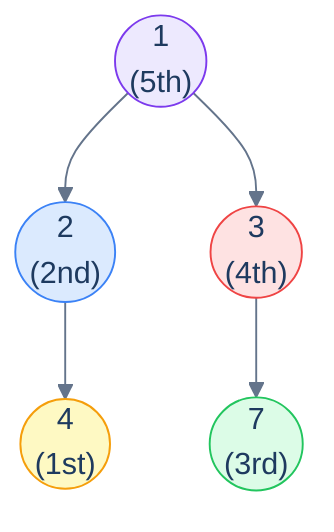
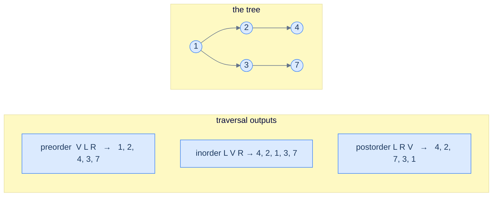

# 4. Recursive Traversals in Binary Trees

## The Hook

A linear data structure has *one* way to traverse it: start at the head, walk to the tail, visit each element exactly once. There's nothing to discuss.

Trees are not linear. At every internal node, the algorithm hits a fork — visit the left subtree first, or the right? Visit the current node *before* recursing, *between* the recursions, or *after*? Each combination of those choices produces a different traversal, and — surprisingly — each one turns out to have a *different practical use*. The three classical depth-first orderings — **preorder**, **inorder**, and **postorder** — each appear in real software, each in places where the others wouldn't work.

- **Preorder** (root → left → right) is how you serialise a tree to disk so you can reconstruct it later. It's how the `clone()` function for any tree works. It's how prefix expressions work in functional languages.
- **Inorder** (left → root → right) is how you read out the values of a *binary search tree* in sorted order. Every database index, every BST, every red-black tree's iterator uses this.
- **Postorder** (left → right → root) is how you safely **delete** a tree (you can't free a parent before its children, or you'd lose access to them). It's also how compilers evaluate expressions, how Kotlin's coroutines unwind cancellation, and how dependency-graph build systems compute targets.

The miraculous thing? *All three traversals are written as the same three-line recursive function*. Only the **order** of those three lines changes — visit, recurse-left, recurse-right — and that single line-shuffle changes the entire output and entire use case. Three patterns hiding inside a single recursive shape.

This lesson walks through all three, in order, with mermaid diagrams of the traversal path, the recursive algorithm in plain language, and a clean implementation in ten languages. By the end you should be able to write any of the three from memory in any language — which you'll be doing constantly for the rest of the chapter.

---

## Table of contents

1. [The recursive shape — visit, left, right (in some order)](#the-recursive-shape--visit-left-right-in-some-order)
2. [Preorder traversal — root → left → right](#preorder-traversal--root--left--right)
3. [Inorder traversal — left → root → right](#inorder-traversal--left--root--right)
4. [Postorder traversal — left → right → root](#postorder-traversal--left--right--root)
5. [Comparing the three](#comparing-the-three)

***

# The recursive shape — visit, left, right (in some order)

Every recursive traversal is built from three building blocks:

1. **V** — visit the current node (do whatever work the algorithm needs: print, accumulate, transform).
2. **L** — recursively traverse the left subtree.
3. **R** — recursively traverse the right subtree.

Plus a base case: if the current node is `null`, return immediately (nothing to visit, nothing to recurse into).

The three classical orderings are simply the three sensible permutations:

| Name       | Order   | Mnemonic            | Output flavour                                |
|------------|---------|---------------------|-----------------------------------------------|
| Preorder   | V L R   | "*Pre*" = before    | Roots first; useful for *building* / serialising |
| Inorder    | L V R   | "*In*" = between    | Sorted output on a BST                        |
| Postorder  | L R V   | "*Post*" = after    | Leaves first; useful for *destroying* / evaluating |

The remaining three permutations (R V L, R L V, V R L) are real traversals too, just less commonly used — they reverse the left/right preference but otherwise behave identically.

> **Why is recursion so natural for trees?** Because the *definition* of a binary tree is itself recursive — *"a binary tree is empty, or a node with a left subtree and a right subtree"*. The traversal mirrors the definition exactly: the base case handles the empty tree, the recursive case visits the node and recurses into the two subtrees. The code writes itself. Every recursive tree algorithm in this entire chapter follows the same shape — internalise it now and the rest of the chapter is filling in the "what work do I do at the visit step?" part.



<p align="center"><strong>The skeleton of every recursive traversal in this chapter — base case + three actions in some order. Swap the order and you swap the traversal.</strong></p>

***

# Preorder traversal — root → left → right

**Visit the current node first**, then recurse into the left subtree, then the right.

```text
preorder(node):
  if node is null: return
  visit(node)        # ← V
  preorder(left)     # ← L
  preorder(right)    # ← R
```

## Walking through it

Take this tree:



Apply the recursive shape:

- Visit `1`. Recurse left into `2`.
  - Visit `2`. Recurse left into `4`.
    - Visit `4`. Both children are `null`. Done with `4`.
  - Right of `2` is `null`. Done with `2`.
- Recurse right of `1` into `3`.
  - Right of `3`'s left is `null`. Recurse right of `3` into `7`.
    - Visit `7`. Both children are `null`. Done.

The values are visited in the order: **`1, 2, 4, 3, 7`**. *Roots before subtrees*; *left before right*.



<p align="center"><strong>Preorder visit sequence on the example tree — <strong><code>1 → 2 → 4 → 3 → 7</code></strong>. The root is always visited <em>first</em> for any subtree; that's where the name comes from.</strong></p>

## Why preorder?

Preorder shows up wherever you need to *emit a parent before its children*:

- **Tree serialisation / cloning.** If you write the values in preorder, with explicit `null` markers, you can reconstruct the tree exactly. Most binary-tree serialisation formats (LeetCode's `[1,2,3,null,null,4,5]` notation, for example) are essentially preorder dumps.
- **Prefix expression notation.** `(3 + 4) * 5` becomes `* + 3 4 5` in prefix — exactly the preorder traversal of its expression tree.
- **File-system copying.** Visit the directory before its contents, so the destination directory exists before you try to populate it.

## Implementation

Three lines, mirroring the algorithm.

<div class="lang-tabs">

```python,editable
from typing import List, Optional

class TreeNode:
    def __init__(self, val=0, left=None, right=None):
        self.val, self.left, self.right = val, left, right

def preorder(root: Optional[TreeNode]) -> List[int]:
    out: List[int] = []
    def walk(node: Optional[TreeNode]):
        if node is None: return
        out.append(node.val)         # V
        walk(node.left)              # L
        walk(node.right)             # R
    walk(root)
    return out

# tree:    1
#         / \
#        2   3
#       /     \
#      4       7
root = TreeNode(1, TreeNode(2, TreeNode(4)), TreeNode(3, None, TreeNode(7)))
print(preorder(root))                # [1, 2, 4, 3, 7]
```

```java,editable
import java.util.*;
public class Main {
    static class TreeNode {
        int val;
        TreeNode left, right;
        TreeNode(int v) { val = v; }
        TreeNode(int v, TreeNode l, TreeNode r) { val = v; left = l; right = r; }
    }
    static void walk(TreeNode n, List<Integer> out) {
        if (n == null) return;
        out.add(n.val);
        walk(n.left,  out);
        walk(n.right, out);
    }
    public static List<Integer> preorder(TreeNode root) {
        List<Integer> out = new ArrayList<>();
        walk(root, out);
        return out;
    }
    public static void main(String[] args) {
        TreeNode root = new TreeNode(1,
            new TreeNode(2, new TreeNode(4), null),
            new TreeNode(3, null, new TreeNode(7)));
        System.out.println(preorder(root));
    }
}
```

```c,editable
#include <stdio.h>
#include <stdlib.h>

typedef struct TreeNode { int val; struct TreeNode *left, *right; } TreeNode;

static TreeNode* mk(int v, TreeNode *l, TreeNode *r) {
    TreeNode *n = malloc(sizeof(*n)); n->val = v; n->left = l; n->right = r; return n;
}

static void walk(TreeNode *n, int *out, int *k) {
    if (!n) return;
    out[(*k)++] = n->val;
    walk(n->left,  out, k);
    walk(n->right, out, k);
}

int main() {
    TreeNode *root = mk(1, mk(2, mk(4, NULL, NULL), NULL), mk(3, NULL, mk(7, NULL, NULL)));
    int out[16], k = 0;
    walk(root, out, &k);
    for (int i = 0; i < k; i++) printf("%d ", out[i]);
    printf("\n");
}
```

```cpp,editable
#include <iostream>
#include <vector>

struct TreeNode {
    int val;
    TreeNode *left, *right;
    TreeNode(int v, TreeNode *l = nullptr, TreeNode *r = nullptr) : val(v), left(l), right(r) {}
};

void walk(TreeNode *n, std::vector<int>& out) {
    if (!n) return;
    out.push_back(n->val);
    walk(n->left,  out);
    walk(n->right, out);
}

int main() {
    auto root = new TreeNode(1, new TreeNode(2, new TreeNode(4)), new TreeNode(3, nullptr, new TreeNode(7)));
    std::vector<int> out;
    walk(root, out);
    for (int v : out) std::cout << v << " ";
    std::cout << "\n";
}
```

```scala,editable
class TreeNode(var value: Int, var left: TreeNode = null, var right: TreeNode = null)

object Main extends App {
  def preorder(root: TreeNode): List[Int] = {
    val buf = scala.collection.mutable.ListBuffer[Int]()
    def walk(n: TreeNode): Unit = {
      if (n == null) return
      buf += n.value
      walk(n.left)
      walk(n.right)
    }
    walk(root)
    buf.toList
  }

  val root = new TreeNode(1, new TreeNode(2, new TreeNode(4)), new TreeNode(3, null, new TreeNode(7)))
  println(preorder(root))
}
```

```javascript,editable
class TreeNode {
    constructor(val = 0, left = null, right = null) { this.val = val; this.left = left; this.right = right; }
}

function preorder(root) {
    const out = [];
    (function walk(n) {
        if (!n) return;
        out.push(n.val);
        walk(n.left);
        walk(n.right);
    })(root);
    return out;
}

const root = new TreeNode(1, new TreeNode(2, new TreeNode(4)), new TreeNode(3, null, new TreeNode(7)));
console.log(preorder(root));
```

```typescript,editable
class TreeNode {
    val: number;
    left: TreeNode | null;
    right: TreeNode | null;
    constructor(val = 0, left: TreeNode | null = null, right: TreeNode | null = null) {
        this.val = val; this.left = left; this.right = right;
    }
}

function preorder(root: TreeNode | null): number[] {
    const out: number[] = [];
    const walk = (n: TreeNode | null): void => {
        if (!n) return;
        out.push(n.val);
        walk(n.left);
        walk(n.right);
    };
    walk(root);
    return out;
}

const root = new TreeNode(1, new TreeNode(2, new TreeNode(4)), new TreeNode(3, null, new TreeNode(7)));
console.log(preorder(root));
```

```go,editable
package main
import "fmt"

type TreeNode struct {
    Val         int
    Left, Right *TreeNode
}

func preorder(root *TreeNode) []int {
    var out []int
    var walk func(*TreeNode)
    walk = func(n *TreeNode) {
        if n == nil { return }
        out = append(out, n.Val)
        walk(n.Left)
        walk(n.Right)
    }
    walk(root)
    return out
}

func main() {
    root := &TreeNode{Val: 1,
        Left:  &TreeNode{Val: 2, Left: &TreeNode{Val: 4}},
        Right: &TreeNode{Val: 3, Right: &TreeNode{Val: 7}}}
    fmt.Println(preorder(root))
}
```

```kotlin,editable
class TreeNode(var value: Int, var left: TreeNode? = null, var right: TreeNode? = null)

fun preorder(root: TreeNode?): List<Int> {
    val out = mutableListOf<Int>()
    fun walk(n: TreeNode?) {
        if (n == null) return
        out += n.value
        walk(n.left)
        walk(n.right)
    }
    walk(root)
    return out
}

fun main() {
    val root = TreeNode(1, TreeNode(2, TreeNode(4)), TreeNode(3, null, TreeNode(7)))
    println(preorder(root))
}
```

```rust,editable
#[derive(Debug)]
pub struct TreeNode {
    pub val:   i32,
    pub left:  Option<Box<TreeNode>>,
    pub right: Option<Box<TreeNode>>,
}

fn walk(n: &Option<Box<TreeNode>>, out: &mut Vec<i32>) {
    if let Some(node) = n {
        out.push(node.val);
        walk(&node.left,  out);
        walk(&node.right, out);
    }
}

pub fn preorder(root: &Option<Box<TreeNode>>) -> Vec<i32> {
    let mut out = Vec::new();
    walk(root, &mut out);
    out
}

fn main() {
    let leaf4 = Some(Box::new(TreeNode { val: 4, left: None, right: None }));
    let leaf7 = Some(Box::new(TreeNode { val: 7, left: None, right: None }));
    let n2    = Some(Box::new(TreeNode { val: 2, left: leaf4, right: None }));
    let n3    = Some(Box::new(TreeNode { val: 3, left: None,  right: leaf7 }));
    let root  = Some(Box::new(TreeNode { val: 1, left: n2,    right: n3 }));
    println!("{:?}", preorder(&root));
}
```

</div>

## Complexity

Each node is visited exactly once → **O(N) time**. The recursion uses one stack frame per active call, and the maximum depth equals the tree's height → **O(h) space** for the call stack.

> **Best case** — balanced tree, `h = log N`:  Time **O(N)**, Space **O(log N)**.
>
> **Worst case** — skew tree, `h = N`: Time **O(N)**, Space **O(N)**.

***

# Inorder traversal — left → root → right

**Recurse into the left subtree first**, then visit the current node, then recurse into the right.

```text
inorder(node):
  if node is null: return
  inorder(left)      # ← L
  visit(node)        # ← V
  inorder(right)     # ← R
```

## Walking through it

Same tree:



<p align="center"><strong>Inorder visit sequence — <strong><code>4 → 2 → 1 → 3 → 7</code></strong>. Each subtree is fully drained on the left before its root is visited; then the right subtree is drained.</strong></p>

The recursion goes *all the way down the left spine* before producing any output. For the example, it descends `1 → 2 → 4`, hits a `null` left of `4`, visits `4`, returns, visits `2`, descends `2`'s right (which is `null`), returns, visits `1`, descends right into `3`, finds `null` left of `3`, visits `3`, descends right into `7`, visits `7`.

## Why inorder?

The killer application: **inorder traversal of a binary search tree visits the values in sorted ascending order**. This is the property that makes BSTs useful as ordered iterators — every database index, every `std::map`, every `TreeMap`, every BST in any language standard library uses inorder for its iterator. We'll prove this when we get to BSTs in the next chapter.

Inorder also shows up in:
- **Infix expression** — `3 + 4 * 5` is the inorder traversal of its expression tree.
- **Predecessor / successor lookups** in BSTs (find the previous and next value in sorted order).

## Implementation

Same shape as preorder; only the order of `visit` and the left recursion swap.

<div class="lang-tabs">

```python,editable
def inorder(root):
    out = []
    def walk(n):
        if n is None: return
        walk(n.left)             # L
        out.append(n.val)        # V
        walk(n.right)            # R
    walk(root)
    return out
```

```java,editable
static void walk(TreeNode n, List<Integer> out) {
    if (n == null) return;
    walk(n.left,  out);
    out.add(n.val);
    walk(n.right, out);
}
public static List<Integer> inorder(TreeNode root) {
    List<Integer> out = new ArrayList<>();
    walk(root, out);
    return out;
}
```

```c,editable
static void walk(TreeNode *n, int *out, int *k) {
    if (!n) return;
    walk(n->left,  out, k);
    out[(*k)++] = n->val;
    walk(n->right, out, k);
}
```

```cpp,editable
void walk(TreeNode *n, std::vector<int>& out) {
    if (!n) return;
    walk(n->left,  out);
    out.push_back(n->val);
    walk(n->right, out);
}
```

```scala,editable
def inorder(root: TreeNode): List[Int] = {
  val buf = scala.collection.mutable.ListBuffer[Int]()
  def walk(n: TreeNode): Unit = {
    if (n == null) return
    walk(n.left)
    buf += n.value
    walk(n.right)
  }
  walk(root); buf.toList
}
```

```javascript,editable
function inorder(root) {
    const out = [];
    (function walk(n) {
        if (!n) return;
        walk(n.left);
        out.push(n.val);
        walk(n.right);
    })(root);
    return out;
}
```

```typescript,editable
function inorder(root: TreeNode | null): number[] {
    const out: number[] = [];
    const walk = (n: TreeNode | null): void => {
        if (!n) return;
        walk(n.left);
        out.push(n.val);
        walk(n.right);
    };
    walk(root);
    return out;
}
```

```go,editable
func inorder(root *TreeNode) []int {
    var out []int
    var walk func(*TreeNode)
    walk = func(n *TreeNode) {
        if n == nil { return }
        walk(n.Left)
        out = append(out, n.Val)
        walk(n.Right)
    }
    walk(root)
    return out
}
```

```kotlin,editable
fun inorder(root: TreeNode?): List<Int> {
    val out = mutableListOf<Int>()
    fun walk(n: TreeNode?) {
        if (n == null) return
        walk(n.left)
        out += n.value
        walk(n.right)
    }
    walk(root); return out
}
```

```rust,editable
fn walk(n: &Option<Box<TreeNode>>, out: &mut Vec<i32>) {
    if let Some(node) = n {
        walk(&node.left,  out);
        out.push(node.val);
        walk(&node.right, out);
    }
}

pub fn inorder(root: &Option<Box<TreeNode>>) -> Vec<i32> {
    let mut out = Vec::new();
    walk(root, &mut out);
    out
}
```

</div>

## Complexity

Same as preorder: **O(N) time, O(h) space**.

***

# Postorder traversal — left → right → root

**Recurse into both subtrees first**, *then* visit the current node.

```text
postorder(node):
  if node is null: return
  postorder(left)    # ← L
  postorder(right)   # ← R
  visit(node)        # ← V
```

## Walking through it

Same tree, third order:



<p align="center"><strong>Postorder visit sequence — <strong><code>4 → 2 → 7 → 3 → 1</code></strong>. The root of <em>every</em> subtree is visited <em>last</em>; leaves emerge first, the global root emerges dead last.</strong></p>

The recursion goes deep into the left subtree, then deep into the right subtree, *and only then* visits the current node. For the example: descend `1 → 2 → 4`, visit `4`, return, visit `2`, return, descend `1 → 3 → 7`, visit `7`, return, visit `3`, return, finally visit `1`.

## Why postorder?

Postorder is what you use whenever a node's *result depends on its children's results*:

- **Tree deletion / freeing memory.** You must free the children before the parent — otherwise you'd lose the pointers needed to reach them. *Every* tree-destruction routine in a manual-memory language uses postorder.
- **Computing subtree sizes / heights.** `size(n) = 1 + size(left) + size(right)` — the parent computes its answer from already-computed child answers. Same for height, weight, max-depth, sum-of-values, etc.
- **Expression evaluation.** `(3 + 4) * 5` becomes `3 4 + 5 *` in postfix (RPN). Evaluate left-to-right with a stack — exactly how postfix calculators and JVM bytecode work.
- **Build systems / dependency resolution.** A target depends on its dependencies; you build the dependencies first (postorder over the dependency graph), then the target. `make`, Bazel, npm install — all do postorder traversal of the dependency DAG.

## Implementation

<div class="lang-tabs">

```python,editable
def postorder(root):
    out = []
    def walk(n):
        if n is None: return
        walk(n.left)             # L
        walk(n.right)            # R
        out.append(n.val)        # V
    walk(root)
    return out
```

```java,editable
static void walk(TreeNode n, List<Integer> out) {
    if (n == null) return;
    walk(n.left,  out);
    walk(n.right, out);
    out.add(n.val);
}
public static List<Integer> postorder(TreeNode root) {
    List<Integer> out = new ArrayList<>();
    walk(root, out);
    return out;
}
```

```c,editable
static void walk(TreeNode *n, int *out, int *k) {
    if (!n) return;
    walk(n->left,  out, k);
    walk(n->right, out, k);
    out[(*k)++] = n->val;
}
```

```cpp,editable
void walk(TreeNode *n, std::vector<int>& out) {
    if (!n) return;
    walk(n->left,  out);
    walk(n->right, out);
    out.push_back(n->val);
}
```

```scala,editable
def postorder(root: TreeNode): List[Int] = {
  val buf = scala.collection.mutable.ListBuffer[Int]()
  def walk(n: TreeNode): Unit = {
    if (n == null) return
    walk(n.left)
    walk(n.right)
    buf += n.value
  }
  walk(root); buf.toList
}
```

```javascript,editable
function postorder(root) {
    const out = [];
    (function walk(n) {
        if (!n) return;
        walk(n.left);
        walk(n.right);
        out.push(n.val);
    })(root);
    return out;
}
```

```typescript,editable
function postorder(root: TreeNode | null): number[] {
    const out: number[] = [];
    const walk = (n: TreeNode | null): void => {
        if (!n) return;
        walk(n.left);
        walk(n.right);
        out.push(n.val);
    };
    walk(root);
    return out;
}
```

```go,editable
func postorder(root *TreeNode) []int {
    var out []int
    var walk func(*TreeNode)
    walk = func(n *TreeNode) {
        if n == nil { return }
        walk(n.Left)
        walk(n.Right)
        out = append(out, n.Val)
    }
    walk(root)
    return out
}
```

```kotlin,editable
fun postorder(root: TreeNode?): List<Int> {
    val out = mutableListOf<Int>()
    fun walk(n: TreeNode?) {
        if (n == null) return
        walk(n.left)
        walk(n.right)
        out += n.value
    }
    walk(root); return out
}
```

```rust,editable
fn walk(n: &Option<Box<TreeNode>>, out: &mut Vec<i32>) {
    if let Some(node) = n {
        walk(&node.left,  out);
        walk(&node.right, out);
        out.push(node.val);
    }
}

pub fn postorder(root: &Option<Box<TreeNode>>) -> Vec<i32> {
    let mut out = Vec::new();
    walk(root, &mut out);
    out
}
```

</div>

## Complexity

Same as the others: **O(N) time, O(h) space**.

***

# Comparing the three

Same example tree, three orders side by side:



<p align="center"><strong>One tree, three orderings — only the position of <em>V</em> (visit) within the L/R recursion changes, and the entire output flips. Spot the patterns: preorder starts with the root, postorder ends with the root, inorder puts the root in the middle of the left and right halves.</strong></p>

| Property                              | Preorder | Inorder | Postorder |
|---------------------------------------|----------|---------|-----------|
| First value in output                 | Root     | Leftmost descendant | Leftmost descendant |
| Last value in output                  | Rightmost leaf-subtree node | Rightmost descendant | Root      |
| Root visited                          | First    | Middle  | Last      |
| Useful for…                           | Serialise/clone | BST sorted iteration | Free/evaluate |
| Time complexity                       | O(N)     | O(N)    | O(N)      |
| Space complexity                      | O(h)     | O(h)    | O(h)      |
| Lines of code                         | 3        | 3       | 3         |

***

## Final Takeaway

Recursive traversals are the gateway drug to tree algorithms. Once the *shape* — base case + visit + two recursions — is muscle memory, every later pattern in this chapter (subtree sums, heights, balanced-checks, path sums, LCAs, validation) is just a *fancier visit step* layered onto the same skeleton.

1. **The traversal *is* the recursion.** A tree's recursive definition (*"node + two subtrees"*) maps one-to-one onto a recursive function (*"do work + two recursive calls"*). Resist the urge to write iterative versions until you've fully internalised the recursive ones — every iterative tree algorithm is just a recursive one with a manually-managed stack, and you'll appreciate the abstraction the recursive form gives you.
2. **The order of V/L/R changes everything.** Three lines in the same function, three different output sequences, three different real-world applications. Memorise which order matches which need: pre = root-first (build), in = sorted (BST), post = root-last (free, evaluate).
3. **Stack space is paid in tree height.** Every recursive call adds a frame to the call stack; on a balanced tree this is `O(log N)`, on a skew tree it's `O(N)`. For trees of height millions (yes, they happen — sequential insertion into a naive BST), recursive traversals can blow the stack. The next lesson — iterative traversals with an explicit stack — exists precisely to dodge that bullet.

> *Coming up — iterative traversals. Same three orderings, but implemented with an explicit stack so we can traverse arbitrarily deep trees without risking a stack overflow. The iterative versions are uglier than the recursive ones, but they're production-grade for adversarial inputs and they teach you a lot about how the recursive call stack actually works under the hood.*
