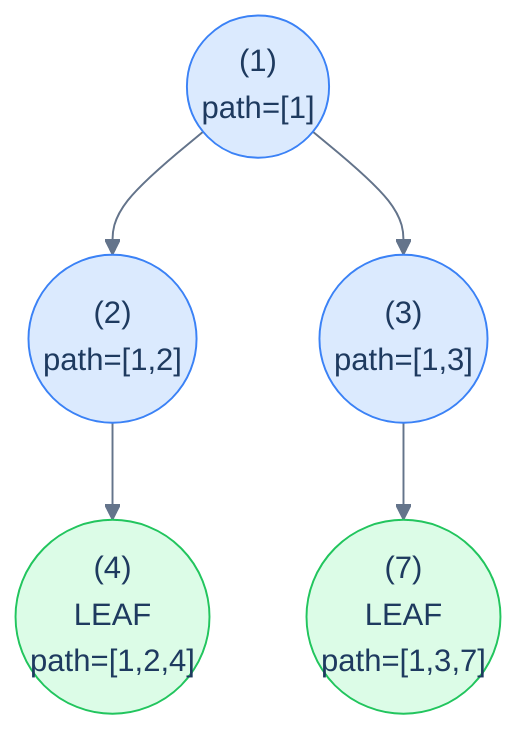

# 13. Pattern: Root-to-Leaf Path (Stateful)

## The Hook

The previous lesson handled root-to-leaf path problems where the per-path *answer* was a single small value — a boolean ("does the path satisfy …?"), a count, a sum. The accumulator was an immutable scalar and the recursion stayed pure.

But what about *"return the actual list of nodes in every root-to-leaf path that sums to 17"*? Or *"return all paths whose values are equal-numbers of evens and odds"*? Or *"find all root-to-leaf paths that appear more than once in the tree"*? These problems still walk the tree the same way, but the answer at each leaf is *the path itself* — and the path is a list of N nodes, not a number. Copying a list of length N at every recursive call would blow the algorithm to O(N²) time and O(N²) extra space. We need to *share* the list across the recursion.

The solution is the **mutate-then-undo** discipline you already met in stateful preorder (lesson 9): push the current node onto a shared `path` list as we descend, do the work at each leaf (record a copy of the path if it satisfies the condition), and pop the node off as we return. The recursion behaves *as if* each call had its own private path snapshot — but only the deltas are mutated, in O(1) per node, so the total cost stays O(N) plus the cost of recording matched paths.

This is the **stateful root-to-leaf path pattern**. It's the workhorse for any tree problem where the *answer is the path*, not just a property of the path. *Path enumeration*, *equal-counts paths*, *duplicate path detection*, *prefix-sum tricks on paths* — all the same recipe with different per-leaf checks.

This lesson defines the recipe, walks through four canonical problems (collect paths summing to a target, equal-evens-and-odds paths, duplicate paths, prefix-sum paths), and implements each in 10 languages.

---

## Table of contents

1. [The stateful root-to-leaf path pattern](#the-stateful-root-to-leaf-path-pattern)
2. [How to recognise it](#how-to-recognise-it)
3. [Problem 1 — Root-to-leaf paths summing to target](#problem-1--root-to-leaf-paths-summing-to-target)
4. [Problem 2 — Equal evens-and-odds paths](#problem-2--equal-evens-and-odds-paths)
5. [Problem 3 — Duplicate paths](#problem-3--duplicate-paths)
6. [Problem 4 — Prefix paths](#problem-4--prefix-paths)

***

# The stateful root-to-leaf path pattern

```text
recurse(node, sharedPath):
  if node is null: return
  push(sharedPath, node)                  # mutate
  if node is a leaf:
    if check(sharedPath): record(sharedPath)
  else:
    recurse(node.left,  sharedPath)
    recurse(node.right, sharedPath)
  pop(sharedPath)                         # undo
```

The discipline is **identical** to stateful preorder: push on entry, recurse, pop on exit. The only difference from lesson 9 is *when* and *what* you check — only at leaves, and you record a *copy* of the path (not the live shared list, which would mutate out from under you).



<p align="center"><strong>Stateful root-to-leaf — the shared <code>path</code> contains exactly the current root-to-current-node sequence at every recursive call. At each leaf, we have a complete root-to-leaf path; record a <em>copy</em> if it qualifies.</strong></p>

> **Why copy at the leaf?** Because the live `path` list is going to be popped from on the way back up. If you saved a *reference*, you'd end up with a dozen different paths in your output that all secretly point at the same (now empty) list. Always copy when extracting from a shared mutable.

## Generic pattern in 10 languages

The "collect all root-to-leaf paths" template — the simplest member of the family.

<div class="lang-tabs">

```python,editable
from typing import List, Optional

class TreeNode:
    def __init__(self, val=0, left=None, right=None):
        self.val, self.left, self.right = val, left, right

def all_root_to_leaf_paths(root: Optional[TreeNode]) -> List[List[int]]:
    out: List[List[int]] = []
    path: List[int] = []
    def go(n):
        if n is None: return
        path.append(n.val)                              # push
        if n.left is None and n.right is None:
            out.append(path.copy())                     # leaf: snapshot the path
        else:
            go(n.left); go(n.right)
        path.pop()                                       # pop
    go(root)
    return out
```

```java,editable
static List<Integer> path;
static List<List<Integer>> out;
static void allHelper(TreeNode n) {
    if (n == null) return;
    path.add(n.val);
    if (n.left == null && n.right == null) {
        out.add(new ArrayList<>(path));                 // copy
    } else {
        allHelper(n.left); allHelper(n.right);
    }
    path.remove(path.size() - 1);
}
public static List<List<Integer>> allRootToLeafPaths(TreeNode root) {
    out = new ArrayList<>(); path = new ArrayList<>();
    allHelper(root);
    return out;
}
```

```c,editable
// out is a 2D array; path is a stack; both bounded for the demo
static int path[64], path_top = -1;
static int out[64][64], out_lens[64], out_count = 0;
void all_helper(TreeNode *n) {
    if (!n) return;
    path[++path_top] = n->val;
    if (!n->left && !n->right) {
        for (int i = 0; i <= path_top; i++) out[out_count][i] = path[i];
        out_lens[out_count++] = path_top + 1;
    } else {
        all_helper(n->left); all_helper(n->right);
    }
    path_top--;
}
```

```cpp,editable
std::vector<int> path;
std::vector<std::vector<int>> out;
void allHelper(TreeNode *n) {
    if (!n) return;
    path.push_back(n->val);
    if (!n->left && !n->right) out.push_back(path);
    else { allHelper(n->left); allHelper(n->right); }
    path.pop_back();
}
std::vector<std::vector<int>> allRootToLeafPaths(TreeNode *root) {
    out.clear(); path.clear();
    allHelper(root);
    return out;
}
```

```scala,editable
def allRootToLeafPaths(root: TreeNode): List[List[Int]] = {
  val path = scala.collection.mutable.ListBuffer[Int]()
  val out  = scala.collection.mutable.ListBuffer[List[Int]]()
  def go(n: TreeNode): Unit = {
    if (n == null) return
    path += n.value
    if (n.left == null && n.right == null) out += path.toList
    else { go(n.left); go(n.right) }
    path.remove(path.length - 1)
  }
  go(root)
  out.toList
}
```

```javascript,editable
function allRootToLeafPaths(root) {
    const out = [], path = [];
    function go(n) {
        if (!n) return;
        path.push(n.val);
        if (!n.left && !n.right) out.push([...path]);
        else { go(n.left); go(n.right); }
        path.pop();
    }
    go(root);
    return out;
}
```

```typescript,editable
function allRootToLeafPaths(root: TreeNode | null): number[][] {
    const out: number[][] = []; const path: number[] = [];
    function go(n: TreeNode | null): void {
        if (!n) return;
        path.push(n.val);
        if (!n.left && !n.right) out.push([...path]);
        else { go(n.left); go(n.right); }
        path.pop();
    }
    go(root);
    return out;
}
```

```go,editable
func allRootToLeafPaths(root *TreeNode) [][]int {
    var out [][]int
    var path []int
    var go_ func(*TreeNode)
    go_ = func(n *TreeNode) {
        if n == nil { return }
        path = append(path, n.Val)
        if n.Left == nil && n.Right == nil {
            cp := make([]int, len(path)); copy(cp, path)
            out = append(out, cp)
        } else { go_(n.Left); go_(n.Right) }
        path = path[:len(path)-1]
    }
    go_(root); return out
}
```

```kotlin,editable
fun allRootToLeafPaths(root: TreeNode?): List<List<Int>> {
    val out = mutableListOf<List<Int>>(); val path = mutableListOf<Int>()
    fun go(n: TreeNode?) {
        if (n == null) return
        path += n.value
        if (n.left == null && n.right == null) out += path.toList()
        else { go(n.left); go(n.right) }
        path.removeAt(path.size - 1)
    }
    go(root); return out
}
```

```rust,editable
fn arl_go(node: &Option<Box<TreeNode>>, path: &mut Vec<i32>, out: &mut Vec<Vec<i32>>) {
    if let Some(n) = node {
        path.push(n.val);
        if n.left.is_none() && n.right.is_none() {
            out.push(path.clone());
        } else {
            arl_go(&n.left,  path, out);
            arl_go(&n.right, path, out);
        }
        path.pop();
    }
}
pub fn all_root_to_leaf_paths(root: &Option<Box<TreeNode>>) -> Vec<Vec<i32>> {
    let mut out = Vec::new(); let mut path = Vec::new();
    arl_go(root, &mut path, &mut out);
    out
}
```

</div>

## Complexity

> **Time:** O(N · L) where L is the average path length — every path that gets recorded is copied. **Space:** O(h) for recursion + path stack, plus O(answer size) for output.

***

# How to recognise it

The pattern fits when:

- The unit of interest is a **complete root-to-leaf path** (same as the previous lesson), AND
- The answer needs the **actual nodes** in each path (not just a per-path verdict you can fold into a number).

Concrete cues:

- *"Return all root-to-leaf paths where …"* — collect path snapshots.
- *"Find all paths whose nodes satisfy …"* — same.
- *"Detect duplicate / prefix / palindromic / specially-structured paths"* — push-pop + per-path data structure (hash, multiset, prefix-sum map).

Anti-pattern: if all you need is a count, sum, or boolean per path, use the *stateless* variant from the previous lesson — it's strictly cheaper.

***

# Problem 1 — Root-to-leaf paths summing to target

> Return *all* root-to-leaf paths whose node values sum to `target`.

The accumulator is *the path so far* (push-pop) plus *the running sum* (passed by value). At each leaf, if the running sum equals the target, snapshot the path.

## Solution

<div class="lang-tabs">

```python,editable
def root_to_leaf_paths(root, target):
    out, path = [], []
    def go(n, remaining):
        if n is None: return
        path.append(n.val)
        remaining -= n.val
        if n.left is None and n.right is None:
            if remaining == 0: out.append(path.copy())
        else:
            go(n.left, remaining); go(n.right, remaining)
        path.pop()
    go(root, target)
    return out
```

```java,editable
static List<Integer> path;
static List<List<Integer>> out;
static void rtlpHelper(TreeNode n, int remaining) {
    if (n == null) return;
    path.add(n.val);
    remaining -= n.val;
    if (n.left == null && n.right == null) {
        if (remaining == 0) out.add(new ArrayList<>(path));
    } else {
        rtlpHelper(n.left, remaining); rtlpHelper(n.right, remaining);
    }
    path.remove(path.size() - 1);
}
public static List<List<Integer>> rootToLeafPaths(TreeNode root, int target) {
    out = new ArrayList<>(); path = new ArrayList<>();
    rtlpHelper(root, target);
    return out;
}
```

```c,editable
static int path[64], path_top = -1;
static int out[64][64], out_lens[64], out_count = 0;
void rtlp_helper(TreeNode *n, int remaining) {
    if (!n) return;
    path[++path_top] = n->val;
    remaining -= n->val;
    if (!n->left && !n->right) {
        if (remaining == 0) {
            for (int i = 0; i <= path_top; i++) out[out_count][i] = path[i];
            out_lens[out_count++] = path_top + 1;
        }
    } else {
        rtlp_helper(n->left, remaining); rtlp_helper(n->right, remaining);
    }
    path_top--;
}
```

```cpp,editable
std::vector<int> g_path;
std::vector<std::vector<int>> g_out;
void rtlpHelper(TreeNode *n, int remaining) {
    if (!n) return;
    g_path.push_back(n->val);
    remaining -= n->val;
    if (!n->left && !n->right) {
        if (remaining == 0) g_out.push_back(g_path);
    } else {
        rtlpHelper(n->left, remaining); rtlpHelper(n->right, remaining);
    }
    g_path.pop_back();
}
std::vector<std::vector<int>> rootToLeafPaths(TreeNode *root, int target) {
    g_out.clear(); g_path.clear();
    rtlpHelper(root, target);
    return g_out;
}
```

```scala,editable
def rootToLeafPaths(root: TreeNode, target: Int): List[List[Int]] = {
  val path = scala.collection.mutable.ListBuffer[Int]()
  val out  = scala.collection.mutable.ListBuffer[List[Int]]()
  def go(n: TreeNode, remaining: Int): Unit = {
    if (n == null) return
    path += n.value
    val rem = remaining - n.value
    if (n.left == null && n.right == null) {
      if (rem == 0) out += path.toList
    } else { go(n.left, rem); go(n.right, rem) }
    path.remove(path.length - 1)
  }
  go(root, target); out.toList
}
```

```javascript,editable
function rootToLeafPaths(root, target) {
    const out = [], path = [];
    function go(n, remaining) {
        if (!n) return;
        path.push(n.val);
        remaining -= n.val;
        if (!n.left && !n.right) {
            if (remaining === 0) out.push([...path]);
        } else { go(n.left, remaining); go(n.right, remaining); }
        path.pop();
    }
    go(root, target);
    return out;
}
```

```typescript,editable
function rootToLeafPaths(root: TreeNode | null, target: number): number[][] {
    const out: number[][] = []; const path: number[] = [];
    function go(n: TreeNode | null, remaining: number): void {
        if (!n) return;
        path.push(n.val);
        remaining -= n.val;
        if (!n.left && !n.right) {
            if (remaining === 0) out.push([...path]);
        } else { go(n.left, remaining); go(n.right, remaining); }
        path.pop();
    }
    go(root, target);
    return out;
}
```

```go,editable
func rootToLeafPaths(root *TreeNode, target int) [][]int {
    var out [][]int; var path []int
    var go_ func(*TreeNode, int)
    go_ = func(n *TreeNode, remaining int) {
        if n == nil { return }
        path = append(path, n.Val)
        remaining -= n.Val
        if n.Left == nil && n.Right == nil {
            if remaining == 0 {
                cp := make([]int, len(path)); copy(cp, path)
                out = append(out, cp)
            }
        } else { go_(n.Left, remaining); go_(n.Right, remaining) }
        path = path[:len(path)-1]
    }
    go_(root, target); return out
}
```

```kotlin,editable
fun rootToLeafPaths(root: TreeNode?, target: Int): List<List<Int>> {
    val out = mutableListOf<List<Int>>(); val path = mutableListOf<Int>()
    fun go(n: TreeNode?, remaining: Int) {
        if (n == null) return
        path += n.value
        val rem = remaining - n.value
        if (n.left == null && n.right == null) {
            if (rem == 0) out += path.toList()
        } else { go(n.left, rem); go(n.right, rem) }
        path.removeAt(path.size - 1)
    }
    go(root, target); return out
}
```

```rust,editable
fn rtlp_go(node: &Option<Box<TreeNode>>, remaining: i32, path: &mut Vec<i32>, out: &mut Vec<Vec<i32>>) {
    if let Some(n) = node {
        path.push(n.val);
        let rem = remaining - n.val;
        if n.left.is_none() && n.right.is_none() {
            if rem == 0 { out.push(path.clone()); }
        } else {
            rtlp_go(&n.left,  rem, path, out);
            rtlp_go(&n.right, rem, path, out);
        }
        path.pop();
    }
}
pub fn root_to_leaf_paths(root: &Option<Box<TreeNode>>, target: i32) -> Vec<Vec<i32>> {
    let mut out = Vec::new(); let mut path = Vec::new();
    rtlp_go(root, target, &mut path, &mut out);
    out
}
```

</div>

***

# Problem 2 — Equal evens-and-odds paths

> Return all root-to-leaf paths where the number of even-valued nodes equals the number of odd-valued nodes.

Same shape as Problem 1, but the per-path bookkeeping is *two counters* (`evenCount`, `oddCount`) instead of one running sum. At each leaf, snapshot the path if the counts match.

## Solution

<div class="lang-tabs">

```python,editable
def equal_paths(root):
    out, path = [], []
    def go(n, even, odd):
        if n is None: return
        path.append(n.val)
        if n.val % 2 == 0: even += 1
        else:              odd  += 1
        if n.left is None and n.right is None:
            if even == odd: out.append(path.copy())
        else:
            go(n.left, even, odd); go(n.right, even, odd)
        path.pop()
    go(root, 0, 0)
    return out
```

```java,editable
static List<Integer> path;
static List<List<Integer>> out;
static void epHelper(TreeNode n, int even, int odd) {
    if (n == null) return;
    path.add(n.val);
    if (n.val % 2 == 0) even++; else odd++;
    if (n.left == null && n.right == null) {
        if (even == odd) out.add(new ArrayList<>(path));
    } else { epHelper(n.left, even, odd); epHelper(n.right, even, odd); }
    path.remove(path.size() - 1);
}
public static List<List<Integer>> equalPaths(TreeNode root) {
    out = new ArrayList<>(); path = new ArrayList<>();
    epHelper(root, 0, 0); return out;
}
```

```c,editable
void ep_helper(TreeNode *n, int even, int odd) {
    if (!n) return;
    path[++path_top] = n->val;
    if (n->val % 2 == 0) even++; else odd++;
    if (!n->left && !n->right) {
        if (even == odd) {
            for (int i = 0; i <= path_top; i++) out[out_count][i] = path[i];
            out_lens[out_count++] = path_top + 1;
        }
    } else { ep_helper(n->left, even, odd); ep_helper(n->right, even, odd); }
    path_top--;
}
```

```cpp,editable
void epHelper(TreeNode *n, int even, int odd) {
    if (!n) return;
    g_path.push_back(n->val);
    if (n->val % 2 == 0) even++; else odd++;
    if (!n->left && !n->right) {
        if (even == odd) g_out.push_back(g_path);
    } else { epHelper(n->left, even, odd); epHelper(n->right, even, odd); }
    g_path.pop_back();
}
std::vector<std::vector<int>> equalPaths(TreeNode *root) {
    g_out.clear(); g_path.clear();
    epHelper(root, 0, 0); return g_out;
}
```

```scala,editable
def equalPaths(root: TreeNode): List[List[Int]] = {
  val path = scala.collection.mutable.ListBuffer[Int]()
  val out  = scala.collection.mutable.ListBuffer[List[Int]]()
  def go(n: TreeNode, even: Int, odd: Int): Unit = {
    if (n == null) return
    path += n.value
    val (e, o) = if (n.value % 2 == 0) (even + 1, odd) else (even, odd + 1)
    if (n.left == null && n.right == null) {
      if (e == o) out += path.toList
    } else { go(n.left, e, o); go(n.right, e, o) }
    path.remove(path.length - 1)
  }
  go(root, 0, 0); out.toList
}
```

```javascript,editable
function equalPaths(root) {
    const out = [], path = [];
    function go(n, even, odd) {
        if (!n) return;
        path.push(n.val);
        if (n.val % 2 === 0) even++; else odd++;
        if (!n.left && !n.right) {
            if (even === odd) out.push([...path]);
        } else { go(n.left, even, odd); go(n.right, even, odd); }
        path.pop();
    }
    go(root, 0, 0); return out;
}
```

```typescript,editable
function equalPaths(root: TreeNode | null): number[][] {
    const out: number[][] = []; const path: number[] = [];
    function go(n: TreeNode | null, even: number, odd: number): void {
        if (!n) return;
        path.push(n.val);
        if (n.val % 2 === 0) even++; else odd++;
        if (!n.left && !n.right) {
            if (even === odd) out.push([...path]);
        } else { go(n.left, even, odd); go(n.right, even, odd); }
        path.pop();
    }
    go(root, 0, 0); return out;
}
```

```go,editable
func equalPaths(root *TreeNode) [][]int {
    var out [][]int; var path []int
    var go_ func(*TreeNode, int, int)
    go_ = func(n *TreeNode, even, odd int) {
        if n == nil { return }
        path = append(path, n.Val)
        if n.Val % 2 == 0 { even++ } else { odd++ }
        if n.Left == nil && n.Right == nil {
            if even == odd {
                cp := make([]int, len(path)); copy(cp, path)
                out = append(out, cp)
            }
        } else { go_(n.Left, even, odd); go_(n.Right, even, odd) }
        path = path[:len(path)-1]
    }
    go_(root, 0, 0); return out
}
```

```kotlin,editable
fun equalPaths(root: TreeNode?): List<List<Int>> {
    val out = mutableListOf<List<Int>>(); val path = mutableListOf<Int>()
    fun go(n: TreeNode?, even: Int, odd: Int) {
        if (n == null) return
        path += n.value
        val (e, o) = if (n.value % 2 == 0) (even + 1) to odd else even to (odd + 1)
        if (n.left == null && n.right == null) {
            if (e == o) out += path.toList()
        } else { go(n.left, e, o); go(n.right, e, o) }
        path.removeAt(path.size - 1)
    }
    go(root, 0, 0); return out
}
```

```rust,editable
fn ep_go(node: &Option<Box<TreeNode>>, even: i32, odd: i32, path: &mut Vec<i32>, out: &mut Vec<Vec<i32>>) {
    if let Some(n) = node {
        path.push(n.val);
        let (e, o) = if n.val % 2 == 0 { (even + 1, odd) } else { (even, odd + 1) };
        if n.left.is_none() && n.right.is_none() {
            if e == o { out.push(path.clone()); }
        } else {
            ep_go(&n.left,  e, o, path, out);
            ep_go(&n.right, e, o, path, out);
        }
        path.pop();
    }
}
pub fn equal_paths(root: &Option<Box<TreeNode>>) -> Vec<Vec<i32>> {
    let mut out = Vec::new(); let mut path = Vec::new();
    ep_go(root, 0, 0, &mut path, &mut out);
    out
}
```

</div>

***

# Problem 3 — Duplicate paths

> Return all root-to-leaf paths that appear *more than once* in the tree (i.e. two different leaves produce the same value sequence).

Two ingredients: the push-pop path discipline, plus a **hash map of path-string → count**. At each leaf, serialise the path into a hash-friendly key (e.g. comma-joined string), bump its count, and record the path *exactly once* — when the count first hits 2.

## Solution

<div class="lang-tabs">

```python,editable
def duplicate_paths(root):
    out, path, seen = [], [], {}
    def go(n):
        if n is None: return
        path.append(n.val)
        if n.left is None and n.right is None:
            key = ",".join(map(str, path))
            seen[key] = seen.get(key, 0) + 1
            if seen[key] == 2: out.append(path.copy())
        else:
            go(n.left); go(n.right)
        path.pop()
    go(root)
    return out
```

```java,editable
static List<Integer> path;
static List<List<Integer>> out;
static Map<String, Integer> seen;
static void dpHelper(TreeNode n) {
    if (n == null) return;
    path.add(n.val);
    if (n.left == null && n.right == null) {
        String key = path.toString();
        int c = seen.merge(key, 1, Integer::sum);
        if (c == 2) out.add(new ArrayList<>(path));
    } else { dpHelper(n.left); dpHelper(n.right); }
    path.remove(path.size() - 1);
}
public static List<List<Integer>> duplicatePaths(TreeNode root) {
    out = new ArrayList<>(); path = new ArrayList<>(); seen = new HashMap<>();
    dpHelper(root); return out;
}
```

```cpp,editable
std::vector<int> g_path;
std::vector<std::vector<int>> g_out;
std::unordered_map<std::string, int> g_seen;
std::string serialize(const std::vector<int>& v) {
    std::string s; for (int x : v) { s += std::to_string(x); s += ','; } return s;
}
void dpHelper(TreeNode *n) {
    if (!n) return;
    g_path.push_back(n->val);
    if (!n->left && !n->right) {
        std::string k = serialize(g_path);
        if (++g_seen[k] == 2) g_out.push_back(g_path);
    } else { dpHelper(n->left); dpHelper(n->right); }
    g_path.pop_back();
}
std::vector<std::vector<int>> duplicatePaths(TreeNode *root) {
    g_out.clear(); g_path.clear(); g_seen.clear();
    dpHelper(root); return g_out;
}
```

```c,editable
// Practical C requires a string-keyed hash map; the algorithm is identical:
// serialise the path into a comma-joined string, increment its count,
// emit the path when the count reaches 2. (Implementation omitted for brevity.)
```

```scala,editable
def duplicatePaths(root: TreeNode): List[List[Int]] = {
  val path = scala.collection.mutable.ListBuffer[Int]()
  val out  = scala.collection.mutable.ListBuffer[List[Int]]()
  val seen = scala.collection.mutable.Map[String, Int]()
  def go(n: TreeNode): Unit = {
    if (n == null) return
    path += n.value
    if (n.left == null && n.right == null) {
      val key = path.mkString(",")
      seen(key) = seen.getOrElse(key, 0) + 1
      if (seen(key) == 2) out += path.toList
    } else { go(n.left); go(n.right) }
    path.remove(path.length - 1)
  }
  go(root); out.toList
}
```

```javascript,editable
function duplicatePaths(root) {
    const out = [], path = [], seen = new Map();
    function go(n) {
        if (!n) return;
        path.push(n.val);
        if (!n.left && !n.right) {
            const key = path.join(",");
            const c = (seen.get(key) || 0) + 1;
            seen.set(key, c);
            if (c === 2) out.push([...path]);
        } else { go(n.left); go(n.right); }
        path.pop();
    }
    go(root); return out;
}
```

```typescript,editable
function duplicatePaths(root: TreeNode | null): number[][] {
    const out: number[][] = []; const path: number[] = [];
    const seen = new Map<string, number>();
    function go(n: TreeNode | null): void {
        if (!n) return;
        path.push(n.val);
        if (!n.left && !n.right) {
            const key = path.join(",");
            const c = (seen.get(key) || 0) + 1;
            seen.set(key, c);
            if (c === 2) out.push([...path]);
        } else { go(n.left); go(n.right); }
        path.pop();
    }
    go(root); return out;
}
```

```go,editable
import "strings"
import "strconv"

func duplicatePaths(root *TreeNode) [][]int {
    var out [][]int; var path []int
    seen := map[string]int{}
    serialize := func(p []int) string {
        ss := make([]string, len(p))
        for i, v := range p { ss[i] = strconv.Itoa(v) }
        return strings.Join(ss, ",")
    }
    var go_ func(*TreeNode)
    go_ = func(n *TreeNode) {
        if n == nil { return }
        path = append(path, n.Val)
        if n.Left == nil && n.Right == nil {
            k := serialize(path)
            seen[k]++
            if seen[k] == 2 {
                cp := make([]int, len(path)); copy(cp, path)
                out = append(out, cp)
            }
        } else { go_(n.Left); go_(n.Right) }
        path = path[:len(path)-1]
    }
    go_(root); return out
}
```

```kotlin,editable
fun duplicatePaths(root: TreeNode?): List<List<Int>> {
    val out = mutableListOf<List<Int>>(); val path = mutableListOf<Int>()
    val seen = HashMap<String, Int>()
    fun go(n: TreeNode?) {
        if (n == null) return
        path += n.value
        if (n.left == null && n.right == null) {
            val key = path.joinToString(",")
            val c = (seen[key] ?: 0) + 1
            seen[key] = c
            if (c == 2) out += path.toList()
        } else { go(n.left); go(n.right) }
        path.removeAt(path.size - 1)
    }
    go(root); return out
}
```

```rust,editable
use std::collections::HashMap;
fn dp_go(node: &Option<Box<TreeNode>>, path: &mut Vec<i32>, seen: &mut HashMap<String, i32>, out: &mut Vec<Vec<i32>>) {
    if let Some(n) = node {
        path.push(n.val);
        if n.left.is_none() && n.right.is_none() {
            let key: String = path.iter().map(|x| x.to_string()).collect::<Vec<_>>().join(",");
            let c = seen.entry(key).or_insert(0); *c += 1;
            if *c == 2 { out.push(path.clone()); }
        } else {
            dp_go(&n.left,  path, seen, out);
            dp_go(&n.right, path, seen, out);
        }
        path.pop();
    }
}
pub fn duplicate_paths(root: &Option<Box<TreeNode>>) -> Vec<Vec<i32>> {
    let mut out = Vec::new(); let mut path = Vec::new(); let mut seen = HashMap::new();
    dp_go(root, &mut path, &mut seen, &mut out);
    out
}
```

</div>

***

# Problem 4 — Prefix paths

> Return all root-to-leaf paths whose *total sum* equals the sum of some non-empty *prefix* of the same path.
>
> **Example:** path `[1, -3, 3]` has total sum 1 — and the prefix `[1]` also has sum 1. So this path qualifies.

Combine the path discipline with a **prefix-sum frequency map**. As we descend, increment the count of the running prefix-sum at the current depth. At a leaf, if the running sum has been seen *more than once* (count > 1), it means a strictly earlier prefix of the path had the same sum — qualifying the path.

## Solution

<div class="lang-tabs">

```python,editable
def prefix_paths(root):
    out, path, freq = [], [], {}
    def go(n, run):
        if n is None: return
        path.append(n.val)
        run += n.val
        freq[run] = freq.get(run, 0) + 1
        if n.left is None and n.right is None:
            if freq[run] > 1: out.append(path.copy())
        else:
            go(n.left, run); go(n.right, run)
        freq[run] -= 1
        if freq[run] == 0: del freq[run]
        path.pop()
    go(root, 0)
    return out
```

```java,editable
static List<Integer> path;
static List<List<Integer>> out;
static Map<Integer, Integer> freq;
static void ppHelper(TreeNode n, int run) {
    if (n == null) return;
    path.add(n.val);
    run += n.val;
    int c = freq.merge(run, 1, Integer::sum);
    if (n.left == null && n.right == null) {
        if (c > 1) out.add(new ArrayList<>(path));
    } else { ppHelper(n.left, run); ppHelper(n.right, run); }
    if (freq.get(run) == 1) freq.remove(run); else freq.merge(run, -1, Integer::sum);
    path.remove(path.size() - 1);
}
public static List<List<Integer>> prefixPaths(TreeNode root) {
    out = new ArrayList<>(); path = new ArrayList<>(); freq = new HashMap<>();
    ppHelper(root, 0); return out;
}
```

```c,editable
// Same as duplicate-paths: requires a hash map. Algorithm omitted for brevity.
```

```cpp,editable
std::unordered_map<int, int> g_freq;
void ppHelper(TreeNode *n, int run) {
    if (!n) return;
    g_path.push_back(n->val);
    run += n->val;
    int c = ++g_freq[run];
    if (!n->left && !n->right) {
        if (c > 1) g_out.push_back(g_path);
    } else { ppHelper(n->left, run); ppHelper(n->right, run); }
    if (--g_freq[run] == 0) g_freq.erase(run);
    g_path.pop_back();
}
std::vector<std::vector<int>> prefixPaths(TreeNode *root) {
    g_out.clear(); g_path.clear(); g_freq.clear();
    ppHelper(root, 0); return g_out;
}
```

```scala,editable
def prefixPaths(root: TreeNode): List[List[Int]] = {
  val path = scala.collection.mutable.ListBuffer[Int]()
  val out  = scala.collection.mutable.ListBuffer[List[Int]]()
  val freq = scala.collection.mutable.Map[Int, Int]()
  def go(n: TreeNode, run: Int): Unit = {
    if (n == null) return
    path += n.value
    val newRun = run + n.value
    freq(newRun) = freq.getOrElse(newRun, 0) + 1
    if (n.left == null && n.right == null) {
      if (freq(newRun) > 1) out += path.toList
    } else { go(n.left, newRun); go(n.right, newRun) }
    val c = freq(newRun) - 1
    if (c == 0) freq.remove(newRun) else freq(newRun) = c
    path.remove(path.length - 1)
  }
  go(root, 0); out.toList
}
```

```javascript,editable
function prefixPaths(root) {
    const out = [], path = [], freq = new Map();
    function go(n, run) {
        if (!n) return;
        path.push(n.val);
        run += n.val;
        const c = (freq.get(run) || 0) + 1;
        freq.set(run, c);
        if (!n.left && !n.right) {
            if (c > 1) out.push([...path]);
        } else { go(n.left, run); go(n.right, run); }
        const newC = freq.get(run) - 1;
        if (newC === 0) freq.delete(run); else freq.set(run, newC);
        path.pop();
    }
    go(root, 0); return out;
}
```

```typescript,editable
function prefixPaths(root: TreeNode | null): number[][] {
    const out: number[][] = []; const path: number[] = [];
    const freq = new Map<number, number>();
    function go(n: TreeNode | null, run: number): void {
        if (!n) return;
        path.push(n.val);
        run += n.val;
        const c = (freq.get(run) || 0) + 1;
        freq.set(run, c);
        if (!n.left && !n.right) {
            if (c > 1) out.push([...path]);
        } else { go(n.left, run); go(n.right, run); }
        const newC = (freq.get(run) || 0) - 1;
        if (newC === 0) freq.delete(run); else freq.set(run, newC);
        path.pop();
    }
    go(root, 0); return out;
}
```

```go,editable
func prefixPaths(root *TreeNode) [][]int {
    var out [][]int; var path []int
    freq := map[int]int{}
    var go_ func(*TreeNode, int)
    go_ = func(n *TreeNode, run int) {
        if n == nil { return }
        path = append(path, n.Val)
        run += n.Val
        freq[run]++
        if n.Left == nil && n.Right == nil {
            if freq[run] > 1 {
                cp := make([]int, len(path)); copy(cp, path)
                out = append(out, cp)
            }
        } else { go_(n.Left, run); go_(n.Right, run) }
        freq[run]--
        if freq[run] == 0 { delete(freq, run) }
        path = path[:len(path)-1]
    }
    go_(root, 0); return out
}
```

```kotlin,editable
fun prefixPaths(root: TreeNode?): List<List<Int>> {
    val out = mutableListOf<List<Int>>(); val path = mutableListOf<Int>()
    val freq = HashMap<Int, Int>()
    fun go(n: TreeNode?, run: Int) {
        if (n == null) return
        path += n.value
        val newRun = run + n.value
        val c = (freq[newRun] ?: 0) + 1
        freq[newRun] = c
        if (n.left == null && n.right == null) {
            if (c > 1) out += path.toList()
        } else { go(n.left, newRun); go(n.right, newRun) }
        val newC = freq[newRun]!! - 1
        if (newC == 0) freq.remove(newRun) else freq[newRun] = newC
        path.removeAt(path.size - 1)
    }
    go(root, 0); return out
}
```

```rust,editable
use std::collections::HashMap;
fn pp_go(node: &Option<Box<TreeNode>>, run: i32, path: &mut Vec<i32>, freq: &mut HashMap<i32, i32>, out: &mut Vec<Vec<i32>>) {
    if let Some(n) = node {
        path.push(n.val);
        let new_run = run + n.val;
        let c = freq.entry(new_run).or_insert(0); *c += 1;
        let count_now = *c;
        if n.left.is_none() && n.right.is_none() {
            if count_now > 1 { out.push(path.clone()); }
        } else {
            pp_go(&n.left,  new_run, path, freq, out);
            pp_go(&n.right, new_run, path, freq, out);
        }
        let c = freq.get_mut(&new_run).unwrap(); *c -= 1;
        if *c == 0 { freq.remove(&new_run); }
        path.pop();
    }
}
pub fn prefix_paths(root: &Option<Box<TreeNode>>) -> Vec<Vec<i32>> {
    let mut out = Vec::new(); let mut path = Vec::new(); let mut freq = HashMap::new();
    pp_go(root, 0, &mut path, &mut freq, &mut out);
    out
}
```

</div>

***

## Final Takeaway

The stateful root-to-leaf path pattern is the natural sibling of stateless preorder backtracking. Three things to walk away with:

1. **Push-pop is sacred — and the leaf needs a *copy*.** The shared `path` is being mutated; if you record a reference to it and then return, the path you stored will get clobbered as the recursion backs out. Always copy on extract — `path.copy()`, `new ArrayList<>(path)`, `[...path]`, `path.clone()` — never store the live reference.
2. **Auxiliary data per problem.** Sum target → running integer. Equal evens-and-odds → two counters. Duplicate paths → hash map of serialised paths. Prefix paths → hash map of running prefix sums. The path itself is the canonical accumulator; the per-problem aux is what *interprets* the path.
3. **Returning paths is expensive even when the algorithm is cheap.** Recording matched paths is O(L) per match. If you're collecting *every* path, total output size is O(N · L) — that's irreducible. The recursion stays O(N) but the output dominates the cost.

> *Coming up — the chapter shifts from depth-first patterns to **level-order** patterns. The next two lessons cover BFS-based tree problems: per-level aggregations, deepest-leaf computations, completeness checks, zigzag traversal, cousin checks, and column-based traversals (top view, bottom view, vertical, diagonal). The queue from chapter 6 finally takes centre stage.*
