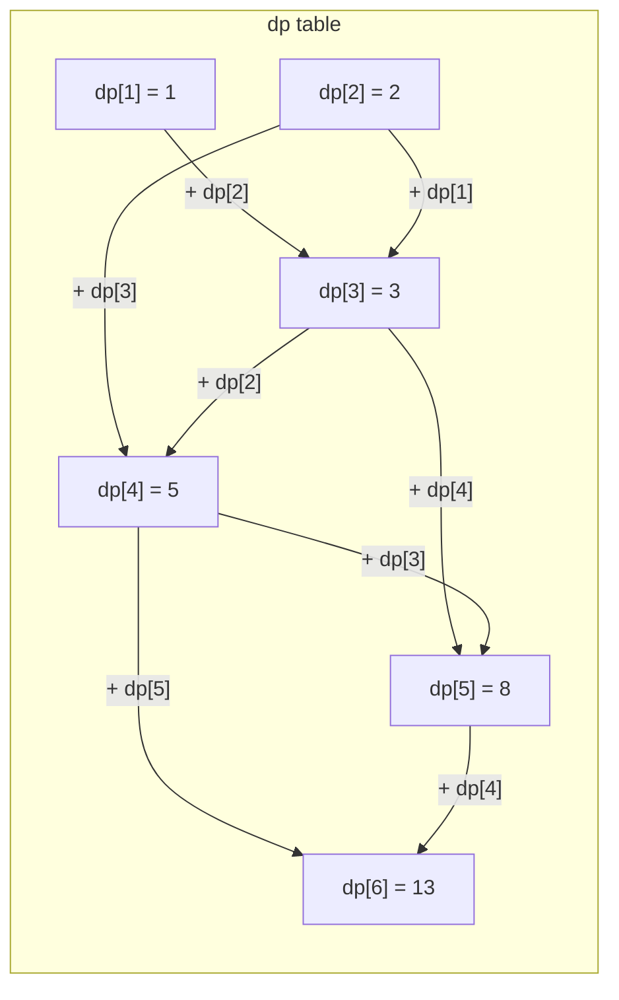

# 1-Dimension DP

Climbing stairs — how many ways can you reach step n if you can climb 1 or 2 steps at a time?

That deceptively simple question is the gateway to 1D dynamic programming. The "1D" means the state of the problem depends on a single integer — in this case, which step you are currently on. Once you can solve the stair problem, you can solve a surprisingly large family of real-world problems using identical thinking.

---

## The Stair-Climbing Problem

**Problem:** You are at the bottom of a staircase with `n` steps. Each move you can climb either 1 step or 2 steps. How many distinct ways can you reach the top?

Let's work out small cases by hand first.

| Steps (n) | Ways to climb | Paths |
|---|---|---|
| 1 | 1 | (1) |
| 2 | 2 | (1,1) or (2) |
| 3 | 3 | (1,1,1), (1,2), (2,1) |
| 4 | 5 | (1,1,1,1), (1,1,2), (1,2,1), (2,1,1), (2,2) |
| 5 | 8 | ... |

Notice the pattern? The number of ways to reach step `n` equals the number of ways to reach step `n-1` (then take 1 step) plus the number of ways to reach step `n-2` (then take 2 steps). That's the key insight.

### The Recurrence Relation

```
dp[i] = dp[i-1] + dp[i-2]

Base cases:
  dp[1] = 1   (only one way to reach step 1)
  dp[2] = 2   (two ways to reach step 2)
```

This is Fibonacci in disguise. Recognising recurrence relations is the core skill of 1D DP.

---

## Visualising the DP Table

For `n = 6`, here is how the table fills in from left to right:



Each cell depends only on its two immediate predecessors. We never need to go back further.

---

## Implementation: Tabulation (Bottom-Up)

Start at the base cases and fill forward. This is the most natural approach for this problem.

```python,editable
def climb_stairs_tabulation(n):
    if n <= 2:
        return n

    dp = [0] * (n + 1)
    dp[1] = 1
    dp[2] = 2

    for i in range(3, n + 1):
        dp[i] = dp[i - 1] + dp[i - 2]

    print(f"DP table for n={n}: {dp[1:]}")
    return dp[n]

for steps in [1, 2, 3, 4, 5, 6, 10]:
    print(f"climb_stairs({steps}) = {climb_stairs_tabulation(steps)}")
```

---

## Implementation: Memoization (Top-Down)

Start from `n` and recurse down, caching every result.

```python,editable
def climb_stairs_memo(n, cache=None):
    if cache is None:
        cache = {}
    if n in cache:
        return cache[n]
    if n <= 2:
        return n
    cache[n] = climb_stairs_memo(n - 1, cache) + climb_stairs_memo(n - 2, cache)
    return cache[n]

for steps in [1, 2, 3, 4, 5, 6, 10]:
    print(f"climb_stairs({steps}) = {climb_stairs_memo(steps)}")
```

Both produce the same answers. The tabulation approach is usually preferred for 1D DP because it is iterative — no recursion depth, no cache overhead.

---

## Space Optimisation: O(1) Memory

Because `dp[i]` only ever looks back two positions, you do not need to store the full table — just keep a rolling pair of values.

```python,editable
def climb_stairs_optimised(n):
    if n <= 2:
        return n

    prev2, prev1 = 1, 2
    for _ in range(3, n + 1):
        prev2, prev1 = prev1, prev1 + prev2

    return prev1

# Same results, O(1) space instead of O(n)
for steps in [1, 2, 5, 10, 20, 40]:
    print(f"climb_stairs({steps}) = {climb_stairs_optimised(steps)}")
```

This is a common final optimisation after you have the table-based solution working correctly.

---

## Second Example: House Robber

**Problem:** You are a thief on a street of houses. Each house `i` has `nums[i]` dollars inside. You cannot rob two adjacent houses (the alarm will trigger). What is the maximum amount you can steal?

For example, `[2, 7, 9, 3, 1]` — the optimal is to rob houses at indices 0, 2, 4 for `2 + 9 + 1 = 12`.

### Recurrence Relation

At each house `i` you make a choice:
- **Rob house `i`**: gain `nums[i]` plus the best you could do up to house `i-2`
- **Skip house `i`**: take whatever the best was up to house `i-1`

```
dp[i] = max(dp[i-1], dp[i-2] + nums[i])
```

```python,editable
def house_robber(nums):
    n = len(nums)
    if n == 0:
        return 0
    if n == 1:
        return nums[0]

    dp = [0] * n
    dp[0] = nums[0]
    dp[1] = max(nums[0], nums[1])

    for i in range(2, n):
        dp[i] = max(dp[i - 1], dp[i - 2] + nums[i])

    print(f"Houses: {nums}")
    print(f"DP table: {dp}")
    return dp[-1]

examples = [
    [2, 7, 9, 3, 1],
    [1, 2, 3, 1],
    [5, 1, 1, 5],
    [2, 1, 1, 2],
]

for nums in examples:
    print(f"Max loot = {house_robber(nums)}")
    print()
```

Notice how `dp[i]` "locks in" the best possible answer considering only the first `i+1` houses. By the time you reach the end of the array, `dp[-1]` is the global optimum.

---

## The General 1D DP Recipe

```
1. Define what dp[i] represents in plain English
2. Write the recurrence relation: how dp[i] depends on earlier dp values
3. Identify the base case(s): the smallest i you can answer directly
4. Fill the table from the base cases forward
5. (Optional) check if you only need the last k values and optimise space
```

Every 1D DP problem follows this same five-step structure.

---

## Real-World Applications

- **Financial portfolio optimisation** — Given a list of investments and a budget, DP computes the maximum return subject to constraints (a variant of the knapsack problem, which is 1D DP).

- **DNA sequence matching** — Comparing a short query sequence against a long genome uses 1D DP windows to score likely alignment positions before committing to the expensive 2D alignment.

- **Text justification** — Word processors like LaTeX use DP to break paragraphs into lines that minimise raggedness, treating each word position as a 1D state.
