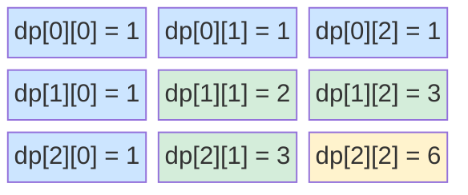
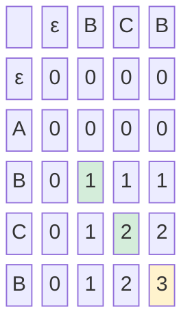

# 2-Dimension DP

Unique paths in a grid — a robot at the top-left corner of an `m x n` grid wants to reach the bottom-right corner, moving only right or down. How many distinct paths are there?

This question introduces 2D dynamic programming: problems where the answer depends on two changing indices simultaneously. The dp table becomes a two-dimensional grid instead of a one-dimensional array — and the thinking scales to problems that power git, spell-checkers, and genomic research.

---

## The Unique Paths Problem

**Problem:** A robot starts at position `(0, 0)` in an `m x n` grid. It can only move right or down. How many distinct paths lead to `(m-1, n-1)`?

### Working It Out By Hand (3 x 3 Grid)

The top row can only be reached by moving right the whole way — there is exactly 1 path to every cell in the top row. The leftmost column can only be reached by moving down the whole way — there is exactly 1 path to every cell in that column too. Every other cell can be reached either from the cell above it or the cell to its left:

```
dp[r][c] = dp[r-1][c] + dp[r][c-1]
```

For a 3x3 grid:

```
Start  →  →
  ↓  [1] [1] [1]
  ↓  [1] [2] [3]
  ↓  [1] [3] [6]   ← answer: 6
```

### Filling the DP Table as a Mermaid Grid



Blue cells are base cases (all 1s). Green cells are computed from two predecessors. Yellow cell is the answer.

---

## Implementation

```python,editable
def unique_paths(rows, cols):
    # Create a 2D table, initialised to 1
    # (handles all base cases in the top row and left column)
    dp = [[1] * cols for _ in range(rows)]

    for r in range(1, rows):
        for c in range(1, cols):
            dp[r][c] = dp[r - 1][c] + dp[r][c - 1]

    # Print the table
    print(f"DP table for {rows}x{cols} grid:")
    for row in dp:
        print("  ", row)
    print(f"Answer: {dp[rows - 1][cols - 1]}")
    return dp[rows - 1][cols - 1]

for r, c in [(2, 2), (3, 3), (3, 7), (4, 4)]:
    unique_paths(r, c)
    print()
```

---

## Second Example: Longest Common Subsequence (LCS)

The Longest Common Subsequence is the algorithm at the heart of `git diff`, plagiarism checkers, and DNA sequence comparison. Understanding it means understanding how those tools actually work.

**Problem:** Given two strings, find the length of their longest common subsequence — a sequence of characters that appears in both strings in the same order, but not necessarily contiguously.

```
s1 = "ABCBDAB"
s2 = "BDCABA"

LCS = "BCBA"  (length 4)
```

### The Recurrence Relation

Let `dp[i][j]` be the length of the LCS of `s1[:i]` and `s2[:j]`.

```
If s1[i-1] == s2[j-1]:
    dp[i][j] = dp[i-1][j-1] + 1      (characters match — extend the LCS)
Else:
    dp[i][j] = max(dp[i-1][j], dp[i][j-1])   (characters don't match — take the best of skipping one)
```

### The LCS DP Table

For `s1 = "ABCB"` and `s2 = "BCB"`:



The answer `3` is in the bottom-right. The actual LCS characters can be recovered by tracing back through the table.

---

## Implementation: LCS

```python,editable
def lcs(s1, s2):
    m, n = len(s1), len(s2)

    # Build the DP table
    dp = [[0] * (n + 1) for _ in range(m + 1)]

    for i in range(1, m + 1):
        for j in range(1, n + 1):
            if s1[i - 1] == s2[j - 1]:
                dp[i][j] = dp[i - 1][j - 1] + 1
            else:
                dp[i][j] = max(dp[i - 1][j], dp[i][j - 1])

    # Traceback to recover the actual subsequence
    lcs_str = []
    i, j = m, n
    while i > 0 and j > 0:
        if s1[i - 1] == s2[j - 1]:
            lcs_str.append(s1[i - 1])
            i -= 1
            j -= 1
        elif dp[i - 1][j] > dp[i][j - 1]:
            i -= 1
        else:
            j -= 1

    lcs_str.reverse()

    print(f"s1 = {s1!r}")
    print(f"s2 = {s2!r}")
    print(f"LCS length = {dp[m][n]}")
    print(f"LCS = {''.join(lcs_str)!r}")
    return dp[m][n]

pairs = [
    ("ABCBDAB", "BDCABA"),
    ("AGGTAB",  "GXTXAYB"),
    ("ABCDE",   "ACE"),
    ("abcdef",  "acf"),
]

for a, b in pairs:
    lcs(a, b)
    print()
```

---

## Bonus: Edit Distance (Spell Checkers)

Edit distance — also called Levenshtein distance — counts the minimum number of single-character edits (insertions, deletions, substitutions) to turn one string into another. It is a direct extension of the LCS table.

```python,editable
def edit_distance(s1, s2):
    m, n = len(s1), len(s2)
    dp = [[0] * (n + 1) for _ in range(m + 1)]

    # Base cases: transforming empty string to s2[:j] costs j insertions
    for i in range(m + 1):
        dp[i][0] = i
    for j in range(n + 1):
        dp[0][j] = j

    for i in range(1, m + 1):
        for j in range(1, n + 1):
            if s1[i - 1] == s2[j - 1]:
                dp[i][j] = dp[i - 1][j - 1]          # No edit needed
            else:
                dp[i][j] = 1 + min(
                    dp[i - 1][j],       # Delete from s1
                    dp[i][j - 1],       # Insert into s1
                    dp[i - 1][j - 1]    # Substitute
                )

    print(f"Edit distance({s1!r}, {s2!r}) = {dp[m][n]}")
    return dp[m][n]

# Spell-checker style examples
edit_distance("kitten",  "sitting")   # Classic example
edit_distance("sunday",  "saturday")
edit_distance("python",  "pyhton")    # Transposition typo
edit_distance("abc",     "abc")       # Identical
```

Every time your phone auto-corrects a typo or a search engine suggests "did you mean X?", a variant of this 2D DP table is being filled.

---

## The General 2D DP Recipe

```
1. Define dp[i][j] in plain English
   (e.g. "the length of the LCS of s1[:i] and s2[:j]")
2. Write the recurrence: how dp[i][j] depends on dp[i-1][j], dp[i][j-1], dp[i-1][j-1]
3. Identify base cases: what are dp[0][j] and dp[i][0]?
4. Fill the table — usually row by row, left to right
5. Answer is usually at dp[m][n] (bottom-right corner)
6. If you need the actual solution (not just its length/cost), traceback through the table
```

---

## Real-World Applications

- **Git diff** — The `diff` algorithm computes the LCS of two files line by line. Lines in the LCS are unchanged; everything else is an insertion or deletion. This is why `git diff` is accurate even for complex edits.

- **Plagiarism detection** — Plagiarism checkers compute LCS or edit distance between submitted documents to find suspiciously similar passages.

- **Bioinformatics** — BLAST and Smith-Waterman alignment use 2D DP to align DNA and protein sequences, tolerating mutations (substitutions), insertions, and deletions across millions of base pairs.

- **Spell checkers and autocomplete** — Edit distance powers every "did you mean?" suggestion. The smaller the edit distance, the higher the suggestion is ranked.

- **Speech recognition** — Dynamic Time Warping (a variant of 2D DP) aligns spoken audio sequences to reference templates, handling differences in speaking speed.
