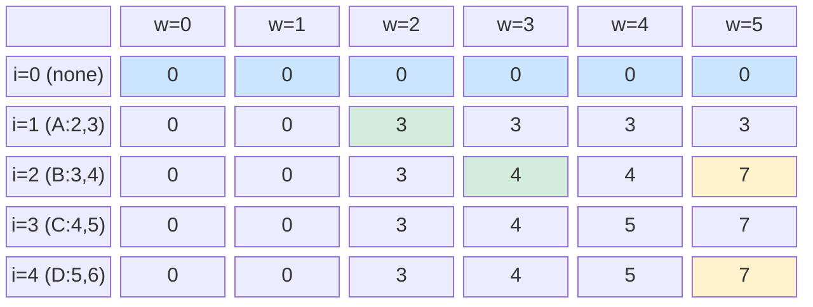

# 0 / 1 Knapsack

You're packing for a camping trip. Your backpack holds **10 kg**. You have 5 items — each with a weight and a value. What do you pack to maximise value?

That is the knapsack problem, and the "0/1" in its name tells you the constraint: each item is either taken (1) or left behind (0). You cannot split an item, take half a sleeping bag, or bring three copies of the same water bottle. This one constraint turns a trivial greedy problem into one of the most studied problems in computer science.

---

## The Setup

You have a list of items, each with a `weight` and a `value`. You have a bag with a maximum `capacity W`. You want to find the subset of items that fits within the capacity and has the highest total value.

### Working Example

| Item | Weight | Value |
|------|--------|-------|
| A    | 2      | 3     |
| B    | 3      | 4     |
| C    | 4      | 5     |
| D    | 5      | 6     |

Capacity **W = 5**.

By hand, let's enumerate some options:

| Items chosen | Total weight | Total value |
|---|---|---|
| A only | 2 | 3 |
| B only | 3 | 4 |
| A + B | 5 | **7** |
| C only | 4 | 5 |
| D only | 5 | 6 |

`A + B` with total weight 5 and value 7 is the best we can do. DP finds this automatically — even when there are thousands of items.

---

## The Recurrence Relation

Let `dp[i][w]` = the maximum value achievable using the first `i` items with a bag capacity of exactly `w`.

For each item `i`, we have two choices:

1. **Skip item i** — the answer is whatever the best was without it: `dp[i-1][w]`
2. **Take item i** — only legal if `weight[i] <= w`. The answer is `value[i] + dp[i-1][w - weight[i]]`

```
dp[i][w] = dp[i-1][w]                              if weight[i] > w
dp[i][w] = max(dp[i-1][w],
               dp[i-1][w - weight[i]] + value[i])  otherwise
```

Base case: `dp[0][w] = 0` for all `w` (no items, no value).

---

## Filling the Table By Hand

Items: `A(2,3)`, `B(3,4)`, `C(4,5)`, `D(5,6)`. Capacity = 5. Rows = items 0–4, columns = capacity 0–5.

```
       w=0  w=1  w=2  w=3  w=4  w=5
i=0     0    0    0    0    0    0
i=1(A)  0    0    3    3    3    3
i=2(B)  0    0    3    4    4    7   ← A+B fits at w=5
i=3(C)  0    0    3    4    5    7
i=4(D)  0    0    3    4    5    7
```

The answer is `dp[4][5] = 7`.

### DP Table as a Diagram



Blue = base cases. Green = first non-trivial fills. Yellow = the answer.

---

## 2D Tabulation Implementation

```python,editable
def knapsack_2d(weights, values, capacity):
    n = len(weights)
    # dp[i][w] = best value using first i items, capacity w
    dp = [[0] * (capacity + 1) for _ in range(n + 1)]

    for i in range(1, n + 1):
        w_i = weights[i - 1]
        v_i = values[i - 1]
        for w in range(capacity + 1):
            # Option 1: skip item i
            dp[i][w] = dp[i - 1][w]
            # Option 2: take item i (only if it fits)
            if w_i <= w:
                take = dp[i - 1][w - w_i] + v_i
                if take > dp[i][w]:
                    dp[i][w] = take

    # Print the full DP table
    header = "       " + "".join(f" w={c}" for c in range(capacity + 1))
    print(header)
    for i in range(n + 1):
        label = f"i={i}    " if i == 0 else f"i={i}({chr(64+i)})  "
        row = "  ".join(str(dp[i][w]).rjust(2) for w in range(capacity + 1))
        print(f"{label}  {row}")

    print(f"\nMax value = {dp[n][capacity]}")
    return dp

weights = [2, 3, 4, 5]
values  = [3, 4, 5, 6]
capacity = 5
dp = knapsack_2d(weights, values, capacity)
```

---

## Traceback: Which Items Were Chosen?

The table tells us the maximum value, but not which items produced it. We recover the selection by walking backwards through the table.

```python,editable
def knapsack_with_items(weights, values, capacity):
    n = len(weights)
    dp = [[0] * (capacity + 1) for _ in range(n + 1)]

    for i in range(1, n + 1):
        w_i = weights[i - 1]
        v_i = values[i - 1]
        for w in range(capacity + 1):
            dp[i][w] = dp[i - 1][w]
            if w_i <= w:
                take = dp[i - 1][w - w_i] + v_i
                if take > dp[i][w]:
                    dp[i][w] = take

    # Traceback
    chosen = []
    w = capacity
    for i in range(n, 0, -1):
        if dp[i][w] != dp[i - 1][w]:
            # Item i was taken
            chosen.append(i - 1)
            w -= weights[i - 1]

    chosen.reverse()

    print(f"Max value    : {dp[n][capacity]}")
    print(f"Items chosen : {[chr(65 + idx) for idx in chosen]}")
    total_w = sum(weights[i] for i in chosen)
    total_v = sum(values[i]  for i in chosen)
    print(f"Total weight : {total_w} / {capacity}")
    print(f"Total value  : {total_v}")
    return dp[n][capacity], chosen

weights = [2, 3, 4, 5]
values  = [3, 4, 5, 6]
capacity = 5
knapsack_with_items(weights, values, capacity)

print()

# Larger example
weights2 = [1, 3, 4, 5, 2]
values2  = [1, 4, 5, 7, 3]
capacity2 = 7
knapsack_with_items(weights2, values2, capacity2)
```

---

## Space Optimisation: Rolling 1D Array

The 2D table uses O(n * W) space. Notice that row `i` only ever reads from row `i-1`. We can therefore keep just one row and update it in reverse — this is the classic "rolling array" trick.

**Key rule:** iterate `w` from `capacity` down to `weight[i]`. If we went left-to-right, a cell we already updated in the current pass would pollute later cells in the same pass, equivalent to picking the same item twice.

```python,editable
def knapsack_1d(weights, values, capacity):
    dp = [0] * (capacity + 1)

    for i, (w_i, v_i) in enumerate(zip(weights, values)):
        # Iterate RIGHT TO LEFT so each item is counted at most once
        for w in range(capacity, w_i - 1, -1):
            dp[w] = max(dp[w], dp[w - w_i] + v_i)

    print(f"1D dp array : {dp}")
    print(f"Max value   : {dp[capacity]}")
    return dp[capacity]

weights = [2, 3, 4, 5]
values  = [3, 4, 5, 6]
capacity = 5
knapsack_1d(weights, values, capacity)

print()

# Verify against the 2D solution on a larger input
weights3 = [2, 4, 6, 9, 3, 1, 5]
values3  = [3, 5, 8, 10, 4, 2, 7]
knapsack_1d(weights3, values3, 15)
```

---

## Complexity Analysis

| Version | Time | Space |
|---------|------|-------|
| 2D tabulation | O(n × W) | O(n × W) |
| 1D rolling array | O(n × W) | O(W) |

`n` is the number of items, `W` is the bag capacity. Both versions have the same time complexity — only space differs.

---

## Real-World Applications

- **Resource allocation** — A server has limited CPU and RAM. Which combination of jobs maximises throughput? Each job either runs or does not.

- **Investment portfolio selection** — Given a fixed budget and a set of investment opportunities, each with a cost and projected return, choose the subset that maximises expected return.

- **Cargo loading** — An aircraft has a fixed weight limit. Which cargo containers to load to maximise revenue?

- **Feature selection in ML** — Given a compute budget, which subset of features produces the best model? Each feature either is or is not included in training.

- **CPU task scheduling** — A real-time system has a deadline. Which tasks can be scheduled within the time window to maximise total priority?

The 0/1 knapsack pattern appears wherever you have a **binary choice** (include or exclude) and a **capacity constraint** — two of the most common ingredients in real decisions.
