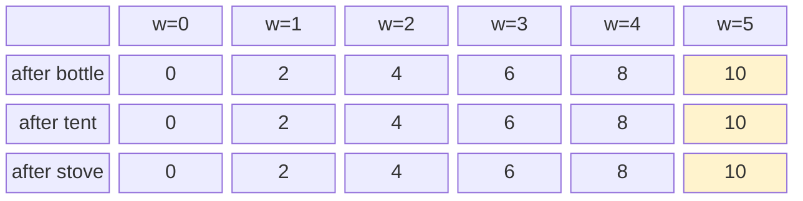

# Unbounded Knapsack

Same camping trip, but now you can pack **multiple copies of the same item**. A water bottle weighs 1 kg and is worth 2 — why not pack as many as fit?

The moment "each item can be used once" becomes "each item can be used as many times as you like", the problem transforms into the **unbounded knapsack**. One small change in the recurrence ripples into a completely different set of classical sub-problems: coin change, rod cutting, tile filling, and more.

---

## 0/1 vs Unbounded: The One-Line Difference

In **0/1 knapsack** each item can only be taken once. The 2D recurrence reads from the **previous row** to prevent re-picking:

```
dp[i][w] = max(dp[i-1][w], dp[i-1][w - weight[i]] + value[i])
              ^^^^^^^^               ^^^^^^^^
           "without item i"    "take item i — but look at row i-1
                                so item i can only be used once"
```

In **unbounded knapsack** there is no such restriction. We drop to 1D and read from the **current row** instead:

```
dp[w] = max(dp[w], dp[w - weight[i]] + value[i])
                       ^^^^^^^^
               "take item i again — use dp[w] which already
                reflects item i being available at this capacity"
```

Iterating `w` left-to-right (unlike 0/1 which goes right-to-left) means an item already counted at a smaller capacity can be counted again — that is precisely what "unbounded" means.

---

## Building Intuition: Water Bottle Example

Items: `bottle(1 kg, value 2)`, `tent(3 kg, value 5)`, `stove(4 kg, value 7)`. Capacity = 5.

Filling `dp` left-to-right, using all three items freely:

```
w=0: 0
w=1: bottle → dp[1-1]+2 = 2         → dp[1] = 2
w=2: bottle → dp[2-1]+2 = 4         → dp[2] = 4
w=3: bottle → dp[3-1]+2 = 6
     tent   → dp[3-3]+5 = 5         → dp[3] = 6
w=4: bottle → dp[4-1]+2 = 8
     stove  → dp[4-4]+7 = 7         → dp[4] = 8
w=5: bottle → dp[5-1]+2 = 10
     tent   → dp[5-3]+5 = 9
     stove  → dp[5-4]+7 = 9         → dp[5] = 10   (five bottles)
```

### dp Array After Each Item Pass



Because the bottle (weight 1) dominates, packing 5 bottles beats all other combinations here.

---

## Core Implementation

```python,editable
def unbounded_knapsack(weights, values, capacity):
    dp = [0] * (capacity + 1)

    for w in range(1, capacity + 1):
        for i in range(len(weights)):
            if weights[i] <= w:
                candidate = dp[w - weights[i]] + values[i]
                if candidate > dp[w]:
                    dp[w] = candidate

    print(f"dp array: {dp}")
    print(f"Max value at capacity {capacity}: {dp[capacity]}")
    return dp[capacity]

# Water bottle, tent, stove
unbounded_knapsack([1, 3, 4], [2, 5, 7], capacity=5)
print()

# Heavier items: bar(5,10), rod(2,3), nail(1,1) — capacity 10
unbounded_knapsack([5, 2, 1], [10, 3, 1], capacity=10)
```

---

## Classic Problem 1: Coin Change — Minimum Coins

You have coins of denominations `[1, 5, 10, 25]`. What is the **minimum number of coins** to make amount `n`?

This is unbounded knapsack where each "value" is `−1` (we minimise, not maximise), or equivalently, we track counts instead of values.

The recurrence:

```
dp[w] = min(dp[w - coin] + 1)  for each coin ≤ w
dp[0] = 0
dp[w] = ∞   initially
```

```python,editable
def coin_change_min(coins, amount):
    INF = float('inf')
    dp = [INF] * (amount + 1)
    dp[0] = 0  # 0 coins needed to make amount 0

    for w in range(1, amount + 1):
        for coin in coins:
            if coin <= w and dp[w - coin] + 1 < dp[w]:
                dp[w] = dp[w - coin] + 1

    result = dp[amount] if dp[amount] != INF else -1
    print(f"coins={coins}, amount={amount}")
    print(f"min coins = {result}")

    # Reconstruct which coins were used
    if result != -1:
        used = []
        w = amount
        while w > 0:
            for coin in coins:
                if coin <= w and dp[w - coin] + 1 == dp[w]:
                    used.append(coin)
                    w -= coin
                    break
        print(f"coins used = {sorted(used, reverse=True)}")
    print()

coin_change_min([1, 5, 10, 25], 41)   # 25+10+5+1
coin_change_min([1, 3, 4], 6)         # 3+3 beats 4+1+1
coin_change_min([2], 3)               # impossible
coin_change_min([1, 5, 6, 9], 11)     # 9+1+1 or 6+5?
```

---

## Classic Problem 2: Coin Change — Number of Ways

Same coins, different question: how many **distinct ways** can you make amount `n`?

The recurrence shifts to addition (count all ways rather than take the best):

```
dp[0] = 1       (one way to make 0: use no coins)
dp[w] += dp[w - coin]  for each coin ≤ w
```

**Order of loops matters.** Iterating coins in the outer loop and amounts in the inner loop counts **combinations** (order doesn't matter). Swapping the loops counts **permutations** (order matters — `[1,2]` and `[2,1]` are different).

```python,editable
def coin_change_ways(coins, amount):
    dp = [0] * (amount + 1)
    dp[0] = 1  # exactly one way to make 0

    # Outer loop = coins → counts unordered combinations
    for coin in coins:
        for w in range(coin, amount + 1):
            dp[w] += dp[w - coin]

    print(f"coins={coins}, amount={amount}")
    print(f"number of ways (combinations) = {dp[amount]}")

def coin_change_permutations(coins, amount):
    dp = [0] * (amount + 1)
    dp[0] = 1

    # Outer loop = amounts → counts ordered permutations
    for w in range(1, amount + 1):
        for coin in coins:
            if coin <= w:
                dp[w] += dp[w - coin]

    print(f"number of ways (permutations)  = {dp[amount]}")
    print()

coins = [1, 2, 5]
coin_change_ways(coins, 5)
coin_change_permutations(coins, 5)

coins2 = [2]
coin_change_ways(coins2, 3)
coin_change_permutations(coins2, 3)

coins3 = [10]
coin_change_ways(coins3, 10)
coin_change_permutations(coins3, 10)
```

---

## Classic Problem 3: Rod Cutting

You have a rod of length `n`. You can cut it into pieces of any integer length. Each length `i` sells for price `p[i]`. What is the maximum revenue?

This is unbounded knapsack where the "weights" are cut lengths (1 to n) and "values" are their prices. The rod itself is the "capacity".

```python,editable
def rod_cutting(prices, n):
    """
    prices[i] = revenue from a rod of length i+1 (1-indexed logically).
    n         = total rod length.
    """
    dp = [0] * (n + 1)

    for length in range(1, n + 1):
        for cut in range(1, length + 1):
            if cut <= len(prices):
                candidate = dp[length - cut] + prices[cut - 1]
                if candidate > dp[length]:
                    dp[length] = candidate

    # Traceback to find the cuts used
    cuts_used = []
    remaining = n
    while remaining > 0:
        for cut in range(1, remaining + 1):
            if cut <= len(prices) and dp[remaining - cut] + prices[cut - 1] == dp[remaining]:
                cuts_used.append(cut)
                remaining -= cut
                break

    print(f"Rod length : {n}")
    print(f"Prices     : {dict(enumerate(prices, start=1))}")
    print(f"Max revenue: {dp[n]}")
    print(f"Cuts made  : {sorted(cuts_used, reverse=True)}")
    print(f"dp array   : {dp}")
    print()
    return dp[n]

# Classic textbook example
prices1 = [1, 5, 8, 9, 10, 17, 17, 20]
rod_cutting(prices1, n=8)   # optimal: cut into 2+6 = 5+17 = 22

# All equal prices per unit
prices2 = [3, 3, 3, 3, 3]
rod_cutting(prices2, n=5)   # keep whole: 3*5 = 15

# Premium on short pieces
prices3 = [10, 5, 2, 1]
rod_cutting(prices3, n=4)   # four pieces of length 1: 10*4 = 40
```

---

## Complexity Analysis

| Problem | Time | Space |
|---------|------|-------|
| Unbounded knapsack | O(n × W) | O(W) |
| Coin change (min) | O(coins × W) | O(W) |
| Coin change (ways) | O(coins × W) | O(W) |
| Rod cutting | O(n²) | O(n) |

All are O(capacity × items) in time and O(capacity) in space — dramatically better than brute-force enumeration which is exponential.

---

## Real-World Applications

- **Currency exchange and vending machines** — A vending machine dispensing change chooses the fewest coins from available denominations. Every ATM and cash register uses a variant of coin change.

- **Manufacturing cut optimisation** — A factory cuts steel bars, pipes, or timber to order. Rod-cutting style DP determines how to cut raw stock to fulfil orders with minimal waste.

- **Network packet fragmentation** — A router breaks a large packet into smaller fragments. Each fragment has a fixed overhead; the unbounded model finds the optimal fragmentation size to maximise data-to-overhead ratio.

- **Tile and material coverage** — Tiling a floor with tiles of various sizes at various costs per tile is directly unbounded knapsack over the floor length.

The unbounded variant is your go-to pattern whenever the same resource or item can be reused — which is surprisingly common in logistics, finance, and systems engineering.
