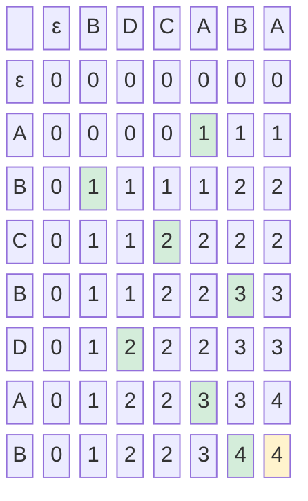

# Longest Common Subsequence (LCS)

`git diff` shows you exactly what changed between two files. The coloured lines — red for deleted, green for added — come from one question: what is the longest sequence of lines that appears in both files in the same order?

The algorithm behind it: **Longest Common Subsequence**.

---

## Subsequence vs Substring

A **substring** is a contiguous block of characters: `"ABC"` is a substring of `"ABCDE"`.

A **subsequence** preserves relative order but does not have to be contiguous: `"ACE"` is a subsequence of `"ABCDE"` because A, C, E appear in that order — even though they are not adjacent.

```
String:      A  B  C  D  E
Subsequence: A     C     E   ✓  (pick positions 0, 2, 4)
```

The **Longest Common Subsequence** of two strings is the longest sequence that is a subsequence of both.

```
s1 = "ABCBDAB"
s2 = "BDCABA"

LCS = "BCBA"   length 4

s1:  A B C B D A B
         ↑   ↑ ↑ ↑       (positions 1,3,5,6 in s1)
s2:    B D C A B A
       ↑   ↑ ↑ ↑         (positions 0,2,3,4 in s2 — or BDAB from s2 for a different LCS)
```

There may be multiple LCS strings of the same length. The DP gives us the length; traceback recovers one such string.

---

## The Recurrence Relation

Let `dp[i][j]` = length of LCS of `s1[:i]` and `s2[:j]`.

Two cases at each cell:

```
Characters match — s1[i-1] == s2[j-1]:
    dp[i][j] = dp[i-1][j-1] + 1          ← extend the LCS by one

Characters differ:
    dp[i][j] = max(dp[i-1][j],            ← skip s1[i-1]
                   dp[i][j-1])             ← skip s2[j-1]
```

Base cases: `dp[0][j] = 0` and `dp[i][0] = 0` (LCS with empty string is 0).

---

## Filling the Table for "ABCBDAB" and "BDCABA"

The table below shows the full DP matrix. Rows are characters of `s1 = "ABCBDAB"`, columns are characters of `s2 = "BDCABA"`.



Every green cell is where a match occurred (`+1` diagonal). The yellow cell is the answer: `dp[7][6] = 4`.

---

## Implementation: LCS Length and Traceback

```python,editable
def lcs(s1, s2):
    m, n = len(s1), len(s2)
    dp = [[0] * (n + 1) for _ in range(m + 1)]

    # Fill the table
    for i in range(1, m + 1):
        for j in range(1, n + 1):
            if s1[i - 1] == s2[j - 1]:
                dp[i][j] = dp[i - 1][j - 1] + 1
            else:
                dp[i][j] = max(dp[i - 1][j], dp[i][j - 1])

    # Traceback to recover the actual LCS string
    result = []
    i, j = m, n
    while i > 0 and j > 0:
        if s1[i - 1] == s2[j - 1]:
            result.append(s1[i - 1])
            i -= 1
            j -= 1
        elif dp[i - 1][j] >= dp[i][j - 1]:
            i -= 1
        else:
            j -= 1
    result.reverse()

    print(f"s1  = {s1!r}")
    print(f"s2  = {s2!r}")
    print(f"LCS length = {dp[m][n]}")
    print(f"LCS        = {''.join(result)!r}")
    print()
    return dp[m][n], ''.join(result)

lcs("ABCBDAB", "BDCABA")
lcs("AGGTAB",  "GXTXAYB")
lcs("ABCDE",   "ACE")
lcs("abcdef",  "ace")
lcs("XMJYAUZ", "MZJAWXU")
```

---

## Edit Distance: LCS's Close Cousin

**Edit distance** (Levenshtein distance) counts the minimum number of single-character insertions, deletions, and substitutions to turn `s1` into `s2`. It uses almost the same DP table — only the recurrence differs.

```
if s1[i-1] == s2[j-1]:
    dp[i][j] = dp[i-1][j-1]               ← free: chars match
else:
    dp[i][j] = 1 + min(
        dp[i-1][j],       ← delete from s1
        dp[i][j-1],       ← insert into s1
        dp[i-1][j-1]      ← substitute
    )
```

Base cases: `dp[i][0] = i` (delete all of s1) and `dp[0][j] = j` (insert all of s2).

```python,editable
def edit_distance(s1, s2):
    m, n = len(s1), len(s2)
    dp = [[0] * (n + 1) for _ in range(m + 1)]

    for i in range(m + 1):
        dp[i][0] = i
    for j in range(n + 1):
        dp[0][j] = j

    for i in range(1, m + 1):
        for j in range(1, n + 1):
            if s1[i - 1] == s2[j - 1]:
                dp[i][j] = dp[i - 1][j - 1]
            else:
                dp[i][j] = 1 + min(
                    dp[i - 1][j],
                    dp[i][j - 1],
                    dp[i - 1][j - 1]
                )

    dist = dp[m][n]
    print(f"edit_distance({s1!r}, {s2!r}) = {dist}")
    return dist

edit_distance("kitten",  "sitting")    # classic: 3
edit_distance("sunday",  "saturday")   # 3
edit_distance("python",  "pyhton")     # 2 (transposition)
edit_distance("abc",     "abc")        # 0 (identical)
edit_distance("",        "hello")      # 5 (insert everything)
```

The relationship between LCS and edit distance is tight: `edit_distance(s1, s2) = m + n - 2 * lcs_length(s1, s2)` when only insertions and deletions are allowed (no substitutions).

---

## Extension 1: Longest Common Substring

A **substring** must be contiguous. The DP is similar but we reset to 0 when characters don't match, and track the maximum seen rather than the bottom-right corner.

```python,editable
def longest_common_substring(s1, s2):
    m, n = len(s1), len(s2)
    dp = [[0] * (n + 1) for _ in range(m + 1)]
    max_len = 0
    end_idx = 0  # end index in s1

    for i in range(1, m + 1):
        for j in range(1, n + 1):
            if s1[i - 1] == s2[j - 1]:
                dp[i][j] = dp[i - 1][j - 1] + 1
                if dp[i][j] > max_len:
                    max_len = dp[i][j]
                    end_idx = i
            else:
                dp[i][j] = 0  # ← key difference from LCS: reset on mismatch

    substr = s1[end_idx - max_len : end_idx]
    print(f"s1                     = {s1!r}")
    print(f"s2                     = {s2!r}")
    print(f"Longest common substring = {substr!r}  (length {max_len})")
    print()
    return substr

longest_common_substring("ABCBDAB", "BDCABA")
longest_common_substring("GeeksforGeeks", "GeeksQuiz")
longest_common_substring("abcdef", "zcdemf")
```

---

## Extension 2: Shortest Common Supersequence

The **Shortest Common Supersequence (SCS)** is the shortest string that contains both `s1` and `s2` as subsequences. Its length is `m + n - lcs_length(s1, s2)`.

```python,editable
def shortest_common_supersequence(s1, s2):
    m, n = len(s1), len(s2)
    dp = [[0] * (n + 1) for _ in range(m + 1)]

    for i in range(1, m + 1):
        for j in range(1, n + 1):
            if s1[i - 1] == s2[j - 1]:
                dp[i][j] = dp[i - 1][j - 1] + 1
            else:
                dp[i][j] = max(dp[i - 1][j], dp[i][j - 1])

    # Reconstruct SCS by tracing the LCS table
    scs = []
    i, j = m, n
    while i > 0 and j > 0:
        if s1[i - 1] == s2[j - 1]:
            scs.append(s1[i - 1])
            i -= 1
            j -= 1
        elif dp[i - 1][j] > dp[i][j - 1]:
            scs.append(s1[i - 1])
            i -= 1
        else:
            scs.append(s2[j - 1])
            j -= 1
    while i > 0:
        scs.append(s1[i - 1]); i -= 1
    while j > 0:
        scs.append(s2[j - 1]); j -= 1
    scs.reverse()
    result = ''.join(scs)

    print(f"s1  = {s1!r}")
    print(f"s2  = {s2!r}")
    print(f"SCS = {result!r}  (length {len(result)})")
    print(f"SCS length = {m + n - dp[m][n]}  (verify: m+n-lcs)")
    print()
    return result

shortest_common_supersequence("ABCBDAB", "BDCABA")
shortest_common_supersequence("geek", "eke")
```

---

## Complexity Analysis

| Problem | Time | Space | Space (optimised) |
|---------|------|-------|-------------------|
| LCS length | O(m × n) | O(m × n) | O(min(m,n)) |
| LCS with traceback | O(m × n) | O(m × n) | — (need full table) |
| Edit distance | O(m × n) | O(m × n) | O(min(m,n)) |
| Longest common substring | O(m × n) | O(m × n) | O(n) |
| Shortest common supersequence | O(m × n) | O(m × n) | — |

The space for LCS length alone can be reduced to two rows (or one row with careful ordering), but traceback always needs the full table.

---

## Real-World Applications

- **git diff and patch** — `diff` computes LCS on the lines of two files. Lines in the LCS are unchanged. Everything else is a `+` or `-` line. `git merge` uses a three-way variant of the same algorithm.

- **Plagiarism detection** — Academic integrity tools compare student submissions by computing LCS (or edit distance) to find suspiciously similar passages, even after synonym substitution or word reordering.

- **DNA sequence alignment** — BLAST, Smith-Waterman, and Needleman-Wunsch all solve variants of LCS/edit-distance on DNA and protein sequences millions of bases long. Identifying mutations, finding conserved regions, and tracing evolutionary relationships all reduce to this table.

- **Spell checkers and autocorrect** — Every "did you mean?" suggestion is ranked by edit distance. The word with the smallest distance to the mistyped word ranks first.

- **File comparison and merge tools** — Beyond git, tools like `vimdiff`, `Beyond Compare`, and document co-editing engines (Google Docs, Notion) use LCS or its variants to highlight differences and resolve conflicts.

The 2D DP table is one of the most productive two-dimensional structures in all of computer science. Once you can fill it by hand for LCS, the door opens to a whole family of string and sequence problems.
