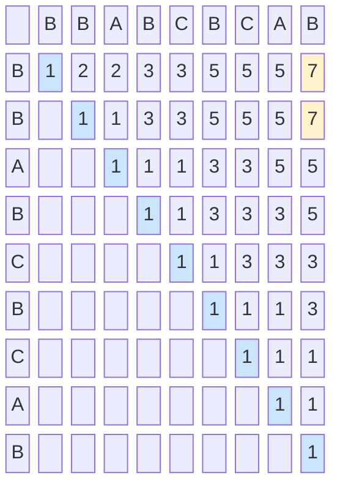

# Palindromes

Racecar. Level. A man a plan a canal Panama.

Palindromes are everywhere — and DP makes the hard ones computable. We'll build from the simplest palindrome check all the way up to "minimum insertions to make any string a palindrome", with a DP table and real code at every step.

---

## Level 1: Is a String a Palindrome?

A string is a palindrome if it reads the same forwards and backwards. The fastest check uses two pointers moving inward from both ends.

```python,editable
def is_palindrome(s):
    left, right = 0, len(s) - 1
    while left < right:
        if s[left] != s[right]:
            return False
        left += 1
        right -= 1
    return True

tests = [
    "racecar", "level", "hello", "a",
    "abba", "abcba", "amanaplanacanalpanama",
    "python", ""
]

for s in tests:
    result = is_palindrome(s)
    print(f"is_palindrome({s!r:30}) = {result}")
```

Time: O(n). Space: O(1). This is the baseline.

---

## Level 2: Longest Palindromic Substring

Given `"babad"`, the longest palindromic **substring** (contiguous) is `"bab"` or `"aba"` — both length 3.

The key insight: every palindrome expands from a centre. There are `2n - 1` possible centres (each character, and each gap between characters to handle even-length palindromes).

```python,editable
def longest_palindromic_substring(s):
    if not s:
        return ""

    start = 0
    max_len = 1

    def expand(left, right):
        nonlocal start, max_len
        while left >= 0 and right < len(s) and s[left] == s[right]:
            if right - left + 1 > max_len:
                max_len = right - left + 1
                start = left
            left -= 1
            right += 1

    for i in range(len(s)):
        expand(i, i)       # odd-length centres
        expand(i, i + 1)   # even-length centres

    result = s[start : start + max_len]
    print(f"s = {s!r}")
    print(f"Longest palindromic substring = {result!r}  (length {max_len})")
    print()
    return result

longest_palindromic_substring("babad")
longest_palindromic_substring("cbbd")
longest_palindromic_substring("racecar")
longest_palindromic_substring("abacaba")
longest_palindromic_substring("aacabdkacaa")
```

Time: O(n²). Space: O(1). For a linear solution, look up Manacher's algorithm — but the expand-from-centre approach is the one to learn first.

---

## Level 3: Longest Palindromic Subsequence

Now the **subsequence** variant (not contiguous). Given `"BBABCBCAB"`, what is the longest subsequence that is a palindrome?

Answer: `"BABCBAB"` or `"BBCBB"` — length 7.

### The Recurrence

Let `dp[i][j]` = length of the longest palindromic subsequence in `s[i..j]`.

```
If s[i] == s[j]:
    dp[i][j] = dp[i+1][j-1] + 2      ← both ends match: extend by 2

If s[i] != s[j]:
    dp[i][j] = max(dp[i+1][j],        ← skip left character
                   dp[i][j-1])         ← skip right character

Base cases:
    dp[i][i]   = 1    (single character is always a palindrome)
    dp[i][i+1] = 2 if s[i]==s[i+1], else 1
```

We fill the table diagonally (shorter substrings first, then longer ones), because `dp[i][j]` depends on `dp[i+1][j-1]`, `dp[i+1][j]`, and `dp[i][j-1]`.

### DP Table for "BBABCBCAB"

String length = 9. Indices 0–8. We show the upper-right triangle of the table (only `dp[i][j]` where `i ≤ j` is meaningful).



Blue diagonal = base cases (length 1). Yellow top-right cells = the answer for the full string.

---

## Implementation: All Four Palindrome Problems

```python,editable
# ── Problem 3: Longest Palindromic Subsequence ──────────────────────────────
def longest_palindromic_subsequence(s):
    n = len(s)
    dp = [[0] * n for _ in range(n)]

    # Base case: single characters
    for i in range(n):
        dp[i][i] = 1

    # Fill diagonals of increasing length
    for length in range(2, n + 1):          # length of the window
        for i in range(n - length + 1):
            j = i + length - 1
            if s[i] == s[j]:
                inner = dp[i + 1][j - 1] if length > 2 else 0
                dp[i][j] = inner + 2
            else:
                dp[i][j] = max(dp[i + 1][j], dp[i][j - 1])

    # Traceback
    def traceback(i, j):
        if i > j:
            return ""
        if i == j:
            return s[i]
        if s[i] == s[j]:
            return s[i] + traceback(i + 1, j - 1) + s[j]
        elif dp[i + 1][j] > dp[i][j - 1]:
            return traceback(i + 1, j)
        else:
            return traceback(i, j - 1)

    length = dp[0][n - 1]
    subseq = traceback(0, n - 1)
    print(f"s                              = {s!r}")
    print(f"Longest palindromic subsequence = {subseq!r}  (length {length})")
    print()
    return length

longest_palindromic_subsequence("BBABCBCAB")
longest_palindromic_subsequence("GEEKSFORGEEKS")
longest_palindromic_subsequence("agbdba")
longest_palindromic_subsequence("abcde")
```

```python,editable
# ── Problem 4: Minimum Insertions to Make a Palindrome ──────────────────────
#
# Key insight: min_insertions(s) = len(s) - LPS(s)
#   We already know the longest palindromic subsequence (LPS). The characters
#   NOT in the LPS each need one insertion to "mirror" them.
#
def min_insertions_to_palindrome(s):
    n = len(s)
    dp = [[0] * n for _ in range(n)]

    for i in range(n):
        dp[i][i] = 1

    for length in range(2, n + 1):
        for i in range(n - length + 1):
            j = i + length - 1
            if s[i] == s[j]:
                inner = dp[i + 1][j - 1] if length > 2 else 0
                dp[i][j] = inner + 2
            else:
                dp[i][j] = max(dp[i + 1][j], dp[i][j - 1])

    lps_len = dp[0][n - 1]
    insertions = n - lps_len

    print(f"s            = {s!r}")
    print(f"LPS length   = {lps_len}")
    print(f"Min insertions needed = {insertions}")
    print()
    return insertions

min_insertions_to_palindrome("AB")           # 1: "ABA" or "BAB"
min_insertions_to_palindrome("AA")           # 0: already palindrome
min_insertions_to_palindrome("ABCD")         # 3: "DCBABCD"
min_insertions_to_palindrome("BBABCBCAB")    # 2
min_insertions_to_palindrome("leetcode")     # 5
```

---

## Comparing the Four Problems

| Problem | Approach | Time | Space |
|---------|----------|------|-------|
| Is palindrome? | Two pointers | O(n) | O(1) |
| Longest palindromic **substring** | Expand from centre | O(n²) | O(1) |
| Longest palindromic **subsequence** | 2D DP (diagonal fill) | O(n²) | O(n²) |
| Minimum insertions | LPS + subtraction | O(n²) | O(n²) |

The big conceptual dividing line is **substring vs subsequence**. Substring problems can often be solved without DP (expand from centre, or Manacher's). Subsequence problems almost always need DP because you must consider non-contiguous character selections.

---

## Why Diagonal Filling?

When you fill a standard 2D table row by row, cell `(i, j)` depends on `(i-1, j)`, `(i, j-1)`, and `(i-1, j-1)` — all already computed.

For the palindrome subsequence table, `dp[i][j]` depends on `dp[i+1][j-1]` — a cell that is in a **smaller subproblem** (shorter substring). The correct traversal order is by increasing substring length:

```
length=1  →  fill the diagonal (base cases)
length=2  →  fill one step above the diagonal
length=3  →  fill two steps above
...
length=n  →  fill the top-right corner (the answer)
```

```python,editable
# Visualise the diagonal fill order on a small string
def show_fill_order(s):
    n = len(s)
    dp = [[0] * n for _ in range(n)]
    for i in range(n):
        dp[i][i] = 1

    print(f"Filling DP table for {s!r} (n={n}):")
    print(f"{'':4}" + "".join(f" {c:2}" for c in s))

    for length in range(2, n + 1):
        for i in range(n - length + 1):
            j = i + length - 1
            if s[i] == s[j]:
                inner = dp[i + 1][j - 1] if length > 2 else 0
                dp[i][j] = inner + 2
            else:
                dp[i][j] = max(dp[i + 1][j], dp[i][j - 1])

    for i in range(n):
        row = "".join(
            f" {dp[i][j]:2}" if j >= i else "   "
            for j in range(n)
        )
        print(f" {s[i]}  {row}")
    print(f"Answer (dp[0][{n-1}]) = {dp[0][n-1]}")

show_fill_order("ABCBA")
print()
show_fill_order("agbdba")
```

---

## Real-World Applications

- **DNA palindromes in molecular biology** — Restriction enzymes recognise specific palindromic sequences in double-stranded DNA (the sequence reads the same on both strands 5'→3'). Tools that locate cut sites use exact palindrome search on sequences millions of bases long.

- **Text compression** — Run-length encoding and other compressors exploit repeated and symmetric patterns. Identifying the longest palindromic substring in a data block can guide compression decisions.

- **Data validation** — Credit card number checksums (Luhn algorithm) and ISBN validation are not palindromes per se, but both rely on digit-level symmetry checks that use the same two-pointer scan pattern.

- **Word games and puzzles** — Crossword constructors and word-game AIs use LPS to find the longest palindrome embeddable in a given set of letters, and minimum-insertion algorithms to determine how close a word is to being a palindrome.

Every time you encounter a problem involving "how symmetric is this sequence?" — whether the sequence is characters, DNA bases, or numbers — one of these four palindrome algorithms is likely the right tool.
