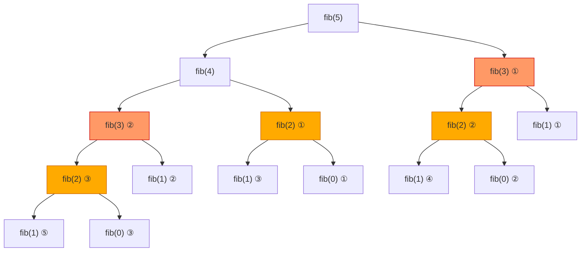

# Dynamic Programming

Dynamic programming is just recursion with a notepad. Stop solving the same subproblem twice.

That's the whole idea. You've almost certainly written recursive code that recomputes the same values over and over. Dynamic programming (DP) is the discipline of recognising when that happens and caching the results so each subproblem is solved exactly once.

---

## The Two Properties That Make DP Applicable

Before reaching for DP, check that your problem has both of these properties.

### 1. Overlapping Subproblems

The same smaller problem appears repeatedly inside the larger problem. A naive recursive solution would compute it multiple times — DP solves it once and stores the answer.

### 2. Optimal Substructure

The optimal answer to the full problem can be built from the optimal answers to its subproblems. This is what lets you trust the stored results: a cached answer to a subproblem is always the best possible answer for that subproblem.

---

## The Classic Example: Fibonacci

The Fibonacci sequence is the cleanest way to see why DP matters.

```
fib(n) = fib(n-1) + fib(n-2),  with fib(0) = 0, fib(1) = 1
```

### Naive Recursion — Exponential Work

```python,editable
def fib_naive(n):
    if n <= 1:
        return n
    return fib_naive(n - 1) + fib_naive(n - 2)

# Count how many times each call is made
call_count = {}

def fib_counted(n):
    call_count[n] = call_count.get(n, 0) + 1
    if n <= 1:
        return n
    return fib_counted(n - 1) + fib_counted(n - 2)

fib_counted(7)
print("fib(7) =", fib_naive(7))
print()
print("Call counts for fib_naive(7):")
for k in sorted(call_count):
    print(f"  fib({k}) called {call_count[k]} time(s)")
```

The output makes the problem obvious. `fib(3)` is recomputed five times. `fib(2)` is recomputed eight times. The total work grows as O(2^n) — computing `fib(50)` naive would take longer than your lifetime.

### The Overlapping Subproblem Tree for fib(5)



The red nodes (`fib(3)`) are computed twice. The orange nodes (`fib(2)`) are computed three times. Every circled number is wasted work.

---

## Fix 1: Memoization (Top-Down DP)

Add a cache — a "notepad" — to the recursive function. Before computing anything, check the notepad. If the answer is already there, return it immediately.

```python,editable
def fib_memo(n, cache={}):
    if n in cache:
        return cache[n]          # Already solved — return immediately
    if n <= 1:
        return n
    cache[n] = fib_memo(n - 1, cache) + fib_memo(n - 2, cache)
    return cache[n]

# Now each subproblem is solved exactly once
for i in range(10):
    print(f"fib({i}) = {fib_memo(i)}")
```

The structure is identical to the naive version — the only addition is the cache dictionary. Time complexity drops from O(2^n) to O(n).

---

## Fix 2: Tabulation (Bottom-Up DP)

Instead of starting at the top and recursing down, start at the base cases and build up to the answer iteratively. Fill a table row by row.

```python,editable
def fib_tabulation(n):
    if n <= 1:
        return n

    dp = [0] * (n + 1)
    dp[0] = 0
    dp[1] = 1

    for i in range(2, n + 1):
        dp[i] = dp[i - 1] + dp[i - 2]

    print("DP table:", dp)
    return dp[n]

result = fib_tabulation(9)
print(f"\nfib(9) = {result}")
```

No recursion, no stack overhead, no cache dictionary. Just a loop filling a list. For many problems this is the preferred style because it is easier to reason about memory and avoids Python's recursion limit.

---

## Memoization vs Tabulation at a Glance

| Property | Memoization (top-down) | Tabulation (bottom-up) |
|---|---|---|
| Style | Recursive + cache | Iterative + table |
| Solves only needed subproblems | Yes | No (fills entire table) |
| Stack overflow risk | Yes (deep recursion) | No |
| Often easier to write first | Yes | No |
| Often faster in practice | No | Yes |

---

## Real-World Applications

DP is not an academic curiosity. It powers tools you use every day.

- **Spell checkers** — The edit distance algorithm (Levenshtein distance) uses 2D DP to compute the minimum number of insertions, deletions, and substitutions needed to transform one word into another. When your phone suggests "hello" instead of "helo", that's DP.

- **Git diff** — The `diff` command finds the Longest Common Subsequence (LCS) of two files. Every line marked in green or red in a git diff was placed there by a DP algorithm.

- **Bioinformatics** — Sequence alignment tools like BLAST compare DNA and protein sequences using DP to find the optimal alignment despite millions of characters.

- **Route optimisation** — GPS navigation and delivery routing use DP variants (like the Bellman-Ford algorithm) to find shortest paths through graphs with millions of nodes.

- **Auto-complete and predictive text** — Language models and keyboard autocomplete use DP-style dynamic tables to score likely next words efficiently.

---

## What's in This Section

- **1-Dimension DP** — problems with one varying state: climbing stairs, house robber
- **2-Dimension DP** — problems with two varying states: unique grid paths, longest common subsequence
