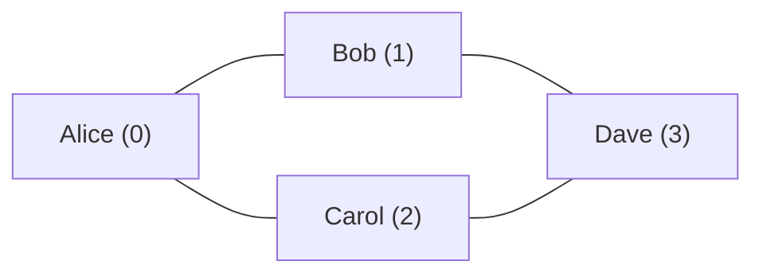
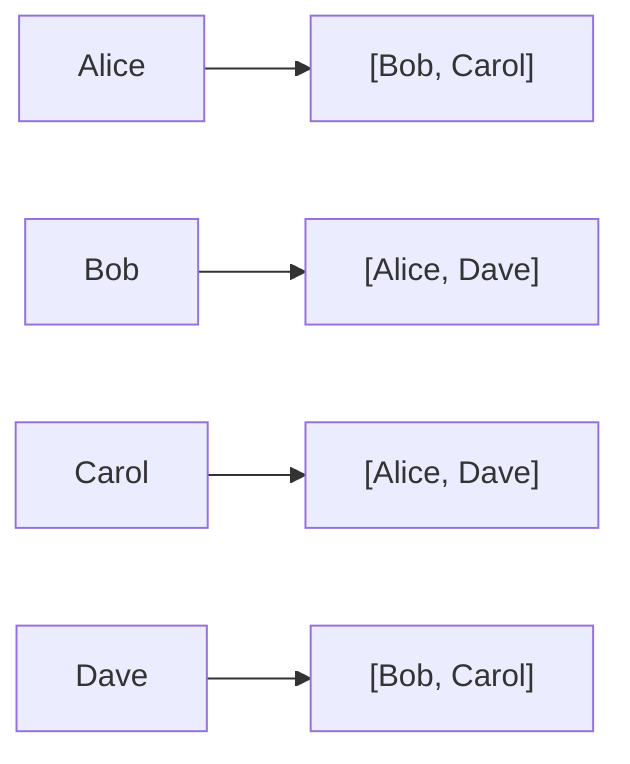

# Introduction to Graphs

Six degrees of separation — you're connected to any person on Earth through at most 6 people. Your friend knows someone who knows someone... and within six hops you can reach the President, a rice farmer in Vietnam, or a shepherd in Mongolia. Graphs prove it, and they explain exactly why it works.

## Core Vocabulary

Before writing any code, get these terms locked in — they come up everywhere:

| Term | Definition | Example |
|---|---|---|
| **Vertex** (node) | A single entity in the graph | A person, city, or webpage |
| **Edge** | A connection between two vertices | A friendship, road, or hyperlink |
| **Path** | A sequence of vertices connected by edges | London → Paris → Rome |
| **Cycle** | A path that starts and ends at the same vertex | A → B → C → A |
| **Connected** | Every vertex can reach every other vertex | A fully connected road network |
| **Weighted** | Edges carry a numeric value (cost, distance) | Road distances in km |

## Real-World Graphs

Graphs are not just a textbook concept — they model the most important systems in the world:

- **Social networks**: people are vertices, friendships are edges. Facebook has ~3 billion vertices.
- **Road maps**: cities are vertices, roads are edges, distances are weights. This is exactly what Google Maps uses.
- **Package managers**: packages are vertices, dependencies are directed edges. When you run `pip install numpy`, Python resolves a dependency graph.
- **The Web**: web pages are vertices, hyperlinks are directed edges. Google's PageRank algorithm ranks pages by analysing this graph.

## Representing a Graph in Code

You've drawn the graph on paper. Now how do you store it in memory? Two main approaches:

### Adjacency Matrix

A 2D grid where `matrix[i][j] = 1` means there's an edge from vertex `i` to vertex `j`.

Consider this graph — 4 people and their friendships:



The adjacency matrix for this graph looks like:

```
     Alice  Bob  Carol  Dave
Alice  [ 0,   1,    1,    0 ]
Bob    [ 1,   0,    0,    1 ]
Carol  [ 1,   0,    0,    1 ]
Dave   [ 0,   1,    1,    0 ]
```

A `1` at position `[row][col]` means those two people are friends.

### Adjacency List

A dictionary where each vertex maps to a list of its neighbours.



For sparse graphs (where most vertices connect to only a few others), the adjacency list uses far less memory than a matrix.

## Implementing Both in Python

```python,editable
# The same graph represented two ways

# 4 people: 0=Alice, 1=Bob, 2=Carol, 3=Dave
# Friendships: Alice-Bob, Alice-Carol, Bob-Dave, Carol-Dave

# --- Adjacency Matrix ---
adj_matrix = [
    [0, 1, 1, 0],  # Alice connects to Bob(1) and Carol(2)
    [1, 0, 0, 1],  # Bob connects to Alice(0) and Dave(3)
    [1, 0, 0, 1],  # Carol connects to Alice(0) and Dave(3)
    [0, 1, 1, 0],  # Dave connects to Bob(1) and Carol(2)
]

names = ["Alice", "Bob", "Carol", "Dave"]

print("=== Adjacency Matrix ===")
print("     ", "  ".join(f"{n[:3]:>3}" for n in names))
for i, row in enumerate(adj_matrix):
    print(f"{names[i][:5]:>5}", row)

# Check if Alice(0) and Bob(1) are friends
print(f"\nAre Alice and Bob friends? {bool(adj_matrix[0][1])}")
# Check if Alice(0) and Dave(3) are friends
print(f"Are Alice and Dave friends? {bool(adj_matrix[0][3])}")

# --- Adjacency List ---
adj_list = {
    "Alice": ["Bob", "Carol"],
    "Bob":   ["Alice", "Dave"],
    "Carol": ["Alice", "Dave"],
    "Dave":  ["Bob", "Carol"],
}

print("\n=== Adjacency List ===")
for person, friends in adj_list.items():
    print(f"  {person} -> {friends}")

# Check if Alice and Bob are friends
print(f"\nAre Alice and Bob friends? {'Bob' in adj_list['Alice']}")
# Check if Alice and Dave are friends
print(f"Are Alice and Dave friends? {'Dave' in adj_list['Alice']}")
```

## Matrix vs List — When to Use Which

| | Adjacency Matrix | Adjacency List |
|---|---|---|
| Space | O(V²) — always allocates V×V | O(V + E) — only stores real edges |
| Check if edge exists | O(1) — instant lookup | O(degree) — scan neighbour list |
| List all neighbours | O(V) — scan entire row | O(degree) — direct access |
| Best for | Dense graphs (many edges) | Sparse graphs (few edges per node) |

**Most real-world graphs are sparse.** Facebook users average ~338 friends out of 3 billion possible connections. The adjacency list wins almost every time.

## Building a Weighted Graph

For a road map with distances, just store the weight alongside the neighbour:

```python,editable
# Weighted adjacency list — road distances in km
road_map = {
    "London": [("Paris", 344), ("Berlin", 932)],
    "Paris":  [("London", 344), ("Madrid", 1054), ("Rome", 1421)],
    "Berlin": [("London", 932), ("Rome", 1181)],
    "Madrid": [("Paris", 1054)],
    "Rome":   [("Paris", 1421), ("Berlin", 1181)],
}

print("Road map (weighted adjacency list):")
for city, connections in road_map.items():
    for neighbour, distance in connections:
        print(f"  {city} --[{distance} km]--> {neighbour}")

# Find the shortest direct road from London
london_connections = road_map["London"]
nearest = min(london_connections, key=lambda x: x[1])
print(f"\nNearest city to London by direct road: {nearest[0]} ({nearest[1]} km)")
```

Now you have the foundations. The next sections will show you how to actually *traverse* these graphs — visiting every vertex systematically to find paths, count components, and solve real problems.
