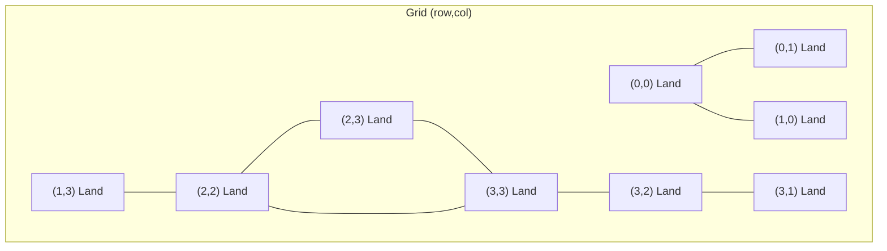
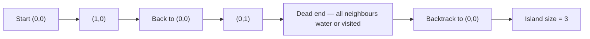

# Matrix DFS

Think of it as flood-fill — the paint bucket tool in MS Paint uses this exact algorithm. Click on a white area and it spreads to every connected white pixel, stopping only at edges. That's depth-first search on a grid.

## Grids Are Graphs in Disguise

A 2D grid is just a graph where each cell is a vertex, and edges connect adjacent cells (up, down, left, right). The moment you see a grid problem, think: graph problem.

Here's a simple grid — `0` is water, `1` is land:

```
1  1  0  0
1  0  0  1
0  0  1  1
0  1  1  1
```

**An island** is a group of `1` cells all connected horizontally or vertically. The grid above has **3 islands**. Can you spot them?



Island 1: (0,0), (0,1), (1,0) — top-left cluster
Island 2: (1,3), (2,2), (2,3), (3,1), (3,2), (3,3) — right side
Island 3 would appear if we had an isolated cell — let's count them with code.

## How DFS Flood-Fill Works

Starting from a land cell, DFS explores as far as possible in one direction before backtracking — like exploring a maze by always turning left until you hit a wall.

**The four neighbours** of any cell `(r, c)`:
- Up: `(r-1, c)`
- Down: `(r+1, c)`
- Left: `(r, c-1)`
- Right: `(r, c+1)`

**The rules:**
1. If the cell is out of bounds — stop.
2. If the cell is water (`0`) — stop.
3. If we've already visited this cell — stop.
4. Otherwise: mark as visited, then recurse into all four neighbours.

## Visualising DFS Traversal Order

Starting DFS from cell `(0,0)` on a small grid:



DFS goes deep first — it follows one path all the way to a dead end before trying another direction. This is very different from BFS, which explores level by level.

## Counting All Islands

The classic grid DFS problem: count the number of distinct islands.

```python,editable
def count_islands(grid):
    if not grid:
        return 0

    rows = len(grid)
    cols = len(grid[0])
    visited = set()
    island_count = 0

    def dfs(r, c):
        # Stop conditions: out of bounds, water, or already visited
        if (
            r < 0 or r >= rows or
            c < 0 or c >= cols or
            grid[r][c] == 0 or
            (r, c) in visited
        ):
            return

        # Mark this cell as visited
        visited.add((r, c))

        # Recurse into all four directions
        dfs(r + 1, c)  # down
        dfs(r - 1, c)  # up
        dfs(r, c + 1)  # right
        dfs(r, c - 1)  # left

    for r in range(rows):
        for c in range(cols):
            # Found unvisited land — it's a new island!
            if grid[r][c] == 1 and (r, c) not in visited:
                dfs(r, c)       # flood-fill the entire island
                island_count += 1

    return island_count


# Test it
grid = [
    [1, 1, 0, 0],
    [1, 0, 0, 1],
    [0, 0, 1, 1],
    [0, 1, 1, 1],
]

print("Grid:")
for row in grid:
    print(" ", row)

result = count_islands(grid)
print(f"\nNumber of islands: {result}")
# Expected: 3
```

## Measuring Island Size

Instead of counting islands, count the *size* of a single island:

```python,editable
def count_island_size(grid, start_r, start_c):
    rows = len(grid)
    cols = len(grid[0])
    visited = set()

    def dfs(r, c):
        if (
            r < 0 or r >= rows or
            c < 0 or c >= cols or
            grid[r][c] == 0 or
            (r, c) in visited
        ):
            return 0

        visited.add((r, c))

        # This cell counts as 1, plus all reachable neighbours
        return (
            1 +
            dfs(r + 1, c) +
            dfs(r - 1, c) +
            dfs(r, c + 1) +
            dfs(r, c - 1)
        )

    return dfs(start_r, start_c)


grid = [
    [1, 1, 0, 0],
    [1, 0, 0, 1],
    [0, 0, 1, 1],
    [0, 1, 1, 1],
]

# The top-left island starts at (0,0)
size = count_island_size(grid, 0, 0)
print(f"Island starting at (0,0) has size: {size}")  # Expected: 3

# The bottom-right island starts at (1,3)
size2 = count_island_size(grid, 1, 3)
print(f"Island starting at (1,3) has size: {size2}")  # Expected: 6
```

## Finding the Largest Island

Combine both ideas — find the maximum island size:

```python,editable
def largest_island(grid):
    rows = len(grid)
    cols = len(grid[0])
    visited = set()
    max_size = 0

    def dfs(r, c):
        if (
            r < 0 or r >= rows or
            c < 0 or c >= cols or
            grid[r][c] == 0 or
            (r, c) in visited
        ):
            return 0
        visited.add((r, c))
        return 1 + dfs(r+1,c) + dfs(r-1,c) + dfs(r,c+1) + dfs(r,c-1)

    for r in range(rows):
        for c in range(cols):
            if grid[r][c] == 1 and (r, c) not in visited:
                size = dfs(r, c)
                max_size = max(max_size, size)

    return max_size


grid = [
    [1, 1, 0, 0],
    [1, 0, 0, 1],
    [0, 0, 1, 1],
    [0, 1, 1, 1],
]

print(f"Largest island size: {largest_island(grid)}")  # Expected: 6
```

## Time and Space Complexity

| | Complexity |
|---|---|
| Time | O(rows × cols) — each cell visited at most once |
| Space | O(rows × cols) — the visited set + recursion call stack |

## Real-World Applications

- **MS Paint flood fill** — exactly this algorithm, on a pixel grid
- **Maze solving** — DFS explores every possible path until it finds the exit
- **Connected regions in maps** — satellite imagery analysis counts lakes, forests, urban areas
- **Game development** — finding connected game tiles (Minesweeper, Tetris boards)
- **Medical imaging** — identifying connected tissue regions in MRI scans

The key insight: **any time you have a 2D grid where you need to explore connected regions, think DFS flood-fill.**
