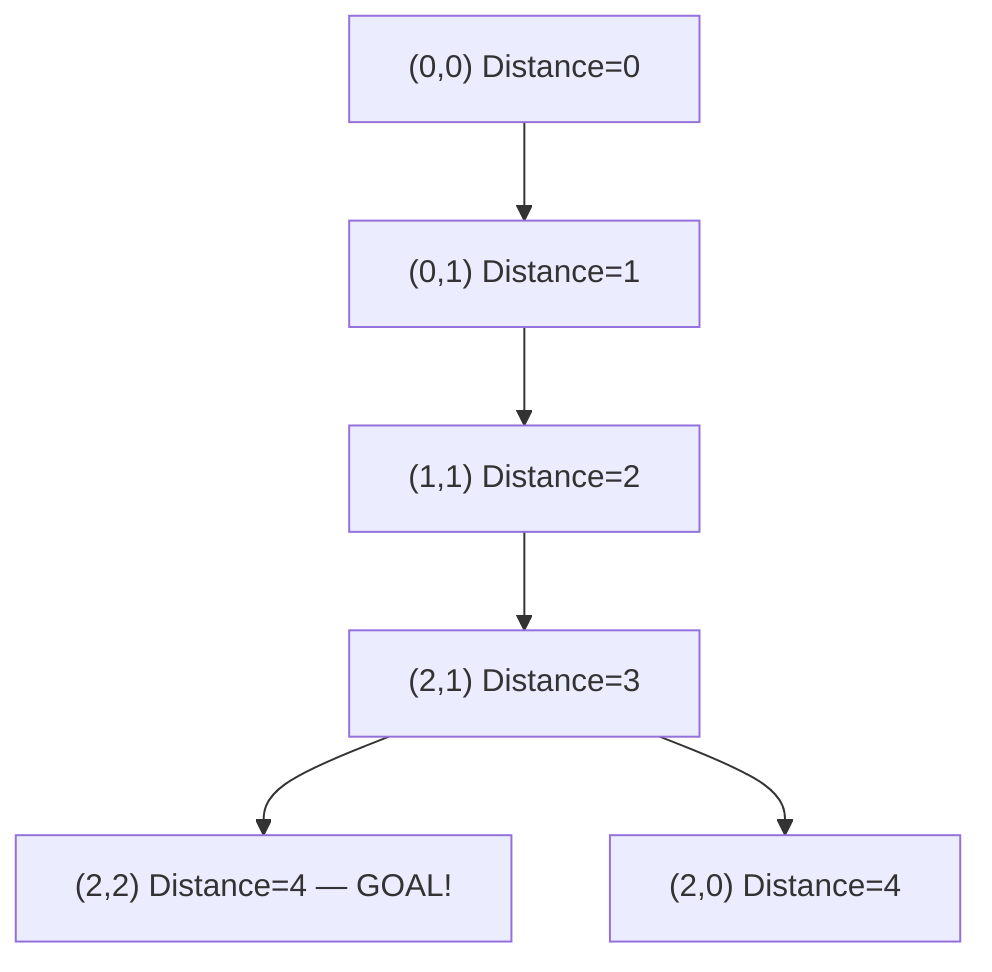

# Matrix BFS

Find the shortest path through a maze — BFS guarantees the shortest route. Not "a" short route. The absolute shortest. DFS will find *some* path; BFS finds the *best* one. That single guarantee makes BFS one of the most useful algorithms in existence.

## The Key Insight: BFS Expands Like a Ripple

Imagine dropping a stone into still water. The ripple expands outward in all directions simultaneously, reaching every point at the same distance at the same time. That's BFS.

DFS is like a rat in a maze — it charges down one corridor until it hits a dead end, then backtracks. Fast, but no guarantee of finding the shortest route.

**BFS processes cells in order of their distance from the start.** When it reaches the destination, it has taken the fewest possible steps.

## The Grid Setup

`0` = open path, `1` = wall. Goal: get from top-left `(0,0)` to bottom-right `(2,2)`.

```
Start
 ↓
[0, 0, 1]
[1, 0, 1]
[0, 0, 0]
          ↑
         End
```

## BFS Expanding Level by Level



BFS explores all cells at distance 1 before any cell at distance 2, and all cells at distance 2 before any at distance 3. The moment it reaches the destination, it's guaranteed to have taken the minimum number of steps.

## Implementing BFS Shortest Path

```python,editable
from collections import deque


def shortest_path(grid):
    rows = len(grid)
    cols = len(grid[0])

    # Can't start or end on a wall
    if grid[0][0] == 1 or grid[rows-1][cols-1] == 1:
        return -1

    # Queue stores (row, col, distance_so_far)
    queue = deque([(0, 0, 0)])
    visited = {(0, 0)}

    directions = [(1, 0), (-1, 0), (0, 1), (0, -1)]  # down, up, right, left

    while queue:
        r, c, dist = queue.popleft()

        # Reached the destination!
        if (r, c) == (rows - 1, cols - 1):
            return dist

        for dr, dc in directions:
            nr, nc = r + dr, c + dc

            if (
                0 <= nr < rows and       # within bounds (rows)
                0 <= nc < cols and       # within bounds (cols)
                grid[nr][nc] == 0 and    # not a wall
                (nr, nc) not in visited  # not already visited
            ):
                visited.add((nr, nc))
                queue.append((nr, nc, dist + 1))

    return -1  # No path exists


# Test 1: a solvable maze
grid1 = [
    [0, 0, 1],
    [1, 0, 1],
    [0, 0, 0],
]
print(f"Shortest path (grid1): {shortest_path(grid1)} steps")  # Expected: 4

# Test 2: an unsolvable maze (walls block every route)
grid2 = [
    [0, 1, 0],
    [1, 1, 0],
    [0, 0, 0],
]
print(f"Shortest path (grid2): {shortest_path(grid2)} steps")  # Expected: -1

# Test 3: a wide-open grid
grid3 = [
    [0, 0, 0],
    [0, 0, 0],
    [0, 0, 0],
]
print(f"Shortest path (grid3): {shortest_path(grid3)} steps")  # Expected: 4
```

## BFS vs DFS — Why DFS Cannot Guarantee Shortest Path

This is the most important thing to understand. Let's prove it with a concrete example:

```python,editable
# Watch DFS and BFS find paths through the same grid
# and compare the results

def bfs_path(grid):
    """BFS — always finds shortest path"""
    rows, cols = len(grid), len(grid[0])
    queue = deque([(0, 0, [(0, 0)])])  # (r, c, path_so_far)
    visited = {(0, 0)}

    while queue:
        r, c, path = queue.popleft()
        if (r, c) == (rows-1, cols-1):
            return path
        for dr, dc in [(1,0),(-1,0),(0,1),(0,-1)]:
            nr, nc = r+dr, c+dc
            if 0<=nr<rows and 0<=nc<cols and grid[nr][nc]==0 and (nr,nc) not in visited:
                visited.add((nr, nc))
                queue.append((nr, nc, path + [(nr, nc)]))
    return []


def dfs_path(grid):
    """DFS — finds A path, not necessarily the shortest"""
    rows, cols = len(grid), len(grid[0])
    visited = set()
    result = []

    def dfs(r, c, path):
        if (r,c) == (rows-1, cols-1):
            result.append(path[:])
            return
        if r<0 or r>=rows or c<0 or c>=cols or grid[r][c]==1 or (r,c) in visited:
            return
        visited.add((r, c))
        # DFS tries down first, which may lead to a longer path
        for dr, dc in [(1,0),(0,1),(-1,0),(0,-1)]:
            dfs(r+dr, c+dc, path + [(r+dr, c+dc)])
        visited.remove((r, c))

    dfs(0, 0, [(0, 0)])
    # Return the first path DFS found (not necessarily shortest)
    return result[0] if result else []


from collections import deque

# A grid where DFS will find a longer path than BFS
grid = [
    [0, 0, 0, 0],
    [0, 1, 1, 0],
    [0, 0, 0, 0],
    [0, 0, 0, 0],
]

bfs_result = bfs_path(grid)
dfs_result = dfs_path(grid)

print(f"BFS path length: {len(bfs_result)-1} steps")
print(f"BFS path: {bfs_result}")
print()
print(f"DFS path length: {len(dfs_result)-1} steps")
print(f"DFS path: {dfs_result}")
print()
print(f"BFS finds shortest? {'YES' if len(bfs_result) <= len(dfs_result) else 'NO'}")
```

## Tracking the Actual Path (Not Just Distance)

Sometimes you need the path itself, not just the length. Store the path in the queue:

```python,editable
from collections import deque


def shortest_path_with_route(grid):
    rows, cols = len(grid), len(grid[0])
    if grid[0][0] == 1 or grid[rows-1][cols-1] == 1:
        return None

    # Store (row, col, path) — path is a list of coordinates
    queue = deque([(0, 0, [(0, 0)])])
    visited = {(0, 0)}

    while queue:
        r, c, path = queue.popleft()

        if (r, c) == (rows-1, cols-1):
            return path  # Return the full path!

        for dr, dc in [(1,0),(-1,0),(0,1),(0,-1)]:
            nr, nc = r+dr, c+dc
            if 0<=nr<rows and 0<=nc<cols and grid[nr][nc]==0 and (nr,nc) not in visited:
                visited.add((nr, nc))
                queue.append((nr, nc, path + [(nr, nc)]))

    return None


grid = [
    [0, 0, 1, 0],
    [1, 0, 1, 0],
    [1, 0, 0, 0],
    [1, 1, 0, 0],
]

route = shortest_path_with_route(grid)
if route:
    print(f"Shortest path has {len(route)-1} steps:")
    for step, (r, c) in enumerate(route):
        print(f"  Step {step}: row={r}, col={c}")
else:
    print("No path exists")
```

## Time and Space Complexity

| | Complexity |
|---|---|
| Time | O(rows × cols) — each cell visited at most once |
| Space | O(rows × cols) — the queue can hold every cell in the worst case |

## Real-World Applications

- **GPS navigation** — finding the shortest route between two points (weighted BFS becomes Dijkstra's algorithm)
- **Game pathfinding** — enemies finding the shortest route to the player (Pac-Man, Tower Defence)
- **Network routing** — finding the fewest hops between two routers on the internet
- **COVID contact tracing radius** — BFS finds everyone within N contacts of an infected person
- **Social networks** — LinkedIn's "2nd degree connections" uses BFS up to depth 2

**The rule:** whenever you see "shortest path", "minimum steps", or "fewest moves" in a grid problem — reach for BFS.
