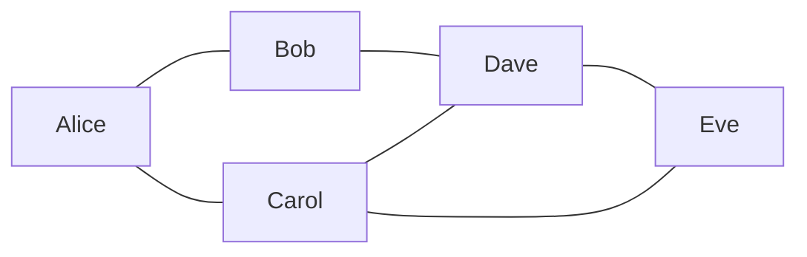

# Adjacency List — DFS and BFS

Real graphs are sparse — most nodes connect to only a few others. Your Facebook profile has ~338 friends out of 3 billion users. A webpage links to ~40 pages out of billions. Adjacency lists are built for this: they only store connections that actually exist, making them memory-efficient and fast for real-world graph problems.

## A Social Network as a Graph

Let's model a small friend network. Each person is a vertex, each friendship is an undirected edge.



As an adjacency list:

```python
graph = {
    "Alice": ["Bob", "Carol"],
    "Bob":   ["Alice", "Dave"],
    "Carol": ["Alice", "Dave", "Eve"],
    "Dave":  ["Bob", "Carol", "Eve"],
    "Eve":   ["Carol", "Dave"],
}
```

This is the starting point for almost every graph problem you'll encounter.

## DFS on an Adjacency List (Iterative)

DFS explores as deeply as possible before backtracking. Use a **stack** — last in, first out.

```python,editable
def dfs(graph, start):
    visited = set()
    stack = [start]
    order = []

    while stack:
        node = stack.pop()  # Take from the top of the stack

        if node in visited:
            continue

        visited.add(node)
        order.append(node)

        # Push all unvisited neighbours onto the stack
        for neighbour in graph[node]:
            if neighbour not in visited:
                stack.append(neighbour)

    return order


graph = {
    "Alice": ["Bob", "Carol"],
    "Bob":   ["Alice", "Dave"],
    "Carol": ["Alice", "Dave", "Eve"],
    "Dave":  ["Bob", "Carol", "Eve"],
    "Eve":   ["Carol", "Dave"],
}

result = dfs(graph, "Alice")
print(f"DFS from Alice: {result}")

# DFS also works for checking reachability
def can_reach(graph, start, target):
    visited = set()
    stack = [start]
    while stack:
        node = stack.pop()
        if node == target:
            return True
        if node in visited:
            continue
        visited.add(node)
        for neighbour in graph[node]:
            if neighbour not in visited:
                stack.append(neighbour)
    return False

print(f"Can Alice reach Eve? {can_reach(graph, 'Alice', 'Eve')}")
print(f"Can Alice reach herself? {can_reach(graph, 'Alice', 'Alice')}")
```

## BFS on an Adjacency List (Iterative)

BFS explores level by level — all direct friends, then friends-of-friends, and so on. Use a **queue** — first in, first out. This finds shortest paths in unweighted graphs.

```python,editable
from collections import deque


def bfs(graph, start):
    visited = set([start])
    queue = deque([start])
    order = []

    while queue:
        node = queue.popleft()  # Take from the front of the queue
        order.append(node)

        for neighbour in graph[node]:
            if neighbour not in visited:
                visited.add(neighbour)
                queue.append(neighbour)

    return order


def bfs_shortest_path(graph, start, target):
    """Find shortest path (fewest hops) between two nodes"""
    visited = set([start])
    # Queue stores (current_node, path_to_here)
    queue = deque([(start, [start])])

    while queue:
        node, path = queue.popleft()

        if node == target:
            return path

        for neighbour in graph[node]:
            if neighbour not in visited:
                visited.add(neighbour)
                queue.append((neighbour, path + [neighbour]))

    return []  # No path found


graph = {
    "Alice": ["Bob", "Carol"],
    "Bob":   ["Alice", "Dave"],
    "Carol": ["Alice", "Dave", "Eve"],
    "Dave":  ["Bob", "Carol", "Eve"],
    "Eve":   ["Carol", "Dave"],
}

print(f"BFS from Alice: {bfs(graph, 'Alice')}")

path = bfs_shortest_path(graph, "Alice", "Eve")
print(f"Shortest path Alice → Eve: {path}")
print(f"Degrees of separation: {len(path) - 1}")
```

## Cycle Detection Using a Visited Set

A cycle is a path that loops back to itself: A → B → C → A. Detecting cycles is critical for dependency resolution — if package A needs B, B needs C, and C needs A, you have a circular dependency and nothing can ever install.

For an **undirected** graph, a cycle exists if DFS visits a node that's already in the visited set (but not the immediate parent — since every undirected edge looks like a "back edge" to the parent).

```python,editable
def has_cycle(graph):
    """Detect if an undirected graph contains a cycle"""
    visited = set()

    def dfs(node, parent):
        visited.add(node)
        for neighbour in graph[node]:
            if neighbour not in visited:
                if dfs(neighbour, node):  # Recurse
                    return True
            elif neighbour != parent:
                # We've visited this neighbour, and it's NOT our direct parent
                # That means we found a back edge — a cycle!
                return True
        return False

    # Run DFS from each unvisited node (handles disconnected graphs)
    for node in graph:
        if node not in visited:
            if dfs(node, None):
                return True

    return False


# Graph WITH a cycle: Alice - Bob - Dave - Carol - Alice
cyclic_graph = {
    "Alice": ["Bob", "Carol"],
    "Bob":   ["Alice", "Dave"],
    "Carol": ["Alice", "Dave"],
    "Dave":  ["Bob", "Carol"],
}

# Graph WITHOUT a cycle: a simple tree
acyclic_graph = {
    "Alice": ["Bob", "Carol"],
    "Bob":   ["Alice"],
    "Carol": ["Alice", "Dave"],
    "Dave":  ["Carol"],
}

print(f"Cyclic graph has cycle: {has_cycle(cyclic_graph)}")    # True
print(f"Acyclic graph has cycle: {has_cycle(acyclic_graph)}")  # False
```

## Putting It All Together — A Web Crawler

Web crawling is graph traversal: pages are vertices, hyperlinks are directed edges. BFS finds all pages reachable within N hops.

```python,editable
from collections import deque


def web_crawler(graph, start, max_depth=2):
    """
    Crawl a web graph using BFS up to max_depth hops.
    Returns all pages reachable within max_depth clicks.
    """
    # Queue stores (page, depth)
    visited = set([start])
    queue = deque([(start, 0)])
    pages_found = {0: [start], 1: [], 2: []}

    while queue:
        page, depth = queue.popleft()

        if depth >= max_depth:
            continue

        for linked_page in graph.get(page, []):
            if linked_page not in visited:
                visited.add(linked_page)
                queue.append((linked_page, depth + 1))
                if depth + 1 <= max_depth:
                    pages_found[depth + 1].append(linked_page)

    return pages_found


# Simulated web graph (directed — links only go one way)
web = {
    "homepage":   ["about", "blog", "shop"],
    "about":      ["homepage", "team"],
    "blog":       ["homepage", "post1", "post2"],
    "shop":       ["homepage", "product1", "cart"],
    "team":       ["about"],
    "post1":      ["blog", "post2"],
    "post2":      ["blog"],
    "product1":   ["shop", "cart"],
    "cart":       ["shop", "checkout"],
    "checkout":   ["cart"],
}

pages = web_crawler(web, "homepage", max_depth=2)

print("Pages reachable from homepage:")
for depth, page_list in sorted(pages.items()):
    label = "Start" if depth == 0 else f"{depth} click{'s' if depth > 1 else ''} away"
    print(f"  {label}: {page_list}")
```

## DFS vs BFS — Quick Reference

| | DFS (Stack) | BFS (Queue) |
|---|---|---|
| Data structure | Stack (LIFO) | Queue (FIFO) |
| Traversal style | Goes deep first | Goes wide first |
| Finds shortest path? | No | Yes (unweighted) |
| Use for | Cycle detection, connected components, topological sort | Shortest path, level-order traversal, nearest neighbour |
| Memory (sparse graph) | O(depth) | O(breadth) |

## Real-World Applications

- **Social network friend recommendations** — BFS finds people 2 hops away ("People You May Know")
- **Package dependency resolution** — DFS with cycle detection (used by `pip`, `npm`, `cargo`)
- **Web crawlers** — BFS indexes the web layer by layer (Google's original crawler)
- **Network analysis** — finding all devices reachable from a router
- **Git history** — commits are a directed acyclic graph; `git log` is a graph traversal

The adjacency list plus DFS/BFS is the foundation for nearly every advanced graph algorithm — Dijkstra's, Bellman-Ford, topological sort, and strongly connected components all build on these exact concepts.
