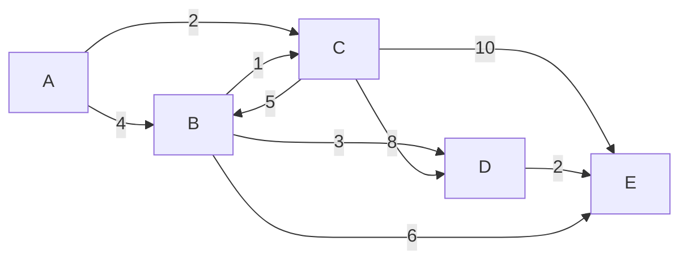

# Dijkstra's Algorithm

Google Maps finds the fastest route between any two cities in milliseconds. It handles millions of roads, traffic conditions, and detours — and it still gives you an answer before you've buckled your seatbelt. The core idea powering that feat: **Dijkstra's algorithm**.

---

## The Problem: Shortest Path in a Weighted Graph

In an unweighted graph, "shortest path" just means fewest edges. But real roads have distances. Real networks have latency. Real flight routes have costs. Once edges carry weights, BFS no longer works — a path with two long edges can be worse than one with five short ones.

**Dijkstra's algorithm** finds the shortest path from a single source vertex to every other vertex in a weighted graph, as long as all edge weights are non-negative.

---

## The City Map

Imagine you're a delivery driver starting at city **A**. You want the cheapest route to every other city.



Each number is the travel cost (distance, time, fuel — pick your metaphor).

---

## The Core Idea: Greedy + Priority Queue

Dijkstra's is a **greedy algorithm**. At every step it asks: "Which unvisited city do I know the cheapest path to right now?" It processes that city next, then updates costs for its neighbours.

The insight is that once you've settled on the cheapest path to a city, you can never find a cheaper one later — because all weights are non-negative. This means you never need to revisit a settled node.

### The Algorithm

1. Set `dist[source] = 0`, `dist[all others] = infinity`.
2. Push `(0, source)` into a **min-heap** (priority queue).
3. Pop the node with the smallest distance.
4. For each neighbour, if `dist[current] + edge_weight < dist[neighbour]`, update `dist[neighbour]` and push to the heap.
5. Repeat until the heap is empty.

---

## Step-by-Step Trace

Starting from **A**:

| Step | Process | A | B | C | D | E |
|------|---------|---|---|---|---|---|
| Init | — | **0** | ∞ | ∞ | ∞ | ∞ |
| 1 | Pop A (0) | 0 | 4 | 2 | ∞ | ∞ |
| 2 | Pop C (2) | 0 | 4→**3** | 2 | 10 | 12 |
| 3 | Pop B (3) | 0 | 3 | 2 | **6** | **9** |
| 4 | Pop D (6) | 0 | 3 | 2 | 6 | 9→**8** |
| 5 | Pop E (8) | 0 | 3 | 2 | 6 | 8 |

Final shortest distances from A: `B=3, C=2, D=6, E=8`.

Notice step 2: when we process C, we find that going `A→C→B` costs 2+1=**3**, which beats the direct `A→B` cost of 4. The algorithm catches this because we re-check neighbours whenever we find a cheaper path.

---

## Implementation

```python,editable
import heapq

def dijkstra(graph, source):
    # graph: { node: [(neighbour, weight), ...] }
    dist = {node: float('inf') for node in graph}
    dist[source] = 0
    prev = {node: None for node in graph}

    # min-heap entries: (distance, node)
    heap = [(0, source)]

    visited = set()

    while heap:
        current_dist, current = heapq.heappop(heap)

        # Skip if we already found a shorter path to this node
        if current in visited:
            continue
        visited.add(current)

        for neighbour, weight in graph[current]:
            new_dist = current_dist + weight
            if new_dist < dist[neighbour]:
                dist[neighbour] = new_dist
                prev[neighbour] = current
                heapq.heappush(heap, (new_dist, neighbour))

    return dist, prev


def reconstruct_path(prev, source, target):
    path = []
    node = target
    while node is not None:
        path.append(node)
        node = prev[node]
    path.reverse()
    if path[0] == source:
        return path
    return []  # no path exists


# City map from the diagram above
graph = {
    'A': [('B', 4), ('C', 2)],
    'B': [('D', 3), ('C', 1), ('E', 6)],
    'C': [('B', 5), ('D', 8), ('E', 10)],
    'D': [('E', 2)],
    'E': [],
}

distances, prev = dijkstra(graph, 'A')

print("Shortest distances from A:")
for city, d in sorted(distances.items()):
    print(f"  A -> {city}: {d}")

print()
print("Shortest paths:")
for city in sorted(graph.keys()):
    path = reconstruct_path(prev, 'A', city)
    print(f"  A -> {city}: {' -> '.join(path)}  (cost: {distances[city]})")
```

### Why `heapq` is Essential

Without a priority queue, finding the next unvisited minimum-distance node would cost O(V) per step, making the total O(V²). With a binary min-heap, each push/pop is O(log V), bringing the overall complexity to **O((V + E) log V)** — a massive win for sparse graphs.

---

## Handling the "Lazy Deletion" Pattern

You'll notice the `if current in visited: continue` check. When we find a better path to a node, we push a new entry into the heap rather than updating the old one (Python's `heapq` doesn't support efficient decrease-key). This means stale entries may linger in the heap. The visited check discards them cheaply.

---

## What Dijkstra's Cannot Do

Dijkstra's breaks with **negative edge weights**. Consider: if an edge has weight -5, processing a neighbour earlier doesn't guarantee the shortest path — a later route through the negative edge might be cheaper. For graphs with negative weights, use **Bellman-Ford** instead.

---

## Complexity Analysis

| | Complexity |
|---|---|
| **Time** (binary heap) | O((V + E) log V) |
| **Time** (Fibonacci heap) | O(E + V log V) — theoretical optimum |
| **Space** | O(V + E) |

Where V = number of vertices, E = number of edges.

For dense graphs (E ≈ V²), the simpler O(V²) array-based version can actually outperform the heap version. In practice, the heap version is standard.

---

## A Larger Example: Finding One Specific Route

```python,editable
import heapq

def dijkstra(graph, source):
    dist = {node: float('inf') for node in graph}
    dist[source] = 0
    prev = {node: None for node in graph}
    heap = [(0, source)]
    visited = set()

    while heap:
        current_dist, current = heapq.heappop(heap)
        if current in visited:
            continue
        visited.add(current)
        for neighbour, weight in graph[current]:
            new_dist = current_dist + weight
            if new_dist < dist[neighbour]:
                dist[neighbour] = new_dist
                prev[neighbour] = current
                heapq.heappush(heap, (new_dist, neighbour))

    return dist, prev


# Airline route network (flight times in minutes)
flights = {
    'Sydney':    [('Melbourne', 90), ('Brisbane', 100), ('Dubai', 840)],
    'Melbourne': [('Sydney', 90), ('Singapore', 480)],
    'Brisbane':  [('Sydney', 100), ('Singapore', 420)],
    'Singapore': [('Melbourne', 480), ('Brisbane', 420), ('London', 780), ('Dubai', 420)],
    'Dubai':     [('Sydney', 840), ('Singapore', 420), ('London', 420)],
    'London':    [('Singapore', 780), ('Dubai', 420)],
}

dist, prev = dijkstra(flights, 'Sydney')

# Reconstruct path to London
path = []
node = 'London'
while node:
    path.append(node)
    node = prev[node]
path.reverse()

print(f"Fastest route Sydney -> London: {dist['London']} minutes")
print(f"Route: {' -> '.join(path)}")
print()
print("All routes from Sydney:")
for city, d in sorted(dist.items(), key=lambda x: x[1]):
    print(f"  {city}: {d} min")
```

---

## Real-World Applications

| Domain | Application |
|--------|-------------|
| **GPS Navigation** | Google Maps, Apple Maps, Waze — find fastest/shortest route |
| **Network Routing** | OSPF protocol routes internet packets through the cheapest path |
| **Game Pathfinding** | A* algorithm is Dijkstra's with a heuristic added for speed |
| **Airline Optimisation** | Minimum-cost flight connections between hubs |
| **Social Networks** | Degrees of separation (with uniform weights = BFS, weighted = Dijkstra) |
| **Robot Navigation** | Autonomous vehicles planning routes through a cost map |

### Dijkstra vs BFS vs A*

- **BFS**: unweighted graphs only — finds fewest hops
- **Dijkstra**: weighted graphs, no negative weights — finds cheapest cost
- **A\***: Dijkstra + heuristic — finds cheapest cost faster when you have a goal

---

## Key Takeaways

- Dijkstra's finds the **shortest path from one source to all vertices** in a weighted graph.
- It's **greedy**: always process the cheapest unvisited node next.
- A **min-heap (priority queue)** is what makes it efficient — O((V + E) log V).
- It requires **non-negative edge weights**. Use Bellman-Ford for negative weights.
- **Path reconstruction** works by storing a `prev` pointer at each node and tracing backwards.
