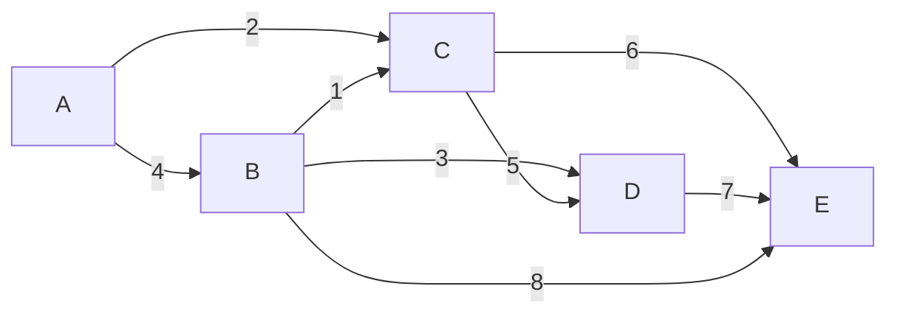

# Prim's Algorithm

An ISP needs to connect 10 cities with fibre-optic cable. They can't afford to lay cable on every possible route — they just need every city to be reachable from every other city, using the least total cable. **Prim's algorithm** finds exactly that minimum-cost network.

---

## What is a Minimum Spanning Tree?

A **spanning tree** of a graph is a subgraph that:
- Connects **all vertices** (it "spans" the graph)
- Has **no cycles** (it's a tree)
- Has exactly **V - 1 edges** for V vertices

A **Minimum Spanning Tree (MST)** is the spanning tree with the smallest possible total edge weight.



The MST of this graph uses edges: C-B(1), A-C(2), B-D(3), C-E(6) — total weight **12**.

Notice: we skip A-B(4), C-D(5), D-E(7), B-E(8) because they'd either create cycles or cost more.

---

## Prim's Approach: Grow the Tree Greedily

Prim's algorithm starts from any vertex and grows the MST one edge at a time:

1. Start with any vertex in the tree (the "visited" set).
2. Look at all edges that cross from the visited set to the unvisited set.
3. Pick the **cheapest** such edge.
4. Add the new vertex to the visited set.
5. Repeat until all vertices are in the tree.

Think of it like spreading ink on paper: you start at one point, and the ink always flows along the cheapest available channel to reach uncoloured territory.

---

## Step-by-Step Trace

Starting from vertex **A**:


| Step | Visited | Candidate Edges | Chosen |
|------|---------|-----------------|--------|
| Start | {A} | A-B(4), A-C(2) | **A-C(2)** |
| 1 | {A, C} | A-B(4), C-B(1), C-D(5), C-E(6) | **C-B(1)** |
| 2 | {A, C, B} | A-B(4)*, B-D(3), B-E(8), C-D(5), C-E(6) | **B-D(3)** |
| 3 | {A, C, B, D} | B-E(8), C-E(6), D-E(7) | **C-E(6)** |
| 4 | {A, C, B, D, E} | — | Done ✓ |

*A-B is skipped because B is already in the tree — adding it would create a cycle.

**MST edges**: A-C(2), C-B(1), B-D(3), C-E(6) → **Total: 12**

---

## Implementation

```python,editable
import heapq

def prims(graph, start):
    """
    graph: { node: [(neighbour, weight), ...] }
    Returns: list of MST edges, total MST weight
    """
    visited = set()
    mst_edges = []
    total_weight = 0

    # Min-heap: (weight, from_node, to_node)
    heap = [(0, start, start)]

    while heap and len(visited) < len(graph):
        weight, from_node, to_node = heapq.heappop(heap)

        if to_node in visited:
            continue

        visited.add(to_node)
        total_weight += weight

        # Don't record the initial dummy edge (start -> start, weight 0)
        if from_node != to_node:
            mst_edges.append((from_node, to_node, weight))

        # Explore neighbours of the newly added vertex
        for neighbour, edge_weight in graph[to_node]:
            if neighbour not in visited:
                heapq.heappush(heap, (edge_weight, to_node, neighbour))

    return mst_edges, total_weight


# The graph from the diagram
graph = {
    'A': [('B', 4), ('C', 2)],
    'B': [('A', 4), ('C', 1), ('D', 3), ('E', 8)],
    'C': [('A', 2), ('B', 1), ('D', 5), ('E', 6)],
    'D': [('B', 3), ('C', 5), ('E', 7)],
    'E': [('C', 6), ('D', 7), ('B', 8)],
}

mst_edges, total = prims(graph, 'A')

print("Minimum Spanning Tree edges:")
for u, v, w in mst_edges:
    print(f"  {u} -- {v}  (weight: {w})")

print(f"\nTotal MST weight: {total}")
print(f"Number of edges: {len(mst_edges)} (should be V-1 = {len(graph)-1})")
```

---

## A Real-World Example: Connecting Cities with Fibre

```python,editable
import heapq

def prims(graph, start):
    visited = set()
    mst_edges = []
    total_weight = 0
    heap = [(0, start, start)]

    while heap and len(visited) < len(graph):
        weight, from_node, to_node = heapq.heappop(heap)
        if to_node in visited:
            continue
        visited.add(to_node)
        total_weight += weight
        if from_node != to_node:
            mst_edges.append((from_node, to_node, weight))
        for neighbour, edge_weight in graph[to_node]:
            if neighbour not in visited:
                heapq.heappush(heap, (edge_weight, to_node, neighbour))

    return mst_edges, total_weight


# Fibre cable costs (km) between Australian cities
cities = {
    'Sydney':    [('Canberra', 286), ('Melbourne', 878), ('Brisbane', 924)],
    'Canberra':  [('Sydney', 286), ('Melbourne', 654)],
    'Melbourne': [('Sydney', 878), ('Canberra', 654), ('Adelaide', 727)],
    'Brisbane':  [('Sydney', 924), ('GoldCoast', 78)],
    'GoldCoast': [('Brisbane', 78), ('Sydney', 840)],
    'Adelaide':  [('Melbourne', 727), ('Perth', 2706)],
    'Perth':     [('Adelaide', 2706)],
}

mst, total_km = prims(cities, 'Sydney')

print("Minimum fibre network layout:")
for city1, city2, km in mst:
    print(f"  {city1} <-> {city2}: {km} km")

print(f"\nTotal cable needed: {total_km} km")

all_cities = list(cities.keys())
print(f"\nVerification: {len(mst)} edges for {len(all_cities)} cities (need {len(all_cities)-1})")
```

---

## How the Min-Heap Makes This Efficient

At each step, we need the cheapest edge crossing from visited to unvisited territory. A naive scan through all edges is O(V²). With a **min-heap**:

- Pushing a new edge candidate: O(log E)
- Popping the minimum: O(log E)
- Total across all edges: **O(E log E)**, which simplifies to **O(E log V)**

---

## Complexity Analysis

| | Complexity |
|---|---|
| **Time** (binary heap) | O(E log V) |
| **Time** (Fibonacci heap) | O(E + V log V) — theoretical optimum |
| **Time** (simple array) | O(V²) — better for very dense graphs |
| **Space** | O(V + E) |

---

## Prim's vs Kruskal's

Both algorithms find the MST, but they approach it differently:

| | Prim's | Kruskal's |
|---|---|---|
| **Strategy** | Grow one connected tree from a start node | Sort all edges, add non-cycle edges greedily |
| **Data structure** | Min-heap + visited set | Union-Find |
| **Best for** | **Dense graphs** (many edges) | **Sparse graphs** (few edges) |
| **Starting point** | Requires a start vertex | Works globally on all edges |
| **Connectivity** | Works only on connected graphs | Naturally handles disconnected graphs (gives a forest) |
| **Implementation** | Similar to Dijkstra's | Requires Union-Find |

The crossover point is roughly E ≈ V log V. For dense graphs (E close to V²), Prim's O(V²) array version beats Kruskal's O(E log E). For sparse graphs, Kruskal's is simpler and fast.

---

## Edge Case: Disconnected Graphs

If the graph is disconnected, Prim's will only span the component containing the start node. You can detect this by checking `len(visited) < len(graph)` after the algorithm completes.

```python,editable
import heapq

def prims(graph, start):
    visited = set()
    mst_edges = []
    total_weight = 0
    heap = [(0, start, start)]

    while heap and len(visited) < len(graph):
        weight, from_node, to_node = heapq.heappop(heap)
        if to_node in visited:
            continue
        visited.add(to_node)
        total_weight += weight
        if from_node != to_node:
            mst_edges.append((from_node, to_node, weight))
        for neighbour, edge_weight in graph[to_node]:
            if neighbour not in visited:
                heapq.heappush(heap, (edge_weight, to_node, neighbour))

    if len(visited) < len(graph):
        missing = set(graph.keys()) - visited
        print(f"Warning: graph is disconnected! Cannot reach: {missing}")
        return None, None

    return mst_edges, total_weight


# Disconnected graph: islands A-B-C and D-E with no bridge
disconnected = {
    'A': [('B', 2), ('C', 5)],
    'B': [('A', 2), ('C', 3)],
    'C': [('A', 5), ('B', 3)],
    'D': [('E', 1)],
    'E': [('D', 1)],
}

result, weight = prims(disconnected, 'A')
if result is None:
    print("No MST exists for the full graph.")
```

---

## Real-World Applications

| Domain | Application |
|--------|-------------|
| **Telecommunications** | Minimum cable to connect all buildings/cities in a network |
| **Electrical Grid** | Minimum wire to connect all substations |
| **Water Distribution** | Minimum pipe to connect all households |
| **Road Networks** | Minimum road construction to connect all towns |
| **Machine Learning** | Single-linkage clustering uses MST structure |
| **Image Segmentation** | MST-based methods for grouping similar pixels |

---

## Key Takeaways

- Prim's finds the **Minimum Spanning Tree** — the lowest-weight set of edges that connects all vertices.
- It's **greedy**: always add the cheapest edge from the current tree to an unvisited vertex.
- Uses a **min-heap** for O(E log V) efficiency — structurally identical to Dijkstra's.
- Best suited for **dense graphs**; use Kruskal's for sparse graphs.
- If the graph is disconnected, Prim's will only span one component.
