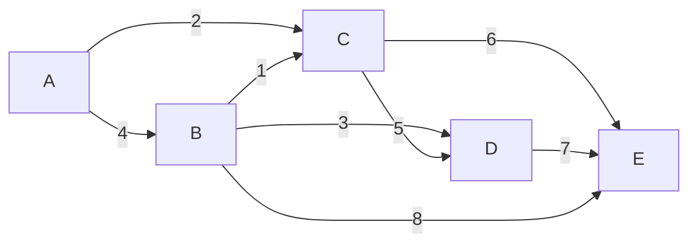

# Kruskal's Algorithm

Imagine you're planning roads between villages. Sort all possible roads by length, shortest first. Now go through the list: build each road, but skip any road that would create a loop (because loops are wasteful — you've already connected those villages another way). Stop when every village is connected. That's **Kruskal's algorithm** — elegantly simple, powerfully effective.

---

## The Problem Recap: Minimum Spanning Tree

Like Prim's algorithm, Kruskal's solves the **Minimum Spanning Tree (MST)** problem: find the subset of edges that connects all vertices with the minimum total weight and no cycles.

The difference is in perspective:
- **Prim's** thinks vertex-first: grow one connected tree outward.
- **Kruskal's** thinks edge-first: greedily pick the cheapest edges globally.

---

## The Graph



**All edges sorted by weight:**

| Edge | Weight | Add? |
|------|--------|------|
| B-C | 1 | Yes — connects B and C |
| A-C | 2 | Yes — connects A to {B,C} |
| B-D | 3 | Yes — connects D to {A,B,C} |
| A-B | 4 | **Skip** — A and B already connected |
| C-D | 5 | **Skip** — C and D already connected |
| C-E | 6 | Yes — connects E to {A,B,C,D} |
| D-E | 7 | **Skip** — D and E already connected |
| B-E | 8 | **Skip** — B and E already connected |

MST edges: B-C(1), A-C(2), B-D(3), C-E(6) → **Total: 12**

---

## The Key Dependency: Union-Find

How do we efficiently check "would this edge create a cycle?" The answer is **Union-Find** (also called Disjoint Set Union).

Union-Find tracks which vertices are in the same connected component. Before adding an edge, we check: are both endpoints already in the same component? If yes — skip (it's a cycle). If no — add the edge and merge the two components.

See the [Union-Find tutorial](../union-find.md) for a full explanation. Here's the key interface we need:

- `find(x)` — returns the root/representative of x's component
- `union(x, y)` — merges the components of x and y; returns `False` if they're already in the same component (would create a cycle)

---

## Implementation

```python,editable
class UnionFind:
    def __init__(self, nodes):
        # Each node starts as its own parent (its own component)
        self.parent = {node: node for node in nodes}
        self.rank = {node: 0 for node in nodes}

    def find(self, x):
        # Path compression: flatten the tree while finding root
        if self.parent[x] != x:
            self.parent[x] = self.find(self.parent[x])
        return self.parent[x]

    def union(self, x, y):
        rx, ry = self.find(x), self.find(y)
        if rx == ry:
            return False  # Already in same component — adding this edge creates a cycle

        # Union by rank: attach smaller tree under larger tree
        if self.rank[rx] < self.rank[ry]:
            rx, ry = ry, rx
        self.parent[ry] = rx
        if self.rank[rx] == self.rank[ry]:
            self.rank[rx] += 1
        return True  # Successfully merged two components


def kruskals(vertices, edges):
    """
    vertices: list of vertex names
    edges: list of (weight, u, v) tuples
    Returns: MST edge list, total weight
    """
    uf = UnionFind(vertices)
    mst_edges = []
    total_weight = 0

    # Step 1: Sort all edges by weight
    sorted_edges = sorted(edges)

    # Step 2: Greedily add edges that don't create cycles
    for weight, u, v in sorted_edges:
        if uf.union(u, v):
            mst_edges.append((u, v, weight))
            total_weight += weight

        # MST is complete when we have V-1 edges
        if len(mst_edges) == len(vertices) - 1:
            break

    return mst_edges, total_weight


# Graph from the diagram
vertices = ['A', 'B', 'C', 'D', 'E']
edges = [
    (4, 'A', 'B'),
    (2, 'A', 'C'),
    (3, 'B', 'D'),
    (1, 'B', 'C'),
    (5, 'C', 'D'),
    (6, 'C', 'E'),
    (7, 'D', 'E'),
    (8, 'B', 'E'),
]

mst, total = kruskals(vertices, edges)

print("Kruskal's MST:")
print(f"{'Edge':<12} {'Weight':>6}")
print("-" * 20)
for u, v, w in mst:
    print(f"{u} -- {v}      {w:>4}")
print("-" * 20)
print(f"{'Total':>17}  {total:>4}")
print(f"\nVerification: {len(mst)} edges for {len(vertices)} vertices (need {len(vertices)-1})")
```

---

## Step-by-Step Trace with Union-Find State

```python,editable
class UnionFind:
    def __init__(self, nodes):
        self.parent = {node: node for node in nodes}
        self.rank = {node: 0 for node in nodes}

    def find(self, x):
        if self.parent[x] != x:
            self.parent[x] = self.find(self.parent[x])
        return self.parent[x]

    def union(self, x, y):
        rx, ry = self.find(x), self.find(y)
        if rx == ry:
            return False
        if self.rank[rx] < self.rank[ry]:
            rx, ry = ry, rx
        self.parent[ry] = rx
        if self.rank[rx] == self.rank[ry]:
            self.rank[rx] += 1
        return True

    def components(self):
        # Group nodes by their root
        groups = {}
        for node in self.parent:
            root = self.find(node)
            groups.setdefault(root, []).append(node)
        return [sorted(group) for group in groups.values()]


def kruskals_verbose(vertices, edges):
    uf = UnionFind(vertices)
    mst_edges = []
    total_weight = 0
    sorted_edges = sorted(edges)

    print(f"{'Edge':<10} {'Weight':>6}  {'Action':<30}  Components")
    print("-" * 75)

    for weight, u, v in sorted_edges:
        merged = uf.union(u, v)
        if merged:
            mst_edges.append((u, v, weight))
            total_weight += weight
            action = f"ADD  -> MST cost now {total_weight}"
        else:
            action = "SKIP (would create cycle)"

        components = uf.components()
        comp_str = ', '.join(str(c) for c in components)
        print(f"{u}-{v:<8}  {weight:>5}  {action:<30}  {comp_str}")

        if len(mst_edges) == len(vertices) - 1:
            break

    print(f"\nFinal MST weight: {total_weight}")
    return mst_edges, total_weight


vertices = ['A', 'B', 'C', 'D', 'E']
edges = [
    (4, 'A', 'B'), (2, 'A', 'C'), (3, 'B', 'D'),
    (1, 'B', 'C'), (5, 'C', 'D'), (6, 'C', 'E'),
    (7, 'D', 'E'), (8, 'B', 'E'),
]

mst, total = kruskals_verbose(vertices, edges)
```

---

## Complexity Analysis

| | Complexity |
|---|---|
| **Sorting edges** | O(E log E) |
| **Union-Find operations** | O(E · α(V)) ≈ O(E) |
| **Total time** | **O(E log E)** |
| **Space** | O(V + E) |

Note: α(V) is the inverse Ackermann function — it grows so slowly it's effectively constant (≤ 4 for any realistic input). So the sorting step dominates.

Since E ≤ V², we have log E ≤ 2 log V, so O(E log E) = O(E log V) — same asymptotic complexity as Prim's with a binary heap.

---

## Kruskal's vs Prim's: Full Comparison

| Criterion | Kruskal's | Prim's |
|-----------|-----------|--------|
| **Approach** | Global: sort all edges, pick greedily | Local: grow one tree from a start vertex |
| **Key data structure** | Union-Find | Min-heap |
| **Time complexity** | O(E log E) | O(E log V) |
| **Best for** | Sparse graphs (E << V²) | Dense graphs (E ≈ V²) |
| **Pre-sorted edges** | Excellent — sorting is already done | No advantage |
| **Disconnected graphs** | Naturally produces a spanning forest | Only spans one component |
| **Implementation** | Slightly simpler to reason about | Similar to Dijkstra's — reusable pattern |
| **Parallelism** | Harder to parallelise | Harder to parallelise |

**Rule of thumb**: if E is much smaller than V², use Kruskal's. If E is close to V², use Prim's with a simple array (O(V²)). For most competitive programming problems, both work fine.

---

## Disconnected Graphs: Spanning Forest

If the graph is disconnected, Kruskal's naturally produces a **minimum spanning forest** — one MST per connected component.

```python,editable
class UnionFind:
    def __init__(self, nodes):
        self.parent = {node: node for node in nodes}
        self.rank = {node: 0 for node in nodes}

    def find(self, x):
        if self.parent[x] != x:
            self.parent[x] = self.find(self.parent[x])
        return self.parent[x]

    def union(self, x, y):
        rx, ry = self.find(x), self.find(y)
        if rx == ry:
            return False
        if self.rank[rx] < self.rank[ry]:
            rx, ry = ry, rx
        self.parent[ry] = rx
        if self.rank[rx] == self.rank[ry]:
            self.rank[rx] += 1
        return True


def kruskals_forest(vertices, edges):
    uf = UnionFind(vertices)
    mst_edges = []
    total_weight = 0

    for weight, u, v in sorted(edges):
        if uf.union(u, v):
            mst_edges.append((u, v, weight))
            total_weight += weight

    # Count components in the result
    roots = set(uf.find(v) for v in vertices)
    num_components = len(roots)

    return mst_edges, total_weight, num_components


# Two disconnected islands: {A,B,C} and {D,E}
vertices = ['A', 'B', 'C', 'D', 'E']
edges = [
    (2, 'A', 'C'),
    (1, 'B', 'C'),
    (3, 'A', 'B'),
    (1, 'D', 'E'),
]

mst, total, components = kruskals_forest(vertices, edges)

print("Minimum Spanning Forest:")
for u, v, w in mst:
    print(f"  {u} -- {v}  (weight: {w})")
print(f"\nTotal weight: {total}")
print(f"Number of components (trees in the forest): {components}")
```

---

## Real-World Applications

| Domain | Application |
|--------|-------------|
| **Network Design** | Minimum cable/fibre for connecting buildings or cities |
| **Electrical Grid** | Minimum wire for power distribution |
| **Water Pipes** | Minimum pipe for municipal water networks |
| **Pre-sorted Data** | When edge list comes pre-sorted (e.g., from a distance database), Kruskal's is immediately efficient |
| **Cluster Analysis** | Single-linkage hierarchical clustering builds an MST |
| **Image Segmentation** | Kruskal-based algorithms group similar pixels |
| **Approximation Algorithms** | MST gives a 2-approximation for the Travelling Salesman Problem |

---

## Key Takeaways

- Kruskal's finds the **MST** by sorting all edges and greedily adding the cheapest non-cycle-forming edge.
- The critical helper is **Union-Find**: it detects and prevents cycles in near-constant time.
- Time complexity is **O(E log E)**, dominated by sorting.
- Kruskal's excels on **sparse graphs** and when edges are already sorted.
- On disconnected graphs, it produces a **minimum spanning forest** naturally.
- Both Kruskal's and Prim's always produce an MST with **V - 1 edges** (per component).
