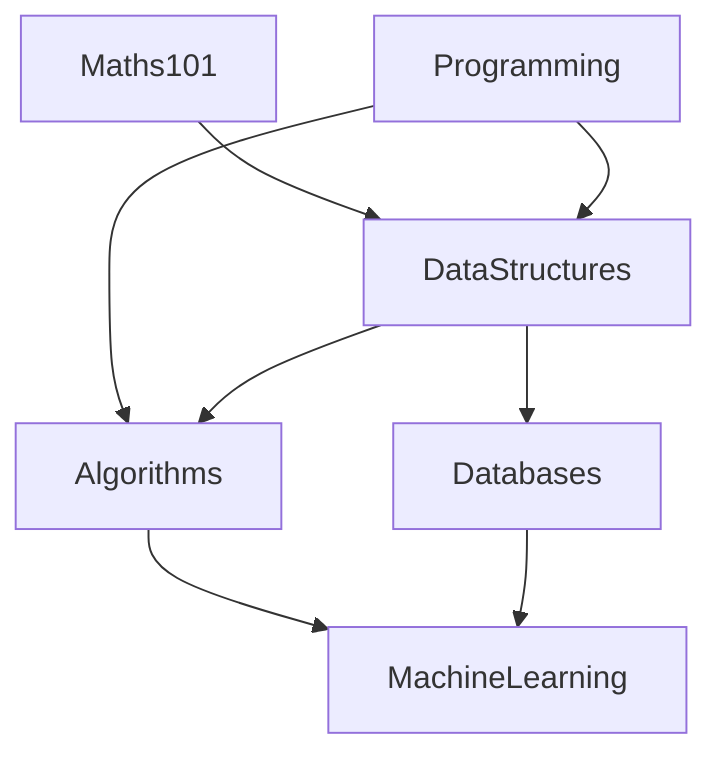

# Topological Sort

Before you can take Algorithms, you must take Data Structures. Before Data Structures, you need Programming Fundamentals. Before that, you need nothing — it's your starting point. **Topological sort** takes a graph of these dependency relationships and produces a valid order to complete them all.

---

## The Problem: Ordering with Dependencies

Imagine you're a university student planning your course sequence. Some courses have prerequisites — you can't take them until you've completed others. You need a linear order of all courses such that every prerequisite comes before the course that requires it.

This is exactly what **topological sort** produces: a linear ordering of vertices in a **directed graph** such that for every directed edge `u → v`, vertex `u` appears before `v` in the ordering.

---

## Directed Acyclic Graphs (DAGs)

Topological sort only works on **DAGs** — Directed Acyclic Graphs.

- **Directed**: edges have a direction (u → v means "u must come before v")
- **Acyclic**: no cycles (if A depends on B which depends on A, there's no valid ordering — it's a deadlock)



One valid topological order: `Maths101 → Programming → DataStructures → Algorithms → Databases → MachineLearning`

Another valid order: `Programming → Maths101 → DataStructures → Databases → Algorithms → MachineLearning`

Both are correct — topological sort is not unique when multiple valid orderings exist.

---

## Approach 1: Kahn's Algorithm (BFS-based)

Kahn's algorithm uses the concept of **in-degree**: the number of edges pointing *into* a vertex. A vertex with in-degree 0 has no prerequisites — it can be taken immediately.

### The Idea

1. Compute the in-degree of every vertex.
2. Enqueue all vertices with in-degree 0 (no prerequisites).
3. While the queue is not empty:
   - Dequeue a vertex, add it to the result.
   - For each of its neighbours, decrement their in-degree by 1.
   - If a neighbour's in-degree reaches 0, enqueue it.
4. If the result contains all vertices — success. If not — the graph has a **cycle**.

### Step-by-Step Trace

Using the course graph above:

| Step | Queue | Processed | In-degrees updated |
|------|-------|-----------|-------------------|
| Init | [Maths101, Programming] | — | All computed |
| 1 | [Programming] | Maths101 | DataStructures: 2→1 |
| 2 | [] | Programming | DataStructures: 1→0, Algorithms: 2→1 → enqueue DS |
| 3 | [DataStructures] | — | — |
| 4 | [Algorithms, Databases] | DataStructures | Algorithms: 1→0, Databases: 1→0 |
| 5 | [Databases] | Algorithms | MachineLearning: 2→1 |
| 6 | [] | Databases | MachineLearning: 1→0 → enqueue ML |
| 7 | [MachineLearning] | — | — |
| 8 | Done | MachineLearning | — |

---

## Implementation: Kahn's Algorithm

```python,editable
from collections import deque

def kahns_topological_sort(graph):
    """
    graph: { node: [neighbours...] } — directed edges node -> neighbour
    Returns: (order list, has_cycle bool)
    """
    # Step 1: compute in-degree for every node
    in_degree = {node: 0 for node in graph}
    for node in graph:
        for neighbour in graph[node]:
            in_degree[neighbour] = in_degree.get(neighbour, 0) + 1

    # Ensure all nodes exist in in_degree (including those with no outgoing edges)
    for node in graph:
        in_degree.setdefault(node, 0)

    # Step 2: enqueue all nodes with in-degree 0
    queue = deque()
    for node in graph:
        if in_degree[node] == 0:
            queue.append(node)

    result = []

    # Step 3: process queue
    while queue:
        node = queue.popleft()
        result.append(node)

        for neighbour in graph[node]:
            in_degree[neighbour] -= 1
            if in_degree[neighbour] == 0:
                queue.append(neighbour)

    # Step 4: cycle detection
    has_cycle = len(result) != len(graph)
    return result, has_cycle


# Course prerequisite graph
courses = {
    'Maths101':        ['DataStructures'],
    'Programming':     ['DataStructures', 'Algorithms'],
    'DataStructures':  ['Algorithms', 'Databases'],
    'Algorithms':      ['MachineLearning'],
    'Databases':       ['MachineLearning'],
    'MachineLearning': [],
}

order, cycle = kahns_topological_sort(courses)

if cycle:
    print("Cycle detected — no valid course order exists!")
else:
    print("Valid course order:")
    for i, course in enumerate(order, 1):
        print(f"  {i}. {course}")
```

---

## Approach 2: DFS-based Topological Sort

The DFS approach uses a key insight: in a DFS traversal, a vertex is "finished" only after all vertices reachable from it are finished. So the vertex that finishes last has no dependencies — it should come first in the topological order.

### The Idea

1. For each unvisited vertex, run a DFS.
2. When a vertex finishes (all its descendants have been visited), push it onto a stack.
3. Pop the stack to get the topological order (nodes with no dependencies come out first).

### States

Each node has three states during DFS:
- **Unvisited (WHITE)**: not yet seen
- **In progress (GRAY)**: currently in the DFS call stack
- **Done (BLACK)**: fully processed

If we encounter a GRAY node during DFS, we've found a **back edge** — which means there's a cycle.

---

## Implementation: DFS-based

```python,editable
def dfs_topological_sort(graph):
    """
    graph: { node: [neighbours...] }
    Returns: (order list, has_cycle bool)
    """
    WHITE, GRAY, BLACK = 0, 1, 2
    state = {node: WHITE for node in graph}
    result = []
    has_cycle = False

    def dfs(node):
        nonlocal has_cycle
        if has_cycle:
            return

        state[node] = GRAY  # Mark as "in progress"

        for neighbour in graph[node]:
            if state[neighbour] == GRAY:
                # Back edge found — cycle!
                has_cycle = True
                return
            if state[neighbour] == WHITE:
                dfs(neighbour)

        state[node] = BLACK  # Mark as "done"
        result.append(node)   # Post-order: append when fully done

    for node in graph:
        if state[node] == WHITE:
            dfs(node)

    if has_cycle:
        return [], True

    # Reverse because we appended in post-order (leaves first)
    result.reverse()
    return result, False


# Same course graph
courses = {
    'Maths101':        ['DataStructures'],
    'Programming':     ['DataStructures', 'Algorithms'],
    'DataStructures':  ['Algorithms', 'Databases'],
    'Algorithms':      ['MachineLearning'],
    'Databases':       ['MachineLearning'],
    'MachineLearning': [],
}

order, cycle = dfs_topological_sort(courses)

if cycle:
    print("Cycle detected — no valid course order exists!")
else:
    print("Valid course order (DFS-based):")
    for i, course in enumerate(order, 1):
        print(f"  {i}. {course}")
```

---

## Cycle Detection Demo

Both algorithms detect cycles, but Kahn's is often preferred for this because the detection falls out naturally from counting processed nodes.

```python,editable
from collections import deque

def kahns_topological_sort(graph):
    in_degree = {node: 0 for node in graph}
    for node in graph:
        for neighbour in graph[node]:
            in_degree[neighbour] = in_degree.get(neighbour, 0) + 1
    for node in graph:
        in_degree.setdefault(node, 0)

    queue = deque(node for node in graph if in_degree[node] == 0)
    result = []

    while queue:
        node = queue.popleft()
        result.append(node)
        for neighbour in graph[node]:
            in_degree[neighbour] -= 1
            if in_degree[neighbour] == 0:
                queue.append(neighbour)

    has_cycle = len(result) != len(graph)
    return result, has_cycle


# Valid DAG: A -> B -> C -> D
dag = {
    'A': ['B'],
    'B': ['C'],
    'C': ['D'],
    'D': [],
}

# Cyclic graph: A -> B -> C -> A (circular dependency!)
cyclic = {
    'A': ['B'],
    'B': ['C'],
    'C': ['A'],   # This creates the cycle
    'D': ['A'],   # D is a separate entry point into the cycle
}

order1, c1 = kahns_topological_sort(dag)
order2, c2 = kahns_topological_sort(cyclic)

print("DAG result:")
print(f"  Order: {order1}")
print(f"  Has cycle: {c1}")

print("\nCyclic graph result:")
print(f"  Partial order: {order2}  (only D was processed — A, B, C are stuck)")
print(f"  Has cycle: {c2}")
print(f"  Nodes in cycle: {set(cyclic.keys()) - set(order2)}")
```

---

## Real-World Build System Example

```python,editable
from collections import deque

def build_order(tasks):
    """
    tasks: { task: [dependencies...] }
    Returns build order (dependencies first)
    """
    # Convert to graph where edges go FROM dependency TO dependent
    # If B depends on A, then A -> B (A must come before B)
    graph = {task: [] for task in tasks}
    in_degree = {task: 0 for task in tasks}

    for task, deps in tasks.items():
        for dep in deps:
            graph[dep].append(task)
            in_degree[task] += 1

    queue = deque(t for t in tasks if in_degree[t] == 0)
    order = []

    while queue:
        task = queue.popleft()
        order.append(task)
        for dependent in graph[task]:
            in_degree[dependent] -= 1
            if in_degree[dependent] == 0:
                queue.append(dependent)

    if len(order) != len(tasks):
        return None  # Circular dependency

    return order


# npm-style package dependencies
packages = {
    'express':    ['http-parser', 'path-to-regexp'],
    'mongoose':   ['bson', 'kareem'],
    'bson':       [],
    'kareem':     [],
    'http-parser':['safer-buffer'],
    'safer-buffer':[],
    'path-to-regexp': [],
    'my-app':     ['express', 'mongoose'],
}

install_order = build_order(packages)

if install_order:
    print("npm install order:")
    for i, pkg in enumerate(install_order, 1):
        deps = packages[pkg]
        dep_str = f"  (requires: {', '.join(deps)})" if deps else "  (no dependencies)"
        print(f"  {i:>2}. {pkg}{dep_str}")
else:
    print("Circular dependency detected!")
```

---

## Comparing the Two Approaches

| | Kahn's (BFS) | DFS-based |
|---|---|---|
| **Mechanism** | In-degree counting + queue | Post-order DFS + stack |
| **Cycle detection** | Yes — check `len(result) != len(graph)` | Yes — check for GRAY neighbours |
| **Implementation** | Iterative (no recursion depth issues) | Recursive (may hit stack limits on large graphs) |
| **Which cycle** | Tells you nodes involved (unprocessed nodes) | Detects existence on encounter |
| **Order of output** | Stable with consistent queue ordering | Depends on DFS traversal order |
| **Intuition** | "Keep taking courses with no remaining prereqs" | "Finish deeply nested tasks first" |

Both have **O(V + E)** time complexity and **O(V)** space complexity.

For most practical uses, **Kahn's is preferred** — it's iterative, naturally detects cycles, and is easier to reason about.

---

## Complexity Analysis

| | Complexity |
|---|---|
| **Time** | O(V + E) |
| **Space** | O(V) for in-degree map / visited states + O(V) for queue/stack |

Both approaches process every vertex once and every edge once — hence O(V + E).

---

## Real-World Applications

| Domain | Application |
|--------|-------------|
| **Build systems** | Make, Bazel, Gradle — compile files in dependency order |
| **Package managers** | npm, pip, apt — install packages before those that need them |
| **Course scheduling** | University prerequisite planning |
| **Spreadsheets** | Evaluate formulas in dependency order (Excel, Google Sheets) |
| **Data pipelines** | Apache Airflow, dbt — run transforms in correct order |
| **Git** | Commit history forms a DAG; topological sort underlies `git log --topo-order` |
| **Compiler internals** | Resolve symbol dependencies, schedule instruction execution |

---

## Key Takeaways

- Topological sort produces a linear ordering where **all dependencies come before their dependents**.
- It only works on **DAGs** (Directed Acyclic Graphs). Cycles make ordering impossible.
- **Kahn's algorithm** (BFS + in-degrees): iterative, natural cycle detection, intuitive.
- **DFS-based**: recursive, append on finish, reverse at end.
- Both run in **O(V + E)** time.
- If not all vertices appear in the result, the graph contains a **cycle** — which is itself useful information (deadlock detection, dependency error reporting).
