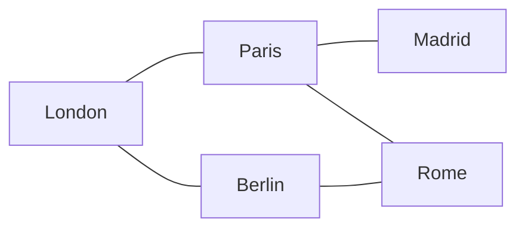
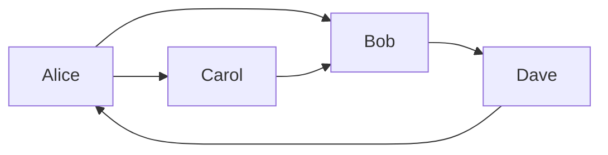

# Graphs

Google Maps, Facebook friends, the internet itself — all graphs. The most powerful data structure ever invented.

Every time your phone finds a route to a coffee shop, every time Instagram suggests someone you might know, every time you click a hyperlink — a graph algorithm is running behind the scenes. Graphs are everywhere, and once you learn to see them, you'll spot them in everything.

## What is a Graph?

A graph is a collection of **vertices** (also called nodes) connected by **edges** (also called links or connections).

- **Vertex** — a single entity (a city, a person, a webpage, a router)
- **Edge** — a relationship between two vertices (a road, a friendship, a hyperlink, a cable)

That's it. Simple concept, infinite power.

## Undirected Graphs

In an **undirected** graph, edges go both ways. If city A connects to city B, you can travel in either direction. Think of roads on a map.

Every edge here is a two-way road. London connects to Paris, and Paris connects back to London.

## Directed Graphs

In a **directed** graph (also called a digraph), edges have a direction — an arrow pointing one way. Think of Twitter follows: you can follow a celebrity without them following you back.

Here, Alice follows Bob and Carol. Bob follows Dave. Dave follows Alice back — but Carol does not follow Dave.

## Weighted vs Unweighted

Edges can carry a **weight** — a number representing cost, distance, time, or strength.

- **Unweighted**: all edges are equal (friendships on Facebook)
- **Weighted**: each edge has a value (road distances, flight prices, signal strength)

In the city map above, imagine each edge also has a number: the distance in kilometres. That's a weighted graph, and it's how GPS navigation works.

## Directed vs Undirected — Quick Reference

| Property | Undirected | Directed |
|---|---|---|
| Edge direction | Both ways | One way |
| Real example | Friendships, roads | Twitter follows, hyperlinks |
| Notation | A — B | A → B |

## What's Coming in This Section

| Topic | What You'll Learn |
|---|---|
| [Intro to Graphs](28-intro-to-graphs.md) | Adjacency matrix and adjacency list representations |
| [Matrix DFS](29-matrix-dfs.md) | Depth-first search on a 2D grid — flood fill and island counting |
| [Matrix BFS](30-matrix-bfs.md) | Breadth-first search on a 2D grid — shortest path guaranteed |
| [Adjacency List](31-adjacency-list.md) | DFS and BFS on real graphs, cycle detection |

By the end of this section, you'll be able to solve problems that stump most programmers — because most programmers never took the time to truly understand graphs.
