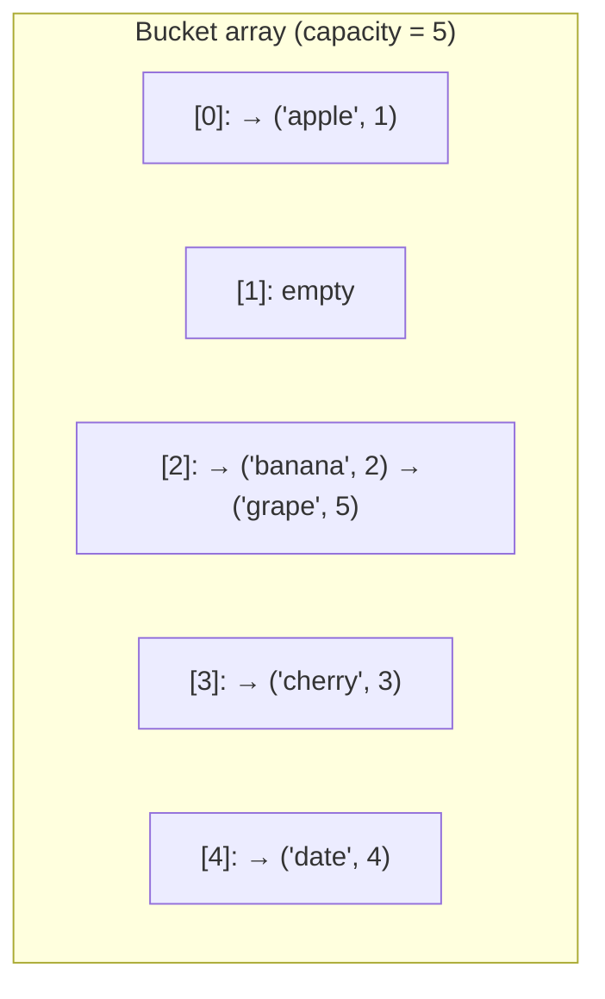
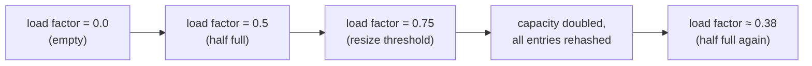

# Hash Implementation

You have been using Python dicts for years. Now it's time to understand what happens inside them. Building a hash table from scratch is one of the best exercises in computer science — it connects arrays, linked lists, and probability in one elegant structure.

## Step 1: The Hash Function

A hash function converts a key into an integer, which is then mapped to a bucket index using the modulo operator.

```python,editable
def simple_hash(key, capacity):
    """Sum the ASCII values of all characters, then take modulo."""
    total = 0
    for ch in str(key):
        total += ord(ch)
    return total % capacity

capacity = 10
print("Hash function results (capacity=10):")
for key in ["cat", "dog", "apple", "tac", "act", "hello"]:
    index = simple_hash(key, capacity)
    print(f"  '{key}' -> {index}")

print("\nNotice: 'cat', 'tac', 'act' all hash to the same index — that's a collision!")
```

A good hash function has two properties:
- **Deterministic**: the same key always produces the same index.
- **Uniform distribution**: keys spread evenly across buckets, minimising collisions.

The simple sum-of-chars function above is weak (anagrams always collide). Python's built-in `hash()` uses a much better algorithm with randomised seeds.

## Step 2: Collision Handling with Chaining

When two keys hash to the same bucket, **chaining** stores both entries in a linked list (or Python list) at that bucket. Lookup scans the short list at the bucket, which stays close to O(1) when the table is not too full.



`'banana'` and `'grape'` both hashed to bucket 2 — they form a chain there.

## Full HashTable Implementation

```python,editable
class HashTable:
    def __init__(self, capacity=8):
        self.capacity = capacity
        self.size = 0
        self.buckets = [[] for _ in range(capacity)]   # each bucket is a list of (key, value) pairs

    def _hash(self, key):
        total = 0
        for ch in str(key):
            total += ord(ch)
        return total % self.capacity

    def put(self, key, value):
        index = self._hash(key)
        bucket = self.buckets[index]
        # Update existing key if present
        for i, (k, v) in enumerate(bucket):
            if k == key:
                bucket[i] = (key, value)
                return
        # Otherwise append a new entry
        bucket.append((key, value))
        self.size += 1
        # Resize if load factor exceeds 0.75
        if self.size / self.capacity > 0.75:
            self._resize()

    def get(self, key, default=None):
        index = self._hash(key)
        for k, v in self.buckets[index]:
            if k == key:
                return v
        return default

    def remove(self, key):
        index = self._hash(key)
        bucket = self.buckets[index]
        for i, (k, v) in enumerate(bucket):
            if k == key:
                del bucket[i]
                self.size -= 1
                return True
        return False

    def _resize(self):
        """Double the capacity and rehash all entries."""
        old_buckets = self.buckets
        self.capacity *= 2
        self.buckets = [[] for _ in range(self.capacity)]
        self.size = 0
        for bucket in old_buckets:
            for key, value in bucket:
                self.put(key, value)    # rehash into new buckets

    def load_factor(self):
        return self.size / self.capacity

    def __repr__(self):
        entries = []
        for bucket in self.buckets:
            for k, v in bucket:
                entries.append(f"{k!r}: {v!r}")
        return "{" + ", ".join(entries) + "}"


# --- Demo ---
ht = HashTable()
ht.put("name", "Alice")
ht.put("age", 30)
ht.put("city", "Sydney")
ht.put("job", "Engineer")

print("After 4 inserts:", ht)
print("get('name'):", ht.get("name"))
print("get('missing', 'N/A'):", ht.get("missing", "N/A"))
print("load factor:", round(ht.load_factor(), 2))

ht.remove("age")
print("After removing 'age':", ht)

# Update existing key
ht.put("name", "Bob")
print("After updating 'name':", ht)
```

## Load Factor and Resizing

The **load factor** is `number_of_entries / capacity`. It measures how full the table is.



- Below ~0.75: collisions are rare, most lookups are O(1).
- Above ~0.75: chains grow, performance degrades toward O(n).
- Python's dict resizes at 2/3 capacity to keep things fast.

```python,editable
class HashTable:
    def __init__(self, capacity=8):
        self.capacity = capacity
        self.size = 0
        self.buckets = [[] for _ in range(capacity)]
        self._resize_count = 0

    def _hash(self, key):
        total = sum(ord(ch) for ch in str(key))
        return total % self.capacity

    def put(self, key, value):
        index = self._hash(key)
        for i, (k, v) in enumerate(self.buckets[index]):
            if k == key:
                self.buckets[index][i] = (key, value)
                return
        self.buckets[index].append((key, value))
        self.size += 1
        if self.size / self.capacity > 0.75:
            self._resize()

    def get(self, key, default=None):
        for k, v in self.buckets[self._hash(key)]:
            if k == key:
                return v
        return default

    def _resize(self):
        old_buckets = self.buckets
        self.capacity *= 2
        self.buckets = [[] for _ in range(self.capacity)]
        self.size = 0
        self._resize_count += 1
        for bucket in old_buckets:
            for key, value in bucket:
                self.put(key, value)


# Watch the table grow
ht = HashTable(capacity=4)
print(f"{'entries':>8}  {'capacity':>9}  {'load_factor':>12}  {'resizes':>8}")
for i in range(20):
    ht.put(f"key{i}", i)
    lf = ht.size / ht.capacity
    print(f"{ht.size:>8}  {ht.capacity:>9}  {lf:>12.2f}  {ht._resize_count:>8}")
```

## How Real Systems Use Hashing

**Python dict**: uses open addressing (not chaining) with a probing sequence. Keys must be hashable (immutable). Python randomises the hash seed per process run to prevent hash collision attacks (a security feature called hash randomisation).

**Redis**: stores all keys in a global hash table. Each database is one giant dict. Redis uses incremental rehashing — when it resizes, it migrates entries a few at a time instead of all at once, so no single operation is slow.

**Blockchain**: uses cryptographic hash functions (SHA-256) to link blocks. A change in any block changes its hash, which invalidates all subsequent hashes — making tampering detectable. This is a completely different use of hashing (for integrity, not lookup), but the core idea is the same: deterministic mapping from data to a fixed-size output.

## Complexity Summary

| Operation | Average  | Worst case |
|-----------|----------|------------|
| put       | O(1)     | O(n)       |
| get       | O(1)     | O(n)       |
| remove    | O(1)     | O(n)       |
| resize    | O(n)     | O(n)       |

The worst case occurs only when every key collides into the same bucket — which requires a genuinely terrible hash function or a deliberate attack. With a good hash function and a load factor below 0.75, average-case O(1) is reliable in practice.
