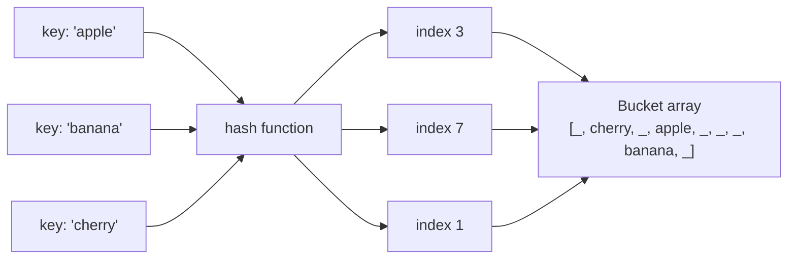
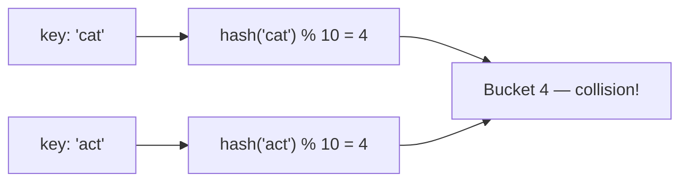

# Hashing

Python dictionaries offer O(1) lookup, insert, and delete. How? Magic? No — **hash tables**.

A hash table is one of the most practically useful data structures ever invented. It underpins Python dicts, Python sets, database indexes, caches, spell checkers, and much more. Understanding it will make you a dramatically better programmer.

## The Core Idea: Mapping Keys to Array Indices

Arrays give you O(1) access by index: `arr[42]` is instant. The challenge is that real-world keys are strings, objects, or other non-integers — not tidy array indices.

A **hash function** solves this: it converts any key into a number, which is then used as an array index.



The lookup is O(1) because:
1. Compute `hash(key)` → get an index.
2. Go directly to `array[index]`.

No scanning. No searching. Just one jump.

## The Problem: Collisions

Different keys can produce the same index. This is called a **collision** and is unavoidable — there are infinitely many possible keys but only a finite-size array.



Good hash table implementations handle collisions gracefully. The two main strategies are **chaining** (each bucket holds a list of entries) and **open addressing** (find the next empty slot). You will implement chaining in the Hash Implementation chapter.

## A Quick Taste

```python,editable
# Python dict is a hash table
phone_book = {}
phone_book["Alice"] = "555-1234"
phone_book["Bob"]   = "555-5678"
phone_book["Carol"] = "555-9999"

# O(1) lookup — no matter how large the dict gets
print(phone_book["Alice"])
print("Bob" in phone_book)     # O(1) membership check
print(phone_book.get("Dave", "not found"))

# Python set is a hash table that stores only keys (no values)
unique_visitors = {"alice", "bob", "alice", "carol", "bob"}
print(unique_visitors)         # duplicates removed automatically
print("alice" in unique_visitors)  # O(1)
```

## What You Will Learn

- **Hash Usage** — the everyday patterns that make hash maps and sets so powerful: frequency counting, two-sum, anagram detection, caching, and more.
- **Hash Implementation** — how hash tables actually work under the hood: hash functions, collision handling with chaining, load factor, and resizing.
