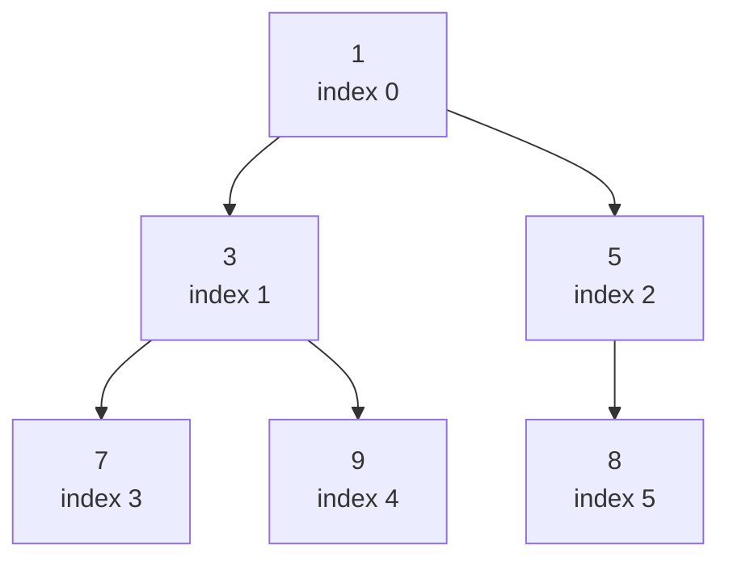

# Heap Properties

A heap looks like a tree but is stored in a plain array — one of the most elegant tricks in computer science. There are no pointers, no node objects, no wasted memory. Just a flat list and a bit of index arithmetic.

## The Complete Binary Tree Property

A heap is always a **complete binary tree**: every level is fully filled except possibly the last, which is filled from left to right. This shape guarantee is what lets us store the tree in an array without gaps.



The same data in an array:

```
index:  0   1   2   3   4   5
value: [1,  3,  5,  7,  9,  8]
```

## Index Arithmetic: The Magic Formula

Given a node at index `i`, you can reach its relatives with simple arithmetic — no pointers needed:

| Relationship | Formula        |
|--------------|----------------|
| Parent       | `(i - 1) // 2` |
| Left child   | `2 * i + 1`    |
| Right child  | `2 * i + 2`    |

Let's verify with the tree above. Node `3` is at index `1`:
- Its parent is at `(1 - 1) // 2 = 0` → value `1`. Correct.
- Its left child is at `2*1 + 1 = 3` → value `7`. Correct.
- Its right child is at `2*1 + 2 = 4` → value `9`. Correct.

```python,editable
def parent(i):
    return (i - 1) // 2

def left_child(i):
    return 2 * i + 1

def right_child(i):
    return 2 * i + 2

heap = [1, 3, 5, 7, 9, 8]

for i, val in enumerate(heap):
    p = parent(i) if i > 0 else None
    l = left_child(i) if left_child(i) < len(heap) else None
    r = right_child(i) if right_child(i) < len(heap) else None
    print(
        f"index {i} (value={val}): "
        f"parent={heap[p] if p is not None else 'none':>4}  "
        f"left={heap[l] if l is not None else 'none':>4}  "
        f"right={heap[r] if r is not None else 'none':>4}"
    )
```

## The Heap Ordering Property

The shape property alone doesn't make a heap. There is a second rule about the *values*:

- **Min-heap**: every parent is less than or equal to both its children.
- **Max-heap**: every parent is greater than or equal to both its children.

This is enforced locally at every node — the heap does not require the entire left subtree to be smaller than the right subtree, only that each parent beats its immediate children.

```python,editable
def is_min_heap(arr):
    """Check whether arr satisfies the min-heap property."""
    n = len(arr)
    for i in range(n):
        left  = 2 * i + 1
        right = 2 * i + 2
        if left < n and arr[i] > arr[left]:
            return False
        if right < n and arr[i] > arr[right]:
            return False
    return True

valid_heap   = [1, 3, 5, 7, 9, 8]
invalid_heap = [1, 3, 5, 2, 9, 8]   # index 3 (value 2) is smaller than parent index 1 (value 3)

print("valid_heap is min-heap:  ", is_min_heap(valid_heap))
print("invalid_heap is min-heap:", is_min_heap(invalid_heap))
```

## Why This Matters in the Real World

Heaps are not just a textbook curiosity — they underpin some of the most important algorithms and systems:

- **OS process scheduling**: the kernel maintains a priority queue of runnable processes. The scheduler always picks the highest-priority process next, in O(log n).
- **Dijkstra's shortest path**: at each step the algorithm greedily expands the unvisited node with the smallest known distance. A min-heap makes that lookup O(log n) instead of O(n).
- **A* pathfinding** (used in GPS navigation and game AI): the open set is a min-heap ordered by estimated total cost, ensuring the most promising path is always explored first.

In all three cases the same pattern repeats: repeatedly pull the "best" item, do some work, push new items. That is precisely what a heap is optimized for.
