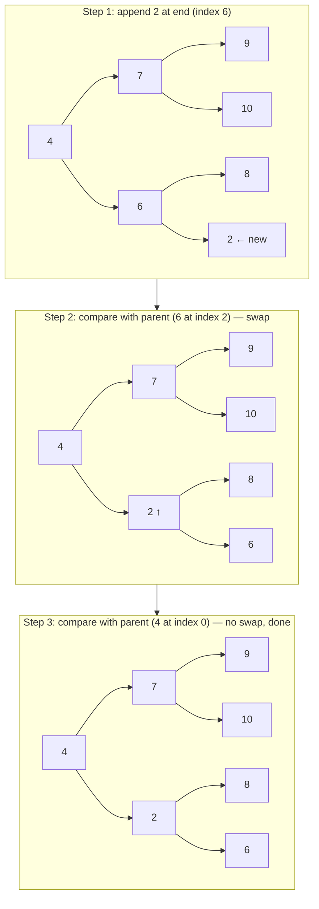
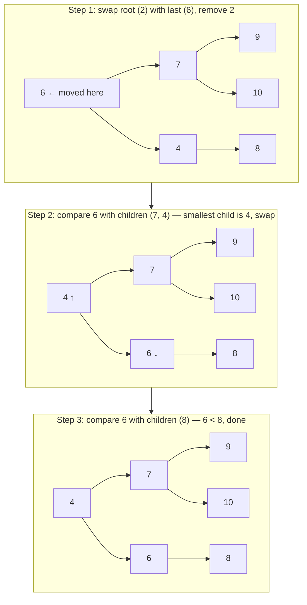

# Push and Pop

Every time you add or remove an element, the heap has one job: restore its ordering property as quickly as possible. It does this with two simple operations — **sift up** (after a push) and **sift down** (after a pop). Both run in O(log n) because the tree height is at most log₂(n).

## Push: Add to the End, Then Sift Up

When you push a new element, you append it at the end of the array (maintaining the complete binary tree shape), then bubble it up until the heap property is restored.

Pushing `2` into the heap `[4, 7, 6, 9, 10, 8]`:



## Pop: Swap Root with Last, Then Sift Down

Removing the minimum (the root) directly would leave a hole. Instead, swap the root with the last element, remove the last element (which was the root), then sift the new root down until the heap property is restored.

Popping from `[2, 7, 4, 9, 10, 8, 6]`:



## Implementing From Scratch

```python,editable
class MinHeap:
    def __init__(self):
        self.data = []

    def _parent(self, i):    return (i - 1) // 2
    def _left(self, i):      return 2 * i + 1
    def _right(self, i):     return 2 * i + 2

    def push(self, val):
        self.data.append(val)
        self._sift_up(len(self.data) - 1)

    def pop(self):
        if len(self.data) == 0:
            raise IndexError("pop from empty heap")
        # Swap root with last element
        self.data[0], self.data[-1] = self.data[-1], self.data[0]
        minimum = self.data.pop()          # remove the old root from the end
        self._sift_down(0)
        return minimum

    def peek(self):
        return self.data[0]

    def _sift_up(self, i):
        while i > 0:
            p = self._parent(i)
            if self.data[p] > self.data[i]:
                self.data[p], self.data[i] = self.data[i], self.data[p]
                i = p
            else:
                break  # heap property satisfied

    def _sift_down(self, i):
        n = len(self.data)
        while True:
            smallest = i
            l, r = self._left(i), self._right(i)
            if l < n and self.data[l] < self.data[smallest]:
                smallest = l
            if r < n and self.data[r] < self.data[smallest]:
                smallest = r
            if smallest == i:
                break  # heap property satisfied
            self.data[i], self.data[smallest] = self.data[smallest], self.data[i]
            i = smallest


# --- Demo ---
h = MinHeap()
for val in [7, 2, 9, 4, 1, 6]:
    h.push(val)

print("Heap array after all pushes:", h.data)
print("Peek (minimum):", h.peek())

print("Popping in sorted order:", end=" ")
while h.data:
    print(h.pop(), end=" ")
print()
```

## Using Python's heapq

Python's `heapq` module provides the same min-heap operations as built-in functions:

```python,editable
import heapq

heap = []
for val in [7, 2, 9, 4, 1, 6]:
    heapq.heappush(heap, val)

print("Heap array:", heap)
print("Peek:", heap[0])      # the root is always heap[0]

print("Popping in sorted order:", end=" ")
while heap:
    print(heapq.heappop(heap), end=" ")
print()
```

## Time Complexity

| Operation | Time     | Why                                    |
|-----------|----------|----------------------------------------|
| push      | O(log n) | Sift up travels at most tree height    |
| pop       | O(log n) | Sift down travels at most tree height  |
| peek      | O(1)     | Root is always index 0                 |

The tree height of a complete binary tree with n nodes is floor(log₂ n), so both push and pop make at most log₂ n comparisons.

## Real-World Application: Task Scheduler

```python,editable
import heapq

class TaskScheduler:
    def __init__(self):
        self._queue = []
        self._counter = 0   # tie-break by insertion order

    def add_task(self, priority, description):
        # lower priority number = more urgent
        heapq.heappush(self._queue, (priority, self._counter, description))
        self._counter += 1
        print(f"  Queued: [{priority}] {description}")

    def run_next(self):
        if not self._queue:
            print("  No tasks pending.")
            return
        priority, _, description = heapq.heappop(self._queue)
        print(f"  Running: [{priority}] {description}")


scheduler = TaskScheduler()
scheduler.add_task(3, "Send weekly report")
scheduler.add_task(1, "Restart crashed service")   # most urgent
scheduler.add_task(2, "Deploy new feature")
scheduler.add_task(1, "Respond to security alert") # also priority 1

print()
print("Processing tasks in priority order:")
while scheduler._queue:
    scheduler.run_next()
```
