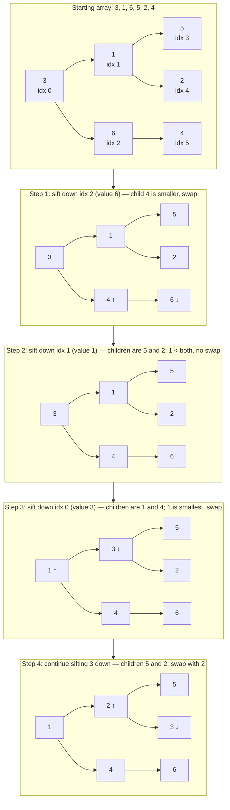

# Heapify

Why build a heap one element at a time in O(n log n) when you can do it in O(n)?

If you already have all the data up front, there is a smarter approach called **heapify**. Instead of pushing each element individually and sifting it up, you start from the middle of the array and sift down each node. The result is a valid heap in linear time.

## Why Start From the Middle?

Leaf nodes (roughly the second half of the array) are already valid one-element heaps — there is nothing to do for them. The first internal node that can actually have children is at index `(n // 2) - 1`. That is where the work begins.

For an array of length 6, index `(6 // 2) - 1 = 2` is the last internal node. We sift down from index 2, then 1, then 0.

## Step-by-Step: Heapify `[3, 1, 6, 5, 2, 4]`



Final heap array: `[1, 2, 4, 5, 3, 6]`

## Implementing Heapify From Scratch

```python,editable
def sift_down(arr, i, n):
    """Sift the element at index i down until the heap property holds."""
    while True:
        smallest = i
        left  = 2 * i + 1
        right = 2 * i + 2
        if left < n and arr[left] < arr[smallest]:
            smallest = left
        if right < n and arr[right] < arr[smallest]:
            smallest = right
        if smallest == i:
            break
        arr[i], arr[smallest] = arr[smallest], arr[i]
        i = smallest

def heapify(arr):
    """Turn arr into a valid min-heap in-place in O(n) time."""
    n = len(arr)
    # Start from the last internal node and work backwards to the root
    for i in range(n // 2 - 1, -1, -1):
        sift_down(arr, i, n)

# --- Demo ---
data = [3, 1, 6, 5, 2, 4]
print("Before heapify:", data)
heapify(data)
print("After heapify: ", data)

# Verify: extract elements in sorted order
import heapq
import copy
heap_copy = copy.copy(data)
sorted_vals = []
while heap_copy:
    # manually pop using our sift_down
    heap_copy[0], heap_copy[-1] = heap_copy[-1], heap_copy[0]
    sorted_vals.append(heap_copy.pop())
    sift_down(heap_copy, 0, len(heap_copy))
print("Elements in min order:", sorted_vals)
```

## Using Python's heapq.heapify()

`heapq.heapify()` does the same thing in-place, transforming any list into a min-heap:

```python,editable
import heapq

data = [3, 1, 6, 5, 2, 4]
print("Before:", data)

heapq.heapify(data)   # O(n), in-place
print("After: ", data)

# heapq.heapify guarantees data[0] is the minimum
print("Minimum:", data[0])

# Pull all elements out in sorted order
print("Sorted:", [heapq.heappop(data) for _ in range(len(data) + 0)])
```

## Why O(n) and Not O(n log n)?

It feels like it should be O(n log n) — we call sift_down on n/2 nodes, and sift_down is O(log n). But not every sift_down call does the same amount of work.

- Nodes near the bottom of the tree have very little room to sift down (height 0 or 1).
- Only the root can sift down the full tree height.

When you add up the actual work across all levels, the total converges to O(n). The formal proof uses the fact that there are at most n/2^(h+1) nodes at height h, each doing O(h) work — and the sum ∑ h / 2^h converges to a constant.

| Method            | Time       | When to use                         |
|-------------------|------------|-------------------------------------|
| Push n times      | O(n log n) | Elements arrive one at a time       |
| heapify once      | O(n)       | All data available at the start     |

## Real-World Applications

**Heap Sort**: heapify the array in O(n), then repeatedly extract the minimum in O(log n). Total: O(n log n) with O(1) extra space — a fully in-place sort.

```python,editable
import heapq

def heap_sort(arr):
    heapq.heapify(arr)
    return [heapq.heappop(arr) for _ in range(len(arr))]

numbers = [42, 7, 19, 3, 55, 1, 28]
print("Unsorted:", numbers)
print("Sorted:  ", heap_sort(numbers))
```

**One-time priority queue setup**: when a system starts up with a known backlog of jobs (e.g. a build system loading thousands of pending tasks from a database), heapify transforms the entire backlog into a priority queue in linear time, ready for O(log n) push/pop from that point on.
