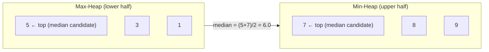
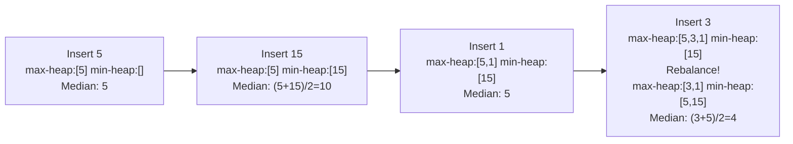
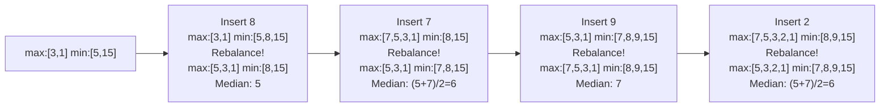

# Two Heaps

Find the median of a stream of numbers in O(log n) per insertion. As numbers arrive one by one, you must always report the current median — fast. Banks use exactly this for real-time fraud detection thresholds: if a transaction amount is above the running median by a large factor, it is flagged for review.

## Why the naive approach breaks

The median is the middle value when data is sorted. With a static array you sort once: O(n log n), then read the middle. But what if numbers keep arriving? Re-sorting after every insertion is O(n log n) per step — far too slow for a live data stream.

A sorted array insert is O(n) due to shifting. A balanced BST insert is O(log n) but finding the median requires O(log n) rank queries, and the code is complex.

The two-heaps approach achieves O(log n) insert and O(1) median — with surprisingly little code.

## The insight: split the data in half

Imagine the data sorted in a line. Draw a dividing line through the middle. Everything to the left of the line is the "lower half"; everything to the right is the "upper half."

To get the median instantly you only need to peek at the tops of each half:
- **Lower half** → stored in a **max-heap** (its top = the largest element in the lower half)
- **Upper half** → stored in a **min-heap** (its top = the smallest element in the upper half)

If both halves have the same size, the median is the average of the two tops. If one is larger by one, the median is the top of the larger heap.



The two heaps always satisfy:
1. Every element in the max-heap is ≤ every element in the min-heap.
2. The sizes differ by at most 1.

## Building up the structure: step by step

Watch the two heaps evolve as `[5, 15, 1, 3, 8, 7, 9, 2]` arrives one by one:





## The rebalancing rule

After every insertion:

1. Decide which heap to insert into: if the new number ≤ current median (or max-heap is empty), push to max-heap; otherwise push to min-heap.
2. If `len(max_heap) > len(min_heap) + 1`: move max-heap's top to min-heap.
3. If `len(min_heap) > len(max_heap)`: move min-heap's top to max-heap.

This keeps the size invariant. At most one element moves per insertion — O(log n) total.

## Implementation

Python's `heapq` module only provides a min-heap. To simulate a max-heap, negate the values before pushing and negate again when popping.

```python,editable
import heapq


class MedianFinder:
    def __init__(self):
        # max-heap for the lower half (store negated values)
        self.lower = []
        # min-heap for the upper half
        self.upper = []

    def add_num(self, num):
        # Step 1: route to the correct heap
        if not self.lower or num <= -self.lower[0]:
            heapq.heappush(self.lower, -num)
        else:
            heapq.heappush(self.upper, num)

        # Step 2: rebalance so sizes differ by at most 1
        if len(self.lower) > len(self.upper) + 1:
            heapq.heappush(self.upper, -heapq.heappop(self.lower))
        elif len(self.upper) > len(self.lower):
            heapq.heappush(self.lower, -heapq.heappop(self.upper))

    def find_median(self):
        if len(self.lower) == len(self.upper):
            return (-self.lower[0] + self.upper[0]) / 2.0
        else:
            return float(-self.lower[0])  # lower always has the extra element


mf = MedianFinder()
stream = [5, 15, 1, 3, 8, 7, 9, 2]

print(f"{'After inserting':<20} {'Lower half (max-heap)':<28} {'Upper half (min-heap)':<28} {'Median'}")
print("-" * 85)
for num in stream:
    mf.add_num(num)
    lower_view = sorted([-x for x in mf.lower], reverse=True)
    upper_view = sorted(mf.upper)
    print(f"{str(num):<20} {str(lower_view):<28} {str(upper_view):<28} {mf.find_median()}")
```

## Complexity

| Operation | Time | Space |
|---|---|---|
| `add_num` | O(log n) | — |
| `find_median` | O(1) | — |
| Total space | — | O(n) |

Compared to alternatives:

| Approach | Insert | Median |
|---|---|---|
| Sorted list | O(n) | O(1) |
| Re-sort each time | O(n log n) | O(1) |
| Two heaps | O(log n) | O(1) |
| Order-statistics tree | O(log n) | O(log n) |

## Extension: sliding window median

A harder variant: maintain the median of the last `k` elements. As new elements arrive, old ones expire. The challenge is that heaps do not support arbitrary removal efficiently.

The trick is lazy deletion: keep a dictionary of "elements to ignore." When the expired element surfaces at the top of a heap, discard it then.

```python,editable
import heapq
from collections import defaultdict


class SlidingWindowMedian:
    """
    Maintains the median of the last k elements in a stream.
    Uses lazy deletion to handle expiring elements.
    """

    def __init__(self, k):
        self.k = k
        self.lower = []           # max-heap (negated)
        self.upper = []           # min-heap
        self.invalid = defaultdict(int)   # element -> count pending removal
        self.lower_size = 0       # effective size (excluding lazy-deleted)
        self.upper_size = 0

    def _prune(self, heap):
        """Remove invalidated elements from the top of a heap."""
        while heap and self.invalid[-heap[0] if heap is self.lower else heap[0]]:
            top = -heapq.heappop(heap) if heap is self.lower else heapq.heappop(heap)
            self.invalid[top] -= 1

    def _balance(self):
        while self.lower_size > self.upper_size + 1:
            self._prune(self.lower)
            val = -heapq.heappop(self.lower)
            self.lower_size -= 1
            heapq.heappush(self.upper, val)
            self.upper_size += 1
            self._prune(self.upper)
        while self.upper_size > self.lower_size:
            self._prune(self.upper)
            val = heapq.heappop(self.upper)
            self.upper_size -= 1
            heapq.heappush(self.lower, -val)
            self.lower_size += 1
            self._prune(self.lower)

    def insert(self, num):
        self._prune(self.lower)
        if not self.lower or num <= -self.lower[0]:
            heapq.heappush(self.lower, -num)
            self.lower_size += 1
        else:
            heapq.heappush(self.upper, num)
            self.upper_size += 1
        self._balance()

    def remove(self, num):
        self.invalid[num] += 1
        self._prune(self.lower)
        if self.lower and num <= -self.lower[0]:
            self.lower_size -= 1
        else:
            self.upper_size -= 1
        self._balance()

    def get_median(self):
        self._prune(self.lower)
        self._prune(self.upper)
        if self.lower_size == self.upper_size:
            return (-self.lower[0] + self.upper[0]) / 2.0
        return float(-self.lower[0])


nums = [1, 3, -1, -3, 5, 3, 6, 7]
k = 3
swm = SlidingWindowMedian(k)
medians = []

for i, num in enumerate(nums):
    swm.insert(num)
    if i >= k - 1:
        medians.append(swm.get_median())
        swm.remove(nums[i - k + 1])

print("Array:   ", nums)
print(f"k = {k}")
print("Medians: ", medians)
# Expected: [1.0, -1.0, -1.0, 3.0, 5.0, 6.0]
```

## Real-world uses

**Real-time fraud detection** — a bank streams transactions and maintains a running median transaction amount. A new transaction at 50× the median triggers an alert. The threshold must update in real time as new transactions arrive.

**Median response time monitoring** — infrastructure dashboards (Datadog, Prometheus) display the P50 (median) and P95 latency for API endpoints. Requests arrive continuously; recomputing from scratch is not feasible.

**Financial data streams** — algorithmic trading systems track the median bid-ask spread over a rolling window. The two-heaps structure handles the constant stream of tick data efficiently.

**Sensor data processing** — IoT pipelines use running medians (rather than means) as a noise-resistant summary statistic. The median is unaffected by a single faulty sensor reading; the mean is not.

**A/B testing running statistics** — experimentation platforms compute the median conversion value for each variant as events stream in, updating significance tests without storing the full event history.
