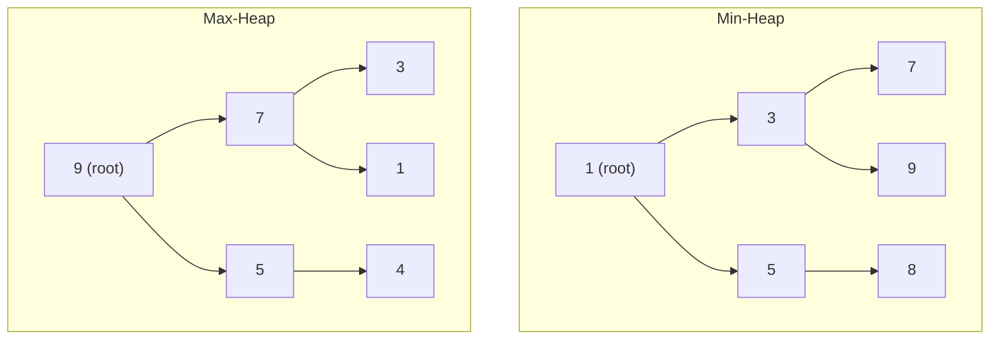

# Heap / Priority Queue

Think about the emergency room triage system — the most critical patient is always treated first, no matter when they arrived. That's a priority queue. It doesn't care about arrival order; it always surfaces the most important item next.

A **heap** is the data structure that makes a priority queue work in O(log n) time. It looks like a binary tree, but is stored in a plain array — making it both memory-efficient and cache-friendly.

## Min-Heap vs Max-Heap

There are two flavours:

- **Min-heap**: the smallest value is always at the top (root). Every parent is less than or equal to its children.
- **Max-heap**: the largest value is always at the top. Every parent is greater than or equal to its children.



The heap **property** is the single rule that defines a heap: every parent must maintain its order relationship with its children. The heap does not require the left and right subtrees to be sorted relative to each other — only that each parent beats its own children.

## Heaps in Python

Python's standard library provides a min-heap through the `heapq` module. There is no built-in max-heap, but you can simulate one by negating values.

```python,editable
import heapq

# --- Min-heap ---
tasks = []
heapq.heappush(tasks, (3, "Write tests"))
heapq.heappush(tasks, (1, "Fix production bug"))   # highest priority
heapq.heappush(tasks, (2, "Code review"))

print("Min-heap order (priority, task):")
while tasks:
    print(" ", heapq.heappop(tasks))

# --- Max-heap trick: negate the priority ---
scores = []
heapq.heappush(scores, -95)
heapq.heappush(scores, -72)
heapq.heappush(scores, -88)

print("\nMax-heap (highest score first):")
while scores:
    print(" ", -heapq.heappop(scores))
```

## What Makes Heaps Special

| Operation      | Heap     | Sorted Array | Unsorted Array |
|----------------|----------|--------------|----------------|
| Find min/max   | O(1)     | O(1)         | O(n)           |
| Insert         | O(log n) | O(n)         | O(1)           |
| Remove min/max | O(log n) | O(n)         | O(n)           |
| Build from n elements | O(n) | O(n log n) | O(1)          |

Heaps are the sweet spot when you need to repeatedly find and remove the minimum (or maximum) element efficiently.

## What You Will Learn

- **Heap Properties** — how a heap is structured as a tree and stored as an array, and the index arithmetic that makes it work.
- **Push and Pop** — how inserting and removing elements maintains the heap property through sift-up and sift-down operations.
- **Heapify** — how to turn any unsorted array into a valid heap in O(n) time, which is faster than inserting elements one by one.
