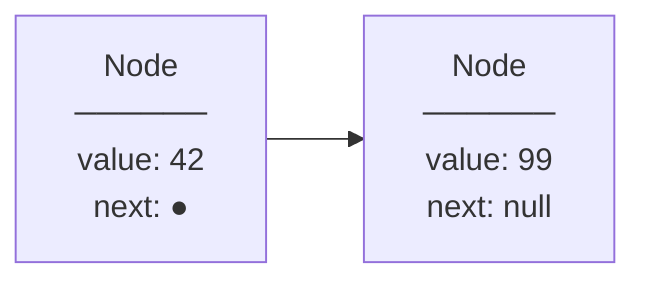
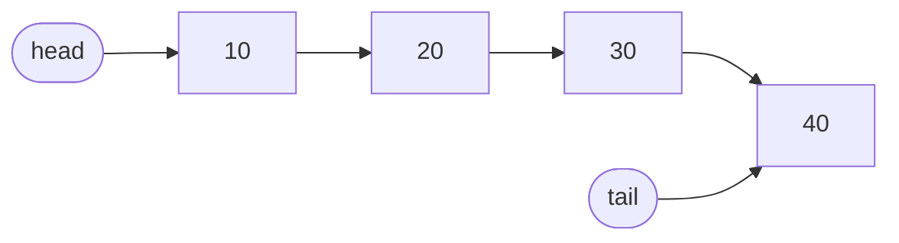
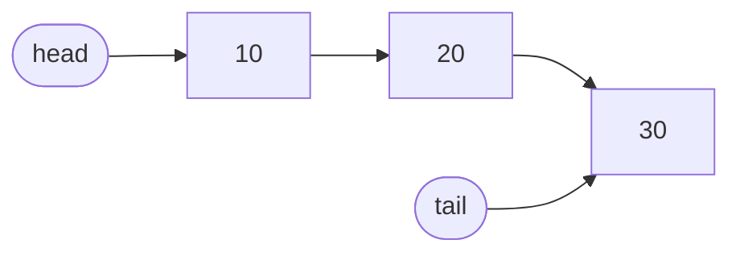
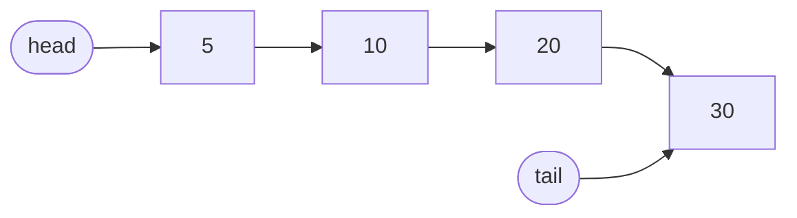
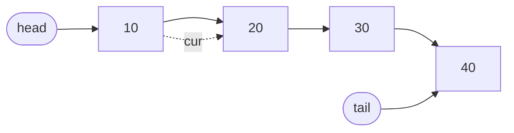

# Singly Linked Lists

Twitter's original feed didn't load all tweets at once. It kept a pointer to the latest tweet, and each tweet pointed to the one before it. That's a singly linked list — a chain where every node knows only the next step forward, never back.

## The Node: The Fundamental Building Block

Every singly linked list is made of nodes. A node is just a small object that holds two things: its **value**, and a **pointer to the next node**.



In Python:

```python,editable
class Node:
    def __init__(self, value):
        self.value = value
        self.next = None   # points to the next Node, or None if last

# Create two nodes and link them manually
a = Node(42)
b = Node(99)
a.next = b  # a now points to b

print(a.value)        # 42
print(a.next.value)   # 99 — reached b through a's pointer
print(b.next)         # None — b is the last node
```

## Chaining Nodes into a List

Once you have nodes, a **list** just needs to remember where the chain starts (the **head**) and where it ends (the **tail**).



Keeping a `tail` pointer is a small trick with a big payoff — it lets us append in O(1) instead of walking the entire chain every time.

## Building a Full Singly Linked List

Let's implement `append`, `prepend`, `delete`, `search`, and `traverse` step by step.

```python,editable
class Node:
    def __init__(self, value):
        self.value = value
        self.next = None


class SinglyLinkedList:
    def __init__(self):
        self.head = None
        self.tail = None
        self.length = 0

    # O(1) — tail pointer means no walking needed
    def append(self, value):
        node = Node(value)
        if self.head is None:
            self.head = self.tail = node
        else:
            self.tail.next = node
            self.tail = node
        self.length += 1

    # O(1) — just rewire the head pointer
    def prepend(self, value):
        node = Node(value)
        node.next = self.head
        self.head = node
        if self.tail is None:
            self.tail = node
        self.length += 1

    # O(n) — must walk to find the node before the target
    def delete(self, value):
        if self.head is None:
            return False
        if self.head.value == value:
            self.head = self.head.next
            if self.head is None:
                self.tail = None
            self.length -= 1
            return True
        cur = self.head
        while cur.next:
            if cur.next.value == value:
                if cur.next == self.tail:
                    self.tail = cur
                cur.next = cur.next.next
                self.length -= 1
                return True
            cur = cur.next
        return False

    # O(n) — scan from head until found or end
    def search(self, value):
        cur = self.head
        index = 0
        while cur:
            if cur.value == value:
                return index
            cur = cur.next
            index += 1
        return -1

    # O(n) — visit every node once
    def traverse(self):
        result = []
        cur = self.head
        while cur:
            result.append(cur.value)
            cur = cur.next
        return result


ll = SinglyLinkedList()
ll.append(20)
ll.append(30)
ll.append(40)
ll.prepend(10)

print("List:         ", ll.traverse())
print("Length:       ", ll.length)
print("Search 30:    index", ll.search(30))
print("Search 99:    index", ll.search(99))

ll.delete(30)
print("After delete 30:", ll.traverse())

ll.delete(10)   # deleting head
print("After delete 10:", ll.traverse())
```

## What Happens During Prepend (O(1))

Prepending is instant — no matter how long the list is, it's always just two pointer updates.

**Before** prepending `5`:


**After** prepending `5`:


Only the `head` pointer and the new node's `next` change. Zero existing nodes are touched.

## What Happens During Delete (O(n))

Deletion requires finding the node *before* the target — that's the O(n) walk. Once found, it's a single pointer update.

**Before** deleting `20`:


**After** deleting `20`:


Node `10`'s `next` pointer skips over `20` and points directly to `30`. The deleted node becomes unreachable and is garbage collected.

## Time Complexity Summary

| Operation | Time | Why |
|-----------|------|-----|
| `prepend` | O(1) | Rewire head only |
| `append` | O(1) | Tail pointer available |
| `delete` | O(n) | Must find predecessor |
| `search` | O(n) | Sequential scan |
| `traverse` | O(n) | Visit every node |
| Access by index | O(n) | No direct addressing |

> **Without a tail pointer**, `append` would require walking the entire list each time — making `n` appends cost O(n²) total. Always keep a `tail`.

## Real-World: Undo History in Text Editors

When you type in a text editor, each keystroke or action is pushed onto a singly linked list. The "undo" operation pops from the head — O(1), instant, regardless of how many changes you've made. That's why undo never slows down no matter how deep your history is.

```python,editable
class Node:
    def __init__(self, value):
        self.value = value
        self.next = None

class UndoHistory:
    """A minimal undo stack built on a singly linked list."""

    def __init__(self):
        self.head = None

    def push(self, action):
        node = Node(action)
        node.next = self.head
        self.head = node
        print(f"  Did: {action}")

    def undo(self):
        if self.head is None:
            print("  Nothing to undo.")
            return
        action = self.head.value
        self.head = self.head.next
        print(f"  Undid: {action}")

    def current_state(self):
        actions = []
        cur = self.head
        while cur:
            actions.append(cur.value)
            cur = cur.next
        return actions


history = UndoHistory()
history.push("type 'Hello'")
history.push("bold text")
history.push("change font size to 14")

print("History (most recent first):", history.current_state())
history.undo()
history.undo()
print("History after 2 undos:", history.current_state())
```
