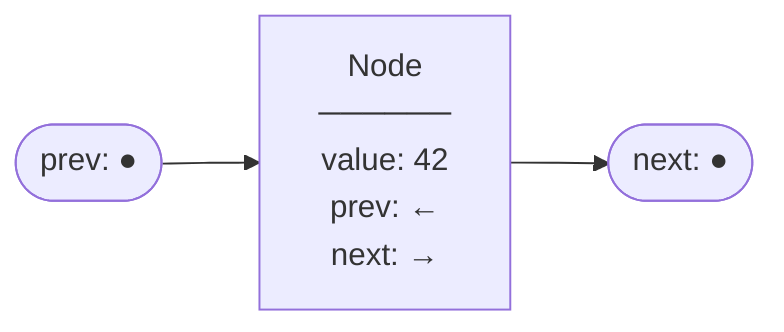
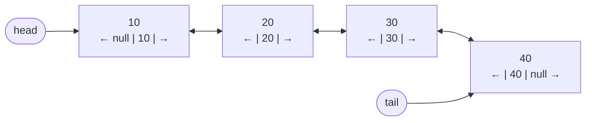
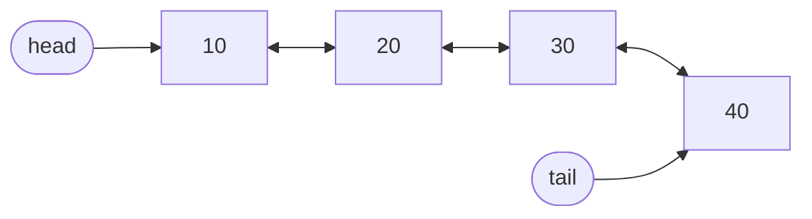
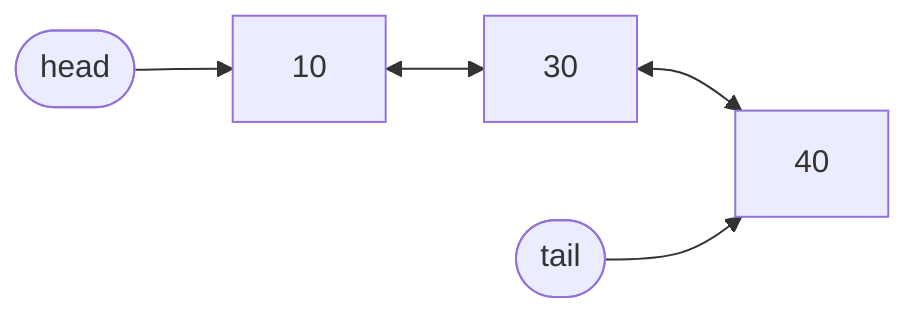

# Doubly Linked Lists

A singly linked list is a one-way street. You can drive forward, but if you miss a turn you have to go all the way back to the start. A doubly linked list adds a second lane: every node knows both its **next** neighbour and its **previous** neighbour. Now you can travel in either direction.

## The Doubly-Linked Node

Each node now carries three pieces of information:



In Python:

```python,editable
class Node:
    def __init__(self, value):
        self.value = value
        self.prev = None   # points to the previous node
        self.next = None   # points to the next node

a = Node(10)
b = Node(20)
c = Node(30)

# Link forward
a.next = b
b.next = c

# Link backward
b.prev = a
c.prev = b

# Traverse forward
cur = a
while cur:
    print("forward:", cur.value)
    cur = cur.next

# Traverse backward from tail
cur = c
while cur:
    print("backward:", cur.value)
    cur = cur.prev
```

## The Full Structure

With both `head` and `tail` pointers, we can enter the list from either end in O(1).



## Full Implementation

```python,editable
class Node:
    def __init__(self, value):
        self.value = value
        self.prev = None
        self.next = None


class DoublyLinkedList:
    def __init__(self):
        self.head = None
        self.tail = None
        self.length = 0

    # O(1)
    def append(self, value):
        node = Node(value)
        if self.tail is None:
            self.head = self.tail = node
        else:
            node.prev = self.tail
            self.tail.next = node
            self.tail = node
        self.length += 1

    # O(1)
    def prepend(self, value):
        node = Node(value)
        if self.head is None:
            self.head = self.tail = node
        else:
            node.next = self.head
            self.head.prev = node
            self.head = node
        self.length += 1

    # O(1) when you already have the node reference
    def delete_node(self, node):
        if node.prev:
            node.prev.next = node.next
        else:
            self.head = node.next  # deleting head

        if node.next:
            node.next.prev = node.prev
        else:
            self.tail = node.prev  # deleting tail

        self.length -= 1
        return node.value

    # O(1) — tail pointer + prev pointer makes this instant
    def delete_tail(self):
        if self.tail is None:
            return None
        return self.delete_node(self.tail)

    # O(1)
    def delete_head(self):
        if self.head is None:
            return None
        return self.delete_node(self.head)

    def traverse_forward(self):
        result = []
        cur = self.head
        while cur:
            result.append(cur.value)
            cur = cur.next
        return result

    def traverse_backward(self):
        result = []
        cur = self.tail
        while cur:
            result.append(cur.value)
            cur = cur.prev
        return result


dll = DoublyLinkedList()
for v in [10, 20, 30, 40]:
    dll.append(v)

print("Forward: ", dll.traverse_forward())
print("Backward:", dll.traverse_backward())

dll.delete_tail()
print("After delete_tail:", dll.traverse_forward())

dll.delete_head()
print("After delete_head:", dll.traverse_forward())
```

## Why O(1) Delete Is a Big Deal

In a singly linked list, deleting a node requires finding its *predecessor* — you have to walk from the head. With a doubly linked list, every node already knows its predecessor via `prev`. If you have a reference to the node, deletion is just four pointer updates, no searching.

**Before** deleting node `20`:


**After** deleting node `20`:


Node `10`'s `next` skips to `30`, and node `30`'s `prev` points back to `10`. Done in O(1).

## Forward and Backward Traversal in Action

```python,editable
class Node:
    def __init__(self, value):
        self.value = value
        self.prev = None
        self.next = None

class DoublyLinkedList:
    def __init__(self):
        self.head = None
        self.tail = None

    def append(self, value):
        node = Node(value)
        if self.tail is None:
            self.head = self.tail = node
        else:
            node.prev = self.tail
            self.tail.next = node
            self.tail = node

    def traverse_forward(self):
        result, cur = [], self.head
        while cur:
            result.append(cur.value)
            cur = cur.next
        return result

    def traverse_backward(self):
        result, cur = [], self.tail
        while cur:
            result.append(cur.value)
            cur = cur.prev
        return result


pages = DoublyLinkedList()
for page in ["google.com", "wikipedia.org", "python.org", "docs.python.org"]:
    pages.append(page)

print("Forward (browser history):", pages.traverse_forward())
print("Backward (hitting Back):  ", pages.traverse_backward())
```

## Time Complexity Summary

| Operation | Time | Why |
|-----------|------|-----|
| `prepend` | O(1) | Rewire head + new node's next |
| `append` | O(1) | Tail pointer available |
| `delete_head` | O(1) | head.next becomes new head |
| `delete_tail` | O(1) | tail.prev becomes new tail |
| `delete_node(node)` | O(1) | Node already knows its neighbours |
| `search` | O(n) | Still a sequential scan |
| Traverse forward | O(n) | Visit every node |
| Traverse backward | O(n) | Visit every node via prev |

> The extra `prev` pointer costs one more memory reference per node. The payoff is O(1) deletion from any position (given the node) and bidirectional traversal.

## Real-World Uses

**Browser forward/back navigation** is the textbook example. Each visited page is a node. The Back button follows `prev` pointers; the Forward button follows `next` pointers.

**Python's `collections.deque`** is implemented as a doubly linked list under the hood. That's why both `appendleft`/`popleft` and `append`/`pop` are O(1).

**LRU Cache** (Least Recently Used) is one of the most common interview problems. It combines a doubly linked list with a hash map: the list orders items by recency, and the hash map gives O(1) access to any node. When you access an item, you can unlink it from its current position and relink it at the front — all O(1) thanks to the `prev` pointer.

```python,editable
# Python's deque IS a doubly linked list
from collections import deque

browser_history = deque()

# Visit pages (append to right = go forward)
for page in ["home", "search", "article", "comments"]:
    browser_history.append(page)
    print(f"Visited: {page}")

print("\nHistory:", list(browser_history))

# Hit Back button (pop from right)
current = browser_history.pop()
print(f"\nBack from: {current}")
print("History:", list(browser_history))

# Go forward again
browser_history.append(current)
print(f"Forward to: {current}")
print("History:", list(browser_history))
```
